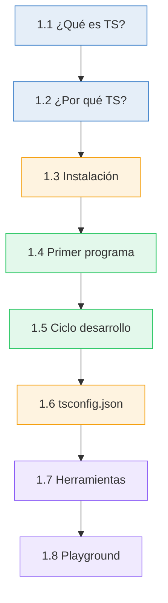
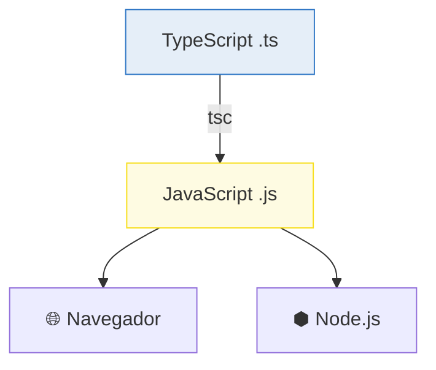
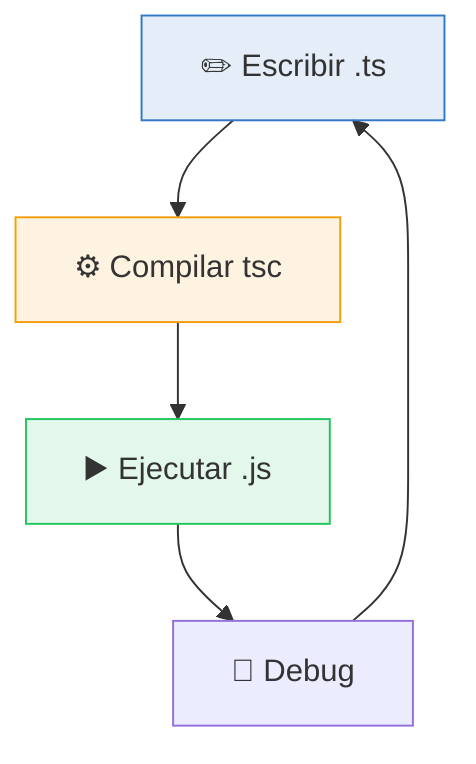
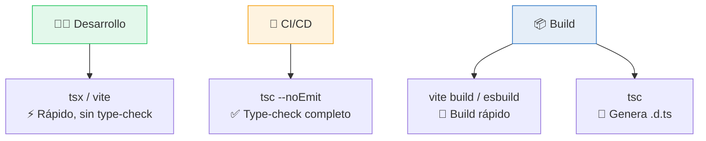

# :wave: Capítulo 1: Bienvenido a TypeScript

<div class="chapter-meta">
  <span class="meta-item">🕐 2-3 horas</span>
  <span class="meta-item">📊 Nivel: Principiante</span>
  <span class="meta-item">🎯 Semana 1</span>
</div>

<div class="chapter-objective">
  <span class="objective-icon">📌</span>
  <span class="objective-text">Al terminar este capítulo, sabrás qué es TypeScript, por qué usarlo, y habrás configurado tu entorno y ejecutado tu primer programa.</span>
</div>

<div class="chapter-map">
<h4>🗺️ Mapa del capítulo</h4>



</div>

!!! quote "Contexto"
    Si vienes de Python, ya sabes lo frustrante que es encontrar un bug por un tipo incorrecto en producción. TypeScript es como tener un linter con superpoderes que revisa tu código **ANTES** de ejecutarlo. Imagina que Python tuviera type hints obligatorios y que fallara al compilar si los tipos no cuadran: eso es TypeScript.

---

## 1.1 ¿Qué es TypeScript?

TypeScript es un **superset de JavaScript** creado por Microsoft en 2012. Esto significa que todo código JavaScript válido es automáticamente código TypeScript válido, pero TypeScript añade un sistema de **tipos estáticos** que se verifica en tiempo de compilación.



<div class="comparison" markdown>
<div class="lang-box python" markdown>

#### :snake: En Python

Python tiene type hints opcionales (PEP 484) que herramientas como `mypy` pueden verificar, pero el intérprete **los ignora**: `x: int = "hola"` se ejecuta sin error.

</div>
<div class="lang-box typescript" markdown>

#### 🔷 En TypeScript

Los tipos son verificados por el compilador. Si escribes `let x: number = "hola"`, el código **NO compila**. Es como tener `mypy` integrado y obligatorio.

</div>
</div>

<div class="concept-question">
<h4>🤔 Pregunta conceptual</h4>
<p>Si JavaScript ya funciona en todos los navegadores y Node.js, ¿por qué necesitaríamos añadir tipos? ¿Qué problemas causan los tipos dinámicos en proyectos grandes?</p>
</div>

## 1.2 ¿Por qué TypeScript si ya sé JavaScript?

JavaScript fue diseñado en 10 días para validar formularios. Hoy construimos aplicaciones empresariales con él. TypeScript cierra la brecha entre lo que JavaScript *es* y lo que *necesitamos* que sea.

- **:zap: Autocompletado inteligente** — tu editor sabe exactamente qué propiedades tiene cada objeto
- **:shield: Errores en tiempo de compilación** — encuentra bugs antes de que lleguen a producción
- **:book: Documentación viva** — los tipos son la mejor documentación: siempre están actualizados
- **:arrows_counterclockwise: Refactoring seguro** — renombra una propiedad y el compilador te dice todos los lugares que rompes
- **:rocket: Escalabilidad** — imprescindible en proyectos grandes como MakeMenu (el proyecto SaaS de gestión de restaurantes que construiremos en la Parte IV)

!!! info "Dato clave"
    En la [encuesta de Stack Overflow 2024](https://survey.stackoverflow.co/2024/), TypeScript está entre los 5 lenguajes más amados y más deseados por desarrolladores.

## 1.3 Instalación y configuración

### Instalación global

```bash
npm install -g typescript
tsc --version  # Debería mostrar Version 5.x
```

### Proyecto nuevo

```bash
mkdir mi-proyecto && cd mi-proyecto
npm init -y
npm install -D typescript
npx tsc --init  # Crea tsconfig.json
```

<div class="comparison" markdown>
<div class="lang-box python" markdown>

#### :snake: En Python

```bash
python -m venv venv
source venv/bin/activate
pip install -r requirements.txt
```

</div>
<div class="lang-box typescript" markdown>

#### 🔷 En TypeScript

```bash
npm init -y
npm install -D typescript
npx tsc --init  # Genera tsconfig.json
```

</div>
</div>

### tsconfig.json esencial

```typescript title="tsconfig.json" hl_lines="4"
{
  "compilerOptions": {
    "target": "ES2022",
    "module": "ESNext",
    "strict": true,           // (1)!
    "esModuleInterop": true,
    "skipLibCheck": true,
    "outDir": "./dist",
    "rootDir": "./src",
    "declaration": true        // (2)!
  },
  "include": ["src/**/*"]
}
```

1. :fire: **Siempre usa `strict: true`**. Es como aprender a conducir sin asistencias: al principio cuesta más, pero aprendes de verdad.
2. Genera archivos `.d.ts` con los tipos para que otros puedan usarlos.

!!! tip "Consejo de aprendizaje"
    Si desactivas `strict`, TypeScript se convierte en JavaScript con pasos extra. Mantén `strict: true` siempre, especialmente al aprender.

## 1.4 Tu primer programa TypeScript

=== "TypeScript"

    ```typescript title="src/hello.ts"
    function greet(name: string, age: number): string {
      return `Hola ${name}, tienes ${age} años`;
    }

    console.log(greet("Daniele", 22));
    // console.log(greet("Daniele", "veintidós")); // ❌ ERROR de compilación!
    ```

=== "Python equivalente"

    ```python title="hello.py"
    def greet(name: str, age: int) -> str:
        return f'Hola {name}, tienes {age} años'

    print(greet('Daniele', 22))
    print(greet('Daniele', 'veintidós'))  # ⚠️ Python NO da error!
    ```

<div class="misconception-box" markdown>
<h4>❌ Error común</h4>
<p><strong>Mito:</strong> "TypeScript ralentiza el desarrollo"</p>
<p><strong>Realidad:</strong> La inversión inicial en aprender tipos se recupera con creces en refactoring seguro, autocompletado inteligente y menos bugs en producción. Los equipos que adoptan TypeScript reportan consistentemente menos errores en producción y mayor velocidad de desarrollo a largo plazo.</p>
</div>

<div class="code-evolution">
<div class="evolution-header">🔄 Evolución del código</div>
<div class="evolution-step">
<span class="step-label novato">v1 — Novato</span>

```javascript title="Sin tipos (JavaScript puro)"
function greet(name, age) {
  return "Hola " + name + ", tienes " + age + " años";
}
```

</div>
<div class="evolution-step">
<span class="step-label mejorado">v2 — Con tipos básicos</span>

```typescript title="Con anotaciones de tipo"
function greet(name: string, age: number): string {
  return `Hola ${name}, tienes ${age} años`;
}
```

</div>
<div class="evolution-step">
<span class="step-label profesional">v3 — Profesional</span>

```typescript title="Con parámetros opcionales y valores por defecto"
function greet(
  name: string,
  age: number,
  saludo: string = "Hola"
): string {
  return `${saludo} ${name}, tienes ${age} años`;
}

// Todas estas llamadas son válidas:
greet("Daniele", 22);              // "Hola Daniele, tienes 22 años"
greet("Daniele", 22, "Buenos días"); // "Buenos días Daniele, tienes 22 años"
```

</div>
</div>

<div class="micro-exercise">
<h4>✏️ Micro-ejercicio (2 min)</h4>
<p>Modifica la función <code>greet</code> para que también acepte un parámetro opcional <code>saludo: string</code> con valor por defecto <code>'Hola'</code>. Ejecuta con <code>npx tsx src/hello.ts</code> y prueba a llamarla con y sin el tercer argumento.</p>
</div>

## 1.5 El ciclo de desarrollo

```bash
# Compilar y ejecutar manualmente
npx tsc src/hello.ts
node src/hello.js

# O usar tsx para desarrollo rápido (recomendado)
npx tsx src/hello.ts

# Watch mode (recompila al guardar)
npx tsc --watch
```



<div class="micro-exercise">
<h4>✏️ Micro-ejercicio (2 min)</h4>
<p>Abre el <a href="https://www.typescriptlang.org/play">TypeScript Playground</a>, escribe <code>let x = 5</code> y pasa el ratón sobre <code>x</code>. ¿Qué tipo infiere TypeScript? Ahora cambia a <code>let x = '5'</code> — ¿qué cambia?</p>
</div>

<div class="concept-question">
<h4>🤔 Pregunta conceptual</h4>
<p>¿Qué pasaría si pudieras configurar EXACTAMENTE cuánto de estricto quieres que sea tu compilador? ¿Preferirías máxima libertad o máxima seguridad?</p>
</div>

## 1.6 `tsconfig.json` en profundidad

El archivo `tsconfig.json` es el **cerebro** de tu proyecto TypeScript. Controla cómo el compilador verifica y transforma tu código. Aquí están las opciones más importantes que debes conocer:

### Opciones de `strict`

Cuando activas `strict: true`, en realidad estás activando **todas** estas flags de una vez:

```json title="tsconfig.json — Lo que strict: true activa"
{
  "compilerOptions": {
    "strict": true,
    // Equivale a activar TODAS las siguientes:
    "noImplicitAny": true,            // (1)!
    "strictNullChecks": true,          // (2)!
    "strictFunctionTypes": true,       // (3)!
    "strictBindCallApply": true,       // (4)!
    "strictPropertyInitialization": true, // (5)!
    "noImplicitThis": true,            // (6)!
    "alwaysStrict": true,              // (7)!
    "useUnknownInCatchVariables": true  // (8)!
  }
}
```

1. Prohíbe variables/parámetros sin tipo que serían `any` implícito
2. `null` y `undefined` no son asignables a otros tipos — **la más importante**
3. Verifica que los tipos de funciones sean compatibles correctamente (covarianza/contravarianza)
4. Verifica tipos en `.call()`, `.bind()` y `.apply()`
5. Propiedades de clase deben inicializarse en el constructor
6. Prohíbe `this` con tipo implícito `any`
7. Emite `"use strict"` en cada archivo
8. Variables en `catch` son `unknown` en lugar de `any`

!!! danger "No hagas esto"
    Nunca desactives `strictNullChecks`. Es la flag que más bugs previene. Sin ella, `null` y `undefined` son asignables a cualquier tipo, lo cual es una receta para `TypeError: Cannot read property of null` en producción.

### Opciones de módulos y target

```json title="tsconfig.json — Módulos y compilación"
{
  "compilerOptions": {
    "target": "ES2022",               // (1)!
    "module": "ESNext",               // (2)!
    "moduleResolution": "bundler",     // (3)!
    "esModuleInterop": true,           // (4)!
    "isolatedModules": true,           // (5)!
    "resolveJsonModule": true          // (6)!
  }
}
```

1. Qué versión de JS emitir. `ES2022` incluye top-level await, `.at()`, etc.
2. Sistema de módulos. `ESNext` para proyectos con bundler (Vite, webpack)
3. `"bundler"` para Vite/webpack, `"node16"` para Node.js puro
4. Permite `import x from "modulo"` con módulos CommonJS
5. Cada archivo se compila independientemente — requerido por Vite, esbuild, swc
6. Permite hacer `import data from "./data.json"`

### Opciones de calidad de código

```json title="tsconfig.json — Calidad extra"
{
  "compilerOptions": {
    "noUnusedLocals": true,            // (1)!
    "noUnusedParameters": true,        // (2)!
    "noUncheckedIndexedAccess": true,  // (3)!
    "noFallthroughCasesInSwitch": true, // (4)!
    "forceConsistentCasingInFileNames": true // (5)!
  }
}
```

1. Error si declaras una variable y no la usas
2. Error si un parámetro de función no se usa (prefija con `_` para ignorar)
3. :fire: **Muy recomendada.** Acceder a un array por índice devuelve `T | undefined` en vez de `T`
4. Obliga a poner `break` o `return` en cada `case` del `switch`
5. `import "./Mesa"` y `import "./mesa"` deben ser consistentes (importante en Linux vs Mac)

!!! tip "Mi tsconfig recomendado para MakeMenu"
    ```json
    {
      "compilerOptions": {
        "target": "ES2022",
        "module": "ESNext",
        "moduleResolution": "bundler",
        "strict": true,
        "noUncheckedIndexedAccess": true,
        "noUnusedLocals": true,
        "noUnusedParameters": true,
        "esModuleInterop": true,
        "isolatedModules": true,
        "resolveJsonModule": true,
        "skipLibCheck": true,
        "outDir": "./dist",
        "rootDir": "./src",
        "declaration": true
      },
      "include": ["src/**/*"],
      "exclude": ["node_modules", "dist"]
    }
    ```

<div class="pro-tip">
<h4>💡 Consejo Pro</h4>
<p>En proyectos reales, usa <code>noUncheckedIndexedAccess: true</code> SIEMPRE. Esta opción previene el error #1 en producción: acceder a <code>array[index]</code> sin verificar si es <code>undefined</code>. La mayoría de bugs de <code>TypeError: Cannot read property of undefined</code> desaparecen con esta flag.</p>
</div>

<div class="comparison" markdown>
<div class="lang-box python" markdown>

#### :snake: En Python

La configuración de mypy va en `mypy.ini` o `pyproject.toml`. Equivalente a strict:
```ini
[mypy]
strict = True
disallow_untyped_defs = True
```

</div>
<div class="lang-box typescript" markdown>

#### 🔷 En TypeScript

`tsconfig.json` controla compilación Y verificación de tipos. Es más potente que mypy porque además genera el JavaScript de salida.

</div>
</div>

## 1.7 Herramientas de desarrollo

No solo existe `tsc`. Hay varias herramientas para ejecutar TypeScript, cada una con sus ventajas:

| Herramienta | Velocidad | Type-checking | Uso ideal |
|-------------|-----------|---------------|-----------|
| `tsc` | Lenta | Sí | Build de producción, CI/CD |
| `tsx` | Rápida | No | Desarrollo local, scripts |
| `ts-node` | Media | Configurable | Scripts Node.js, REPL |
| `esbuild` | Muy rápida | No | Bundling, build rápido |
| `swc` | Muy rápida | No | Alternativa a Babel/esbuild |
| `vite` | Rápida | No (usa esbuild) | Proyectos frontend (Vue, React) |

```bash
# tsc: compilador oficial — verifica tipos y genera JS
npx tsc && node dist/index.js

# tsx: ejecuta TS directamente — NO verifica tipos
npx tsx src/index.ts

# ts-node: ejecuta TS con soporte para configuración avanzada
npx ts-node src/index.ts

# vite: servidor de desarrollo para frontend
npm create vite@latest mi-app -- --template vue-ts
cd mi-app && npm run dev
```

!!! warning "Cuidado"
    `tsx`, `esbuild`, `swc` y `vite` **NO verifican tipos**. Solo compilan. Siempre ejecuta `tsc --noEmit` en tu CI/CD para verificar tipos, aunque uses otra herramienta para desarrollo local.



<div class="misconception-box">
<h4>⚠️ Errores comunes</h4>
<ul>
<li><span class="wrong">❌ Mito:</span> "TypeScript es un lenguaje completamente diferente a JavaScript" → <span class="right">✅ Realidad:</span> Todo JavaScript válido ES TypeScript válido. TypeScript es un superset.</li>
<li><span class="wrong">❌ Mito:</span> "Los tipos hacen que el código sea más lento" → <span class="right">✅ Realidad:</span> Los tipos se eliminan al compilar. El JS resultante es idéntico en rendimiento.</li>
<li><span class="wrong">❌ Mito:</span> "Si uso <code>tsx</code> para ejecutar, los tipos se verifican" → <span class="right">✅ Realidad:</span> <code>tsx</code> solo transpila, NO verifica tipos. Necesitas <code>tsc --noEmit</code> para eso.</li>
</ul>
</div>

<div class="pro-tip">
<h4>💡 Consejo Pro</h4>
<p>En equipos profesionales, la estrategia estándar es: <code>tsx</code> o <code>vite</code> para desarrollo local (velocidad), <code>tsc --noEmit</code> en pre-commit hooks (seguridad), y <code>tsc</code> en CI/CD (build final). Nunca hagas deploy sin verificar tipos.</p>
</div>

## 1.8 TypeScript Playground

El [TypeScript Playground](https://www.typescriptlang.org/play) es tu mejor amigo para experimentar. Es un editor online que compila TypeScript en tiempo real y muestra los tipos inferidos.

**Características clave:**

- **Hover para ver tipos** — pasa el ratón sobre cualquier variable para ver su tipo inferido
- **Panel de errores** — muestra errores de compilación en tiempo real
- **Compartir links** — cada configuración genera una URL única para compartir
- **Versiones de TS** — puedes probar código con diferentes versiones del compilador
- **Exportar** — genera el código JavaScript equivalente en el panel derecho

!!! tip "Truco: `@ts-expect-error`"
    En el Playground y en tu código, usa `// @ts-expect-error` antes de una línea para indicar que **esperas** un error de tipo. Si la línea NO da error, TypeScript te avisa. Es perfecto para tests:

    ```typescript
    // @ts-expect-error — debe fallar: string no es number
    const x: number = "hola";
    ```

---

<div class="connection-box">
<span class="connection-icon">🔗</span>
<span>En el <a href="../02-tipos-basicos/">Capítulo 2</a> profundizaremos en los tipos que acabas de ver. Aprenderás <code>number</code>, <code>string</code>, <code>boolean</code>, arrays, tuplas y el temido <code>any</code>.</span>
</div>

<div class="connection-box">
<span class="connection-icon">🔗</span>
<span>Todo lo que has configurado aquí — <code>tsconfig.json</code>, <code>strict: true</code>, herramientas de desarrollo — lo usarás directamente cuando construyas <strong>MakeMenu</strong>, el proyecto real de los Capítulos 14-16. Cada concepto de este capítulo tiene aplicación directa en producción.</span>
</div>

<div class="ejercicio-guiado">
<h4>🏋️ Ejercicio guiado</h4>

Configura un proyecto TypeScript completo desde cero y verifica que todo funciona:

1. Crea una carpeta `ts-setup-test` e inicializa un proyecto con `npm init -y`
2. Instala TypeScript y tsx como dependencias de desarrollo
3. Genera `tsconfig.json` con `npx tsc --init` y configura `strict: true`, `outDir: "./dist"`, `rootDir: "./src"`
4. Crea `src/index.ts` con una función `saludar(nombre: string): string` que devuelva un saludo
5. Ejecuta con `npx tsx src/index.ts` — debe funcionar sin errores
6. Compila con `npx tsc` — verifica que se genera `dist/index.js`
7. Ejecuta la versión compilada con `node dist/index.js`

??? success "Solución completa"
    ```bash
    mkdir ts-setup-test && cd ts-setup-test
    npm init -y
    npm install -D typescript tsx
    npx tsc --init
    mkdir src
    ```

    Edita `tsconfig.json`:
    ```json
    {
      "compilerOptions": {
        "target": "ES2022",
        "module": "ESNext",
        "strict": true,
        "outDir": "./dist",
        "rootDir": "./src"
      },
      "include": ["src/**/*"]
    }
    ```

    ```typescript title="src/index.ts"
    function saludar(nombre: string): string {
      return `¡Hola, ${nombre}! Tu entorno TypeScript funciona correctamente.`;
    }

    console.log(saludar("Daniele"));
    ```

    ```bash
    npx tsx src/index.ts    # Ejecución directa
    npx tsc                  # Compilación
    node dist/index.js       # Ejecutar JS compilado
    ```

</div>

<div class="real-errors">
<h4>🚨 Errores que vas a encontrar</h4>

Estos son errores reales del compilador de TypeScript que encontrarás al trabajar con los conceptos de este capítulo. Aprende a leerlos ahora para no perder tiempo después.

---

**Error 1: Tipo incompatible en asignación**

```typescript
let edad: number = "veintidos";
```

```
error TS2322: Type 'string' is not assignable to type 'number'.
```

**Explicación:** Declaraste que `edad` es de tipo `number`, pero le asignaste un `string`. TypeScript no convierte tipos automáticamente como lo haría JavaScript en tiempo de ejecución.

**Solución:**
```typescript
let edad: number = 22;
```

---

**Error 2: Argumento con tipo incorrecto en llamada a función**

```typescript
function greet(name: string, age: number): string {
  return `Hola ${name}, tienes ${age} años`;
}

greet("Daniele", "22");
```

```
error TS2345: Argument of type 'string' is not assignable to parameter of type 'number'.
```

**Explicación:** La función `greet` espera un `number` como segundo argumento, pero le pasaste el string `"22"`. Aunque `"22"` parece un número, para TypeScript es un `string`.

**Solución:**
```typescript
greet("Daniele", 22); // sin comillas: es un number
```

---

**Error 3: Parámetro con tipo implícito `any`**

```typescript
function duplicar(valor) {
  return valor * 2;
}
```

```
error TS7006: Parameter 'valor' implicitly has an 'any' type.
```

**Explicación:** Con `strict: true` (que activa `noImplicitAny`), TypeScript no permite parámetros sin tipo. Sin anotación, el parámetro sería `any`, lo cual desactiva toda verificación de tipos.

**Solución:**
```typescript
function duplicar(valor: number): number {
  return valor * 2;
}
```

---

**Error 4: No se encuentra el módulo o el archivo**

```typescript
import { utils } from "./utilidades";
```

```
error TS2307: Cannot find module './utilidades' or its corresponding type declarations.
```

**Explicación:** TypeScript no puede encontrar el archivo `utilidades.ts` en la ruta especificada. Esto puede ocurrir porque el archivo no existe, el nombre está mal escrito, o `rootDir` en `tsconfig.json` no incluye esa carpeta.

**Solución:**
```typescript
// Verifica que el archivo existe en la ruta correcta
// y que esta dentro de la carpeta definida en "include" de tsconfig.json
import { utils } from "./utils"; // nombre correcto del archivo
```

---

**Error 5: Propiedad no existe en el tipo**

```typescript
const config = {
  target: "ES2022",
  strict: true,
};

console.log(config.modue); // typo: "modue" en vez de "module"
```

```
error TS2339: Property 'modue' does not exist on type '{ target: string; strict: boolean; }'.
```

**Explicación:** TypeScript infiere el tipo del objeto `config` basándose en las propiedades que declaraste. Como `modue` no existe en ese tipo (probablemente quisiste escribir `module`), el compilador te avisa. Este es uno de los mayores beneficios de TypeScript: detectar errores tipográficos en tiempo de compilación.

**Solución:**
```typescript
const config = {
  target: "ES2022",
  module: "ESNext", // añade la propiedad correcta
  strict: true,
};

console.log(config.module); // ahora si existe
```

</div>

<div class="checkpoint">
<h4>🏁 Checkpoint</h4>
<p>Si puedes: (1) compilar un archivo .ts con <code>tsc</code>, (2) ejecutarlo con <code>tsx</code>, y (3) explicar por qué <code>strict: true</code> es importante — estás listo para el <a href="../02-tipos-basicos/">Capítulo 2</a>.</p>
</div>

<div class="mini-project">
<h4>🏗️ Mini-proyecto: Calculadora de propinas</h4>

Vamos a construir una pequeña calculadora de propinas paso a paso, aplicando todo lo que aprendiste en este capítulo: tipos básicos, funciones tipadas, configuración de proyecto y ejecución con `tsx`.

---

**Paso 1: Configurar el proyecto**

Crea una carpeta `calculadora-propinas`, inicializa npm e instala TypeScript. Luego crea un `tsconfig.json` con `strict: true`.

??? success "Solución Paso 1"
    ```bash
    mkdir calculadora-propinas && cd calculadora-propinas
    npm init -y
    npm install -D typescript tsx
    npx tsc --init
    mkdir src
    ```

    Edita `tsconfig.json` para que tenga al menos:
    ```json
    {
      "compilerOptions": {
        "target": "ES2022",
        "module": "ESNext",
        "strict": true,
        "outDir": "./dist",
        "rootDir": "./src"
      },
      "include": ["src/**/*"]
    }
    ```

---

**Paso 2: Crear la función de cálculo**

En `src/propina.ts`, crea una función `calcularPropina` que reciba el monto de la cuenta (`number`) y el porcentaje de propina (`number`), y devuelva un `string` con el desglose formateado. Incluye un valor por defecto del 15% para la propina.

??? success "Solución Paso 2"
    ```typescript title="src/propina.ts"
    function calcularPropina(
      montoCuenta: number,
      porcentajePropina: number = 15
    ): string {
      const propina: number = montoCuenta * (porcentajePropina / 100);
      const total: number = montoCuenta + propina;

      return `Cuenta: $${montoCuenta.toFixed(2)}
    Propina (${porcentajePropina}%): $${propina.toFixed(2)}
    Total: $${total.toFixed(2)}`;
    }
    ```

---

**Paso 3: Crear la función para dividir entre personas**

Añade una segunda función `dividirCuenta` que reciba el monto total (`number`) y la cantidad de personas (`number`), y devuelva cuánto paga cada una. Asegúrate de que no se pueda dividir entre 0 o números negativos.

??? success "Solución Paso 3"
    ```typescript title="src/propina.ts (continuación)"
    function dividirCuenta(
      montoTotal: number,
      personas: number
    ): string {
      if (personas <= 0) {
        return "Error: el número de personas debe ser mayor que 0";
      }

      const montoPorPersona: number = montoTotal / personas;

      return `Total: $${montoTotal.toFixed(2)}
    Personas: ${personas}
    Cada persona paga: $${montoPorPersona.toFixed(2)}`;
    }
    ```

---

**Paso 4: Juntar todo y ejecutar**

Usa ambas funciones para calcular la propina de una cena de $85.50 con 20% de propina, dividida entre 3 personas. Ejecuta con `npx tsx src/propina.ts` y luego compila con `npx tsc` para verificar que no hay errores de tipos.

??? success "Solución Paso 4"
    ```typescript title="src/propina.ts (versión final completa)"
    function calcularPropina(
      montoCuenta: number,
      porcentajePropina: number = 15
    ): string {
      const propina: number = montoCuenta * (porcentajePropina / 100);
      const total: number = montoCuenta + propina;

      return `Cuenta: $${montoCuenta.toFixed(2)}
    Propina (${porcentajePropina}%): $${propina.toFixed(2)}
    Total: $${total.toFixed(2)}`;
    }

    function dividirCuenta(
      montoTotal: number,
      personas: number
    ): string {
      if (personas <= 0) {
        return "Error: el número de personas debe ser mayor que 0";
      }

      const montoPorPersona: number = montoTotal / personas;

      return `Total: $${montoTotal.toFixed(2)}
    Personas: ${personas}
    Cada persona paga: $${montoPorPersona.toFixed(2)}`;
    }

    // --- Ejecución ---
    const cuenta: number = 85.50;
    const porcentaje: number = 20;
    const personas: number = 3;

    console.log("=== Cálculo de propina ===");
    console.log(calcularPropina(cuenta, porcentaje));

    const totalConPropina: number = cuenta * (1 + porcentaje / 100);
    console.log("\n=== División de cuenta ===");
    console.log(dividirCuenta(totalConPropina, personas));

    // Prueba con propina por defecto (15%)
    console.log("\n=== Con propina por defecto ===");
    console.log(calcularPropina(cuenta));

    // Prueba de error: 0 personas
    console.log("\n=== Error controlado ===");
    console.log(dividirCuenta(100, 0));
    ```

    ```bash
    # Ejecutar directamente
    npx tsx src/propina.ts

    # Verificar tipos y compilar
    npx tsc

    # Ejecutar versión compilada
    node dist/propina.js
    ```

    La salida será:
    ```
    === Cálculo de propina ===
    Cuenta: $85.50
    Propina (20%): $17.10
    Total: $102.60

    === División de cuenta ===
    Total: $102.60
    Personas: 3
    Cada persona paga: $34.20

    === Con propina por defecto ===
    Cuenta: $85.50
    Propina (15%): $12.83
    Total: $98.33

    === Error controlado ===
    Error: el número de personas debe ser mayor que 0
    ```

</div>

## :link: Recursos

| Recurso | Enlace |
|---------|--------|
| Documentación oficial | [typescriptlang.org/docs](https://www.typescriptlang.org/docs/) |
| TypeScript Playground | [typescriptlang.org/play](https://www.typescriptlang.org/play) |
| Total TypeScript — Beginners | [totaltypescript.com/tutorials/beginners-typescript](https://www.totaltypescript.com/tutorials/beginners-typescript) |
| aprendepython.es (inspiración) | [aprendepython.es](https://aprendepython.es/) |

---

## 🎯 Ejercicios

??? question "Ejercicio 1: Función `multiply`"
    Crea una función `multiply` que reciba dos números y devuelva su producto. Intenta llamarla con un string para ver el error.

    ??? success "Solución"
        ```typescript
        function multiply(a: number, b: number): number {
          return a * b;
        }

        console.log(multiply(3, 5)); // 15
        // multiply(3, "cinco"); // ❌ Argument of type 'string' is not assignable
        ```

??? question "Ejercicio 2: Configura tsconfig.json"
    Configura un `tsconfig.json` con strict mode, target ES2022, y outDir `./dist`. Compila un archivo `.ts`.

    ??? success "Solución"
        ```json
        {
          "compilerOptions": {
            "target": "ES2022",
            "module": "ESNext",
            "strict": true,
            "outDir": "./dist",
            "rootDir": "./src"
          },
          "include": ["src/**/*"]
        }
        ```
        ```bash
        npx tsc  # Compila todo lo que esté en src/
        ```

??? question "Ejercicio 3: Template literals"
    Escribe una función que acepte un nombre y devuelva un saludo usando template literals.

    ??? success "Solución"
        ```typescript
        function saluda(nombre: string): string {
          return `¡Hola, ${nombre}! Bienvenido a TypeScript.`;
        }

        console.log(saluda("Daniele")); // ¡Hola, Daniele! Bienvenido a TypeScript.
        ```

??? question "Ejercicio 4: Opciones de tsconfig"
    Dado el siguiente código, ¿qué flags de `strict` harían que falle la compilación? Identifica al menos 3 errores potenciales.

    ```typescript
    function procesar(datos) {
      let resultado;
      for (let i = 0; i < datos.length; i++) {
        resultado = datos[i].nombre;
      }
      return resultado;
    }
    ```

    !!! tip "Pista"
        Piensa en qué pasa si `datos` no tiene tipo, si `resultado` nunca se asigna, y si `datos[i]` puede ser `undefined`.

    ??? success "Solución"
        ```typescript
        // Con strict: true, este código falla por:
        // 1. noImplicitAny: 'datos' tiene tipo implícito 'any'
        // 2. noUncheckedIndexedAccess: datos[i] podría ser undefined
        // 3. El tipo de retorno sería 'any' implícitamente

        // Versión corregida:
        interface Persona {
          nombre: string;
        }

        function procesar(datos: Persona[]): string | undefined {
          let resultado: string | undefined;
          for (let i = 0; i < datos.length; i++) {
            resultado = datos[i]?.nombre; // (1)
          }
          return resultado;
        }
        ```
        Con `noUncheckedIndexedAccess`, `datos[i]` es `Persona | undefined`, por lo que necesitas optional chaining (`?.`).

??? question "Ejercicio 5: Herramientas de desarrollo"
    Configura un proyecto desde cero: crea un directorio, inicializa npm, instala TypeScript, crea un `tsconfig.json` con las opciones recomendadas, escribe un archivo `src/index.ts` con una función que sume dos números, y compílalo de dos formas diferentes: con `tsc` y con `tsx`.

    !!! tip "Pista"
        Recuerda que `tsx` ejecuta directamente sin generar archivos `.js`, mientras que `tsc` genera los archivos en `outDir`.

    ??? success "Solución"
        ```bash
        # 1. Crear proyecto
        mkdir ts-test && cd ts-test
        npm init -y
        npm install -D typescript tsx

        # 2. Crear tsconfig.json
        npx tsc --init
        # Editar para añadir: outDir: "./dist", rootDir: "./src"

        # 3. Crear archivo
        mkdir src
        ```

        ```typescript title="src/index.ts"
        function sumar(a: number, b: number): number {
          return a + b;
        }

        console.log(sumar(3, 7)); // 10
        ```

        ```bash
        # 4a. Compilar con tsc y ejecutar
        npx tsc
        node dist/index.js

        # 4b. Ejecutar directamente con tsx
        npx tsx src/index.ts
        ```

---

## :brain: Flashcards de repaso

<div class="flashcard">
<div class="front">¿Qué es TypeScript?</div>
<div class="back">Un superset de JavaScript que añade tipos estáticos verificados en compilación.</div>
</div>

<div class="flashcard">
<div class="front">¿Qué comando crea el tsconfig.json?</div>
<div class="back"><code>npx tsc --init</code></div>
</div>

<div class="flashcard">
<div class="front">¿Por qué siempre usar <code>strict: true</code>?</div>
<div class="back">Activa todas las verificaciones de tipo. Sin strict, TypeScript pierde la mayoría de su valor.</div>
</div>

<div class="flashcard">
<div class="front">¿Qué hace <code>noUncheckedIndexedAccess</code>?</div>
<div class="back">Hace que acceder a un array por índice devuelva <code>T | undefined</code> en vez de <code>T</code>, previniendo errores de acceso fuera de rango.</div>
</div>

<div class="flashcard">
<div class="front">¿Cuál es la diferencia entre <code>tsc</code> y <code>tsx</code>?</div>
<div class="back"><code>tsc</code> compila y verifica tipos (lento). <code>tsx</code> ejecuta directamente sin verificar tipos (rápido). Usa <code>tsx</code> para desarrollo y <code>tsc --noEmit</code> en CI.</div>
</div>

---

## :video_game: Quiz interactivo

<div class="quiz" data-quiz-id="ch01-q1">
<h4>Pregunta 1: ¿Qué es TypeScript?</h4>
<button class="quiz-option" data-correct="false">Un lenguaje completamente diferente a JavaScript</button>
<button class="quiz-option" data-correct="true">Un superset de JavaScript que añade tipos estáticos</button>
<button class="quiz-option" data-correct="false">Una librería de JavaScript para validación</button>
<button class="quiz-option" data-correct="false">Un framework como React o Vue</button>
<div class="quiz-feedback" data-correct="¡Correcto! TypeScript es JavaScript + tipos estáticos. Todo JS válido es TS válido." data-incorrect="Incorrecto. TypeScript es un superset — todo JavaScript es TypeScript válido, pero TypeScript añade anotaciones de tipo."></div>
</div>

<div class="quiz" data-quiz-id="ch01-q2">
<h4>Pregunta 2: ¿Cuál es la opción MÁS importante de tsconfig.json?</h4>
<button class="quiz-option" data-correct="true"><code>"strict": true</code></button>
<button class="quiz-option" data-correct="false"><code>"target": "es2022"</code></button>
<button class="quiz-option" data-correct="false"><code>"module": "ESNext"</code></button>
<button class="quiz-option" data-correct="false"><code>"outDir": "./dist"</code></button>
<div class="quiz-feedback" data-correct="¡Correcto! `strict: true` activa todas las verificaciones de tipo. Sin ella, TypeScript pierde la mayoría de su valor." data-incorrect="Incorrecto. `strict: true` es la opción más importante porque activa todas las verificaciones de tipo."></div>
</div>

---

## :bug: Ejercicio de depuración

Encuentra los **3 errores** en este código:

```typescript
// ❌ Este código tiene 3 errores. ¡Encuéntralos!

// tsconfig.json
const config = {
  compilerOptions: {
    target: "ES2022",
    module: "ESNext",
    strict: "true",           // 🤔 ¿Está bien este valor?
    outDir: "./dist",
    rootDir: "./src"
  },
  include: ["src/**/*"]
};

// src/saludo.ts
let nombre: string = "Daniele";
let edad: number = "22";       // 🤔 ¿Es correcto?

function saludar(nombre: string, edad: number): string {
  return "Hola " + nombre + ", tienes " + edad + " años";
}

console.log(saludar(nombre, edad));
```

??? success "Solución"
    ```typescript
    // ✅ Código corregido

    // tsconfig.json
    const config = {
      compilerOptions: {
        target: "ES2022",
        module: "ESNext",
        strict: true,              // ✅ Fix 1: strict debe ser boolean (true), no string ("true")
        outDir: "./dist",
        rootDir: "./src"
      },
      include: ["src/**/*"]
    };

    // src/saludo.ts
    let nombre: string = "Daniele";
    let edad: number = 22;           // ✅ Fix 2: edad es number, no se puede asignar "22" (string)

    function saludar(nombre: string, edad: number): string {
      return `Hola ${nombre}, tienes ${edad} años`;  // ✅ Fix 3: usar template literal en vez de concatenación
    }

    console.log(saludar(nombre, edad));
    ```

---

## ✅ Autoevaluación del capítulo

<div class="self-check" markdown>
<h4>¿Has comprendido todo? Marca lo que puedes hacer:</h4>
<label><input type="checkbox"> He instalado TypeScript y puedo compilar un archivo .ts</label>
<label><input type="checkbox"> Sé crear y configurar tsconfig.json con opciones strict</label>
<label><input type="checkbox"> Entiendo la diferencia entre `tsc` y `tsx`</label>
<label><input type="checkbox"> Puedo explicar por qué TypeScript es útil</label>
<label><input type="checkbox"> He ejecutado mi primer programa TypeScript</label>
</div>
