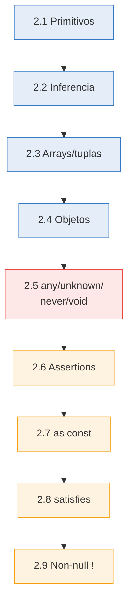
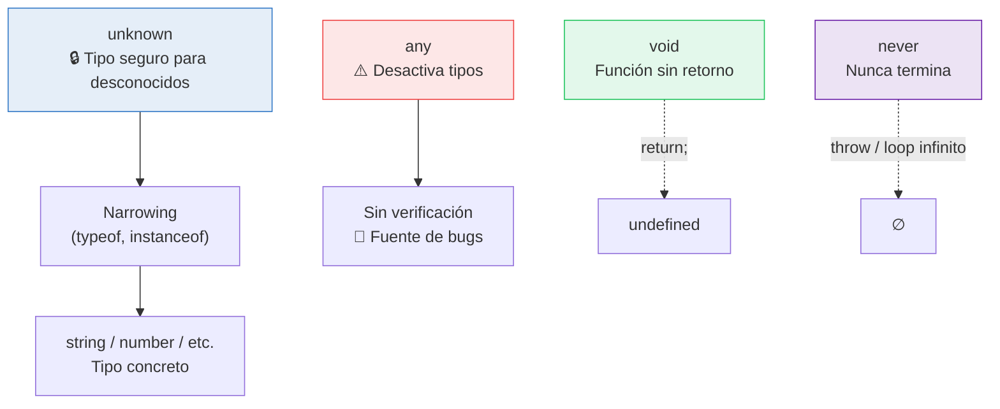

# :bricks: Capítulo 2: Tipos básicos

<div class="chapter-meta">
  <span class="meta-item">🕐 2-3 horas</span>
  <span class="meta-item">📊 Nivel: Principiante</span>
  <span class="meta-item">🎯 Semana 1</span>
</div>

<div class="chapter-objective">
  <span class="objective-icon">📌</span>
  <span class="objective-text">Al terminar este capítulo, dominarás los tipos primitivos de TypeScript (number, string, boolean), arrays, tuplas, y sabrás cuándo usar `type` vs `interface` y por qué `any` es peligroso.</span>
</div>

<div class="chapter-map">
<h4>🗺️ Mapa del capítulo</h4>



**Leyenda:** :blue_square: Fundamentos &mdash; :red_square: Tipos especiales &mdash; :orange_square: Assertions y operadores avanzados

</div>

!!! quote "Contexto"
    Los tipos básicos son los cimientos de TypeScript. Si Python te deja construir con piezas de cualquier forma, TypeScript te da piezas de LEGO: solo encajan donde deben.

---

## 2.1 Tipos primitivos

```typescript
// Los 7 tipos primitivos de TypeScript
let nombre: string = "Daniele";
let edad: number = 22;              // (1)!
let activo: boolean = true;
let nada: null = null;
let indefinido: undefined = undefined;
let grande: bigint = 100n;           // Para números enormes
let id: symbol = Symbol("id");      // Identificador único
```

1. :warning: No hay `int` / `float` como en Python. `number` lo cubre todo: enteros, decimales, `NaN`, `Infinity`.

<div class="comparison" markdown>
<div class="lang-box python" markdown>

#### :snake: En Python

Python distingue entre `int`, `float`, `complex`, `str`, `bool`, `None`. `isinstance(x, int)` verifica en **runtime**.

</div>
<div class="lang-box typescript" markdown>

#### 🔷 En TypeScript

Solo hay `number` (agrupa `int` y `float` de Python). La verificación es en **compilación**, no en runtime.

</div>
</div>

<div class="micro-exercise">
<h4>✏️ Micro-ejercicio (2 min)</h4>
<p>Declara variables para representar un plato de MakeMenu: <code>nombre</code> (string), <code>precio</code> (number), <code>disponible</code> (boolean). ¿Qué pasa si intentas asignar <code>precio = '12.50'</code>?</p>
</div>

<div class="connection-box">
<span class="connection-icon">🔗</span>
<span>Recuerda del <a href='../01-bienvenido/'>Capítulo 1</a> que <code>strict: true</code> activa <code>noImplicitAny</code>. Esto significa que cada variable DEBE tener un tipo, ya sea explícito o inferido.</span>
</div>

<div class="concept-question">
<h4>🤔 Pregunta conceptual</h4>
<p>¿Necesitas escribir el tipo de CADA variable, o puede TypeScript adivinarlo? ¿Cuándo sí y cuándo no?</p>
</div>

## 2.2 Inferencia de tipos

TypeScript es lo bastante inteligente para **deducir tipos sin que los escribas explícitamente**. Esto se llama **inferencia de tipos** y es una de las mejores features del lenguaje.

```typescript
// TypeScript infiere automáticamente
let city = "Prague";       // TS infiere: string
let temp = 5;              // TS infiere: number
let isWinter = true;       // TS infiere: boolean

city = 42;  // ❌ Type 'number' is not assignable to type 'string'
```

!!! tip "Regla de oro"
    Deja que TypeScript infiera cuando pueda. Solo anota tipos explícitamente en:

    1. **Parámetros de funciones** — siempre
    2. **Cuando la inferencia no es obvia** — tipos complejos
    3. **Valores de retorno de funciones públicas/API** — para documentar

<div class="concept-question">
<h4>🤔 Pregunta conceptual</h4>
<p>En Python, una lista puede contener cualquier tipo mezclado: <code>[1, 'hola', True]</code>. ¿Cómo crees que TypeScript maneja esto? ¿Permitirá mezclar tipos en un array?</p>
</div>

<div class="misconception-box" markdown>
<h4>❌ Error común</h4>
<p><strong>Mito:</strong> "any y unknown son lo mismo"</p>
<p><strong>Realidad:</strong> <code>any</code> desactiva el type checker completamente — puedes hacer lo que quieras sin errores de compilación, pero también sin seguridad. <code>unknown</code> es la alternativa segura: obliga a verificar el tipo (narrowing) antes de usarlo. Siempre prefiere <code>unknown</code> cuando no conozcas el tipo de un valor.</p>
</div>

## 2.3 Arrays y tuplas

=== "Arrays"

    ```typescript
    // Arrays: colección homogénea
    let platos: string[] = ["Pasta", "Pizza", "Risotto"];
    let precios: Array<number> = [12.5, 15.0, 18.0]; // (1)!

    // Métodos tipados
    platos.push("Tiramisú");     // ✅ OK
    platos.push(42);             // ❌ Argument of type 'number'...

    // Array readonly
    const zonas: readonly string[] = ["interior", "terraza"];
    zonas.push("barra");         // ❌ Property 'push' does not exist
    ```

    1. `string[]` y `Array<string>` son equivalentes. La primera es más idiomática.

=== "Tuplas"

    ```typescript
    // Tupla: array con tipos FIJOS por posición
    let mesa: [number, string, boolean] = [5, "ventana", true];
    // mesa[0] → number, mesa[1] → string, mesa[2] → boolean

    // Tupla con etiquetas (TS 4.0+)
    type Coordenada = [lat: number, lng: number, alt?: number];
    const praga: Coordenada = [50.0755, 14.4378];
    const pico: Coordenada = [28.2916, -16.6291, 3718]; // Teide!

    // Destructuring
    const [lat, lng] = praga;
    ```

<div class="comparison" markdown>
<div class="lang-box python" markdown>

#### :snake: En Python

Las listas mezclan tipos: `[1, "hola", True]`. Las tuplas son **inmutables**: `(1, "hola")`.

</div>
<div class="lang-box typescript" markdown>

#### 🔷 En TypeScript

Los arrays son tipados: `string[]` solo acepta strings. Las tuplas tienen tipo fijo por **posición**: `[number, string]` ≠ `[string, number]`.

</div>
</div>

<div class="micro-exercise">
<h4>✏️ Micro-ejercicio (2 min)</h4>
<p>Crea un array de nombres de platos y otro de precios. Intenta hacer <code>push('no-es-número')</code> al array de precios. ¿Qué dice TypeScript?</p>
</div>

## 2.4 Objetos

```typescript
// Objeto con tipo implícito (inferido)
let mesa = {
  número: 5,
  zona: "terraza",
  capacidad: 4,
  ocupada: false
};
// TS infiere: { número: number; zona: string; capacidad: number; ocupada: boolean }

// Objeto con tipo explícito
let reserva: {
  nombre: string;
  hora: string;
  personas: number;
  comentario?: string;   // (1)!
} = {
  nombre: "García",
  hora: "20:30",
  personas: 4
};
```

1. El `?` marca la propiedad como **opcional**. Equivale a `string | undefined`.

<div class="pro-tip">
<h4>💡 Consejo Pro</h4>
<p>Para arrays de objetos complejos, define siempre una interfaz primero: <code>interface Plato { nombre: string; precio: number; }</code> y luego <code>const menu: Plato[]</code>. Esto te da autocompletado perfecto en VS Code.</p>
</div>

<div class="connection-box">
<span class="connection-icon">🔗</span>
<span>En el <a href='../03-interfaces/'>Capítulo 3</a> aprenderás interfaces — la forma profesional de definir la forma de objetos complejos como los platos y mesas de MakeMenu.</span>
</div>

<div class="code-evolution">
<div class="evolution-header">🔄 Evolución del código</div>
<div class="evolution-step">
<span class="step-label novato">v1 — Novato</span>

```javascript
// JavaScript sin tipos — ¿qué tipo tiene cada cosa?
let nombre = "Margherita";
let precio = 12.5;
let disponible = true;
let ingredientes = ["tomate", "mozzarella", "albahaca"];
```

</div>
<div class="evolution-step">
<span class="step-label mejorado">v2 — Con tipos</span>

```typescript
// TypeScript con tipos explícitos
let nombre: string = "Margherita";
let precio: number = 12.5;
let disponible: boolean = true;
let ingredientes: string[] = ["tomate", "mozzarella", "albahaca"];
```

</div>
<div class="evolution-step">
<span class="step-label profesional">v3 — Profesional</span>

```typescript
// Interface + array tipado — código de producción
interface Plato {
  nombre: string;
  precio: number;
  disponible: boolean;
  ingredientes: readonly string[];
}

const menu: Plato[] = [
  {
    nombre: "Margherita",
    precio: 12.5,
    disponible: true,
    ingredientes: ["tomate", "mozzarella", "albahaca"],
  },
];
```

</div>
</div>

<div class="concept-question">
<h4>🤔 Pregunta conceptual</h4>
<p>Si TypeScript es un lenguaje con tipos estáticos, ¿debería existir un tipo que acepte CUALQUIER valor? ¿Qué problemas podría causar?</p>
</div>

## 2.5 `any`, `unknown`, `never` y `void`

Estos cuatro tipos "especiales" son fundamentales para entender el sistema de tipos:



=== "`any` — El escape peligroso"

    ```typescript
    // ❌ EVITAR: desactiva el sistema de tipos
    let data: any = 42;
    data = "ahora soy string";  // Sin error... pero sin seguridad
    data.noExiste.tampoco();     // Sin error... pero crashea en runtime 💥
    ```

=== "`unknown` — El escape seguro"

    ```typescript
    // ✅ PREFERIR: tipo seguro para valores desconocidos
    let input: unknown = getExternalData();

    // input.toUpperCase();  // ❌ Object is of type 'unknown'

    // Debes verificar antes de usar (narrowing)
    if (typeof input === "string") {
      input.toUpperCase(); // ✅ OK después del type guard
    }
    ```

=== "`void` y `never`"

    ```typescript
    // void: función que no retorna valor
    function log(msg: string): void {
      console.log(msg);
    }

    // never: función que NUNCA termina
    function throwError(msg: string): never {
      throw new Error(msg);
    }

    function infiniteLoop(): never {
      while (true) { /* ... */ }
    }
    ```

!!! danger "Cuidado con `any`"
    Usar `any` es como quitarte el cinturón de seguridad. Compila, pero pierdes **TODA** la protección de TypeScript. Usa `unknown` cuando no sepas el tipo y haz narrowing.

<div class="misconception-box">
<h4>⚠️ Errores comunes</h4>
<ul>
<li><span class="wrong">❌ Mito:</span> "Puedo usar <code>any</code> cuando no sé el tipo" → <span class="right">✅ Realidad:</span> Usa <code>unknown</code>. Con <code>any</code> pierdes TODA la seguridad de tipos — es como desactivar TypeScript.</li>
<li><span class="wrong">❌ Mito:</span> "<code>number[]</code> y <code>Array&lt;number&gt;</code> son diferentes" → <span class="right">✅ Realidad:</span> Son exactamente iguales. <code>number[]</code> es la forma corta (syntactic sugar).</li>
<li><span class="wrong">❌ Mito:</span> "Las tuplas son como arrays normales" → <span class="right">✅ Realidad:</span> Las tuplas tienen longitud fija y tipo por posición. <code>[string, number]</code> NO es lo mismo que <code>(string | number)[]</code>.</li>
</ul>
</div>

<div class="pro-tip">
<h4>💡 Consejo Pro</h4>
<p>En MakeMenu y proyectos reales, NUNCA uses <code>any</code>. Activa <code>noImplicitAny: true</code> (viene con <code>strict</code>) y el compilador te obligará a tipar todo. Si realmente no sabes el tipo, usa <code>unknown</code> y haz narrowing.</p>
</div>

## 2.6 Type assertions

Cuando **tú** sabes más que el compilador, puedes usar una aserción de tipo:

```typescript
// Aserción con 'as'
const canvas = document.getElementById("canvas") as HTMLCanvasElement;
const ctx = canvas.getContext("2d");

// Aserción con ángulos (no funciona en JSX)
const input = <HTMLInputElement>document.getElementById("name");

// Doble aserción (usar con extrema cautela ⚠️)
const val = someValue as unknown as SpecificType;
```

!!! warning "Las assertions no validan"
    Una type assertion **no convierte** el valor: solo le dice a TypeScript "confía en mí". Si mientes, tendrás errores en runtime. Prefiere type guards (cap. 12) para verificación real.

## 2.7 `as const` — Assertions de constante

`as const` convierte un valor en su **tipo literal más estrecho** y lo marca como `readonly` en profundidad. Es extremadamente útil para definir conjuntos fijos de valores.

```typescript
// Sin as const: TypeScript infiere tipos amplios
const config = {
  api: "https://api.makemenu.dev",
  version: 3,
  debug: false
};
// Tipo: { api: string; version: number; debug: boolean }
// config.api podría ser CUALQUIER string

// Con as const: tipos literales + readonly
const config2 = {
  api: "https://api.makemenu.dev",
  version: 3,
  debug: false
} as const;
// Tipo: { readonly api: "https://api.makemenu.dev"; readonly version: 3; readonly debug: false }

config2.api = "otro"; // ❌ Cannot assign to 'api' because it is a read-only property
```

**Caso práctico: arrays constantes como alternativa a enums:**

```typescript
// En vez de un enum...
const ZONAS = ["interior", "terraza", "barra"] as const; // (1)!
type Zona = typeof ZONAS[number]; // "interior" | "terraza" | "barra"

function asignarZona(mesa: { zona: Zona }): void {
  console.log(`Zona: ${mesa.zona}`);
}

asignarZona({ zona: "terraza" });   // ✅
asignarZona({ zona: "jardín" });    // ❌ Type '"jardín"' is not assignable
```

1. `as const` convierte `string[]` en `readonly ["interior", "terraza", "barra"]` — un tipo tupla de literales.

<div class="comparison" markdown>
<div class="lang-box python" markdown>

#### :snake: En Python

```python
from typing import Literal
Zona = Literal["interior", "terraza", "barra"]
```
Python tiene `Literal` desde 3.8, pero no tiene equivalente de `as const` para derivar el tipo de un valor existente.

</div>
<div class="lang-box typescript" markdown>

#### 🔷 En TypeScript

`as const` permite derivar tipos de valores existentes: defines el dato UNA vez y extraes el tipo. Más DRY que definir tipo y dato por separado.

</div>
</div>

## 2.8 `satisfies` — Validar sin ampliar

Introducido en TypeScript 4.9, `satisfies` verifica que un valor cumple con un tipo **sin cambiar el tipo inferido**. Es la diferencia entre validar y anotar.

```typescript
// Record<K, V> crea un tipo objeto con claves K y valores V
// (lo veremos en detalle en el Capítulo 8 — Utility Types)
type PaletaColores = Record<string, string | string[]>;

// Con anotación de tipo: perdemos información
const paleta1: PaletaColores = {
  rojo: "#ff0000",
  verde: ["#00ff00", "#00cc00"],
};
// paleta1.rojo es string | string[] — no sabe que es string

// Con satisfies: validamos Y conservamos la inferencia
const paleta2 = {
  rojo: "#ff0000",
  verde: ["#00ff00", "#00cc00"],
} satisfies PaletaColores;
// paleta2.rojo es string ✅ — sabe que es string
// paleta2.verde es string[] ✅ — sabe que es array

paleta2.rojo.toUpperCase();    // ✅ funciona, sabe que es string
paleta2.verde.map(c => c);     // ✅ funciona, sabe que es string[]
```

!!! tip "¿Cuándo usar cada uno?"
    | Necesitas | Usa |
    |-----------|-----|
    | Verificar que el valor cumple un tipo, manteniendo tipos estrechos | `satisfies` |
    | Asignar un tipo explícito (widening aceptable) | `: Tipo` |
    | Afirmar un tipo cuando sabes más que TS | `as Tipo` |
    | Convertir a readonly + literales | `as const` |

## 2.9 Non-null assertion (`!`)

El operador `!` (non-null assertion) le dice a TypeScript que un valor **no es** `null` ni `undefined`. Úsalo solo cuando estés seguro:

```typescript
// TypeScript se queja: podría ser null
const canvas = document.getElementById("game");
// canvas es HTMLElement | null

// Con !: le aseguras que existe
const canvas2 = document.getElementById("game")!;
// canvas2 es HTMLElement

// Ejemplo en MakeMenu: acceder a ref de Vue
const inputRef = ref<HTMLInputElement | null>(null);

function focus() {
  inputRef.value!.focus(); // (1)!
}
```

1. Usamos `!` porque sabemos que cuando `focus()` se llama, el input ya está montado. Pero si es posible, prefiere optional chaining: `inputRef.value?.focus()`.

!!! danger "No abuses del `!`"
    Cada `!` es un contrato que **tú** haces con TypeScript: "esto nunca será null". Si te equivocas, crashea en runtime. Prefiere narrowing (`if (x !== null)`) o optional chaining (`x?.prop`).

---

<div class="ejercicio-guiado">
<h4>🏋️ Ejercicio guiado</h4>

Vas a construir un pequeño sistema de carta del restaurante MakeMenu usando tipos básicos, arrays, tuplas y `as const`.

1. Define un array constante `CATEGORIAS` con los valores `"entrante"`, `"principal"`, `"postre"` usando `as const`, y deriva un tipo `Categoria` a partir de él.
2. Crea un type alias `Plato` con las propiedades: `nombre` (string), `precio` (number), `categoria` (Categoria), `disponible` (boolean) y `alergenos` (optional readonly string array).
3. Crea un array `menu` de tipo `Plato[]` con al menos 3 platos de distintas categorias.
4. Escribe una función `platoMasCaro(platos: Plato[]): Plato` que recorra el array y devuelva el plato con mayor precio.
5. Crea una tupla `resumen` de tipo `[string, number, boolean]` que contenga el nombre del plato más caro, su precio, y si está disponible.
6. Usa `satisfies` para validar que un objeto `platoEspecial` cumple el tipo `Plato` sin perder la inferencia estrecha, y comprueba que puedes acceder a su categoria como tipo literal.

??? success "Solución completa"
    ```typescript
    // Paso 1: Categorias con as const
    const CATEGORIAS = ["entrante", "principal", "postre"] as const;
    type Categoria = typeof CATEGORIAS[number];

    // Paso 2: Type alias Plato
    type Plato = {
      nombre: string;
      precio: number;
      categoria: Categoria;
      disponible: boolean;
      alergenos?: readonly string[];
    };

    // Paso 3: Array de platos
    const menu: Plato[] = [
      { nombre: "Bruschetta", precio: 8.50, categoria: "entrante", disponible: true, alergenos: ["gluten"] },
      { nombre: "Risotto ai funghi", precio: 16.00, categoria: "principal", disponible: true, alergenos: ["lactosa"] },
      { nombre: "Tiramisú", precio: 7.50, categoria: "postre", disponible: false, alergenos: ["gluten", "lactosa", "huevo"] },
    ];

    // Paso 4: Función platoMasCaro
    function platoMasCaro(platos: Plato[]): Plato {
      return platos.reduce((caro, actual) =>
        actual.precio > caro.precio ? actual : caro
      );
    }

    // Paso 5: Tupla resumen
    const mejor = platoMasCaro(menu);
    const resumen: [string, number, boolean] = [mejor.nombre, mejor.precio, mejor.disponible];
    console.log(resumen); // ["Risotto ai funghi", 16, true]

    // Paso 6: satisfies para mantener inferencia estrecha
    const platoEspecial = {
      nombre: "Pasta al tartufo",
      precio: 22.00,
      categoria: "principal",
      disponible: true,
      alergenos: ["gluten", "lactosa"],
    } satisfies Plato;

    // Gracias a satisfies, TS sabe que platoEspecial.categoria es "principal" (literal)
    console.log(platoEspecial.categoria); // tipo: "principal", no Categoria
    ```

</div>

<div class="real-errors">
<h4>🚨 Errores reales de TypeScript</h4>
<p>Estos son errores que verás constantemente en proyectos reales. Aprende a reconocerlos y corregirlos rápidamente.</p>

**Error 1: `Type 'string' is not assignable to type 'number'` (TS2322)**

```typescript
// ❌ Código con error
let precio: number = "12.50";
//  ~~~~~~ Error: Type 'string' is not assignable to type 'number'
```

```typescript
// ✅ Corrección: usa el tipo correcto o convierte el valor
let precio: number = 12.50;
// O si viene de un input (string):
let precioStr: string = "12.50";
let precioNum: number = parseFloat(precioStr);
```

> **Por qué ocurre:** TypeScript no convierte tipos automáticamente como JavaScript. Si una variable es `number`, no acepta un `string` aunque sea numérico.

---

**Error 2: `Object is possibly 'undefined'` (TS2532)**

```typescript
// ❌ Código con error
interface Plato {
  nombre: string;
  descripción?: string; // opcional
}

const plato: Plato = { nombre: "Pasta" };
console.log(plato.descripción.toUpperCase());
//                 ~~~~~~~~~~~ Error: Object is possibly 'undefined'
```

```typescript
// ✅ Corrección: verifica antes de usar o usa optional chaining
console.log(plato.descripción?.toUpperCase());
// O con narrowing:
if (plato.descripción) {
  console.log(plato.descripción.toUpperCase());
}
// O con nullish coalescing:
console.log((plato.descripción ?? "Sin descripción").toUpperCase());
```

> **Por qué ocurre:** Las propiedades opcionales (`?`) incluyen `undefined` en su tipo. Debes manejar ese caso antes de acceder a métodos.

---

**Error 3: `Argument of type 'X' is not assignable to parameter of type 'Y'` (TS2345)**

```typescript
// ❌ Código con error
function reservarMesa(mesa: number, personas: number): void {
  console.log(`Mesa ${mesa} para ${personas} personas`);
}

const mesaId = "5";
reservarMesa(mesaId, 4);
//           ~~~~~~ Error: Argument of type 'string' is not assignable
//                  to parameter of type 'number'
```

```typescript
// ✅ Corrección: convierte el tipo antes de pasar el argumento
const mesaId = "5";
reservarMesa(Number(mesaId), 4);      // Conversion explícita
// O mejor: usa el tipo correcto desde el inicio
const mesaIdNum: number = 5;
reservarMesa(mesaIdNum, 4);
```

> **Por qué ocurre:** TypeScript verifica que cada argumento coincida con el tipo declarado del parámetro. No hace coerción implícita como JavaScript.

---

**Error 4: `Property 'X' does not exist on type 'Y'` (TS2339)**

```typescript
// ❌ Código con error
const mesa = { número: 5, zona: "terraza", capacidad: 4 };
console.log(mesa.ocupada);
//               ~~~~~~~ Error: Property 'ocupada' does not exist
//               on type '{ número: number; zona: string; capacidad: number; }'
```

```typescript
// ✅ Corrección: agrega la propiedad al tipo o al objeto
const mesa = { número: 5, zona: "terraza", capacidad: 4, ocupada: false };
console.log(mesa.ocupada); // ✅ ahora existe

// O define una interfaz con todas las propiedades necesarias:
interface Mesa {
  número: number;
  zona: string;
  capacidad: number;
  ocupada: boolean;
}
```

> **Por qué ocurre:** TypeScript solo permite acceder a propiedades que existen en el tipo del objeto. Esto previene errores por typos o propiedades faltantes que en JavaScript retornarían `undefined` silenciosamente.

---

**Error 5: `Type 'X[]' is not assignable to type '[X, X]'` (TS2322)**

```typescript
// ❌ Código con error
function procesarCoordenada(coord: [number, number]): void {
  const [lat, lng] = coord;
  console.log(`Lat: ${lat}, Lng: ${lng}`);
}

const datos: number[] = [50.0755, 14.4378];
procesarCoordenada(datos);
//                 ~~~~~ Error: Type 'number[]' is not assignable
//                 to type '[number, number]'
```

```typescript
// ✅ Corrección: declara como tupla desde el inicio
const datos: [number, number] = [50.0755, 14.4378];
procesarCoordenada(datos); // ✅

// O usa as const para inferir la tupla:
const datos2 = [50.0755, 14.4378] as const;
procesarCoordenada([...datos2]); // ✅ spread para quitar readonly
```

> **Por qué ocurre:** Un `number[]` puede tener cualquier longitud (0, 1, 100...), pero una tupla `[number, number]` garantiza exactamente 2 elementos. TypeScript no puede asumir que tu array siempre tendrá 2 elementos.

</div>

<div class="checkpoint">
<h4>🏁 Checkpoint</h4>
<p>Si puedes: (1) declarar variables con tipos primitivos, (2) crear arrays tipados y tuplas, y (3) explicar por qué <code>any</code> es peligroso — estás listo para el <a href="../03-interfaces/">Capítulo 3</a>.</p>
</div>

<div class="mini-project">
<h4>🏗️ Mini-proyecto: Sistema de inventario de restaurante</h4>
<p>Aplica todo lo aprendido en este capítulo para construir un mini sistema de inventario tipado para MakeMenu. Cada paso agrega complejidad progresivamente.</p>

??? question "Paso 1: Definir los tipos base"
    Define las constantes y tipos necesarios para el inventario del restaurante:

    - Un array constante (`as const`) con las categorías: `"entrante"`, `"principal"`, `"postre"`, `"bebida"`
    - Un tipo `Categoria` derivado del array anterior
    - Un tipo objeto `ItemInventario` con: `nombre` (string), `categoria` (Categoria), `precio` (number), `stock` (number), `alergenos` (array readonly de strings opcional)

    ??? success "Solución"
        ```typescript
        // Categorias como constante — fuente única de verdad
        const CATEGORIAS = ["entrante", "principal", "postre", "bebida"] as const;
        type Categoria = typeof CATEGORIAS[number];
        // "entrante" | "principal" | "postre" | "bebida"

        // Tipo para cada item del inventario
        type ItemInventario = {
          nombre: string;
          categoria: Categoria;
          precio: number;
          stock: number;
          alergenos?: readonly string[];
        };
        ```

??? question "Paso 2: Crear el inventario con validación"
    Crea un array de al menos 4 items de inventario. Usa `satisfies` para validar que cada item cumple el tipo `ItemInventario` sin perder la inferencia estrecha.

    !!! tip "Pista"
        Usa `satisfies ItemInventario[]` en el array completo para que TypeScript valide la estructura pero mantenga los tipos literales de cada propiedad.

    ??? success "Solución"
        ```typescript
        const inventario = [
          {
            nombre: "Bruschetta",
            categoria: "entrante",
            precio: 8.50,
            stock: 20,
            alergenos: ["gluten"],
          },
          {
            nombre: "Risotto ai funghi",
            categoria: "principal",
            precio: 16.00,
            stock: 15,
            alergenos: ["lactosa"],
          },
          {
            nombre: "Tiramisu",
            categoria: "postre",
            precio: 7.50,
            stock: 10,
            alergenos: ["gluten", "lactosa", "huevo"],
          },
          {
            nombre: "Agua mineral",
            categoria: "bebida",
            precio: 2.50,
            stock: 50,
          },
        ] satisfies ItemInventario[];

        // Gracias a satisfies, TS sabe que:
        // inventario[0].categoria es "entrante" (no solo Categoria)
        // inventario[3].alergenos es undefined (no string[] | undefined)
        ```

??? question "Paso 3: Funciones de consulta tipadas"
    Crea dos funciones:

    1. `buscarPorCategoria`: recibe una `Categoria` y el inventario, devuelve los items filtrados
    2. `calcularValorTotal`: recibe el inventario y devuelve el valor total (precio * stock de cada item)

    Ambas funciones deben tener tipos de parámetros y retorno explícitos.

    ??? success "Solución"
        ```typescript
        function buscarPorCategoria(
          categoria: Categoria,
          items: ItemInventario[]
        ): ItemInventario[] {
          return items.filter(item => item.categoria === categoria);
        }

        function calcularValorTotal(items: ItemInventario[]): number {
          return items.reduce(
            (total, item) => total + item.precio * item.stock,
            0
          );
        }

        // Uso
        const postres = buscarPorCategoria("postre", inventario);
        console.log(`Postres disponibles: ${postres.length}`);
        // TS marca error si escribes una categoria inválida:
        // buscarPorCategoria("ensalada", inventario); // ❌ Error

        const valorTotal = calcularValorTotal(inventario);
        console.log(`Valor total del inventario: €${valorTotal.toFixed(2)}`);
        ```

??? question "Paso 4: Resumen con unknown y narrowing"
    Crea una función `procesarDato` que reciba un valor `unknown` (simulando datos de una API externa) y devuelva un string descriptivo. Debe manejar:

    - Si es `string`: devuelve `"Texto: <valor>"`
    - Si es `number`: devuelve `"Número: <valor>"`
    - Si es un objeto con propiedad `nombre` de tipo string: devuelve `"Item: <nombre>"`
    - Para cualquier otro caso: devuelve `"Tipo desconocido"`

    ??? success "Solución"
        ```typescript
        function procesarDato(dato: unknown): string {
          // Narrowing con typeof
          if (typeof dato === "string") {
            return `Texto: ${dato}`;
          }

          if (typeof dato === "number") {
            return `Número: ${dato}`;
          }

          // Narrowing para objetos con propiedad 'nombre'
          if (
            typeof dato === "object" &&
            dato !== null &&
            "nombre" in dato &&
            typeof (dato as { nombre: unknown }).nombre === "string"
          ) {
            return `Item: ${(dato as { nombre: string }).nombre}`;
          }

          return "Tipo desconocido";
        }

        // Pruebas
        console.log(procesarDato("Margherita"));        // "Texto: Margherita"
        console.log(procesarDato(12.50));                // "Número: 12.5"
        console.log(procesarDato({ nombre: "Pasta" })); // "Item: Pasta"
        console.log(procesarDato(true));                 // "Tipo desconocido"
        console.log(procesarDato(null));                 // "Tipo desconocido"
        ```

        **Nota:** Este patrón de narrowing con `unknown` es la alternativa segura a usar `any`. En el Capítulo 12 aprenderemos **type guards** personalizados para hacer este código más limpio y reutilizable.

</div>

## :link: Recursos

| Recurso | Enlace |
|---------|--------|
| Everyday Types | [typescriptlang.org/.../everyday-types](https://www.typescriptlang.org/docs/handbook/2/everyday-types.html) |
| Total TypeScript: Beginner's | [totaltypescript.com/tutorials/beginners-typescript](https://www.totaltypescript.com/tutorials/beginners-typescript) |

---

## 🎯 Ejercicios

??? question "Ejercicio 1: Array de mesas"
    Crea un array de objetos `Mesa` con `número`, `zona` y `capacidad`. Itera sobre él e imprime cada mesa.

    ??? success "Solución"
        ```typescript
        const mesas: { num: number; zona: string; cap: number }[] = [
          { num: 1, zona: "interior", cap: 4 },
          { num: 2, zona: "terraza", cap: 6 },
          { num: 3, zona: "barra", cap: 2 },
        ];

        mesas.forEach(m => {
          console.log(`Mesa ${m.num} (${m.zona}): ${m.cap} personas`);
        });
        ```

??? question "Ejercicio 2: Tupla GPS"
    Crea una tupla que represente una coordenada GPS `[latitud, longitud, altitud?]` donde altitud es opcional.

    ??? success "Solución"
        ```typescript
        type Coordenada = [lat: number, lng: number, alt?: number];

        const praga: Coordenada = [50.0755, 14.4378];
        const teide: Coordenada = [28.2916, -16.6291, 3718];

        function mostrar(c: Coordenada): string {
          const [lat, lng, alt] = c;
          return alt !== undefined
            ? `${lat}°, ${lng}° (${alt}m)`
            : `${lat}°, ${lng}°`;
        }
        ```

??? question "Ejercicio 3: Detector de tipos"
    Escribe una función que reciba un `unknown` y devuelva su tipo como string usando `typeof`. Maneja al menos 4 tipos.

    ??? success "Solución"
        ```typescript
        function detectarTipo(valor: unknown): string {
          if (valor === null) return "null";
          if (Array.isArray(valor)) return "array";
          return typeof valor; // "string" | "number" | "boolean" | "object" | ...
        }

        console.log(detectarTipo("hola"));  // "string"
        console.log(detectarTipo(42));       // "number"
        console.log(detectarTipo(null));     // "null"
        console.log(detectarTipo([1, 2]));   // "array"
        ```

??? question "Ejercicio 4: Config con `as const`"
    Define un objeto de configuración de MakeMenu con `as const` que contenga las zonas del restaurante, el número máximo de mesas y la URL de la API. Luego extrae un tipo `Zona` del array de zonas.

    !!! tip "Pista"
        Usa `typeof CONFIG.zonas[number]` para extraer un union type de un array `as const`.

    ??? success "Solución"
        ```typescript
        const CONFIG = {
          zonas: ["interior", "terraza", "barra", "privado"],
          maxMesas: 50,
          apiUrl: "https://api.makemenu.dev/v1"
        } as const;

        // Extraer tipo de las zonas
        type Zona = typeof CONFIG.zonas[number];
        // "interior" | "terraza" | "barra" | "privado"

        // Usar el tipo
        function crearMesa(número: number, zona: Zona): void {
          console.log(`Mesa ${número} en zona ${zona}`);
        }

        crearMesa(1, "terraza");  // ✅
        crearMesa(2, "jardín");   // ❌ Type '"jardín"' is not assignable
        ```
        `as const` nos permite definir los datos una vez y extraer los tipos automáticamente, evitando duplicación.

??? question "Ejercicio 5: `satisfies` vs type annotation"
    Dado el siguiente tipo, crea un objeto de configuración de tema usando `satisfies` y demuestra que puedes acceder a propiedades específicas sin perder la inferencia. Luego haz lo mismo con una anotación de tipo y muestra la diferencia.

    ```typescript
    type ThemeConfig = {
      colors: Record<string, string>;
      fontSize: number;
      fontFamily: string;
    };
    ```

    !!! tip "Pista"
        Con `satisfies`, si defines `colors: { primary: "#3178c6" }`, podrás acceder a `config.colors.primary` directamente. Con `: ThemeConfig`, solo podrás acceder como `config.colors["primary"]` y será `string | undefined`.

    ??? success "Solución"
        ```typescript
        type ThemeConfig = {
          colors: Record<string, string>;
          fontSize: number;
          fontFamily: string;
        };

        // Con satisfies: válida el tipo PERO mantiene inferencia estrecha
        const tema = {
          colors: { primary: "#3178c6", danger: "#ef4444" },
          fontSize: 16,
          fontFamily: "Inter"
        } satisfies ThemeConfig;

        tema.colors.primary;      // ✅ string — sabe que 'primary' existe
        tema.colors.primary.toUpperCase(); // ✅ funciona

        // Con anotación: pierde la inferencia estrecha
        const tema2: ThemeConfig = {
          colors: { primary: "#3178c6", danger: "#ef4444" },
          fontSize: 16,
          fontFamily: "Inter"
        };

        tema2.colors.primary;     // string — funciona, pero...
        // tema2.colors.noExiste; // También string — NO da error ⚠️
        ```
        Con `satisfies` válidas el tipo sin perder información. La anotación `: ThemeConfig` ensancha `colors` a `Record<string, string>`, permitiendo cualquier key.

---

## :brain: Flashcards

<div class="flashcard">
<div class="front">¿Cuántos tipos primitivos tiene TypeScript?</div>
<div class="back">7: string, number, boolean, null, undefined, bigint, symbol</div>
</div>

<div class="flashcard">
<div class="front">¿Diferencia entre <code>any</code> y <code>unknown</code>?</div>
<div class="back"><code>any</code> desactiva verificación (peligroso). <code>unknown</code> requiere narrowing antes de usar (seguro).</div>
</div>

<div class="flashcard">
<div class="front">¿Cuándo anotarías tipos explícitamente?</div>
<div class="back">Parámetros de funciones, inferencia no obvia, y retornos de funciones públicas/API.</div>
</div>

<div class="flashcard">
<div class="front">¿Qué hace <code>as const</code>?</div>
<div class="back">Convierte un valor a su tipo literal más estrecho y lo marca como <code>readonly</code> en profundidad. Útil para derivar tipos de valores.</div>
</div>

<div class="flashcard">
<div class="front">¿Cuándo usar <code>satisfies</code> en lugar de una anotación de tipo?</div>
<div class="back">Cuando quieres validar que un valor cumple un tipo pero sin perder la inferencia estrecha. Con <code>satisfies</code> el compilador mantiene los tipos específicos.</div>
</div>

---

## :video_game: Quiz interactivo

<div class="quiz" data-quiz-id="ch02-q1">
<h4>Pregunta 1: ¿Qué tipo infiere TypeScript para <code>const x = [1, "hola", true]</code>?</h4>
<button class="quiz-option" data-correct="false"><code>readonly [1, "hola", true]</code></button>
<button class="quiz-option" data-correct="true"><code>(string | number | boolean)[]</code></button>
<button class="quiz-option" data-correct="false"><code>[number, string, boolean]</code></button>
<button class="quiz-option" data-correct="false"><code>any[]</code></button>
<div class="quiz-feedback" data-correct="¡Correcto! Sin `as const`, TypeScript infiere el tipo más amplio: un array de la unión de todos los elementos." data-incorrect="Incorrecto. Sin `as const`, TypeScript infiere `(string | number | boolean)[]` — el tipo más amplio. Para obtener una tupla necesitas `as const`."></div>
</div>

<div class="quiz" data-quiz-id="ch02-q2">
<h4>Pregunta 2: ¿Cuál es la diferencia clave entre <code>any</code> y <code>unknown</code>?</h4>
<button class="quiz-option" data-correct="false">Son exactamente lo mismo</button>
<button class="quiz-option" data-correct="false"><code>unknown</code> solo se puede usar en funciones</button>
<button class="quiz-option" data-correct="true"><code>unknown</code> requiere narrowing antes de usarse, <code>any</code> desactiva la verificación</button>
<button class="quiz-option" data-correct="false"><code>any</code> es más seguro que <code>unknown</code></button>
<div class="quiz-feedback" data-correct="¡Correcto! `unknown` es el tipo seguro — te obliga a comprobar el tipo antes de operar. `any` desactiva toda verificación." data-incorrect="Incorrecto. `unknown` requiere narrowing (type guards) antes de usarse, mientras que `any` desactiva completamente la verificación de tipos."></div>
</div>

<div class="quiz" data-quiz-id="ch02-q3">
<h4>Pregunta 3: ¿Qué hace <code>as const</code> en <code>const dirs = ["N", "S", "E", "W"] as const</code>?</h4>
<button class="quiz-option" data-correct="false">Hace que el array sea mutable</button>
<button class="quiz-option" data-correct="false">Convierte los valores a <code>string</code></button>
<button class="quiz-option" data-correct="true">Crea un <code>readonly</code> tuple con tipos literales: <code>readonly ["N", "S", "E", "W"]</code></button>
<button class="quiz-option" data-correct="false">No tiene ningún efecto en arrays</button>
<div class="quiz-feedback" data-correct="¡Correcto! `as const` crea una tupla readonly con los tipos literales exactos, no `string[]`." data-incorrect="Incorrecto. `as const` convierte el array a `readonly [&quot;N&quot;, &quot;S&quot;, &quot;E&quot;, &quot;W&quot;]` — una tupla readonly con tipos literales."></div>
</div>

---

## :bug: Ejercicio de depuración

Encuentra y corrige los errores de tipo en este código:

```typescript
// ❌ Este código tiene 4 errores de tipo. ¡Encuéntralos!

const mesa: {
  número: number;
  zona: string;
  capacidad: number;
  ocupada: boolean;
} = {
  número: "12",          // Error 1: ¿qué tipo debería ser?
  zona: "terraza",
  capacidad: 4,
  ocupada: "sí"          // Error 2: ¿qué tipo debería ser?
};

function calcularPrecio(items: number[], descuento: string): number {
  const total = items.reduce((sum, item) => sum + item, 0);
  return total * (1 - descuento);   // Error 3: ¿puedes restar string de number?
}

const resultado: string = calcularPrecio([10, 20, 30], 0.1);  // Error 4: ¿el retorno es string?
```

??? success "Solución"
    ```typescript
    // ✅ Código corregido
    const mesa: {
      número: number;
      zona: string;
      capacidad: number;
      ocupada: boolean;
    } = {
      número: 12,             // ✅ Fix 1: number, no string
      zona: "terraza",
      capacidad: 4,
      ocupada: true            // ✅ Fix 2: boolean, no string
    };

    function calcularPrecio(items: number[], descuento: number): number {
      //                                     ^^^^^^ Fix 3: number, no string
      const total = items.reduce((sum, item) => sum + item, 0);
      return total * (1 - descuento);
    }

    const resultado: number = calcularPrecio([10, 20, 30], 0.1);
    //    ^^^^^^ Fix 4: number, no string
    ```

---

## :recycle: Ejercicio de refactoring: JS → TS

Convierte este JavaScript a TypeScript con tipado completo:

```javascript
// JavaScript sin tipos
function crearReserva(mesa, personas, fecha, notas) {
  return {
    id: Math.random().toString(36).substr(2, 9),
    mesa,
    personas,
    fecha: new Date(fecha),
    notas: notas || "",
    estado: "pendiente",
    creadoEn: new Date()
  };
}

const reserva = crearReserva(5, 4, "2026-03-15", "Cumpleaños");
```

??? success "Solución"
    ```typescript
    interface Reserva {
      readonly id: string;
      mesa: number;
      personas: number;
      fecha: Date;
      notas: string;
      estado: "pendiente" | "confirmada" | "cancelada";
      readonly creadoEn: Date;
    }

    function crearReserva(
      mesa: number,
      personas: number,
      fecha: string,
      notas?: string
    ): Reserva {
      return {
        id: Math.random().toString(36).substr(2, 9),
        mesa,
        personas,
        fecha: new Date(fecha),
        notas: notas ?? "",
        estado: "pendiente",
        creadoEn: new Date()
      };
    }

    const reserva: Reserva = crearReserva(5, 4, "2026-03-15", "Cumpleaños");
    ```

---

## ✅ Autoevaluación del capítulo

<div class="self-check" markdown>
<h4>¿Has comprendido todo? Marca lo que puedes hacer:</h4>
<label><input type="checkbox"> Puedo declarar tipos primitivos sin mirar documentación</label>
<label><input type="checkbox"> Sé la diferencia entre `any`, `unknown` y `never`</label>
<label><input type="checkbox"> Puedo usar `as const` y explicar cuándo es útil</label>
<label><input type="checkbox"> Entiendo `satisfies` y cuándo usarlo en lugar de anotaciones</label>
<label><input type="checkbox"> Puedo tipar arrays, tuplas y objetos correctamente</label>
</div>
