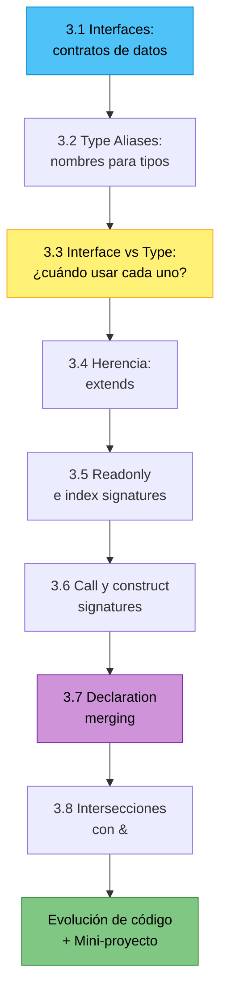
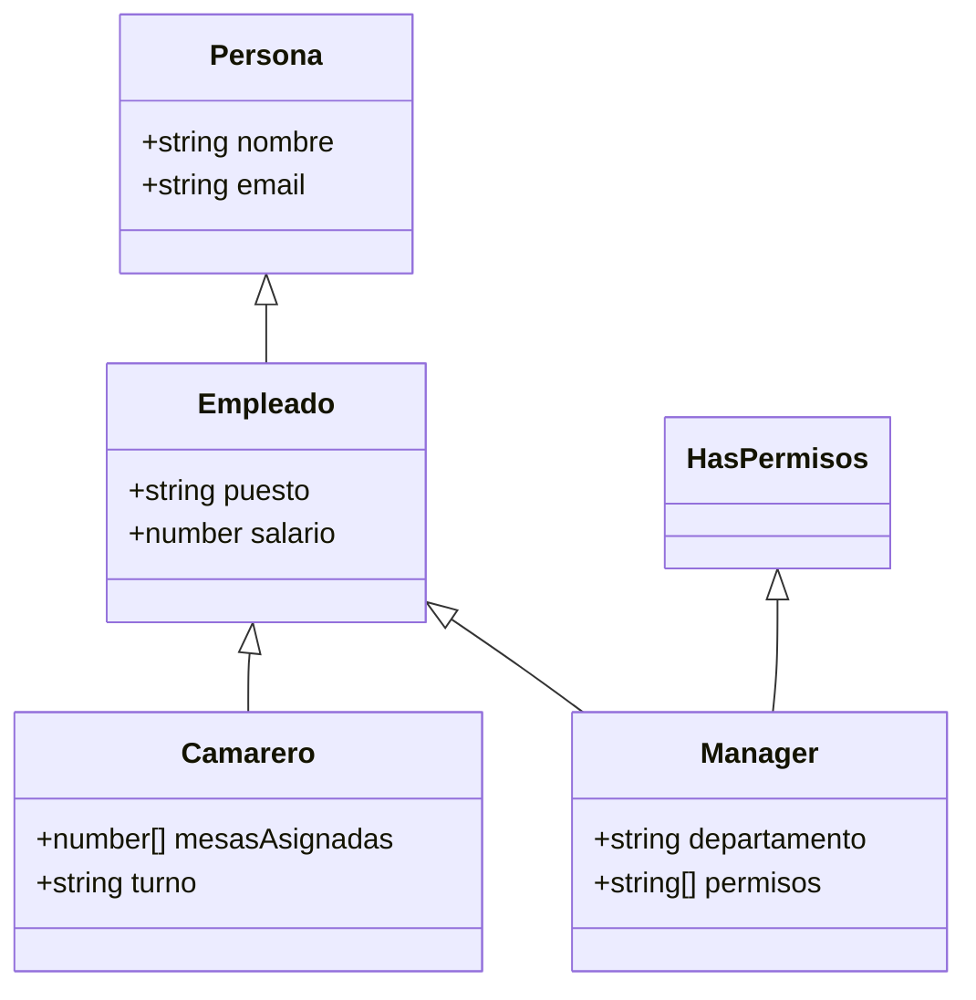

# :building_construction: Capítulo 3: Interfaces y Type Aliases

<div class="chapter-meta">
  <span class="meta-item">🕐 2-3 horas</span>
  <span class="meta-item">📊 Nivel: Principiante-Intermedio</span>
  <span class="meta-item">🎯 Semana 2</span>
</div>

<div class="chapter-objective">
  <span class="objective-icon">📌</span>
  <span class="objective-text">Al terminar este capítulo, sabrás crear interfaces y type aliases para modelar datos complejos, entenderás cuándo usar cada uno, y podrás definir los modelos de MakeMenu (Plato, Mesa, Pedido).</span>
</div>

<div class="chapter-map">
<h4>🗺️ Mapa del capítulo</h4>


</div>

<div class="connection-box">
<span class="connection-icon">🔗</span>
<span>Recuerda del <a href='../02-tipos-basicos/'>Capítulo 2</a> que TypeScript tiene tipos primitivos (<code>string</code>, <code>number</code>, <code>boolean</code>). Las interfaces combinan estos primitivos para modelar estructuras complejas.</span>
</div>

!!! quote "Contexto"
    Si los tipos básicos son los ladrillos, las interfaces y type aliases son los **planos del edificio**. Definen la FORMA de tus datos, como un modelo de Django define la estructura de tu base de datos.

---

<div class="concept-question">
<h4>🔍 Pregunta conceptual</h4>
<p>En Python usas clases o dataclasses para modelar datos. ¿Cómo crees que TypeScript define la "forma" de un objeto sin crear una clase? ¿Necesitas instanciar algo?</p>
</div>

## 3.1 Interfaces: definiendo contratos

Una **interface** define la forma que debe tener un objeto. Es un contrato: cualquier objeto que diga ser de ese tipo **DEBE** cumplir con todas las propiedades.

```typescript
interface Mesa {
  id: number;
  número: number;
  zona: string;
  capacidad: number;
  ocupada: boolean;
  reserva?: Reserva;  // (1)!
}

interface Reserva {
  nombre: string;
  hora: string;
  personas: number;
  telefono?: string;
}

// Uso: TypeScript verifica que cumplas el contrato
const mesa1: Mesa = {
  id: 1, número: 5, zona: "terraza",
  capacidad: 4, ocupada: true,
  reserva: { nombre: "García", hora: "20:30", personas: 3 }
};
```

1. El `?` marca `reserva` como **opcional**: puede o no estar presente.

<div class="comparison" markdown>
<div class="lang-box python" markdown>

#### :snake: En Django

```python
class Mesa(models.Model):
    número = IntegerField()
    zona = CharField(max_length=50)
    capacidad = IntegerField()
```
El modelo define campos con tipos.

</div>
<div class="lang-box typescript" markdown>

#### 🔷 En TypeScript

```typescript
interface Mesa {
  número: number;
  zona: string;
  capacidad: number;
}
```
La interface define propiedades con tipos. Mismo concepto, diferente nivel.

</div>
</div>

### Tipado estructural: la diferencia fundamental

!!! warning "Concepto clave que debes entender"
    TypeScript usa **tipado estructural** (structural typing), no **tipado nominal** como Python, Java o C#. Esto significa que la compatibilidad de tipos se decide por la **forma** (propiedades y sus tipos), no por el nombre o la declaración.

```typescript
interface Mesa {
  número: number;
  zona: string;
}

// Este objeto NO declara ser "Mesa", pero satisface su forma:
const algo = { número: 5, zona: "terraza", capacidad: 4 };
const mesa: Mesa = algo;  // ✅ Funciona: tiene número y zona

// Siempre que la forma encaje, TypeScript lo acepta
function reservar(mesa: Mesa) { /* ... */ }
reservar({ número: 3, zona: "barra" });  // ✅ Anónimo, pero encaja
```

<div class="comparison" markdown>
<div class="lang-box python" markdown>

#### :snake: Python (nominal/duck typing)

```python
# Python usa duck typing en runtime:
# "Si camina como pato y grazna como pato..."
class Mesa:
    def __init__(self, num: int, zona: str):
        self.num = num
        self.zona = zona

# isinstance() comprueba la CLASE, no la forma
isinstance(Mesa(5, "terraza"), Mesa)  # True
isinstance({"num": 5, "zona": "bar"}, Mesa)  # False
```
Python verifica el **nombre de la clase** en runtime.

</div>
<div class="lang-box typescript" markdown>

#### 🔷 TypeScript (structural typing)

```typescript
interface Mesa {
  num: number;
  zona: string;
}

// No necesitas "new" ni "class" —
// cualquier objeto con la forma correcta vale:
const obj = { num: 5, zona: "terraza" };
const mesa: Mesa = obj;  // ✅ Mismo "duck typing"
// pero verificado en COMPILACIÓN
```
TypeScript verifica la **forma del objeto** en compilación.

</div>
</div>

<div class="misconception">
<h4>⚠️ Misconception</h4>
<p><strong>Error:</strong> "Necesito <code>implements Mesa</code> para que un objeto sea de tipo <code>Mesa</code>".</p>
<p><strong>Realidad:</strong> En TypeScript, cualquier objeto que tenga las propiedades correctas satisface automáticamente la interface. No necesitas <code>implements</code>, ni <code>new</code>, ni declarar nada. Esto es radicalmente diferente de Python/Java, donde la compatibilidad de tipos depende del nombre de la clase.</p>
</div>

<div class="micro-exercise">
<h4>🧪 Micro-ejercicio (2 min)</h4>
<p>Define una interfaz <code>Mesa</code> para MakeMenu con: <code>número</code> (number), <code>zona</code> (string), <code>capacidad</code> (number), y <code>ocupada</code> (boolean). Crea un objeto que la implemente.</p>
</div>

## 3.2 Type Aliases: nombres para tipos

```typescript
// Para tipos simples y uniones
type ID = number | string;
type Zona = "interior" | "terraza" | "barra";  // (1)!
type Coordenada = [number, number];

// Para objetos (similar a interface)
type MenuItem = {
  nombre: string;
  precio: number;
  categoria: "entrante" | "principal" | "postre";
  alergenos: string[];
};
```

1. Esto es un **literal type union**: solo acepta exactamente estos 3 valores string.

<div class="concept-question">
<h4>🔍 Pregunta conceptual</h4>
<p>Si tanto <code>interface</code> como <code>type</code> pueden definir la forma de un objeto, ¿por qué existen ambos? ¿Cuándo usarías uno u otro?</p>
</div>

## 3.3 Interface vs Type: ¿cuándo usar cada uno?

| Característica | `interface` | `type` |
|:---|:---|:---|
| Extender/heredar | `extends` (natural) | `&` intersección |
| Uniones (`\|`) | :x: No soporta | ✅ Sí |
| Declaration merging | ✅ Se fusionan | :x: Error si duplicas |
| Para objetos/clases | ⭐ Preferido | Funciona igual |
| Para primitivos/uniones | No aplica | ⭐ Preferido |
| Performance compilador | Ligeramente mejor | Igual en la práctica |

!!! tip "Convención profesional"
    - Usa `interface` para **objetos** y contratos de API
    - Usa `type` para **uniones**, intersecciones y aliases de primitivos

    En MakeMenu: `Mesa`, `Reserva`, `Restaurante` → `interface`. `EstadoMesa = "libre" | "ocupada"` → `type`.

<div class="misconception-box">
<h4>⚠️ Errores comunes</h4>
<ul>
<li><span class="wrong">❌ Mito:</span> "Las interfaces son como clases" → <span class="right">✅ Realidad:</span> Las interfaces NO generan código JavaScript. Son puramente declaraciones de tipo que desaparecen al compilar. No tienen constructor ni métodos implementados.</li>
<li><span class="wrong">❌ Mito:</span> "<code>type</code> e <code>interface</code> son intercambiables siempre" → <span class="right">✅ Realidad:</span> Las interfaces soportan <code>extends</code> y declaración merge. Los <code>type</code> soportan uniones (<code>|</code>) y mapped types. Cada uno tiene superpoderes únicos.</li>
<li><span class="wrong">❌ Mito:</span> "Si no pongo <code>readonly</code>, TypeScript me deja modificar todo" → <span class="right">✅ Realidad:</span> Sí te deja, pero eso no significa que debas. En producción, marca como <code>readonly</code> todo lo que no debería cambiar después de crearse.</li>
</ul>
</div>

<div class="pro-tip">
<h4>💡 Consejo Pro</h4>
<p>En MakeMenu y proyectos reales, la convención es: usa <code>interface</code> para objetos y contratos de API, usa <code>type</code> para uniones, intersecciones y tipos computados. Si dudas, empieza con <code>interface</code> — puedes cambiarlo después sin romper nada.</p>
</div>

## 3.4 Herencia de interfaces

```typescript
interface Persona {
  nombre: string;
  email: string;
}

interface Empleado extends Persona {
  puesto: string;
  salario: number;
}

interface Camarero extends Empleado {
  mesasAsignadas: number[];
  turno: "mañana" | "tarde" | "noche";
}

// Herencia múltiple
interface HasPermisos {
  permisos: string[];
}

interface Manager extends Empleado, HasPermisos {
  departamento: string;
}
```



<div class="concept-question">
<h4>🔍 Pregunta conceptual</h4>
<p>¿Qué pasa si un objeto tiene propiedades que a veces existen y a veces no? En Python usarías <code>Optional[str]</code>. ¿Cómo lo manejas en TypeScript?</p>
</div>

## 3.5 Readonly y propiedades de índice

```typescript
interface Config {
  readonly apiUrl: string;       // (1)!
  readonly maxMesas: number;
  tema: "light" | "dark";        // Este sí se puede cambiar
}

const config: Config = { apiUrl: "https://api.makemenu.com", maxMesas: 50, tema: "dark" };
config.tema = "light";   // ✅ OK
// config.apiUrl = "otro"; // ❌ Cannot assign to 'apiUrl' (read-only)
```

1. `readonly` impide la reasignación. Equivalente conceptual a una propiedad frozen en Python.

<div class="micro-exercise">
<h4>🧪 Micro-ejercicio (2 min)</h4>
<p>Añade a tu interfaz <code>Mesa</code> una propiedad opcional <code>reservadaPor?: string</code>. Crea dos mesas: una con reserva y otra sin ella.</p>
</div>

```typescript
// Index signatures: objetos con claves dinámicas
interface Traducciones {
  [clave: string]: string;
}

const es: Traducciones = {
  greeting: "Hola",
  farewell: "Adiós",
  // Cualquier clave string → valor string
};
```

## 3.6 Call signatures y construct signatures

Las interfaces pueden describir funciones y constructores, no solo objetos con propiedades:

```typescript
// Call signature: describe una función
interface Formateador {
  (valor: number, decimales?: number): string;  // (1)!
}

const formatearPrecio: Formateador = (valor, decimales = 2) => {
  return `${valor.toFixed(decimales)} €`;
};

formatearPrecio(12.5);     // "12.50 €"
formatearPrecio(12.5, 0);  // "13 €"

// Callable con propiedades: función + datos
interface ValidadorConInfo {
  (valor: string): boolean;
  nombre: string;
  descripción: string;
}

function crearValidador(
  nombre: string, desc: string, fn: (v: string) => boolean
): ValidadorConInfo {
  const validador = fn as ValidadorConInfo;
  validador.nombre = nombre;
  validador.descripción = desc;
  return validador;
}

const esEmail = crearValidador(
  "email", "Valida formato de email",
  (v) => /^[^@]+@[^@]+\.[^@]+$/.test(v)
);

esEmail("daniele@mail.com");  // true (como función)
esEmail.nombre;               // "email" (como objeto)
```

1. La sintaxis `(param: tipo): retorno` dentro de una interface define una **call signature** — convierte la interface en un tipo de función.

```typescript
// Construct signature: describe un constructor
interface MesaConstructor {
  new (número: number, zona: string): Mesa;  // (1)!
}
```

1. `new` antes de los parámetros indica que es un constructor, no una función normal.

<div class="comparison" markdown>
<div class="lang-box python" markdown>

#### :snake: En Python

Python usa `__call__` para objetos invocables y protocolos (PEP 544) para describir interfaces de funciones.

</div>
<div class="lang-box typescript" markdown>

#### 🔷 En TypeScript

Las interfaces pueden describir tanto la forma de un objeto como su **invocabilidad**: call signatures, construct signatures, e incluso ambas a la vez.

</div>
</div>

## 3.7 Declaration merging

Una característica única de `interface` (no de `type`): si declaras la misma interface dos veces, **se fusionan automáticamente**:

```typescript
// Definición original (por ejemplo, de una librería)
interface Window {
  title: string;
}

// Tu extensión (se fusiona con la original)
interface Window {
  makemenu: {
    version: string;
    debug: boolean;
  };
}

// Resultado: Window tiene AMBAS propiedades
const w: Window = {
  title: "MakeMenu Dashboard",
  makemenu: { version: "1.0.0", debug: true }
};
```

!!! info "Uso real"
    Declaration merging se usa constantemente para **extender tipos de librerías**. Por ejemplo, extender el objeto `Request` de Express:

    ```typescript
    // types/express.d.ts
    declare module "express-serve-static-core" {
      interface Request {
        usuario?: { id: number; rol: string };
      }
    }
    ```
    Ahora `req.usuario` existe en todos tus handlers de Express.

!!! warning "type no soporta merging"
    Si intentas declarar `type Window = { ... }` dos veces, TypeScript da error: `Duplicate identifier 'Window'`. Esta es una de las diferencias clave entre `interface` y `type`.

<div class="pro-tip">
<h4>💡 Consejo Pro</h4>
<p>Siempre define tus interfaces en un archivo separado (<code>types.ts</code> o <code>models.ts</code>). En MakeMenu, tenemos <code>src/types/restaurant.ts</code> con todas las interfaces del dominio. Esto facilita compartirlas entre frontend y backend.</p>
</div>

## 3.8 Intersecciones con `&`

Los type aliases usan `&` para **combinar** tipos (equivalente a herencia múltiple):

```typescript
type ConTimestamps = {
  createdAt: Date;
  updatedAt: Date;
};

type ConId = {
  id: number;
};

// Combinación: tiene TODAS las propiedades de ambos
type Mesa = ConId & ConTimestamps & {
  número: number;
  zona: string;
  capacidad: number;
};

// Equivalente con interface extends:
interface MesaI extends ConId, ConTimestamps {
  número: number;
  zona: string;
  capacidad: number;
}
```

!!! tip "¿`extends` o `&`?"
    - Usa `extends` cuando trabajas con interfaces y hay una jerarquía clara (Empleado → Camarero)
    - Usa `&` cuando combinas tipos independientes (como mixins: `ConTimestamps & ConSoftDelete`)
    - Ambos producen el mismo resultado, pero `extends` da mejores errores de compilación

<div class="connection-box">
<span class="connection-icon">🔗</span>
<span>En el <a href='../04-funciones/'>Capítulo 4</a> verás cómo usar interfaces como tipos de parámetros y retorno en funciones — por ejemplo, una función <code>crearPlato(datos: CrearPlatoInput): Plato</code>.</span>
</div>

---

<div class="code-evolution">
<div class="evolution-header">📈 Evolución del código: modelando un plato de MakeMenu</div>
<div class="evolution-step">
<span class="step-label novato">v1 — Novato</span>

```typescript
// ❌ Objeto plano sin tipo — sin autocompletado ni verificación
const plato = {
  nombre: "Paella",
  precio: 14.50,
  disponible: true
};
// plato.prcio = 10;  // Typo silencioso, nadie te avisa
```
</div>
<div class="evolution-step">
<span class="step-label mejorado">v2 — Con interface básica</span>

```typescript
// ✅ Interface básica — TypeScript verifica la forma
interface Plato {
  nombre: string;
  precio: number;
  disponible: boolean;
}

const plato: Plato = {
  nombre: "Paella",
  precio: 14.50,
  disponible: true
};
// plato.prcio = 10;  // ❌ Error: 'prcio' no existe en Plato
```
</div>
<div class="evolution-step">
<span class="step-label profesional">v3 — Profesional</span>

```typescript
// 🏆 Interface con readonly, opcionales, tipos derivados y extends
interface PlatoBase {
  readonly id: number;
  nombre: string;
  precio: number;
  categoria: "entrante" | "principal" | "postre" | "bebida";
  disponible: boolean;
  alergenos?: string[];
  descripción?: string;
}

interface PlatoConDetalles extends PlatoBase {
  readonly creadoEn: Date;
  imagen?: string;
  valoración: { media: number; total: number };
}

type CrearPlatoInput = Omit<PlatoBase, "id">;
```
</div>
</div>

<div class="ejercicio-guiado">
<h4>🏋️ Ejercicio guiado</h4>

Vas a modelar el sistema de pedidos de MakeMenu usando interfaces con herencia, propiedades readonly, opcionales e intersecciones.

1. Define una interface `EntidadBase` con `readonly id: number` y `readonly creadoEn: Date`.
2. Define una interface `Plato` que extienda `EntidadBase` y agregue: `nombre` (string), `precio` (number), `categoria` (literal union `"entrante" | "principal" | "postre" | "bebida"`), `disponible` (boolean) y `descripcion` (optional string).
3. Define una interface `LineaPedido` con: `plato` (Plato), `cantidad` (number) y `nota` (optional string para instrucciones especiales como "sin gluten").
4. Define una interface `Pedido` que extienda `EntidadBase` y agregue: `mesa` (number), `lineas` (array de LineaPedido), `estado` (literal union `"pendiente" | "preparando" | "servido" | "pagado"`) y `readonly total` (number).
5. Crea un type alias `PedidoConCliente` usando intersección (`&`) que combine `Pedido` con `{ cliente: string; telefono?: string }`.
6. Crea un objeto `pedido` de tipo `PedidoConCliente` con al menos 2 lineas de pedido y verifica que TypeScript no permite modificar las propiedades `readonly`.

??? success "Solución completa"
    ```typescript
    // Paso 1: Entidad base
    interface EntidadBase {
      readonly id: number;
      readonly creadoEn: Date;
    }

    // Paso 2: Plato con herencia
    interface Plato extends EntidadBase {
      nombre: string;
      precio: number;
      categoria: "entrante" | "principal" | "postre" | "bebida";
      disponible: boolean;
      descripcion?: string;
    }

    // Paso 3: Linea de pedido
    interface LineaPedido {
      plato: Plato;
      cantidad: number;
      nota?: string;
    }

    // Paso 4: Pedido con herencia
    interface Pedido extends EntidadBase {
      mesa: number;
      lineas: LineaPedido[];
      estado: "pendiente" | "preparando" | "servido" | "pagado";
      readonly total: number;
    }

    // Paso 5: Interseccion para añadir datos de cliente
    type PedidoConCliente = Pedido & {
      cliente: string;
      telefono?: string;
    };

    // Paso 6: Objeto completo
    const paella: Plato = {
      id: 1, creadoEn: new Date(), nombre: "Paella Valenciana",
      precio: 16.50, categoria: "principal", disponible: true,
      descripcion: "Arroz con mariscos frescos",
    };

    const tiramisu: Plato = {
      id: 2, creadoEn: new Date(), nombre: "Tiramisú casero",
      precio: 7.00, categoria: "postre", disponible: true,
    };

    const pedido: PedidoConCliente = {
      id: 101,
      creadoEn: new Date(),
      mesa: 5,
      lineas: [
        { plato: paella, cantidad: 2, nota: "Una sin marisco" },
        { plato: tiramisu, cantidad: 2 },
      ],
      estado: "pendiente",
      total: 47.00,
      cliente: "García",
      telefono: "+34 612 345 678",
    };

    // pedido.id = 200;      // ❌ Cannot assign to 'id' (readonly)
    // pedido.total = 50;     // ❌ Cannot assign to 'total' (readonly)
    pedido.estado = "preparando"; // ✅ No es readonly, se puede cambiar
    ```

</div>

<div class="real-errors">
<h4>🔥 Errores reales del compilador con interfaces y tipos</h4>

Estos son errores que vas a encontrar constantemente al trabajar con interfaces y type aliases. Aprende a leerlos y resolverlos:

**Error 1 — Propiedad faltante en un objeto**

```typescript
interface Plato {
  nombre: string;
  precio: number;
  categoria: string;
}

const miPlato: Plato = {
  nombre: "Tortilla",
  precio: 8.50
};
```

```
// ❌ Error TS2741: Property 'categoria' is missing in type
//    '{ nombre: string; precio: number; }' but required in type 'Plato'.
```

**Solución:** Asegúrate de incluir todas las propiedades requeridas, o marca `categoria` como opcional con `?` si no siempre es necesaria.

---

**Error 2 — Propiedad que no existe en la interface (excess property check)**

```typescript
interface Reserva {
  nombre: string;
  hora: string;
  personas: number;
}

const reserva: Reserva = {
  nombre: "López",
  hora: "21:00",
  personas: 4,
  telefono: "612345678"  // ❌ propiedad extra
};
```

```
// ❌ Error TS2353: Object literal may only specify known properties,
//    and 'telefono' does not exist in type 'Reserva'.
```

**Solución:** Agrega `telefono?: string` a la interface `Reserva`, o elimina la propiedad del objeto. TypeScript solo aplica esta comprobación estricta en objetos literales (asignados directamente).

---

**Error 3 — Tipo incompatible al extender una interface**

```typescript
interface EntidadBase {
  id: number;
}

interface Mesa extends EntidadBase {
  id: string;  // ❌ intentando cambiar el tipo de 'id'
  número: number;
}
```

```
// ❌ Error TS2430: Interface 'Mesa' incorrectly extends interface 'EntidadBase'.
//    Types of property 'id' are incompatible.
//    Type 'string' is not assignable to type 'number'.
```

**Solución:** La interface hija no puede cambiar el tipo de una propiedad heredada. Si `id` es `number` en `EntidadBase`, debe seguir siendo `number` en `Mesa`. Usa un tipo más específico compatible (ej: un literal `1 | 2 | 3` es compatible con `number`).

---

**Error 4 — Asignar a una propiedad readonly**

```typescript
interface Config {
  readonly apiUrl: string;
  readonly version: number;
}

const config: Config = { apiUrl: "https://api.makemenu.com", version: 1 };
config.version = 2;
```

```
// ❌ Error TS2540: Cannot assign to 'version' because it is a read-only property.
```

**Solución:** Las propiedades `readonly` solo se pueden asignar durante la creación del objeto. Si necesitas una nueva version, crea un objeto nuevo: `const configV2: Config = { ...config, version: 2 };`

---

**Error 5 — Duplicar un type alias**

```typescript
type EstadoMesa = "libre" | "ocupada";
type EstadoMesa = "libre" | "ocupada" | "reservada";  // ❌ duplicado
```

```
// ❌ Error TS2300: Duplicate identifier 'EstadoMesa'.
```

**Solución:** A diferencia de `interface`, los `type` no soportan declaration merging. Si necesitas extender un type, crea uno nuevo: `type EstadoMesaExtendido = EstadoMesa | "reservada";`
</div>

<div class="checkpoint">
<h4>🏁 Checkpoint</h4>
<p>Si puedes: (1) definir una interfaz con propiedades requeridas, opcionales y readonly, (2) explicar la diferencia entre <code>interface</code> y <code>type</code>, y (3) crear modelos para un dominio real — estás listo para el <a href="../04-funciones/">Capítulo 4</a>.</p>
</div>

<div class="mini-project">
<h4>🛠️ Mini-proyecto: Sistema de pedidos de MakeMenu</h4>
<p>Vamos a construir paso a paso el modelo de tipos para un sistema de pedidos de restaurante. Cada paso se basa en el anterior. Al final tendrás un sistema de tipos completo y profesional.</p>

??? question "Paso 1: Tipos base del dominio"
    Define los tipos fundamentales del sistema de pedidos:

    - Un type alias `CategoriaPlato` con los valores: `"entrante"`, `"principal"`, `"postre"`, `"bebida"`
    - Un type alias `EstadoPedido` con los valores: `"pendiente"`, `"en_preparación"`, `"servido"`, `"pagado"`
    - Una interface `Plato` con: `id` (readonly number), `nombre` (string), `precio` (number), `categoria` (CategoriaPlato), `disponible` (boolean), y `alergenos` (optional string array)

    ??? success "Solución Paso 1"
        ```typescript
        type CategoriaPlato = "entrante" | "principal" | "postre" | "bebida";
        type EstadoPedido = "pendiente" | "en_preparación" | "servido" | "pagado";

        interface Plato {
          readonly id: number;
          nombre: string;
          precio: number;
          categoria: CategoriaPlato;
          disponible: boolean;
          alergenos?: string[];
        }
        ```

??? question "Paso 2: Linea de pedido y pedido completo"
    Usando los tipos del paso anterior, crea:

    - Una interface `LineaPedido` con: `plato` (Plato), `cantidad` (number), `nota` (optional string para instrucciones como "sin gluten"), y `subtotal` (readonly number)
    - Una interface `Pedido` con: `id` (readonly number), `mesa` (number), `lineas` (array de LineaPedido), `estado` (EstadoPedido), `creadoEn` (readonly Date), y `total` (readonly number)

    ??? success "Solución Paso 2"
        ```typescript
        interface LineaPedido {
          plato: Plato;
          cantidad: number;
          nota?: string;
          readonly subtotal: number;
        }

        interface Pedido {
          readonly id: number;
          mesa: number;
          lineas: LineaPedido[];
          estado: EstadoPedido;
          readonly creadoEn: Date;
          readonly total: number;
        }
        ```

??? question "Paso 3: Herencia para pedidos especiales"
    Extiende el sistema con tipos especializados:

    - Una interface `PedidoParaLlevar` que extienda `Pedido` y agregue: `direccionEntrega` (string), `telefonoContacto` (string), y `horaEstimada` (optional string)
    - Una interface `PedidoVIP` que extienda `Pedido` y agregue: `nombreCliente` (string), `descuento` (number entre 0 y 1), y `notasChef` (optional string)
    - Un type alias `CualquierPedido` que sea la union de `Pedido`, `PedidoParaLlevar` y `PedidoVIP`

    ??? success "Solución Paso 3"
        ```typescript
        interface PedidoParaLlevar extends Pedido {
          direccionEntrega: string;
          telefonoContacto: string;
          horaEstimada?: string;
        }

        interface PedidoVIP extends Pedido {
          nombreCliente: string;
          descuento: number; // 0 a 1 (ej: 0.15 = 15%)
          notasChef?: string;
        }

        type CualquierPedido = Pedido | PedidoParaLlevar | PedidoVIP;
        ```

??? question "Paso 4: Ponlo todo junto"
    Crea un objeto `pedidoEjemplo` de tipo `PedidoVIP` que represente un pedido real. Incluye al menos 2 lineas de pedido con platos concretos. Verifica que TypeScript no da ningun error.

    ??? success "Solución Paso 4"
        ```typescript
        const paella: Plato = {
          id: 1,
          nombre: "Paella Valenciana",
          precio: 16.50,
          categoria: "principal",
          disponible: true,
          alergenos: ["gluten", "marisco"]
        };

        const tiramisuPlato: Plato = {
          id: 2,
          nombre: "Tiramisu casero",
          precio: 7.00,
          categoria: "postre",
          disponible: true
        };

        const pedidoEjemplo: PedidoVIP = {
          id: 101,
          mesa: 3,
          lineas: [
            {
              plato: paella,
              cantidad: 2,
              nota: "Una sin marisco por favor",
              subtotal: 33.00
            },
            {
              plato: tiramisuPlato,
              cantidad: 2,
              subtotal: 14.00
            }
          ],
          estado: "en_preparación",
          creadoEn: new Date(),
          total: 39.95, // Con descuento VIP aplicado
          nombreCliente: "Sr. Martinez",
          descuento: 0.15,
          notasChef: "Cliente habitual, le gusta el punto extra de azafran"
        };
        ```
</div>

---

## :link: Recursos

| Recurso | Enlace |
|---------|--------|
| Object Types | [typescriptlang.org/.../objects](https://www.typescriptlang.org/docs/handbook/2/objects.html) |
| Interface vs Type | [totaltypescript.com/type-vs-interface](https://www.totaltypescript.com/type-vs-interface-which-should-you-use) |

---

## 🎯 Ejercicios

??? question "Ejercicio 1: Modelar MakeMenu"
    Modela las interfaces principales de tu proyecto: `Restaurante`, `Mesa`, `Reserva`, `MenuItem`.

    ??? success "Solución"
        ```typescript
        interface Restaurante {
          id: number;
          nombre: string;
          dirección: string;
          mesas: Mesa[];
          menu: MenuItem[];
        }

        interface Mesa {
          id: number;
          número: number;
          zona: Zona;
          capacidad: number;
          ocupada: boolean;
          reservaActual?: Reserva;
        }

        interface Reserva {
          id: number;
          nombre: string;
          hora: string;
          personas: number;
          mesa: number;
          telefono?: string;
          comentarios?: string;
        }

        interface MenuItem {
          id: number;
          nombre: string;
          precio: number;
          categoria: "entrante" | "principal" | "postre" | "bebida";
          alergenos: string[];
          disponible: boolean;
        }

        type Zona = "interior" | "terraza" | "barra" | "privado";
        ```

??? question "Ejercicio 2: EstadoMesa"
    Crea un `type` alias `EstadoMesa` con 3-4 valores posibles y úsalo en la interface Mesa.

    ??? success "Solución"
        ```typescript
        type EstadoMesa = "libre" | "ocupada" | "reservada" | "limpieza";

        interface Mesa {
          id: number;
          número: number;
          estado: EstadoMesa; // ✅ Solo acepta los 4 valores
        }
        ```

??? question "Ejercicio 3: Herencia"
    Extiende la interface `Reserva` con `ReservaVIP` que añada `preferenciaVino` y `presupuestoMinimo`.

    ??? success "Solución"
        ```typescript
        interface ReservaVIP extends Reserva {
          preferenciaVino: string;
          presupuestoMinimo: number;
          salaPrivada: boolean;
          atencionPersonalizada: boolean;
        }

        const vip: ReservaVIP = {
          id: 1, nombre: "Sr. Martínez", hora: "21:00",
          personas: 6, mesa: 1,
          preferenciaVino: "Ribera del Duero Reserva",
          presupuestoMinimo: 500,
          salaPrivada: true,
          atencionPersonalizada: true
        };
        ```

??? question "Ejercicio 4: Call signature"
    Crea una interface `Filtro` que sea invocable (recibe un array de `Mesa` y devuelve un array de `Mesa`) y que también tenga una propiedad `nombre` de tipo string. Implementa un filtro que devuelva solo las mesas libres.

    !!! tip "Pista"
        Necesitas una call signature `(mesas: Mesa[]): Mesa[]` dentro de la interface, más una propiedad `nombre: string`.

    ??? success "Solución"
        ```typescript
        interface Mesa {
          id: number;
          número: number;
          ocupada: boolean;
        }

        interface Filtro {
          (mesas: Mesa[]): Mesa[];
          nombre: string;
        }

        const filtroLibres: Filtro = Object.assign(
          (mesas: Mesa[]) => mesas.filter(m => !m.ocupada),
          { nombre: "Solo mesas libres" }
        );

        const mesas: Mesa[] = [
          { id: 1, número: 1, ocupada: false },
          { id: 2, número: 2, ocupada: true },
          { id: 3, número: 3, ocupada: false },
        ];

        filtroLibres(mesas);     // [{ id: 1, ... }, { id: 3, ... }]
        filtroLibres.nombre;     // "Solo mesas libres"
        ```

??? question "Ejercicio 5: Declaration merging"
    Simula el siguiente escenario: una librería externa declara una interface `AppConfig` con `appName` y `version`. Tú necesitas extenderla con `makemenu: { maxMesas: number }` usando declaration merging. Luego crea un objeto que cumpla la interface completa.

    !!! tip "Pista"
        Simplemente declara otra `interface AppConfig` con las propiedades adicionales. TypeScript las fusionará automáticamente.

    ??? success "Solución"
        ```typescript
        // Simulando la declaración de la librería
        interface AppConfig {
          appName: string;
          version: string;
        }

        // Tu extensión via declaration merging
        interface AppConfig {
          makemenu: {
            maxMesas: number;
            zonas: string[];
          };
        }

        // Ahora AppConfig tiene TODAS las propiedades
        const config: AppConfig = {
          appName: "MakeMenu",
          version: "2.0.0",
          makemenu: {
            maxMesas: 50,
            zonas: ["interior", "terraza", "barra"]
          }
        };
        ```

---

## :brain: Flashcards de repaso

<div class="flashcard">
<div class="front">¿Cuál es la principal diferencia entre <code>interface</code> y <code>type</code>?</div>
<div class="back"><code>interface</code> soporta declaration merging y es preferida para objetos. <code>type</code> soporta uniones y es preferido para aliases de primitivos y tipos compuestos.</div>
</div>

<div class="flashcard">
<div class="front">¿Qué es una call signature en una interface?</div>
<div class="back">Una forma de declarar que un objeto es invocable: <code>interface F { (x: number): string; }</code> — define una función que recibe un number y devuelve un string.</div>
</div>

<div class="flashcard">
<div class="front">¿Qué es declaration merging?</div>
<div class="back">Si declaras la misma <code>interface</code> dos veces, TypeScript fusiona ambas declaraciones. Útil para extender tipos de librerías externas.</div>
</div>

<div class="flashcard">
<div class="front">¿Diferencia entre <code>extends</code> y <code>&</code> para combinar tipos?</div>
<div class="back"><code>extends</code> es para interfaces (herencia). <code>&</code> es intersección para type aliases. Mismo resultado, pero <code>extends</code> da mejores errores.</div>
</div>

<div class="flashcard">
<div class="front">¿Cuándo usar <code>readonly</code> en una interface?</div>
<div class="back">Cuando una propiedad no debe cambiar después de la creación del objeto. Ejemplo: <code>readonly id: number</code> para IDs de base de datos.</div>
</div>

---

## :video_game: Quiz interactivo

<div class="quiz" data-quiz-id="ch03-q1">
<h4>Pregunta 1: ¿Qué pasa si declaras la misma <code>interface</code> dos veces?</h4>
<button class="quiz-option" data-correct="false">Error de compilación: nombre duplicado</button>
<button class="quiz-option" data-correct="true">TypeScript fusiona ambas declaraciones (declaration merging)</button>
<button class="quiz-option" data-correct="false">La segunda reemplaza a la primera</button>
<button class="quiz-option" data-correct="false">Solo funciona con <code>type</code>, no con <code>interface</code></button>
<div class="quiz-feedback" data-correct="¡Correcto! Las interfaces se fusionan automáticamente. Es una feature de TypeScript muy útil para extender tipos de librerías." data-incorrect="Incorrecto. TypeScript fusiona las dos declaraciones de interface en una sola (declaration merging). Con `type` esto SÍ daría error."></div>
</div>

<div class="quiz" data-quiz-id="ch03-q2">
<h4>Pregunta 2: ¿Cuál es la forma correcta de hacer una propiedad opcional?</h4>
<button class="quiz-option" data-correct="false"><code>nombre: string | undefined</code></button>
<button class="quiz-option" data-correct="true"><code>nombre?: string</code></button>
<button class="quiz-option" data-correct="false"><code>nombre: Optional&lt;string&gt;</code></button>
<button class="quiz-option" data-correct="false"><code>optional nombre: string</code></button>
<div class="quiz-feedback" data-correct="¡Correcto! El `?` después del nombre hace la propiedad opcional (puede estar ausente del objeto)." data-incorrect="Incorrecto. En TypeScript, `nombre?: string` hace la propiedad opcional. `string | undefined` permite `undefined` como valor pero la propiedad debe existir."></div>
</div>

---

## :bug: Ejercicio de depuración

Encuentra los 3 errores en este código:

```typescript
// ❌ Este código tiene 3 errores. ¡Encuéntralos!

interface Plato {
  readonly id: number;
  nombre: string;
  precio: number;
  categoria: "entrante" | "principal" | "postre";
  alergenos?: string[];
}

const plato: Plato = {
  id: 1,
  nombre: "Paella",
  precio: 15.50,
  categoria: "primero",        // Error 1
  alergenos: ["gluten", 42]    // Error 2
};

plato.id = 2;                  // Error 3
```

??? success "Solución"
    ```typescript
    const plato: Plato = {
      id: 1,
      nombre: "Paella",
      precio: 15.50,
      categoria: "principal",       // ✅ Fix 1: "primero" no es un literal válido
      alergenos: ["gluten", "marisco"]  // ✅ Fix 2: string[], no (string | number)[]
    };

    // ✅ Fix 3: No se puede reasignar una propiedad readonly
    // plato.id = 2;  ← eliminar esta línea
    ```

---

## ✅ Autoevaluación del capítulo

<div class="self-check" markdown>
<h4>¿Has comprendido todo? Marca lo que puedes hacer:</h4>
<label><input type="checkbox"> Sé cuándo usar `interface` vs `type`</label>
<label><input type="checkbox"> Puedo crear interfaces con propiedades opcionales y readonly</label>
<label><input type="checkbox"> Entiendo declaration merging y cuándo es útil</label>
<label><input type="checkbox"> Puedo usar `extends` para herencia de interfaces</label>
<label><input type="checkbox"> Sé la diferencia entre call signature y construct signature</label>
</div>
