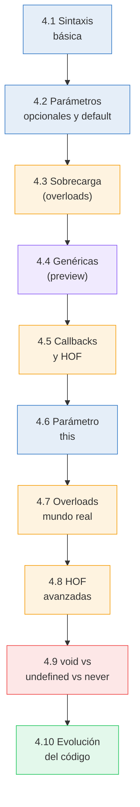
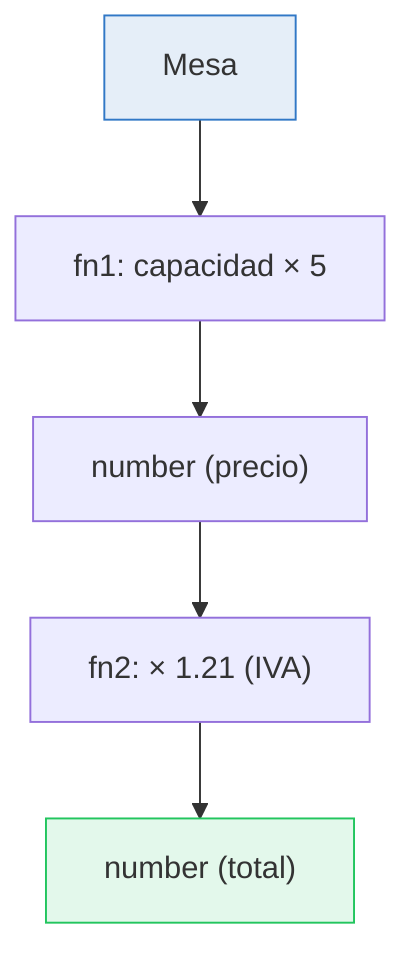

# :gear: Capítulo 4: Funciones tipadas

<div class="chapter-meta">
  <span class="meta-item">🕐 2-3 horas</span>
  <span class="meta-item">📊 Nivel: Intermedio</span>
  <span class="meta-item">🎯 Semana 2</span>
</div>

<div class="chapter-objective">
  <span class="objective-icon">📌</span>
  <span class="objective-text">Al terminar este capítulo, sabrás tipar funciones completas (parámetros, retorno, callbacks), usar overloads, y dominar arrow functions con tipos — las funciones son el corazón de TypeScript.</span>
</div>

<div class="chapter-map">



**Leyenda:** <span style="color:#3178c6">azul</span> = fundamentos | <span style="color:#f59e0b">naranja</span> = patrones intermedios | <span style="color:#8b5cf6">morado</span> = avanzado (preview) | <span style="color:#ef4444">rojo</span> = errores comunes | <span style="color:#22c55e">verde</span> = integración

</div>

!!! quote "Contexto"
    Las funciones son el corazón de cualquier programa. En Python, puedes pasar cualquier cosa a cualquier función. En TypeScript, cada función es un **contrato** que específica exactamente qué acepta y qué devuelve.

<div class="connection-box">
<span class="connection-icon">🔗</span>
<span>Recuerda del <a href='../03-interfaces/'>Capítulo 3</a> las interfaces que definiste. Ahora puedes usarlas como tipos de parámetros: <code>function crearPlato(datos: PlatoInput): Plato</code>.</span>
</div>

---

<div class="concept-question">
<h4>🔍 Pregunta conceptual</h4>
<p>En Python, <code>def</code> define una función y los type hints son opcionales. En TypeScript, ¿crees que el compilador puede inferir el tipo de retorno automáticamente, o siempre hay que escribirlo?</p>
</div>

## 4.1 Sintaxis básica

=== "TypeScript"

    ```typescript
    // Función con parámetros y retorno tipados
    function calcularTotal(precio: number, cantidad: number): number {
      return precio * cantidad;
    }

    // Arrow function tipada
    const calcularIVA = (precio: number, iva: number = 0.21): number => {
      return precio * (1 + iva);
    };

    // Type alias para funciones
    type Calculadora = (a: number, b: number) => number;
    const sumar: Calculadora = (a, b) => a + b;
    const restar: Calculadora = (a, b) => a - b;
    ```

=== "Python equivalente"

    ```python
    def calcular_total(precio: float, cantidad: int) -> float:
        return precio * cantidad

    # Lambda tipada (no común en Python)
    calcular_iva = lambda precio, iva=0.21: precio * (1 + iva)

    # Callable type
    from typing import Callable
    Calculadora = Callable[[float, float], float]
    sumar: Calculadora = lambda a, b: a + b
    ```

<div class="misconception-box" markdown>
<h4>❌ Error común</h4>
<p><strong>Mito:</strong> "Los type hints de Python y los tipos de TypeScript son equivalentes"</p>
<p><strong>Realidad:</strong> Python ignora los type hints en runtime — puedes escribir <code>x: int = "hola"</code> y Python lo ejecuta sin problemas. TypeScript verifica los tipos en compilación y los elimina del JavaScript resultante. En TypeScript, los tipos son un contrato obligatorio, no una sugerencia opcional.</p>
</div>

## 4.2 Parámetros opcionales y por defecto

```typescript
// Parámetro opcional: usa ?
function crearReserva(
  nombre: string,
  personas: number,
  comentario?: string  // (1)!
): Reserva {
  return {
    nombre,
    personas,
    comentario: comentario ?? "Sin comentarios" // (2)!
  };
}

// Parámetro con valor por defecto
function crearMesa(
  número: number,
  zona: string = "interior",
  capacidad: number = 4
): Mesa {
  return { número, zona, capacidad, ocupada: false };
}

crearReserva("García", 4);               // ✅ Sin comentario
crearReserva("López", 2, "Cumpleaños");  // ✅ Con comentario
crearMesa(5);                             // ✅ zona="interior", cap=4
```

1. Opcionales van **siempre al final**. `comentario` será `string | undefined`.
2. `??` es el **nullish coalescing**: usa el valor derecho si el izquierdo es `null` o `undefined`.

<div class="micro-exercise">
<h4>🧪 Micro-ejercicio (2 min)</h4>
<p>Escribe una función <code>calcularPrecioConIVA(precio: number, iva?: number): number</code> que use 21% como IVA por defecto. Pruébala con <code>calcularPrecioConIVA(10)</code> y <code>calcularPrecioConIVA(10, 0.10)</code>.</p>
</div>

<div class="misconception-box">
<h4>⚠️ Errores comunes</h4>
<ul>
<li><span class="wrong">❌ Mito:</span> "Siempre debo anotar el tipo de retorno" → <span class="right">✅ Realidad:</span> TypeScript infiere el retorno automáticamente. Pero en funciones públicas/exportadas, anotarlo explícitamente mejora la documentación y detecta errores antes.</li>
<li><span class="wrong">❌ Mito:</span> "Las arrow functions y las function declarations son iguales" → <span class="right">✅ Realidad:</span> Las arrow functions capturan <code>this</code> del contexto padre. Además, no se pueden usar como constructores ni tienen <code>arguments</code>.</li>
<li><span class="wrong">❌ Mito:</span> "Los parámetros opcionales pueden ir en cualquier posición" → <span class="right">✅ Realidad:</span> Los parámetros opcionales DEBEN ir después de los requeridos. <code>(a?: string, b: number)</code> es un error.</li>
</ul>
</div>

<div class="pro-tip">
<h4>💡 Consejo Pro</h4>
<p>Evita más de 3 parámetros en una función. Si necesitas más, usa un objeto de configuración con una interfaz: <code>function crearPedido(config: CrearPedidoConfig)</code> en vez de <code>crearPedido(mesa, platos, cliente, notas, descuento)</code>.</p>
</div>

<div class="concept-question">
<h4>🔍 Pregunta conceptual</h4>
<p>¿Qué pasa si una función necesita aceptar tanto un <code>string</code> como un <code>number</code>, pero devolver algo diferente en cada caso? ¿Cómo resolverías esto sin usar <code>any</code>?</p>
</div>

## 4.3 Sobrecarga de funciones (overloads)

```typescript
// Firmas de sobrecarga (lo que el usuario ve)
function buscar(id: number): Mesa;
function buscar(zona: string): Mesa[];

// Implementación (interna)
function buscar(param: number | string): Mesa | Mesa[] {
  if (typeof param === "number") {
    return mesas.find(m => m.id === param)!;
  }
  return mesas.filter(m => m.zona === param);
}

const mesa = buscar(5);            // TypeScript sabe: Mesa
const terraza = buscar("terraza"); // TypeScript sabe: Mesa[]
```

!!! info "¿Cuándo usar overloads?"
    Solo cuando el tipo de retorno **depende del tipo de entrada**. Si siempre retorna lo mismo, usa uniones simples.

## 4.4 Funciones genéricas (preview)

Las funciones genéricas son tan importantes que tienen su propio capítulo (Cap. 6), pero aquí va un adelanto:

```typescript
function primero<T>(array: T[]): T | undefined {
  return array[0];
}

const num = primero([1, 2, 3]);        // T inferido como number
const str = primero(["a", "b", "c"]);  // T inferido como string
const mesa = primero(mesas);           // T inferido como Mesa
```

<div class="concept-question">
<h4>🔍 Pregunta conceptual</h4>
<p>En JavaScript, pasamos funciones como argumentos constantemente (callbacks, event handlers). ¿Cómo tipas una función que recibe OTRA función como parámetro?</p>
</div>

## 4.5 Callbacks y funciones de orden superior

```typescript
// Tipando callbacks
function procesarMesas(
  mesas: Mesa[],
  callback: (mesa: Mesa) => void  // (1)!
): void {
  mesas.forEach(callback);
}

// Funciones que retornan funciones (closures)
function crearFiltro(zona: string): (mesa: Mesa) => boolean {
  return (mesa) => mesa.zona === zona;
}

const filtroTerraza = crearFiltro("terraza");
const mesasTerraza = mesas.filter(filtroTerraza);
```

1. El callback recibe una `Mesa` y no retorna nada (`void`).

<div class="comparison" markdown>
<div class="lang-box python" markdown>

#### :snake: En Python

```python
def procesar_mesas(mesas, callback):
    for mesa in mesas:
        callback(mesa)  # Sin verificación de tipos
```

</div>
<div class="lang-box typescript" markdown>

#### 🔷 En TypeScript

```typescript
function procesarMesas(
  mesas: Mesa[],
  callback: (mesa: Mesa) => void
): void  // El callback está completamente tipado
```

</div>
</div>

<div class="micro-exercise">
<h4>🧪 Micro-ejercicio (2 min)</h4>
<p>Define un tipo <code>Filtro</code> que sea una función que recibe un <code>Plato</code> y devuelve <code>boolean</code>. Luego escribe una función <code>filtrarMenu(platos: Plato[], filtro: Filtro): Plato[]</code>.</p>
</div>

## 4.6 El parámetro `this`

En TypeScript puedes tipar explícitamente el valor de `this` dentro de una función. Esto es útil para métodos que se pasan como callbacks y que pierden su contexto:

```typescript
interface Mesa {
  id: number;
  número: number;
  ocupada: boolean;
  describir(this: Mesa): string;  // (1)!
}

const mesa: Mesa = {
  id: 1,
  número: 5,
  ocupada: false,
  describir() {
    return `Mesa ${this.número} - ${this.ocupada ? "ocupada" : "libre"}`;
  }
};

mesa.describir(); // ✅ "Mesa 5 - libre"

// Pasar como callback pierde el contexto:
// const fn = mesa.describir;
// fn(); // ❌ The 'this' context of type 'void' is not assignable
```

1. El parámetro `this` no es un parámetro real. TypeScript lo elimina en compilación. Solo sirve para verificar el contexto de invocación.

!!! tip "Consejo"
    Si necesitas pasar un método como callback, usa arrow functions o `.bind()`:
    ```typescript
    document.addEventListener("click", () => mesa.describir());
    // o
    document.addEventListener("click", mesa.describir.bind(mesa));
    ```

## 4.7 Overloads en el mundo real

Los overloads brillan cuando una función tiene comportamientos diferentes según los tipos de entrada. Aquí un ejemplo completo para MakeMenu:

```typescript
// API de búsqueda con overloads
function buscarMesa(id: number): Promise<Mesa>;
function buscarMesa(zona: string): Promise<Mesa[]>;
function buscarMesa(filtro: { capacidadMin: number }): Promise<Mesa[]>;

async function buscarMesa(
  param: number | string | { capacidadMin: number }
): Promise<Mesa | Mesa[]> {
  if (typeof param === "number") {
    const resp = await fetch(`/api/mesas/${param}`);
    return resp.json();
  }
  if (typeof param === "string") {
    const resp = await fetch(`/api/mesas?zona=${param}`);
    return resp.json();
  }
  const resp = await fetch(`/api/mesas?capMin=${param.capacidadMin}`);
  return resp.json();
}

// TypeScript sabe el tipo de retorno según el argumento:
const mesa = await buscarMesa(5);           // Mesa
const terraza = await buscarMesa("terraza"); // Mesa[]
const grandes = await buscarMesa({ capacidadMin: 6 }); // Mesa[]
```

!!! warning "Regla de overloads"
    La firma de implementación NO es visible para el usuario. Solo las firmas de sobrecarga (las de arriba) aparecen en el autocompletado. Por eso, la firma de implementación debe ser compatible con TODAS las firmas de sobrecarga.

<div class="pro-tip">
<h4>💡 Consejo Pro</h4>
<p>En MakeMenu, todas las funciones de servicio (crear plato, calcular pedido, aplicar descuento) tienen tipos de retorno EXPLÍCITOS. ¿Por qué? Porque si cambias la implementación y el retorno cambia accidentalmente, el compilador te avisa. Sin anotación explícita, el cambio se propaga silenciosamente.</p>
</div>

## 4.8 Funciones de orden superior (HOF)

Las HOF son funciones que reciben funciones como parámetros o retornan funciones. Son fundamentales en programación funcional:

```typescript
// Patrón: crear funciones específicas a partir de genéricas
type Predicado<T> = (item: T) => boolean;

function crearFiltro<T>(predicado: Predicado<T>) {
  return (items: T[]): T[] => items.filter(predicado);
}

// Filtros específicos para MakeMenu
const mesasLibres = crearFiltro<Mesa>(m => !m.ocupada);
const mesasGrandes = crearFiltro<Mesa>(m => m.capacidad >= 6);
const platosBaratos = crearFiltro<MenuItem>(p => p.precio < 10);

// Uso
const libres = mesasLibres(todasLasMesas);      // Mesa[]
const baratos = platosBaratos(todosLosPlatos);   // MenuItem[]
```

```typescript
// Patrón: composición de funciones
function pipe<A, B, C>(
  fn1: (a: A) => B,
  fn2: (b: B) => C
): (a: A) => C {
  return (a) => fn2(fn1(a));
}

// Componer transformaciones
const precioConIVA = pipe(
  (mesa: Mesa) => mesa.capacidad * 5,       // Mesa → number (precio base)
  (precio: number) => precio * 1.21          // number → number (con IVA)
);

const total = precioConIVA(mesa1); // number
```



## 4.9 `void` vs `undefined` vs `never` en retornos

Estos tres tipos de retorno se confunden fácilmente:

```typescript
// void: la función no retorna nada útil (puede retornar undefined implícitamente)
function logMesa(mesa: Mesa): void {
  console.log(mesa.número);
  // return undefined; // OK (implícito)
}

// undefined: la función DEBE retornar explícitamente undefined
function buscarOpcional(id: number): string | undefined {
  const mesa = mesas.find(m => m.id === id);
  return mesa?.zona; // string | undefined
}

// never: la función NUNCA retorna (throw o loop infinito)
function errorMesa(msg: string): never {
  throw new Error(`Error de mesa: ${msg}`);
}
```

| Tipo de retorno | ¿Retorna? | Uso |
|:---|:---|:---|
| `void` | Sí (implícitamente `undefined`) | Side effects: log, emit, mutate |
| `undefined` | Sí (explícitamente) | Búsquedas que pueden fallar |
| `never` | No, jamás | `throw`, loops infinitos, exhaustive checks |

<div class="comparison" markdown>
<div class="lang-box python" markdown>

#### :snake: En Python

Python usa `-> None` para funciones sin retorno. No tiene equivalente a `never`.

</div>
<div class="lang-box typescript" markdown>

#### 🔷 En TypeScript

`void` ≈ `-> None` de Python. Pero TypeScript además tiene `never` para funciones que literalmente nunca terminan.

</div>
</div>

---

## 4.10 Evolución del código: calcular total de un pedido

Veamos cómo evoluciona una función real de "calcular el total de un pedido" a medida que maduras como desarrollador TypeScript:

### v1: Novato — sin tipos, usando `any`

```typescript
// ❌ Sin tipos: funciona, pero no hay seguridad alguna
function calcularTotalPedido(platos: any[], descuento: any): any {
  let total = 0;
  for (const plato of platos) {
    total += plato.precio * plato.cantidad;
  }
  return total - (total * descuento);
}

// ¿Qué pasa si paso un string como descuento? 💥 Bug silencioso
calcularTotalPedido([{ nombre: "Pasta" }], "diez");
```

### v2: Con tipos — parámetros y retorno tipados

```typescript
// ✅ Tipos básicos: detecta errores en compilación
interface PlatoPedido {
  nombre: string;
  precio: number;
  cantidad: number;
}

function calcularTotalPedido(
  platos: PlatoPedido[],
  descuento: number
): number {
  let total = 0;
  for (const plato of platos) {
    total += plato.precio * plato.cantidad;
  }
  return total - (total * descuento);
}

// ✅ Ahora TypeScript detecta: Argument of type 'string' is not assignable
// calcularTotalPedido([{ nombre: "Pasta" }], "diez"); // ❌ Error
```

### v3: Profesional — interfaces, validación, tipo de resultado

```typescript
// ✅✅ Producción: interfaces claras, resultado estructurado, errores controlados
interface LineaPedido {
  plato: string;
  precioUnitario: number;
  cantidad: number;
}

interface ResumenPedido {
  subtotal: number;
  descuento: number;
  impuestos: number;
  total: number;
}

interface OpcionesCalculo {
  lineas: LineaPedido[];
  porcentajeDescuento?: number;   // 0 por defecto
  tasaImpuesto?: number;          // 0.21 por defecto
}

function calcularTotalPedido(opciones: OpcionesCalculo): ResumenPedido {
  const { lineas, porcentajeDescuento = 0, tasaImpuesto = 0.21 } = opciones;

  const subtotal = lineas.reduce(
    (sum, linea) => sum + linea.precioUnitario * linea.cantidad,
    0
  );

  const descuento = subtotal * porcentajeDescuento;
  const baseImponible = subtotal - descuento;
  const impuestos = baseImponible * tasaImpuesto;

  return {
    subtotal,
    descuento,
    impuestos,
    total: baseImponible + impuestos,
  };
}

// Uso claro, autocompletado total, imposible equivocarse
const resumen = calcularTotalPedido({
  lineas: [
    { plato: "Paella", precioUnitario: 14.50, cantidad: 2 },
    { plato: "Sangría", precioUnitario: 8.00, cantidad: 1 },
  ],
  porcentajeDescuento: 0.10,
});
// resumen.total → number (con IVA y descuento aplicados)
```

<div class="connection-box">
<span class="connection-icon">🔗</span>
<span>En el <a href='../05-uniones/'>Capítulo 5</a> aprenderás uniones (<code>string | number</code>), que combinadas con funciones te permiten crear APIs flexibles y type-safe.</span>
</div>

<div class="code-evolution">
<div class="evolution-header">📈 Evolución del código: función de cálculo de pedido</div>
<div class="evolution-step">
<span class="step-label novato">v1 — Novato</span>

```typescript
// ❌ Sin tipos, sin seguridad
function calcularTotal(platos, descuento) {
  let total = 0;
  for (const p of platos) {
    total += p.precio;  // ¿Existe .precio? No lo sabemos
  }
  return total * (1 - descuento);
}
```
</div>
<div class="evolution-step">
<span class="step-label mejorado">v2 — Con tipos básicos</span>

```typescript
// ✅ Tipos en parámetros y retorno
function calcularTotal(platos: Plato[], descuento: number): number {
  let total = 0;
  for (const p of platos) {
    total += p.precio;  // ✅ TypeScript sabe que .precio existe
  }
  return total * (1 - descuento);
}
```
</div>
<div class="evolution-step">
<span class="step-label profesional">v3 — Profesional</span>

```typescript
// 🏆 Objeto config, valores por defecto, tipo de retorno rico
interface CalculoConfig {
  platos: Plato[];
  descuento?: number;
  iva?: number;
  propina?: number;
}

interface ResultadoCalculo {
  subtotal: number;
  descuento: number;
  iva: number;
  propina: number;
  total: number;
}

function calcularTotal({
  platos, descuento = 0, iva = 0.21, propina = 0,
}: CalculoConfig): ResultadoCalculo {
  const subtotal = platos.reduce((sum, p) => sum + p.precio, 0);
  const conDescuento = subtotal * (1 - descuento);
  const ivaAmount = conDescuento * iva;
  return {
    subtotal,
    descuento: subtotal * descuento,
    iva: ivaAmount,
    propina,
    total: conDescuento + ivaAmount + propina,
  };
}
```
</div>
</div>

<div class="ejercicio-guiado">
<h4>🏋️ Ejercicio guiado</h4>

Vas a construir un sistema de descuentos para MakeMenu usando funciones tipadas, parámetros opcionales, callbacks y una función de orden superior.

1. Define una interface `Plato` con `nombre` (string), `precio` (number) y `categoria` (string). Crea un array `menu` con al menos 4 platos.
2. Escribe una función `calcularCuenta(platos: Plato[], descuento?: number): number` donde `descuento` es un porcentaje opcional (por defecto 0). Debe sumar los precios y aplicar el descuento.
3. Define un type alias `FiltroPlato` para funciones que reciben un `Plato` y devuelven `boolean`. Escribe una función `filtrarMenu(platos: Plato[], filtro: FiltroPlato): Plato[]`.
4. Crea una función de orden superior `crearDescuento(porcentaje: number): (precio: number) => number` que devuelva una función que aplique el descuento dado a cualquier precio.
5. Usa `crearDescuento` para crear dos descuentos (`descuento10` y `descuento20`), y aplica cada uno al total de la cuenta.
6. Escribe una función con sobrecarga `buscarPlato` que: si recibe un `number`, busque por índice y devuelva `Plato | undefined`; si recibe un `string`, filtre por nombre y devuelva `Plato[]`.

??? success "Solución completa"
    ```typescript
    // Paso 1: Interface y datos
    interface Plato {
      nombre: string;
      precio: number;
      categoria: string;
    }

    const menu: Plato[] = [
      { nombre: "Bruschetta", precio: 8.50, categoria: "entrante" },
      { nombre: "Paella Valenciana", precio: 16.00, categoria: "principal" },
      { nombre: "Risotto ai funghi", precio: 14.50, categoria: "principal" },
      { nombre: "Tiramisú", precio: 7.00, categoria: "postre" },
    ];

    // Paso 2: Funcion con parametro opcional
    function calcularCuenta(platos: Plato[], descuento: number = 0): number {
      const subtotal = platos.reduce((sum, p) => sum + p.precio, 0);
      return subtotal * (1 - descuento);
    }

    console.log(calcularCuenta(menu));       // 46.00
    console.log(calcularCuenta(menu, 0.10)); // 41.40

    // Paso 3: Callback tipado con type alias
    type FiltroPlato = (plato: Plato) => boolean;

    function filtrarMenu(platos: Plato[], filtro: FiltroPlato): Plato[] {
      return platos.filter(filtro);
    }

    const principales = filtrarMenu(menu, (p) => p.categoria === "principal");
    console.log(principales.length); // 2

    // Paso 4: Funcion de orden superior
    function crearDescuento(porcentaje: number): (precio: number) => number {
      return (precio) => precio * (1 - porcentaje / 100);
    }

    // Paso 5: Usar los descuentos creados
    const descuento10 = crearDescuento(10);
    const descuento20 = crearDescuento(20);

    const total = calcularCuenta(menu);
    console.log(descuento10(total)); // 41.40
    console.log(descuento20(total)); // 36.80

    // Paso 6: Sobrecarga de funciones
    function buscarPlato(indice: number): Plato | undefined;
    function buscarPlato(nombre: string): Plato[];
    function buscarPlato(param: number | string): Plato | Plato[] | undefined {
      if (typeof param === "number") {
        return menu[param];
      }
      return menu.filter((p) =>
        p.nombre.toLowerCase().includes(param.toLowerCase())
      );
    }

    const plato = buscarPlato(0);           // Plato | undefined
    const paellas = buscarPlato("Paella");  // Plato[]
    console.log(plato?.nombre);             // "Bruschetta"
    console.log(paellas.length);            // 1
    ```

</div>

<div class="real-errors">
<h4>🚨 Errores reales de TypeScript con funciones</h4>

Estos son errores **reales** que el compilador de TypeScript te mostrara cuando trabajes con funciones. Aprende a leerlos para resolverlos rápido:

**Error 1: Argumento incompatible con el parámetro**

```typescript
function reservarMesa(mesa: number, personas: number): void {
  console.log(`Mesa ${mesa} reservada para ${personas} personas`);
}

reservarMesa("cinco", 4);
// ❌ Error TS2345: Argument of type 'string' is not assignable
//    to parameter of type 'number'.
```

> **Causa:** Estas pasando un `string` donde se espera un `number`. TypeScript compara el tipo del argumento con el tipo declarado del parámetro y no coinciden.
>
> **Solución:** Pasa un valor numerico: `reservarMesa(5, 4)` o convierte el string con `parseInt("cinco")` si viene de una entrada de usuario (aunque `parseInt("cinco")` retornara `NaN`).

**Error 2: Faltan argumentos requeridos**

```typescript
function crearPedido(
  mesa: number,
  platos: string[],
  cliente: string
): void {
  console.log(`Pedido para ${cliente} en mesa ${mesa}`);
}

crearPedido(3, ["Paella"]);
// ❌ Error TS2554: Expected 3 arguments, but got 2.
```

> **Causa:** La función requiere 3 parámetros (`mesa`, `platos`, `cliente`) pero solo le pasaste 2. TypeScript cuenta los argumentos y verifica que coincidan con la firma.
>
> **Solución:** Pasa todos los argumentos: `crearPedido(3, ["Paella"], "Garcia")` o marca `cliente` como opcional si no siempre es necesario: `cliente?: string`.

**Error 3: El tipo de retorno no coincide con la anotación**

```typescript
function calcularPropina(total: number, porcentaje: number): number {
  if (total <= 0) {
    return "Total inválido";
    // ❌ Error TS2322: Type 'string' is not assignable to type 'number'.
  }
  return total * porcentaje;
}
```

> **Causa:** Declaraste que la función retorna `number`, pero en una de las ramas de ejecución retornas un `string`. TypeScript verifica **todas** las ramas del código.
>
> **Solución:** Retorna siempre un `number` (por ejemplo `return -1` o `return 0`) o lanza un error: `throw new Error("Total inválido")`. Si realmente necesitas retornar un string, cambia el tipo a `number | string`.

**Error 4: Propiedad no existe en el tipo del callback**

```typescript
interface Plato {
  nombre: string;
  precio: number;
}

function filtrarPlatos(
  platos: Plato[],
  filtro: (plato: Plato) => boolean
): Plato[] {
  return platos.filter(filtro);
}

filtrarPlatos(menu, (p) => p.calorias > 500);
// ❌ Error TS2339: Property 'calorias' does not exist on type 'Plato'.
```

> **Causa:** El callback recibe un parámetro tipado como `Plato`, pero intentas acceder a `calorias`, una propiedad que no existe en esa interfaz. TypeScript conoce la forma exacta del objeto.
>
> **Solución:** Agrega `calorias` a la interfaz `Plato` si es un dato que realmente existe, o usa una propiedad que si exista como `p.precio > 500`.

**Error 5: La firma de implementación no cubre todas las sobrecargas**

```typescript
function formatearMesa(id: number): string;
function formatearMesa(zona: string): string[];

function formatearMesa(param: number): string | string[] {
  // ❌ Error TS2394: This overload signature is not compatible
  //    with its implementation signature.
  if (typeof param === "number") {
    return `Mesa #${param}`;
  }
  return [`Zona: ${param}`];
}
```

> **Causa:** La firma de implementación solo acepta `number`, pero la segunda sobrecarga requiere `string`. La implementación **debe** ser compatible con **todas** las firmas de sobrecarga.
>
> **Solución:** Amplia el tipo del parámetro en la implementación: `function formatearMesa(param: number | string): string | string[]`.

</div>

<div class="checkpoint">
<h4>🏁 Checkpoint</h4>
<p>Si puedes: (1) tipar funciones con parámetros opcionales y valores por defecto, (2) tipar callbacks y funciones de orden superior, y (3) explicar cuándo usar overloads — estás listo para la <strong>Parte II</strong>.</p>
</div>

<div class="mini-project">
<h4>🛠️ Mini-proyecto: Sistema de comandas del restaurante</h4>

Pon en práctica todo lo aprendido construyendo un sistema de comandas tipado paso a paso. Cada paso se apoya en el anterior.

**Paso 1: Define las interfaces y la función base**

Crea las interfaces `Plato` y `Comanda`, y una función `crearComanda` que reciba el número de mesa, un array de platos, y opcionalmente un comentario del cliente.

??? success "Solución Paso 1"
    ```typescript
    interface Plato {
      nombre: string;
      precio: number;
      cantidad: number;
    }

    interface Comanda {
      mesa: number;
      platos: Plato[];
      comentario: string;
      timestamp: Date;
    }

    function crearComanda(
      mesa: number,
      platos: Plato[],
      comentario?: string
    ): Comanda {
      return {
        mesa,
        platos,
        comentario: comentario ?? "Sin comentarios",
        timestamp: new Date(),
      };
    }

    // Prueba
    const comanda = crearComanda(5, [
      { nombre: "Paella", precio: 14.50, cantidad: 2 },
      { nombre: "Gazpacho", precio: 6.00, cantidad: 1 },
    ]);
    ```

**Paso 2: Crea funciones de cálculo con HOF**

Crea un type alias `TransformadorComanda` para funciones que reciben una `Comanda` y retornan un `number`. Luego implementa `calcularSubtotal` y una HOF `crearCalculadorConImpuesto` que reciba un porcentaje de impuesto y retorne un `TransformadorComanda`.

??? success "Solución Paso 2"
    ```typescript
    type TransformadorComanda = (comanda: Comanda) => number;

    const calcularSubtotal: TransformadorComanda = (comanda) => {
      return comanda.platos.reduce(
        (total, plato) => total + plato.precio * plato.cantidad,
        0
      );
    };

    function crearCalculadorConImpuesto(
      tasaImpuesto: number
    ): TransformadorComanda {
      return (comanda) => {
        const subtotal = calcularSubtotal(comanda);
        return subtotal * (1 + tasaImpuesto);
      };
    }

    // Prueba
    const calcularConIVA = crearCalculadorConImpuesto(0.21);
    const totalConIVA = calcularConIVA(comanda);
    console.log(totalConIVA); // (14.50*2 + 6.00) * 1.21 = 42.35
    ```

**Paso 3: Implementa busqueda con overloads**

Crea una función `buscarComandas` con sobrecargas: si recibe un `number` busca por mesa y retorna `Comanda[]`, si recibe un `string` busca platos por nombre y retorna `Plato[]`.

??? success "Solución Paso 3"
    ```typescript
    const comandas: Comanda[] = [
      crearComanda(5, [
        { nombre: "Paella", precio: 14.50, cantidad: 2 },
      ]),
      crearComanda(3, [
        { nombre: "Gazpacho", precio: 6.00, cantidad: 1 },
        { nombre: "Paella", precio: 14.50, cantidad: 1 },
      ]),
    ];

    function buscarComandas(mesa: number): Comanda[];
    function buscarComandas(plato: string): Plato[];

    function buscarComandas(
      param: number | string
    ): Comanda[] | Plato[] {
      if (typeof param === "number") {
        return comandas.filter(c => c.mesa === param);
      }
      return comandas
        .flatMap(c => c.platos)
        .filter(p => p.nombre.toLowerCase().includes(param.toLowerCase()));
    }

    // Prueba
    const comandasMesa5 = buscarComandas(5);   // Comanda[]
    const paellas = buscarComandas("Paella");   // Plato[]
    console.log(comandasMesa5.length);          // 1
    console.log(paellas.length);                // 2
    ```

**Paso 4: Componer todo con `pipe`**

Usa la función `pipe` del capítulo para crear un pipeline que: tome una comanda, calcule el subtotal, y aplique un descuento. El tipo final debe ser `(comanda: Comanda) => number`.

??? success "Solución Paso 4"
    ```typescript
    function pipe<A, B, C>(
      fn1: (a: A) => B,
      fn2: (b: B) => C
    ): (a: A) => C {
      return (a) => fn2(fn1(a));
    }

    const calcularTotalConDescuento = pipe(
      calcularSubtotal,                            // Comanda → number
      (subtotal: number) => subtotal * 0.9          // number → number (10% dto)
    );

    // Pipeline completo: comanda → subtotal → con descuento
    const totalFinal = calcularTotalConDescuento(comanda);
    console.log(totalFinal); // (14.50*2 + 6.00) * 0.9 = 31.50

    // Bonus: pipeline con IVA y descuento
    const calcularTotalCompleto = pipe(
      calcularTotalConDescuento,                   // Comanda → number (con dto)
      (conDescuento: number) => conDescuento * 1.21 // number → number (con IVA)
    );

    const totalCompleto = calcularTotalCompleto(comanda);
    console.log(totalCompleto); // 31.50 * 1.21 = 38.115
    ```

</div>

---

## :link: Recursos

| Recurso | Enlace |
|---------|--------|
| More on Functions | [typescriptlang.org/.../functions](https://www.typescriptlang.org/docs/handbook/2/functions.html) |
| Total TypeScript: Function Overloads | [totaltypescript.com/function-overloads](https://www.totaltypescript.com/function-overloads-are-weird) |
| TypeScript Deep Dive: Functions | [basarat.gitbook.io/typescript/type-system/functions](https://basarat.gitbook.io/typescript/type-system/functions) |

---

## 🎯 Ejercicios

??? question "Ejercicio 1: Función filtrarMesas"
    Crea una función `filtrarMesas` que reciba un array de Mesas y un predicado tipado, y devuelva las mesas que lo cumplen.

    ??? success "Solución"
        ```typescript
        function filtrarMesas(
          mesas: Mesa[],
          predicado: (mesa: Mesa) => boolean
        ): Mesa[] {
          return mesas.filter(predicado);
        }

        // Uso
        const libres = filtrarMesas(mesas, m => !m.ocupada);
        const grandes = filtrarMesas(mesas, m => m.capacidad >= 6);
        ```

??? question "Ejercicio 2: Type alias EventHandler"
    Escribe un type alias `EventHandler` para funciones que reciban un `Event` y no retornen nada.

    ??? success "Solución"
        ```typescript
        type EventHandler = (event: Event) => void;

        const handleClick: EventHandler = (e) => {
          console.log("Click en:", e.target);
        };

        document.addEventListener("click", handleClick);
        ```

??? question "Ejercicio 3: Sobrecarga de formatear"
    Crea una función con sobrecarga: `formatear(n: number)` retorna `string`, `formatear(s: string)` retorna `number`.

    ??? success "Solución"
        ```typescript
        function formatear(n: number): string;
        function formatear(s: string): number;
        function formatear(x: number | string): string | number {
          if (typeof x === "number") return x.toString();
          return parseInt(x, 10);
        }

        const str = formatear(42);     // "42" (string)
        const num = formatear("42");   // 42 (number)
        ```

??? question "Ejercicio 4: HOF crearValidador"
    Crea una función de orden superior `crearValidador` que reciba un nombre y una función de validación `(value: string) => boolean`, y retorne una nueva función que loguee el resultado de la validación. El tipo de retorno de `crearValidador` debe estar completamente tipado.

    !!! tip "Pista"
        La función retornada debe aceptar un `string` y devolver `boolean`. Dentro, llama a la función de validación y loguea el resultado antes de devolverlo.

    ??? success "Solución"
        ```typescript
        type ValidadorFn = (valor: string) => boolean;

        function crearValidador(
          nombre: string,
          validar: ValidadorFn
        ): ValidadorFn {
          return (valor: string): boolean => {
            const resultado = validar(valor);
            console.log(`[${nombre}] "${valor}" → ${resultado}`);
            return resultado;
          };
        }

        const esEmail = crearValidador("email",
          (v) => /^[^@]+@[^@]+\.[^@]+$/.test(v)
        );
        const esNumero = crearValidador("número",
          (v) => /^\d+$/.test(v)
        );

        esEmail("daniele@mail.com");  // [email] "daniele@mail.com" → true
        esNumero("abc");              // [número] "abc" → false
        ```

??? question "Ejercicio 5: Pipe de 3 funciones"
    Extiende la función `pipe` del capítulo para que acepte 3 funciones encadenadas. Crea un pipeline que: (1) tome un string de nombre de mesa, (2) busque la mesa en un array, (3) retorne si está disponible.

    !!! tip "Pista"
        Necesitas tipar `pipe3<A, B, C, D>(fn1, fn2, fn3)` con tres parámetros genéricos encadenados.

    ??? success "Solución"
        ```typescript
        function pipe3<A, B, C, D>(
          fn1: (a: A) => B,
          fn2: (b: B) => C,
          fn3: (c: C) => D
        ): (a: A) => D {
          return (a) => fn3(fn2(fn1(a)));
        }

        interface Mesa {
          id: number;
          número: number;
          zona: string;
          ocupada: boolean;
        }

        const mesas: Mesa[] = [
          { id: 1, número: 5, zona: "terraza", ocupada: false },
          { id: 2, número: 3, zona: "interior", ocupada: true },
        ];

        const estaDisponible = pipe3(
          (zona: string) => mesas.filter(m => m.zona === zona),
          (mesasZona: Mesa[]) => mesasZona.find(m => !m.ocupada),
          (mesa: Mesa | undefined) => mesa !== undefined
        );

        estaDisponible("terraza");   // true
        estaDisponible("interior");  // false (la única está ocupada)
        ```

---

## :brain: Flashcards de repaso

<div class="flashcard">
<div class="front">¿Cuál es la diferencia entre un parámetro opcional (<code>?</code>) y uno con valor por defecto?</div>
<div class="back">Opcional: puede omitirse, su tipo incluye <code>undefined</code>. Por defecto: puede omitirse, pero tiene un valor definido si no se pasa. Ambos deben ir al final.</div>
</div>

<div class="flashcard">
<div class="front">¿Cuándo deberías usar function overloads?</div>
<div class="back">Solo cuando el tipo de retorno depende del tipo de entrada. Si siempre retorna lo mismo, usa uniones. Ejemplo: <code>buscar(id: number): Mesa</code> vs <code>buscar(zona: string): Mesa[]</code>.</div>
</div>

<div class="flashcard">
<div class="front">¿Qué hace el parámetro <code>this</code> en TypeScript?</div>
<div class="back">Tipar el contexto <code>this</code> de una función. Se elimina en compilación. Útil para verificar que un método se llama con el contexto correcto.</div>
</div>

<div class="flashcard">
<div class="front">¿Diferencia entre <code>void</code> y <code>never</code> como tipo de retorno?</div>
<div class="back"><code>void</code>: la función retorna (implícitamente undefined). <code>never</code>: la función NUNCA retorna (throw o loop infinito).</div>
</div>

<div class="flashcard">
<div class="front">¿Qué es una función de orden superior (HOF)?</div>
<div class="back">Una función que recibe funciones como parámetros o retorna funciones. Ejemplos: <code>Array.map</code>, <code>Array.filter</code>, <code>crearFiltro(zona): (mesa) => boolean</code>.</div>
</div>

---

## :video_game: Quiz interactivo

<div class="quiz" data-quiz-id="ch04-q1">
<h4>Pregunta 1: ¿Cuándo deberías usar function overloads?</h4>
<button class="quiz-option" data-correct="false">Siempre que una función tenga más de un parámetro</button>
<button class="quiz-option" data-correct="true">Cuando el tipo de retorno depende del tipo de los argumentos</button>
<button class="quiz-option" data-correct="false">Solo en métodos de clase</button>
<button class="quiz-option" data-correct="false">Para hacer funciones async</button>
<div class="quiz-feedback" data-correct="¡Correcto! Overloads son para cuando la relación input→output varía según el tipo de argumento." data-incorrect="Incorrecto. Los overloads se usan cuando el tipo de retorno depende del tipo de los argumentos. Si siempre retorna lo mismo, usa uniones."></div>
</div>

<div class="quiz" data-quiz-id="ch04-q2">
<h4>Pregunta 2: ¿Cuál es la diferencia entre <code>void</code> y <code>never</code> como tipo de retorno?</h4>
<button class="quiz-option" data-correct="false">Son sinónimos</button>
<button class="quiz-option" data-correct="false"><code>never</code> es para funciones async, <code>void</code> para sync</button>
<button class="quiz-option" data-correct="true"><code>void</code>: retorna (undefined). <code>never</code>: NUNCA retorna (throw o loop infinito)</button>
<button class="quiz-option" data-correct="false"><code>void</code> solo se usa en callbacks</button>
<div class="quiz-feedback" data-correct="¡Correcto! `void` significa que no se usa el valor de retorno. `never` significa que la función no termina jamás." data-incorrect="Incorrecto. `void` = retorna implícitamente undefined. `never` = la función nunca termina (lanza error o loop infinito)."></div>
</div>

---

## :bug: Ejercicio de depuración

Encuentra los **3 errores** en este código:

```typescript
// ❌ Este código tiene 3 errores. ¡Encuéntralos!

// Sobrecarga para buscar mesas
function buscarMesa(id: number): Mesa;
function buscarMesa(zona: string): Mesa[];
function buscarMesa(filtro: { capacidadMin: number }): Mesa[];
function buscarMesa(param: number | string): Mesa | Mesa[] {  // 🤔 ¿Falta algo?
  if (typeof param === "number") {
    return mesas.find(m => m.id === param)!;
  }
  if (typeof param === "string") {
    return mesas.filter(m => m.zona === param);
  }
  return mesas.filter(m => m.capacidad >= param.capacidadMin);
}

// Función genérica con constraint
function obtenerPropiedad<T, K>(obj: T, key: K): T[K] {  // 🤔 ¿K necesita algo?
  return obj[key];
}

// Función de orden superior
function aplicarDescuento(porcentaje: number) {
  return (precio: number) => {
    return precio * (1 - porcentaje / 100);
  };
}

const descuento10 = aplicarDescuento(10);
const resultado: string = descuento10(50);  // 🤔 ¿Es correcto el tipo?
```

??? success "Solución"
    ```typescript
    // ✅ Código corregido

    // Sobrecarga para buscar mesas
    function buscarMesa(id: number): Mesa;
    function buscarMesa(zona: string): Mesa[];
    function buscarMesa(filtro: { capacidadMin: number }): Mesa[];
    function buscarMesa(
      param: number | string | { capacidadMin: number }  // ✅ Fix 1: incluir TODOS los tipos de las sobrecargas
    ): Mesa | Mesa[] {
      if (typeof param === "number") {
        return mesas.find(m => m.id === param)!;
      }
      if (typeof param === "string") {
        return mesas.filter(m => m.zona === param);
      }
      return mesas.filter(m => m.capacidad >= param.capacidadMin);
    }

    // Función genérica con constraint
    function obtenerPropiedad<T, K extends keyof T>(obj: T, key: K): T[K] {  // ✅ Fix 2: K extends keyof T
      return obj[key];
    }

    // Función de orden superior
    function aplicarDescuento(porcentaje: number) {
      return (precio: number) => {
        return precio * (1 - porcentaje / 100);
      };
    }

    const descuento10 = aplicarDescuento(10);
    const resultado: number = descuento10(50);  // ✅ Fix 3: retorna number (45), no string
    ```

---

## ✅ Autoevaluación del capítulo

<div class="self-check" markdown>
<h4>¿Has comprendido todo? Marca lo que puedes hacer:</h4>
<label><input type="checkbox"> Puedo tipar funciones con parámetros opcionales y default</label>
<label><input type="checkbox"> Sé implementar function overloads</label>
<label><input type="checkbox"> Entiendo el parámetro `this` en TypeScript</label>
<label><input type="checkbox"> Puedo tipar HOFs (funciones de orden superior)</label>
<label><input type="checkbox"> Sé la diferencia entre `void` y `never`</label>
</div>
