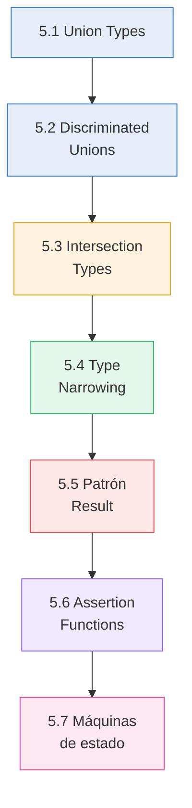
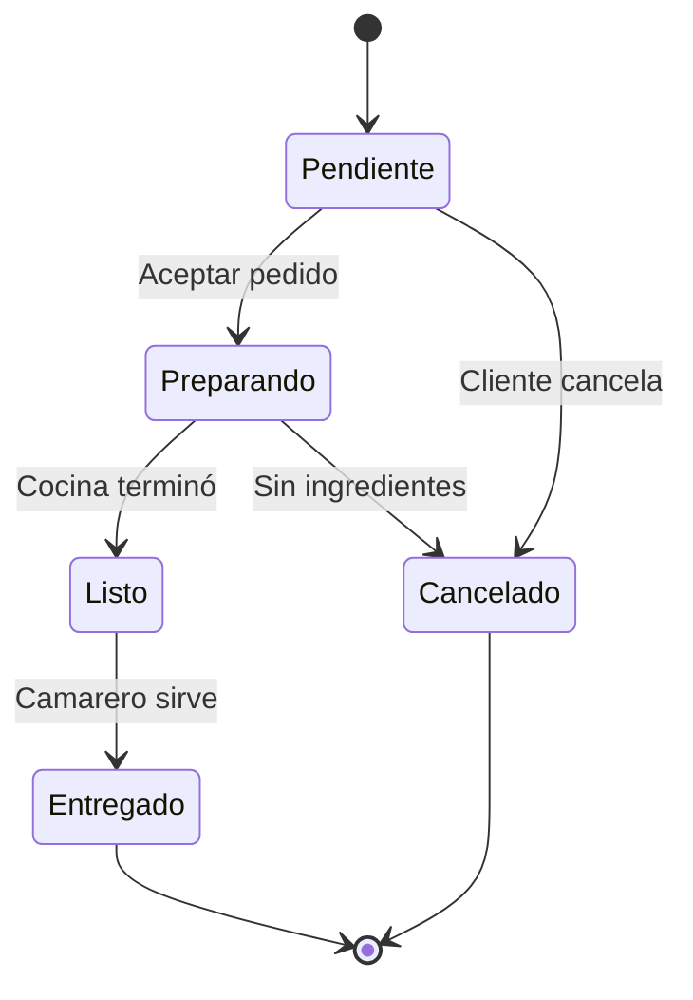

# :zap: Capítulo 5: Uniones, intersecciones y narrowing

<div class="chapter-meta">
  <span class="meta-item">🕐 3-4 horas</span>
  <span class="meta-item">📊 Nivel: Intermedio</span>
  <span class="meta-item">🎯 Semana 3</span>
</div>

<div class="chapter-objective">
  <span class="objective-icon">📌</span>
  <span class="objective-text">Al terminar este capítulo, dominarás uniones (|) e intersecciones (&), narrowing con typeof/in/instanceof, y discriminated unions — el patrón más poderoso de TypeScript.</span>
</div>

<div class="chapter-map">



</div>

!!! quote "Contexto"
    Este capítulo es donde TypeScript empieza a brillar de verdad. Las uniones te permiten decir "esto puede ser A **o** B", las intersecciones "esto es A **y** B a la vez", y el narrowing es cómo TypeScript **reduce las posibilidades** usando lógica.

---

<div class="concept-question">
<h4>🔍 Pregunta conceptual</h4>
<p>En Python puedes escribir <code>Union[str, int]</code> o <code>str | int</code>. ¿Cómo crees que TypeScript maneja una variable que puede ser de dos tipos diferentes? ¿Y cómo sabes cuál es en cada momento?</p>
</div>

## 5.1 Union Types

```typescript
type ID = number | string;
type EstadoMesa = "libre" | "ocupada" | "reservada" | "limpieza";

function buscarMesa(id: ID): Mesa | null {
  if (typeof id === "number") {
    return mesas.find(m => m.id === id) ?? null;
  }
  return mesas.find(m => m.código === id) ?? null;
}
```

<div class="misconception-box" markdown>
<h4>❌ Error común</h4>
<p><strong>Mito:</strong> "Una unión <code>string | number</code> me permite llamar a métodos de ambos tipos"</p>
<p><strong>Realidad:</strong> Solo puedes acceder a métodos COMUNES a todos los miembros de la unión. Para usar <code>.toUpperCase()</code> (solo de string) necesitas hacer narrowing primero con <code>typeof</code>, <code>in</code> o un type guard.</p>
</div>

<div class="connection-box">
<span class="connection-icon">🔗</span>
<span>Recuerda del <a href='../04-funciones/'>Capítulo 4</a> los overloads de funciones. Las uniones son una alternativa más elegante: en vez de 3 overloads, puedes usar <code>param: string | number | boolean</code>.</span>
</div>

<div class="micro-exercise">
<h4>🧪 Micro-ejercicio (2 min)</h4>
<p>Define un tipo <code>ResultadoBusqueda</code> que sea <code>Plato | Mesa | null</code>. Escribe una función que reciba este tipo e imprima un mensaje diferente según si es un plato, una mesa, o null.</p>
</div>

<div class="concept-question">
<h4>🔍 Pregunta conceptual</h4>
<p>Imagina que tienes diferentes tipos de eventos: <code>click</code>, <code>keypress</code>, <code>scroll</code>. Cada uno tiene datos diferentes. ¿Cómo los representarías en un solo tipo de forma segura?</p>
</div>

## 5.2 Discriminated Unions (patrón clave)

Las **discriminated unions** son uno de los patrones más poderosos de TypeScript. Usan una propiedad común (el **discriminante**) para que TypeScript sepa exactamente con qué tipo trabaja.

```typescript
type Evento =
  | { type: "reserva_creada"; mesa: number; cliente: string }
  | { type: "mesa_liberada"; mesa: number; hora: string }
  | { type: "pedido_realizado"; mesa: number; items: string[] };

function manejarEvento(evento: Evento): string {
  switch (evento.type) {
    case "reserva_creada":
      return `Reserva de ${evento.cliente} en mesa ${evento.mesa}`;
    case "mesa_liberada":
      return `Mesa ${evento.mesa} liberada a las ${evento.hora}`;
    case "pedido_realizado":
      return `Pedido: ${evento.items.join(", ")}`;  // (1)!
  }
}
```

1. TypeScript sabe que `evento.items` existe porque estamos en el caso `"pedido_realizado"`. ¡Autocompletado perfecto!

<div class="comparison" markdown>
<div class="lang-box python" markdown>

#### :snake: En Python/Django

Usarías un campo `tipo` y `if/elif`. **No hay verificación** de que cubras todos los casos.

</div>
<div class="lang-box typescript" markdown>

#### 🔷 En TypeScript

El compilador **verifica que manejes TODOS los casos**. Si añades un nuevo tipo de evento y no lo cubres, da error.

</div>
</div>

<div class="pro-tip">
<h4>💡 Consejo Pro</h4>
<p>Las discriminated unions son el patrón #1 en producción para modelar estados. En MakeMenu, el estado de un pedido es una discriminated union: <code>{ tipo: 'pendiente'; platos: Plato[] } | { tipo: 'pagado'; total: number; timestamp: Date }</code>. Esto hace imposible acceder a <code>total</code> en un pedido pendiente.</p>
</div>

<div class="micro-exercise">
<h4>🧪 Micro-ejercicio (2 min)</h4>
<p>Crea una discriminated union <code>Evento</code> con tipos <code>'pedido_creado' | 'pedido_pagado' | 'pedido_cancelado'</code>. Cada variante tiene un campo <code>tipo</code> y datos específicos. Escribe un <code>switch</code> exhaustivo.</p>
</div>

## 5.3 Intersection Types

Si las uniones (`|`) significan "**uno de**" estos tipos, las intersecciones (`&`) significan "**todos a la vez**". Un tipo intersección combina múltiples tipos en uno solo: el objeto resultante **debe satisfacer todos** los tipos que lo componen.

```typescript
type ConTimestamp = { createdAt: Date; updatedAt: Date };
type ConID = { id: number };

// Intersección: tiene TODO de ambos tipos
type MesaDB = Mesa & ConTimestamp & ConID;
```

Ahora `MesaDB` requiere todas las propiedades de `Mesa`, más `createdAt`, `updatedAt` e `id`. Es como "pegar" tipos, no elegir entre ellos.

**Resumen rápido:** `A | B` = "tiene las propiedades de A **o** de B". `A & B` = "tiene las propiedades de A **y** de B".

En MakeMenu, las intersecciones son perfectas para añadir metadatos a entidades existentes sin modificar los tipos originales:

```typescript
type ConAuditoria = { creadoPor: string; modificadoPor: string };
type ConSoftDelete = { eliminado: boolean; eliminadoEn?: Date };

// Composición: Mesa base + metadatos, sin tocar el tipo Mesa
type MesaCompleta = Mesa & ConAuditoria & ConSoftDelete;

const mesa: MesaCompleta = {
  número: 5, zona: "terraza", capacidad: 4,  // Mesa
  creadoPor: "admin", modificadoPor: "admin", // ConAuditoria
  eliminado: false,                            // ConSoftDelete
};
```

<div class="comparison" markdown>
<div class="lang-box python" markdown>

#### :snake: En Python

```python
# Herencia múltiple para combinar comportamientos
class ConTimestamp:
    created_at: datetime
    updated_at: datetime

class ConID:
    id: int

class MesaDB(Mesa, ConTimestamp, ConID):
    pass  # tiene todo de las tres clases
```

</div>
<div class="lang-box typescript" markdown>

#### 🔷 En TypeScript

```typescript
// Intersección: combina tipos sin clases
type ConTimestamp = { createdAt: Date; updatedAt: Date };
type ConID = { id: number };

type MesaDB = Mesa & ConTimestamp & ConID;
// tiene todo de los tres tipos
```

</div>
</div>

!!! warning "Propiedades en conflicto producen `never`"
    Si dos tipos en una intersección definen la misma propiedad con tipos incompatibles, esa propiedad se convierte en `never` (imposible de instanciar):

    ```typescript
    type A = { valor: string };
    type B = { valor: number };
    type C = A & B; // valor es string & number → never

    // No puedes crear un objeto de tipo C:
    // const c: C = { valor: ??? }; // ❌ no existe un valor que sea string Y number
    ```

    **Solución:** asegúrate de que las propiedades compartidas tengan tipos compatibles, o usa `Omit<A, "valor"> & B` para excluir la propiedad conflictiva antes de intersectar.

<div class="concept-question">
<h4>🔍 Pregunta conceptual</h4>
<p>Si una variable es <code>string | number</code>, ¿cómo sabe TypeScript si puedes llamar a <code>.toUpperCase()</code> (que solo existe en strings)?</p>
</div>

## 5.4 Type Narrowing

**Narrowing** es el proceso por el cual TypeScript reduce un tipo union a uno más específico:

=== "`typeof` guard"

    ```typescript
    function format(value: string | number): string {
      if (typeof value === "string") return value.toUpperCase();
      return value.toFixed(2);  // TS sabe que es number aquí
    }
    ```

=== "`instanceof` guard"

    ```typescript
    function handleError(err: Error | string): string {
      if (err instanceof Error) return err.message;
      return err;  // TS sabe que es string aquí
    }
    ```

=== "`in` operator guard"

    ```typescript
    function describir(obj: Mesa | Reserva): string {
      if ("capacidad" in obj) return `Mesa para ${obj.capacidad}`;
      return `Reserva de ${obj.nombre}`;
    }
    ```

=== "Exhaustive check"

    ```typescript
    function assertNever(x: never): never {
      throw new Error(`Caso no manejado: ${x}`);
    }

    // Si añades un nuevo estado y no lo cubres, TS da error aquí ↓
    function handleEstado(estado: EstadoMesa): string {
      switch (estado) {
        case "libre": return "🟢";
        case "ocupada": return "🔴";
        case "reservada": return "🟡";
        case "limpieza": return "🟠";
        default: return assertNever(estado); // Exhaustive!
      }
    }
    ```

<div class="misconception-box">
<h4>⚠️ Errores comunes</h4>
<ul>
<li><span class="wrong">❌ Mito:</span> "Una unión <code>A | B</code> tiene TODAS las propiedades de A y B" → <span class="right">✅ Realidad:</span> Solo puedes acceder a propiedades COMUNES a ambos tipos. Para acceder a propiedades específicas, necesitas narrowing.</li>
<li><span class="wrong">❌ Mito:</span> "Una intersección <code>A & B</code> elige uno de los dos tipos" → <span class="right">✅ Realidad:</span> Una intersección COMBINA ambos tipos — el resultado tiene TODAS las propiedades de A y de B.</li>
<li><span class="wrong">❌ Mito:</span> "El narrowing solo funciona con <code>typeof</code>" → <span class="right">✅ Realidad:</span> Puedes hacer narrowing con <code>typeof</code>, <code>in</code>, <code>instanceof</code>, comparaciones de igualdad, y discriminated unions (la forma más elegante).</li>
</ul>
</div>

<div class="pro-tip">
<h4>💡 Consejo Pro</h4>
<p>Usa <code>never</code> en el <code>default</code> de un switch con discriminated unions. Si añades una nueva variante y olvidas manejarla, TypeScript te dará un error de compilación.</p>
</div>

## 5.5 El patrón `Result<T, E>` — Error handling tipado

Inspirado en Rust, este patrón usa discriminated unions para manejar errores **sin excepciones**. En lugar de `try/catch`, cada función retorna explícitamente éxito o error:

```typescript
// Definición del tipo Result
type Result<T, E = Error> =
  | { ok: true; value: T }
  | { ok: false; error: E };

// Funciones helper para crear Results
function Ok<T>(value: T): Result<T, never> {
  return { ok: true, value };
}

function Err<E>(error: E): Result<never, E> {
  return { ok: false, error };
}

// Uso en MakeMenu: buscar una mesa
function buscarMesa(id: number): Result<Mesa, string> {
  const mesa = mesas.find(m => m.id === id);
  if (!mesa) return Err(`Mesa con id ${id} no encontrada`);
  return Ok(mesa);
}

// El consumidor DEBE manejar ambos casos
const resultado = buscarMesa(5);
if (resultado.ok) {
  console.log(resultado.value.número);  // ✅ Mesa
} else {
  console.error(resultado.error);       // ✅ string
}
```

<div class="comparison" markdown>
<div class="lang-box python" markdown>

#### :snake: En Python

Python usa excepciones (`try/except`). No hay forma de forzar al consumidor a manejar el error — puede olvidar el `try/except`.

</div>
<div class="lang-box typescript" markdown>

#### 🔷 En TypeScript

Con `Result<T, E>`, el compilador **obliga** a manejar ambos casos. Si accedes a `value` sin verificar `ok`, da error de tipo.

</div>
</div>

!!! tip "¿Cuándo usar Result vs excepciones?"
    - **Result**: para errores esperados y recuperables (validación, no encontrado, permisos)
    - **Excepciones**: para errores inesperados y fatales (red caída, disco lleno, bug)

## 5.6 Assertion Functions

Las assertion functions son funciones que **lanzan si la condición es falsa** y hacen narrowing del tipo si pasa:

```typescript
function assertEsMesa(obj: unknown): asserts obj is Mesa {  // (1)!
  if (typeof obj !== "object" || obj === null) {
    throw new Error("No es un objeto");
  }
  if (!("número" in obj) || !("zona" in obj)) {
    throw new Error("No tiene las propiedades de Mesa");
  }
}

function procesarDato(dato: unknown): void {
  assertEsMesa(dato);
  // Si llegamos aquí, dato es Mesa ✅
  console.log(dato.número);  // TypeScript sabe que es Mesa
  console.log(dato.zona);    // Autocompletado funciona
}
```

1. `asserts obj is Mesa` significa: "si esta función no lanza, entonces `obj` es `Mesa`". TypeScript confía en este contrato después de la llamada.

## 5.7 Discriminated unions como máquinas de estado

Las discriminated unions son perfectas para modelar **máquinas de estado**, un patrón común en aplicaciones interactivas como MakeMenu:

```typescript
type EstadoPedido =
  | { estado: "pendiente"; mesa: number; items: string[] }
  | { estado: "preparando"; mesa: number; items: string[]; cocinero: string; inicio: Date }
  | { estado: "listo"; mesa: number; items: string[]; tiempoPreparación: number }
  | { estado: "entregado"; mesa: number; items: string[]; camarero: string; hora: Date }
  | { estado: "cancelado"; mesa: number; motivo: string };

function siguienteEstado(pedido: EstadoPedido): EstadoPedido {
  switch (pedido.estado) {
    case "pendiente":
      return { ...pedido, estado: "preparando", cocinero: "Chef Juan", inicio: new Date() };
    case "preparando":
      return { ...pedido, estado: "listo", tiempoPreparación: 15 };
    case "listo":
      return { ...pedido, estado: "entregado", camarero: "Ana", hora: new Date() };
    case "entregado":
      return pedido; // Estado final
    case "cancelado":
      return pedido; // Estado final
  }
}
```



!!! info "Tip profesional"
    Cada estado de la union tiene **exactamente las propiedades que necesita** para esa etapa. No hay campos opcionales innecesarios ni `null` por todas partes. El tipo te guía sobre qué datos están disponibles en cada momento.

---

<div class="code-evolution">
<h4>📈 Evolución de código: manejando respuestas de API</h4>

<div class="evolution-step" markdown>
<span class="step-label">v1 Novato — usando <code>any</code></span>

```typescript
// ❌ Sin tipos: no sabes qué hay dentro, errores en runtime
async function fetchPedido(id: number): Promise<any> {
  const resp = await fetch(`/api/pedidos/${id}`);
  const data = await resp.json(); // any 😱
  console.log(data.total);        // ¿existe .total? Ni idea...
  return data;
}
```

</div>

<div class="evolution-step" markdown>
<span class="step-label">v2 Con uniones — <code>Success | Error</code></span>

```typescript
// ✅ Mejor: separamos éxito de error
type ApiSuccess = { ok: true; pedido: Pedido };
type ApiError = { ok: false; mensaje: string; código: number };
type ApiResponse = ApiSuccess | ApiError;

async function fetchPedido(id: number): Promise<ApiResponse> {
  const resp = await fetch(`/api/pedidos/${id}`);
  if (!resp.ok) {
    return { ok: false, mensaje: "No encontrado", código: resp.status };
  }
  const pedido = await resp.json();
  return { ok: true, pedido };
}
```

</div>

<div class="evolution-step" markdown>
<span class="step-label">v3 Profesional — discriminated union con exhaustive switch y <code>never</code></span>

```typescript
// ✅✅ Profesional: cada estado tiene sus datos, switch exhaustivo
type RespuestaPedido =
  | { status: "success"; pedido: Pedido }
  | { status: "not_found"; id: number }
  | { status: "forbidden"; razon: string }
  | { status: "error"; mensaje: string; retry: boolean };

function assertNever(x: never): never {
  throw new Error(`Caso no manejado: ${JSON.stringify(x)}`);
}

function manejarRespuesta(resp: RespuestaPedido): string {
  switch (resp.status) {
    case "success":
      return `Pedido ${resp.pedido.id}: $${resp.pedido.total}`;
    case "not_found":
      return `Pedido ${resp.id} no existe`;
    case "forbidden":
      return `Acceso denegado: ${resp.razon}`;
    case "error":
      return resp.retry ? "Reintentando..." : `Error fatal: ${resp.mensaje}`;
    default:
      return assertNever(resp); // Si añades un nuevo status, TS avisa aquí
  }
}
```

</div>
</div>

<div class="connection-box">
<span class="connection-icon">🔗</span>
<span>En el <a href='../12-type-guards/'>Capítulo 12</a> profundizarás en type guards personalizados — funciones que le dicen a TypeScript exactamente qué tipo tiene una variable. Son la evolución del narrowing que aprendes aquí.</span>
</div>

---

<div class="ejercicio-guiado">
<h4>🏋️ Ejercicio guiado</h4>

Vas a construir un sistema de eventos del restaurante MakeMenu usando discriminated unions, narrowing y exhaustive checking.

1. Define tres tipos de eventos del restaurante como interfaces con un campo discriminante `tipo`: `EventoReserva` (con `mesa: number`, `cliente: string`, `personas: number`), `EventoPedido` (con `mesa: number`, `platos: string[]`) y `EventoPago` (con `mesa: number`, `total: number`, `metodo: "efectivo" | "tarjeta"`).
2. Crea un type alias `EventoRestaurante` como union de los tres tipos de evento.
3. Escribe una funcion `procesarEvento(evento: EventoRestaurante): string` que use un `switch` sobre `evento.tipo` para devolver un mensaje descriptivo distinto para cada caso.
4. Agrega una funcion `assertNever(x: never): never` y usala en el `default` del switch para garantizar exhaustive checking.
5. Define un tipo `Result<T>` como discriminated union con variantes `{ ok: true; valor: T }` y `{ ok: false; error: string }`. Escribe una funcion `validarEvento(evento: EventoRestaurante): Result<string>` que devuelva error si un pedido no tiene platos o si un pago tiene total negativo.
6. Crea un array de eventos variados, procesa cada uno con `validarEvento` y muestra por consola los resultados haciendo narrowing sobre el `Result`.

??? success "Solución completa"
    ```typescript
    // Paso 1: Interfaces con discriminante
    interface EventoReserva {
      tipo: "reserva";
      mesa: number;
      cliente: string;
      personas: number;
    }

    interface EventoPedido {
      tipo: "pedido";
      mesa: number;
      platos: string[];
    }

    interface EventoPago {
      tipo: "pago";
      mesa: number;
      total: number;
      metodo: "efectivo" | "tarjeta";
    }

    // Paso 2: Union de eventos
    type EventoRestaurante = EventoReserva | EventoPedido | EventoPago;

    // Paso 4: assertNever para exhaustive checking
    function assertNever(x: never): never {
      throw new Error(`Caso no manejado: ${JSON.stringify(x)}`);
    }

    // Paso 3: Procesar con switch exhaustivo
    function procesarEvento(evento: EventoRestaurante): string {
      switch (evento.tipo) {
        case "reserva":
          return `Reserva: mesa ${evento.mesa} para ${evento.cliente} (${evento.personas} personas)`;
        case "pedido":
          return `Pedido: mesa ${evento.mesa} — ${evento.platos.join(", ")}`;
        case "pago":
          return `Pago: mesa ${evento.mesa} — ${evento.total}€ con ${evento.metodo}`;
        default:
          return assertNever(evento);
      }
    }

    // Paso 5: Tipo Result y validación
    type Result<T> =
      | { ok: true; valor: T }
      | { ok: false; error: string };

    function validarEvento(evento: EventoRestaurante): Result<string> {
      if (evento.tipo === "pedido" && evento.platos.length === 0) {
        return { ok: false, error: `Mesa ${evento.mesa}: pedido sin platos` };
      }
      if (evento.tipo === "pago" && evento.total < 0) {
        return { ok: false, error: `Mesa ${evento.mesa}: total negativo (${evento.total})` };
      }
      return { ok: true, valor: procesarEvento(evento) };
    }

    // Paso 6: Procesar lote de eventos
    const eventos: EventoRestaurante[] = [
      { tipo: "reserva", mesa: 3, cliente: "García", personas: 4 },
      { tipo: "pedido", mesa: 3, platos: ["Paella", "Tiramisú"] },
      { tipo: "pedido", mesa: 5, platos: [] },  // Error: sin platos
      { tipo: "pago", mesa: 3, total: 42.50, metodo: "tarjeta" },
      { tipo: "pago", mesa: 7, total: -10, metodo: "efectivo" },  // Error: negativo
    ];

    for (const evento of eventos) {
      const resultado = validarEvento(evento);
      if (resultado.ok) {
        console.log(`✅ ${resultado.valor}`);
      } else {
        console.log(`❌ ${resultado.error}`);
      }
    }
    // ✅ Reserva: mesa 3 para García (4 personas)
    // ✅ Pedido: mesa 3 — Paella, Tiramisú
    // ❌ Mesa 5: pedido sin platos
    // ✅ Pago: mesa 3 — 42.5€ con tarjeta
    // ❌ Mesa 7: total negativo (-10)
    ```

</div>

<div class="real-errors">
<h4>🚨 Errores que vas a encontrar</h4>

**Error 1: Acceder a propiedades sin narrowing**

```typescript
function procesar(valor: string | number) {
  console.log(valor.toUpperCase()); // ❌
}
```

```
error TS2339: Property 'toUpperCase' does not exist on type 'string | number'.
  Property 'toUpperCase' does not exist on type 'number'.
```

**¿Por qué?** TypeScript solo permite acceder a propiedades comunes a todos los tipos de la unión. `number` no tiene `toUpperCase`.

**Solución:**
```typescript
function procesar(valor: string | number) {
  if (typeof valor === "string") {
    console.log(valor.toUpperCase()); // ✅ narrowing con typeof
  }
}
```

---

**Error 2: Switch no exhaustivo en discriminated union**

```typescript
type Evento =
  | { tipo: "click"; x: number }
  | { tipo: "tecla"; key: string }
  | { tipo: "scroll"; delta: number };

function manejar(e: Evento): string {
  switch (e.tipo) {
    case "click": return `Click en ${e.x}`;
    case "tecla": return `Tecla ${e.key}`;
    // ❌ Falta "scroll"
  }
}
```

```
error TS2366: Function lacks ending return statement and return type does not include 'undefined'.
```

**Solución:**
```typescript
function manejar(e: Evento): string {
  switch (e.tipo) {
    case "click": return `Click en ${e.x}`;
    case "tecla": return `Tecla ${e.key}`;
    case "scroll": return `Scroll ${e.delta}`;
    default: const _exhaustive: never = e; return _exhaustive;
  }
}
```

---

**Error 3: Intersección incompatible**

```typescript
type A = { nombre: string; edad: number };
type B = { nombre: number; email: string };
type C = A & B; // nombre es string & number = never
```

**¿Por qué?** Cuando dos tipos en una intersección tienen la misma propiedad con tipos incompatibles, el resultado es `never` — imposible de instanciar.

**Solución:** Asegúrate de que las propiedades compartidas tengan tipos compatibles o usa `Omit` para excluir conflictos.

---

**Error 4: Narrowing incorrecto con `in`**

```typescript
type Plato = { nombre: string; precio: number };
type Bebida = { nombre: string; volumen: number };

function describir(item: Plato | Bebida) {
  if ("precio" in item) {
    console.log(item.volumen); // ❌
  }
}
```

```
error TS2339: Property 'volumen' does not exist on type 'Plato'.
```

**¿Por qué?** Después del narrowing con `in`, TypeScript sabe que es `Plato`, que no tiene `volumen`.

**Solución:** Accede a `item.precio` dentro del bloque, y `item.volumen` en el `else`.

</div>

<div class="checkpoint">
<h4>🏁 Checkpoint</h4>
<p>Si puedes: (1) crear uniones e intersecciones, (2) hacer narrowing con typeof/in, y (3) diseñar una discriminated union con switch exhaustivo — dominas este capítulo.</p>
</div>

<div class="mini-project">
<h4>🏗️ Mini-proyecto: Sistema de notificaciones tipado</h4>

Construye un sistema de notificaciones usando discriminated unions, narrowing y el patrón Result.

**Paso 1 — Define los tipos de notificación**

Crea una discriminated union `Notificación` con tres variantes: `email` (con `destinatario` y `asunto`), `sms` (con `telefono` y `mensaje`), y `push` (con `titulo`, `cuerpo` y `urgente: boolean`).

??? success "Solución Paso 1"
    ```typescript
    type NotificacionEmail = {
      tipo: "email";
      destinatario: string;
      asunto: string;
      cuerpo: string;
    };

    type NotificacionSMS = {
      tipo: "sms";
      telefono: string;
      mensaje: string;
    };

    type NotificacionPush = {
      tipo: "push";
      titulo: string;
      cuerpo: string;
      urgente: boolean;
    };

    type Notificación = NotificacionEmail | NotificacionSMS | NotificacionPush;
    ```

**Paso 2 — Implementa el envío con switch exhaustivo**

Crea `enviar(n: Notificación): Result<string, string>` que use un switch exhaustivo con `never` para garantizar que cubres todos los casos.

??? success "Solución Paso 2"
    ```typescript
    type Result<T, E> =
      | { ok: true; valor: T }
      | { ok: false; error: E };

    function enviar(n: Notificación): Result<string, string> {
      switch (n.tipo) {
        case "email":
          if (!n.destinatario.includes("@")) {
            return { ok: false, error: "Email inválido" };
          }
          return { ok: true, valor: `Email enviado a ${n.destinatario}` };
        case "sms":
          if (n.mensaje.length > 160) {
            return { ok: false, error: "SMS demasiado largo" };
          }
          return { ok: true, valor: `SMS enviado a ${n.telefono}` };
        case "push":
          return { ok: true, valor: `Push: ${n.urgente ? "🔴" : "🔵"} ${n.titulo}` };
        default:
          const _exhaustive: never = n;
          return _exhaustive;
      }
    }
    ```

**Paso 3 — Procesa un lote de notificaciones**

Crea `procesarLote(notificaciones: Notificación[])` que envíe todas, cuente éxitos/fallos, y muestre un resumen. Usa narrowing sobre el `Result`.

??? success "Solución Paso 3"
    ```typescript
    function procesarLote(notificaciones: Notificación[]): void {
      let exitos = 0;
      let fallos = 0;

      for (const n of notificaciones) {
        const resultado = enviar(n);
        if (resultado.ok) {
          console.log(`✅ ${resultado.valor}`);
          exitos++;
        } else {
          console.log(`❌ ${resultado.error}`);
          fallos++;
        }
      }

      console.log(`\nResumen: ${exitos} enviados, ${fallos} fallidos`);
    }

    // Prueba
    procesarLote([
      { tipo: "email", destinatario: "ana@test.com", asunto: "Hola", cuerpo: "..." },
      { tipo: "sms", telefono: "+34600123456", mensaje: "Tu pedido está listo" },
      { tipo: "push", titulo: "Oferta", cuerpo: "2x1 hoy", urgente: true },
      { tipo: "email", destinatario: "sin-arroba", asunto: "Fail", cuerpo: "..." },
    ]);
    ```

</div>

## :link: Recursos

| Recurso | Enlace |
|---------|--------|
| Narrowing | [typescriptlang.org/.../narrowing](https://www.typescriptlang.org/docs/handbook/2/narrowing.html) |
| Discriminated Unions | [typescriptlang.org/.../narrowing#discriminated-unions](https://www.typescriptlang.org/docs/handbook/2/narrowing.html#discriminated-unions) |
| Total TypeScript: Unions | [totaltypescript.com/discriminated-unions](https://www.totaltypescript.com/discriminated-unions-are-a-devs-best-friend) |

---

## 🎯 Ejercicios

??? question "Ejercicio 1: Discriminated union Notificación"
    Crea una discriminated union `Notificación` con tipos `info`, `error`, `success`, cada una con propiedades distintas.

    ??? success "Solución"
        ```typescript
        type Notificación =
          | { tipo: "info"; mensaje: string; duración: number }
          | { tipo: "error"; código: number; mensaje: string; stack?: string }
          | { tipo: "success"; datos: unknown; timestamp: Date };

        function mostrar(n: Notificación): string {
          switch (n.tipo) {
            case "info": return `ℹ️ ${n.mensaje}`;
            case "error": return `❌ Error ${n.código}: ${n.mensaje}`;
            case "success": return `✅ Operación exitosa`;
          }
        }
        ```

??? question "Ejercicio 2: Exhaustive checking"
    Escribe una función que maneje todos los tipos de Notificación con exhaustive checking usando `assertNever`.

    ??? success "Solución"
        ```typescript
        function assertNever(x: never): never {
          throw new Error(`Caso no manejado: ${JSON.stringify(x)}`);
        }

        function procesarNotificación(n: Notificación): void {
          switch (n.tipo) {
            case "info":
              console.log(`[INFO] ${n.mensaje} (${n.duración}ms)`);
              break;
            case "error":
              console.error(`[ERROR ${n.código}] ${n.mensaje}`);
              break;
            case "success":
              console.log(`[OK] ${n.timestamp.toISOString()}`);
              break;
            default:
              assertNever(n); // Si añades un nuevo tipo y no lo cubres, ERROR aquí
          }
        }
        ```

??? question "Ejercicio 3: Implementar Result"
    Crea una función `dividir(a: number, b: number): Result<number, string>` que retorne un error si `b` es 0. Luego escribe código que use el resultado manejando ambos casos.

    !!! tip "Pista"
        Usa el patrón `Result<T, E>` del capítulo. Retorna `Err("División por cero")` si `b === 0`.

    ??? success "Solución"
        ```typescript
        type Result<T, E> = { ok: true; value: T } | { ok: false; error: E };

        function dividir(a: number, b: number): Result<number, string> {
          if (b === 0) return { ok: false, error: "División por cero" };
          return { ok: true, value: a / b };
        }

        const r1 = dividir(10, 3);
        if (r1.ok) {
          console.log(`Resultado: ${r1.value.toFixed(2)}`); // "3.33"
        } else {
          console.error(r1.error);
        }

        const r2 = dividir(10, 0);
        if (!r2.ok) {
          console.error(r2.error); // "División por cero"
        }
        ```

??? question "Ejercicio 4: Máquina de estados de mesa"
    Modela los estados de una mesa de MakeMenu como discriminated union: `disponible`, `ocupada`, `reservada`. Cada estado tiene propiedades específicas. Crea una función `cambiarEstado` que implemente las transiciones válidas.

    !!! tip "Pista"
        Una mesa `disponible` puede pasar a `ocupada` o `reservada`. Una `ocupada` solo puede pasar a `disponible`. Una `reservada` puede pasar a `ocupada` o `disponible`.

    ??? success "Solución"
        ```typescript
        type EstadoMesa =
          | { estado: "disponible"; número: number }
          | { estado: "ocupada"; número: number; personas: number; hora: Date }
          | { estado: "reservada"; número: number; cliente: string; horaReserva: string };

        function ocuparMesa(mesa: EstadoMesa & { estado: "disponible" | "reservada" }): EstadoMesa {
          return {
            estado: "ocupada",
            número: mesa.número,
            personas: 0,
            hora: new Date()
          };
        }

        function liberarMesa(mesa: EstadoMesa & { estado: "ocupada" }): EstadoMesa {
          return { estado: "disponible", número: mesa.número };
        }

        const mesa: EstadoMesa = { estado: "disponible", número: 5 };
        const ocupada = ocuparMesa(mesa); // ✅
        // liberarMesa(mesa); // ❌ Error: mesa disponible no se puede liberar
        ```

??? question "Ejercicio 5: Assertion function para API"
    Escribe una assertion function `assertApiResponse` que verifique que un dato `unknown` de una API tiene la estructura `{ status: number; data: unknown }`. Si no la tiene, debe lanzar un error descriptivo.

    !!! tip "Pista"
        Necesitas verificar que es un objeto, que tiene `status` de tipo `number` y `data` que existe.

    ??? success "Solución"
        ```typescript
        interface ApiResponse {
          status: number;
          data: unknown;
        }

        function assertApiResponse(obj: unknown): asserts obj is ApiResponse {
          if (typeof obj !== "object" || obj === null) {
            throw new Error("La respuesta no es un objeto");
          }
          if (!("status" in obj) || typeof (obj as any).status !== "number") {
            throw new Error("La respuesta no tiene un campo 'status' numérico");
          }
          if (!("data" in obj)) {
            throw new Error("La respuesta no tiene un campo 'data'");
          }
        }

        // Uso
        async function fetchMesas(): Promise<ApiResponse> {
          const resp = await fetch("/api/mesas");
          const json: unknown = await resp.json();
          assertApiResponse(json); // Si no lanza, json es ApiResponse
          return json;
        }
        ```

---

## :brain: Flashcards de repaso

<div class="flashcard">
<div class="front">¿Qué es una discriminated union?</div>
<div class="back">Una union de tipos que comparten una propiedad literal común (discriminante). TypeScript usa esa propiedad para saber con qué tipo estás trabajando en cada rama.</div>
</div>

<div class="flashcard">
<div class="front">¿Qué es narrowing en TypeScript?</div>
<div class="back">El proceso por el cual TypeScript reduce un tipo unión a uno más específico usando guards como <code>typeof</code>, <code>instanceof</code>, <code>in</code>, o comparaciones de igualdad.</div>
</div>

<div class="flashcard">
<div class="front">¿Qué ventaja tiene <code>Result&lt;T, E&gt;</code> sobre <code>try/catch</code>?</div>
<div class="back">El compilador obliga a manejar ambos casos (éxito y error). Con <code>try/catch</code>, puedes olvidarte de capturar el error.</div>
</div>

<div class="flashcard">
<div class="front">¿Qué hace <code>assertNever(x: never): never</code>?</div>
<div class="back">Es el patrón de exhaustive checking. Si TypeScript permite que <code>x</code> llegue ahí, es que NO cubriste todos los casos del switch/union.</div>
</div>

<div class="flashcard">
<div class="front">¿Diferencia entre <code>type guard</code> y <code>assertion function</code>?</div>
<div class="back">Un type guard devuelve <code>boolean</code> (con <code>is</code>): <code>function isX(v): v is X</code>. Una assertion function lanza si falla (con <code>asserts</code>): <code>function assertX(v): asserts v is X</code>.</div>
</div>

---

## :video_game: Quiz interactivo

<div class="quiz" data-quiz-id="ch05-q1">
<h4>Pregunta 1: ¿Qué es una discriminated union?</h4>
<button class="quiz-option" data-correct="false">Una union de tipos primitivos</button>
<button class="quiz-option" data-correct="false">Un tipo que solo acepta <code>string | number</code></button>
<button class="quiz-option" data-correct="true">Una union de tipos que comparten una propiedad literal común (discriminante)</button>
<button class="quiz-option" data-correct="false">Un sinónimo de intersección</button>
<div class="quiz-feedback" data-correct="¡Correcto! La propiedad discriminante (como `type` o `kind`) permite a TypeScript saber exactamente con qué variante trabajas." data-incorrect="Incorrecto. Una discriminated union es una union donde cada tipo tiene una propiedad literal común que sirve de discriminante."></div>
</div>

<div class="quiz" data-quiz-id="ch05-q2">
<h4>Pregunta 2: ¿Qué pasa si un <code>switch</code> no cubre todos los casos de una discriminated union?</h4>
<button class="quiz-option" data-correct="false">No pasa nada, TypeScript lo ignora</button>
<button class="quiz-option" data-correct="true">Si usas <code>assertNever</code> en el <code>default</code>, TypeScript da error de compilación</button>
<button class="quiz-option" data-correct="false">TypeScript siempre da error automáticamente</button>
<button class="quiz-option" data-correct="false">Solo da error en runtime</button>
<div class="quiz-feedback" data-correct="¡Correcto! El patrón `assertNever` (exhaustive checking) convierte un caso olvidado en error de compilación." data-incorrect="Incorrecto. TypeScript solo da error si usas el patrón `assertNever(x: never)` en el default. Sin él, los casos no cubiertos pasan desapercibidos."></div>
</div>

<div class="quiz" data-quiz-id="ch05-q3">
<h4>Pregunta 3: ¿Qué ventaja tiene <code>Result&lt;T, E&gt;</code> sobre <code>try/catch</code>?</h4>
<button class="quiz-option" data-correct="false">Es más rápido en runtime</button>
<button class="quiz-option" data-correct="false">No necesita manejar errores</button>
<button class="quiz-option" data-correct="true">El compilador te obliga a manejar tanto el caso de éxito como el de error</button>
<button class="quiz-option" data-correct="false">Solo funciona con funciones async</button>
<div class="quiz-feedback" data-correct="¡Correcto! Con `Result<T,E>` no puedes acceder al valor sin antes comprobar si es `ok` o `err`. Es type-safe error handling." data-incorrect="Incorrecto. La ventaja principal es que el compilador obliga a manejar ambos casos. Con `try/catch` puedes olvidarte del catch."></div>
</div>

---

## :bug: Ejercicio de depuración

Este código tiene errores de narrowing. Encuentra los 3 problemas:

```typescript
// ❌ 3 errores de narrowing

type Evento =
  | { tipo: "reserva"; mesa: number; personas: number }
  | { tipo: "pedido"; mesa: number; items: string[] }
  | { tipo: "pago"; mesa: number; total: number; método: "efectivo" | "tarjeta" };

function procesarEvento(evento: Evento): string {
  switch (evento.tipo) {
    case "reserva":
      return `Mesa ${evento.mesa} para ${evento.items} personas`;  // Error 1

    case "pedido":
      return `Pedido: ${evento.personas} items`;                   // Error 2

    // Error 3: falta el caso "pago"
  }
}
```

??? success "Solución"
    ```typescript
    function procesarEvento(evento: Evento): string {
      switch (evento.tipo) {
        case "reserva":
          return `Mesa ${evento.mesa} para ${evento.personas} personas`;
          //                                  ^^^^^^^^ Fix 1: personas, no items

        case "pedido":
          return `Pedido: ${evento.items.length} items`;
          //                ^^^^^^^^^^^ Fix 2: items, no personas

        case "pago":                            // Fix 3: caso añadido
          return `Pago de ${evento.total}€ con ${evento.método}`;
      }
    }
    ```

---

## :recycle: Ejercicio de refactoring: JS → TS

Convierte este código JavaScript que usa strings mágicas a TypeScript con discriminated unions:

```javascript
// JavaScript con strings mágicas — imposible de mantener
function procesarNotificación(notif) {
  if (notif.type === "email") {
    enviarEmail(notif.to, notif.subject, notif.body);
  } else if (notif.type === "sms") {
    enviarSMS(notif.phone, notif.message);
  } else if (notif.type === "push") {
    enviarPush(notif.token, notif.title, notif.data);
  }
}
```

??? success "Solución"
    ```typescript
    // ✅ TypeScript con discriminated unions — imposible olvidar un caso

    interface NotifEmail {
      type: "email";
      to: string;
      subject: string;
      body: string;
    }

    interface NotifSMS {
      type: "sms";
      phone: string;
      message: string;
    }

    interface NotifPush {
      type: "push";
      token: string;
      title: string;
      data: Record<string, unknown>;
    }

    type Notificación = NotifEmail | NotifSMS | NotifPush;

    function assertNever(x: never): never {
      throw new Error(`Caso no manejado: ${JSON.stringify(x)}`);
    }

    function procesarNotificación(notif: Notificación): void {
      switch (notif.type) {
        case "email":
          enviarEmail(notif.to, notif.subject, notif.body);
          break;
        case "sms":
          enviarSMS(notif.phone, notif.message);
          break;
        case "push":
          enviarPush(notif.token, notif.title, notif.data);
          break;
        default:
          assertNever(notif);  // Exhaustive checking
      }
    }
    ```

---

## ✅ Autoevaluación del capítulo

<div class="self-check" markdown>
<h4>¿Has comprendido todo? Marca lo que puedes hacer:</h4>
<label><input type="checkbox"> Puedo crear discriminated unions con propiedad discriminante</label>
<label><input type="checkbox"> Sé implementar el patrón `Result<T, E>` para error handling</label>
<label><input type="checkbox"> Entiendo narrowing con `typeof`, `instanceof`, `in`</label>
<label><input type="checkbox"> Puedo implementar exhaustive checking con `assertNever`</label>
<label><input type="checkbox"> Sé la diferencia entre type guard y assertion function</label>
</div>
