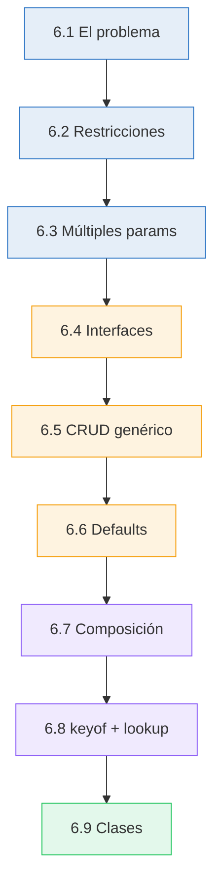
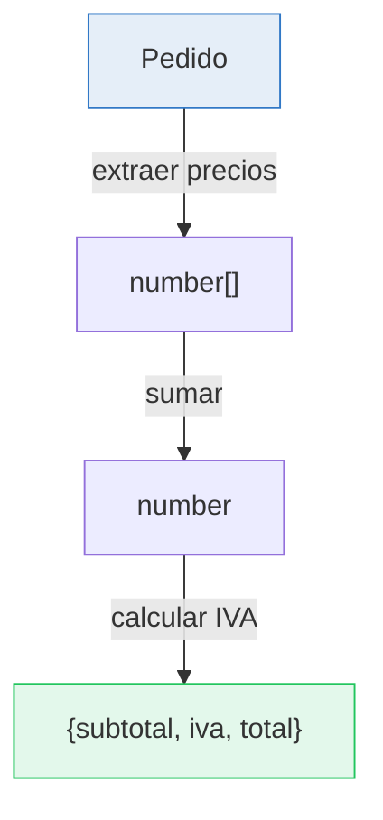

# :sparkles: Capítulo 6: Generics — El superpoder de TypeScript

<div class="chapter-meta">
  <span class="meta-item">🕐 3-4 horas</span>
  <span class="meta-item">📊 Nivel: Intermedio-Avanzado</span>
  <span class="meta-item">🎯 Semana 3</span>
</div>

<div class="chapter-objective">
  <span class="objective-icon">📌</span>
  <span class="objective-text">Al terminar este capítulo, entenderás genéricos — cómo crear funciones, interfaces y clases que funcionan con CUALQUIER tipo manteniendo la seguridad. Es el concepto más importante de TypeScript intermedio.</span>
</div>

<div class="chapter-map">
<h4>🗺️ Mapa del capítulo</h4>



**Leyenda:** <span style="color:#3178c6">azul</span> = fundamentos | <span style="color:#f59e0b">naranja</span> = patrones prácticos | <span style="color:#8b5cf6">violeta</span> = avanzado | <span style="color:#22c55e">verde</span> = clases

</div>

!!! quote "Contexto"
    Los generics son como funciones que operan sobre **TIPOS** en lugar de sobre valores. Si una función normal transforma datos, un generic transforma la *forma* de los datos. Es el concepto más importante para pasar de nivel intermedio a avanzado.

---

<div class="concept-question">
<strong>🤔 Pregunta para reflexionar:</strong> Si tienes una función que envuelve un valor en un array (<code>function wrap(value) { return [value]; }</code>), ¿cómo tiparías el retorno? ¿<code>any[]</code>? ¿<code>unknown[]</code>? ¿Hay una forma de mantener el tipo exacto del valor?
</div>

## 6.1 El problema que resuelven

```typescript
// ❌ Sin generics: perdemos información de tipo
function primerElemento(arr: any[]): any {
  return arr[0]; // Retorna any... el tipo se pierde
}

// ✅ Con generics: preservamos el tipo
function primerElemento<T>(arr: T[]): T | undefined {
  return arr[0];
}

const num = primerElemento([1, 2, 3]);     // number ✅
const str = primerElemento(["a", "b"]);    // string ✅
const mesa = primerElemento(mesas);         // Mesa ✅
```

<div class="comparison" markdown>
<div class="lang-box python" markdown>

#### :snake: En Python

```python
from typing import TypeVar, List
T = TypeVar("T")

def primero(lista: List[T]) -> T | None:
    return lista[0] if lista else None
```

</div>
<div class="lang-box typescript" markdown>

#### 🔷 En TypeScript

```typescript
function primero<T>(lista: T[]): T | undefined {
  return lista[0];
}
```
`<T>` declara la variable de tipo. TS la infiere del uso.

</div>
</div>

<div class="misconception-box" markdown>
<h4>❌ Error común</h4>
<p><strong>Mito:</strong> "Los genéricos de TypeScript funcionan igual que los de Java (se conservan en runtime)"</p>
<p><strong>Realidad:</strong> TypeScript usa type erasure — los genéricos se borran completamente en compilación. No puedes hacer <code>new T()</code> ni <code>instanceof T</code> en runtime. Los genéricos solo existen para el compilador.</p>
</div>

<div class="misconception-box">
<h4>⚠️ Errores comunes</h4>
<ul>
<li><span class="wrong">❌ Mito:</span> "Los genéricos son como <code>any</code>" → <span class="right">✅ Realidad:</span> <code>any</code> pierde la información del tipo. Un genérico <code>T</code> la PRESERVA. <code>identity&lt;string&gt;("hola")</code> retorna <code>string</code>, no <code>any</code>.</li>
<li><span class="wrong">❌ Mito:</span> "Siempre hay que escribir el tipo genérico: <code>func&lt;string&gt;(x)</code>" → <span class="right">✅ Realidad:</span> TypeScript infiere genéricos automáticamente. <code>func("hola")</code> infiere <code>T = string</code>. Solo necesitas anotarlo cuando la inferencia falla.</li>
<li><span class="wrong">❌ Mito:</span> "Los genéricos hacen el código más complejo" → <span class="right">✅ Realidad:</span> Los genéricos REDUCEN la complejidad porque evitan duplicar funciones para cada tipo. Una función genérica reemplaza N funciones específicas.</li>
</ul>
</div>

<div class="micro-exercise">
<strong>✏️ Micro-ejercicio:</strong> Escribe una función genérica <code>primero&lt;T&gt;(items: T[]): T | undefined</code> que devuelva el primer elemento de cualquier array. Pruébala con <code>primero([1,2,3])</code> y <code>primero(['a','b'])</code>.
</div>

<div class="connection-box">
<strong>🔗 Conexión ←</strong> Recuerda del <a href='../05-uniones/'>Capítulo 5</a> las uniones. Los genéricos con restricciones son complementarios: las uniones dicen 'es A O B', los genéricos dicen 'es CUALQUIER tipo que cumpla X'.
</div>

<div class="concept-question">
<strong>🤔 Pregunta para reflexionar:</strong> ¿Qué pasa si tu función genérica necesita acceder a <code>.length</code>? No todos los tipos tienen <code>.length</code>. ¿Cómo le dices a TypeScript 'acepto cualquier tipo PERO solo si tiene .length'?
</div>

## 6.2 Generics con restricciones (`extends`)

```typescript
interface HasId { id: number; }

function buscarPorId<T extends HasId>(items: T[], id: number): T | undefined {
  return items.find(item => item.id === id);
}

buscarPorId(mesas, 5);      // ✅ Mesa tiene id
buscarPorId(reservas, 3);   // ✅ Reserva tiene id
buscarPorId([1, 2, 3], 1);  // ❌ number no tiene id
```

<div class="micro-exercise">
<strong>✏️ Micro-ejercicio:</strong> Crea una función <code>imprimirNombre&lt;T extends { nombre: string }&gt;(item: T): void</code> que funcione tanto con <code>Plato</code> como con <code>Mesa</code> (ambos tienen <code>nombre</code>).
</div>

## 6.3 Múltiples parámetros de tipo

```typescript
function transformar<TInput, TOutput>(
  items: TInput[],
  fn: (item: TInput) => TOutput
): TOutput[] {
  return items.map(fn);
}

// Mesa[] → string[]
const zonas = transformar(mesas, m => m.zona);

// keyof: acceder a propiedades dinámicamente
function obtenerProp<T, K extends keyof T>(obj: T, key: K): T[K] {
  return obj[key];
}

const zona = obtenerProp(mesa1, "zona"); // string (no any!)
```

<div class="concept-question">
<strong>🤔 Pregunta para reflexionar:</strong> ¿Podrías crear una interfaz <code>Respuesta&lt;T&gt;</code> que funcione tanto para <code>Respuesta&lt;Plato&gt;</code> como para <code>Respuesta&lt;Mesa&gt;</code> sin duplicar código?
</div>

## 6.4 Interfaces genéricas: API Response

```typescript
// Wrapper genérico para respuestas API
interface ApiResponse<T> {
  data: T;
  status: number;
  message: string;
  timestamp: Date;
}

// Uso concreto
type MesaResponse = ApiResponse<Mesa>;
type ListaMesasResponse = ApiResponse<Mesa[]>;

async function fetchMesas(): Promise<ApiResponse<Mesa[]>> {
  const response = await fetch("/api/mesas");
  return response.json();
}
```

## 6.5 Patrón CRUD genérico

```typescript
// Como un ViewSet de DRF, pero tipado
interface CrudService<T extends HasId> {
  getAll(): Promise<T[]>;
  getById(id: number): Promise<T | null>;
  create(data: Omit<T, "id">): Promise<T>;
  update(id: number, data: Partial<T>): Promise<T>;
  delete(id: number): Promise<void>;
}

class MesaService implements CrudService<Mesa> {
  async getAll() { /* ... */ return []; }
  async getById(id: number) { /* ... */ return null; }
  async create(data: Omit<Mesa, "id">) { /* ... */ return {} as Mesa; }
  async update(id: number, data: Partial<Mesa>) { /* ... */ return {} as Mesa; }
  async delete(id: number) { /* ... */ }
}
```

<div class="comparison" markdown>
<div class="lang-box python" markdown>

#### :snake: En Django REST Framework

```python
class MesaViewSet(ModelViewSet):
    queryset = Mesa.objects.all()
    serializer_class = MesaSerializer
```
DRF genera CRUD genérico desde el modelo.

</div>
<div class="lang-box typescript" markdown>

#### 🔷 En TypeScript

`CrudService<T extends HasId>` define el contrato genérico. Cada servicio implementa el contrato para su tipo específico.

</div>
</div>

<div class="code-evolution">
<h4>🔄 Evolución de código: Servicio API</h4>

<div class="evolution-step">
<span class="evolution-label">v1 — Novato: funciones duplicadas</span>

```typescript
// ❌ Una función por cada entidad — mucho código repetido
async function getPlato(id: string): Promise<Plato> {
  const res = await fetch(`/api/platos/${id}`);
  return res.json();
}

async function getMesa(id: string): Promise<Mesa> {
  const res = await fetch(`/api/mesas/${id}`);
  return res.json();
}

async function getPedido(id: string): Promise<Pedido> {
  const res = await fetch(`/api/pedidos/${id}`);
  return res.json();
}
// ...y así para cada entidad 😩
```
</div>

<div class="evolution-step">
<span class="evolution-label">v2 — Con genéricos: una función para todo</span>

```typescript
// ✅ Una sola función genérica
async function get<T>(endpoint: string, id: string): Promise<T> {
  const res = await fetch(`/api/${endpoint}/${id}`);
  return res.json();
}

const plato = await get<Plato>("platos", "1");   // Plato
const mesa = await get<Mesa>("mesas", "5");       // Mesa
const pedido = await get<Pedido>("pedidos", "3"); // Pedido
```
</div>

<div class="evolution-step">
<span class="evolution-label">v3 — Profesional: clase CRUD con restricción</span>

```typescript
// 🏆 Clase genérica completa con constraint
class CrudService<T extends { id: string }> {
  constructor(private endpoint: string) {}

  async get(id: string): Promise<T> {
    const res = await fetch(`/api/${this.endpoint}/${id}`);
    return res.json();
  }

  async list(): Promise<T[]> {
    const res = await fetch(`/api/${this.endpoint}`);
    return res.json();
  }

  async create(data: Omit<T, "id">): Promise<T> {
    const res = await fetch(`/api/${this.endpoint}`, {
      method: "POST",
      body: JSON.stringify(data),
    });
    return res.json();
  }

  async update(id: string, data: Partial<T>): Promise<T> {
    const res = await fetch(`/api/${this.endpoint}/${id}`, {
      method: "PATCH",
      body: JSON.stringify(data),
    });
    return res.json();
  }
}

// Un servicio para cada entidad — sin duplicar lógica
const platos = new CrudService<Plato>("platos");
const mesas = new CrudService<Mesa>("mesas");
const pedidos = new CrudService<Pedido>("pedidos");
```
</div>
</div>

## 6.6 Generic Defaults

Los generics pueden tener valores por defecto, igual que los parámetros de funciones:

```typescript
// Sin default: siempre hay que especificar el tipo
interface ApiResponse<T> { data: T; status: number; }

// Con default: T = unknown si no se específica
interface FlexibleResponse<T = unknown> {
  data: T;
  status: number;
  error?: string;
}

const res1: FlexibleResponse<Mesa[]> = { data: [], status: 200 };
const res2: FlexibleResponse = { data: "algo", status: 200 };  // T = unknown

// Defaults con restricciones
interface Paginable<T extends { id: number } = { id: number }> {
  items: T[];
  total: number;
}
```

!!! tip "¿Cuándo usar defaults?"
    - Cuando la mayoría de usos tendrán el mismo tipo
    - Para mantener retrocompatibilidad al añadir genéricos a tipos existentes
    - En clases base que se extienden con tipos específicos

## 6.7 Composición funcional tipada: `pipe`

Una de las aplicaciones más potentes de los generics es la **composición de funciones**:

```typescript
// Pipe: ejecuta funciones de izquierda a derecha
function pipe<A, B>(fn1: (a: A) => B): (a: A) => B;
function pipe<A, B, C>(fn1: (a: A) => B, fn2: (b: B) => C): (a: A) => C;
function pipe<A, B, C, D>(
  fn1: (a: A) => B, fn2: (b: B) => C, fn3: (c: C) => D
): (a: A) => D;

// Nota: la implementación usa Function y any porque TypeScript no puede
// inferir tipos a través de un número variable de funciones encadenadas.
// La seguridad de tipos viene de los overloads de arriba, no de esta línea.
function pipe(...fns: Function[]) {
  return (x: any) => fns.reduce((v, f) => f(v), x);
}

// Pipeline para MakeMenu: procesar un pedido
interface Pedido {
  mesa: number;
  items: { nombre: string; precio: number }[];
}

const calcularTotal = pipe(
  (pedido: Pedido) => pedido.items.map(i => i.precio),       // Pedido → number[]
  (precios: number[]) => precios.reduce((a, b) => a + b, 0), // number[] → number
  (total: number) => ({ subtotal: total, iva: total * 0.21, total: total * 1.21 })
);

const resultado = calcularTotal({
  mesa: 5,
  items: [{ nombre: "Pasta", precio: 12 }, { nombre: "Vino", precio: 8 }]
});
// { subtotal: 20, iva: 4.2, total: 24.2 }
```



## 6.8 Genéricos con `keyof` y lookup types

La combinación de `keyof` con generics permite crear funciones que acceden a propiedades de forma dinámica **sin perder los tipos**:

```typescript
// Setter seguro: solo acepta valores del tipo correcto para la key
function setProperty<T, K extends keyof T>(obj: T, key: K, value: T[K]): void {
  obj[key] = value;
}

interface Mesa {
  id: number;
  número: number;
  zona: string;
  capacidad: number;
}

const mesa: Mesa = { id: 1, número: 5, zona: "terraza", capacidad: 4 };

setProperty(mesa, "zona", "interior");  // ✅
// setProperty(mesa, "zona", 42);       // ❌ number not assignable to string
// setProperty(mesa, "color", "rojo");  // ❌ '"color"' not assignable to keyof Mesa
```

<div class="comparison" markdown>
<div class="lang-box python" markdown>

#### :snake: En Python

```python
def get_property(obj, key):
    return getattr(obj, key)  # Sin verificación en compilación
```

</div>
<div class="lang-box typescript" markdown>

#### 🔷 En TypeScript

`K extends keyof T` garantiza que `key` es válida, y `T[K]` devuelve el tipo exacto de esa propiedad. Todo verificado en compilación.

</div>
</div>

## 6.9 Clases genéricas

Las clases también pueden ser genéricas — esencial para colecciones y servicios reutilizables:

```typescript
class Cola<T> {
  private items: T[] = [];

  enqueue(item: T): void {
    this.items.push(item);
  }

  dequeue(): T | undefined {
    return this.items.shift();
  }

  peek(): T | undefined {
    return this.items[0];
  }

  get size(): number {
    return this.items.length;
  }
}

// Colas tipadas para MakeMenu
const colaPedidos = new Cola<Pedido>();   // Solo acepta Pedido
const colaNotif = new Cola<string>();     // Solo acepta string

colaPedidos.enqueue({ mesa: 5, items: [] });
// colaPedidos.enqueue("hola");  // ❌ string no es Pedido
```

<div class="pro-tip">
<strong>💡 Pro tip:</strong> En MakeMenu, los genéricos brillan en los servicios CRUD: <code>CrudService&lt;T&gt;</code> con métodos <code>get(id): T</code>, <code>list(): T[]</code>, <code>create(data): T</code>. Un solo servicio genérico sirve para platos, mesas y pedidos.
</div>

<div class="pro-tip">
<strong>💡 Pro tip:</strong> La regla de oro de genéricos: si un parámetro de tipo aparece solo UNA vez en la firma, probablemente no necesitas un genérico. <code>function log&lt;T&gt;(x: T): void</code> es innecesario — usa <code>function log(x: unknown): void</code>.
</div>

<div class="connection-box">
<strong>🔗 Conexión →</strong> En el <a href='../08-utility-types/'>Capítulo 8</a> verás que los utility types como <code>Partial&lt;T&gt;</code>, <code>Pick&lt;T, K&gt;</code> y <code>Record&lt;K, V&gt;</code> son genéricos built-in. Entender genéricos es prerequisito para dominarlos.
</div>

---

<div class="ejercicio-guiado">
<h4>🏋️ Ejercicio guiado</h4>

Vas a crear una función genérica `filtrarPor` que filtre un array de objetos por el valor de una propiedad, combinando genéricos con restricciones y `keyof`.

1. Define una función `filtrarPor<T, K extends keyof T>(items: T[], clave: K, valor: T[K]): T[]` que devuelva los elementos cuya propiedad `clave` sea igual a `valor`.
2. Crea una interfaz `Plato` con `id: number`, `nombre: string`, `categoria: "entrante" | "principal" | "postre"` y `precio: number`.
3. Crea un array de 4 platos de diferentes categorías.
4. Usa `filtrarPor` para obtener solo los platos de categoría `"principal"`.
5. Usa `filtrarPor` para obtener platos con un precio específico.
6. Verifica que TypeScript impide llamar `filtrarPor(platos, "categoria", 42)` (tipo incorrecto para el valor).

??? success "Solución completa"
    ```typescript
    function filtrarPor<T, K extends keyof T>(items: T[], clave: K, valor: T[K]): T[] {
      return items.filter(item => item[clave] === valor);
    }

    interface Plato {
      id: number;
      nombre: string;
      categoria: "entrante" | "principal" | "postre";
      precio: number;
    }

    const platos: Plato[] = [
      { id: 1, nombre: "Ensalada", categoria: "entrante", precio: 8 },
      { id: 2, nombre: "Paella", categoria: "principal", precio: 14 },
      { id: 3, nombre: "Solomillo", categoria: "principal", precio: 22 },
      { id: 4, nombre: "Flan", categoria: "postre", precio: 5 },
    ];

    // Filtrar por categoría — devuelve Plato[]
    const principales = filtrarPor(platos, "categoria", "principal");
    // [{ id: 2, ... }, { id: 3, ... }]

    // Filtrar por precio — devuelve Plato[]
    const baratos = filtrarPor(platos, "precio", 8);
    // [{ id: 1, nombre: "Ensalada", ... }]

    // ❌ Error en compilación: 42 no es asignable a "entrante" | "principal" | "postre"
    // filtrarPor(platos, "categoria", 42);
    ```

</div>

---

<div class="real-errors">
<h4>🚨 Errores reales del compilador con genéricos</h4>

Estos son errores que vas a encontrar tarde o temprano al trabajar con genéricos. Aprende a leerlos aquí para no bloquearte cuando aparezcan en tu proyecto.

**Error 1: Propiedad no existe en el tipo genérico**

```typescript
// ❌ Tu código
function obtenerNombre<T>(item: T): string {
  return item.nombre;
}
```

```
Property 'nombre' does not exist on type 'T'.
  T could be instantiated with an arbitrary type which could be unrelated to { nombre: string }.
  ts(2339)
```

**Causa:** `T` sin restricciones puede ser cualquier tipo, incluyendo tipos que no tienen `.nombre`.

```typescript
// ✅ Solución: añadir un constraint con extends
function obtenerNombre<T extends { nombre: string }>(item: T): string {
  return item.nombre;
}
```

---

**Error 2: El argumento no satisface la restricción**

```typescript
// ❌ Tu código
interface HasId { id: number; }

function buscar<T extends HasId>(items: T[], id: number): T | undefined {
  return items.find(item => item.id === id);
}

buscar([1, 2, 3], 1);
```

```
Argument of type 'number[]' is not assignable to parameter of type 'HasId[]'.
  Type 'number' is not assignable to type 'HasId'.
  ts(2345)
```

**Causa:** `number` no cumple la restricción `HasId` porque no tiene la propiedad `id`.

```typescript
// ✅ Solución: pasar objetos que cumplan la restricción
buscar([{ id: 1, nombre: "Pasta" }, { id: 2, nombre: "Vino" }], 1);
```

---

**Error 3: No se puede asignar un tipo genérico a otro**

```typescript
// ❌ Tu código
function mapear<T, U>(items: T[], fn: (item: T) => U): T[] {
  return items.map(fn);
}
```

```
Type 'U[]' is not assignable to type 'T[]'.
  Type 'U' is not assignable to type 'T'.
  'U' could be instantiated with an arbitrary type which could be unrelated to 'T'.
  ts(2322)
```

**Causa:** `items.map(fn)` devuelve `U[]`, pero la firma dice que el retorno es `T[]`.

```typescript
// ✅ Solución: corregir el tipo de retorno
function mapear<T, U>(items: T[], fn: (item: T) => U): U[] {
  return items.map(fn);
}
```

---

**Error 4: Tipo genérico requiere argumentos de tipo**

```typescript
// ❌ Tu código
interface ApiResponse<T> {
  data: T;
  status: number;
}

const respuesta: ApiResponse = { data: "hola", status: 200 };
```

```
Generic type 'ApiResponse<T>' requires 1 type argument(s).
  ts(2314)
```

**Causa:** `ApiResponse` necesita que especifiques `T`, no tiene un default.

```typescript
// ✅ Solución A: especificar el tipo
const respuesta: ApiResponse<string> = { data: "hola", status: 200 };

// ✅ Solución B: añadir un default al definir la interfaz
interface ApiResponse<T = unknown> {
  data: T;
  status: number;
}
```

---

**Error 5: No se puede usar `new` con un parámetro de tipo**

```typescript
// ❌ Tu código
function crear<T>(): T {
  return new T();
}
```

```
'T' only refers to a type, but is being used as a value here.
  ts(2693)
```

**Causa:** Los genéricos son solo tipos, se borran en tiempo de ejecución. No puedes instanciarlos.

```typescript
// ✅ Solución: pasar un constructor como argumento
function crear<T>(Ctor: new () => T): T {
  return new Ctor();
}

class Mesa { id = 0; zona = "interior"; }
const mesa = crear(Mesa); // Mesa ✅
```

</div>

---

<div class="checkpoint">
<h4>🏁 Checkpoint</h4>
<p>Si puedes: (1) crear funciones genéricas con restricciones, (2) definir interfaces genéricas como <code>ApiResponse&lt;T&gt;</code>, y (3) explicar por qué genéricos son mejores que <code>any</code> — dominas los genéricos.</p>
</div>

<div class="mini-project">
<h4>🛠️ Mini-proyecto: Sistema de almacenamiento genérico para MakeMenu</h4>

Vas a construir un **almacén en memoria genérico y tipado** que sirva para cualquier entidad de MakeMenu (platos, mesas, pedidos). Combina genéricos con restricciones, `keyof`, y clases genéricas en un solo ejercicio práctico.

---

**Paso 1: Definir los tipos base**

Crea una interfaz `Identificable` que exija un `id: number`, y tres interfaces para las entidades del restaurante: `Plato`, `Mesa` y `Pedido`. Todas deben extender `Identificable`.

??? success "Solución Paso 1"
    ```typescript
    interface Identificable {
      id: number;
    }

    interface Plato extends Identificable {
      nombre: string;
      precio: number;
      categoria: "entrante" | "principal" | "postre";
    }

    interface Mesa extends Identificable {
      número: number;
      zona: string;
      capacidad: number;
    }

    interface Pedido extends Identificable {
      mesaId: number;
      items: { platoId: number; cantidad: number }[];
      total: number;
      estado: "pendiente" | "preparando" | "servido";
    }
    ```

---

**Paso 2: Crear la clase `Almacen<T>`**

Crea una clase genérica `Almacen<T extends Identificable>` con los siguientes métodos:

- `agregar(item: T): void` -- agrega un elemento (lanza error si el `id` ya existe)
- `obtener(id: number): T | undefined` -- busca un elemento por `id`
- `listar(): T[]` -- devuelve todos los elementos
- `eliminar(id: number): boolean` -- elimina un elemento, retorna `true` si existía

??? success "Solución Paso 2"
    ```typescript
    class Almacen<T extends Identificable> {
      private items: Map<number, T> = new Map();

      agregar(item: T): void {
        if (this.items.has(item.id)) {
          throw new Error(`Ya existe un elemento con id ${item.id}`);
        }
        this.items.set(item.id, item);
      }

      obtener(id: number): T | undefined {
        return this.items.get(id);
      }

      listar(): T[] {
        return Array.from(this.items.values());
      }

      eliminar(id: number): boolean {
        return this.items.delete(id);
      }
    }
    ```

---

**Paso 3: Añadir búsqueda genérica por propiedad**

Agrega un método `buscarPor<K extends keyof T>(clave: K, valor: T[K]): T[]` que filtre elementos cuya propiedad `clave` sea igual a `valor`. Esto combina `keyof` con el genérico de la clase para conseguir búsquedas totalmente tipadas.

??? success "Solución Paso 3"
    ```typescript
    class Almacen<T extends Identificable> {
      private items: Map<number, T> = new Map();

      agregar(item: T): void {
        if (this.items.has(item.id)) {
          throw new Error(`Ya existe un elemento con id ${item.id}`);
        }
        this.items.set(item.id, item);
      }

      obtener(id: number): T | undefined {
        return this.items.get(id);
      }

      listar(): T[] {
        return Array.from(this.items.values());
      }

      eliminar(id: number): boolean {
        return this.items.delete(id);
      }

      buscarPor<K extends keyof T>(clave: K, valor: T[K]): T[] {
        return this.listar().filter(item => item[clave] === valor);
      }
    }
    ```

---

**Paso 4: Usarlo todo junto**

Crea tres instancias del almacén (una para cada entidad), agrega datos de prueba, y realiza operaciones tipadas: listar, buscar por propiedad, y eliminar. Verifica que TypeScript detecta errores si usas propiedades o valores incorrectos.

??? success "Solución Paso 4"
    ```typescript
    // Instanciar un almacén por entidad
    const almacenPlatos = new Almacen<Plato>();
    const almacenMesas = new Almacen<Mesa>();
    const almacenPedidos = new Almacen<Pedido>();

    // Agregar datos
    almacenPlatos.agregar({ id: 1, nombre: "Paella", precio: 14, categoria: "principal" });
    almacenPlatos.agregar({ id: 2, nombre: "Gazpacho", precio: 8, categoria: "entrante" });
    almacenPlatos.agregar({ id: 3, nombre: "Flan", precio: 5, categoria: "postre" });

    almacenMesas.agregar({ id: 1, número: 1, zona: "terraza", capacidad: 4 });
    almacenMesas.agregar({ id: 2, número: 2, zona: "interior", capacidad: 6 });
    almacenMesas.agregar({ id: 3, número: 3, zona: "terraza", capacidad: 2 });

    almacenPedidos.agregar({
      id: 1, mesaId: 1, items: [{ platoId: 1, cantidad: 2 }], total: 28, estado: "pendiente"
    });

    // Buscar por propiedad — totalmente tipado
    const entrantes = almacenPlatos.buscarPor("categoria", "entrante");
    // Plato[] — solo devuelve platos de categoria "entrante"

    const mesasTerraza = almacenMesas.buscarPor("zona", "terraza");
    // Mesa[] — mesas en la terraza

    const pendientes = almacenPedidos.buscarPor("estado", "pendiente");
    // Pedido[] — pedidos pendientes

    // ❌ TypeScript detecta errores en compilación:
    // almacenPlatos.buscarPor("zona", "interior");
    //   → Error: '"zona"' not assignable to keyof Plato
    // almacenMesas.buscarPor("zona", 42);
    //   → Error: '42' not assignable to type 'string'
    // almacenPedidos.agregar({ id: 2, mesaId: 1 });
    //   → Error: faltan propiedades 'items', 'total', 'estado'

    // Eliminar
    almacenPlatos.eliminar(3); // true — eliminó el Flan
    console.log(almacenPlatos.listar().length); // 2
    ```

</div>

## :link: Recursos

| Recurso | Enlace |
|---------|--------|
| TypeScript: Generics | [typescriptlang.org/.../generics](https://www.typescriptlang.org/docs/handbook/2/generics.html) |
| Total TypeScript: Generics | [totaltypescript.com/workshops/typescript-generics](https://www.totaltypescript.com/workshops/typescript-generics) |
| Type Challenges — Generics | [tsch.js.org](https://tsch.js.org/) |

---

## 🎯 Ejercicios

??? question "Ejercicio 1: agruparPor genérico"
    Crea una función genérica `agruparPor` que agrupe un array de objetos por una clave.

    ??? success "Solución"
        ```typescript
        function agruparPor<T>(items: T[], key: keyof T): Record<string, T[]> {
          return items.reduce((acc, item) => {
            const k = String(item[key]);
            (acc[k] ??= []).push(item);
            return acc;
          }, {} as Record<string, T[]>);
        }

        // Uso
        const porZona = agruparPor(mesas, "zona");
        // { interior: [...], terraza: [...], barra: [...] }
        ```

??? question "Ejercicio 2: Interface Paginado\<T\>"
    Crea una interface genérica `Paginado<T>` con `data`, `total`, `pagina`, `porPagina`.

    ??? success "Solución"
        ```typescript
        interface Paginado<T> {
          data: T[];
          total: number;
          pagina: number;
          porPagina: number;
          totalPaginas: number;
        }

        // Uso
        async function fetchMesasPaginadas(
          pagina: number
        ): Promise<Paginado<Mesa>> {
          const res = await fetch(`/api/mesas?page=${pagina}`);
          return res.json();
        }
        ```

??? question "Ejercicio 3: Cola genérica con máximo"
    Extiende la clase `Cola<T>` con un tamaño máximo. `enqueue` debe lanzar un error si se supera el máximo. Añade un método `isFull(): boolean`.

    !!! tip "Pista"
        Recibe `maxSize` en el constructor. En `enqueue`, compara `this.size` con `maxSize` antes de añadir.

    ??? success "Solución"
        ```typescript
        class ColaLimitada<T> {
          private items: T[] = [];

          constructor(private maxSize: number) {}

          enqueue(item: T): void {
            if (this.items.length >= this.maxSize) {
              throw new Error(`Cola llena (máx: ${this.maxSize})`);
            }
            this.items.push(item);
          }

          dequeue(): T | undefined { return this.items.shift(); }
          isFull(): boolean { return this.items.length >= this.maxSize; }
          get size(): number { return this.items.length; }
        }

        const cola = new ColaLimitada<string>(3);
        cola.enqueue("a"); cola.enqueue("b"); cola.enqueue("c");
        // cola.enqueue("d"); // ❌ Error: Cola llena (máx: 3)
        ```

??? question "Ejercicio 4: Función genérica `pluck`"
    Crea una función genérica `pluck<T, K extends keyof T>(items: T[], key: K): T[K][]` que extraiga una propiedad de todos los elementos de un array. Úsala para extraer los números de mesa de un array de mesas.

    !!! tip "Pista"
        `items.map(item => item[key])` es la implementación. La parte difícil es la firma de tipos.

    ??? success "Solución"
        ```typescript
        function pluck<T, K extends keyof T>(items: T[], key: K): T[K][] {
          return items.map(item => item[key]);
        }

        interface Mesa { id: number; número: number; zona: string; }

        const mesas: Mesa[] = [
          { id: 1, número: 5, zona: "terraza" },
          { id: 2, número: 3, zona: "interior" },
        ];

        const números = pluck(mesas, "número"); // number[] ✅
        const zonas = pluck(mesas, "zona");     // string[] ✅
        // pluck(mesas, "color");               // ❌ '"color"' not in keyof Mesa
        ```

??? question "Ejercicio 5: EventEmitter genérico"
    Crea una clase genérica `EventEmitter<Events>` donde `Events` sea un tipo mapa de nombre de evento a tipo de payload. Implementa `on(event, handler)` y `emit(event, payload)`.

    !!! tip "Pista"
        Define `Events` como un `Record<string, unknown>`. Usa `K extends keyof Events` para tipar los métodos.

    ??? success "Solución"
        ```typescript
        class EventEmitter<Events extends Record<string, unknown>> {
          private handlers = new Map<keyof Events, Function[]>();

          on<K extends keyof Events>(event: K, handler: (payload: Events[K]) => void): void {
            const list = this.handlers.get(event) ?? [];
            list.push(handler);
            this.handlers.set(event, list);
          }

          emit<K extends keyof Events>(event: K, payload: Events[K]): void {
            const list = this.handlers.get(event) ?? [];
            list.forEach(fn => fn(payload));
          }
        }

        // Uso: tipos de eventos de MakeMenu
        type MakeMenuEvents = {
          mesaOcupada: { mesa: number; personas: number };
          pedidoListo: { mesa: number; items: string[] };
          reservaCancelada: { id: number; motivo: string };
        };

        const emitter = new EventEmitter<MakeMenuEvents>();
        emitter.on("mesaOcupada", ({ mesa, personas }) => {
          console.log(`Mesa ${mesa} ocupada con ${personas} personas`);
        });
        emitter.emit("mesaOcupada", { mesa: 5, personas: 3 }); // ✅
        // emitter.emit("mesaOcupada", { mesa: 5 });            // ❌ Falta personas
        ```

---

## :brain: Flashcards de repaso

<div class="flashcard">
<div class="front">¿Qué problema resuelven los generics?</div>
<div class="back">Permiten crear funciones, clases e interfaces que trabajan con CUALQUIER tipo sin perder la información de tipo. Sin generics, tendrías que usar <code>any</code> y perder la seguridad.</div>
</div>

<div class="flashcard">
<div class="front">¿Qué hace <code>T extends HasId</code> en un generic?</div>
<div class="back">Es una restricción (constraint): <code>T</code> solo puede ser un tipo que tenga las propiedades de <code>HasId</code>. Limita qué tipos son aceptables.</div>
</div>

<div class="flashcard">
<div class="front">¿Qué es un generic default?</div>
<div class="back">Un valor por defecto para un parámetro genérico: <code>interface Resp&lt;T = unknown&gt;</code>. Si no se específica <code>T</code>, usa el default.</div>
</div>

<div class="flashcard">
<div class="front">¿Qué devuelve <code>T[K]</code> cuando <code>K extends keyof T</code>?</div>
<div class="back">El tipo de la propiedad <code>K</code> de <code>T</code>. Es un lookup type. Ejemplo: si <code>T = Mesa</code> y <code>K = "zona"</code>, entonces <code>T[K] = string</code>.</div>
</div>

<div class="flashcard">
<div class="front">¿Diferencia entre <code>TypeVar</code> en Python y <code>&lt;T&gt;</code> en TypeScript?</div>
<div class="back">En Python, <code>T = TypeVar("T")</code> se declara fuera de la función. En TypeScript, <code>&lt;T&gt;</code> se declara inline en la firma. TypeScript además infiere <code>T</code> automáticamente del uso.</div>
</div>

---

## :video_game: Quiz interactivo

<div class="quiz" data-quiz-id="ch06-q1">
<h4>Pregunta 1: ¿Qué hace <code>T extends { id: number }</code>?</h4>
<button class="quiz-option" data-correct="false">Hace que <code>T</code> sea exactamente <code>{ id: number }</code></button>
<button class="quiz-option" data-correct="true">Restringe <code>T</code> a tipos que tengan al menos una propiedad <code>id: number</code></button>
<button class="quiz-option" data-correct="false">Hereda de una clase</button>
<button class="quiz-option" data-correct="false">Crea una intersección</button>
<div class="quiz-feedback" data-correct="¡Correcto! Es un constraint: T debe tener al menos `id: number`, pero puede tener más propiedades." data-incorrect="Incorrecto. `extends` en generics es una restricción (constraint). T debe tener las propiedades requeridas, pero puede ser un tipo más amplio."></div>
</div>

<div class="quiz" data-quiz-id="ch06-q2">
<h4>Pregunta 2: ¿Cuándo TypeScript infiere el tipo genérico automáticamente?</h4>
<button class="quiz-option" data-correct="true">Cuando puede deducirlo de los argumentos que le pasas</button>
<button class="quiz-option" data-correct="false">Nunca, siempre hay que especificarlo</button>
<button class="quiz-option" data-correct="false">Solo con funciones arrow</button>
<button class="quiz-option" data-correct="false">Solo si usas <code>as const</code></button>
<div class="quiz-feedback" data-correct="¡Correcto! TypeScript infiere T del uso: `identity(42)` infiere `T = number`." data-incorrect="Incorrecto. TypeScript infiere el tipo genérico automáticamente de los argumentos. Solo necesitas especificarlo cuando la inferencia no basta."></div>
</div>

<div class="quiz" data-quiz-id="ch06-q3">
<h4>Pregunta 3: ¿Qué significa <code>&lt;T extends keyof Mesa&gt;</code>?</h4>
<button class="quiz-option" data-correct="false">T debe ser una instancia de Mesa</button>
<button class="quiz-option" data-correct="false">T puede ser cualquier string</button>
<button class="quiz-option" data-correct="true">T solo puede ser uno de los nombres de las propiedades de Mesa (como <code>"id"</code>, <code>"zona"</code>, etc.)</button>
<button class="quiz-option" data-correct="false">T es un array de claves de Mesa</button>
<div class="quiz-feedback" data-correct="¡Correcto! `keyof Mesa` produce una unión de los nombres de propiedad (`'id' | 'numero' | 'zona' | ...`), y T queda restringido a uno de esos literales." data-incorrect="Incorrecto. `keyof Mesa` produce la unión de las claves del tipo (`'id' | 'numero' | 'zona' | ...`). Con `extends`, T queda restringido a ser una de esas claves."></div>
</div>

<div class="quiz" data-quiz-id="ch06-q4">
<h4>Pregunta 4: ¿Cuál es la diferencia entre <code>Array&lt;T&gt;</code> y <code>T[]</code>?</h4>
<button class="quiz-option" data-correct="false"><code>Array&lt;T&gt;</code> es más rápido en runtime</button>
<button class="quiz-option" data-correct="false"><code>T[]</code> solo funciona con tipos primitivos</button>
<button class="quiz-option" data-correct="true">Son exactamente equivalentes — dos sintaxis para lo mismo</button>
<button class="quiz-option" data-correct="false"><code>Array&lt;T&gt;</code> permite tipos genéricos y <code>T[]</code> no</button>
<div class="quiz-feedback" data-correct="¡Correcto! `string[]` y `Array<string>` son idénticos. La preferencia es de estilo — `T[]` es más conciso para tipos simples." data-incorrect="Incorrecto. `Array<T>` y `T[]` son exactamente lo mismo. Son dos formas sintácticas para el mismo tipo."></div>
</div>

---

## :bug: Ejercicio de depuración

Corrige este código genérico:

```typescript
// ❌ 3 errores con generics

function filtrar<T>(items: T[], predicado: (item) => boolean): T[] {
  return items.filter(predicado);        // Error 1: item no está tipado
}

function primero<T>(items: T[]): T {
  return items[0];                       // ¿Qué pasa si el array está vacío?
}

function mapear<T, U>(items: T[], fn: (item: T) => U): T[] {
  return items.map(fn);                  // Error 3: ¿el retorno debería ser T[]?
}
```

??? success "Solución"
    ```typescript
    // ✅ Corregido

    function filtrar<T>(items: T[], predicado: (item: T) => boolean): T[] {
      //                                       ^^^^^^^ Fix 1: tipar item como T
      return items.filter(predicado);
    }

    function primero<T>(items: T[]): T | undefined {
      //                              ^^^^^^^^^^^ Fix 2: puede ser undefined
      return items[0];
    }

    function mapear<T, U>(items: T[], fn: (item: T) => U): U[] {
      //                                                   ^^^ Fix 3: U[], no T[]
      return items.map(fn);
    }
    ```

---

## ✅ Autoevaluación del capítulo

<div class="self-check" markdown>
<h4>¿Has comprendido todo? Marca lo que puedes hacer:</h4>
<label><input type="checkbox"> Puedo escribir funciones genéricas con constraints</label>
<label><input type="checkbox"> Entiendo generic defaults y cuándo usarlos</label>
<label><input type="checkbox"> Sé implementar una clase genérica (e.g., EventEmitter)</label>
<label><input type="checkbox"> Puedo usar `keyof` con generics para acceso seguro a propiedades</label>
<label><input type="checkbox"> Entiendo la diferencia entre TypeVar (Python) y `<T>` (TypeScript)</label>
</div>
