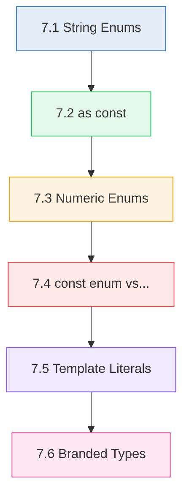
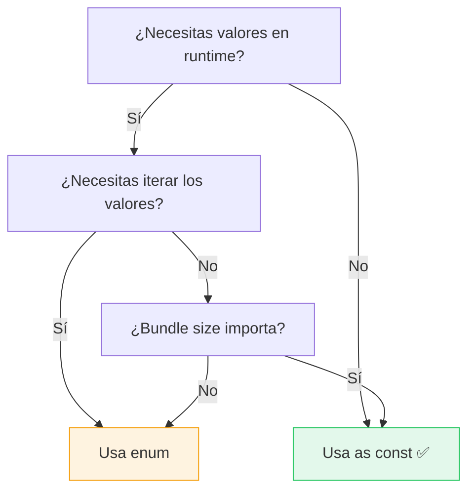

# :crystal_ball: Capítulo 7: Enums y Literal Types

<div class="chapter-meta">
  <span class="meta-item">🕐 2 horas</span>
  <span class="meta-item">📊 Nivel: Intermedio</span>
  <span class="meta-item">🎯 Semana 4</span>
</div>

<div class="chapter-objective">
  <span class="objective-icon">📌</span>
  <span class="objective-text">Al terminar este capítulo, sabrás usar enums numéricos y de string, literal types, template literal types, y el patrón "as const" — herramientas clave para representar valores fijos.</span>
</div>

<div class="chapter-map">
<h4>🗺️ Mapa del capítulo</h4>



</div>

!!! quote "Contexto"
    Los enums y literal types te permiten definir **conjuntos exactos** de valores permitidos. Es como tener un `choices` en Django, pero verificado en compilación.

---

<div class="concept-question">
<h4>🤔 Pregunta conceptual</h4>
<p>En Python tienes <code>Enum</code> de la stdlib. ¿Cómo crees que TypeScript maneja un conjunto fijo de valores como los estados de un pedido (<code>'pendiente'</code>, <code>'preparando'</code>, <code>'servido'</code>)?</p>
</div>

## 7.1 String Enums

```typescript
enum EstadoMesa {
  Libre = "libre",
  Ocupada = "ocupada",
  Reservada = "reservada",
  Limpieza = "limpieza"
}

function cambiarEstado(mesa: Mesa, estado: EstadoMesa): void {
  mesa.estado = estado;
}

cambiarEstado(mesa1, EstadoMesa.Ocupada);  // ✅
// cambiarEstado(mesa1, "inventado");       // ❌ ERROR
```

<div class="comparison" markdown>
<div class="lang-box python" markdown>

#### :snake: En Django

```python
class EstadoMesa(models.TextChoices):
    LIBRE = "libre", "Libre"
    OCUPADA = "ocupada", "Ocupada"
```

</div>
<div class="lang-box typescript" markdown>

#### 🔷 En TypeScript

```typescript
enum EstadoMesa {
  Libre = "libre",
  Ocupada = "ocupada"
}
```

</div>
</div>

<div class="misconception-box" markdown>
<h4>❌ Error común</h4>
<p><strong>Mito:</strong> "Los enums de TypeScript se comportan igual que los de Python"</p>
<p><strong>Realidad:</strong> Los numeric enums generan un reverse mapping (valor → nombre) que no existe en Python. Además, TypeScript permite asignar cualquier número a un enum numérico sin error. Prefiere string enums o <code>as const</code> para mayor seguridad.</p>
</div>

<div class="micro-exercise">
<h4>✏️ Micro-ejercicio (2 min)</h4>
<p>Define un string enum <code>Categoria</code> para los platos de MakeMenu: <code>Entrante</code>, <code>Principal</code>, <code>Postre</code>, <code>Bebida</code>. Luego crea un plato con <code>categoria: Categoria.Principal</code>.</p>
</div>

<div class="concept-question">
<h4>🤔 Pregunta conceptual</h4>
<p>¿Puede una variable tener como tipo un valor ESPECÍFICO en vez de un tipo general? Es decir, ¿puede algo ser de tipo <code>'admin'</code> en vez de tipo <code>string</code>?</p>
</div>

## 7.2 `as const`: la alternativa moderna

```typescript
// as const: alternativa preferida por la comunidad
const ZONAS = ["interior", "terraza", "barra", "privado"] as const;
type Zona = typeof ZONAS[number];
// "interior" | "terraza" | "barra" | "privado"

const CONFIG = {
  maxMesas: 50,
  maxPersonas: 12,
  zonas: ["interior", "terraza"] as const,
} as const;
// typeof CONFIG.maxMesas → 50 (literal), no number
```

!!! tip "Preferencia moderna"
    La comunidad TypeScript prefiere `as const` sobre enums en la mayoría de casos. Son más simples, se eliminan en compilación y se integran mejor con el sistema de tipos. Usa enums solo cuando necesites reverse mapping.

<div class="micro-exercise">
<h4>✏️ Micro-ejercicio (2 min)</h4>
<p>Crea un tipo literal <code>Zona = 'terraza' | 'interior' | 'barra'</code> y una función <code>asignarMesa(zona: Zona): string</code> que devuelva un mensaje diferente por zona.</p>
</div>

<div class="concept-question">
<h4>🤔 Pregunta conceptual</h4>
<p>¿Qué pasa si defines un array <code>['rojo', 'verde', 'azul']</code>? TypeScript lo infiere como <code>string[]</code>. ¿Hay forma de que lo infiera como una tupla de literales exactos?</p>
</div>

## 7.3 Numeric Enums y Reverse Mapping

A diferencia de los string enums, los **numeric enums** generan un mapeo inverso en el JavaScript emitido:

```typescript
enum HttpStatus {
  OK = 200,
  Created = 201,
  BadRequest = 400,
  NotFound = 404,
  InternalError = 500
}

// Acceso normal
const status: HttpStatus = HttpStatus.OK; // 200

// Reverse mapping (solo numeric enums)
const nombre = HttpStatus[200]; // "OK"
const nombre2 = HttpStatus[404]; // "NotFound"
```

!!! warning "Solo numeric enums tienen reverse mapping"
    Los string enums **NO** generan reverse mapping. Si necesitas mapear en ambas direcciones, usa numeric enums o crea tu propio mapa.

<div class="misconception-box">
<h4>⚠️ Errores comunes</h4>
<ul>
<li><span class="wrong">❌ Mito:</span> "Los enums siempre son la mejor opción para valores fijos" → <span class="right">✅ Realidad:</span> Las literal unions (<code>type Estado = 'activo' | 'inactivo'</code>) son más ligeras, tree-shakeable, y no generan JavaScript extra.</li>
<li><span class="wrong">❌ Mito:</span> "Los enums numéricos son seguros" → <span class="right">✅ Realidad:</span> TypeScript permite asignar CUALQUIER número a un enum numérico. <code>enum Dir { Up = 0 }; let d: Dir = 99;</code> compila sin error. Usa string enums.</li>
<li><span class="wrong">❌ Mito:</span> "<code>as const</code> y <code>Object.freeze</code> hacen lo mismo" → <span class="right">✅ Realidad:</span> <code>as const</code> es puramente tipos (compilación). <code>Object.freeze</code> es runtime. Se complementan, no se sustituyen.</li>
</ul>
</div>

## 7.4 `const enum` vs `enum` vs `as const`

Hay tres formas de definir conjuntos de constantes. Cada una tiene ventajas:

```typescript
// 1. enum regular: genera JavaScript (objeto)
enum Color { Rojo, Verde, Azul }
// Compila a: var Color; Color["Rojo"] = 0; Color[0] = "Rojo"; ...

// 2. const enum: se elimina completamente, se inlinea
const enum Dirección {
  Norte = "N",
  Sur = "S",
  Este = "E",
  Oeste = "O"
}
const dir = Dirección.Norte; // Compila a: const dir = "N";

// 3. as const: no genera nada extra, puro tipado
const ESTADOS = {
  libre: "libre",
  ocupada: "ocupada",
  reservada: "reservada"
} as const;
type Estado = typeof ESTADOS[keyof typeof ESTADOS];
```

| Característica | `enum` | `const enum` | `as const` |
|:---|:---|:---|:---|
| Genera código JS | Sí (objeto) | No (inlined) | No |
| Reverse mapping | Sí (numeric) | No | No |
| Tree-shaking | Problemático | Perfecto | Perfecto |
| Uso en `.d.ts` | Sí | Problemático | Sí |
| Iterable en runtime | Sí | No | Con `Object.values()` |
| Interop con JS puro | Bueno | Malo | Excelente |



!!! tip "Recomendación"
    Usa `as const` por defecto. Es la opción más simple, más predecible y mejor integrada con el ecosistema TypeScript moderno. Reserva `enum` para cuando necesites iterar los valores en runtime o el reverse mapping.

<div class="pro-tip">
<h4>💡 Consejo Pro</h4>
<p>En MakeMenu usamos string literal unions en vez de enums para los estados: <code>type EstadoPedido = 'pendiente' | 'preparando' | 'servido' | 'pagado'</code>. Son más ligeras, funcionan mejor con JSON (la API devuelve strings, no números), y se pueden usar directamente en discriminated unions.</p>
</div>

<div class="pro-tip">
<h4>💡 Consejo Pro</h4>
<p>Usa <code>as const</code> para objetos de configuración. <code>const CONFIG = { api: 'https://...', timeout: 5000 } as const</code> hace que TypeScript trate los valores como literales inmutables, no como <code>string</code> y <code>number</code> genéricos.</p>
</div>

<div class="connection-box">
<span class="connection-icon">🔗</span>
<span>Recuerda del <a href='../05-uniones/'>Capítulo 5</a> las uniones discriminadas. Los literal types que aprendes aquí son la base: el campo discriminante (<code>tipo: 'click' | 'keypress'</code>) usa literal types.</span>
</div>

<div class="code-evolution">
<div class="evolution-header">🔄 Evolución del código</div>
<div class="evolution-step">
<span class="step-label novato">v1 — Novato</span>

```javascript
// Magic strings sin tipos — frágil y propenso a errores
function procesarPedido(status) {
  if (status === 'pending') {      // ¿y si escribo 'pendng'?
    console.log('Preparando...');
  } else if (status === 'ready') {
    console.log('Servir al cliente');
  }
}

procesarPedido('pendingg'); // Bug silencioso, no hay error
```

</div>
<div class="evolution-step">
<span class="step-label mejorado">v2 — Con enum</span>

```typescript
// Enum numérico — mejor, pero con limitaciones
enum EstadoPedido {
  Pendiente,    // 0
  Preparando,   // 1
  Servido       // 2
}

function procesarPedido(status: EstadoPedido): void {
  if (status === EstadoPedido.Pendiente) {
    console.log('Preparando...');
  }
}

procesarPedido(EstadoPedido.Pendiente); // ✅
// Pero: let s: EstadoPedido = 99; // ¡Compila sin error!
```

</div>
<div class="evolution-step">
<span class="step-label profesional">v3 — Profesional</span>

```typescript
// String literal union + discriminated union — robusto y ligero
type EstadoPedido = 'pendiente' | 'preparando' | 'servido';

type Pedido =
  | { estado: 'pendiente'; creadoEn: Date }
  | { estado: 'preparando'; cocinero: string }
  | { estado: 'servido'; servidoEn: Date };

function procesarPedido(pedido: Pedido): string {
  switch (pedido.estado) {
    case 'pendiente': return `Esperando desde ${pedido.creadoEn}`;
    case 'preparando': return `Cocinero: ${pedido.cocinero}`;
    case 'servido': return `Servido a las ${pedido.servidoEn}`;
  }
}
// Zero runtime overhead, exhaustiveness checking, JSON-friendly
```

</div>
</div>

## 7.5 Template Literal Types

Los template literal types permiten crear tipos compuestos a partir de strings, generando todas las combinaciones automáticamente:

```typescript
type Evento = "click" | "hover" | "focus";
type Handler = `on${Capitalize<Evento>}`;
// "onClick" | "onHover" | "onFocus"

type CSSUnit = "px" | "em" | "rem" | "%";
type CSSValue = `${number}${CSSUnit}`;
// "10px", "1.5em", "100%" etc.

type Recurso = "mesas" | "reservas" | "pedidos";
type ApiRoute = `/api/${Recurso}`;
// "/api/mesas" | "/api/reservas" | "/api/pedidos"
```

**Combinaciones avanzadas:**

```typescript
// Generar todas las rutas CRUD
type HttpMethod = "GET" | "POST" | "PUT" | "DELETE";
type ApiEndpoint = `${HttpMethod} /api/${Recurso}`;
// 4 métodos × 3 recursos = 12 combinaciones

// Type-safe CSS grid areas
type Row = 1 | 2 | 3;
type Col = 1 | 2 | 3 | 4;
type GridArea = `${Row}-${Col}`;
// "1-1" | "1-2" | ... | "3-4" (12 combinaciones)
```

### Transformadores de strings built-in

TypeScript incluye 4 transformadores que funcionan a nivel de tipos:

```typescript
type Grito = Uppercase<"hola">;        // "HOLA"
type Susurro = Lowercase<"HOLA">;      // "hola"
type Capital = Capitalize<"hola">;     // "Hola"
type Descapital = Uncapitalize<"Hola">; // "hola"

// Uso práctico: generar nombres de eventos desde propiedades
// (esto usa mapped types + key remapping, que veremos en el Capítulo 11)
type PropEvents<T> = {
  [K in keyof T as `on${Capitalize<string & K>}Change`]: (value: T[K]) => void;
};

interface MesaProps { número: number; zona: string; }
type MesaEventos = PropEvents<MesaProps>;
// { onNumeroChange: (value: number) => void; onZonaChange: (value: string) => void }
```

## 7.6 Branded Types (tipos nominales)

TypeScript usa tipado **estructural**: dos tipos con la misma estructura son compatibles, aunque tengan nombres distintos. Los branded types añaden una "marca" invisible para hacerlos incompatibles:

```typescript
// Problema: ambos son number, pero no son intercambiables
type MesaId = number;
type ReservaId = number;

function liberarMesa(id: MesaId): void { /* ... */ }
const reservaId: ReservaId = 42;
liberarMesa(reservaId); // ✅ TypeScript lo permite... ¡pero es un bug!

// Solución: branded types
type MesaIdBrand = number & { readonly __brand: "MesaId" };
type ReservaIdBrand = number & { readonly __brand: "ReservaId" };

function crearMesaId(id: number): MesaIdBrand {
  return id as MesaIdBrand;
}
function crearReservaId(id: number): ReservaIdBrand {
  return id as ReservaIdBrand;
}

function liberarMesa2(id: MesaIdBrand): void { /* ... */ }

const mesaId = crearMesaId(5);
const reservaId2 = crearReservaId(42);

liberarMesa2(mesaId);       // ✅
// liberarMesa2(reservaId2); // ❌ ReservaIdBrand no es MesaIdBrand
// liberarMesa2(5);          // ❌ number no es MesaIdBrand
```

<div class="comparison" markdown>
<div class="lang-box python" markdown>

#### :snake: En Python

Python usa `NewType` para tipos nominales:
```python
from typing import NewType
MesaId = NewType("MesaId", int)
```
Pero no se verifica en runtime.

</div>
<div class="lang-box typescript" markdown>

#### 🔷 En TypeScript

Los branded types son un patrón (no una feature del lenguaje). Usan intersección con una propiedad fantasma para crear incompatibilidad entre tipos estructuralmente iguales.

</div>
</div>

!!! info "¿Cuándo usar branded types?"
    - IDs de diferentes entidades (MesaId vs ReservaId)
    - Valores validados (`Email` vs `string` sin validar)
    - Unidades (`Euros` vs `Dolares`, `Metros` vs `Pies`)
    - Cualquier par de tipos estructuralmente idénticos que semánticamente son distintos

<div class="connection-box">
<span class="connection-icon">🔗</span>
<span>En el <a href='../08-utility-types/'>Capítulo 8</a> verás utility types como <code>Record&lt;Categoria, Plato[]&gt;</code> que combinan enums/literales con genéricos para crear tipos potentes.</span>
</div>

---

<div class="ejercicio-guiado">
<h4>🏋️ Ejercicio guiado</h4>

Vas a crear un sistema de permisos para MakeMenu usando `as const`, template literal types y branded types.

1. Define un objeto `ROLES` con `as const` que contenga `ADMIN`, `CAMARERO` y `COCINA` como string values.
2. Extrae el tipo `Rol` usando `typeof ROLES[keyof typeof ROLES]`.
3. Crea un template literal type `Permiso` con el patrón `"puede_<acción>"` donde las acciones son `"crear" | "leer" | "editar" | "borrar"`.
4. Define un `Record<Rol, Permiso[]>` que asigne permisos a cada rol (admin tiene todos, camarero tiene leer y crear, cocina tiene leer).
5. Crea una función `tienePermiso(rol: Rol, permiso: Permiso): boolean` que verifique si un rol tiene un permiso concreto.

??? success "Solución completa"
    ```typescript
    const ROLES = {
      ADMIN: "admin",
      CAMARERO: "camarero",
      COCINA: "cocina",
    } as const;

    type Rol = typeof ROLES[keyof typeof ROLES];
    // "admin" | "camarero" | "cocina"

    type Acción = "crear" | "leer" | "editar" | "borrar";
    type Permiso = `puede_${Acción}`;
    // "puede_crear" | "puede_leer" | "puede_editar" | "puede_borrar"

    const permisosPorRol: Record<Rol, Permiso[]> = {
      admin: ["puede_crear", "puede_leer", "puede_editar", "puede_borrar"],
      camarero: ["puede_leer", "puede_crear"],
      cocina: ["puede_leer"],
    };

    function tienePermiso(rol: Rol, permiso: Permiso): boolean {
      return permisosPorRol[rol].includes(permiso);
    }

    // Pruebas
    console.log(tienePermiso("admin", "puede_borrar"));     // true
    console.log(tienePermiso("camarero", "puede_borrar"));  // false
    console.log(tienePermiso("cocina", "puede_leer"));      // true

    // ❌ Errores en compilación:
    // tienePermiso("cliente", "puede_leer");    // "cliente" no es Rol
    // tienePermiso("admin", "puede_volar");     // "puede_volar" no es Permiso
    ```

</div>

---

<div class="real-errors">
<h4>🚨 Errores que vas a encontrar</h4>

**Error 1: Asignar un string a un enum de string**

```typescript
enum Estado { Activo = "activo", Inactivo = "inactivo" }
const e: Estado = "activo"; // ❌
```

```
error TS2322: Type '"activo"' is not assignable to type 'Estado'.
```

**¿Por qué?** Los string enums son nominales — el valor `"activo"` no es lo mismo que `Estado.Activo` aunque tengan el mismo contenido.

**Solución:** Usa `Estado.Activo` en lugar del string literal.

---

**Error 2: const enum con `--isolatedModules`**

```typescript
const enum Color { Rojo, Verde, Azul }
export default Color; // ❌
```

```
error TS2475: 'const' enums can only be used in property or index access expressions
```

**¿Por qué?** Con `isolatedModules` (requerido por Vite/esbuild), los `const enum` no se pueden exportar porque se eliminan en compilación.

**Solución:** Usa `enum` normal o migra a `as const`.

---

**Error 3: Template literal con tipo no-string**

```typescript
type Id = number;
type Prefijo = `user_${Id}`; // ❌
```

```
error TS2344: Type 'number' does not satisfy the constraint 'string | number | bigint | boolean | null | undefined'.
```

**¿Por qué?** Realmente `number` sí es válido en template literals. Este error aparece cuando usas tipos complejos como objetos.

**Solución:** Asegúrate de que el tipo interpolado sea `string | number | boolean | bigint | null | undefined`.

---

**Error 4: Branded type no asignable desde primitivo**

```typescript
type UserId = number & { __brand: "UserId" };
const id: UserId = 42; // ❌
```

```
error TS2322: Type 'number' is not assignable to type 'UserId'.
```

**Solución:** Crea una función constructora: `const userId = (n: number) => n as UserId;`

</div>

<div class="checkpoint">
<h4>🏁 Checkpoint</h4>
<p>Si puedes: (1) elegir entre enum, literal union y <code>as const</code>, (2) explicar por qué los string enums son más seguros que los numéricos, y (3) usar template literal types — dominas este capítulo.</p>
</div>

<div class="mini-project">
<h4>🏗️ Mini-proyecto: Configurador de menú con as const y branded types</h4>

**Paso 1 — Define las categorías y estados con `as const`**

Crea un objeto `CATEGORIAS` con `as const` que tenga: `ENTRANTE`, `PRINCIPAL`, `POSTRE`, `BEBIDA`. Deriva el tipo `Categoria` con `typeof`. Haz lo mismo para `ESTADO_PEDIDO` con `PENDIENTE`, `PREPARANDO`, `LISTO`, `ENTREGADO`.

??? success "Solución Paso 1"
    ```typescript
    const CATEGORIAS = {
      ENTRANTE: "entrante",
      PRINCIPAL: "principal",
      POSTRE: "postre",
      BEBIDA: "bebida",
    } as const;

    type Categoria = typeof CATEGORIAS[keyof typeof CATEGORIAS];

    const ESTADO_PEDIDO = {
      PENDIENTE: "pendiente",
      PREPARANDO: "preparando",
      LISTO: "listo",
      ENTREGADO: "entregado",
    } as const;

    type EstadoPedido = typeof ESTADO_PEDIDO[keyof typeof ESTADO_PEDIDO];
    ```

**Paso 2 — Crea branded types para IDs**

Define `PlatoId` y `MesaId` como branded types sobre `number`. Crea funciones constructoras que validen que el número es positivo.

??? success "Solución Paso 2"
    ```typescript
    type PlatoId = number & { __brand: "PlatoId" };
    type MesaId = number & { __brand: "MesaId" };

    function platoId(n: number): PlatoId {
      if (n <= 0) throw new Error(`PlatoId inválido: ${n}`);
      return n as PlatoId;
    }

    function mesaId(n: number): MesaId {
      if (n <= 0) throw new Error(`MesaId inválido: ${n}`);
      return n as MesaId;
    }

    // TypeScript impide mezclarlos:
    const p = platoId(1);
    const m = mesaId(5);
    // const error: PlatoId = m; // ❌ Type 'MesaId' is not assignable to 'PlatoId'
    ```

**Paso 3 — Usa template literal types para eventos**

Crea un tipo `EventoMesa` que genere automáticamente nombres de eventos como `"mesa_pendiente"`, `"mesa_preparando"`, etc.

??? success "Solución Paso 3"
    ```typescript
    type EventoMesa = `mesa_${EstadoPedido}`;
    // "mesa_pendiente" | "mesa_preparando" | "mesa_listo" | "mesa_entregado"

    type Handler = (mesa: MesaId) => void;

    const handlers: Record<EventoMesa, Handler> = {
      mesa_pendiente: (m) => console.log(`Mesa ${m}: pedido recibido`),
      mesa_preparando: (m) => console.log(`Mesa ${m}: cocinando...`),
      mesa_listo: (m) => console.log(`Mesa ${m}: ¡listo para servir!`),
      mesa_entregado: (m) => console.log(`Mesa ${m}: entregado ✅`),
    };

    // Probar
    handlers.mesa_listo(mesaId(3));
    ```

</div>

## :link: Recursos

| Recurso | Enlace |
|---------|--------|
| Enums | [typescriptlang.org/.../enums](https://www.typescriptlang.org/docs/handbook/enums.html) |
| Template Literal Types | [typescriptlang.org/.../template-literal-types](https://www.typescriptlang.org/docs/handbook/2/template-literal-types.html) |
| Total TypeScript: as const | [totaltypescript.com/as-const](https://www.totaltypescript.com/concepts/as-const) |
| Branded Types | [totaltypescript.com/branded-types](https://www.totaltypescript.com/how-to-create-branded-types) |

---

## 🎯 Ejercicios

??? question "Ejercicio 1: Categorías as const"
    Crea un objeto `as const` con las categorías del menú y extrae el tipo union.

    ??? success "Solución"
        ```typescript
        const CATEGORIAS = ["entrante", "principal", "postre", "bebida"] as const;
        type Categoria = typeof CATEGORIAS[number];
        // "entrante" | "principal" | "postre" | "bebida"
        ```

??? question "Ejercicio 2: Template literal para rutas API"
    Crea un template literal type para rutas REST: `GET /api/mesas`, `POST /api/reservas`, etc.

    ??? success "Solución"
        ```typescript
        type HttpMethod = "GET" | "POST" | "PUT" | "DELETE";
        type Recurso = "mesas" | "reservas" | "pedidos";
        type ApiEndpoint = `${HttpMethod} /api/${Recurso}`;
        // "GET /api/mesas" | "POST /api/mesas" | ... (12 combinaciones)
        ```

??? question "Ejercicio 3: Branded type Email"
    Crea un branded type `Email` que solo se pueda crear a través de una función `crearEmail` que valide el formato. Luego crea una función `enviarCorreo` que solo acepte `Email`, no `string`.

    !!! tip "Pista"
        Usa `string & { readonly __brand: "Email" }` como tipo branded. La función constructora válida con regex y castea.

    ??? success "Solución"
        ```typescript
        type Email = string & { readonly __brand: "Email" };

        function crearEmail(valor: string): Email {
          if (!/^[^@]+@[^@]+\.[^@]+$/.test(valor)) {
            throw new Error(`Email inválido: ${valor}`);
          }
          return valor as Email;
        }

        function enviarCorreo(destino: Email, asunto: string): void {
          console.log(`Enviando "${asunto}" a ${destino}`);
        }

        const email = crearEmail("daniele@mail.com");
        enviarCorreo(email, "Reserva confirmada");  // ✅
        // enviarCorreo("hola@mail.com", "test");    // ❌ string no es Email
        ```

??? question "Ejercicio 4: Migrar enum a as const"
    Dado el siguiente enum, conviértelo a un patrón `as const` equivalente y demuestra que el tipo resultante es el mismo:

    ```typescript
    enum Turno { Manana = "mañana", Tarde = "tarde", Noche = "noche" }
    ```

    !!! tip "Pista"
        Usa un objeto `as const` y extrae el tipo con `typeof OBJ[keyof typeof OBJ]`.

    ??? success "Solución"
        ```typescript
        // Original: enum
        enum TurnoEnum { Manana = "mañana", Tarde = "tarde", Noche = "noche" }

        // Migrado: as const
        const TURNOS = {
          Manana: "mañana",
          Tarde: "tarde",
          Noche: "noche"
        } as const;

        type Turno = typeof TURNOS[keyof typeof TURNOS];
        // "mañana" | "tarde" | "noche"

        // Uso idéntico
        function asignarTurno(camarero: string, turno: Turno): void {
          console.log(`${camarero} → ${turno}`);
        }

        asignarTurno("Ana", TURNOS.Manana);  // ✅ "mañana"
        asignarTurno("Juan", "tarde");        // ✅ string literal
        // asignarTurno("Pedro", "madrugada"); // ❌
        ```

??? question "Ejercicio 5: PropEvents con template literals"
    Dado un tipo `{ nombre: string; precio: number; activo: boolean }`, genera automáticamente un tipo de handlers de cambio: `{ onNombreChange: (v: string) => void; onPrecioChange: (v: number) => void; ... }`.

    !!! tip "Pista"
        Usa mapped types con key remapping: `[K in keyof T as \`on${Capitalize<string & K>}Change\`]`.

    ??? success "Solución"
        ```typescript
        type ChangeHandlers<T> = {
          [K in keyof T as `on${Capitalize<string & K>}Change`]: (value: T[K]) => void;
        };

        interface MenuItem { nombre: string; precio: number; activo: boolean; }
        type MenuHandlers = ChangeHandlers<MenuItem>;
        // {
        //   onNombreChange: (value: string) => void;
        //   onPrecioChange: (value: number) => void;
        //   onActivoChange: (value: boolean) => void;
        // }

        const handlers: MenuHandlers = {
          onNombreChange: (v) => console.log(`Nombre: ${v}`),
          onPrecioChange: (v) => console.log(`Precio: ${v.toFixed(2)}`),
          onActivoChange: (v) => console.log(`Activo: ${v}`),
        };
        ```

---

## :brain: Flashcards de repaso

<div class="flashcard">
<div class="front">¿Cuál es la diferencia entre <code>enum</code> y <code>as const</code>?</div>
<div class="back"><code>enum</code> genera un objeto JavaScript en runtime. <code>as const</code> solo existe en compilación y se elimina completamente. La comunidad prefiere <code>as const</code> por ser más ligero y predecible.</div>
</div>

<div class="flashcard">
<div class="front">¿Qué es un branded type?</div>
<div class="back">Un patrón que usa intersección con una propiedad fantasma (<code>number & { __brand: "X" }</code>) para hacer tipos estructuralmente iguales incompatibles entre sí.</div>
</div>

<div class="flashcard">
<div class="front">¿Qué hace <code>Capitalize</code> en template literal types?</div>
<div class="back">Convierte la primera letra a mayúscula a nivel de tipos: <code>Capitalize&lt;"hola"&gt;</code> = <code>"Hola"</code>. Es uno de los 4 transformadores built-in.</div>
</div>

<div class="flashcard">
<div class="front">¿Qué es reverse mapping en enums?</div>
<div class="back">Solo en numeric enums: además de <code>Enum.Nombre → valor</code>, puedes hacer <code>Enum[valor] → "Nombre"</code>. Los string enums NO lo soportan.</div>
</div>

<div class="flashcard">
<div class="front">¿Cómo extraer un tipo union de un array <code>as const</code>?</div>
<div class="back"><code>typeof ARRAY[number]</code>. Ejemplo: <code>const A = ["a", "b"] as const; type T = typeof A[number]; // "a" | "b"</code>.</div>
</div>

---

## :video_game: Quiz interactivo

<div class="quiz" data-quiz-id="ch07-q1">
<h4>Pregunta 1: ¿Cuál es la principal ventaja de <code>as const</code> sobre un <code>enum</code>?</h4>
<button class="quiz-option" data-correct="false">Es más rápido en runtime</button>
<button class="quiz-option" data-correct="true">No genera código JavaScript (zero runtime overhead) y preserva los tipos literales exactos</button>
<button class="quiz-option" data-correct="false">Permite reverse mapping</button>
<button class="quiz-option" data-correct="false">Es compatible con Django</button>
<div class="quiz-feedback" data-correct="¡Correcto! `as const` es una directiva del compilador — no genera código extra. Los enums generan un objeto JavaScript. `as const` preserva tipos literales exactos." data-incorrect="Incorrecto. `as const` no genera código JavaScript (es solo para el compilador), mientras que un `enum` genera un objeto en runtime. Además, `as const` preserva los tipos literales exactos."></div>
</div>

<div class="quiz" data-quiz-id="ch07-q2">
<h4>Pregunta 2: ¿Para qué sirven los branded types?</h4>
<button class="quiz-option" data-correct="false">Para crear enums con valores numéricos</button>
<button class="quiz-option" data-correct="false">Para hacer que todas las propiedades sean opcionales</button>
<button class="quiz-option" data-correct="true">Para crear tipos nominales que impiden confundir valores del mismo tipo primitivo (como <code>MesaId</code> vs <code>PedidoId</code>)</button>
<button class="quiz-option" data-correct="false">Para generar código JavaScript automáticamente</button>
<div class="quiz-feedback" data-correct="¡Correcto! Los branded types añaden una 'marca' invisible al tipo para que TypeScript distinga entre `MesaId` y `PedidoId` aunque ambos sean `number`. Previenen errores como pasar un ID de mesa donde se espera uno de pedido." data-incorrect="Incorrecto. Los branded types crean tipos nominales — TypeScript es estructural, así que sin branded types `MesaId` y `PedidoId` serían intercambiables si ambos son `number`."></div>
</div>

<div class="quiz" data-quiz-id="ch07-q3">
<h4>Pregunta 3: ¿Qué genera un <code>const enum</code> en el JavaScript compilado?</h4>
<button class="quiz-option" data-correct="false">Un objeto con las claves y valores</button>
<button class="quiz-option" data-correct="true">Nada — los valores se sustituyen directamente en línea (<em>inlined</em>)</button>
<button class="quiz-option" data-correct="false">Un <code>Map</code> de JavaScript</button>
<button class="quiz-option" data-correct="false">Una clase con propiedades estáticas</button>
<div class="quiz-feedback" data-correct="¡Correcto! `const enum` hace inlining: el compilador sustituye cada referencia por su valor literal. No queda rastro del enum en el JS resultante." data-incorrect="Incorrecto. A diferencia de un `enum` normal (que genera un objeto JS), un `const enum` se elimina completamente — el compilador sustituye cada uso por el valor literal."></div>
</div>

<div class="quiz" data-quiz-id="ch07-q4">
<h4>Pregunta 4: ¿Cuál es la alternativa moderna recomendada a los <code>enum</code> numéricos?</h4>
<button class="quiz-option" data-correct="false">Interfaces con propiedades numéricas</button>
<button class="quiz-option" data-correct="false">Clases con constantes estáticas</button>
<button class="quiz-option" data-correct="true">Objetos <code>as const</code> con <code>keyof typeof</code> para derivar la unión de valores</button>
<button class="quiz-option" data-correct="false">Arrays de tuplas <code>[string, number]</code></button>
<div class="quiz-feedback" data-correct="¡Correcto! `as const` + `typeof` es la alternativa moderna: no genera código extra, preserva tipos literales exactos, y es tree-shakeable." data-incorrect="Incorrecto. La alternativa moderna a enums es `as const`: `const ESTADO = { Libre: 0, Ocupada: 1 } as const`. Luego se usa `typeof ESTADO[keyof typeof ESTADO]` para obtener la unión de valores."></div>
</div>

---

## :bug: Ejercicio de depuración

Encuentra los **3 errores** en este código:

```typescript
// ❌ Este código tiene 3 errores. ¡Encuéntralos!

// 1. Enum con tipos mezclados
enum EstadoPedido {
  Pendiente = "pendiente",
  EnCocina = 2,                // 🤔 ¿Se pueden mezclar?
  Servido = "servido",
  Cancelado = "cancelado"
}

// 2. as const con typeof incorrecto
const ROLES = ["admin", "camarero", "cocina"] as const;

function tienePermiso(rol: typeof ROLES): boolean {  // 🤔 ¿Tipo correcto?
  return rol === "admin";
}

// 3. Branded type mal usado
type MesaId = number & { __brand: "MesaId" };
type PedidoId = number & { __brand: "PedidoId" };

function obtenerMesa(id: MesaId): void { /* ... */ }

const miId: number = 5;
obtenerMesa(miId);  // 🤔 ¿Compila?
```

??? success "Solución"
    ```typescript
    // ✅ Código corregido

    // 1. Enum — NO mezclar string y number values
    enum EstadoPedido {
      Pendiente = "pendiente",
      EnCocina = "en_cocina",     // ✅ Fix 1: todos string, no mezclar con number
      Servido = "servido",
      Cancelado = "cancelado"
    }

    // 2. typeof ROLES da el array completo, necesitas indexar con [number]
    const ROLES = ["admin", "camarero", "cocina"] as const;

    function tienePermiso(rol: typeof ROLES[number]): boolean {  // ✅ Fix 2: [number] para extraer union
      return rol === "admin";
    }

    // 3. Branded types necesitan un constructor/función helper
    type MesaId = number & { __brand: "MesaId" };
    type PedidoId = number & { __brand: "PedidoId" };

    function obtenerMesa(id: MesaId): void { /* ... */ }

    const miId = 5 as MesaId;    // ✅ Fix 3: necesita assertion o función helper
    obtenerMesa(miId);
    ```

---

## ✅ Autoevaluación del capítulo

<div class="self-check" markdown>
<h4>📋 Verifica tu comprensión</h4>
<label><input type="checkbox"> Sé cuándo usar <code>enum</code> vs <code>as const</code> y sus trade-offs</label>
<label><input type="checkbox"> Puedo extraer un union type de un array <code>as const</code> con <code>typeof ARRAY[number]</code></label>
<label><input type="checkbox"> Entiendo los branded types y cuándo usarlos</label>
<label><input type="checkbox"> Sé crear template literal types para patrones de strings</label>
<label><input type="checkbox"> He completado todos los ejercicios del capítulo</label>
</div>
