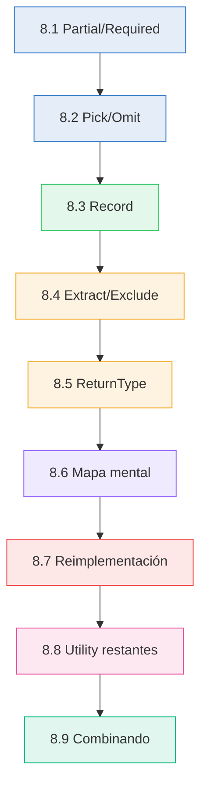
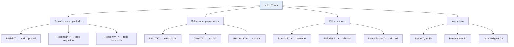

# :toolbox: Capítulo 8: Utility Types

<div class="chapter-meta">
  <span class="meta-item">🕐 3 horas</span>
  <span class="meta-item">📊 Nivel: Intermedio</span>
  <span class="meta-item">🎯 Semana 4</span>
</div>

<div class="chapter-objective">
  <span class="objective-icon">📌</span>
  <span class="objective-text">Al terminar este capítulo, dominarás los utility types built-in de TypeScript (Partial, Required, Pick, Omit, Record, etc.) y sabrás combinarlos para crear tipos derivados sin duplicar código.</span>
</div>

<div class="chapter-map">
<h4>🗺️ Mapa del capítulo</h4>



</div>

!!! quote "Contexto"
    Los Utility Types son tipos predefinidos que TypeScript incluye para transformar otros tipos. Son como las funciones built-in de Python (`map`, `filter`, `zip`) pero para **TIPOS**.

---

<div class="connection-box" markdown>
:link: **Conexión con el Capítulo 6 — Genéricos**

Recuerda del <a href='../06-generics/'>Capítulo 6</a> que los genéricos permiten crear tipos parametrizados. Los utility types son genéricos built-in: `Partial<T>` es una función a nivel de tipos que transforma `T`. Si los genéricos son funciones que reciben tipos como argumentos, los utility types son la *librería estándar* de esas funciones.
</div>

<div class="concept-question" markdown>
🤔 **Pregunta para reflexionar**

Si tienes una interfaz `Plato` con 6 propiedades, ¿cómo crearías un tipo para actualizar un plato donde TODAS las propiedades son opcionales? ¿Copiarías la interfaz entera añadiendo `?` a cada campo?
</div>

## 8.1 `Partial<T>` y `Required<T>`

```typescript
// Partial<T>: todas las propiedades opcionales
type MesaUpdate = Partial<Mesa>;
// { id?: number; número?: number; zona?: string; ... }

function actualizarMesa(id: number, datos: Partial<Mesa>): Mesa {
  const mesa = buscarMesa(id);
  return { ...mesa, ...datos };
}

actualizarMesa(5, { ocupada: true }); // Solo actualiza lo que pases
```

<div class="comparison" markdown>
<div class="lang-box python" markdown>

#### :snake: En Django REST Framework

```python
serializer = MesaSerializer(
    mesa, data=request.data, partial=True
)
```
`partial=True` hace campos opcionales.

</div>
<div class="lang-box typescript" markdown>

#### 🔷 En TypeScript

```typescript
function update(id: number, data: Partial<Mesa>)
```
`Partial<Mesa>` es el equivalente exacto.

</div>
</div>

<div class="micro-exercise" markdown>
:pencil2: **Micro-ejercicio — Partial en acción**

Crea un tipo `ActualizarPlato = Partial<Plato>` y una función `actualizarPlato(id: number, cambios: ActualizarPlato)`. Prueba que puedes pasar solo `{ precio: 15 }` sin incluir el resto de campos.

??? success "Solución"
    ```typescript
    interface Plato {
      id: number;
      nombre: string;
      precio: number;
      categoria: string;
      disponible: boolean;
      descripción: string;
    }

    type ActualizarPlato = Partial<Plato>;

    function actualizarPlato(id: number, cambios: ActualizarPlato): void {
      // Buscar plato por id y aplicar cambios
      console.log(`Actualizando plato ${id}:`, cambios);
    }

    // ✅ Solo precio — no necesitas el resto de campos
    actualizarPlato(1, { precio: 15 });

    // ✅ Varios campos a la vez
    actualizarPlato(2, { nombre: "Ensalada César", precio: 12, disponible: true });

    // ✅ Objeto vacío también es válido (no cambia nada)
    actualizarPlato(3, {});
    ```
</div>

<div class="concept-question" markdown>
🤔 **Pregunta para reflexionar**

¿Y si solo necesitas 3 de las 6 propiedades? ¿Es mejor seleccionar las que quieres o excluir las que no?
</div>

## 8.2 `Pick<T, K>` y `Omit<T, K>`

```typescript
// Pick: selecciona solo ciertas propiedades
type MesaResumen = Pick<Mesa, "número" | "zona" | "ocupada">;

// Omit: excluye ciertas propiedades
type MesaSinId = Omit<Mesa, "id">;

function crearMesa(datos: Omit<Mesa, "id">): Mesa {
  return { ...datos, id: generarId() };
}
```

<div class="concept-question" markdown>
🤔 **Pregunta para reflexionar**

¿Cómo tiparías un objeto donde las claves son categorías de platos y los valores son arrays de platos? ¿Un objeto normal con index signature o algo más elegante?
</div>

## 8.3 `Record<K, V>`

```typescript
type Zona = "interior" | "terraza" | "barra";
type ConteoZonas = Record<Zona, number>;

const conteo: ConteoZonas = {
  interior: 15,
  terraza: 10,
  barra: 8
};
```

<div class="micro-exercise" markdown>
:pencil2: **Micro-ejercicio — Record para agrupar**

Crea un `Record<Categoria, Plato[]>` que agrupe los platos del menú por categoría. ¿Qué pasa si olvidas una categoría?

??? success "Solución"
    ```typescript
    type Categoria = "entrante" | "principal" | "postre" | "bebida";

    interface Plato {
      nombre: string;
      precio: number;
    }

    // Record obliga a incluir TODAS las categorías
    const menu: Record<Categoria, Plato[]> = {
      entrante: [{ nombre: "Ensalada", precio: 8 }],
      principal: [{ nombre: "Paella", precio: 16 }],
      postre: [{ nombre: "Flan", precio: 5 }],
      bebida: [{ nombre: "Agua", precio: 2 }],
      // ❌ Si olvidas una categoría, TypeScript da error:
      // Property 'bebida' is missing in type...
    };
    ```

    Si olvidas una categoría, TypeScript te obliga a incluirla. Esto es precisamente la ventaja de `Record` sobre un index signature `{ [key: string]: Plato[] }`, que no verifica completitud.
</div>

## 8.4 `Extract`, `Exclude` y `NonNullable`

Estos tres utility types operan sobre **union types** filtrando sus miembros. `Extract<T, U>` conserva solo los miembros de `T` que sean asignables a `U` — piensa en `filter()` de Python. `Exclude<T, U>` hace lo contrario: elimina los miembros que coinciden. `NonNullable<T>` es un caso especial de `Exclude` que elimina `null` y `undefined` de una unión.

```typescript
type Estado = "libre" | "ocupada" | "reservada" | "limpieza";

type EstadoActivo = Extract<Estado, "ocupada" | "reservada">;
// "ocupada" | "reservada"

type EstadoDisponible = Exclude<Estado, "ocupada" | "limpieza">;
// "libre" | "reservada"

type MaybeString = string | null | undefined;
type DefiniteString = NonNullable<MaybeString>; // string
```

!!! tip "Cuándo usarlos"
    - **Filtrar eventos o estados**: cuando un handler solo acepta ciertos valores de una unión amplia, `Extract` restringe el tipo sin duplicar literales.
    - **Excluir casos internos**: si tienes estados que el cliente no debería ver (como `"limpieza"`), `Exclude` crea una unión pública sin ellos.
    - **Limpiar tipos de APIs externas**: `NonNullable` es esencial cuando recibes datos de una API o base de datos donde los valores pueden ser `null`, y necesitas garantizar que ya pasaron por validación.

## 8.5 `ReturnType<T>` y `Parameters<T>`

```typescript
function crearReserva(nombre: string, mesa: number, personas: number) {
  return { id: 1, nombre, mesa, personas, hora: new Date() };
}

type Reserva = ReturnType<typeof crearReserva>;
// { id: number; nombre: string; mesa: number; personas: number; hora: Date }

type ReservaParams = Parameters<typeof crearReserva>;
// [string, number, number]
```

## 8.6 Mapa mental de Utility Types



## 8.7 Reimplementación manual — cómo funcionan por dentro

Entender cómo están implementados los utility types te hace mucho mejor con TypeScript. Todos usan **mapped types** y **conditional types**:

```typescript
// Partial<T>: hace todas las propiedades opcionales
type MyPartial<T> = {
  [K in keyof T]?: T[K];  // (1)!
};

// Required<T>: hace todas las propiedades obligatorias
type MyRequired<T> = {
  [K in keyof T]-?: T[K]; // (2)!
};

// Readonly<T>: hace todas las propiedades de solo lectura
type MyReadonly<T> = {
  readonly [K in keyof T]: T[K];
};

// Pick<T, K>: selecciona propiedades
type MyPick<T, K extends keyof T> = {
  [P in K]: T[P];
};

// Omit<T, K>: excluye propiedades (usa Pick + Exclude)
type MyOmit<T, K extends keyof T> = Pick<T, Exclude<keyof T, K>>;

// Record<K, V>: crea un objeto con claves K y valores V
type MyRecord<K extends string | number | symbol, V> = {
  [P in K]: V;
};
```

1. `[K in keyof T]?:` itera sobre cada key de `T` y añade `?` (opcional)
2. `-?` es el modificador de **eliminación**: quita el `?` de propiedades opcionales

```typescript
// Extract<T, U> y Exclude<T, U>: filtran unions
type MyExtract<T, U> = T extends U ? T : never;
type MyExclude<T, U> = T extends U ? never : T;

// NonNullable<T>: elimina null y undefined
type MyNonNullable<T> = T extends null | undefined ? never : T;

// ReturnType<T>: extrae el tipo de retorno de una función
type MyReturnType<T extends (...args: any) => any> =
  T extends (...args: any) => infer R ? R : never;  // (1)!

// Parameters<T>: extrae los parámetros como tupla
type MyParameters<T extends (...args: any) => any> =
  T extends (...args: infer P) => any ? P : never;
```

1. `infer R` le dice a TypeScript: "averigua qué tipo va aquí y llámalo R".

!!! info "¿Por qué importa saber esto?"
    Reimplementar utility types te enseña **mapped types**, **conditional types** e **infer** — las tres herramientas fundamentales del tipo-nivel programming (Cap. 11-13). Es como aprender a implementar `map` y `filter` en Python: no los usas a mano, pero entiendes cómo funcionan.

## 8.8 Utility types restantes

TypeScript incluye más utility types menos conocidos pero útiles:

```typescript
// Awaited<T>: desenvuelve Promises (TS 4.5+)
type A = Awaited<Promise<string>>;           // string
type B = Awaited<Promise<Promise<number>>>;  // number (recursivo)
```

`Awaited<T>` es esencial para código async: extrae el tipo resuelto de una `Promise`, sin importar cuántos niveles de anidamiento tenga. Es especialmente útil combinado con `ReturnType` para inferir lo que devuelve una función async:

```typescript
async function fetchMesas(): Promise<Mesa[]> {
  const res = await fetch("/api/mesas");
  return res.json();
}

// Sin Awaited obtendrías Promise<Mesa[]> — con él obtienes Mesa[]
type Mesas = Awaited<ReturnType<typeof fetchMesas>>; // Mesa[]
```

```typescript
// ConstructorParameters<T>: parámetros del constructor
class MesaEntity {
  constructor(public número: number, public zona: string) {}
}
type MesaCtorParams = ConstructorParameters<typeof MesaEntity>;
// [number, string]

// InstanceType<T>: tipo de instancia de una clase
type MesaInstance = InstanceType<typeof MesaEntity>;
// MesaEntity
```

`ConstructorParameters` e `InstanceType` son útiles en patrones donde no instancias la clase directamente: factorías genéricas, inyección de dependencias o registros de clases. Si tu función recibe `typeof MesaEntity` como argumento (el constructor, no la instancia), estos tipos te permiten inferir qué parámetros necesita y qué tipo produce.

```typescript
// Uppercase / Lowercase / Capitalize / Uncapitalize (strings)
type U = Uppercase<"hola">;        // "HOLA"
type L = Lowercase<"HOLA">;        // "hola"
type C = Capitalize<"hola">;       // "Hola"
type UC = Uncapitalize<"Hola">;    // "hola"
```

Estos tipos de manipulación de strings brillan combinados con **template literal types** para crear claves derivadas automáticamente:

```typescript
type Evento = "click" | "change" | "submit";
type Handler = `on${Capitalize<Evento>}`;
// "onClick" | "onChange" | "onSubmit"

type EventHandlers = Record<Handler, () => void>;
// { onClick: () => void; onChange: () => void; onSubmit: () => void }
```

## 8.9 Combinando utility types — patrones reales

El verdadero poder surge al **combinar** utility types:

```typescript
// Patrón 1: Crear sin id, actualizar parcial sin id
interface Mesa {
  id: number;
  número: number;
  zona: string;
  capacidad: number;
  ocupada: boolean;
}

type MesaCreate = Omit<Mesa, "id">;                    // Todo menos id
type MesaUpdate = Partial<Omit<Mesa, "id">>;           // Parcial sin id
type MesaResumen = Pick<Mesa, "id" | "número" | "zona">; // Solo resumen

// Patrón 2: Readonly para config, Partial para updates
type Config = Readonly<{
  apiUrl: string;
  maxMesas: number;
  debug: boolean;
}>;

// Patrón 3: Record con tipos derivados
type Zona = "interior" | "terraza" | "barra";
type MesasPorZona = Record<Zona, Mesa[]>;
type ContadoresPorZona = Record<Zona, { total: number; libres: number }>;

// Patrón 4: Hacer algunas propiedades opcionales (no todas)
type PartialPick<T, K extends keyof T> =
  Omit<T, K> & Partial<Pick<T, K>>;

type MesaConReservaOpcional = PartialPick<Mesa, "ocupada">;
// { id: number; número: number; zona: string; capacidad: number; ocupada?: boolean }
```

<div class="comparison" markdown>
<div class="lang-box python" markdown>

#### :snake: En Python

Python no tiene equivalente a los utility types. Con `TypedDict` puedes hacer `total=False` para campos opcionales, pero no puedes transformar tipos existentes.

</div>
<div class="lang-box typescript" markdown>

#### 🔷 En TypeScript

Los utility types permiten **derivar** nuevos tipos a partir de existentes. Cambias un tipo y todos sus derivados se actualizan automáticamente.

</div>
</div>

---

<div class="misconception-box" markdown>
:no_entry: **Conceptos erróneos comunes sobre Utility Types**

| Mito | Realidad |
|------|----------|
| "**`Partial` hace que los valores sean `undefined`**" | `Partial<T>` hace las propiedades **OPCIONALES** (pueden no existir), no las hace `undefined`. Con `strictNullChecks`, son `T[key] \| undefined` al acceder, pero eso es porque la propiedad *podría no estar presente*, no porque su valor sea `undefined`. |
| "**`Omit` modifica el tipo original**" | Todos los utility types crean tipos **NUEVOS**. El tipo original nunca cambia. Son transformaciones inmutables, como `map()` y `filter()` en un array: devuelven algo nuevo sin tocar el original. |
| "**No puedo combinar utility types**" | Puedes anidarlos libremente: `Partial<Pick<Plato, 'nombre' \| 'precio'>>` es perfectamente válido y muy útil. Piensa en ellos como funciones que puedes componer. |
</div>

<div class="code-evolution" markdown>
:chart_with_upwards_trend: **Evolución de código — DTOs de una API de restaurante**

=== "v1: Novato — Interfaces duplicadas"

    ```typescript
    // ❌ Copiar y pegar: cada caso de uso tiene su propia interfaz
    interface Plato {
      id: number;
      nombre: string;
      precio: number;
      categoria: string;
      disponible: boolean;
      createdAt: Date;
    }

    // Duplicación total para crear
    interface CrearPlato {
      nombre: string;
      precio: number;
      categoria: string;
      disponible: boolean;
    }

    // Duplicación total para actualizar
    interface ActualizarPlato {
      nombre?: string;
      precio?: number;
      categoria?: string;
      disponible?: boolean;
    }

    // Duplicación total para respuesta
    interface PlatoResponse {
      id: number;
      nombre: string;
      precio: number;
      categoria: string;
      disponible: boolean;
      createdAt: Date;
    }
    // 😱 Si añades una propiedad a Plato, tienes que actualizar 4 interfaces
    ```

=== "v2: Con utility types — Sin duplicación"

    ```typescript
    // ✅ Una interfaz base, tipos derivados
    interface Plato {
      id: number;
      nombre: string;
      precio: number;
      categoria: string;
      disponible: boolean;
      createdAt: Date;
    }

    type CrearPlato = Omit<Plato, "id" | "createdAt">;
    type ActualizarPlato = Partial<Plato>;
    type PlatoResponse = Plato; // Ya es lo que necesitamos

    // ✅ Añadir propiedad a Plato se propaga automáticamente
    ```

=== "v3: Profesional — DTOs en capas"

    ```typescript
    // ✅ Patrón DTO profesional con capas bien definidas
    interface Plato {
      id: number;
      nombre: string;
      precio: number;
      categoria: string;
      disponible: boolean;
      createdAt: Date;
      updatedAt: Date;
    }

    // Campos que el servidor genera automáticamente
    type CamposAutoGenerados = "id" | "createdAt" | "updatedAt";

    // DTO para crear: el cliente no envía id ni timestamps
    type CrearPlatoDTO = Omit<Plato, CamposAutoGenerados>;

    // DTO para actualizar: parcial, sin campos auto-generados
    type ActualizarPlatoDTO = Partial<CrearPlatoDTO>;

    // Respuesta de la API: plato completo, inmutable
    type PlatoResponse = Readonly<Plato>;

    // Resumen para listados: solo lo esencial
    type PlatoResumen = Pick<Plato, "id" | "nombre" | "precio" | "categoria">;

    // ✅ Single source of truth
    // ✅ Cambios se propagan automáticamente
    // ✅ Cada capa tiene exactamente los campos que necesita
    ```
</div>

<div class="pro-tip" markdown>
⭐ **Pro tip — Patrón DTO estándar en la industria**

En MakeMenu, los utility types son fundamentales para las APIs: `type CrearPlatoDTO = Omit<Plato, 'id' | 'createdAt'>` (el cliente no envía id ni fecha), `type ActualizarPlatoDTO = Partial<CrearPlatoDTO>` (actualización parcial). Esto es el patrón DTO estándar en la industria. Cada capa de tu aplicación (cliente, API, base de datos) necesita una *vista* diferente del mismo dato — los utility types te dan esas vistas sin duplicar código.
</div>

<div class="pro-tip" markdown>
⭐ **Pro tip — Estado inmutable con Readonly**

Combina `Readonly<T>` con tu estado de aplicación. En MakeMenu: `type EstadoApp = Readonly<{ menu: Plato[]; pedidos: Pedido[]; }>`. Esto previene mutaciones accidentales del estado. Si usas React, Redux o cualquier patrón de estado inmutable, `Readonly<T>` hace que el compilador te avise si intentas mutar algo directamente.
</div>

<div class="connection-box" markdown>
:link: **Conexión con el Capítulo 11 — Tipos Avanzados**

En el <a href='../11-tipos-avanzados/'>Capítulo 11</a> aprenderás a CREAR tus propios utility types con mapped types y conditional types. Entenderás cómo `Partial<T>` funciona internamente: `{ [K in keyof T]?: T[K] }`. Los utility types de este capítulo son tu vocabulario; el Capítulo 11 te enseña la gramática para inventar palabras nuevas.
</div>

---

<div class="ejercicio-guiado">
<h4>🏋️ Ejercicio guiado</h4>

Vas a construir un sistema de DTOs tipados para gestionar el menú de MakeMenu, usando utility types para derivar todos los tipos desde una única interfaz base.

1. Define una interfaz `Plato` con las propiedades: `id` (number), `nombre` (string), `precio` (number), `categoria` (literal union `"entrante" | "principal" | "postre" | "bebida"`), `disponible` (boolean) y `creadoEn` (Date).
2. Crea un type alias `CamposAutoGenerados` con la unión `"id" | "creadoEn"`. Luego crea `CrearPlatoDTO` usando `Omit<Plato, CamposAutoGenerados>` para excluir los campos que genera el servidor.
3. Crea `ActualizarPlatoDTO` combinando `Partial` y `Omit` para que todas las propiedades sean opcionales excepto las auto-generadas: `Partial<Omit<Plato, CamposAutoGenerados>>`.
4. Crea `PlatoResumen` usando `Pick<Plato, "id" | "nombre" | "precio">` para listados ligeros.
5. Crea un `Record<Plato["categoria"], PlatoResumen[]>` llamado `MenuPorCategoria` que agrupe los resúmenes de platos por categoría.
6. Implementa una función `crearPlato(datos: CrearPlatoDTO): Plato` que asigne `id` y `creadoEn` automáticamente, y otra función `actualizarPlato(id: number, cambios: ActualizarPlatoDTO): void` que acepte actualizaciones parciales.
7. Crea una función `agruparPorCategoria(platos: Plato[]): MenuPorCategoria` que devuelva el menú agrupado usando `Record`, iterando el array y mapeando cada plato a su `PlatoResumen`.

??? success "Solución completa"
    ```typescript
    // Paso 1: Interfaz base
    interface Plato {
      id: number;
      nombre: string;
      precio: number;
      categoria: "entrante" | "principal" | "postre" | "bebida";
      disponible: boolean;
      creadoEn: Date;
    }

    // Paso 2: DTO para crear
    type CamposAutoGenerados = "id" | "creadoEn";
    type CrearPlatoDTO = Omit<Plato, CamposAutoGenerados>;

    // Paso 3: DTO para actualizar (parcial, sin campos auto-generados)
    type ActualizarPlatoDTO = Partial<Omit<Plato, CamposAutoGenerados>>;

    // Paso 4: Resumen para listados
    type PlatoResumen = Pick<Plato, "id" | "nombre" | "precio">;

    // Paso 5: Menú agrupado por categoría
    type MenuPorCategoria = Record<Plato["categoria"], PlatoResumen[]>;

    // Paso 6: Funciones CRUD
    let nextId = 1;
    const almacen: Map<number, Plato> = new Map();

    function crearPlato(datos: CrearPlatoDTO): Plato {
      const plato: Plato = {
        ...datos,
        id: nextId++,
        creadoEn: new Date(),
      };
      almacen.set(plato.id, plato);
      return plato;
    }

    function actualizarPlato(id: number, cambios: ActualizarPlatoDTO): void {
      const plato = almacen.get(id);
      if (!plato) throw new Error(`Plato ${id} no encontrado`);
      Object.assign(plato, cambios);
    }

    // Paso 7: Agrupar por categoría
    function agruparPorCategoria(platos: Plato[]): MenuPorCategoria {
      const menu: MenuPorCategoria = {
        entrante: [],
        principal: [],
        postre: [],
        bebida: [],
      };

      for (const plato of platos) {
        menu[plato.categoria].push({
          id: plato.id,
          nombre: plato.nombre,
          precio: plato.precio,
        });
      }

      return menu;
    }

    // Prueba
    const p1 = crearPlato({ nombre: "Paella", precio: 16, categoria: "principal", disponible: true });
    const p2 = crearPlato({ nombre: "Gazpacho", precio: 8, categoria: "entrante", disponible: true });
    const p3 = crearPlato({ nombre: "Flan", precio: 5, categoria: "postre", disponible: true });

    actualizarPlato(p1.id, { precio: 18 });

    const menu = agruparPorCategoria([p1, p2, p3]);
    console.log(menu.principal); // [{ id: 1, nombre: "Paella", precio: 16 }]
    ```

</div>

<div class="real-errors">
<h4>🚨 Errores que vas a encontrar</h4>

**Error 1: Propiedad requerida faltante con Partial incorrecto**

```typescript
type Plato = { nombre: string; precio: number; categoria: string };
type CrearPlato = Partial<Plato>;

function crear(datos: CrearPlato): Plato {
  return datos; // ❌
}
```

```
error TS2322: Type 'Partial<Plato>' is not assignable to type 'Plato'.
  Property 'nombre' is optional in type 'Partial<Plato>' but required in type 'Plato'.
```

**¿Por qué?** `Partial<T>` hace todo opcional — no puedes devolver un `Partial<Plato>` donde se espera un `Plato` completo.

**Solución:** Usa `Required<CrearPlato>` al devolver, o válida que todas las propiedades existen antes.

---

**Error 2: Pick/Omit con clave que no existe**

```typescript
type Plato = { nombre: string; precio: number };
type Solo = Pick<Plato, "nombre" | "descripción">; // ❌
```

```
error TS2344: Type '"descripción"' is not assignable to type 'keyof Plato'.
```

**Solución:** Solo puedes usar claves que existan en el tipo original: `Pick<Plato, "nombre" | "precio">`.

---

**Error 3: Record con valor incorrecto**

```typescript
type Menu = Record<string, number>;
const menu: Menu = { paella: "14.50" }; // ❌
```

```
error TS2322: Type 'string' is not assignable to type 'number'.
```

**Solución:** El segundo genérico de `Record` define el tipo de los valores: `Record<string, string>` o usa `14.50` como número.

---

**Error 4: Omit no previene propiedades extra en intersecciones**

```typescript
type Base = { id: number; nombre: string; secreto: string };
type Público = Omit<Base, "secreto">;

const p: Público = { id: 1, nombre: "Paella", secreto: "123" }; // ✅ compila!
```

**¿Por qué?** TypeScript usa tipado estructural — `Omit` quita la propiedad del tipo pero no previene que la incluyas. El exceso de propiedades solo se chequea en object literals directos asignados al tipo.

**Solución:** Si necesitas prevenir propiedades extra, usa branded types o validación runtime.

</div>

<div class="checkpoint">
<h4>🏁 Checkpoint</h4>
<p>Si puedes: (1) usar Partial, Pick, Omit y Record en situaciones reales, (2) combinar utility types para crear DTOs, y (3) explicar la diferencia entre Pick y Omit — has completado la <strong>Parte II</strong>.</p>
</div>

<div class="mini-project">
<h4>🏗️ Mini-proyecto: CRUD tipado con utility types</h4>

**Paso 1 — Define el modelo base y los DTOs**

Crea un tipo `Plato` completo y luego usa utility types para derivar: `CrearPlatoDTO` (sin `id` ni `creadoEn`), `ActualizarPlatoDTO` (parcial sin `id`) y `PlatoResumen` (solo `id`, `nombre`, `precio`).

??? success "Solución Paso 1"
    ```typescript
    type Plato = {
      id: number;
      nombre: string;
      precio: number;
      categoria: "entrante" | "principal" | "postre";
      disponible: boolean;
      creadoEn: Date;
    };

    type CrearPlatoDTO = Omit<Plato, "id" | "creadoEn">;
    type ActualizarPlatoDTO = Partial<Omit<Plato, "id" | "creadoEn">>;
    type PlatoResumen = Pick<Plato, "id" | "nombre" | "precio">;
    ```

**Paso 2 — Implementa el servicio CRUD**

Crea un objeto `servicio` con métodos `crear`, `actualizar`, `listar` y `buscar` usando los DTOs del paso 1. Usa `Record` para el almacenamiento interno.

??? success "Solución Paso 2"
    ```typescript
    const almacen: Record<number, Plato> = {};
    let nextId = 1;

    const servicio = {
      crear(datos: CrearPlatoDTO): Plato {
        const plato: Plato = { ...datos, id: nextId++, creadoEn: new Date() };
        almacen[plato.id] = plato;
        return plato;
      },

      actualizar(id: number, cambios: ActualizarPlatoDTO): Plato | null {
        const existente = almacen[id];
        if (!existente) return null;
        const actualizado = { ...existente, ...cambios };
        almacen[id] = actualizado;
        return actualizado;
      },

      listar(): PlatoResumen[] {
        return Object.values(almacen).map(({ id, nombre, precio }) => ({
          id, nombre, precio,
        }));
      },

      buscar(id: number): Plato | undefined {
        return almacen[id];
      },
    };
    ```

**Paso 3 — Prueba el flujo completo**

Crea 3 platos, actualiza uno parcialmente, lista los resúmenes, y usa `NonNullable` y `ReturnType` para tipar las respuestas.

??? success "Solución Paso 3"
    ```typescript
    // Crear
    const p1 = servicio.crear({ nombre: "Paella", precio: 14.50, categoria: "principal", disponible: true });
    const p2 = servicio.crear({ nombre: "Gazpacho", precio: 8.00, categoria: "entrante", disponible: true });
    const p3 = servicio.crear({ nombre: "Flan", precio: 5.00, categoria: "postre", disponible: false });

    // Actualizar parcialmente
    servicio.actualizar(p3.id, { disponible: true, precio: 5.50 });

    // Listar resúmenes
    type ListaResumen = ReturnType<typeof servicio.listar>;
    const resumen: ListaResumen = servicio.listar();
    console.log(resumen);

    // Buscar con narrowing
    type ResultadoBusqueda = NonNullable<ReturnType<typeof servicio.buscar>>;
    const encontrado = servicio.buscar(1);
    if (encontrado) {
      const plato: ResultadoBusqueda = encontrado;
      console.log(`${plato.nombre}: ${plato.precio}€`);
    }
    ```

</div>

---

## :link: Recursos

| Recurso | Enlace |
|---------|--------|
| Utility Types | [typescriptlang.org/.../utility-types](https://www.typescriptlang.org/docs/handbook/utility-types.html) |
| Total TypeScript: Utility Types | [totaltypescript.com/concepts/utility-types](https://www.totaltypescript.com/concepts) |

---

## 🎯 Ejercicios

??? question "Ejercicio 1: MesaCrear"
    Crea un tipo `MesaCrear` que sea Mesa sin `id` ni `ocupada` (se asignan automáticamente).

    ??? success "Solución"
        ```typescript
        type MesaCrear = Omit<Mesa, "id" | "ocupada">;
        // { número: number; zona: string; capacidad: number; ... }
        ```

??? question "Ejercicio 2: Record de capacidades"
    Crea un `Record` que mapee cada `Zona` a su capacidad máxima.

    ??? success "Solución"
        ```typescript
        type Zona = "interior" | "terraza" | "barra";
        const capacidades: Record<Zona, number> = {
          interior: 60,
          terraza: 40,
          barra: 15
        };
        ```

??? question "Ejercicio 3: Implementar MyPick"
    Reimplementa `Pick<T, K>` desde cero sin usar ningún utility type built-in. Verifica que funciona con `Mesa`.

    !!! tip "Pista"
        Usa un mapped type: `[P in K]: T[P]` donde `K extends keyof T`.

    ??? success "Solución"
        ```typescript
        type MyPick<T, K extends keyof T> = {
          [P in K]: T[P];
        };

        interface Mesa {
          id: number; número: number; zona: string;
          capacidad: number; ocupada: boolean;
        }

        type MesaResumen = MyPick<Mesa, "número" | "zona">;
        // { número: number; zona: string }

        const resumen: MesaResumen = { número: 5, zona: "terraza" };
        ```

??? question "Ejercicio 4: PartialExcept — todo opcional excepto ciertas keys"
    Crea un tipo `PartialExcept<T, K>` que haga todas las propiedades opcionales **excepto** las especificadas en `K`, que siguen siendo obligatorias.

    !!! tip "Pista"
        Combina `Required<Pick<T, K>>` con `Partial<Omit<T, K>>` usando intersección `&`.

    ??? success "Solución"
        ```typescript
        type PartialExcept<T, K extends keyof T> =
          Required<Pick<T, K>> & Partial<Omit<T, K>>;

        // Uso: actualizar mesa, id siempre obligatorio
        type MesaUpdate = PartialExcept<Mesa, "id">;
        // { id: number; número?: number; zona?: string; capacidad?: number; ocupada?: boolean }

        const update: MesaUpdate = { id: 5, zona: "interior" }; // ✅
        // const bad: MesaUpdate = { zona: "interior" };         // ❌ Falta id
        ```

??? question "Ejercicio 5: Extraer ReturnType de funciones async"
    Dada una función async `fetchMesas(): Promise<Mesa[]>`, usa `Awaited` y `ReturnType` para obtener el tipo `Mesa[]` sin tener que definirlo manualmente.

    !!! tip "Pista"
        `ReturnType<typeof fetchMesas>` da `Promise<Mesa[]>`. Envuélvelo con `Awaited<>` para obtener `Mesa[]`.

    ??? success "Solución"
        ```typescript
        async function fetchMesas(): Promise<Mesa[]> {
          const res = await fetch("/api/mesas");
          return res.json();
        }

        // Extraer el tipo resuelto de la Promise
        type FetchResult = Awaited<ReturnType<typeof fetchMesas>>;
        // Mesa[]

        // Uso
        function procesarMesas(mesas: FetchResult): void {
          mesas.forEach(m => console.log(m.número));
        }
        ```

---

## :brain: Flashcards de repaso

<div class="flashcard">
<div class="front">¿Qué hace <code>Partial&lt;T&gt;</code>?</div>
<div class="back">Hace TODAS las propiedades de <code>T</code> opcionales. Equivalente a <code>{ [K in keyof T]?: T[K] }</code>. Útil para updates parciales.</div>
</div>

<div class="flashcard">
<div class="front">¿Diferencia entre <code>Pick</code> y <code>Omit</code>?</div>
<div class="back"><code>Pick&lt;T, K&gt;</code> selecciona solo las propiedades <code>K</code>. <code>Omit&lt;T, K&gt;</code> excluye las propiedades <code>K</code>. Son complementarios.</div>
</div>

<div class="flashcard">
<div class="front">¿Cómo funciona <code>infer</code> en los utility types?</div>
<div class="back"><code>infer R</code> le dice a TypeScript "averigua qué tipo va aquí y llámalo R". Se usa dentro de conditional types para extraer partes de un tipo.</div>
</div>

<div class="flashcard">
<div class="front">¿Qué hace <code>Awaited&lt;Promise&lt;T&gt;&gt;</code>?</div>
<div class="back">Desenvuelve una <code>Promise</code> y devuelve <code>T</code>. Funciona recursivamente: <code>Awaited&lt;Promise&lt;Promise&lt;string&gt;&gt;&gt;</code> = <code>string</code>.</div>
</div>

<div class="flashcard">
<div class="front">¿Qué hace el modificador <code>-?</code> en mapped types?</div>
<div class="back">Elimina el <code>?</code> (opcional) de las propiedades. Es lo que usa <code>Required&lt;T&gt;</code>: <code>{ [K in keyof T]-?: T[K] }</code>.</div>
</div>

---

## :video_game: Quiz interactivo

<div class="quiz" data-quiz-id="ch08-q1">
<h4>Pregunta 1: ¿Qué hace <code>Omit&lt;Mesa, "id" | "creadoEn"&gt;</code>?</h4>
<button class="quiz-option" data-correct="false">Selecciona solo <code>id</code> y <code>creadoEn</code> de Mesa</button>
<button class="quiz-option" data-correct="true">Crea un tipo con todas las propiedades de Mesa EXCEPTO <code>id</code> y <code>creadoEn</code></button>
<button class="quiz-option" data-correct="false">Hace <code>id</code> y <code>creadoEn</code> opcionales</button>
<button class="quiz-option" data-correct="false">Elimina las propiedades del objeto en runtime</button>
<div class="quiz-feedback" data-correct="¡Correcto! Omit excluye las propiedades indicadas. Pick hace lo contrario (selecciona)." data-incorrect="Incorrecto. `Omit` crea un nuevo tipo excluyendo las propiedades indicadas. Solo afecta al sistema de tipos, no al runtime."></div>
</div>

<div class="quiz" data-quiz-id="ch08-q2">
<h4>Pregunta 2: ¿Cómo implementarías <code>Partial&lt;T&gt;</code> manualmente?</h4>
<button class="quiz-option" data-correct="false"><code>type MyPartial&lt;T&gt; = T | undefined</code></button>
<button class="quiz-option" data-correct="true"><code>type MyPartial&lt;T&gt; = { [K in keyof T]?: T[K] }</code></button>
<button class="quiz-option" data-correct="false"><code>type MyPartial&lt;T&gt; = { [K in T]?: K }</code></button>
<button class="quiz-option" data-correct="false"><code>type MyPartial&lt;T&gt; = Optional&lt;T&gt;</code></button>
<div class="quiz-feedback" data-correct="¡Correcto! Se itera con `keyof T` y se añade `?` a cada propiedad. Es un mapped type." data-incorrect="Incorrecto. Partial se implementa con mapped types: `{ [K in keyof T]?: T[K] }` — itera las keys y añade `?`."></div>
</div>

<div class="quiz" data-quiz-id="ch08-q3">
<h4>Pregunta 3: ¿Cuál es la diferencia entre <code>Pick</code> y <code>Extract</code>?</h4>
<button class="quiz-option" data-correct="true"><code>Pick</code> selecciona propiedades de un objeto, <code>Extract</code> filtra miembros de una unión</button>
<button class="quiz-option" data-correct="false">Son sinónimos — hacen exactamente lo mismo</button>
<button class="quiz-option" data-correct="false"><code>Pick</code> es para uniones y <code>Extract</code> para objetos</button>
<button class="quiz-option" data-correct="false"><code>Extract</code> solo funciona con strings</button>
<div class="quiz-feedback" data-correct="¡Correcto! `Pick<Obj, Keys>` selecciona propiedades de un tipo objeto. `Extract<Union, Match>` filtra miembros de un tipo unión que extiendan de Match." data-incorrect="Incorrecto. `Pick` trabaja con propiedades de objetos (`Pick<Mesa, 'id' | 'zona'>`), mientras que `Extract` filtra miembros de uniones (`Extract<Estado, 'libre' | 'reservada'>`). Operan en niveles distintos."></div>
</div>

<div class="quiz" data-quiz-id="ch08-q4">
<h4>Pregunta 4: ¿Qué resultado da <code>Record&lt;"terraza" | "barra", number&gt;</code>?</h4>
<button class="quiz-option" data-correct="false">Un array con dos números</button>
<button class="quiz-option" data-correct="false">Un tipo unión <code>"terraza" | "barra"</code></button>
<button class="quiz-option" data-correct="true">Un objeto con exactamente las claves <code>terraza</code> y <code>barra</code>, ambas de tipo <code>number</code></button>
<button class="quiz-option" data-correct="false">Un <code>Map&lt;string, number&gt;</code></button>
<div class="quiz-feedback" data-correct="¡Correcto! `Record<K, V>` crea un objeto donde las claves son los miembros de K y los valores son de tipo V. El resultado es `{ terraza: number; barra: number }`." data-incorrect="Incorrecto. `Record<K, V>` genera un tipo objeto: `{ terraza: number; barra: number }`. Cada miembro de la unión K se convierte en una clave obligatoria con valor de tipo V."></div>
</div>

---

## :recycle: Ejercicio de refactoring

Este código repite tipos manualmente. Refactorízalo usando utility types:

```typescript
// ❌ Antes: tipos repetidos manualmente
interface Mesa {
  id: number;
  número: number;
  zona: string;
  capacidad: number;
  ocupada: boolean;
  creadoEn: Date;
}

interface MesaCreate {
  número: number;
  zona: string;
  capacidad: number;
}

interface MesaUpdate {
  número?: number;
  zona?: string;
  capacidad?: number;
  ocupada?: boolean;
}

interface MesaResumen {
  id: number;
  número: number;
  zona: string;
}
```

??? success "Solución"
    ```typescript
    // ✅ Después: derivados con utility types
    interface Mesa {
      id: number;
      número: number;
      zona: string;
      capacidad: number;
      ocupada: boolean;
      creadoEn: Date;
    }

    type MesaCreate = Omit<Mesa, "id" | "ocupada" | "creadoEn">;
    type MesaUpdate = Partial<Omit<Mesa, "id" | "creadoEn">>;
    type MesaResumen = Pick<Mesa, "id" | "número" | "zona">;
    ```

---

## :bug: Ejercicio de depuración

Encuentra los **3 errores** en este código:

```typescript
// ❌ Este código tiene 3 errores. ¡Encuéntralos!

interface Producto {
  id: number;
  nombre: string;
  precio: number;
  categoria: string;
  activo: boolean;
}

// 1. Tipo para crear un producto (sin id ni activo)
type ProductoCreate = Pick<Producto, "id" | "nombre" | "precio" | "categoria">;  // 🤔

// 2. Registro de precios por categoría
type Categoria = "entrante" | "principal" | "postre";
type PreciosPorCategoria = Record<string, number>;  // 🤔

const precios: PreciosPorCategoria = {
  entrante: 8,
  principal: 15,
  postre: 6,
  bebida: 3,       // 🤔 ¿Esto debería ser válido?
};

// 3. Tipo para actualización parcial sin cambiar id
type ProductoUpdate = Omit<Partial<Producto>, "id">;  // 🤔 ¿Orden correcto?

const actualización: ProductoUpdate = {
  id: 5,            // 🤔 ¿Se puede asignar id aquí?
  nombre: "Ensalada César",
};
```

??? success "Solución"
    ```typescript
    // ✅ Código corregido

    interface Producto {
      id: number;
      nombre: string;
      precio: number;
      categoria: string;
      activo: boolean;
    }

    // 1. Tipo para crear un producto (sin id ni activo)
    type ProductoCreate = Omit<Producto, "id" | "activo">;  // ✅ Fix 1: Omit para EXCLUIR, no Pick

    // 2. Registro de precios por categoría
    type Categoria = "entrante" | "principal" | "postre";
    type PreciosPorCategoria = Record<Categoria, number>;  // ✅ Fix 2: usar Categoria, no string

    const precios: PreciosPorCategoria = {
      entrante: 8,
      principal: 15,
      postre: 6,
      // "bebida" ya no es válido — Categoria no lo incluye
    };

    // 3. Tipo para actualización parcial sin cambiar id
    type ProductoUpdate = Partial<Omit<Producto, "id">>;  // ✅ Fix 3: primero Omit, luego Partial

    const actualización: ProductoUpdate = {
      // id: 5,  — ❌ id ya no existe en este tipo
      nombre: "Ensalada César",
    };
    ```

---

## ✅ Autoevaluación del capítulo

<div class="self-check" markdown>
<h4>¿Has comprendido todo? Marca lo que puedes hacer:</h4>
<label><input type="checkbox"> Sé usar `Partial`, `Required`, `Readonly`, `Pick`, `Omit`</label>
<label><input type="checkbox"> Puedo combinar utility types (e.g., `Partial<Omit<T, K>>`)</label>
<label><input type="checkbox"> Sé reimplementar `Partial<T>` y `Pick<T,K>` manualmente</label>
<label><input type="checkbox"> Entiendo `ReturnType`, `Parameters` y `Awaited`</label>
<label><input type="checkbox"> Puedo aplicar utility types para derivar Create/Update/Summary types</label>
</div>
