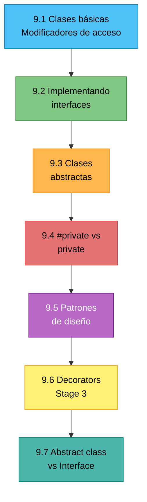
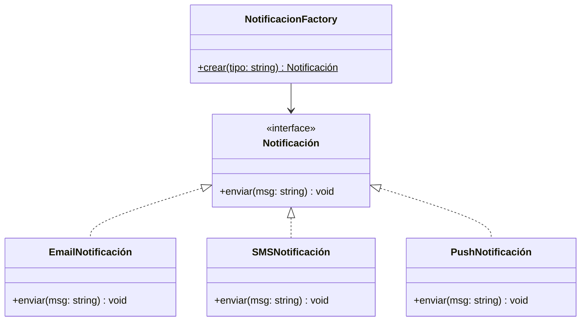

# :classical_building: Capítulo 9: Clases y OOP

<div class="chapter-meta">
  <span class="meta-item">🕐 3 horas</span>
  <span class="meta-item">📊 Nivel: Intermedio</span>
  <span class="meta-item">🎯 Semana 5</span>
</div>

<div class="chapter-objective">
  <span class="objective-icon">📌</span>
  <span class="objective-text">Al terminar este capítulo, dominarás clases en TypeScript: modificadores de acceso, propiedades readonly, clases abstractas, y cómo implementar interfaces — la OOP tipada.</span>
</div>

<div class="chapter-map">
<h4>🗺️ Mapa del capítulo</h4>



</div>

!!! quote "Contexto"
    Las clases en TypeScript son JavaScript classes con superpoderes: modificadores de acceso, propiedades abstractas, `implements` para interfaces. Si vienes de Python con sus clases y herencia, te sentirás como en casa.

---

<div class="concept-question">
<h4>🔍 Pregunta conceptual</h4>
<p>En Python, las clases usan <code>self</code> y no tienen modificadores de acceso reales (solo <code>_convención</code>). ¿Cómo crees que TypeScript implementa <code>private</code> y <code>protected</code>? ¿Son realmente privados?</p>
</div>

## 9.1 Clases básicas

```typescript
class Mesa {
  public número: number;          // Accesible desde fuera
  private _ocupada: boolean = false; // Solo dentro de la clase
  protected zona: string;          // En la clase y subclases
  readonly id: number;             // No se puede reasignar

  constructor(id: number, número: number, zona: string) {
    this.id = id;
    this.número = número;
    this.zona = zona;
  }

  // Shorthand equivalente:
  // constructor(readonly id: number, public número: number, protected zona: string) {}

  get ocupada(): boolean { return this._ocupada; }
  set ocupada(valor: boolean) { this._ocupada = valor; }
}
```

<div class="comparison" markdown>
<div class="lang-box python" markdown>

#### :snake: En Python

```python
class Mesa:
    def __init__(self, numero: int):
        self.numero = numero  # self es explícito

    def describir(self) -> str:
        return f"Mesa {self.numero}"  # self siempre presente
```

</div>
<div class="lang-box typescript" markdown>

#### 🔷 En TypeScript

```typescript
class Mesa {
  constructor(public numero: number) {} // this implícito

  describir(): string {
    return `Mesa ${this.numero}`; // this implícito
  }
}
```

</div>
</div>

<div class="comparison" markdown>
<div class="lang-box python" markdown>

#### :snake: En Python

```python
class Mesa:
    def __init__(self, id, número, zona):
        self.id = id          # Todo público
        self._ocupada = False  # "Privado" por convención
```

</div>
<div class="lang-box typescript" markdown>

#### 🔷 En TypeScript

`private`, `protected`, `public` son **enforced** por el compilador. `readonly` impide reasignación. Más estricto que Python.

</div>
</div>

<div class="misconception-box" markdown>
<h4>❌ Error común</h4>
<p><strong>Mito:</strong> "<code>private</code> en TypeScript es como <code>__nombre</code> en Python — realmente inaccesible"</p>
<p><strong>Realidad:</strong> El modificador <code>private</code> de TypeScript solo existe en compilación. El JavaScript resultante NO tiene privacidad — se puede acceder con <code>obj['_campo']</code>. Para privacidad real en runtime, usa <code>#campo</code> (ECMAScript private fields).</p>
</div>

<div class="micro-exercise">
<h4>🧪 Micro-ejercicio (3 min)</h4>
<p>Crea una clase <code>Plato</code> con <code>nombre</code> (public), <code>precio</code> (public), y <code>_coste</code> (private). Añade un método <code>margen(): number</code> que calcule <code>precio - coste</code>. Intenta acceder a <code>_coste</code> desde fuera — ¿qué error obtienes?</p>
</div>

<div class="connection-box">
<span class="connection-icon">🔗</span>
<span>Recuerda del <a href='../03-interfaces/'>Capítulo 3</a> las interfaces. Ahora puedes hacer que las clases las implementen: <code>class Plato implements IPlato</code>. La interfaz es el contrato, la clase es la implementación.</span>
</div>

<div class="concept-question">
<h4>🔍 Pregunta conceptual</h4>
<p>¿Puede una clase "prometer" que cumple una interfaz? ¿Qué pasa si olvidas implementar un método?</p>
</div>

## 9.2 Implementando interfaces

```typescript
interface Serializable {
  toJSON(): object;
}

interface Validatable {
  validate(): boolean;
  errors: string[];
}

class Reserva implements Serializable, Validatable {
  errors: string[] = [];

  constructor(
    public nombre: string,
    public mesa: number,
    public personas: number
  ) {}

  validate(): boolean {
    this.errors = [];
    if (this.personas < 1) this.errors.push("Mín 1 persona");
    if (this.personas > 12) this.errors.push("Máx 12 personas");
    return this.errors.length === 0;
  }

  toJSON() { return { nombre: this.nombre, mesa: this.mesa, personas: this.personas }; }
}
```

<div class="micro-exercise">
<h4>🧪 Micro-ejercicio (3 min)</h4>
<p>Define una interfaz <code>Imprimible</code> con método <code>toString(): string</code>. Haz que tus clases <code>Plato</code> y <code>Mesa</code> la implementen. ¿Qué pasa si olvidas el método <code>toString()</code> en alguna clase?</p>
</div>

<div class="concept-question">
<h4>🔍 Pregunta conceptual</h4>
<p>Si una interfaz define un contrato sin implementación, y una clase tiene implementación completa, ¿existe algo intermedio — un contrato con ALGO de implementación?</p>
</div>

## 9.3 Clases abstractas

```typescript
abstract class BaseService<T> {
  protected abstract endpoint: string;

  async getAll(): Promise<T[]> {
    const res = await fetch(this.endpoint);
    return res.json();
  }

  abstract validate(item: T): boolean;
}

class MesaService extends BaseService<Mesa> {
  protected endpoint = "/api/mesas";
  validate(mesa: Mesa) { return mesa.capacidad > 0; }
}
```

<div class="comparison" markdown>
<div class="lang-box python" markdown>

#### :snake: En Python

```python
from abc import ABC, abstractmethod

class Entidad(ABC):
    @abstractmethod
    def validar(self) -> bool: ...
```

</div>
<div class="lang-box typescript" markdown>

#### 🔷 En TypeScript

```typescript
abstract class Entidad {
  abstract validar(): boolean;
}
```

</div>
</div>

<div class="misconception-box">
<h4>⚠️ Errores comunes</h4>
<ul>
<li><span class="wrong">❌ Mito:</span> "<code>private</code> en TS es seguro" → <span class="right">✅ Realidad:</span> Los modificadores de acceso solo existen en compilación. El JS resultante NO tiene <code>private</code>. Para privacidad real, usa <code>#campo</code> (private fields de ES2022).</li>
<li><span class="wrong">❌ Mito:</span> "Siempre necesito clases para OOP" → <span class="right">✅ Realidad:</span> En TS, interfaces + funciones son suficientes para la mayoría de patrones. Las clases son útiles para estado mutable y herencia, pero no las uses por defecto.</li>
<li><span class="wrong">❌ Mito:</span> "Las clases abstractas son como interfaces" → <span class="right">✅ Realidad:</span> Las clases abstractas PUEDEN tener métodos implementados. Las interfaces no. Usa abstractas cuando necesites compartir implementación base.</li>
</ul>
</div>

## 9.4 `#private` de JavaScript vs `private` de TypeScript

TypeScript ofrece dos formas de privacidad:

```typescript
class Cuenta {
  private saldo: number;      // (1)!
  #pin: number;                // (2)!

  constructor(saldo: number, pin: number) {
    this.saldo = saldo;
    this.#pin = pin;
  }

  verificar(pin: number): boolean {
    return this.#pin === pin;
  }
}

const cuenta = new Cuenta(1000, 1234);
// cuenta.saldo;     // ❌ TS error (pero accesible en runtime JS)
// cuenta.#pin;      // ❌ Error real en runtime (ECMAScript private)
```

1. `private` es solo TypeScript — se verifica en compilación, pero en el JavaScript generado es accesible
2. `#` es privacidad de JavaScript nativo (ECMAScript 2022) — realmente inaccesible en runtime

!!! tip "¿Cuál usar?"
    Usa `#private` para seguridad real en runtime. Usa `private` de TypeScript cuando solo necesitas la verificación del compilador (más cómodo para testing).

<div class="pro-tip">
<h4>💡 Consejo Pro</h4>
<p>En MakeMenu, usamos clases para los servicios con estado (conexión a DB, caché) e interfaces + funciones para la lógica de dominio pura. Regla: si no necesitas <code>this</code> ni estado mutable, no uses una clase.</p>
</div>

## 9.5 Patrones de diseño con clases

### Builder Pattern

El builder construye objetos complejos paso a paso, con una API fluida (chainable):

```typescript
class ReservaBuilder {
  private reserva: Partial<Reserva> = {};

  mesa(número: number): this {
    this.reserva.mesa = número;
    return this;  // (1)!
  }

  cliente(nombre: string): this {
    this.reserva.nombre = nombre;
    return this;
  }

  personas(n: number): this {
    this.reserva.personas = n;
    return this;
  }

  hora(h: string): this {
    this.reserva.hora = h;
    return this;
  }

  build(): Reserva {
    const { nombre, mesa, personas, hora } = this.reserva;
    if (!nombre || !mesa || !personas || !hora) {
      throw new Error("Faltan campos obligatorios");
    }
    return { id: Date.now(), nombre, mesa, personas, hora } as Reserva;
  }
}

// API fluida y clara
const reserva = new ReservaBuilder()
  .mesa(5)
  .cliente("García")
  .personas(4)
  .hora("20:30")
  .build();
```

1. Retornar `this` permite encadenar métodos.

### Singleton Pattern

```typescript
class DatabaseConnection {
  private static instance: DatabaseConnection;

  private constructor(private url: string) {}  // (1)!

  static getInstance(): DatabaseConnection {
    if (!DatabaseConnection.instance) {
      DatabaseConnection.instance = new DatabaseConnection("postgres://...");
    }
    return DatabaseConnection.instance;
  }

  query(sql: string): Promise<unknown> {
    return Promise.resolve({ rows: [] });
  }
}

const db1 = DatabaseConnection.getInstance();
const db2 = DatabaseConnection.getInstance();
// db1 === db2 → true (misma instancia)
// new DatabaseConnection("url"); // ❌ Constructor is private
```

1. `private constructor` impide instanciar la clase directamente.

### Factory Pattern

```typescript
interface Notificación {
  enviar(mensaje: string): void;
}

class EmailNotificación implements Notificación {
  enviar(msg: string) { console.log(`📧 Email: ${msg}`); }
}

class SMSNotificación implements Notificación {
  enviar(msg: string) { console.log(`📱 SMS: ${msg}`); }
}

class PushNotificación implements Notificación {
  enviar(msg: string) { console.log(`🔔 Push: ${msg}`); }
}

// Factory: crea la instancia correcta según el tipo
class NotificacionFactory {
  static crear(tipo: "email" | "sms" | "push"): Notificación {
    switch (tipo) {
      case "email": return new EmailNotificación();
      case "sms":   return new SMSNotificación();
      case "push":  return new PushNotificación();
    }
  }
}

const notif = NotificacionFactory.crear("push");
notif.enviar("Tu mesa está lista");
```



<div class="pro-tip">
<h4>💡 Consejo Pro</h4>
<p>Prefiere composición sobre herencia. En vez de <code>class PlatoEspecial extends Plato</code>, crea <code>interface PlatoEspecial extends Plato { descuento: number }</code>. La herencia de clases acopla tu código; las interfaces son flexibles.</p>
</div>

## 9.6 Decorators (Stage 3)

TypeScript 5.0+ soporta los decorators del estándar ECMAScript (Stage 3). Los decorators modifican clases, métodos o propiedades:

```typescript
// Decorator de clase: logging automático
function Loggable(target: any, context: ClassDecoratorContext) {
  return class extends target {
    constructor(...args: any[]) {
      super(...args);
      console.log(`[${context.name}] instancia creada`);
    }
  };
}

// Decorator de método: medir tiempo de ejecución
function Timed<T extends (...args: any[]) => any>(
  target: T,
  context: ClassMethodDecoratorContext
) {
  return function (this: any, ...args: Parameters<T>): ReturnType<T> {
    const start = performance.now();
    const result = target.call(this, ...args);
    const ms = (performance.now() - start).toFixed(2);
    console.log(`[${String(context.name)}] ${ms}ms`);
    return result;
  } as T;
}

@Loggable
class MesaService {
  @Timed
  calcularOcupación(mesas: Mesa[]): number {
    return mesas.filter(m => m.ocupada).length / mesas.length;
  }
}
```

!!! warning "Decorators experimentales vs Stage 3"
    TypeScript tiene dos sistemas de decorators:

    - `experimentalDecorators: true` — versión antigua, usada por Angular, NestJS
    - Sin flag — Stage 3, estándar ECMAScript, recomendada para proyectos nuevos

    Son **incompatibles entre sí**. Para proyectos nuevos, usa Stage 3.

## 9.7 Abstract classes vs Interfaces — ¿cuándo usar cada uno?

| Criterio | `abstract class` | `interface` |
|:---|:---|:---|
| Implementación parcial | Sí (métodos con código) | No (solo contratos) |
| Herencia múltiple | No (solo 1 extends) | Sí (múltiples implements) |
| Código en runtime | Sí | No (se elimina) |
| Constructor | Sí | No |
| Estado interno | Sí (propiedades con valores) | No |

!!! tip "Regla práctica"
    - Usa `interface` cuando solo necesitas un **contrato** (forma de datos, API pública)
    - Usa `abstract class` cuando necesitas **código compartido** (métodos base, estado) entre clases hijas

---

<div class="code-evolution">
<h4>📈 Evolución de código: modelando una entidad</h4>

<div class="evolution-step" markdown>
<span class="step-label">v1 Novato — objeto plano sin encapsulación</span>

```typescript
// ❌ Sin clase: sin encapsulación, sin validación, sin contrato
const plato = {
  nombre: "Pasta Carbonara",
  precio: 14.50,
  coste: 4.20,
  disponible: true,
};

// Cualquiera puede modificar cualquier campo
plato.precio = -5; // 💀 Precio negativo, nadie lo impide
plato.coste = 999; // 💀 Coste accesible y modificable
```

</div>

<div class="evolution-step" markdown>
<span class="step-label">v2 Con clase — constructor y propiedades básicas</span>

```typescript
// ✅ Mejor: clase con constructor y tipos
class Plato {
  nombre: string;
  precio: number;
  coste: number;
  disponible: boolean;

  constructor(nombre: string, precio: number, coste: number) {
    this.nombre = nombre;
    this.precio = precio;
    this.coste = coste;
    this.disponible = true;
  }

  margen(): number {
    return this.precio - this.coste;
  }
}
```

</div>

<div class="evolution-step" markdown>
<span class="step-label">v3 Profesional — private fields, readonly, implements, factory method</span>

```typescript
// ✅✅ Profesional: encapsulación real, contrato, factory
interface IPlato {
  readonly nombre: string;
  readonly precio: number;
  readonly disponible: boolean;
  margen(): number;
  toString(): string;
}

class Plato implements IPlato {
  readonly nombre: string;
  readonly precio: number;
  #coste: number;              // Privacidad real en runtime
  disponible: boolean = true;

  private constructor(nombre: string, precio: number, coste: number) {
    this.nombre = nombre;
    this.precio = precio;
    this.#coste = coste;
  }

  margen(): number {
    return this.precio - this.#coste;
  }

  toString(): string {
    return `${this.nombre} — ${this.precio}€ (margen: ${this.margen().toFixed(2)}€)`;
  }

  // Factory method con validación
  static crear(nombre: string, precio: number, coste: number): Plato {
    if (precio <= 0) throw new Error("Precio debe ser positivo");
    if (coste < 0) throw new Error("Coste no puede ser negativo");
    if (coste >= precio) throw new Error("Coste debe ser menor que precio");
    return new Plato(nombre, precio, coste);
  }
}

const pasta = Plato.crear("Pasta Carbonara", 14.50, 4.20); // ✅
// const mal = Plato.crear("Error", -5, 3); // ❌ Lanza Error
```

</div>
</div>

<div class="connection-box">
<span class="connection-icon">🔗</span>
<span>En el <a href='../10-modulos/'>Capítulo 10</a> aprenderás a organizar estas clases e interfaces en módulos. En MakeMenu, cada entidad tiene su propio módulo.</span>
</div>

---

<div class="ejercicio-guiado">
<h4>🏋️ Ejercicio guiado</h4>

Vas a construir un sistema de pedidos para MakeMenu usando clases con modificadores de acceso, una interfaz, una clase abstracta y el patrón Builder.

1. Define una interfaz `ILineaPedido` con las propiedades `plato` (string), `precio` (number) y `cantidad` (number). Define también una interfaz `IPedido` con `readonly id` (number), `mesa` (number), `lineas` (ILineaPedido[]) y un método `total(): number`.
2. Crea una clase abstracta `PedidoBase` que implemente parcialmente `IPedido`. Declara `readonly id` y `mesa` en el constructor (usa shorthand). Marca el método `total()` como abstracto. Implementa un método concreto `resumen(): string` que devuelva `"Pedido #id — Mesa mesa"`.
3. Crea una clase `Pedido` que extienda `PedidoBase`. Añade una propiedad `private _lineas: ILineaPedido[]` inicializada como array vacío. Implementa `total()` sumando `precio * cantidad` de cada línea. Añade un getter público `lineas` que devuelva una copia del array con spread.
4. Crea una clase `PedidoBuilder` con métodos encadenables: `enMesa(mesa: number)`, `agregarLinea(plato: string, precio: number, cantidad: number)` y `build(): Pedido`. El builder debe almacenar los datos en propiedades privadas y validar en `build()` que la mesa y al menos una línea existan.
5. Usa el builder para crear un pedido en la mesa 5 con dos líneas (por ejemplo, "Paella" a 16 euros y "Flan" a 5 euros). Imprime el resumen y el total.

??? success "Solución completa"
    ```typescript
    // Paso 1: Interfaces
    interface ILineaPedido {
      plato: string;
      precio: number;
      cantidad: number;
    }

    interface IPedido {
      readonly id: number;
      mesa: number;
      lineas: ILineaPedido[];
      total(): number;
    }

    // Paso 2: Clase abstracta
    abstract class PedidoBase implements IPedido {
      abstract lineas: ILineaPedido[];
      abstract total(): number;

      constructor(
        readonly id: number,
        public mesa: number
      ) {}

      resumen(): string {
        return `Pedido #${this.id} — Mesa ${this.mesa}`;
      }
    }

    // Paso 3: Clase concreta
    class Pedido extends PedidoBase {
      private _lineas: ILineaPedido[] = [];

      constructor(id: number, mesa: number, lineas: ILineaPedido[]) {
        super(id, mesa);
        this._lineas = lineas;
      }

      get lineas(): ILineaPedido[] {
        return [...this._lineas];
      }

      total(): number {
        return this._lineas.reduce(
          (sum, linea) => sum + linea.precio * linea.cantidad,
          0
        );
      }
    }

    // Paso 4: Builder
    class PedidoBuilder {
      private _mesa: number | null = null;
      private _lineas: ILineaPedido[] = [];
      private static nextId = 1;

      enMesa(mesa: number): this {
        this._mesa = mesa;
        return this;
      }

      agregarLinea(plato: string, precio: number, cantidad: number = 1): this {
        this._lineas.push({ plato, precio, cantidad });
        return this;
      }

      build(): Pedido {
        if (this._mesa === null) {
          throw new Error("Debes asignar una mesa con enMesa()");
        }
        if (this._lineas.length === 0) {
          throw new Error("El pedido debe tener al menos una línea");
        }
        return new Pedido(PedidoBuilder.nextId++, this._mesa, this._lineas);
      }
    }

    // Paso 5: Uso
    const pedido = new PedidoBuilder()
      .enMesa(5)
      .agregarLinea("Paella Valenciana", 16, 2)
      .agregarLinea("Flan casero", 5, 1)
      .build();

    console.log(pedido.resumen());  // "Pedido #1 — Mesa 5"
    console.log(`Total: ${pedido.total()}€`);  // "Total: 37€"
    console.log(pedido.lineas);  // [{ plato: "Paella...", ... }, { plato: "Flan...", ... }]
    ```

</div>

<div class="real-errors">
<h4>🚨 Errores reales del compilador</h4>

Estos son errores que encontrarás en tu día a día trabajando con clases en TypeScript. Aprende a leerlos para corregirlos rápido.

**Error 1 — Propiedad no inicializada en el constructor**

```typescript
class Producto {
  nombre: string;
  precio: number;
//^^^^^^ Error: Property 'precio' has no initializer
//       and is not definitely assigned in the constructor. (TS2564)

  constructor(nombre: string) {
    this.nombre = nombre;
    // Olvidamos asignar this.precio
  }
}
```

> **Causa:** Con `strictPropertyInitialization` activado (recomendado), TypeScript exige que toda propiedad declarada se inicialice en el constructor o tenga un valor por defecto.
> **Solución:** Asigna la propiedad en el constructor, dale un valor por defecto (`precio: number = 0`), o usa el operador `!` si sabes que se asignará después (`precio!: number`).

**Error 2 — Clase no implementa correctamente una interfaz**

```typescript
interface Calculable {
  calcularTotal(): number;
  moneda: string;
}

class Pedido implements Calculable {
//    ^^^^^^ Error: Class 'Pedido' incorrectly implements interface 'Calculable'.
//           Property 'moneda' is missing in type 'Pedido'
//           but required in type 'Calculable'. (TS2420)

  calcularTotal(): number {
    return 42;
  }
  // Falta la propiedad 'moneda'
}
```

> **Causa:** Cuando usas `implements`, la clase DEBE tener todas las propiedades y métodos que la interfaz define. Si falta alguno, TypeScript no compila.
> **Solución:** Agrega la propiedad faltante: `moneda: string = "EUR";`

**Error 3 — Acceso a miembro privado fuera de la clase**

```typescript
class CuentaBancaria {
  private saldo: number = 0;

  depositar(cantidad: number): void {
    this.saldo += cantidad;
  }
}

const cuenta = new CuentaBancaria();
cuenta.depositar(100);
console.log(cuenta.saldo);
//                 ^^^^^ Error: Property 'saldo' is private and only
//                       accessible within class 'CuentaBancaria'. (TS2341)
```

> **Causa:** Las propiedades marcadas como `private` solo se pueden leer y escribir dentro de la propia clase. Acceder desde fuera es un error de compilación.
> **Solución:** Crea un getter público: `get saldoActual(): number { return this.saldo; }`

**Error 4 — `super()` debe llamarse antes de usar `this` en subclases**

```typescript
class Animal {
  constructor(public nombre: string) {}
}

class Perro extends Animal {
  raza: string;

  constructor(nombre: string, raza: string) {
    this.raza = raza;
//  ^^^^ Error: 'super' must be called before accessing 'this'
//       in the constructor of a derived class. (TS17009)
    super(nombre);
  }
}
```

> **Causa:** En una clase hija, JavaScript necesita que el constructor padre (`super()`) se ejecute primero para inicializar `this`. Si intentas usar `this` antes de `super()`, TypeScript lo bloquea.
> **Solución:** Mueve `super(nombre)` a la primera línea del constructor, antes de cualquier uso de `this`.

**Error 5 — No se puede instanciar una clase abstracta**

```typescript
abstract class Forma {
  abstract area(): number;
  descripción(): string {
    return `Forma con área ${this.area()}`;
  }
}

const f = new Forma();
//        ^^^^^^^^^^ Error: Cannot create an instance
//        of an abstract class. (TS2511)
```

> **Causa:** Las clases abstractas son plantillas para otras clases. No se pueden instanciar directamente porque pueden tener métodos sin implementar.
> **Solución:** Crea una clase concreta que extienda la abstracta: `class Circulo extends Forma { area() { return Math.PI * this.radio ** 2; } }`

</div>

---

<div class="checkpoint">
<h4>🏁 Checkpoint</h4>
<p>Si puedes: (1) crear clases con modificadores de acceso, (2) usar clases abstractas como base, y (3) implementar interfaces en clases — dominas la OOP en TypeScript.</p>
</div>

<div class="mini-project">
<h4>🛠️ Mini-proyecto: Sistema de gestión de empleados de restaurante</h4>

Aplica todo lo aprendido en este capítulo para construir un mini-sistema de gestión de empleados usando clases, interfaces, herencia y patrones de diseño.

**Paso 1 — Define la interfaz base y la clase abstracta**

Crea una interfaz `IEmpleado` con las propiedades esenciales y una clase abstracta `EmpleadoBase` que la implemente parcialmente.

??? success "Solución Paso 1"
    ```typescript
    interface IEmpleado {
      readonly id: number;
      readonly nombre: string;
      puesto: string;
      readonly fechaAlta: Date;
      salarioMensual(): number;
      toString(): string;
    }

    abstract class EmpleadoBase implements IEmpleado {
      readonly fechaAlta: Date = new Date();

      constructor(
        readonly id: number,
        readonly nombre: string,
        public puesto: string,
        protected salarioBase: number
      ) {}

      // Cada tipo de empleado calcula su salario diferente
      abstract salarioMensual(): number;

      // Método compartido por todas las subclases
      antiguedad(): number {
        const ahora = new Date();
        return ahora.getFullYear() - this.fechaAlta.getFullYear();
      }

      toString(): string {
        return `[${this.puesto}] ${this.nombre} — ${this.salarioMensual().toFixed(2)}€/mes`;
      }
    }
    ```

**Paso 2 — Crea las subclases concretas**

Implementa `Camarero` (salario base + propinas) y `Chef` (salario base + bonus por especialidad). Usa `#propinas` con privacidad real de ECMAScript.

??? success "Solución Paso 2"
    ```typescript
    class Camarero extends EmpleadoBase {
      #propinasAcumuladas: number = 0;

      constructor(id: number, nombre: string, salarioBase: number) {
        super(id, nombre, "Camarero", salarioBase);
      }

      registrarPropina(cantidad: number): void {
        if (cantidad < 0) throw new Error("La propina no puede ser negativa");
        this.#propinasAcumuladas += cantidad;
      }

      salarioMensual(): number {
        return this.salarioBase + this.#propinasAcumuladas;
      }

      resetPropinas(): void {
        this.#propinasAcumuladas = 0;
      }
    }

    class Chef extends EmpleadoBase {
      private static readonly BONUS_ESPECIALIDAD: Record<string, number> = {
        "cocina italiana": 300,
        "cocina japonesa": 400,
        "pastelería": 250,
        "general": 0,
      };

      constructor(
        id: number,
        nombre: string,
        salarioBase: number,
        private especialidad: string = "general"
      ) {
        super(id, nombre, "Chef", salarioBase);
      }

      salarioMensual(): number {
        const bonus = Chef.BONUS_ESPECIALIDAD[this.especialidad] ?? 0;
        return this.salarioBase + bonus;
      }
    }
    ```

**Paso 3 — Implementa una Factory y un registro Singleton**

Crea `EmpleadoFactory` para instanciar empleados y `RegistroEmpleados` como Singleton para almacenar y consultar la plantilla.

??? success "Solución Paso 3"
    ```typescript
    // Factory: crea el empleado correcto según el tipo
    type TipoEmpleado = "camarero" | "chef";

    class EmpleadoFactory {
      private static nextId = 1;

      static crear(
        tipo: TipoEmpleado,
        nombre: string,
        salarioBase: number,
        extra?: string // especialidad para Chef
      ): EmpleadoBase {
        const id = EmpleadoFactory.nextId++;
        switch (tipo) {
          case "camarero":
            return new Camarero(id, nombre, salarioBase);
          case "chef":
            return new Chef(id, nombre, salarioBase, extra);
        }
      }
    }

    // Singleton: registro único de todos los empleados
    class RegistroEmpleados {
      private static instance: RegistroEmpleados;
      private empleados: Map<number, EmpleadoBase> = new Map();

      private constructor() {}

      static getInstance(): RegistroEmpleados {
        if (!RegistroEmpleados.instance) {
          RegistroEmpleados.instance = new RegistroEmpleados();
        }
        return RegistroEmpleados.instance;
      }

      agregar(empleado: EmpleadoBase): void {
        this.empleados.set(empleado.id, empleado);
      }

      buscarPorId(id: number): EmpleadoBase | undefined {
        return this.empleados.get(id);
      }

      listarPorPuesto(puesto: string): EmpleadoBase[] {
        return [...this.empleados.values()].filter(e => e.puesto === puesto);
      }

      get totalEmpleados(): number {
        return this.empleados.size;
      }

      costeMensualTotal(): number {
        return [...this.empleados.values()]
          .reduce((sum, e) => sum + e.salarioMensual(), 0);
      }
    }
    ```

**Paso 4 — Ponlo todo junto**

Usa la factory para crear empleados, regístralos en el singleton, y calcula estadísticas.

??? success "Solución Paso 4"
    ```typescript
    // Crear empleados con la factory
    const ana = EmpleadoFactory.crear("camarero", "Ana López", 1400);
    const marco = EmpleadoFactory.crear("chef", "Marco Rossi", 2200, "cocina italiana");
    const lucia = EmpleadoFactory.crear("camarero", "Lucía García", 1400);
    const yuki = EmpleadoFactory.crear("chef", "Yuki Tanaka", 2500, "cocina japonesa");

    // Registrar propinas a los camareros
    if (ana instanceof Camarero) {
      ana.registrarPropina(85);
      ana.registrarPropina(120);
    }
    if (lucia instanceof Camarero) {
      lucia.registrarPropina(95);
    }

    // Registrar en el singleton
    const registro = RegistroEmpleados.getInstance();
    registro.agregar(ana);
    registro.agregar(marco);
    registro.agregar(lucia);
    registro.agregar(yuki);

    // Consultas
    console.log(`Total empleados: ${registro.totalEmpleados}`);
    // → Total empleados: 4

    console.log(`Coste mensual: ${registro.costeMensualTotal().toFixed(2)}€`);
    // → Coste mensual: 8195.00€

    console.log("Chefs:");
    registro.listarPorPuesto("Chef").forEach(e => console.log(`  ${e.toString()}`));
    // → [Chef] Marco Rossi — 2500.00€/mes
    // → [Chef] Yuki Tanaka — 2900.00€/mes

    console.log("Camareros:");
    registro.listarPorPuesto("Camarero").forEach(e => console.log(`  ${e.toString()}`));
    // → [Camarero] Ana López — 1605.00€/mes
    // → [Camarero] Lucía García — 1495.00€/mes
    ```

</div>

## :link: Recursos

| Recurso | Enlace |
|---------|--------|
| Classes | [typescriptlang.org/.../classes](https://www.typescriptlang.org/docs/handbook/2/classes.html) |
| Decorators | [typescriptlang.org/.../decorators](https://www.typescriptlang.org/docs/handbook/decorators.html) |
| Design Patterns in TypeScript | [refactoring.guru/design-patterns/typescript](https://refactoring.guru/design-patterns/typescript) |

---

## 🎯 Ejercicios

??? question "Ejercicio 1: BaseModel abstracta"
    Crea una clase abstracta `BaseModel` con `id`, `createdAt`, y un método abstracto `validate()`. Extiéndela con `MesaModel`.

    ??? success "Solución"
        ```typescript
        abstract class BaseModel {
          constructor(
            public readonly id: number,
            public readonly createdAt: Date = new Date()
          ) {}

          abstract validate(): boolean;

          get age(): number {
            return Date.now() - this.createdAt.getTime();
          }
        }

        class MesaModel extends BaseModel {
          constructor(
            id: number,
            public número: number,
            public zona: string,
            public capacidad: number
          ) {
            super(id);
          }

          validate(): boolean {
            return this.capacidad > 0 && this.número > 0;
          }
        }
        ```

??? question "Ejercicio 2: Builder para MenuItem"
    Implementa un builder para `MenuItem` con propiedades: `nombre`, `precio`, `categoria`, `alergenos[]`, `disponible`. Debe tener validación en `build()`.

    !!! tip "Pista"
        Usa `Partial<MenuItem>` internamente. Valida que nombre, precio y categoria no sean undefined antes de construir.

    ??? success "Solución"
        ```typescript
        interface MenuItem {
          nombre: string;
          precio: number;
          categoria: "entrante" | "principal" | "postre" | "bebida";
          alergenos: string[];
          disponible: boolean;
        }

        class MenuItemBuilder {
          private item: Partial<MenuItem> = { alergenos: [], disponible: true };

          nombre(n: string): this { this.item.nombre = n; return this; }
          precio(p: number): this { this.item.precio = p; return this; }
          categoria(c: MenuItem["categoria"]): this { this.item.categoria = c; return this; }
          alergeno(a: string): this { this.item.alergenos!.push(a); return this; }
          noDisponible(): this { this.item.disponible = false; return this; }

          build(): MenuItem {
            const { nombre, precio, categoria } = this.item;
            if (!nombre || precio === undefined || !categoria) {
              throw new Error("Faltan campos obligatorios");
            }
            return this.item as MenuItem;
          }
        }

        const plato = new MenuItemBuilder()
          .nombre("Pasta Carbonara")
          .precio(14.50)
          .categoria("principal")
          .alergeno("gluten")
          .alergeno("lactosa")
          .build();
        ```

??? question "Ejercicio 3: Singleton para ConfigManager"
    Crea un singleton `ConfigManager` con métodos `get(key)` y `set(key, value)` que maneje la configuración de la app con tipos seguros.

    !!! tip "Pista"
        Usa un `Map<string, unknown>` interno y generic methods para `get<T>(key): T | undefined`.

    ??? success "Solución"
        ```typescript
        class ConfigManager {
          private static instance: ConfigManager;
          private config = new Map<string, unknown>();

          private constructor() {}

          static getInstance(): ConfigManager {
            if (!ConfigManager.instance) {
              ConfigManager.instance = new ConfigManager();
            }
            return ConfigManager.instance;
          }

          set<T>(key: string, value: T): void {
            this.config.set(key, value);
          }

          get<T>(key: string): T | undefined {
            return this.config.get(key) as T | undefined;
          }
        }

        const config = ConfigManager.getInstance();
        config.set("maxMesas", 50);
        config.set("apiUrl", "https://api.makemenu.dev");

        const max = config.get<number>("maxMesas"); // number | undefined
        ```

??? question "Ejercicio 4: Factory de servicios"
    Crea una factory que retorne el servicio correcto (MesaService, ReservaService, PedidoService) según un string de recurso.

    !!! tip "Pista"
        Define una interface `Service` común y un `switch` en la factory.

    ??? success "Solución"
        ```typescript
        interface Service {
          getAll(): Promise<unknown[]>;
          getById(id: number): Promise<unknown>;
        }

        class MesaService implements Service {
          async getAll() { return []; }
          async getById(id: number) { return null; }
        }

        class ReservaService implements Service {
          async getAll() { return []; }
          async getById(id: number) { return null; }
        }

        type Recurso = "mesas" | "reservas";

        function crearServicio(recurso: Recurso): Service {
          switch (recurso) {
            case "mesas": return new MesaService();
            case "reservas": return new ReservaService();
          }
        }
        ```

??? question "Ejercicio 5: Implementar Serializable + Comparable"
    Crea una clase `Pedido` que implemente dos interfaces: `Serializable` (con `toJSON()`) y `Comparable<Pedido>` (con `compareTo(other): number`). Compara por total del pedido.

    !!! tip "Pista"
        `Comparable<T>` tiene un método `compareTo(other: T): number` que retorna negativo, 0 o positivo.

    ??? success "Solución"
        ```typescript
        interface Serializable { toJSON(): object; }
        interface Comparable<T> { compareTo(other: T): number; }

        class Pedido implements Serializable, Comparable<Pedido> {
          constructor(
            public mesa: number,
            public items: { nombre: string; precio: number }[]
          ) {}

          get total(): number {
            return this.items.reduce((sum, i) => sum + i.precio, 0);
          }

          toJSON() {
            return { mesa: this.mesa, items: this.items, total: this.total };
          }

          compareTo(other: Pedido): number {
            return this.total - other.total;
          }
        }

        const pedidos = [
          new Pedido(1, [{ nombre: "Pasta", precio: 12 }]),
          new Pedido(2, [{ nombre: "Steak", precio: 25 }, { nombre: "Vino", precio: 8 }]),
        ];
        pedidos.sort((a, b) => a.compareTo(b)); // Ordena por total
        ```

---

## :brain: Flashcards de repaso

<div class="flashcard">
<div class="front">¿Diferencia entre <code>private</code> y <code>#private</code>?</div>
<div class="back"><code>private</code> es solo TypeScript (compilación). <code>#</code> es ECMAScript nativo (runtime real). <code>#</code> es verdaderamente inaccesible.</div>
</div>

<div class="flashcard">
<div class="front">¿Qué es el Builder pattern?</div>
<div class="back">Patrón que construye objetos complejos paso a paso con una API fluida (métodos encadenables que retornan <code>this</code>). Útil cuando un constructor tiene muchos parámetros.</div>
</div>

<div class="flashcard">
<div class="front">¿Cómo funciona el Singleton en TypeScript?</div>
<div class="back"><code>private constructor</code> impide instanciar directamente. Un método estático <code>getInstance()</code> crea y cachea una única instancia.</div>
</div>

<div class="flashcard">
<div class="front">¿Cuándo usar abstract class vs interface?</div>
<div class="back"><code>abstract class</code>: cuando necesitas código compartido (métodos base, estado). <code>interface</code>: cuando solo necesitas un contrato (sin implementación).</div>
</div>

<div class="flashcard">
<div class="front">¿Qué son los decorators Stage 3?</div>
<div class="back">Funciones que modifican clases, métodos o propiedades en tiempo de definición. Estándar ECMAScript (sin flag <code>experimentalDecorators</code>). Disponibles desde TypeScript 5.0.</div>
</div>

---

## :video_game: Quiz interactivo

<div class="quiz" data-quiz-id="ch09-q1">
<h4>Pregunta 1: ¿Cuál es la diferencia entre <code>private</code> y <code>#campo</code> en TypeScript?</h4>
<button class="quiz-option" data-correct="false">Son exactamente iguales</button>
<button class="quiz-option" data-correct="true"><code>private</code> es solo en compilación (accesible en runtime). <code>#campo</code> es privado real en runtime (ECMAScript)</button>
<button class="quiz-option" data-correct="false"><code>#campo</code> solo funciona con decorators</button>
<button class="quiz-option" data-correct="false"><code>private</code> impide acceso en runtime</button>
<div class="quiz-feedback" data-correct="¡Correcto! `private` es borrado por el compilador — en runtime se puede acceder con `obj['_campo']`. `#campo` usa la privacidad nativa de ECMAScript y es realmente inaccesible desde fuera." data-incorrect="Incorrecto. `private` es una restricción solo del compilador. `#campo` (ECMAScript private fields) es privacidad real en runtime."></div>
</div>

<div class="quiz" data-quiz-id="ch09-q2">
<h4>Pregunta 2: ¿Cuándo usar <code>abstract class</code> en vez de <code>interface</code>?</h4>
<button class="quiz-option" data-correct="false">Siempre — son mejores que interfaces</button>
<button class="quiz-option" data-correct="false">Solo para componentes Vue</button>
<button class="quiz-option" data-correct="true">Cuando necesitas compartir implementación (código base) además de definir un contrato</button>
<button class="quiz-option" data-correct="false">Cuando quieres múltiples instancias</button>
<div class="quiz-feedback" data-correct="¡Correcto! `abstract class` permite código compartido (métodos implementados) + métodos abstractos (contrato). Las interfaces solo definen contratos sin implementación." data-incorrect="Incorrecto. Usa `abstract class` cuando necesitas compartir implementación entre subclases, no solo un contrato. Para contratos puros, usa interfaces."></div>
</div>

---

## :bug: Ejercicio de depuración

Encuentra los **3 errores** en este código:

```typescript
// ❌ Este código tiene 3 errores. ¡Encuéntralos!

class Mesa {
  número: number;
  private _ocupada: boolean = false;
  readonly id: number;

  constructor(id: number, número: number) {
    this.número = número;
    // 🤔 ¿Falta algo en el constructor?
  }

  get ocupada(): boolean {
    return this._ocupada;
  }

  set ocupada(valor: boolean): boolean {  // 🤔 ¿Tipo de retorno correcto?
    this._ocupada = valor;
  }
}

class MesaVIP extends Mesa {
  private suplemento: number;

  constructor(id: number, número: number, suplemento: number) {
    this.suplemento = suplemento;  // 🤔 ¿Orden correcto?
    super(id, número);
  }
}
```

??? success "Solución"
    ```typescript
    // ✅ Código corregido

    class Mesa {
      número: number;
      private _ocupada: boolean = false;
      readonly id: number;

      constructor(id: number, número: number) {
        this.id = id;            // ✅ Fix 1: hay que asignar this.id en el constructor
        this.número = número;
      }

      get ocupada(): boolean {
        return this._ocupada;
      }

      set ocupada(valor: boolean) {  // ✅ Fix 2: los setters NO tienen tipo de retorno
        this._ocupada = valor;
      }
    }

    class MesaVIP extends Mesa {
      private suplemento: number;

      constructor(id: number, número: number, suplemento: number) {
        super(id, número);          // ✅ Fix 3: super() debe ir ANTES de usar this
        this.suplemento = suplemento;
      }
    }
    ```

---

## ✅ Autoevaluación del capítulo

<div class="self-check" markdown>
<h4>📋 Verifica tu comprensión</h4>
<label><input type="checkbox"> Entiendo los modificadores <code>public</code>, <code>private</code>, <code>protected</code> y <code>readonly</code></label>
<label><input type="checkbox"> Sé la diferencia entre <code>private</code> y <code>#campo</code> (runtime vs compilación)</label>
<label><input type="checkbox"> Puedo crear clases abstractas con métodos abstractos</label>
<label><input type="checkbox"> Entiendo el patrón Singleton en TypeScript</label>
<label><input type="checkbox"> He completado todos los ejercicios del capítulo</label>
</div>
