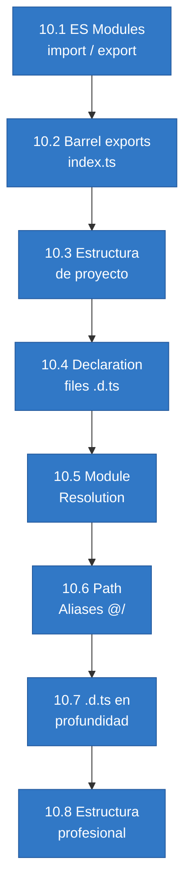
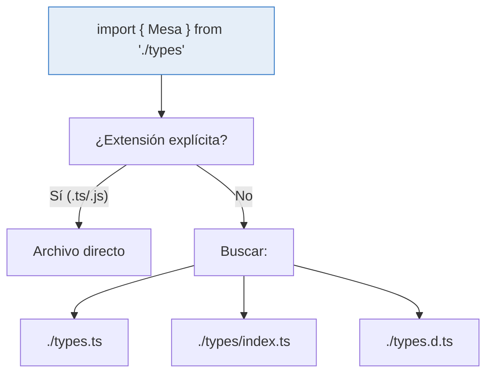

# :file_folder: Capítulo 10: Módulos y organización del código

<div class="chapter-meta">
  <span class="meta-item">🕐 2-3 horas</span>
  <span class="meta-item">📊 Nivel: Intermedio</span>
  <span class="meta-item">🎯 Semana 5</span>
</div>

<div class="chapter-objective">
  <span class="objective-icon">📌</span>
  <span class="objective-text">Al terminar este capítulo, sabrás organizar código TypeScript en módulos (import/export), entenderás resolución de módulos, barrel exports, y la estructura de un proyecto real.</span>
</div>

<div class="chapter-map">
<h4>🗺️ Mapa del capítulo</h4>



</div>

!!! quote "Contexto"
    Un proyecto real como MakeMenu necesita estructura. Los módulos de TypeScript son el equivalente a los imports de Python, pero con **tipos exportados e importados**.

---

<div class="concept-question">
<strong>🤔 Pregunta para reflexionar:</strong> En Python usas <code>import</code> y <code>from x import y</code>. ¿Cómo funciona el sistema de módulos en TypeScript? ¿Es más parecido a Python o a JavaScript vanilla?
</div>

## 10.1 ES Modules

```typescript title="src/types/mesa.ts"
export interface Mesa {
  id: number;
  número: number;
  zona: Zona;
  capacidad: number;
}

export type Zona = "interior" | "terraza" | "barra";
```

```typescript title="src/services/mesa.service.ts"
import { Mesa, Zona } from "../types/mesa";
import type { ApiResponse } from "../types/api"; // (1)!

export class MesaService {
  async getAll(): Promise<ApiResponse<Mesa[]>> { /* ... */ }
}
```

1. `import type` se elimina completamente en compilación. Úsalo cuando solo necesitas el tipo.

<div class="misconception-box" markdown>
<h4>❌ Error común</h4>
<p><strong>Mito:</strong> "El import/export de TypeScript funciona igual que en Python"</p>
<p><strong>Realidad:</strong> TypeScript tiene named exports, default exports, <code>import type</code> (solo tipos, eliminado en compilación), re-exports en barrel files, y resolución de módulos configurable. Es mucho más granular que el sistema de <code>import</code> de Python.</p>
</div>

<div class="misconception-box">
<h4>⚠️ Errores comunes</h4>
<ul>
<li><span class="wrong">❌ Mito:</span> "<code>require</code> y <code>import</code> son iguales" → <span class="right">✅ Realidad:</span> <code>require</code> es CommonJS (Node.js legacy), <code>import</code> es ESModules (estándar). En TS moderno, SIEMPRE usa <code>import/export</code>.</li>
<li><span class="wrong">❌ Mito:</span> "Los namespaces son la forma correcta de organizar código" → <span class="right">✅ Realidad:</span> Los namespaces son legacy. Los módulos ES son el estándar. Nunca uses <code>namespace</code> en código nuevo.</li>
<li><span class="wrong">❌ Mito:</span> "Puedo importar tipos y valores de la misma forma" → <span class="right">✅ Realidad:</span> Usa <code>import type { Plato }</code> para importar SOLO tipos. Esto ayuda al bundler a eliminar código muerto.</li>
</ul>
</div>

<div class="micro-exercise">
<strong>✏️ Micro-ejercicio:</strong> Crea dos archivos: <code>models/plato.ts</code> (export interface Plato) y <code>services/menu.ts</code> (import Plato, export function crearPlato). Verifica que la importación funciona.
</div>

<div class="connection-box">
<strong>🔗 Conexión ←</strong> En el <a href='../09-clases/'>Capítulo 9</a> creaste clases y interfaces. Ahora puedes exportarlas como módulos reutilizables: <code>export class PlatoService</code> y <code>export interface Plato</code>.
</div>

<div class="concept-question">
<strong>🤔 Pregunta para reflexionar:</strong> Si tu proyecto tiene 50 archivos de tipos, ¿importarías desde cada archivo individual, o hay una forma de crear un "índice" centralizado?
</div>

## 10.2 Barrel exports

```typescript title="src/types/index.ts"
export { Mesa, Zona } from "./mesa";
export { Reserva, ReservaVIP } from "./reserva";
export { MenuItem } from "./menu";
export type { ApiResponse, PaginatedResponse } from "./api";
```

```typescript title="src/components/MesaCard.vue"
// Uso limpio desde cualquier parte
import { Mesa, Reserva, MenuItem } from "@/types";
```

<div class="micro-exercise">
<strong>✏️ Micro-ejercicio:</strong> Crea un <code>models/index.ts</code> que re-exporte <code>Plato</code>, <code>Mesa</code> y <code>Pedido</code> desde sus archivos individuales. Luego importa todo desde un solo lugar: <code>import { Plato, Mesa } from './models'</code>.
</div>

<div class="comparison" markdown>
<div class="lang-box python" markdown>

#### :snake: En Python

```python
# paquete/__init__.py — re-exporta lo público
from .mesa import Mesa
from .pedido import Pedido
from .plato import Plato

# Uso: from paquete import Mesa, Pedido
```

</div>
<div class="lang-box typescript" markdown>

#### 🔷 En TypeScript

```typescript
// models/index.ts — barrel export
export { Mesa } from "./mesa";
export { Pedido } from "./pedido";
export { Plato } from "./plato";

// Uso: import { Mesa, Pedido } from "./models";
```

</div>
</div>

## 10.3 Estructura de MakeMenu

```
src/
├── types/           # Interfaces y type aliases
│   ├── mesa.ts
│   ├── reserva.ts
│   ├── api.ts
│   └── index.ts     ← barrel export
├── services/         # Lógica de negocio y API calls
│   ├── mesa.service.ts
│   └── reserva.service.ts
├── composables/      # Vue composables (hooks)
│   ├── useMesas.ts
│   └── useReservas.ts
├── components/       # Componentes Vue
├── stores/           # Pinia stores
├── utils/            # Helpers y utilidades
└── constants/        # Constantes y configs
```

<div class="pro-tip">
<strong>💡 Pro tip:</strong> En MakeMenu, la estructura de carpetas sigue el patrón de "feature modules": <code>src/platos/</code>, <code>src/mesas/</code>, <code>src/pedidos/</code>. Cada carpeta tiene su <code>index.ts</code> (barrel), sus tipos, servicios y tests. Esto escala mucho mejor que <code>src/types/</code>, <code>src/services/</code>, <code>src/controllers/</code>.
</div>

<div class="pro-tip">
<strong>💡 Pro tip:</strong> Siempre usa <code>import type</code> cuando importas solo tipos: <code>import type { Plato } from './models'</code>. Esto elimina el import del JS final y reduce el bundle size.
</div>

## 10.4 Declaration files (`.d.ts`)

Los archivos `.d.ts` son como **stubs de Python** (`.pyi`): describen tipos sin implementación.

```typescript title="custom.d.ts"
declare module "mi-libreria-sin-tipos" {
  export function hacerAlgo(x: string): number;
  export interface Resultado {
    value: number;
    label: string;
  }
}
```

<div class="concept-question">
<strong>🤔 Pregunta para reflexionar:</strong> Cuando escribes <code>import { Plato } from './types'</code>, ¿cómo sabe TypeScript dónde buscar el archivo? ¿Busca <code>.ts</code>, <code>.js</code>, <code>/index.ts</code>...?
</div>

## 10.5 Module Resolution — cómo TS encuentra módulos

TypeScript tiene varios algoritmos para resolver imports. La elección depende de tu entorno:

```json title="tsconfig.json"
{
  "compilerOptions": {
    "moduleResolution": "bundler"  // (1)!
  }
}
```

1. `"bundler"` para proyectos con Vite/webpack. `"node16"` para Node.js puro.

| Estrategia | Uso | Busca |
|:---|:---|:---|
| `bundler` | Vite, webpack, esbuild | Extensiones opcionales, `exports` de package.json |
| `node16` / `nodenext` | Node.js puro | Requiere extensiones `.js`, respeta `exports` |
| `node` | Legacy | `index.js`, `main` de package.json |



## 10.6 Path Aliases (`@/`)

Los path aliases evitan imports relativos largos y frágiles:

```json title="tsconfig.json"
{
  "compilerOptions": {
    "baseUrl": ".",
    "paths": {
      "@/*": ["src/*"],                   // (1)!
      "@types/*": ["src/types/*"],
      "@services/*": ["src/services/*"],
      "@composables/*": ["src/composables/*"]
    }
  }
}
```

1. `@/` se convierte en el atajo para `src/`. Necesitas configurar también tu bundler (Vite, webpack).

```typescript
// ❌ Sin aliases: imports frágiles y largos
import { Mesa } from "../../../types/mesa";
import { useMesas } from "../../../composables/useMesas";

// ✅ Con aliases: limpios y refactorizables
import { Mesa } from "@types/mesa";
import { useMesas } from "@composables/useMesas";
```

```typescript title="vite.config.ts — Configurar alias en Vite"
import { defineConfig } from "vite";
import { resolve } from "path";

export default defineConfig({
  resolve: {
    alias: {
      "@": resolve(__dirname, "src"),
      "@types": resolve(__dirname, "src/types"),
    }
  }
});
```

<div class="comparison" markdown>
<div class="lang-box python" markdown>

#### :snake: En Python/Django

Python no tiene path aliases nativos. Se instalan paquetes como módulos y se importan por nombre: `from myapp.models import Mesa`.

</div>
<div class="lang-box typescript" markdown>

#### 🔷 En TypeScript

Path aliases en `tsconfig.json` + bundler config dan imports limpios como `@/types/mesa`. Más flexible que Python.

</div>
</div>

## 10.7 Declaration Files (`.d.ts`) en profundidad

Los `.d.ts` son archivos de **tipos sin implementación**. Se usan para:

1. **Tipar librerías JS sin tipos** — creas un `.d.ts` describiendo la API
2. **Declarar tipos globales** — tipos disponibles sin importar
3. **Module augmentation** — extender tipos de librerías existentes

```typescript title="env.d.ts — Tipar variables de entorno"
/// <reference types="vite/client" />

interface ImportMetaEnv {
  readonly VITE_API_URL: string;
  readonly VITE_APP_TITLE: string;
  readonly VITE_DEBUG: string;
}

interface ImportMeta {
  readonly env: ImportMetaEnv;
}
```

```typescript title="express.d.ts — Extender Express Request"
import { User } from "@/types";

declare module "express-serve-static-core" {
  interface Request {
    user?: User;
    requestId: string;
  }
}

// Ahora en cualquier handler:
app.get("/api/mesas", (req, res) => {
  req.user;       // User | undefined ✅
  req.requestId;  // string ✅
});
```

```typescript title="global.d.ts — Tipos globales sin importar"
declare global {
  type ID = number | string;
  type Nullable<T> = T | null;

  interface Window {
    __MAKEMENU_CONFIG__: {
      apiUrl: string;
      version: string;
    };
  }
}

export {}; // Hace que este archivo sea un módulo
```

!!! warning "El `export {}` es necesario"
    Sin el `export {}` al final, TypeScript trata el archivo como un script global y `declare global` no funciona correctamente.

## 10.8 Estructura profesional de proyecto

Una estructura escalable para un proyecto como MakeMenu:

```
makemenu/
├── packages/
│   ├── shared/               # Tipos y utilidades compartidas
│   │   ├── src/
│   │   │   ├── types/        # Interfaces compartidas
│   │   │   ├── schemas/      # Zod schemas (source of truth)
│   │   │   ├── utils/        # Utilidades puras
│   │   │   └── index.ts      # Barrel export
│   │   ├── tsconfig.json
│   │   └── package.json
│   ├── frontend/             # Vue 3 + TypeScript
│   │   ├── src/
│   │   │   ├── components/
│   │   │   ├── composables/
│   │   │   ├── stores/
│   │   │   ├── views/
│   │   │   └── main.ts
│   │   ├── tsconfig.json     # extends shared
│   │   └── vite.config.ts
│   └── backend/              # Express + TypeScript
│       ├── src/
│       │   ├── routes/
│       │   ├── middleware/
│       │   ├── services/
│       │   └── index.ts
│       ├── prisma/
│       │   └── schema.prisma
│       └── tsconfig.json     # extends shared
├── tsconfig.base.json        # Config compartida
└── package.json              # Workspace root
```

<div class="code-evolution">
<h4>📈 Evolución de código: Estructura de proyecto</h4>

<div class="evolution-step">
<span class="evolution-label">v1 — Novato: todo en un archivo</span>

```typescript
// ❌ Todo en un solo archivo — imposible de mantener
// app.ts (500+ líneas)
interface Mesa { id: number; número: number; zona: string; }
interface Plato { id: number; nombre: string; precio: number; }
interface Pedido { id: number; mesa: Mesa; platos: Plato[]; }

function crearMesa(número: number): Mesa { /* ... */ }
function crearPlato(nombre: string): Plato { /* ... */ }
function crearPedido(mesa: Mesa): Pedido { /* ... */ }

// ...cientos de líneas más mezclando tipos, lógica y utilidades 😩
```
</div>

<div class="evolution-step">
<span class="evolution-label">v2 — Con módulos: archivos separados, estructura plana</span>

```typescript
// ✅ Archivos separados pero estructura plana
// src/mesa.ts
export interface Mesa { id: number; número: number; zona: string; }
export function crearMesa(número: number): Mesa { /* ... */ }

// src/plato.ts
export interface Plato { id: number; nombre: string; precio: number; }

// src/pedido.ts
import { Mesa } from "./mesa";
import { Plato } from "./plato";
export interface Pedido { id: number; mesa: Mesa; platos: Plato[]; }
```
</div>

<div class="evolution-step">
<span class="evolution-label">v3 — Profesional: feature folders con barrels y type-only imports</span>

```typescript
// 🏆 Feature-based con barrel exports y path aliases
// src/mesas/types.ts
export interface Mesa { id: number; número: number; zona: Zona; }
export type Zona = "interior" | "terraza" | "barra";

// src/mesas/mesa.service.ts
import type { Mesa } from "./types";  // ← import type
export class MesaService { /* ... */ }

// src/mesas/index.ts (barrel)
export type { Mesa, Zona } from "./types";
export { MesaService } from "./mesa.service";

// src/pedidos/pedido.service.ts
import type { Mesa } from "@/mesas";  // ← path alias + barrel
import type { Plato } from "@/platos";
```
</div>
</div>

---

<div class="connection-box">
<strong>🔗 Conexión →</strong> En el <a href='../11-tipos-avanzados/'>Capítulo 11</a> verás mapped types y conditional types. Estos tipos avanzados suelen vivir en un módulo compartido <code>src/types/utils.ts</code>.
</div>

---

<div class="ejercicio-guiado">
<h4>🏋️ Ejercicio guiado</h4>

Vas a organizar el dominio de platos de MakeMenu en módulos separados con barrel exports, `import type` y una estructura profesional.

1. Crea un archivo mental `src/platos/types.ts`. Define y exporta una interfaz `Plato` con `id` (number), `nombre` (string), `precio` (number), `categoria` (`"entrante" | "principal" | "postre"`) y `disponible` (boolean). Exporta también el type alias `Categoria = Plato["categoria"]`.
2. Crea el archivo `src/platos/plato.service.ts`. Importa `Plato` y `Categoria` usando `import type`. Exporta una clase `PlatoService` con un array privado `platos: Plato[]`, un método `agregar(plato: Omit<Plato, "id">): Plato` que asigne un id auto-incremental, y un método `buscarPorCategoria(cat: Categoria): Plato[]`.
3. Crea el barrel export `src/platos/index.ts` que re-exporte los tipos con `export type` y el servicio con `export` normal.
4. Crea un archivo `src/main.ts` que importe todo desde el barrel `./platos`. Usa `import type` para los tipos e `import` para la clase. Instancia el servicio, agrega 3 platos y filtra por categoría.
5. Escribe un archivo de declaración `src/platos/plato-utils.d.ts` que declare un módulo ficticio `"plato-utils"` con una función `formatearPrecio(precio: number): string`. Muestra cómo se importaría.

??? success "Solución completa"
    ```typescript
    // ── src/platos/types.ts ──
    export interface Plato {
      id: number;
      nombre: string;
      precio: number;
      categoria: "entrante" | "principal" | "postre";
      disponible: boolean;
    }

    export type Categoria = Plato["categoria"];

    // ── src/platos/plato.service.ts ──
    import type { Plato, Categoria } from "./types";

    export class PlatoService {
      private platos: Plato[] = [];
      private nextId = 1;

      agregar(datos: Omit<Plato, "id">): Plato {
        const plato: Plato = { ...datos, id: this.nextId++ };
        this.platos.push(plato);
        return plato;
      }

      buscarPorCategoria(cat: Categoria): Plato[] {
        return this.platos.filter((p) => p.categoria === cat);
      }

      listar(): Plato[] {
        return [...this.platos];
      }
    }

    // ── src/platos/index.ts (barrel export) ──
    export type { Plato, Categoria } from "./types";
    export { PlatoService } from "./plato.service";

    // ── src/platos/plato-utils.d.ts ──
    declare module "plato-utils" {
      export function formatearPrecio(precio: number): string;
    }

    // ── src/main.ts ──
    import type { Plato, Categoria } from "./platos";
    import { PlatoService } from "./platos";

    const servicio = new PlatoService();

    servicio.agregar({ nombre: "Gazpacho", precio: 8, categoria: "entrante", disponible: true });
    servicio.agregar({ nombre: "Paella", precio: 16, categoria: "principal", disponible: true });
    servicio.agregar({ nombre: "Flan", precio: 5, categoria: "postre", disponible: true });

    const principales: Plato[] = servicio.buscarPorCategoria("principal");
    console.log(principales);
    // [{ id: 2, nombre: "Paella", precio: 16, categoria: "principal", disponible: true }]

    // Uso del módulo declarado en .d.ts (si existiera la librería)
    // import { formatearPrecio } from "plato-utils";
    // console.log(formatearPrecio(16)); // "16,00 €"
    ```

</div>

<div class="real-errors">
<h4>🚨 Errores reales de TypeScript con módulos</h4>

Estos son errores **reales** que verás en tu terminal cuando trabajes con módulos. Aprende a reconocerlos:

**Error 1 — Módulo no encontrado:**

```
error TS2307: Cannot find module './tipos/mesa' or its corresponding type declarations.
```

**Causa:** La ruta del import es incorrecta o el archivo no existe. Revisa mayúsculas/minúsculas (Linux distingue `Mesa.ts` de `mesa.ts`) y verifica que la ruta relativa sea correcta.

```typescript
// ❌ Provoca el error
import { Mesa } from "./tipos/mesa";   // la carpeta se llama "types", no "tipos"

// ✅ Solución
import { Mesa } from "./types/mesa";
```

---

**Error 2 — Import type usado como valor:**

```
error TS1361: 'Mesa' cannot be used as a value because it was imported using 'import type'.
```

**Causa:** Importaste con `import type` pero luego intentas usar el identificador como valor (con `new`, `instanceof`, etc.). `import type` solo importa la forma del tipo, no el valor en runtime.

```typescript
// ❌ Provoca el error
import type { MesaService } from "./mesa.service";
const service = new MesaService();  // Error: MesaService es solo un tipo aquí

// ✅ Solución: quitar "type" cuando necesitas el valor
import { MesaService } from "./mesa.service";
const service = new MesaService();  // Ahora sí funciona
```

---

**Error 3 — Export no encontrado en el módulo:**

```
error TS2305: Module '"./types/mesa"' has no exported member 'MesaVIP'.
```

**Causa:** Intentas importar algo que el módulo no exporta. Puede ser un error en el nombre, que olvidaste el `export`, o que el barrel `index.ts` no re-exporta ese miembro.

```typescript
// ❌ En mesa.ts solo hay: export interface Mesa { ... }
import { MesaVIP } from "./types/mesa";  // MesaVIP no existe

// ✅ Solución: verificar qué exporta el módulo
import { Mesa } from "./types/mesa";     // Este sí existe
```

---

**Error 4 — Falta `export {}` en archivo de declaración global:**

```
error TS2669: Augmentations for the global scope can only be directly nested
              in external modules or ambient module declarations.
```

**Causa:** Tu archivo `.d.ts` usa `declare global` pero TypeScript no lo trata como módulo ES porque no tiene ningún `import` o `export` de nivel superior.

```typescript
// ❌ Provoca el error — falta export
declare global {
  type ID = number | string;
}

// ✅ Solución — añadir export vacío al final
declare global {
  type ID = number | string;
}
export {};
```

---

**Error 5 — Extensión requerida en Node16:**

```
error TS2835: Relative import paths need explicit file extensions in ECMAScript
              imports when '--moduleResolution' is 'node16' or 'nodenext'.
```

**Causa:** Con `moduleResolution: "node16"`, TypeScript exige extensiones explícitas `.js` en los imports relativos (sí, `.js` aunque el archivo fuente sea `.ts`).

```typescript
// ❌ Provoca el error con moduleResolution: "node16"
import { Mesa } from "./types/mesa";

// ✅ Solución: añadir extensión .js (TypeScript la resuelve al .ts)
import { Mesa } from "./types/mesa.js";
```

</div>

---

<div class="checkpoint">
<h4>🏁 Checkpoint</h4>
<p>Si puedes: (1) organizar código en módulos con import/export, (2) crear barrel exports con <code>index.ts</code>, y (3) usar <code>import type</code> correctamente — dominas los módulos.</p>
</div>

<div class="mini-project">
<h4>🛠️ Mini-proyecto: Sistema de módulos para MakeMenu</h4>

Vas a crear la estructura de módulos completa para el dominio de **pedidos** de MakeMenu: tipos, servicio, barrel export y un punto de entrada que lo integre todo.

---

**Paso 1 — Define los tipos del dominio**

Crea un archivo `src/pedidos/types.ts` con las interfaces `Plato`, `Pedido` y `EstadoPedido`.

??? success "Solución Paso 1"
    ```typescript title="src/pedidos/types.ts"
    export type EstadoPedido = "pendiente" | "en-preparación" | "listo" | "entregado";

    export interface Plato {
      id: number;
      nombre: string;
      precio: number;
      categoria: "entrante" | "principal" | "postre" | "bebida";
    }

    export interface LineaPedido {
      plato: Plato;
      cantidad: number;
      notas?: string;
    }

    export interface Pedido {
      id: number;
      mesaId: number;
      lineas: LineaPedido[];
      estado: EstadoPedido;
      creadoEn: Date;
      total: number;
    }
    ```

---

**Paso 2 — Crea el servicio con `import type`**

Crea `src/pedidos/pedido.service.ts` con una clase `PedidoService` que tenga métodos para crear un pedido, calcular el total y cambiar el estado. Usa `import type` para los tipos.

??? success "Solución Paso 2"
    ```typescript title="src/pedidos/pedido.service.ts"
    import type { Pedido, LineaPedido, EstadoPedido } from "./types";

    export class PedidoService {
      private pedidos: Pedido[] = [];
      private nextId = 1;

      crear(mesaId: number, lineas: LineaPedido[]): Pedido {
        const pedido: Pedido = {
          id: this.nextId++,
          mesaId,
          lineas,
          estado: "pendiente",
          creadoEn: new Date(),
          total: this.calcularTotal(lineas),
        };
        this.pedidos.push(pedido);
        return pedido;
      }

      calcularTotal(lineas: LineaPedido[]): number {
        return lineas.reduce(
          (sum, linea) => sum + linea.plato.precio * linea.cantidad,
          0
        );
      }

      cambiarEstado(pedidoId: number, nuevoEstado: EstadoPedido): Pedido | undefined {
        const pedido = this.pedidos.find((p) => p.id === pedidoId);
        if (pedido) {
          pedido.estado = nuevoEstado;
        }
        return pedido;
      }
    }
    ```

---

**Paso 3 — Crea el barrel export**

Crea `src/pedidos/index.ts` que re-exporte los tipos (con `export type`) y el servicio (con `export` normal). Este archivo es el punto de entrada público del módulo.

??? success "Solución Paso 3"
    ```typescript title="src/pedidos/index.ts"
    // Re-exportar tipos (se eliminan en compilación)
    export type { Pedido, LineaPedido, EstadoPedido, Plato } from "./types";

    // Re-exportar valores (generan código JS)
    export { PedidoService } from "./pedido.service";
    ```

---

**Paso 4 — Integralo desde otro módulo**

Crea `src/main.ts` que importe todo desde el barrel `@/pedidos` y cree un pedido de ejemplo. Demuestra que los tipos y el servicio funcionan juntos.

??? success "Solución Paso 4"
    ```typescript title="src/main.ts"
    import type { Plato, LineaPedido } from "@/pedidos";
    import { PedidoService } from "@/pedidos";

    // Crear platos de ejemplo
    const paella: Plato = {
      id: 1,
      nombre: "Paella Valenciana",
      precio: 14.50,
      categoria: "principal",
    };

    const sangria: Plato = {
      id: 2,
      nombre: "Sangría",
      precio: 6.00,
      categoria: "bebida",
    };

    // Crear líneas del pedido
    const lineas: LineaPedido[] = [
      { plato: paella, cantidad: 2 },
      { plato: sangria, cantidad: 3, notas: "Sin alcohol" },
    ];

    // Usar el servicio
    const service = new PedidoService();
    const pedido = service.crear(5, lineas);

    console.log(`Pedido #${pedido.id} para mesa ${pedido.mesaId}`);
    console.log(`Total: ${pedido.total}€`);         // 47€
    console.log(`Estado: ${pedido.estado}`);          // "pendiente"

    // Cambiar estado
    service.cambiarEstado(pedido.id, "en-preparación");
    console.log(`Nuevo estado: ${pedido.estado}`);    // "en-preparación"
    ```

</div>

## :link: Recursos

| Recurso | Enlace |
|---------|--------|
| Modules | [typescriptlang.org/.../modules](https://www.typescriptlang.org/docs/handbook/2/modules.html) |
| Module Resolution | [typescriptlang.org/.../module-resolution](https://www.typescriptlang.org/docs/handbook/modules/reference.html) |
| Declaration Files | [typescriptlang.org/.../declaration-files](https://www.typescriptlang.org/docs/handbook/declaration-files/introduction.html) |

---

## 🎯 Ejercicios

??? question "Ejercicio 1: Barrel export para MakeMenu"
    Organiza los tipos de MakeMenu en archivos separados con barrel export.

    ??? success "Solución"
        ```typescript title="types/index.ts"
        export { type Mesa, type Zona } from "./mesa";
        export { type Reserva, type ReservaVIP } from "./reserva";
        export { type MenuItem, type Categoria } from "./menu";
        export type { ApiResponse, Paginado } from "./api";
        export { EstadoMesa } from "./enums";
        ```

??? question "Ejercicio 2: Declaración global de tipos"
    Crea un archivo `global.d.ts` que declare un tipo global `ID = number | string` y extienda `Window` con un objeto de configuración de MakeMenu.

    !!! tip "Pista"
        Usa `declare global { ... }` y no olvides el `export {}` al final.

    ??? success "Solución"
        ```typescript title="global.d.ts"
        declare global {
          type ID = number | string;

          interface Window {
            __MAKEMENU__: {
              apiUrl: string;
              version: string;
              debug: boolean;
            };
          }
        }

        export {};
        ```

??? question "Ejercicio 3: Tipar librería sin tipos"
    Supón que usas una librería `calcular-propina` que no tiene tipos. Exporta una función `calcular(total: number, porcentaje: number): number`. Crea un `.d.ts` para tiparla.

    !!! tip "Pista"
        Usa `declare module "calcular-propina" { ... }`.

    ??? success "Solución"
        ```typescript title="types/calcular-propina.d.ts"
        declare module "calcular-propina" {
          export function calcular(total: number, porcentaje: number): number;
          export function formatear(cantidad: number, moneda?: string): string;
        }
        ```

        ```typescript title="uso.ts"
        import { calcular, formatear } from "calcular-propina";
        const propina = calcular(50, 15);   // number ✅
        const texto = formatear(propina);    // string ✅
        ```

??? question "Ejercicio 4: Path aliases"
    Configura path aliases en `tsconfig.json` para `@types`, `@services`, `@composables` y `@components`. Muestra cómo quedarían los imports.

    !!! tip "Pista"
        Usa `baseUrl: "."` y `paths` con wildcards: `"@types/*": ["src/types/*"]`.

    ??? success "Solución"
        ```json title="tsconfig.json"
        {
          "compilerOptions": {
            "baseUrl": ".",
            "paths": {
              "@types/*": ["src/types/*"],
              "@services/*": ["src/services/*"],
              "@composables/*": ["src/composables/*"],
              "@components/*": ["src/components/*"]
            }
          }
        }
        ```

        ```typescript
        // Antes: import { Mesa } from "../../../types/mesa";
        // Ahora:
        import { Mesa } from "@types/mesa";
        import { useMesas } from "@composables/useMesas";
        import MesaCard from "@components/MesaCard.vue";
        ```

??? question "Ejercicio 5: Module augmentation de Express"
    Extiende el tipo `Request` de Express para añadir `user: { id: number; rol: string }` y `restauranteId: number`. Crea un middleware que los asigne.

    !!! tip "Pista"
        Usa `declare module "express-serve-static-core"` con `interface Request`.

    ??? success "Solución"
        ```typescript title="types/express.d.ts"
        declare module "express-serve-static-core" {
          interface Request {
            user?: { id: number; rol: string };
            restauranteId: number;
          }
        }
        ```

        ```typescript title="middleware/auth.ts"
        import { Request, Response, NextFunction } from "express";

        export function authMiddleware(req: Request, res: Response, next: NextFunction) {
          const token = req.headers.authorization;
          if (!token) return res.status(401).json({ error: "No autorizado" });
          req.user = { id: 1, rol: "admin" }; // ✅ TypeScript sabe que existe
          req.restauranteId = 42;
          next();
        }
        ```

---

## :brain: Flashcards de repaso

<div class="flashcard">
<div class="front">¿Qué hace <code>import type</code>?</div>
<div class="back">Importa solo el tipo, que se elimina completamente en compilación. No genera código JavaScript. Usar cuando solo necesitas el tipo para anotaciones.</div>
</div>

<div class="flashcard">
<div class="front">¿Qué es un barrel export?</div>
<div class="back">Un archivo <code>index.ts</code> que re-exporta módulos de su directorio: <code>export { Mesa } from "./mesa"</code>. Permite imports limpios: <code>import { Mesa } from "@/types"</code>.</div>
</div>

<div class="flashcard">
<div class="front">¿Diferencia entre <code>moduleResolution: "bundler"</code> y <code>"node16"</code>?</div>
<div class="back"><code>bundler</code>: para Vite/webpack, extensiones opcionales. <code>node16</code>: para Node.js puro, requiere extensiones <code>.js</code> en imports.</div>
</div>

<div class="flashcard">
<div class="front">¿Qué es un archivo <code>.d.ts</code>?</div>
<div class="back">Un declaration file: tipos sin implementación. Se usa para tipar librerías JS sin tipos, declarar tipos globales y hacer module augmentation.</div>
</div>

<div class="flashcard">
<div class="front">¿Por qué necesitas <code>export {}</code> en <code>global.d.ts</code>?</div>
<div class="back">Convierte el archivo en un módulo ES. Sin él, TypeScript lo trata como script global y <code>declare global</code> no funciona como se espera.</div>
</div>

---

## :video_game: Quiz interactivo

<div class="quiz" data-quiz-id="ch10-q1">
<h4>Pregunta 1: ¿Cuál es la diferencia entre <code>import type { Mesa }</code> e <code>import { Mesa }</code>?</h4>
<button class="quiz-option" data-correct="false">No hay diferencia — son sinónimos</button>
<button class="quiz-option" data-correct="true"><code>import type</code> se borra en compilación — solo importa el tipo, no el valor. Evita imports innecesarios en runtime</button>
<button class="quiz-option" data-correct="false"><code>import type</code> importa la clase y sus métodos</button>
<button class="quiz-option" data-correct="false"><code>import type</code> es más lento pero más seguro</button>
<div class="quiz-feedback" data-correct="¡Correcto! `import type` es eliminado completamente en compilación. Solo existe para el type-checker. Es una buena práctica usarlo para interfaces, types y cualquier cosa que no exista en runtime." data-incorrect="Incorrecto. `import type` se elimina al compilar — no genera código JavaScript. Úsalo para interfaces, types y anotaciones que no necesitas en runtime."></div>
</div>

<div class="quiz" data-quiz-id="ch10-q2">
<h4>Pregunta 2: ¿Qué es un archivo <code>.d.ts</code>?</h4>
<button class="quiz-option" data-correct="false">Un archivo de configuración como <code>tsconfig.json</code></button>
<button class="quiz-option" data-correct="true">Un declaration file: contiene solo tipos sin implementación. Se usa para tipar librerías JS</button>
<button class="quiz-option" data-correct="false">Un archivo JavaScript compilado</button>
<button class="quiz-option" data-correct="false">Un archivo de tests</button>
<div class="quiz-feedback" data-correct="¡Correcto! Los `.d.ts` son declaration files — solo tipos, sin código ejecutable. Se usan para dar tipos a librerías JavaScript sin tipos (como `@types/express`)." data-incorrect="Incorrecto. Los `.d.ts` son declaration files: contienen definiciones de tipos sin implementación. Permiten tipar librerías JavaScript que no tienen tipos propios."></div>
</div>

---

## :bug: Ejercicio de depuración

Encuentra los **3 errores** en este código:

```typescript
// ❌ Este código tiene 3 errores. ¡Encuéntralos!

// src/types/mesa.ts
export interface Mesa {
  id: number;
  número: number;
  zona: string;
}

// src/services/mesa-service.ts
import type { Mesa } from "../types/mesa";

export class MesaService {
  private mesas: Mesa[] = [];

  crear(mesa: Mesa): Mesa {
    this.mesas.push(mesa);
    return mesa;
  }
}

// src/index.ts
import { Mesa } from "./types/mesa";          // 🤔 ¿Tipo de import correcto?
import { MesaService } from "./services/mesa-service";

const service = new MesaService();
const mesa = new Mesa();                       // 🤔 ¿Se puede instanciar?
mesa.id = 1;
mesa.número = 5;
mesa.zona = "terraza";

service.crear(mesa);

// src/global.d.ts
declare global {                               // 🤔 ¿Falta algo?
  interface Window {
    __APP_VERSION__: string;
  }
}
```

??? success "Solución"
    ```typescript
    // ✅ Código corregido

    // src/types/mesa.ts
    export interface Mesa {
      id: number;
      número: number;
      zona: string;
    }

    // src/services/mesa-service.ts
    import type { Mesa } from "../types/mesa";  // ✅ Correcto: type-only import

    export class MesaService {
      private mesas: Mesa[] = [];

      crear(mesa: Mesa): Mesa {
        this.mesas.push(mesa);
        return mesa;
      }
    }

    // src/index.ts
    import type { Mesa } from "./types/mesa";    // ✅ Fix 1: usar import type (Mesa es una interface)
    import { MesaService } from "./services/mesa-service";

    const service = new MesaService();
    const mesa: Mesa = {                         // ✅ Fix 2: interfaces no se instancian con new
      id: 1,                                     //    Se crean como objetos literales
      número: 5,
      zona: "terraza"
    };

    service.crear(mesa);

    // src/global.d.ts
    declare global {
      interface Window {
        __APP_VERSION__: string;
      }
    }
    export {};                                   // ✅ Fix 3: necesario para que sea un módulo ES
    ```

---

## ✅ Autoevaluación del capítulo

<div class="self-check" markdown>
<h4>📋 Verifica tu comprensión</h4>
<label><input type="checkbox"> Sé la diferencia entre <code>import type</code> e <code>import</code></label>
<label><input type="checkbox"> Puedo usar barrel files (<code>index.ts</code>) para organizar exports</label>
<label><input type="checkbox"> Entiendo qué es un <code>.d.ts</code> y cuándo crearlo</label>
<label><input type="checkbox"> Sé por qué necesito <code>export {}</code> en archivos de declaración global</label>
<label><input type="checkbox"> He completado todos los ejercicios del capítulo</label>
</div>
