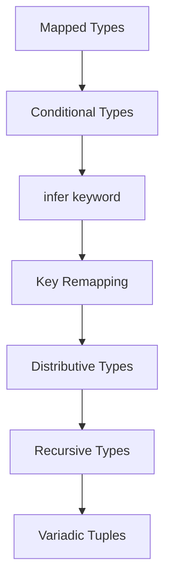
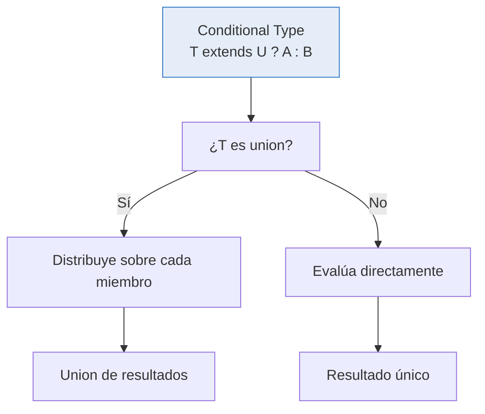

# :rocket: Capítulo 11: Tipos avanzados

<div class="chapter-meta">
  <span class="meta-item">🕐 4-5 horas</span>
  <span class="meta-item">📊 Nivel: Avanzado</span>
  <span class="meta-item">🎯 Semana 6</span>
</div>

<div class="chapter-objective">
  <span class="objective-icon">📌</span>
  <span class="objective-text">Al terminar este capítulo, dominarás mapped types, conditional types, infer, y template literal types — las herramientas para crear tipos que se transforman y adaptan automáticamente.</span>
</div>

<div class="chapter-map">
<h4>🗺️ Mapa del capítulo</h4>



</div>

!!! quote "Contexto"
    Aquí entramos en territorio avanzado: mapped types, conditional types y template literal types. Estos son los building blocks para crear tipos que **se computan** a partir de otros tipos, como funciones que operan sobre tipos.

<div class="connection-box back" markdown>
:link: **Conexión con el Capítulo 8** — Recuerda del <a href='../08-utility-types/'>Capítulo 8</a> que usaste `Partial<T>`, `Pick<T, K>`, etc. Ahora entiendes cómo funcionan internamente: son mapped types + conditional types.
</div>

---

<div class="concept-question" markdown>
🤔 **Pregunta para reflexionar** — Si `Partial<T>` hace todas las propiedades opcionales, ¿cómo crees que funciona internamente? ¿Hay una forma de iterar sobre las propiedades de un tipo y transformar cada una?
</div>

## 11.1 Mapped Types

Los mapped types iteran sobre las claves de un tipo y crean uno nuevo. Es como un `for` loop, pero para tipos.

```typescript
// Reimplementando Partial<T>
type MiPartial<T> = {
  [K in keyof T]?: T[K];
};

// Reimplementando Readonly<T>
type MiReadonly<T> = {
  readonly [K in keyof T]: T[K];
};

// Crear un tipo Nullable<T>
type Nullable<T> = {
  [K in keyof T]: T[K] | null;
};

type MesaNullable = Nullable<Mesa>;
// { id: number | null; número: number | null; zona: string | null; ... }
```

<div class="misconception-box" markdown>
<h4>❌ Error común</h4>
<p><strong>Mito:</strong> "Los mapped types son como dict comprehensions de Python — operan en runtime"</p>
<p><strong>Realidad:</strong> Los mapped types operan exclusivamente a nivel de tipos en compilación. No generan código JavaScript. Son transformaciones que crean tipos nuevos a partir de otros tipos, como funciones que toman un tipo y devuelven otro.</p>
</div>

!!! tip "Consejo Pro"
    Los mapped types son la base de los utility types. Una vez que entiendes `{ [K in keyof T]: ... }`, puedes crear CUALQUIER transformación de tipos. En MakeMenu, creamos `FormFields<T>` que convierte una interfaz en campos de formulario tipados.

<div class="misconception-box" markdown>
:warning: **Concepto erróneo común**

| Mito | Realidad |
|------|----------|
| "Los mapped types modifican el tipo original" | Crean un tipo **NUEVO**. `Partial<Plato>` no cambia `Plato`. |
| "Los conditional types son como ternarios en runtime" | Son puramente en compilación. No generan JavaScript. Son `if/else` para tipos, no para valores. |
| "`infer` es magia" | `infer` declara una variable de tipo temporal dentro de un conditional type. TypeScript la infiere por pattern matching. |
</div>

<div class="micro-exercise" markdown>
:pencil2: **Micro-ejercicio** — Crea un mapped type `Nullable<T>` que haga que cada propiedad de T sea `T[K] | null`. Pruébalo con `Nullable<Plato>`.

??? example "Solución"
    ```typescript
    type Nullable<T> = {
      [K in keyof T]: T[K] | null;
    };

    interface Plato {
      nombre: string;
      precio: number;
      disponible: boolean;
    }

    type PlatoNullable = Nullable<Plato>;
    // { nombre: string | null; precio: number | null; disponible: boolean | null }
    ```
</div>

<div class="concept-question" markdown>
🤔 **Pregunta para reflexionar** — ¿Puede un tipo "decidir" qué ser basándose en una condición? Es decir, ¿existe un `if/else` a nivel de tipos?
</div>

## 11.2 Conditional Types

```typescript
// Si T es un array, extrae el tipo interno; si no, deja T
type Unwrap<T> = T extends Array<infer U> ? U : T;

type A = Unwrap<string[]>;  // string
type B = Unwrap<number>;    // number

// Tipo práctico: diferenciar resultados API
type ApiResult<T> = T extends Error
  ? { success: false; error: string }
  : { success: true; data: T };
```

<div class="micro-exercise" markdown>
:pencil2: **Micro-ejercicio** — Crea un conditional type `EsString<T> = T extends string ? 'sí' : 'no'`. Prueba: `type A = EsString<'hola'>` y `type B = EsString<42>`.

??? example "Solución"
    ```typescript
    type EsString<T> = T extends string ? 'sí' : 'no';

    type A = EsString<'hola'>;  // 'sí'
    type B = EsString<42>;      // 'no'
    type C = EsString<string>;  // 'sí'
    type D = EsString<string | number>;  // 'sí' | 'no' (distribución!)
    ```
</div>

<div class="comparison" markdown>
<div class="lang-box python" markdown>

#### :snake: En Python

```python
from typing import TypeVar, Protocol, overload

class HasId(Protocol):
    id: int

T = TypeVar("T", bound=HasId)

# Python no puede expresar "si T tiene X, devuelve Y"
# Solo puede restringir con bounds o usar overloads
@overload
def procesar(val: str) -> int: ...
@overload
def procesar(val: int) -> str: ...
```

Python no puede computar tipos condicionalmente. Para variar el tipo de retorno según el input, necesitas `@overload` (una rama por caso) o restringir con `TypeVar(bound=...)` / `Protocol`. No hay forma de expresar "si T es X, el resultado es Y; si no, es Z" como una sola definición genérica.

</div>
<div class="lang-box typescript" markdown>

#### 🔷 En TypeScript

```typescript
// TypeScript puede expresar lógica condicional en tipos
type Procesar<T> = T extends string ? number : string;

// O con mapped types: transformar todas las propiedades
type Stringify<T> = {
  [K in keyof T]: T[K] extends Date ? string : T[K];
};
```

TypeScript permite **lógica condicional directamente en el sistema de tipos**. Un solo conditional type reemplaza múltiples overloads y puede combinarse con mapped types para transformar propiedades según su tipo — algo imposible en Python.

</div>
</div>

<div class="concept-question" markdown>
🤔 **Pregunta para reflexionar** — Si `Promise<string>` envuelve un `string`, ¿hay forma de EXTRAER automáticamente el tipo interior sin saber cuál es?
</div>

## 11.3 `infer` keyword

```typescript
// Extraer tipo de retorno (reimplementando ReturnType)
type MiReturnType<T> = T extends (...args: any[]) => infer R ? R : never;

// Extraer contenido de una Promise
type PromiseContent<T> = T extends Promise<infer U> ? U : T;
type X = PromiseContent<Promise<Mesa[]>>;  // Mesa[]

// Extraer primer argumento
type FirstArg<T> = T extends (first: infer F, ...rest: any[]) => any ? F : never;
```

!!! tip "Consejo Pro"
    Usa `infer` con `ReturnType<T>` y `Parameters<T>` para extraer tipos de funciones existentes. Esto es invaluable cuando trabajas con librerías de terceros que no exportan sus tipos internos.

## 11.4 Key Remapping (`as` clause)

En los mapped types que vimos en 11.1, iteramos sobre claves y transformamos sus **valores**. Pero, ¿y si quieres transformar las **claves mismas**? Desde TypeScript 4.1, la cláusula `as` dentro de un mapped type permite renombrar o filtrar claves durante el mapeo. Es lo que convierte los mapped types de "iterar y modificar valores" a "iterar, transformar claves Y modificar valores".

**Renombrar claves** — puedes usar template literal types con `as` para generar nombres derivados:

```typescript
// Crear getters automáticamente
type Getters<T> = {
  [K in keyof T as `get${Capitalize<K & string>}`]: () => T[K];
};

type MesaGetters = Getters<Mesa>;
// { getId: () => number; getNumero: () => number; getZona: () => string; ... }
```

**Filtrar claves** — si la expresión `as` produce `never`, esa clave se excluye del resultado. Esto te da un `Pick` dinámico basado en condiciones de tipo:

```typescript
// Filtrar propiedades por tipo
type SoloStrings<T> = {
  [K in keyof T as T[K] extends string ? K : never]: T[K];
};

type MesaStrings = SoloStrings<Mesa>;
// { zona: string } (solo las propiedades que son string)
```

Un patrón práctico es generar tipos de event handlers a partir de una entidad. Imagina un sistema donde cada propiedad de un modelo produce un callback `onChange`:

```typescript
// Generar handlers de cambio para cada propiedad
type OnChangeHandlers<T> = {
  [K in keyof T as `on${Capitalize<K & string>}Change`]: (
    newValue: T[K],
    oldValue: T[K]
  ) => void;
};

type MesaHandlers = OnChangeHandlers<Mesa>;
// { onIdChange: (newValue: number, oldValue: number) => void;
//   onNumeroChange: (newValue: number, oldValue: number) => void;
//   onZonaChange: (newValue: string, oldValue: string) => void; ... }
```

!!! tip "Consejo Pro"
    Combinar `as` con template literal types es uno de los patrones más potentes de TypeScript avanzado. Con una sola definición genérica puedes derivar familias enteras de tipos (`getX`, `setX`, `onXChange`) que se mantienen sincronizados automáticamente con tu modelo de datos.

## 11.5 Distributive Conditional Types

Cuando un conditional type opera sobre una **union**, se **distribuye** automáticamente sobre cada miembro:

```typescript
type IsString<T> = T extends string ? "sí" : "no";

// Con un tipo individual:
type A = IsString<string>;         // "sí"
type B = IsString<number>;         // "no"

// Con una union: se distribuye!
type C = IsString<string | number>;  // "sí" | "no" (no solo "no")
// Equivale a: IsString<string> | IsString<number> → "sí" | "no"
```

!!! info "¿Cuándo se distribuye?"
    Solo cuando el tipo genérico `T` aparece **desnudo** (sin wrapping) a la izquierda de `extends`. Si envuelves `T` en una tupla, no se distribuye:

    ```typescript
    // Se distribuye:
    type D1<T> = T extends string ? "sí" : "no";
    // NO se distribuye:
    type D2<T> = [T] extends [string] ? "sí" : "no";

    type R1 = D1<string | number>;  // "sí" | "no"
    type R2 = D2<string | number>;  // "no" (sin distribución)
    ```

<div class="micro-exercise" markdown>
<h4>🧪 Micro-ejercicio: Filtrar unión por tipo (3 min)</h4>
<p>Crea un tipo <code>SoloNumeros&lt;T&gt;</code> que, dada una unión, extraiga solo los miembros que extienden de <code>number</code>.</p>
</div>

??? success "Solución"
    ```typescript
    type SoloNumeros<T> = T extends number ? T : never;

    type Mezcla = string | 42 | boolean | 100 | "hola";
    type Nums = SoloNumeros<Mezcla>; // 42 | 100
    ```
    La distribución automática aplica el condicional a cada miembro de la unión por separado.

## 11.6 Recursive Conditional Types

Puedes combinar recursión con conditional types para transformaciones profundas:

```typescript
// DeepRequired: hace TODO obligatorio en profundidad
type DeepRequired<T> = T extends object
  ? { [K in keyof T]-?: DeepRequired<T[K]> }
  : T;

// Flatten: aplana arrays anidados
type Flatten<T> = T extends Array<infer U> ? Flatten<U> : T;

type Test1 = Flatten<number[][][]>;  // number
type Test2 = Flatten<string[]>;      // string
type Test3 = Flatten<boolean>;       // boolean

// DeepGet: accede a propiedades anidadas por ruta string
type DeepGet<T, Path extends string> =
  Path extends `${infer Key}.${infer Rest}`
    ? Key extends keyof T
      ? DeepGet<T[Key], Rest>
      : never
    : Path extends keyof T
      ? T[Path]
      : never;

interface Config {
  db: { host: string; port: number };
  api: { url: string; timeout: number };
}

type DbHost = DeepGet<Config, "db.host">;    // string
type ApiTimeout = DeepGet<Config, "api.timeout">; // number
```



## 11.7 Variadic Tuple Types

TypeScript 4.0+ permite trabajar con tuplas de longitud variable:

```typescript
// Spread en tuplas
type Prepend<T, Tuple extends unknown[]> = [T, ...Tuple];
type Append<Tuple extends unknown[], T> = [...Tuple, T];

type A = Prepend<string, [number, boolean]>;  // [string, number, boolean]
type B = Append<[number, boolean], string>;   // [number, boolean, string]

// Concat de tuplas
type Concat<A extends unknown[], B extends unknown[]> = [...A, ...B];
type C = Concat<[1, 2], [3, 4]>;  // [1, 2, 3, 4]

// Uso práctico: middleware pipeline
type Middleware<Input, Output> = (input: Input) => Output;

type Chain<Middlewares extends Middleware<any, any>[]> =
  Middlewares extends [Middleware<infer I, infer O>, ...infer Rest extends Middleware<any, any>[]]
    ? [Middleware<I, O>, ...Chain<Rest>]
    : [];
```

<div class="comparison" markdown>
<div class="lang-box python" markdown>

#### :snake: En Python

Python no tiene equivalente a programación a nivel de tipos. Los type hints son simples anotaciones — no puedes computar nuevos tipos.

</div>
<div class="lang-box typescript" markdown>

#### 🔷 En TypeScript

TypeScript tiene un **lenguaje funcional completo** a nivel de tipos: condicionales, recursión, pattern matching. No existe en ningún otro lenguaje mainstream.

</div>
</div>

---

<div class="code-evolution" markdown>
<h4>🔄 Evolución de código: sistema de tipos para formularios</h4>

Veamos cómo evoluciona un sistema de tipos para formularios, desde un enfoque novato hasta una solución profesional con mapped y conditional types:

=== "v1: Novato"

    Definir manualmente el tipo de campo de formulario para cada entidad:

    ```typescript
    // ❌ Repetitivo: hay que crear tipos de formulario manualmente para cada entidad
    interface PlatoFormFields {
      nombre: { value: string; error?: string; touched: boolean };
      precio: { value: number; error?: string; touched: boolean };
      disponible: { value: boolean; error?: string; touched: boolean };
    }

    interface MesaFormFields {
      número: { value: number; error?: string; touched: boolean };
      zona: { value: string; error?: string; touched: boolean };
      ocupada: { value: boolean; error?: string; touched: boolean };
    }

    // Cada nueva entidad = otro tipo manual completo 😩
    ```

=== "v2: Con mapped types"

    Un solo mapped type genérico que transforma cualquier interfaz en campos de formulario:

    ```typescript
    // ✅ Un mapped type genérico para cualquier entidad
    type FormField<T> = {
      value: T;
      error?: string;
      touched: boolean;
    };

    type FormFields<T> = {
      [K in keyof T]: FormField<T[K]>;
    };

    // Ahora funciona con CUALQUIER entidad
    type PlatoForm = FormFields<Plato>;
    type MesaForm = FormFields<Mesa>;
    // Cada nueva entidad = cero código nuevo para el formulario
    ```

=== "v3: Profesional"

    Sistema completo con validación tipada y campos condicionalmente requeridos usando conditional types:

    ```typescript
    // 🚀 Sistema completo con validación y campos condicionales
    type FormField<T> = {
      value: T;
      error?: string;
      touched: boolean;
      dirty: boolean;
    };

    type FormFields<T> = {
      [K in keyof T]: FormField<T[K]>;
    };

    // Campos que son requeridos condicionalmente según el tipo de valor
    type RequiredKeys<T> = {
      [K in keyof T]: T[K] extends string | number ? K : never;
    }[keyof T];

    type OptionalKeys<T> = Exclude<keyof T, RequiredKeys<T>>;

    // Validadores tipados por tipo de campo
    type Validator<T> = T extends string
      ? { minLength?: number; maxLength?: number; pattern?: RegExp }
      : T extends number
        ? { min?: number; max?: number; integer?: boolean }
        : T extends boolean
          ? { mustBeTrue?: boolean }
          : never;

    // Configuración completa del formulario
    type FormConfig<T> = {
      fields: FormFields<T>;
      validators: { [K in keyof T]?: Validator<T[K]> };
      requiredFields: RequiredKeys<T>[];
    };

    // Uso
    type PlatoFormConfig = FormConfig<Plato>;
    // validators.nombre tiene { minLength?, maxLength?, pattern? }
    // validators.precio tiene { min?, max?, integer? }
    // requiredFields es ('nombre' | 'precio')[]
    ```
</div>

<div class="pro-tip" markdown>
⭐ **Consejo Pro** — En producción, usa mapped types para generar **variantes de un tipo base** automáticamente. En MakeMenu, un solo `FormFields<T>` genera formularios tipados para `Plato`, `Mesa`, `Reserva` y cualquier entidad futura — cero código manual por entidad nueva. Combina esto con `Validator<T[K]>` (conditional type por tipo de campo) para validación automática. Esto escala infinitamente: 1 tipo base → N formularios tipados.
</div>

<div class="ejercicio-guiado">
<h4>🏋️ Ejercicio guiado</h4>

Construye paso a paso un sistema de tipos que transforme una interfaz de dominio en un formulario tipado con validadores automáticos.

**Paso 1:** Define una interfaz `Producto` con `id: number`, `nombre: string`, `precio: number`, `activo: boolean`.

**Paso 2:** Crea un mapped type `SinId<T>` que excluya la propiedad `id` usando key remapping con `as Exclude<K, "id">`.

**Paso 3:** Crea un conditional type `TipoInput<T>` que devuelva `"text"` para `string`, `"number"` para `number`, y `"checkbox"` para `boolean`.

**Paso 4:** Crea un mapped type `CamposFormulario<T>` que para cada propiedad genere `{ valor: T[K]; tipo: TipoInput<T[K]>; error?: string }`.

**Paso 5:** Aplica `CamposFormulario<SinId<Producto>>` y verifica que el tipo resultante tiene los campos correctos con los tipos de input adecuados.

??? success "Solución completa"
    ```typescript
    // Paso 1
    interface Producto {
      id: number;
      nombre: string;
      precio: number;
      activo: boolean;
    }

    // Paso 2
    type SinId<T> = {
      [K in keyof T as Exclude<K, "id">]: T[K];
    };

    // Paso 3
    type TipoInput<T> = T extends string
      ? "text"
      : T extends number
        ? "number"
        : T extends boolean
          ? "checkbox"
          : "text";

    // Paso 4
    type CamposFormulario<T> = {
      [K in keyof T]: {
        valor: T[K];
        tipo: TipoInput<T[K]>;
        error?: string;
      };
    };

    // Paso 5
    type FormProducto = CamposFormulario<SinId<Producto>>;
    // {
    //   nombre: { valor: string; tipo: "text"; error?: string };
    //   precio: { valor: number; tipo: "number"; error?: string };
    //   activo: { valor: boolean; tipo: "checkbox"; error?: string };
    // }
    ```

</div>

<div class="ejercicio-guiado">
<h4>🏋️ Ejercicio guiado</h4>

Vas a construir un sistema de tipos que genere automáticamente eventos tipados y funciones de acceso para las entidades del restaurante MakeMenu, usando mapped types, conditional types y template literal types.

1. Define una interfaz `Plato` con `id` (number), `nombre` (string), `precio` (number), `disponible` (boolean) y `categoria` (string).
2. Crea un mapped type `Getters<T>` que para cada propiedad de `T` genere un método getter con el nombre `get${Capitalize<K>}` que devuelva `() => T[K]`. Por ejemplo, `nombre` se convierte en `getNombre: () => string`.
3. Crea un conditional type `TipoEvento<T>` que devuelva `"cambio-texto"` para `string`, `"cambio-numero"` para `number`, `"cambio-toggle"` para `boolean` y `"cambio-desconocido"` para cualquier otro tipo.
4. Crea un mapped type `Eventos<T>` que combine template literal types y el conditional type del paso anterior. Para cada propiedad de `T`, genera una clave `on${Capitalize<K>}Change` cuyo valor sea `(valor: T[K], tipoEvento: TipoEvento<T[K]>) => void`.
5. Crea un mapped type `SoloEditables<T>` que excluya las propiedades `id` y `readonly` numéricas, quedándose solo con las propiedades de tipo `string | boolean`. Usa key remapping con `as` y un conditional type para filtrar.
6. Aplica `Getters<Plato>`, `Eventos<Omit<Plato, "id">>` y `SoloEditables<Plato>` para verificar que los tipos resultantes son correctos.

??? success "Solución completa"
    ```typescript
    // Paso 1: Interfaz base
    interface Plato {
      id: number;
      nombre: string;
      precio: number;
      disponible: boolean;
      categoria: string;
    }

    // Paso 2: Mapped type para getters
    type Getters<T> = {
      [K in keyof T as `get${Capitalize<K & string>}`]: () => T[K];
    };

    type PlatoGetters = Getters<Plato>;
    // {
    //   getId: () => number;
    //   getNombre: () => string;
    //   getPrecio: () => number;
    //   getDisponible: () => boolean;
    //   getCategoria: () => string;
    // }

    // Paso 3: Conditional type para tipo de evento
    type TipoEvento<T> = T extends string
      ? "cambio-texto"
      : T extends number
        ? "cambio-numero"
        : T extends boolean
          ? "cambio-toggle"
          : "cambio-desconocido";

    // Paso 4: Mapped type para eventos con template literals
    type Eventos<T> = {
      [K in keyof T as `on${Capitalize<K & string>}Change`]: (
        valor: T[K],
        tipoEvento: TipoEvento<T[K]>
      ) => void;
    };

    type PlatoEventos = Eventos<Omit<Plato, "id">>;
    // {
    //   onNombreChange: (valor: string, tipoEvento: "cambio-texto") => void;
    //   onPrecioChange: (valor: number, tipoEvento: "cambio-numero") => void;
    //   onDisponibleChange: (valor: boolean, tipoEvento: "cambio-toggle") => void;
    //   onCategoriaChange: (valor: string, tipoEvento: "cambio-texto") => void;
    // }

    // Paso 5: Solo propiedades editables (string | boolean, sin id)
    type SoloEditables<T> = {
      [K in keyof T as K extends "id"
        ? never
        : T[K] extends string | boolean
          ? K
          : never
      ]: T[K];
    };

    type PlatoEditables = SoloEditables<Plato>;
    // {
    //   nombre: string;
    //   disponible: boolean;
    //   categoria: string;
    // }

    // Paso 6: Verificación con un objeto de ejemplo
    const getters: PlatoGetters = {
      getId: () => 1,
      getNombre: () => "Paella",
      getPrecio: () => 16,
      getDisponible: () => true,
      getCategoria: () => "principal",
    };

    const eventos: PlatoEventos = {
      onNombreChange: (valor, tipo) => console.log(`${tipo}: ${valor}`),
      onPrecioChange: (valor, tipo) => console.log(`${tipo}: ${valor}`),
      onDisponibleChange: (valor, tipo) => console.log(`${tipo}: ${valor}`),
      onCategoriaChange: (valor, tipo) => console.log(`${tipo}: ${valor}`),
    };

    eventos.onPrecioChange(18, "cambio-numero");
    // "cambio-numero: 18"
    ```

</div>

---

<div class="real-errors">
<h4>🚨 Errores que vas a encontrar</h4>

**Error 1: Olvidar `keyof` en un mapped type**
```typescript
// Intentar iterar sobre T directamente sin keyof
type MiReadonly<T> = {
  readonly [K in T]: T[K];  // ❌
};
```

```
Type 'T' is not assignable to type 'string | number | symbol'.
  Type 'T' is not assignable to type 'symbol'.
```

**¿Por qué?** El operador `in` de un mapped type necesita iterar sobre claves (strings, numbers o symbols). `T` es un tipo objeto completo, no un conjunto de claves. Necesitas `keyof T` para extraer las claves del tipo.

**Solución:**
```typescript
type MiReadonly<T> = {
  readonly [K in keyof T]: T[K];  // ✅ keyof extrae las claves
};
```

**Error 2: Usar `infer` fuera de un conditional type**
```typescript
// Intentar usar infer como declaración libre
type ElementoArray<T> = Array<infer U>;  // ❌
```

```
'infer' declarations are only permitted in the 'extends' clause of a conditional type.
```

**¿Por qué?** `infer` solo funciona dentro de la cláusula `extends` de un conditional type. Es una variable de tipo que TypeScript infiere por pattern matching, y ese pattern matching solo ocurre en conditional types.

**Solución:**
```typescript
type ElementoArray<T> = T extends Array<infer U> ? U : never;  // ✅

type Elem = ElementoArray<string[]>;  // string
```

**Error 3: Template literal type con tipo no-string**
```typescript
type Evento<T> = `on${T}`;  // ❌
```

```
Type 'T' is not assignable to type 'string | number | bigint | boolean | null | undefined'.
```

**¿Por qué?** Los template literal types requieren que las partes interpoladas sean asignables a tipos primitivos que se puedan serializar como string. Un genérico `T` sin restricción podría ser un objeto, un array, etc.

**Solución:**
```typescript
type Evento<T extends string> = `on${Capitalize<T>}`;  // ✅

type Click = Evento<"click">;  // "onClick"
```

**Error 4: Conditional type que no se distribuye como esperas**
```typescript
type SoloStrings<T> = T extends string ? T : never;

// Esperas "hola" | "mundo", pero...
type Test = SoloStrings<("hola" | "mundo" | 42)[]>;  // never ❌
```

```
// No hay error de compilación, pero el resultado es `never` en vez de "hola" | "mundo"
```

**¿Por qué?** La distribución solo ocurre cuando `T` aparece **desnudo** a la izquierda de `extends`. Aquí `T` es `("hola" | "mundo" | 42)[]`, que es un array, no una union desnuda. El array completo no extiende `string`, así que el resultado es `never`.

**Solución:**
```typescript
// Primero extraer el tipo interno del array, luego filtrar
type SoloStrings<T> = T extends string ? T : never;

type Interno = ("hola" | "mundo" | 42)[][number];  // "hola" | "mundo" | 42
type Test = SoloStrings<Interno>;  // "hola" | "mundo" ✅

// O en un solo paso:
type StringsDeArray<T> = T extends (infer U)[]
  ? U extends string ? U : never
  : never;

type Test2 = StringsDeArray<("hola" | "mundo" | 42)[]>;  // "hola" | "mundo" ✅
```

</div>

<div class="checkpoint">
<h4>🏁 Checkpoint</h4>
<p>Si puedes: (1) crear un mapped type personalizado, (2) escribir un conditional type con <code>infer</code>, y (3) explicar cómo funciona <code>Partial&lt;T&gt;</code> internamente — dominas los tipos avanzados.</p>
</div>

<div class="mini-project">
<h4>🏗️ Mini-proyecto: Sistema de validación tipada para API de restaurante</h4>

Vas a construir un sistema de tipos avanzados que valide y transforme automáticamente los datos de una API de restaurante. Usarás mapped types, conditional types, `infer` y template literal types.

**Paso 1 — Definir los tipos base y un mapped type `FormularioCreación<T>`**

Crea una interfaz `Plato` con las propiedades `id` (number), `nombre` (string), `precio` (number), `disponible` (boolean) y `categoria` (string). Luego crea un mapped type `FormularioCreación<T>` que excluya la propiedad `id` (porque la asigna el servidor) y haga todas las demás propiedades obligatorias.

```typescript
// Define la interfaz Plato aquí

// Crea FormularioCreación<T> que:
// 1. Excluya la clave "id" usando key remapping (as)
// 2. Mantenga todas las demás propiedades obligatorias

type CrearPlato = FormularioCreación<Plato>;
// Debería ser: { nombre: string; precio: number; disponible: boolean; categoria: string }
```

??? success "Solución Paso 1"
    ```typescript
    interface Plato {
      id: number;
      nombre: string;
      precio: number;
      disponible: boolean;
      categoria: string;
    }

    type FormularioCreación<T> = {
      [K in keyof T as Exclude<K, "id">]-?: T[K];
    };

    type CrearPlato = FormularioCreación<Plato>;
    // { nombre: string; precio: number; disponible: boolean; categoria: string }
    ```

**Paso 2 — Crear un conditional type `ValidadorPorTipo<T>` y aplicarlo con un mapped type**

Crea un conditional type que asigne reglas de validación según el tipo de cada propiedad: para `string` devuelve `{ minLength?: number; maxLength?: number }`, para `number` devuelve `{ min?: number; max?: number }`, para `boolean` devuelve `{ required?: boolean }`, y para cualquier otro tipo devuelve `never`. Luego crea `ReglasValidación<T>` que aplique este validador a cada propiedad de `T`.

```typescript
// Crea ValidadorPorTipo<T> con conditional types encadenados

// Crea ReglasValidación<T> como mapped type que aplique ValidadorPorTipo a cada propiedad

type ReglasPlato = ReglasValidación<Plato>;
// Debería ser:
// {
//   id: { min?: number; max?: number };
//   nombre: { minLength?: number; maxLength?: number };
//   precio: { min?: number; max?: number };
//   disponible: { required?: boolean };
//   categoria: { minLength?: number; maxLength?: number };
// }
```

??? success "Solución Paso 2"
    ```typescript
    type ValidadorPorTipo<T> = T extends string
      ? { minLength?: number; maxLength?: number }
      : T extends number
        ? { min?: number; max?: number }
        : T extends boolean
          ? { required?: boolean }
          : never;

    type ReglasValidación<T> = {
      [K in keyof T]: ValidadorPorTipo<T[K]>;
    };

    type ReglasPlato = ReglasValidación<Plato>;
    // {
    //   id: { min?: number; max?: number };
    //   nombre: { minLength?: number; maxLength?: number };
    //   precio: { min?: number; max?: number };
    //   disponible: { required?: boolean };
    //   categoria: { minLength?: number; maxLength?: number };
    // }
    ```

**Paso 3 — Crear template literal types para handlers de eventos y un tipo `ApiEndpoints<T>`**

Crea un mapped type `EventHandlers<T>` que genere nombres de handlers como `onNombreChange`, `onPrecioChange`, etc. para cada propiedad de `T`. Cada handler debe ser una función que reciba el nuevo valor del tipo correcto. Luego crea `ApiEndpoints<T>` que genere los nombres de endpoints REST (`getPlato`, `createPlato`, `updatePlato`, `deletePlato`) usando template literal types y el nombre de la entidad.

```typescript
// Crea EventHandlers<T> con template literal types y Capitalize

// Crea ApiEndpoints<Nombre> que genere los 4 endpoints CRUD

type PlatoHandlers = EventHandlers<Omit<Plato, "id">>;
// Debería tener: onNombreChange: (value: string) => void, etc.

type PlatoApi = ApiEndpoints<"Plato">;
// Debería ser: "getPlato" | "createPlato" | "updatePlato" | "deletePlato"
```

??? success "Solución Paso 3"
    ```typescript
    type EventHandlers<T> = {
      [K in keyof T as `on${Capitalize<K & string>}Change`]: (value: T[K]) => void;
    };

    type PlatoHandlers = EventHandlers<Omit<Plato, "id">>;
    // {
    //   onNombreChange: (value: string) => void;
    //   onPrecioChange: (value: number) => void;
    //   onDisponibleChange: (value: boolean) => void;
    //   onCategoriaChange: (value: string) => void;
    // }

    type CrudAcción = "get" | "create" | "update" | "delete";
    type ApiEndpoints<Nombre extends string> = `${CrudAcción}${Capitalize<Nombre>}`;

    type PlatoApi = ApiEndpoints<"Plato">;
    // "getPlato" | "createPlato" | "updatePlato" | "deletePlato"

    // Bonus: un tipo que mapee cada endpoint a su firma
    type ApiMethods<T, Nombre extends string> = {
      [E in ApiEndpoints<Nombre>]: E extends `get${string}`
        ? () => Promise<T>
        : E extends `create${string}`
          ? (data: FormularioCreación<T>) => Promise<T>
          : E extends `update${string}`
            ? (id: number, data: Partial<T>) => Promise<T>
            : E extends `delete${string}`
              ? (id: number) => Promise<void>
              : never;
    };

    type PlatoService = ApiMethods<Plato, "Plato">;
    // {
    //   getPlato: () => Promise<Plato>;
    //   createPlato: (data: FormularioCreación<Plato>) => Promise<Plato>;
    //   updatePlato: (id: number, data: Partial<Plato>) => Promise<Plato>;
    //   deletePlato: (id: number) => Promise<void>;
    // }
    ```

</div>

<div class="connection-box forward" markdown>
:link: **Hacia el Capítulo 13** — En el <a href='../13-type-level/'>Capítulo 13</a> llevarás esto al extremo con type-level programming: tipos recursivos, pattern matching avanzado, y parsing de strings a nivel de tipos.
</div>

---

## :link: Recursos

| Recurso | Enlace |
|---------|--------|
| Mapped Types | [typescriptlang.org/.../mapped-types](https://www.typescriptlang.org/docs/handbook/2/mapped-types.html) |
| Conditional Types | [typescriptlang.org/.../conditional-types](https://www.typescriptlang.org/docs/handbook/2/conditional-types.html) |
| ⭐ Type Challenges | [github.com/type-challenges](https://github.com/type-challenges/type-challenges) |

---

## 🎯 Ejercicios

??? question "Ejercicio 1: EventMap con mapped types"
    Crea un mapped type `EventMap<T>` que genere `on{Propiedad}` para cada clave.

    ??? success "Solución"
        ```typescript
        type EventMap<T> = {
          [K in keyof T as `on${Capitalize<K & string>}`]: (value: T[K]) => void;
        };

        type MesaEvents = EventMap<Pick<Mesa, "número" | "zona" | "ocupada">>;
        // {
        //   onNumero: (value: number) => void;
        //   onZona: (value: string) => void;
        //   onOcupada: (value: boolean) => void;
        // }
        ```

??? question "Ejercicio 2: DeepValue conditional type"
    Crea un conditional type que extraiga el tipo interno de arrays y Records.

    ??? success "Solución"
        ```typescript
        type DeepValue<T> =
          T extends Array<infer U> ? U :
          T extends Record<any, infer V> ? V :
          T;

        type A = DeepValue<string[]>;                    // string
        type B = DeepValue<Record<string, Mesa>>;        // Mesa
        type C = DeepValue<number>;                      // number
        ```

??? question "Ejercicio 3: Mutable — quitar `readonly` con `-`"
    Crea un mapped type `Mutable<T>` que elimine el modificador `readonly` de todas las propiedades. Es el inverso de `Readonly<T>`.

    !!! tip "Pista"
        Usa el prefijo `-readonly` en el mapped type para eliminar el modificador.

    ??? success "Solución"
        ```typescript
        type Mutable<T> = {
          -readonly [K in keyof T]: T[K];
        };

        // Test
        type MesaReadonly = Readonly<Mesa>;
        type MesaMutable = Mutable<MesaReadonly>;
        // MesaMutable es idéntico a Mesa — todas las propiedades son mutables de nuevo

        // Ejemplo práctico: clonar un objeto readonly para editarlo
        function editarMesa(mesa: Readonly<Mesa>): Mesa {
          const copia: Mutable<Readonly<Mesa>> = { ...mesa };
          copia.ocupada = true; // ✅ Ahora se puede modificar
          return copia;
        }
        ```

??? question "Ejercicio 4: ExtractByType — filtrar propiedades por tipo"
    Crea un tipo `ExtractByType<T, U>` que solo conserve las propiedades de `T` cuyo valor sea asignable a `U`. Por ejemplo, `ExtractByType<Mesa, string>` debe devolver solo las propiedades cuyo tipo sea `string`.

    !!! tip "Pista"
        Combina key remapping (`as`) con un conditional type para filtrar las claves.

    ??? success "Solución"
        ```typescript
        type ExtractByType<T, U> = {
          [K in keyof T as T[K] extends U ? K : never]: T[K];
        };

        interface Producto {
          id: number;
          nombre: string;
          descripción: string;
          precio: number;
          activo: boolean;
        }

        type ProductoStrings = ExtractByType<Producto, string>;
        // { nombre: string; descripción: string }

        type ProductoNumeros = ExtractByType<Producto, number>;
        // { id: number; precio: number }

        // Variante: excluir por tipo
        type ExcludeByType<T, U> = {
          [K in keyof T as T[K] extends U ? never : K]: T[K];
        };

        type SinStrings = ExcludeByType<Producto, string>;
        // { id: number; precio: number; activo: boolean }
        ```

??? question "Ejercicio 5: DeepFlatten para tipos anidados"
    Crea un tipo `DeepFlatten<T>` que reciba un array potencialmente anidado (`number[]`, `number[][]`, `number[][][]`...) y devuelva el tipo base. Luego crea `DeepPromise<T>` que resuelva `Promise` anidadas (`Promise<Promise<Promise<string>>>` → `string`).

    !!! tip "Pista"
        Usa recursión: si `T extends Array<infer U>`, aplica `DeepFlatten<U>` recursivamente. Mismo patrón para `Promise`.

    ??? success "Solución"
        ```typescript
        // Aplana arrays anidados a nivel de tipo
        type DeepFlatten<T> = T extends Array<infer U>
          ? DeepFlatten<U>
          : T;

        type F1 = DeepFlatten<number[][][]>;   // number
        type F2 = DeepFlatten<string[]>;        // string
        type F3 = DeepFlatten<boolean>;         // boolean

        // Resuelve Promises anidadas a nivel de tipo
        type DeepPromise<T> = T extends Promise<infer U>
          ? DeepPromise<U>
          : T;

        type P1 = DeepPromise<Promise<Promise<Promise<string>>>>;  // string
        type P2 = DeepPromise<Promise<Mesa[]>>;                     // Mesa[]
        type P3 = DeepPromise<number>;                              // number

        // Combinación: flatten + resolve
        type Resolve<T> = DeepFlatten<DeepPromise<T>>;
        type R1 = Resolve<Promise<string[][]>>;  // string
        ```

---

## :brain: Flashcards de repaso

<div class="flashcard">
<div class="front">¿Qué es un mapped type?</div>
<div class="back">Un tipo que itera sobre las claves de otro tipo con <code>[K in keyof T]</code> y crea un tipo nuevo. Es como un <code>for</code> loop, pero para tipos. Ejemplo: <code>type MiPartial&lt;T&gt; = { [K in keyof T]?: T[K] }</code>.</div>
</div>

<div class="flashcard">
<div class="front">¿Qué hace <code>infer</code> en un conditional type?</div>
<div class="back"><code>infer</code> declara una variable de tipo dentro de un conditional type. TypeScript la infiere automáticamente. Ejemplo: <code>T extends Array&lt;infer U&gt; ? U : T</code> extrae el tipo interno del array.</div>
</div>

<div class="flashcard">
<div class="front">¿Qué es key remapping con <code>as</code>?</div>
<div class="back">Permite renombrar o filtrar claves en un mapped type. Se usa con <code>[K in keyof T as NuevaClave]</code>. Para filtrar, retorna <code>never</code> para excluir claves: <code>[K in keyof T as T[K] extends string ? K : never]</code>.</div>
</div>

<div class="flashcard">
<div class="front">¿Cuándo se distribuye un conditional type sobre una union?</div>
<div class="back">Solo cuando el parámetro genérico <code>T</code> aparece <strong>desnudo</strong> (sin wrapping) a la izquierda de <code>extends</code>. <code>T extends X</code> se distribuye, pero <code>[T] extends [X]</code> NO se distribuye.</div>
</div>

<div class="flashcard">
<div class="front">¿Qué significan <code>-?</code> y <code>-readonly</code> en mapped types?</div>
<div class="back"><code>-?</code> elimina el modificador opcional: <code>{ [K in keyof T]-?: T[K] }</code> equivale a <code>Required&lt;T&gt;</code>. <code>-readonly</code> elimina el modificador readonly, haciendo propiedades mutables de nuevo.</div>
</div>

---

## :video_game: Quiz interactivo

<div class="quiz" data-quiz-id="ch11-q1">
<h4>Pregunta 1: ¿Qué hace <code>[K in keyof T as Exclude&lt;K, "id"&gt;]: T[K]</code>?</h4>
<button class="quiz-option" data-correct="false">Renombra la clave <code>id</code> a otro nombre</button>
<button class="quiz-option" data-correct="true">Crea un tipo con todas las claves de T excepto <code>id</code></button>
<button class="quiz-option" data-correct="false">Hace que <code>id</code> sea opcional</button>
<button class="quiz-option" data-correct="false">Convierte el tipo de <code>id</code> a <code>never</code></button>
<div class="quiz-feedback" data-correct="¡Correcto! Usar `as` con `Exclude` en un mapped type es key remapping: las claves que se mapean a `never` se eliminan del tipo resultante." data-incorrect="Incorrecto. `as Exclude<K, 'id'>` filtra la clave `id` (la mapea a `never`), creando un tipo sin esa propiedad. Es key remapping."></div>
</div>

<div class="quiz" data-quiz-id="ch11-q2">
<h4>Pregunta 2: ¿Cuándo se distribuye un conditional type sobre una union?</h4>
<button class="quiz-option" data-correct="false">Siempre que se use <code>extends</code></button>
<button class="quiz-option" data-correct="false">Solo con <code>infer</code></button>
<button class="quiz-option" data-correct="true">Solo cuando el parámetro genérico aparece <em>desnudo</em> (sin wrapping) a la izquierda de <code>extends</code></button>
<button class="quiz-option" data-correct="false">Nunca — hay que iterar manualmente</button>
<div class="quiz-feedback" data-correct="¡Correcto! `T extends X` se distribuye sobre unions. Pero `[T] extends [X]` NO se distribuye — el wrapping en tupla lo previene." data-incorrect="Incorrecto. La distribución ocurre solo cuando T aparece 'desnudo' (naked): `T extends X` sí se distribuye, pero `[T] extends [X]` no."></div>
</div>

<div class="quiz" data-quiz-id="ch11-q3">
<h4>Pregunta 3: ¿Qué hace <code>`on${Capitalize&lt;string&gt;}`</code>?</h4>
<button class="quiz-option" data-correct="true">Crea un tipo template literal que acepta strings como <code>"onClick"</code>, <code>"onHover"</code>, etc.</button>
<button class="quiz-option" data-correct="false">Es un error de compilación porque <code>Capitalize</code> no acepta <code>string</code></button>
<button class="quiz-option" data-correct="false">Devuelve el literal exacto <code>"onString"</code></button>
<button class="quiz-option" data-correct="false">Es equivalente a <code>string</code></button>
<div class="quiz-feedback" data-correct="¡Correcto! Los template literal types combinados con string manipulation types crean patrones potentes. Esto acepta cualquier string que empiece por 'on' seguido de mayúscula." data-incorrect="Incorrecto. Template literal types permiten crear patrones: `on${Capitalize<string>}` acepta cualquier string que empiece por 'on' seguido de una letra mayúscula."></div>
</div>

---

## :bug: Ejercicio de depuración

Encuentra los **4 errores** en este código:

```typescript
// ❌ Este código tiene 4 errores. ¡Encuéntralos!

// 1. Mapped type para hacer solo las propiedades string opcionales
type OptionalStrings<T> = {
  [K in keyof T]: T[K] extends string ? T[K] : T[K];  // 🤔 ¿Falta algo?
};

// 2. Conditional type para extraer tipos numéricos
type ExtraeNumeros<T> = T extends number ? T : never;
type Resultado = ExtraeNumeros<string | number | 42 | boolean>;  // 🤔 ¿Qué tipo da?

// 3. Template literal type para eventos
type Eventos = "click" | "hover" | "focus";
type EventHandler = `on${Eventos}`;  // 🤔 ¿Falta capitalización?

// 4. Key remapping con filtro
type SoloFunciones<T> = {
  [K in keyof T as T[K] extends Function ? K : never]: T[K];
};

interface MesaService {
  id: number;
  nombre: string;
  obtenerMesa(): Mesa;
  guardarMesa(mesa: Mesa): void;
}

type MesaFns = SoloFunciones<MesaService>;
// ¿Tiene las claves correctas?
```

??? success "Solución"
    ```typescript
    // ✅ Código corregido

    // 1. Mapped type para hacer solo las propiedades string opcionales
    type OptionalStrings<T> = {
      [K in keyof T as T[K] extends string ? K : never]?: T[K];  // ✅ Fix 1: añadir ? y usar key remapping con as
    } & {
      [K in keyof T as T[K] extends string ? never : K]: T[K];   // Las no-string se mantienen
    };

    // 2. Conditional type — este está correcto
    type ExtraeNumeros<T> = T extends number ? T : never;
    type Resultado = ExtraeNumeros<string | number | 42 | boolean>;
    // ✅ Fix 2: Resultado = number | 42, que simplifica a number
    // (42 extends number → true, así que 42 se incluye junto con number)

    // 3. Template literal type para eventos
    type Eventos = "click" | "hover" | "focus";
    type EventHandler = `on${Capitalize<Eventos>}`;  // ✅ Fix 3: Capitalize para "onClick", "onHover", "onFocus"

    // 4. SoloFunciones está correcto conceptualmente
    // ✅ Fix 4: Function está deprecated, usar (...args: any[]) => any
    type SoloFunciones<T> = {
      [K in keyof T as T[K] extends (...args: any[]) => any ? K : never]: T[K];
    };
    ```

---

## ✅ Autoevaluación del capítulo

<div class="self-check" markdown>
<h4>📋 Verifica tu comprensión</h4>
<label><input type="checkbox"> Puedo crear mapped types con modificadores (+/- readonly, +/- ?)</label>
<label><input type="checkbox"> Entiendo key remapping con <code>as</code> y cuándo una clave se filtra con <code>never</code></label>
<label><input type="checkbox"> Sé cuándo un conditional type se distribuye sobre una union</label>
<label><input type="checkbox"> Puedo crear template literal types para patrones de strings</label>
<label><input type="checkbox"> He completado todos los ejercicios del capítulo</label>
</div>
