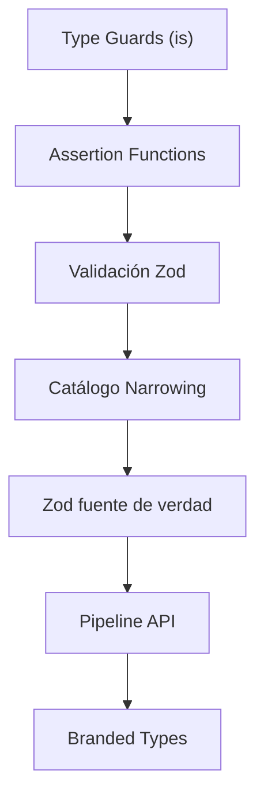
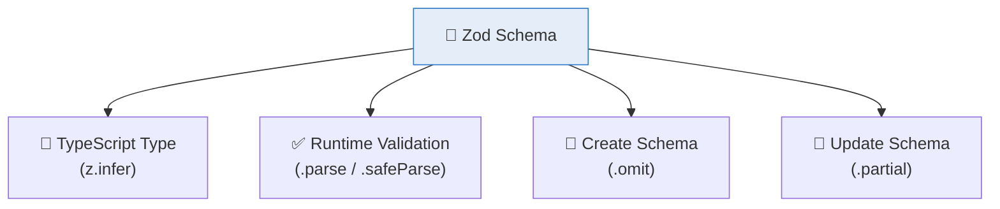

# :shield: Capítulo 12: Type Guards y Assertion Functions

<div class="chapter-meta">
  <span class="meta-item">🕐 3 horas</span>
  <span class="meta-item">📊 Nivel: Avanzado</span>
  <span class="meta-item">🎯 Semana 6</span>
</div>

<div class="chapter-objective">
  <span class="objective-icon">📌</span>
  <span class="objective-text">Al terminar este capítulo, dominarás type guards personalizados, assertion functions, y el patrón de narrowing exhaustivo — las técnicas para que TypeScript sepa EXACTAMENTE qué tipo tiene tu variable.</span>
</div>

<div class="chapter-map">
<h4>🗺️ Mapa del capítulo</h4>



</div>

!!! quote "Contexto"
    Los type guards son funciones que le dicen a TypeScript: "confía en mí, este valor es de ESTE tipo". Son esenciales para trabajar con **datos externos** como APIs, formularios o JSON.

---

<div class="concept-question">
<h4>🔍 Pregunta conceptual</h4>
<p>En el Capítulo 5 viste <code>typeof</code> y <code>in</code> para narrowing. Pero ¿qué pasa si necesitas una lógica más compleja para determinar el tipo? ¿Puedes crear tus propias "funciones de tipo"?</p>
</div>

## 12.1 Custom Type Guards (`is`)

```typescript
function esMesa(obj: unknown): obj is Mesa {  // (1)!
  return (
    typeof obj === "object" && obj !== null &&
    "número" in obj && "zona" in obj && "capacidad" in obj
  );
}

// Después del guard, TypeScript sabe el tipo
function procesar(dato: unknown) {
  if (esMesa(dato)) {
    console.log(dato.número); // ✅ TypeScript sabe que es Mesa
    console.log(dato.zona);   // ✅ Autocompletado funciona
  }
}
```

1. `obj is Mesa` es un **type predicate**: le dice a TS que si la función retorna `true`, el parámetro es de tipo `Mesa`.

<div class="misconception-box" markdown>
<h4>❌ Error común</h4>
<p><strong>Mito:</strong> "Los type guards solo funcionan con <code>typeof</code>"</p>
<p><strong>Realidad:</strong> Puedes crear type guards personalizados con el predicado <code>is</code>, assertion functions con <code>asserts</code>, usar <code>instanceof</code>, el operador <code>in</code>, comparaciones de igualdad, y discriminated unions. Los custom type guards son la forma más potente de narrowing.</p>
</div>

<div class="connection-box">
<span class="connection-icon">🔗</span>
<span>Recuerda del <a href='../05-uniones/'>Capítulo 5</a> el narrowing con <code>typeof</code> e <code>in</code>. Los type guards personalizados son la evolución: en vez de verificar propiedades inline, creas funciones reutilizables con <code>is</code>.</span>
</div>

<div class="micro-exercise">
<h4>🧪 Micro-ejercicio (2 min)</h4>
<p>Crea un type guard <code>esPlato(item: Plato | Mesa): item is Plato</code> que verifique si el objeto tiene la propiedad <code>precio</code>. Úsalo en un <code>if</code> para acceder a <code>item.precio</code> de forma segura.</p>
</div>

<div class="concept-question">
<h4>🔍 Pregunta conceptual</h4>
<p>¿Puede una función decirle a TypeScript "si esta función no lanza error, entonces el valor ES de tipo X"? Es como un <code>assert</code> de Python pero para tipos.</p>
</div>

## 12.2 Assertion Functions (`asserts`)

```typescript
function assertMesa(obj: unknown): asserts obj is Mesa {
  if (!esMesa(obj)) {
    throw new Error("El objeto no es una Mesa válida");
  }
}

// Después del assert, el tipo está narrowed
function procesarDato(dato: unknown) {
  assertMesa(dato);
  // A partir de aquí, dato es Mesa ✅
  console.log(dato.número);
}
```

<div class="pro-tip">
<h4>💡 Consejo Pro</h4>
<p>Combina assertion functions con validación de input: <code>function assertDefined&lt;T&gt;(value: T | null | undefined, msg: string): asserts value is T</code>. Úsala al inicio de funciones para eliminar <code>null</code> del tipo de una vez.</p>
</div>

## 12.3 Validación con Zod (recomendado)

!!! tip "Librería recomendada: Zod"
    Para validación robusta en producción, usa [Zod](https://zod.dev). Define un schema que sirve como **validador runtime Y tipo TypeScript** a la vez.

```typescript
import { z } from "zod";

// Schema = validador + tipo
const MesaSchema = z.object({
  id: z.number(),
  número: z.number().min(1),
  zona: z.enum(["interior", "terraza", "barra"]),
  capacidad: z.number().min(1).max(20),
  ocupada: z.boolean(),
});

// Tipo inferido automáticamente del schema
type Mesa = z.infer<typeof MesaSchema>;

// Validación segura
async function fetchMesas(): Promise<Mesa[]> {
  const res = await fetch("/api/mesas");
  const data = await res.json();
  return z.array(MesaSchema).parse(data); // Valida y tipa a la vez ✨
}
```

<div class="concept-question">
<h4>🔍 Pregunta conceptual</h4>
<p>Si tienes una unión con 5 variantes y manejas 4 en un switch, ¿cómo te aseguras de que no olvides la 5ª? ¿Puede TypeScript detectar este error?</p>
</div>

## 12.4 Todos los tipos de narrowing

TypeScript soporta múltiples formas de narrowing. Aquí va el catálogo completo:

=== "`typeof` guard"

    ```typescript
    function format(value: string | number): string {
      if (typeof value === "string") return value.toUpperCase();
      return value.toFixed(2);
    }
    ```

=== "`instanceof` guard"

    ```typescript
    function handleError(err: Error | string): string {
      if (err instanceof Error) return err.message;
      return err;
    }
    ```

=== "`in` operator"

    ```typescript
    function describir(obj: Mesa | Reserva): string {
      if ("capacidad" in obj) return `Mesa de ${obj.capacidad}`;
      return `Reserva de ${obj.nombre}`;
    }
    ```

=== "Equality narrowing"

    ```typescript
    function check(x: string | null): string {
      if (x !== null) return x.toUpperCase(); // string
      return "vacío";
    }
    ```

=== "Truthiness narrowing"

    ```typescript
    function greet(name?: string): string {
      if (name) return `Hola, ${name}`; // string (no undefined)
      return "Hola, anónimo";
    }
    ```

<div class="misconception-box">
<h4>⚠️ Errores comunes</h4>
<ul>
<li><span class="wrong">❌ Mito:</span> "Los type guards son solo <code>typeof</code>" → <span class="right">✅ Realidad:</span> <code>typeof</code> es el más básico. Puedes crear type guards personalizados con <code>is</code> que verifican CUALQUIER condición compleja.</li>
<li><span class="wrong">❌ Mito:</span> "Los type guards verifican tipos en runtime" → <span class="right">✅ Realidad:</span> Los type guards verifican en runtime pero INFORMAN al compilador en compilación. Son el puente entre ambos mundos.</li>
<li><span class="wrong">❌ Mito:</span> "El narrowing es automático siempre" → <span class="right">✅ Realidad:</span> TypeScript necesita patrones específicos para hacer narrowing. Un <code>if</code> con una condición compleja puede no ser reconocido — ahí necesitas un type guard explícito con <code>is</code>.</li>
</ul>
</div>

<div class="micro-exercise">
<h4>🧪 Micro-ejercicio (2 min)</h4>
<p>Añade una nueva variante <code>'cancelado'</code> a tu union <code>EstadoPedido</code>. ¿Qué error te da el <code>default: never</code> en tu switch? Así funciona la exhaustividad.</p>
</div>

<div class="pro-tip">
<h4>💡 Consejo Pro</h4>
<p>En MakeMenu, usamos type guards para validar datos de API: <code>function esPlatoValido(data: unknown): data is Plato</code>. Esto nos da seguridad de tipos en runtime Y compilación. Es el patrón "parse, don't validate".</p>
</div>

## 12.5 Zod como fuente de verdad

El patrón más profesional: definir schemas Zod que sean **la única fuente de tipos** en tu aplicación:

```typescript
import { z } from "zod";

// 1. Schema = fuente de verdad
const MesaSchema = z.object({
  id: z.number().int().positive(),
  número: z.number().min(1).max(100),
  zona: z.enum(["interior", "terraza", "barra"]),
  capacidad: z.number().min(1).max(20),
  ocupada: z.boolean().default(false),
});

// 2. Tipo derivado del schema (no manual)
type Mesa = z.infer<typeof MesaSchema>;

// 3. Schema para crear (sin id, generado por el servidor)
const MesaCreateSchema = MesaSchema.omit({ id: true });
type MesaCreate = z.infer<typeof MesaCreateSchema>;

// 4. Schema para actualizar (todo parcial)
const MesaUpdateSchema = MesaCreateSchema.partial();
type MesaUpdate = z.infer<typeof MesaUpdateSchema>;

// 5. Validación en API handlers
async function createMesa(req: Request, res: Response) {
  const result = MesaCreateSchema.safeParse(req.body); // (1)!
  if (!result.success) {
    return res.status(400).json({ errors: result.error.format() });
  }
  // result.data es MesaCreate con tipos verificados ✅
  const mesa = await db.mesa.create({ data: result.data });
  res.json(mesa);
}
```

<div class="micro-exercise" markdown>
<h4>🧪 Micro-ejercicio: Schema de pedido con Zod (3 min)</h4>
<p>Crea un schema <code>PedidoCreateSchema</code> con Zod que valide: <code>mesaId</code> (número positivo), <code>items</code> (array no vacío de objetos con <code>platoId: number</code> y <code>cantidad: number</code> entre 1 y 99), y <code>notas</code> (string opcional, máximo 200 caracteres). Deriva el tipo <code>PedidoCreate</code> del schema.</p>
</div>

??? success "Solución"
    ```typescript
    import { z } from "zod";

    const PedidoItemSchema = z.object({
      platoId: z.number().int().positive(),
      cantidad: z.number().int().min(1).max(99),
    });

    const PedidoCreateSchema = z.object({
      mesaId: z.number().int().positive(),
      items: z.array(PedidoItemSchema).nonempty(),
      notas: z.string().max(200).optional(),
    });

    type PedidoCreate = z.infer<typeof PedidoCreateSchema>;
    ```

1. `.safeParse()` retorna `{ success: true, data: T }` o `{ success: false, error: ZodError }`. Nunca lanza — usa el patrón Result.



<div class="comparison" markdown>
<div class="lang-box python" markdown>

#### :snake: En Python (Pydantic)

```python
from pydantic import BaseModel
class Mesa(BaseModel):
    número: int
    zona: str
    capacidad: int
# Tipo Y validación en uno
```

</div>
<div class="lang-box typescript" markdown>

#### 🔷 En TypeScript (Zod)

```typescript
const MesaSchema = z.object({...});
type Mesa = z.infer<typeof MesaSchema>;
```
Mismo concepto que Pydantic: schema → tipo + validación.

</div>
</div>

## 12.6 Pipeline de validación de API

Patrón completo para validar responses de API externas:

```typescript
import { z } from "zod";

// Schemas para la respuesta
const ApiErrorSchema = z.object({
  code: z.number(),
  message: z.string(),
});

function createApiSchema<T extends z.ZodType>(dataSchema: T) {
  return z.object({
    success: z.boolean(),
    data: dataSchema,
    timestamp: z.string().datetime(),
  });
}

const MesasApiSchema = createApiSchema(z.array(MesaSchema));

// Pipeline: fetch → validar → tipar
async function fetchMesasSeguro(): Promise<Mesa[]> {
  const response = await fetch("/api/mesas");

  if (!response.ok) {
    throw new Error(`HTTP ${response.status}`);
  }

  const json: unknown = await response.json();
  const result = MesasApiSchema.safeParse(json);

  if (!result.success) {
    console.error("API response inválida:", result.error.flatten());
    throw new Error("Respuesta de API inválida");
  }

  return result.data.data; // Mesa[] validado ✅
}
```

## 12.7 Branded types con validación

Combina branded types (Cap. 7) con type guards para crear tipos que solo se pueden crear mediante validación:

```typescript
type Email = string & { readonly __brand: "ValidatedEmail" };
type PositiveNumber = number & { readonly __brand: "Positive" };

function parseEmail(input: string): Email | null {
  const emailRegex = /^[^@]+@[^@]+\.[^@]+$/;
  return emailRegex.test(input) ? (input as Email) : null;
}

function parsePositive(input: number): PositiveNumber | null {
  return input > 0 ? (input as PositiveNumber) : null;
}

// Solo puedes crear un Email a través de parseEmail
function enviarNotificación(email: Email, msg: string): void {
  console.log(`Enviando "${msg}" a ${email}`);
}

const email = parseEmail("daniele@mail.com");
if (email) {
  enviarNotificación(email, "Tu mesa está lista"); // ✅
}
// enviarNotificación("random@string", "Hola"); // ❌ string ≠ Email
```

---

<div class="code-evolution">
<h4>📈 Evolución de código: validando respuestas de API</h4>

<div class="evolution-step" markdown>
<span class="step-label">v1 Novato — usando <code>as any</code> sin narrowing</span>

```typescript
// ❌ Sin type guards: accedes a propiedades sin saber el tipo real
async function procesarRespuesta(data: unknown) {
  if ((data as any).tipo === "plato") {
    console.log((data as any).precio);  // 😱 as any por todos lados
    console.log((data as any).nombre);  // ¿existe .nombre? Ni idea...
  }
}
```

</div>

<div class="evolution-step" markdown>
<span class="step-label">v2 Con type guards — custom guard con <code>is</code></span>

```typescript
// ✅ Mejor: type guard personalizado que verifica estructura
interface Plato { tipo: "plato"; nombre: string; precio: number }
interface Mesa  { tipo: "mesa";  número: number; zona: string }

function esPlato(data: unknown): data is Plato {
  return (
    typeof data === "object" && data !== null &&
    "tipo" in data && (data as any).tipo === "plato" &&
    "precio" in data && "nombre" in data
  );
}

async function procesarRespuesta(data: unknown) {
  if (esPlato(data)) {
    console.log(data.precio);  // ✅ TypeScript sabe que es Plato
    console.log(data.nombre);  // ✅ Autocompletado funciona
  }
}
```

</div>

<div class="evolution-step" markdown>
<span class="step-label">v3 Profesional — assertion functions + exhaustive matching</span>

```typescript
// ✅✅ Profesional: Zod + assertion + exhaustive check
import { z } from "zod";

const PlatoSchema = z.object({
  tipo: z.literal("plato"), nombre: z.string(), precio: z.number()
});
const MesaSchema = z.object({
  tipo: z.literal("mesa"), número: z.number(), zona: z.string()
});
const ItemSchema = z.discriminatedUnion("tipo", [PlatoSchema, MesaSchema]);
type Item = z.infer<typeof ItemSchema>;

function assertItem(data: unknown): asserts data is Item {
  ItemSchema.parse(data); // Lanza ZodError si no es válido
}

function assertNever(x: never): never {
  throw new Error(`Caso no manejado: ${JSON.stringify(x)}`);
}

function procesar(data: unknown): string {
  assertItem(data);
  // A partir de aquí, data es Item ✅
  switch (data.tipo) {
    case "plato": return `${data.nombre}: $${data.precio}`;
    case "mesa":  return `Mesa ${data.número} (${data.zona})`;
    default:      return assertNever(data); // Exhaustive check
  }
}
```

</div>
</div>

<div class="connection-box">
<span class="connection-icon">🔗</span>
<span>En el <a href='../13-type-level/'>Capítulo 13</a> llevarás el narrowing al nivel de tipos. Los conditional types hacen "narrowing" a nivel de tipos, no de valores.</span>
</div>

---

<div class="ejercicio-guiado">
<h4>🏋️ Ejercicio guiado</h4>

Vas a construir un validador de items del menú de MakeMenu que use type guards personalizados, assertion functions y un switch exhaustivo para procesar los distintos tipos de items de forma segura.

1. Define tres interfaces con una propiedad discriminante `tipo`: `PlatoMenu` con `tipo: "plato"`, `nombre` (string), `precio` (number) y `alergenos` (string[]); `BebidaMenu` con `tipo: "bebida"`, `nombre` (string), `precio` (number) y `tamanio` (`"pequeño" | "mediano" | "grande"`); y `PostreMenu` con `tipo: "postre"`, `nombre` (string), `precio` (number) y `calorias` (number). Crea la unión `ItemMenu = PlatoMenu | BebidaMenu | PostreMenu`.
2. Crea un type guard `esItemMenu(dato: unknown): dato is ItemMenu` que verifique que el objeto tiene `tipo`, `nombre` y `precio`, y que `tipo` sea uno de los tres valores válidos. Recuerda verificar `typeof dato === "object"` y `dato !== null`.
3. Crea una assertion function `assertItemMenu(dato: unknown): asserts dato is ItemMenu` que lance un `Error` descriptivo si el dato no es un item válido. Reutiliza el type guard del paso anterior.
4. Crea una función auxiliar `assertNever(x: never): never` que lance error. Luego escribe una función `calcularPrecioFinal(item: ItemMenu): number` que use un switch exhaustivo sobre `item.tipo`: los platos tienen un 10% de IVA, las bebidas un suplemento de 0.50 euros si son "grande", y los postres no tienen recargo.
5. Escribe una función `procesarPedido(datos: unknown[]): number` que reciba un array de datos desconocidos, use `assertItemMenu` para validar cada uno, llame a `calcularPrecioFinal` para obtener el precio, y devuelva el total del pedido.

??? success "Solución completa"
    ```typescript
    // Paso 1: Interfaces con discriminante
    interface PlatoMenu {
      tipo: "plato";
      nombre: string;
      precio: number;
      alergenos: string[];
    }

    interface BebidaMenu {
      tipo: "bebida";
      nombre: string;
      precio: number;
      tamanio: "pequeño" | "mediano" | "grande";
    }

    interface PostreMenu {
      tipo: "postre";
      nombre: string;
      precio: number;
      calorias: number;
    }

    type ItemMenu = PlatoMenu | BebidaMenu | PostreMenu;

    // Paso 2: Type guard
    function esItemMenu(dato: unknown): dato is ItemMenu {
      if (typeof dato !== "object" || dato === null) return false;
      if (!("tipo" in dato) || !("nombre" in dato) || !("precio" in dato)) return false;
      const obj = dato as Record<string, unknown>;
      return (
        typeof obj.nombre === "string" &&
        typeof obj.precio === "number" &&
        (obj.tipo === "plato" || obj.tipo === "bebida" || obj.tipo === "postre")
      );
    }

    // Paso 3: Assertion function
    function assertItemMenu(dato: unknown): asserts dato is ItemMenu {
      if (!esItemMenu(dato)) {
        throw new Error(
          `Item de menú inválido: ${JSON.stringify(dato)}`
        );
      }
    }

    // Paso 4: Switch exhaustivo
    function assertNever(x: never): never {
      throw new Error(`Caso no manejado: ${JSON.stringify(x)}`);
    }

    function calcularPrecioFinal(item: ItemMenu): number {
      switch (item.tipo) {
        case "plato":
          return item.precio * 1.10; // +10% IVA
        case "bebida":
          return item.tamanio === "grande"
            ? item.precio + 0.50
            : item.precio;
        case "postre":
          return item.precio; // Sin recargo
        default:
          return assertNever(item);
      }
    }

    // Paso 5: Procesar pedido completo
    function procesarPedido(datos: unknown[]): number {
      let total = 0;

      for (const dato of datos) {
        assertItemMenu(dato); // Lanza si no es válido
        total += calcularPrecioFinal(dato);
      }

      return Math.round(total * 100) / 100;
    }

    // Prueba
    const items: unknown[] = [
      { tipo: "plato", nombre: "Paella", precio: 16, alergenos: ["marisco"] },
      { tipo: "bebida", nombre: "Agua", precio: 2, tamanio: "grande" },
      { tipo: "postre", nombre: "Flan", precio: 5, calorias: 220 },
    ];

    const total = procesarPedido(items);
    console.log(`Total del pedido: ${total}€`);
    // Paella: 16 * 1.10 = 17.60
    // Agua grande: 2 + 0.50 = 2.50
    // Flan: 5.00
    // Total: 25.10€
    ```

</div>

<div class="real-errors">
<h4>🚨 Errores que vas a encontrar</h4>

**Error 1: Type guard que retorna `boolean` en vez de `obj is Tipo`**
```typescript
function esPlato(obj: unknown): boolean {
  return typeof obj === "object" && obj !== null && "precio" in obj;
}

function mostrar(dato: unknown) {
  if (esPlato(dato)) {
    console.log(dato.precio); // ← Error aquí
  }
}
```

```
Property 'precio' does not exist on type 'unknown'.
```

**¿Por qué?** Si el type guard retorna `boolean` en vez de `obj is Plato`, TypeScript no puede hacer narrowing. Sabe que la función devolvió `true`, pero no sabe qué implica eso para el tipo del parámetro.

**Solución:**
```typescript
function esPlato(obj: unknown): obj is Plato {
  return typeof obj === "object" && obj !== null && "precio" in obj;
}
```

**Error 2: Assertion function con la condición invertida**
```typescript
function assertString(val: unknown): asserts val is string {
  if (typeof val === "string") {
    throw new Error("No es string");
  }
}

const valor: unknown = 42;
assertString(valor); // No lanza... pero valor NO es string
console.log(valor.toUpperCase()); // 💥 Runtime error
```

```
TypeError: valor.toUpperCase is not a function
```

**¿Por qué?** La condición está invertida: lanza cuando el valor SI es string, y deja pasar cuando NO lo es. TypeScript confía en tu assertion function; si mientes, tendrás errores en runtime que el compilador no detecta.

**Solución:**
```typescript
function assertString(val: unknown): asserts val is string {
  if (typeof val !== "string") {
    throw new Error("No es string");
  }
}
```

**Error 3: Olvidar `obj !== null` en un type guard con `typeof "object"`**
```typescript
function esMesa(obj: unknown): obj is Mesa {
  return typeof obj === "object" && "número" in obj;
}

esMesa(null); // 💥 Runtime error
```

```
TypeError: Cannot use 'in' operator to search for 'número' in null
```

**¿Por qué?** En JavaScript, `typeof null === "object"` es `true` (un bug histórico del lenguaje). Sin la verificación `obj !== null`, el operador `in` se ejecuta sobre `null` y lanza en runtime.

**Solución:**
```typescript
function esMesa(obj: unknown): obj is Mesa {
  return typeof obj === "object" && obj !== null && "número" in obj;
}
```

**Error 4: Usar `as` en vez de un type guard — el "cast silencioso"**
```typescript
async function fetchMesas(): Promise<Mesa[]> {
  const res = await fetch("/api/mesas");
  const data = await res.json();
  return data as Mesa[]; // Sin validación real
}

const mesas = await fetchMesas();
console.log(mesas[0].capacidad); // 💥 Puede ser undefined si la API cambió
```

```
TypeError: Cannot read properties of undefined (reading 'capacidad')
```

**¿Por qué?** `as Mesa[]` es una aserción de tipo que solo existe en compilación. No válida nada en runtime. Si la API devuelve un formato diferente al esperado, TypeScript no te protege porque le dijiste "confía en mí".

**Solución:**
```typescript
import { z } from "zod";

const MesaSchema = z.object({
  número: z.number(),
  zona: z.string(),
  capacidad: z.number(),
  ocupada: z.boolean(),
});

async function fetchMesas(): Promise<Mesa[]> {
  const res = await fetch("/api/mesas");
  const data = await res.json();
  return z.array(MesaSchema).parse(data); // Validación real en runtime
}
```

</div>

<div class="checkpoint">
<h4>🏁 Checkpoint</h4>
<p>Si puedes: (1) crear type guards personalizados con <code>is</code>, (2) usar assertion functions con <code>asserts</code>, y (3) implementar exhaustive checks con <code>never</code> — dominas los type guards.</p>
</div>

<div class="mini-project">
<h4>🏗️ Mini-proyecto: Validador de pedidos de restaurante</h4>

Vas a construir un sistema de validación para los pedidos de un restaurante. Cada pedido puede contener platos, bebidas o postres, y necesitas type guards, assertion functions y validación con Zod para procesar cada tipo de forma segura.

**Paso 1 — Define los tipos y crea type guards personalizados**

Define una discriminated union `ItemPedido` con tres variantes (`plato`, `bebida`, `postre`) y crea un type guard para cada una.

```typescript
// Define las interfaces
interface Plato {
  tipo: "plato";
  nombre: string;
  precio: number;
  alergenos: string[];
}

interface Bebida {
  tipo: "bebida";
  nombre: string;
  precio: number;
  tamanio: "pequeño" | "mediano" | "grande";
}

interface Postre {
  tipo: "postre";
  nombre: string;
  precio: number;
  calorias: number;
}

type ItemPedido = Plato | Bebida | Postre;

// Crea type guards: esPlato, esBebida, esPostre
// que reciban `unknown` y retornen el predicado `is` correcto
```

??? success "Solución Paso 1"
    ```typescript
    function esPlato(obj: unknown): obj is Plato {
      return (
        typeof obj === "object" && obj !== null &&
        "tipo" in obj && (obj as any).tipo === "plato" &&
        "nombre" in obj && "precio" in obj && "alergenos" in obj &&
        Array.isArray((obj as any).alergenos)
      );
    }

    function esBebida(obj: unknown): obj is Bebida {
      return (
        typeof obj === "object" && obj !== null &&
        "tipo" in obj && (obj as any).tipo === "bebida" &&
        "nombre" in obj && "precio" in obj && "tamanio" in obj &&
        ["pequeño", "mediano", "grande"].includes((obj as any).tamanio)
      );
    }

    function esPostre(obj: unknown): obj is Postre {
      return (
        typeof obj === "object" && obj !== null &&
        "tipo" in obj && (obj as any).tipo === "postre" &&
        "nombre" in obj && "precio" in obj && "calorias" in obj &&
        typeof (obj as any).calorias === "number"
      );
    }
    ```

**Paso 2 — Crea una assertion function y un procesador exhaustivo**

Crea una assertion function `assertItemPedido` que valide que un dato `unknown` es un `ItemPedido`. Luego escribe una función `describirItem` que use un `switch` exhaustivo con `never` para generar una descripción de cada variante.

```typescript
// Assertion function que lanza si el dato no es un ItemPedido
function assertItemPedido(dato: unknown): asserts dato is ItemPedido {
  // Tu implementación aquí
}

// Función que describe cada item con switch exhaustivo
function describirItem(item: ItemPedido): string {
  // Tu implementación aquí
  // Usa switch sobre item.tipo
  // Incluye un default con assertNever para exhaustividad
}

function assertNever(x: never): never {
  throw new Error(`Variante no manejada: ${JSON.stringify(x)}`);
}
```

??? success "Solución Paso 2"
    ```typescript
    function assertItemPedido(dato: unknown): asserts dato is ItemPedido {
      if (esPlato(dato) || esBebida(dato) || esPostre(dato)) {
        return; // Es válido, no lanza
      }
      throw new Error(
        `El objeto no es un ItemPedido válido: ${JSON.stringify(dato)}`
      );
    }

    function assertNever(x: never): never {
      throw new Error(`Variante no manejada: ${JSON.stringify(x)}`);
    }

    function describirItem(item: ItemPedido): string {
      switch (item.tipo) {
        case "plato":
          return `🍽️ ${item.nombre} — $${item.precio} (alérgenos: ${item.alergenos.join(", ") || "ninguno"})`;
        case "bebida":
          return `🥤 ${item.nombre} (${item.tamanio}) — $${item.precio}`;
        case "postre":
          return `🍰 ${item.nombre} — $${item.precio} (${item.calorias} kcal)`;
        default:
          return assertNever(item);
      }
    }
    ```

**Paso 3 — Valida un pedido completo con Zod y calcula el total**

Crea schemas Zod para cada tipo de item y un schema `PedidoSchema` que represente un pedido completo (con id, items, mesa y fecha). Escribe una función que reciba datos `unknown` de una API, los valide y calcule el total del pedido.

```typescript
import { z } from "zod";

// Define los schemas Zod para Plato, Bebida, Postre
// Usa z.discriminatedUnion para ItemPedido
// Crea PedidoSchema con: id, items (array), mesa (number), fecha (string datetime)

// Función que válida y calcula
function procesarPedidoAPI(data: unknown): {
  pedidoId: number;
  mesa: number;
  items: string[];   // descripciones
  total: number;
} {
  // Valida con safeParse, calcula total, describe cada item
}
```

??? success "Solución Paso 3"
    ```typescript
    import { z } from "zod";

    const PlatoSchema = z.object({
      tipo: z.literal("plato"),
      nombre: z.string().min(1),
      precio: z.number().positive(),
      alergenos: z.array(z.string()),
    });

    const BebidaSchema = z.object({
      tipo: z.literal("bebida"),
      nombre: z.string().min(1),
      precio: z.number().positive(),
      tamanio: z.enum(["pequeño", "mediano", "grande"]),
    });

    const PostreSchema = z.object({
      tipo: z.literal("postre"),
      nombre: z.string().min(1),
      precio: z.number().positive(),
      calorias: z.number().nonnegative(),
    });

    const ItemPedidoSchema = z.discriminatedUnion("tipo", [
      PlatoSchema,
      BebidaSchema,
      PostreSchema,
    ]);

    const PedidoSchema = z.object({
      id: z.number().int().positive(),
      items: z.array(ItemPedidoSchema).min(1, "El pedido debe tener al menos 1 item"),
      mesa: z.number().int().positive(),
      fecha: z.string().datetime(),
    });

    type Pedido = z.infer<typeof PedidoSchema>;

    function procesarPedidoAPI(data: unknown): {
      pedidoId: number;
      mesa: number;
      items: string[];
      total: number;
    } {
      const result = PedidoSchema.safeParse(data);

      if (!result.success) {
        const errores = result.error.issues
          .map((i) => `${i.path.join(".")}: ${i.message}`)
          .join("; ");
        throw new Error(`Pedido inválido: ${errores}`);
      }

      const pedido = result.data;
      const total = pedido.items.reduce((sum, item) => sum + item.precio, 0);
      const descripciones = pedido.items.map(describirItem);

      return {
        pedidoId: pedido.id,
        mesa: pedido.mesa,
        items: descripciones,
        total: Math.round(total * 100) / 100,
      };
    }

    // Ejemplo de uso
    const datosAPI: unknown = {
      id: 42,
      mesa: 7,
      fecha: "2026-02-20T20:30:00Z",
      items: [
        { tipo: "plato", nombre: "Paella", precio: 18.5, alergenos: ["marisco"] },
        { tipo: "bebida", nombre: "Agua", precio: 2.0, tamanio: "grande" },
        { tipo: "postre", nombre: "Flan", precio: 5.5, calorias: 220 },
      ],
    };

    const resultado = procesarPedidoAPI(datosAPI);
    console.log(resultado);
    // {
    //   pedidoId: 42,
    //   mesa: 7,
    //   items: [
    //     "🍽️ Paella — $18.5 (alérgenos: marisco)",
    //     "🥤 Agua (grande) — $2",
    //     "🍰 Flan — $5.5 (220 kcal)"
    //   ],
    //   total: 26
    // }
    ```

</div>

## :link: Recursos

| Recurso | Enlace |
|---------|--------|
| Narrowing | [typescriptlang.org/.../narrowing](https://www.typescriptlang.org/docs/handbook/2/narrowing.html) |
| Zod | [zod.dev](https://zod.dev/) |
| Total TypeScript: Type Guards | [totaltypescript.com/type-predicates](https://www.totaltypescript.com/type-predicates) |

---

## 🎯 Ejercicios

??? question "Ejercicio 1: Type guard para Reserva"
    Crea un type guard `esReserva` y una assertion function `assertReserva`.

    ??? success "Solución"
        ```typescript
        function esReserva(obj: unknown): obj is Reserva {
          return (
            typeof obj === "object" && obj !== null &&
            "nombre" in obj && "personas" in obj &&
            typeof (obj as any).personas === "number"
          );
        }

        function assertReserva(obj: unknown): asserts obj is Reserva {
          if (!esReserva(obj)) {
            throw new Error("No es una Reserva válida");
          }
        }
        ```

??? question "Ejercicio 2: Zod schema completo para Reserva"
    Define un schema Zod para `Reserva` con validaciones: nombre no vacío, personas entre 1 y 20, hora con formato HH:MM, teléfono opcional. Deriva el tipo con `z.infer`.

    !!! tip "Pista"
        Usa `z.string().min(1)`, `z.number().min(1).max(20)`, `z.string().regex(/^\d{2}:\d{2}$/)` y `z.string().optional()`.

    ??? success "Solución"
        ```typescript
        import { z } from "zod";

        const ReservaSchema = z.object({
          id: z.number().int().positive(),
          nombre: z.string().min(1, "Nombre requerido"),
          personas: z.number().min(1).max(20),
          hora: z.string().regex(/^\d{2}:\d{2}$/, "Formato HH:MM"),
          mesa: z.number().positive(),
          telefono: z.string().optional(),
          comentarios: z.string().optional(),
        });

        type Reserva = z.infer<typeof ReservaSchema>;

        // Uso
        const result = ReservaSchema.safeParse({
          id: 1, nombre: "García", personas: 4,
          hora: "20:30", mesa: 5
        });
        if (result.success) {
          console.log(result.data.nombre); // ✅ string
        }
        ```

??? question "Ejercicio 3: Validador genérico con Zod"
    Crea una función genérica `validateApiResponse<T>(schema: ZodSchema<T>, data: unknown): Result<T, string>` que devuelva un Result pattern (Cap. 5) con los datos validados o un mensaje de error.

    !!! tip "Pista"
        Combina `schema.safeParse(data)` con el patrón Result.

    ??? success "Solución"
        ```typescript
        import { z, ZodSchema } from "zod";

        type Result<T, E> = { ok: true; value: T } | { ok: false; error: E };

        function validateApiResponse<T>(
          schema: ZodSchema<T>,
          data: unknown
        ): Result<T, string> {
          const result = schema.safeParse(data);
          if (result.success) {
            return { ok: true, value: result.data };
          }
          const errors = result.error.issues.map(i => i.message).join(", ");
          return { ok: false, error: errors };
        }

        // Uso
        const mesasResult = validateApiResponse(z.array(MesaSchema), apiData);
        if (mesasResult.ok) {
          console.log(mesasResult.value); // Mesa[] ✅
        } else {
          console.error(mesasResult.error); // string con errores
        }
        ```

??? question "Ejercicio 4: Branded Email con Zod"
    Crea un branded type `Email` que solo se pueda crear mediante un schema Zod que valide el formato. Crea una función `enviarCorreo` que solo acepte `Email`, no `string`.

    !!! tip "Pista"
        Usa `.transform()` en Zod para castear el resultado a tu branded type.

    ??? success "Solución"
        ```typescript
        type Email = string & { readonly __brand: "Email" };

        const EmailSchema = z.string()
          .email("Email inválido")
          .transform((val) => val as Email);

        function crearEmail(input: string): Email {
          return EmailSchema.parse(input); // Lanza si no es válido
        }

        function enviarCorreo(destino: Email, asunto: string): void {
          console.log(`📧 "${asunto}" → ${destino}`);
        }

        const email = crearEmail("daniele@mail.com"); // Email ✅
        enviarCorreo(email, "Reserva confirmada");
        // enviarCorreo("raw@string.com", "test");    // ❌ string ≠ Email
        ```

??? question "Ejercicio 5: Pipeline completo fetch → validate → use"
    Escribe una función `fetchAndValidate<T>(url: string, schema: ZodSchema<T>): Promise<T>` que haga fetch, valide con Zod y retorne el dato tipado. Maneja errores HTTP y de validación con mensajes claros.

    !!! tip "Pista"
        Primero verifica `response.ok`, luego usa `schema.parse()` sobre el JSON.

    ??? success "Solución"
        ```typescript
        import { z, ZodSchema } from "zod";

        async function fetchAndValidate<T>(
          url: string,
          schema: ZodSchema<T>
        ): Promise<T> {
          const response = await fetch(url);

          if (!response.ok) {
            throw new Error(`HTTP Error: ${response.status} ${response.statusText}`);
          }

          const json: unknown = await response.json();

          try {
            return schema.parse(json);
          } catch (err) {
            if (err instanceof z.ZodError) {
              const details = err.issues.map(i => `${i.path}: ${i.message}`);
              throw new Error(`Validation failed: ${details.join("; ")}`);
            }
            throw err;
          }
        }

        // Uso
        const mesas = await fetchAndValidate("/api/mesas", z.array(MesaSchema));
        // mesas es Mesa[] con tipos Y valores verificados ✅
        ```

---

## :brain: Flashcards de repaso

<div class="flashcard">
<div class="front">¿Diferencia entre type guard (<code>is</code>) y assertion function (<code>asserts</code>)?</div>
<div class="back">Type guard devuelve <code>boolean</code> y narrow en el <code>if</code>. Assertion function lanza si falla y narrow después de la llamada.</div>
</div>

<div class="flashcard">
<div class="front">¿Qué es Zod?</div>
<div class="back">Una librería de validación runtime para TypeScript. Define schemas que sirven como validador Y fuente de tipos (<code>z.infer</code>). Como Pydantic para TypeScript.</div>
</div>

<div class="flashcard">
<div class="front">¿Qué ventaja tiene <code>.safeParse()</code> sobre <code>.parse()</code>?</div>
<div class="back"><code>.parse()</code> lanza excepción si falla. <code>.safeParse()</code> retorna <code>{ success, data/error }</code> sin lanzar — sigue el patrón Result.</div>
</div>

<div class="flashcard">
<div class="front">¿Cómo derivar Create y Update schemas de un schema base en Zod?</div>
<div class="back"><code>Schema.omit({ id: true })</code> para Create (sin id). <code>Schema.partial()</code> para Update (todo opcional).</div>
</div>

<div class="flashcard">
<div class="front">¿Cuáles son los 5 tipos de narrowing nativos?</div>
<div class="back"><code>typeof</code>, <code>instanceof</code>, <code>in</code>, equality (<code>=== / !==</code>), truthiness (<code>if (x)</code>). Más custom guards con <code>is</code> y assertion functions con <code>asserts</code>.</div>
</div>

---

## :video_game: Quiz interactivo

<div class="quiz" data-quiz-id="ch12-q1">
<h4>Pregunta 1: ¿Cuál es la diferencia entre un type guard (<code>is</code>) y una assertion function (<code>asserts</code>)?</h4>
<button class="quiz-option" data-correct="false">Son sinónimos — hacen lo mismo</button>
<button class="quiz-option" data-correct="false"><code>is</code> lanza error, <code>asserts</code> retorna boolean</button>
<button class="quiz-option" data-correct="true"><code>is</code> retorna boolean y estrecha en el <code>if</code>. <code>asserts</code> lanza error o no retorna — estrecha después de la llamada</button>
<button class="quiz-option" data-correct="false"><code>asserts</code> solo funciona con <code>typeof</code></button>
<div class="quiz-feedback" data-correct="¡Correcto! Un type guard (`is`) retorna true/false y estrecha dentro del `if`. Una assertion function (`asserts`) lanza si falla — si la ejecución continúa, el tipo queda estrechado." data-incorrect="Incorrecto. `is` retorna boolean, estrechando en un `if`. `asserts` lanza si la condición no se cumple — si la ejecución sigue, TypeScript sabe que el tipo es el correcto."></div>
</div>

<div class="quiz" data-quiz-id="ch12-q2">
<h4>Pregunta 2: ¿Qué es Zod y qué problema resuelve?</h4>
<button class="quiz-option" data-correct="false">Un framework de testing para TypeScript</button>
<button class="quiz-option" data-correct="true">Una librería de validación runtime que genera tipos estáticos automáticamente con <code>z.infer</code></button>
<button class="quiz-option" data-correct="false">Un compilador alternativo a <code>tsc</code></button>
<button class="quiz-option" data-correct="false">Un linter para detectar errores de tipo</button>
<div class="quiz-feedback" data-correct="¡Correcto! Zod válida datos en runtime Y genera tipos TypeScript, eliminando la duplicación entre validación y tipado. Es como Pydantic para TypeScript." data-incorrect="Incorrecto. Zod es una librería de validación que genera tipos con `z.infer`. Define un schema una vez, obtén validación runtime + tipos estáticos."></div>
</div>

<div class="quiz" data-quiz-id="ch12-q3">
<h4>Pregunta 3: ¿Cuál es la ventaja de <code>.safeParse()</code> sobre <code>.parse()</code> en Zod?</h4>
<button class="quiz-option" data-correct="false">Es más rápido</button>
<button class="quiz-option" data-correct="false">Acepta más tipos de datos</button>
<button class="quiz-option" data-correct="true">Retorna un objeto <code>{ success, data/error }</code> en vez de lanzar una excepción</button>
<button class="quiz-option" data-correct="false">Valida de forma asíncrona</button>
<div class="quiz-feedback" data-correct="¡Correcto! `.safeParse()` sigue el patrón Result — nunca lanza. Retorna `{ success: true, data }` o `{ success: false, error }`, ideal para manejar errores de validación sin try/catch." data-incorrect="Incorrecto. `.parse()` lanza excepción si falla. `.safeParse()` retorna `{ success, data/error }` sin lanzar — patrón Result."></div>
</div>

---

## :bug: Ejercicio de depuración

Encuentra los **3 errores** en este código:

```typescript
// ❌ Este código tiene 3 errores. ¡Encuéntralos!

// Type guard para validar Mesa
function esMesa(obj: unknown): boolean {  // 🤔 ¿Tipo de retorno correcto?
  return (
    typeof obj === "object" && obj !== null &&
    "número" in obj && "zona" in obj
  );
}

function procesarDato(dato: unknown) {
  if (esMesa(dato)) {
    console.log(dato.número);  // 🤔 ¿TypeScript sabe que dato es Mesa?
  }
}

// Assertion function
function assertEsString(val: unknown): asserts val is string {
  if (typeof val === "string") {  // 🤔 ¿Cuándo debería lanzar?
    throw new Error("No es string");
  }
}

// Narrowing con discriminated union
type Resultado =
  | { tipo: "ok"; datos: string[] }
  | { tipo: "error"; mensaje: string };

function mostrar(r: Resultado) {
  if (r.tipo === "ok") {
    console.log(r.mensaje);  // 🤔 ¿Existe mensaje en el caso ok?
  }
}
```

??? success "Solución"
    ```typescript
    // ✅ Código corregido

    // Type guard para validar Mesa
    function esMesa(obj: unknown): obj is Mesa {  // ✅ Fix 1: retornar `obj is Mesa`, no `boolean`
      return (
        typeof obj === "object" && obj !== null &&
        "número" in obj && "zona" in obj
      );
    }

    function procesarDato(dato: unknown) {
      if (esMesa(dato)) {
        console.log(dato.número);  // ✅ Ahora TypeScript sabe que dato es Mesa
      }
    }

    // Assertion function
    function assertEsString(val: unknown): asserts val is string {
      if (typeof val !== "string") {  // ✅ Fix 2: lanzar cuando NO es string (condición invertida)
        throw new Error("No es string");
      }
    }

    // Narrowing con discriminated union
    type Resultado =
      | { tipo: "ok"; datos: string[] }
      | { tipo: "error"; mensaje: string };

    function mostrar(r: Resultado) {
      if (r.tipo === "ok") {
        console.log(r.datos);  // ✅ Fix 3: en el caso "ok", la propiedad es `datos`, no `mensaje`
      }
    }
    ```

---

## ✅ Autoevaluación del capítulo

<div class="self-check" markdown>
<h4>📋 Verifica tu comprensión</h4>
<label><input type="checkbox"> Puedo escribir custom type guards con <code>is</code></label>
<label><input type="checkbox"> Entiendo la diferencia entre type guards y assertion functions</label>
<label><input type="checkbox"> Sé usar los 5 tipos de narrowing nativos (typeof, instanceof, in, ===, truthiness)</label>
<label><input type="checkbox"> Puedo usar Zod para validar datos externos con <code>z.infer</code></label>
<label><input type="checkbox"> He completado todos los ejercicios del capítulo</label>
</div>
