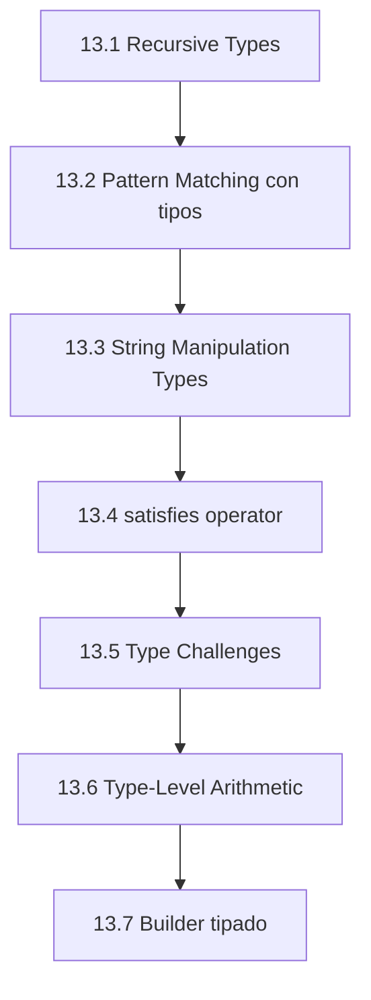
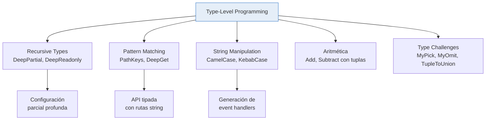

# :brain: Capítulo 13: Type-Level Programming

<div class="chapter-meta">
  <span class="meta-item">🕐 4-5 horas</span>
  <span class="meta-item">📊 Nivel: Experto</span>
  <span class="meta-item">🎯 Semana 7</span>
</div>

<div class="chapter-objective">
  <span class="objective-icon">📌</span>
  <span class="objective-text">Al terminar este capítulo, sabrás programar a nivel de tipos: tipos recursivos, pattern matching con infer, template literal types avanzados, y crear tus propios utility types — el nivel más avanzado de TypeScript.</span>
</div>

<div class="chapter-map">



</div>

!!! quote "Contexto"
    Bienvenido al nivel más avanzado de TypeScript. Aquí los tipos dejan de ser anotaciones y se convierten en un **lenguaje de programación en sí mismo**. Puedes hacer recursión, pattern matching y cálculos complejos... todo a nivel de tipos, sin ejecutar una sola línea de código.

<div class="connection-box" markdown>
:link: **Conexión con el Capítulo 11** — Recuerda del <a href='../11-tipos-avanzados/'>Capítulo 11</a> los mapped y conditional types. Este capítulo los lleva al extremo: combinamos recursión, inferencia y template literals para crear tipos que *computan* en lugar de solo *anotar*.
</div>

---

<div class="concept-question" markdown>
🤔 **Pregunta para reflexionar** — ¿Puede un tipo referenciarse a sí mismo? Si tienes un menú con categorías que contienen subcategorías, ¿cómo representarías esa estructura recursiva en el sistema de tipos?
</div>

## 13.1 Recursive Types

Los tipos recursivos se referencian a sí mismos. Son esenciales para modelar estructuras de profundidad arbitraria:

```typescript
// JSON value: tipo recursivo que modela cualquier JSON válido
type JSONValue =
  | string | number | boolean | null
  | JSONValue[]
  | { [key: string]: JSONValue };

// Ejemplo: esto compila
const config: JSONValue = {
  nombre: "MakeMenu",
  version: 2,
  features: ["mesas", "reservas"],
  db: { host: "localhost", port: 5432 },  // Anidamiento arbitrario ✅
};
```

### DeepPartial y DeepReadonly

```typescript
// Hace TODAS las propiedades opcionales en profundidad
type DeepPartial<T> = T extends object
  ? { [K in keyof T]?: DeepPartial<T[K]> }
  : T;

// Hace TODO readonly en profundidad
type DeepReadonly<T> = T extends object
  ? { readonly [K in keyof T]: DeepReadonly<T[K]> }
  : T;

// Ejemplo: configuración parcial profunda
interface AppConfig {
  db: { host: string; port: number; ssl: { cert: string; key: string } };
  api: { url: string; timeout: number };
}

type PartialConfig = DeepPartial<AppConfig>;
// Ahora puedes hacer:
const override: PartialConfig = {
  db: { ssl: { cert: "nuevo-cert" } },  // ✅ Solo lo que cambias
};
```

### DeepRequired — el inverso

```typescript
// Elimina TODOS los opcionales en profundidad
type DeepRequired<T> = T extends object
  ? { [K in keyof T]-?: DeepRequired<T[K]> }
  : T;

type Config = DeepRequired<PartialConfig>;
// Ahora todo es obligatorio otra vez, incluso propiedades anidadas
```

<div class="micro-exercise" markdown>
:pencil2: **Micro-ejercicio** — Crea un tipo recursivo `DeepReadonly<T>` que haga readonly TODAS las propiedades anidadas de un objeto. Pruébalo con un objeto de 3 niveles de anidamiento, por ejemplo:

```typescript
interface PruebaAnidada {
  nivel1: {
    nivel2: {
      nivel3: string;
    };
    valor: number;
  };
}

type Resultado = DeepReadonly<PruebaAnidada>;
// ¿Puedes asignar a resultado.nivel1.nivel2.nivel3? ¿Por qué no?
```
</div>

## 13.2 Pattern Matching con tipos

TypeScript permite hacer pattern matching a nivel de tipos usando `infer` en conditional types. Es como un `match`/`switch` pero para la estructura de tipos:

```typescript
// Extraer paths de un objeto anidado (como "db.host", "api.url")
type PathKeys<T> = T extends object
  ? {
      [K in keyof T & string]: K | `${K}.${PathKeys<T[K]>}`
    }[keyof T & string]
  : never;

interface Restaurante {
  nombre: string;
  dirección: { calle: string; ciudad: string; cp: number };
  menu: { platos: string[] };
}

type Paths = PathKeys<Restaurante>;
// "nombre" | "dirección" | "dirección.calle" | "dirección.ciudad"
// | "dirección.cp" | "menu" | "menu.platos"
```

### DeepGet — acceder por ruta string

```typescript
// Dado un Path string como "db.host", extrae el tipo de esa propiedad
type DeepGet<T, Path extends string> =
  Path extends `${infer Key}.${infer Rest}`  // (1)!
    ? Key extends keyof T
      ? DeepGet<T[Key], Rest>  // Recursa con el resto del path
      : never
    : Path extends keyof T
      ? T[Path]  // Caso base: una sola clave
      : never;

type DbHost = DeepGet<AppConfig, "db.host">;           // string
type SslCert = DeepGet<AppConfig, "db.ssl.cert">;       // string
type ApiTimeout = DeepGet<AppConfig, "api.timeout">;    // number
type Invalid = DeepGet<AppConfig, "db.noexiste">;       // never
```

1. Template literal types + `infer` = pattern matching sobre strings. `"db.host"` se descompone en `Key = "db"` y `Rest = "host"`.

### Función tipada con DeepGet

```typescript
function getDeep<T, P extends string & PathKeys<T>>(
  obj: T,
  path: P
): DeepGet<T, P> {
  return path.split(".").reduce((acc: any, key) => acc[key], obj);
}

const restaurante: Restaurante = {
  nombre: "La Tasca",
  dirección: { calle: "Gran Vía 42", ciudad: "Madrid", cp: 28013 },
  menu: { platos: ["tortilla", "croquetas"] },
};

const ciudad = getDeep(restaurante, "dirección.ciudad"); // string ✅
// getDeep(restaurante, "dirección.pais"); // ❌ Error: no existe esa ruta
```

<div class="concept-question" markdown>
🤔 **Pregunta para reflexionar** — ¿Puede TypeScript crear tipos a partir de TRANSFORMAR strings? Por ejemplo, ¿convertir automáticamente `'crearPlato'` en `'onCrearPlato'`? ¿Y si pudieras generar TODAS las combinaciones de rutas HTTP válidas a partir de métodos y endpoints?
</div>

## 13.3 String Manipulation Types

TypeScript tiene 4 utility types nativos para manipular strings a nivel de tipo:

```typescript
type A = Uppercase<"hola">;      // "HOLA"
type B = Lowercase<"HOLA">;      // "hola"
type C = Capitalize<"hola">;     // "Hola"
type D = Uncapitalize<"Hola">;   // "hola"
```

### Construir tipos complejos con template literals

```typescript
// Generar nombres de event handlers
type EventName<T extends string> = `on${Capitalize<T>}`;

type Click = EventName<"click">;     // "onClick"
type Submit = EventName<"submit">;   // "onSubmit"

// CSS property builder
type CSSProperty = "margin" | "padding";
type CSSDirection = "top" | "right" | "bottom" | "left";
type CSSRule = `${CSSProperty}-${CSSDirection}`;
// "margin-top" | "margin-right" | "margin-bottom" | "margin-left"
// | "padding-top" | "padding-right" | ...  (8 combinaciones)

// HTTP methods tipados
type Method = "GET" | "POST" | "PUT" | "DELETE";
type Endpoint = "/mesas" | "/reservas" | "/pedidos";
type ApiRoute = `${Method} ${Endpoint}`;
// "GET /mesas" | "GET /reservas" | "POST /mesas" | ... (12 combinaciones)
```

<div class="micro-exercise" markdown>
:pencil2: **Micro-ejercicio** — Crea un tipo `EventHandler<T extends string> = `on${Capitalize<T>}`` y prueba que funciona:

```typescript
type EventHandler<T extends string> = `on${Capitalize<T>}`;

type Handler1 = EventHandler<"click">;    // debería ser "onClick"
type Handler2 = EventHandler<"submit">;   // debería ser "onSubmit"
type Handler3 = EventHandler<"resize">;   // debería ser "onResize"

// Bonus: crea un tipo que genere handlers para TODAS estas acciones a la vez
type AccionesMenu = "crearPlato" | "editarPlato" | "eliminarPlato";
type MenuHandlers = EventHandler<AccionesMenu>;
// ¿Cuántos tipos genera? ¿Cuáles son?
```
</div>

### CamelCase desde kebab-case

```typescript
// Convierte "mi-propiedad-genial" → "miPropiedadGenial" a nivel de tipo
type CamelCase<S extends string> =
  S extends `${infer Head}-${infer Tail}`
    ? `${Lowercase<Head>}${CamelCase<Capitalize<Tail>>}`
    : S;

type A = CamelCase<"background-color">;   // "backgroundColor"
type B = CamelCase<"border-top-width">;   // "borderTopWidth"
type C = CamelCase<"display">;            // "display" (sin cambio)
```

### KebabCase desde camelCase

```typescript
// Convierte "backgroundColor" → "background-color"
type KebabCase<S extends string> =
  S extends `${infer Head}${infer Tail}`
    ? Head extends Uppercase<Head>
      ? Head extends Lowercase<Head>  // Caracteres no alfabéticos
        ? `${Head}${KebabCase<Tail>}`
        : `-${Lowercase<Head>}${KebabCase<Tail>}`
      : `${Head}${KebabCase<Tail>}`
    : S;

type X = KebabCase<"backgroundColor">;    // "background-color"
type Y = KebabCase<"borderTopWidth">;     // "border-top-width"
```

<div class="concept-question" markdown>
🤔 **Pregunta para reflexionar** — Si tuvieras un objeto con eventos (`onClick`, `onSubmit`, `onResize`), ¿podría TypeScript extraer automáticamente los nombres de eventos sin el prefijo `on`? Por ejemplo, ¿obtener `"click" | "submit" | "resize"` a partir de las claves del objeto?
</div>

## 13.4 `satisfies` operator (TS 5.0+)

`satisfies` verifica que un valor cumple un tipo **sin ampliar** el tipo inferido. A diferencia de la anotación `: Type`, preserva los tipos literales:

```typescript
// ❌ Con anotación de tipo: pierde los literales
const config1: Record<string, string | number> = {
  apiUrl: "https://api.makemenu.com",
  maxMesas: 50,
};
config1.apiUrl; // string | number — se pierde el tipo exacto

// ✅ Con satisfies: verifica Y preserva literales
const config2 = {
  apiUrl: "https://api.makemenu.com",
  maxMesas: 50,
  zonas: ["interior", "terraza"] as const,
} satisfies Record<string, unknown>;

config2.apiUrl;     // "https://api.makemenu.com" (literal exacto)
config2.maxMesas;   // 50 (literal numérico)
config2.zonas;      // readonly ["interior", "terraza"]

// ✅ Errores en tiempo de compilación si no cumple:
const config3 = {
  apiUrl: "https://api.makemenu.com",
  maxMesas: "cincuenta",  // ❌ Error si el tipo lo requiere number
} satisfies { apiUrl: string; maxMesas: number };
```

### `satisfies` con tipos complejos

```typescript
type ColorMap = Record<string, [number, number, number] | string>;

// Sin satisfies: no puedes usar métodos de array en las tuplas
const colors1: ColorMap = {
  rojo: [255, 0, 0],
  verde: "#00ff00",
};
colors1.rojo.map; // ❌ Error: Property 'map' does not exist on [number, number, number] | string

// Con satisfies: TypeScript recuerda qué es qué
const colors2 = {
  rojo: [255, 0, 0],
  verde: "#00ff00",
} satisfies ColorMap;
colors2.rojo.map(x => x); // ✅ TypeScript sabe que es [number, number, number]
colors2.verde.toUpperCase(); // ✅ TypeScript sabe que es string
```

<div class="micro-exercise" markdown>
<h4>🧪 Micro-ejercicio: Configuración con satisfies (3 min)</h4>
<p>Define un objeto <code>rutas</code> con las claves <code>"mesas"</code>, <code>"pedidos"</code> y <code>"platos"</code>, cada una con un string que empiece por <code>/api/</code>. Usa <code>satisfies Record&lt;string, string&gt;</code> para que TypeScript verifique la estructura pero preserve los tipos literales. Luego comprueba que <code>rutas.mesas</code> tiene el tipo literal exacto (no solo <code>string</code>).</p>
</div>

??? success "Solución"
    ```typescript
    const rutas = {
      mesas: "/api/mesas",
      pedidos: "/api/pedidos",
      platos: "/api/platos",
    } satisfies Record<string, string>;

    // rutas.mesas es "/api/mesas" (tipo literal), no string
    type RutaMesas = typeof rutas.mesas; // "/api/mesas"
    ```

## 13.5 Type Challenges: tu gimnasio de tipos

Los **[Type Challenges](https://github.com/type-challenges/type-challenges)** son el mejor recurso para dominar type-level programming. Aquí implementamos algunos clásicos:

| Nivel | Ejemplos | Objetivo semanal |
|:------|:---------|:-----------------|
| :green_circle: Easy | `MyPick`, `Readonly`, `First of Array`, `Tuple to Object` | 5 por semana |
| :yellow_circle: Medium | `Get Return Type`, `DeepReadonly`, `Chainable Options` | 3 por semana |
| :red_circle: Hard | `Union to Intersection`, `String to Union`, `CamelCase` | 1 por semana |
| :skull: Extreme | `JSON Parser`, `Binary Addition` | Para presumir |

### MyPick — reimplementar Pick

```typescript
// Pick<T, K>: selecciona solo las claves K de T
type MyPick<T, K extends keyof T> = {
  [P in K]: T[P];
};

// Test
interface Mesa {
  id: number;
  número: number;
  zona: string;
  capacidad: number;
  ocupada: boolean;
}

type MesaBasic = MyPick<Mesa, "número" | "zona">;
// { número: number; zona: string }
```

### MyOmit — reimplementar Omit

```typescript
// Omit<T, K>: excluye las claves K de T
type MyOmit<T, K extends keyof T> = {
  [P in keyof T as P extends K ? never : P]: T[P];  // (1)!
};

type MesaSinId = MyOmit<Mesa, "id">;
// { número: number; zona: string; capacidad: number; ocupada: boolean }
```

1. Usamos key remapping con `as` y `never` para filtrar. Si `P extends K`, la clave desaparece.

### TupleToUnion

```typescript
// Convierte una tupla en una union de sus elementos
type TupleToUnion<T extends any[]> = T[number];

type Zonas = TupleToUnion<["interior", "terraza", "barra"]>;
// "interior" | "terraza" | "barra"
```

### TupleToObject

```typescript
// Convierte una tupla de strings en un objeto con esas claves
type TupleToObject<T extends readonly string[]> = {
  [K in T[number]]: K;
};

const zonas = ["interior", "terraza", "barra"] as const;
type ZonaMap = TupleToObject<typeof zonas>;
// { interior: "interior"; terraza: "terraza"; barra: "barra" }
```

### UnionToIntersection (avanzado)

```typescript
// Convierte A | B | C → A & B & C
// Usa la contravarianza de parámetros de función
type UnionToIntersection<U> =
  (U extends any ? (k: U) => void : never) extends
  (k: infer I) => void
    ? I
    : never;

type A = { name: string };
type B = { age: number };
type C = { email: string };

type ABC = UnionToIntersection<A | B | C>;
// { name: string } & { age: number } & { email: string }
```

!!! warning "¿Por qué funciona UnionToIntersection?"
    Se basa en la **contravarianza** de los parámetros de función. Cuando TypeScript infiere el tipo de un parámetro que podría ser múltiples tipos (de una union distribuida), los combina con intersección (`&`) porque un parámetro de función debe aceptar TODOS los posibles argumentos.

## 13.6 Type-Level Arithmetic (conceptual)

TypeScript no tiene operadores aritméticos a nivel de tipo, pero puedes simular operaciones usando tuplas:

```typescript
// Representar números como longitud de tuplas
type BuildTuple<N extends number, T extends any[] = []> =
  T["length"] extends N ? T : BuildTuple<N, [...T, any]>;

// Suma: concatenar tuplas y obtener longitud
type Add<A extends number, B extends number> =
  [...BuildTuple<A>, ...BuildTuple<B>]["length"];

type Sum = Add<3, 4>;  // 7

// Resta (solo positivos): quitar elementos del principio
type Subtract<A extends number, B extends number> =
  BuildTuple<A> extends [...BuildTuple<B>, ...infer Rest]
    ? Rest["length"]
    : never;

type Diff = Subtract<7, 3>;  // 4
```

!!! note "Límite de recursión"
    TypeScript tiene un límite de ~1000 niveles de recursión en tipos. Esto significa que la aritmética de tuplas funciona para números pequeños (~999 máximo). Para números más grandes, necesitarías técnicas más avanzadas como aritmética binaria.

## 13.7 Type-Level Pattern: Builder tipado

Un patrón avanzado es crear builders que rastrean su estado en el sistema de tipos:

```typescript
// Builder que verifica en compilación que se llamaron todos los métodos requeridos
type RequiredFields = "nombre" | "capacidad" | "zona";

type MesaBuilder<Set extends string = never> = {
  setNombre(nombre: string): MesaBuilder<Set | "nombre">;
  setCapacidad(cap: number): MesaBuilder<Set | "capacidad">;
  setZona(zona: string): MesaBuilder<Set | "zona">;
  setOcupada(ocupada: boolean): MesaBuilder<Set>;
  // build() solo existe si TODOS los campos requeridos están set
  build: RequiredFields extends Set ? () => Mesa : never;  // (1)!
};
```

1. `build` solo es invocable (`() => Mesa`) cuando `Set` incluye todas las `RequiredFields`. Si faltan campos, `build` es `never` y da error de compilación.

```typescript
// ✅ Compila: todos los campos requeridos
declare const builder: MesaBuilder;
builder
  .setNombre("Mesa VIP")
  .setCapacidad(8)
  .setZona("terraza")
  .build();  // ✅ build() existe

// ❌ No compila: falta "zona"
builder
  .setNombre("Mesa VIP")
  .setCapacidad(8)
  .build();  // ❌ build es `never`
```

<div class="misconception-box" markdown>
:warning: **Conceptos erróneos comunes sobre Type-Level Programming**

| Mito | Realidad |
|:-----|:---------|
| "Type-level programming es solo académico" | Librerías como **Zod**, **tRPC** y **Prisma** usan type-level programming EXTENSIVAMENTE. Es lo que hace que su DX (Developer Experience) sea mágica — autocompletado perfecto, validación en compilación, y tipos que se infieren de schemas. |
| "Los tipos recursivos causan stack overflow" | TypeScript tiene un límite de recursión (normalmente ~50 para tipos condicionales distributivos, ~999 para otros). Para tipos más profundos, usa **tail-call optimization** con acumuladores a nivel de tipos, igual que en programación funcional. |
| "No necesito esto para el día a día" | Probablemente no **CREARÁS** estos tipos a diario, pero necesitas **ENTENDERLOS** para usar Zod, tRPC, Prisma, y para leer type errors de librerías avanzadas. Si no entiendes `infer` ni los conditional types, los errores de estas librerías serán incomprensibles. |
</div>

<div class="code-evolution" markdown>
:chart_with_upwards_trend: **Evolución de código: Type safety en rutas de API**

=== "v1: Novato"

    ```typescript
    // ❌ Strings sin tipar — cualquier error de escritura pasa desapercibido
    async function fetchData(endpoint: string) {
      const response = await fetch(endpoint);
      return response.json();
    }

    // Esto compila pero la URL está mal escrita:
    fetchData("/api/platos");      // ✅ Correcto
    fetchData("/api/platoss");     // ✅ Compila... pero falla en runtime 💥
    fetchData("/aip/platos");      // ✅ Compila... pero falla en runtime 💥
    ```

=== "v2: Con tipos"

    ```typescript
    // ⚠️ Mejor: union de strings literales, pero mantenimiento manual
    type Route = "/api/platos" | "/api/mesas" | "/api/reservas" | "/api/pedidos";

    async function fetchData(endpoint: Route) {
      const response = await fetch(endpoint);
      return response.json();
    }

    fetchData("/api/platos");      // ✅ Correcto
    fetchData("/api/platoss");     // ❌ Error en compilación
    // Problema: si añades una entidad, debes actualizar Route manualmente
    ```

=== "v3: Profesional"

    ```typescript
    // ✅ Template literal types generan rutas automáticamente
    type Entity = "platos" | "mesas" | "reservas" | "pedidos";
    type Version = "v1" | "v2";
    type ApiRoute = `/api/${Version}/${Entity}`;
    // Genera 8 combinaciones automáticamente:
    // "/api/v1/platos" | "/api/v1/mesas" | "/api/v2/platos" | ...

    type Method = "GET" | "POST" | "PUT" | "DELETE";
    type TypedRequest = `${Method} ${ApiRoute}`;
    // Genera 32 combinaciones: "GET /api/v1/platos" | "POST /api/v1/mesas" | ...

    // Añadir una nueva entidad = UNA línea, y TODAS las rutas se actualizan
    ```
</div>

!!! tip "Pro tip: Template Literal Types en producción"
    En MakeMenu, usamos template literal types para tipar las rutas de la API: `type ApiRoute = `/api/${Version}/${Resource}``{.ts}. Esto hace que SOLO las rutas válidas compilen. Si un desarrollador escribe mal una ruta, el compilador se lo dice antes de que llegue a producción.

<div class="pro-tip" markdown>
⭐ **Consejo Pro** — En producción, usa `satisfies` + template literal types para crear APIs typesafe sin generación de código. En MakeMenu, definimos las rutas una vez como `type Entity = "platos" | "mesas" | "reservas"` y TypeScript genera automáticamente TODAS las combinaciones de `Method + Version + Entity`. Si un dev escribe mal una ruta, el compilador se lo dice — cero errores 404 en producción por typos.
</div>

!!! tip "Pro tip: Documenta y testea tus utility types"
    Cuando crees utility types complejos, documéntalos con JSDoc y tests de tipo (`@ts-expect-error`). Si tu tipo falla en un edge case, el test te lo dirá:

    ```typescript
    /**
     * Convierte camelCase a kebab-case a nivel de tipo.
     * @example type R = KebabCase<"backgroundColor">; // "background-color"
     */
    type KebabCase<S extends string> = /* ... */;

    // Tests de tipo:
    type _test1 = KebabCase<"backgroundColor">;  // "background-color"
    // @ts-expect-error — debería fallar con números
    type _test2 = KebabCase<42>;
    ```



<div class="comparison" markdown>
<div class="lang-box python" markdown>

#### :snake: En Python

```python
# Python no puede computar tipos en compilación.
# Los type hints son anotaciones estáticas simples.
# No hay condicionales, recursión ni pattern matching
# a nivel de tipos. Herramientas como mypy
# verifican, pero no computan tipos nuevos.
```

</div>
<div class="lang-box typescript" markdown>

#### 🔷 En TypeScript

```typescript
// TypeScript tiene un sistema de tipos Turing-completo.
// Puedes: recursión, condicionales, pattern matching,
// manipulación de strings, aritmética... todo sin
// ejecutar código. Es un lenguaje dentro del lenguaje.
type Result = Add<3, 4>; // 7, calculado en compilación
```

</div>
</div>

---

<div class="ejercicio-guiado">
<h4>🏋️ Ejercicio guiado</h4>

Vas a construir un sistema de tipos que genere automáticamente los nombres de eventos y handlers para las acciones del menú de MakeMenu, usando template literal types, `infer` y tipos recursivos.

1. Define un tipo `AccionMenu` como union literal con las acciones: `"crearPlato"`, `"editarPlato"`, `"eliminarPlato"`, `"verPedido"` y `"cerrarMesa"`.
2. Crea un tipo `EventName<T>` que dado un string genere el nombre del evento con prefijo `on` y la primera letra en mayúscula (por ejemplo, `"crearPlato"` se convierte en `"onCrearPlato"`).
3. Crea un tipo `HandlerMap<T>` usando mapped types que, dada una union de acciones, genere un objeto donde cada clave es el nombre del evento (con `EventName`) y el valor es una función `() => void`.
4. Crea un tipo `ExtraerAccion<T>` que dado un string con formato `"onXxx"` extraiga la acción original sin el prefijo `on` y con la primera letra en minúscula, usando `infer` y `Uncapitalize`.
5. Define un tipo `MenuConfig` que use `satisfies` para verificar que un objeto cumple `HandlerMap<AccionMenu>` sin perder los tipos literales.
6. Verifica que `ExtraerAccion<"onCrearPlato">` devuelve `"crearPlato"` y que `ExtraerAccion<"onCerrarMesa">` devuelve `"cerrarMesa"`.

??? success "Solución completa"
    ```typescript
    // Paso 1: Acciones del menú
    type AccionMenu = "crearPlato" | "editarPlato" | "eliminarPlato" | "verPedido" | "cerrarMesa";

    // Paso 2: Generar nombre de evento
    type EventName<T extends string> = `on${Capitalize<T>}`;

    // Paso 3: Mapa de handlers
    type HandlerMap<T extends string> = {
      [K in T as EventName<K>]: () => void;
    };

    // Paso 4: Extraer acción desde nombre de evento
    type ExtraerAccion<T extends string> =
      T extends `on${infer Accion}`
        ? Uncapitalize<Accion>
        : never;

    // Paso 5: Configuración con satisfies
    const menuConfig = {
      onCrearPlato: () => console.log("Crear plato"),
      onEditarPlato: () => console.log("Editar plato"),
      onEliminarPlato: () => console.log("Eliminar plato"),
      onVerPedido: () => console.log("Ver pedido"),
      onCerrarMesa: () => console.log("Cerrar mesa"),
    } satisfies HandlerMap<AccionMenu>;

    // Paso 6: Verificación
    type Test1 = ExtraerAccion<"onCrearPlato">;  // "crearPlato" ✅
    type Test2 = ExtraerAccion<"onCerrarMesa">;  // "cerrarMesa" ✅

    // Tipo generado por HandlerMap<AccionMenu>:
    // {
    //   onCrearPlato: () => void;
    //   onEditarPlato: () => void;
    //   onEliminarPlato: () => void;
    //   onVerPedido: () => void;
    //   onCerrarMesa: () => void;
    // }
    ```

</div>

<div class="real-errors">
<h4>🚨 Errores que vas a encontrar</h4>

**Error 1: Tipo recursivo sin caso base — recursión infinita**
```typescript
// Intentas hacer DeepPartial pero olvidas frenar la recursión en tipos primitivos
type DeepPartial<T> = {
  [K in keyof T]?: DeepPartial<T[K]>;
};
```
```
Type instantiation is excessively deep and possibly infinite. ts(2589)
```
**¿Por qué?** Sin la condición `T extends object`, el tipo recursa infinitamente incluso sobre `string`, `number`, etc., porque TypeScript intenta mapear sus propiedades internas (como `.length`, `.toString`).
**Solución:**
```typescript
type DeepPartial<T> = T extends object
  ? { [K in keyof T]?: DeepPartial<T[K]> }
  : T;  // Caso base: devolver el primitivo sin recursar
```

**Error 2: `infer` usado fuera de un conditional type**
```typescript
// Intentas usar infer directamente en un tipo alias
type ReturnOf<T> = T extends (...args: any[]) => infer R;
```
```
'infer' declarations are only permitted in the 'extends' clause of a conditional type. ts(1338)
```
**¿Por qué?** `infer` solo puede aparecer dentro de la rama `extends` de un conditional type (`T extends ... ? ... : ...`). Sin las ramas `true`/`false`, TypeScript no sabe qué hacer con la variable inferida.
**Solución:**
```typescript
type ReturnOf<T> = T extends (...args: any[]) => infer R ? R : never;
```

**Error 3: Template literal type con tipo no string/number**
```typescript
interface Config {
  db: { host: string };
  api: { url: string };
}

// Intentas generar paths pero K incluye symbol
type Paths<T> = {
  [K in keyof T]: K | `${K}.${Paths<T[K]>}`;
}[keyof T];
```
```
Type 'K' is not assignable to type 'string | number | bigint | boolean | null | undefined'.
  Type 'string | number | symbol' is not assignable to type 'string | number | bigint | boolean | null | undefined'.
    Type 'symbol' is not assignable to type 'string | number | bigint | boolean | null | undefined'. ts(2322)
```
**¿Por qué?** `keyof T` incluye `string | number | symbol`, pero los template literal types solo aceptan `string | number | bigint | boolean | null | undefined`. Los `symbol` no se pueden interpolar en un string.
**Solución:**
```typescript
type Paths<T> = T extends object
  ? {
      [K in keyof T & string]: K | `${K}.${Paths<T[K]>}`;
    }[keyof T & string]  // Filtrar solo claves string con "& string"
  : never;
```

**Error 4: `satisfies` confundido con anotación de tipo — tipo demasiado amplio**
```typescript
const rutas = {
  inicio: "/",
  platos: "/api/platos",
  mesas: "/api/mesas",
} satisfies Record<string, string>;

// Más adelante intentas usar el valor literal...
type RutaPlatos = typeof rutas.platos;
// Esperas: "/api/platos"
// Obtienes: string  ← ¡No preservó el literal!
```
```
// No hay error de compilación, pero el tipo es más amplio de lo esperado
```
**¿Por qué?** Aunque `satisfies` preserva los tipos inferidos, si el objeto se declaró con `let` o si las propiedades se reasignaron, TypeScript amplia los literales a `string`. Además, sin `as const`, los valores de un objeto se infieren como `string`, no como literales.
**Solución:**
```typescript
const rutas = {
  inicio: "/",
  platos: "/api/platos",
  mesas: "/api/mesas",
} as const satisfies Record<string, string>;

type RutaPlatos = typeof rutas.platos; // "/api/platos" ✅
```

</div>

<div class="checkpoint">
<h4>🏁 Checkpoint</h4>
<p>Si puedes: (1) crear tipos recursivos con caso base y caso recursivo, (2) usar <code>infer</code> para pattern matching en conditional types, y (3) construir template literal types que generan combinaciones automáticamente — has completado la <strong>Parte III</strong> del libro y eres un usuario avanzado de TypeScript. Los capítulos siguientes refinan estos superpoderes con varianza, tipos nominales y patrones arquitectónicos.</p>
</div>

<div class="mini-project">
<h4>🏗️ Mini-proyecto: API Router Type-Safe</h4>

Vas a construir un sistema de tipos que genera automáticamente rutas de API tipadas, válida los paths en compilación y extrae los parámetros dinámicos de cada ruta. Todo a nivel de tipos, sin runtime.

**Paso 1 — Define las entidades y genera rutas automáticamente con template literal types**
```typescript
// Define las entidades de tu aplicación de restaurante
type Entity = "platos" | "mesas" | "reservas";
type Method = "GET" | "POST" | "PUT" | "DELETE";

// TODO: Crea un tipo ApiRoute que genere TODAS las combinaciones
// de rutas con el formato "/api/<entity>" y "/api/<entity>/:id"
// Resultado esperado: "/api/platos" | "/api/platos/:id" | "/api/mesas" | ...
type ApiRoute = /* tu implementación */;

// TODO: Crea un tipo TypedRequest que combine Method + ApiRoute
// Resultado: "GET /api/platos" | "POST /api/platos/:id" | ...
type TypedRequest = /* tu implementación */;
```

??? success "Solución Paso 1"
    ```typescript
    type Entity = "platos" | "mesas" | "reservas";
    type Method = "GET" | "POST" | "PUT" | "DELETE";

    type ApiRoute = `/api/${Entity}` | `/api/${Entity}/:id`;
    // Genera 6 rutas: "/api/platos" | "/api/platos/:id" | "/api/mesas" | ...

    type TypedRequest = `${Method} ${ApiRoute}`;
    // Genera 24 combinaciones: "GET /api/platos" | "POST /api/platos/:id" | ...
    ```

**Paso 2 — Extrae los parámetros dinámicos de una ruta usando `infer`**
```typescript
// TODO: Crea un tipo ExtractParams que dado un path como "/api/platos/:id/reviews/:reviewId"
// extraiga los parámetros dinámicos (los que empiezan con ":") como una union
// ExtractParams<"/api/platos/:id/reviews/:reviewId"> = "id" | "reviewId"
// Pista: usa template literals + infer para detectar segmentos que empiezan con ":"
type ExtractParams<T extends string> = /* tu implementación */;

// Tests:
type Test1 = ExtractParams<"/api/platos/:id">;                    // "id"
type Test2 = ExtractParams<"/api/platos/:id/reviews/:reviewId">;  // "id" | "reviewId"
type Test3 = ExtractParams<"/api/platos">;                        // never
```

??? success "Solución Paso 2"
    ```typescript
    type ExtractParams<T extends string> =
      T extends `${string}/:${infer Param}/${infer Rest}`
        ? Param | ExtractParams<`/${Rest}`>
        : T extends `${string}/:${infer Param}`
          ? Param
          : never;

    type Test1 = ExtractParams<"/api/platos/:id">;                    // "id"
    type Test2 = ExtractParams<"/api/platos/:id/reviews/:reviewId">;  // "id" | "reviewId"
    type Test3 = ExtractParams<"/api/platos">;                        // never
    ```

**Paso 3 — Construye el handler tipado completo que conecta ruta, parámetros y respuesta**
```typescript
// TODO: Crea una interfaz RouteConfig que mapee cada ruta a su tipo de respuesta
// y una función createRouter que:
// 1. Solo acepte rutas válidas (TypedRequest)
// 2. Provea los parámetros extraídos como un objeto tipado
// 3. Devuelva el tipo de respuesta correcto

interface Plato { id: number; nombre: string; precio: number; }
interface Mesa  { id: number; número: number; zona: string; }

// Mapa de respuestas por entidad
type ResponseMap = {
  platos: Plato;
  mesas: Mesa;
};

// TODO: Crea un tipo que extraiga la entidad de una ruta
// ExtractEntity<"/api/platos/:id"> = "platos"
type ExtractEntity<T extends string> = /* tu implementación */;

// TODO: Crea la función tipada
declare function handleRequest<R extends ApiRoute>(
  route: R,
  params: ExtractParams<R> extends never
    ? {}
    : Record<ExtractParams<R>, string>
): ExtractEntity<R> extends keyof ResponseMap
  ? ResponseMap[ExtractEntity<R>]
  : unknown;
```

??? success "Solución Paso 3"
    ```typescript
    interface Plato { id: number; nombre: string; precio: number; }
    interface Mesa  { id: number; número: number; zona: string; }

    type ResponseMap = {
      platos: Plato;
      mesas: Mesa;
    };

    type ExtractEntity<T extends string> =
      T extends `/api/${infer E}/${string}` ? E
      : T extends `/api/${infer E}` ? E
      : never;

    declare function handleRequest<R extends ApiRoute>(
      route: R,
      params: ExtractParams<R> extends never
        ? {}
        : Record<ExtractParams<R>, string>
    ): ExtractEntity<R> extends keyof ResponseMap
      ? ResponseMap[ExtractEntity<R>]
      : unknown;

    // Uso:
    const plato = handleRequest("/api/platos/:id", { id: "42" });
    //    ^? Plato ✅

    const mesa = handleRequest("/api/mesas", {});
    //    ^? Mesa ✅

    // handleRequest("/api/platos/:id", {});
    // ❌ Error: Property 'id' is missing

    // handleRequest("/api/inexistente", {});
    // ❌ Error: no es una ApiRoute válida
    ```

</div>

<div class="connection-box" markdown>
:link: **Hacia el Capítulo 17** — En el <a href='../17-varianza-nominal/'>Capítulo 17</a> verás varianza y tipos nominales. Los conceptos de type-level programming que acabas de aprender se combinan con varianza para crear sistemas de tipos ultra-seguros que previenen errores lógicos, no solo errores de forma.
</div>

## :link: Recursos

| Recurso | Enlace |
|---------|--------|
| ⭐ Type Challenges | [github.com/type-challenges](https://github.com/type-challenges/type-challenges) |
| Template Literal Types | [typescriptlang.org/.../template-literal-types](https://www.typescriptlang.org/docs/handbook/2/template-literal-types.html) |
| Conditional Types | [typescriptlang.org/.../conditional-types](https://www.typescriptlang.org/docs/handbook/2/conditional-types.html) |
| Matt Pocock: Wizardry | [totaltypescript.com](https://www.totaltypescript.com/) |

---

## 🎯 Ejercicios

??? question "Ejercicio 1: Implementa MyReadonly"
    Crea tu propia versión de `Readonly<T>` sin usar el utility type nativo.

    ??? success "Solución"
        ```typescript
        type MyReadonly<T> = {
          readonly [K in keyof T]: T[K];
        };

        // Test
        type MesaRO = MyReadonly<Mesa>;
        const mesa: MesaRO = {
          id: 1, número: 5, zona: "terraza",
          capacidad: 4, ocupada: false,
        };
        // mesa.ocupada = true;  // ❌ Error: cannot assign to readonly property
        ```

??? question "Ejercicio 2: First y Last de una tupla"
    Extrae el primer y último elemento de una tupla como tipo.

    !!! tip "Pista"
        Para `Last`, usa `[...any[], infer L]` para capturar el último elemento.

    ??? success "Solución"
        ```typescript
        type First<T extends any[]> = T extends [infer F, ...any[]] ? F : never;
        type Last<T extends any[]> = T extends [...any[], infer L] ? L : never;

        type A = First<[1, 2, 3]>;    // 1
        type B = Last<[1, 2, 3]>;     // 3
        type C = First<["a", "b"]>;   // "a"
        type D = Last<["a", "b"]>;    // "b"
        type E = First<[]>;           // never
        type F = Last<[]>;            // never
        ```

??? question "Ejercicio 3: StringToUnion"
    Crea un tipo `StringToUnion<S>` que convierta un string literal en una union de sus caracteres. Por ejemplo, `StringToUnion<"abc">` debe ser `"a" | "b" | "c"`.

    !!! tip "Pista"
        Usa template literal + `infer` para extraer el primer carácter y recursa con el resto.

    ??? success "Solución"
        ```typescript
        type StringToUnion<S extends string> =
          S extends `${infer First}${infer Rest}`
            ? First | StringToUnion<Rest>
            : never;

        type A = StringToUnion<"abc">;    // "a" | "b" | "c"
        type B = StringToUnion<"hello">;  // "h" | "e" | "l" | "o"
        type C = StringToUnion<"">;       // never
        ```

??? question "Ejercicio 4: DeepGet tipado"
    Implementa `DeepGet<T, Path>` que, dado un objeto y una ruta string con puntos, devuelva el tipo de la propiedad anidada. Luego crea una función `get()` que la use.

    !!! tip "Pista"
        Usa template literal `${infer Key}.${infer Rest}` para descomponer el path y recursa.

    ??? success "Solución"
        ```typescript
        type DeepGet<T, Path extends string> =
          Path extends `${infer Key}.${infer Rest}`
            ? Key extends keyof T
              ? DeepGet<T[Key], Rest>
              : never
            : Path extends keyof T
              ? T[Path]
              : never;

        // Función que usa DeepGet para inferir el retorno
        function get<T, P extends string>(obj: T, path: P): DeepGet<T, P> {
          return path.split(".").reduce((acc: any, key) => acc?.[key], obj);
        }

        interface Config {
          db: { host: string; port: number };
          api: { url: string; timeout: number };
        }

        declare const config: Config;
        const host = get(config, "db.host");       // string ✅
        const timeout = get(config, "api.timeout"); // number ✅
        ```

??? question "Ejercicio 5: CamelToSnake"
    Crea un tipo `CamelToSnake<S>` que convierta camelCase a snake_case a nivel de tipo. `"backgroundColor"` → `"background_color"`.

    !!! tip "Pista"
        Detecta letras mayúsculas con `Head extends Uppercase<Head>` y añade `_` antes. Cuidado: la primera letra no debe llevar `_` delante.

    ??? success "Solución"
        ```typescript
        // Helper: convierte desde la segunda letra en adelante
        type CamelToSnakeInner<S extends string> =
          S extends `${infer Head}${infer Tail}`
            ? Head extends Uppercase<Head>
              ? Head extends Lowercase<Head>
                ? `${Head}${CamelToSnakeInner<Tail>}`
                : `_${Lowercase<Head>}${CamelToSnakeInner<Tail>}`
              : `${Head}${CamelToSnakeInner<Tail>}`
            : S;

        // Wrapper: la primera letra nunca lleva _
        type CamelToSnake<S extends string> =
          S extends `${infer Head}${infer Tail}`
            ? `${Lowercase<Head>}${CamelToSnakeInner<Tail>}`
            : S;

        type A = CamelToSnake<"backgroundColor">;   // "background_color"
        type B = CamelToSnake<"borderTopWidth">;     // "border_top_width"
        type C = CamelToSnake<"fontSize">;           // "font_size"
        type D = CamelToSnake<"display">;            // "display"
        ```

---

## :brain: Flashcards de repaso

<div class="flashcard">
<div class="front">¿Qué es un tipo recursivo en TypeScript?</div>
<div class="back">Un tipo que se referencia a sí mismo en su definición. Ejemplo: <code>type DeepPartial&lt;T&gt; = T extends object ? { [K in keyof T]?: DeepPartial&lt;T[K]&gt; } : T</code>. Útil para estructuras de profundidad arbitraria como JSON, árboles, o configuraciones anidadas.</div>
</div>

<div class="flashcard">
<div class="front">¿Cómo funciona PathKeys para extraer rutas de un objeto?</div>
<div class="back">Itera recursivamente sobre las claves de un objeto. Para cada clave <code>K</code>, genera <code>K</code> (la clave directa) y <code>`${K}.${PathKeys<T[K]>}`</code> (claves anidadas con punto). El resultado es una union de todas las rutas posibles.</div>
</div>

<div class="flashcard">
<div class="front">¿Cuáles son los 4 string manipulation types nativos?</div>
<div class="back"><code>Uppercase&lt;"hola"&gt;</code> → <code>"HOLA"</code>, <code>Lowercase&lt;"HOLA"&gt;</code> → <code>"hola"</code>, <code>Capitalize&lt;"hola"&gt;</code> → <code>"Hola"</code>, <code>Uncapitalize&lt;"Hola"&gt;</code> → <code>"hola"</code>. Se combinan con template literal types para generar nombres de funciones, eventos, etc.</div>
</div>

<div class="flashcard">
<div class="front">¿Qué diferencia hay entre <code>satisfies</code> y una anotación de tipo <code>: Type</code>?</div>
<div class="back"><code>: Type</code> amplia el tipo (pierdes literales). <code>satisfies Type</code> verifica que el valor cumple el tipo pero <strong>preserva</strong> el tipo inferido exacto. Ejemplo: <code>{ url: "https://..." } satisfies Record&lt;string, unknown&gt;</code> mantiene <code>url</code> como string literal.</div>
</div>

<div class="flashcard">
<div class="front">¿Cómo se hace aritmética a nivel de tipos?</div>
<div class="back">Usando tuplas como representación de números. Se construye una tupla de longitud N con <code>BuildTuple&lt;N&gt;</code>, luego se concatenan tuplas para sumar (<code>[...A, ...B]["length"]</code>) o se usa <code>infer Rest</code> para restar. Límite práctico: ~999 por la profundidad de recursión.</div>
</div>

---

## :video_game: Quiz interactivo

<div class="quiz" data-quiz-id="ch13-q1">
<h4>Pregunta 1: ¿Cómo funciona <code>infer</code> en un conditional type?</h4>
<button class="quiz-option" data-correct="false">Declara un tipo genérico global</button>
<button class="quiz-option" data-correct="true">Captura (extrae) una parte del tipo en la rama <code>true</code> del conditional</button>
<button class="quiz-option" data-correct="false">Es un alias para <code>typeof</code> a nivel de tipos</button>
<button class="quiz-option" data-correct="false">Solo funciona con arrays</button>
<div class="quiz-feedback" data-correct="¡Correcto! `infer R` dentro de `T extends ... ? R : never` captura la parte del tipo que coincide con la posición de R. Es como pattern matching para tipos." data-incorrect="Incorrecto. `infer` captura (extrae) una parte del tipo en la rama true de un conditional type. Es pattern matching para tipos."></div>
</div>

<div class="quiz" data-quiz-id="ch13-q2">
<h4>Pregunta 2: ¿Cuál es el límite práctico de recursión en tipos de TypeScript?</h4>
<button class="quiz-option" data-correct="false">10 niveles</button>
<button class="quiz-option" data-correct="false">100 niveles</button>
<button class="quiz-option" data-correct="true">~999 niveles (límite de profundidad del compilador)</button>
<button class="quiz-option" data-correct="false">Sin límite — es Turing-complete</button>
<div class="quiz-feedback" data-correct="¡Correcto! TypeScript tiene un límite de ~999 niveles de recursión en tipos. Aunque el sistema de tipos es Turing-complete en teoría, tiene este límite práctico." data-incorrect="Incorrecto. Aunque TypeScript es Turing-complete a nivel de tipos, el compilador tiene un límite práctico de ~999 niveles de recursión."></div>
</div>

<div class="quiz" data-quiz-id="ch13-q3">
<h4>Pregunta 3: ¿Qué hace <code>satisfies</code> que una anotación de tipo <code>: Type</code> no hace?</h4>
<button class="quiz-option" data-correct="false">Valida en runtime</button>
<button class="quiz-option" data-correct="true">Verifica que el valor cumple el tipo pero <strong>preserva el tipo inferido exacto</strong> (no lo amplía)</button>
<button class="quiz-option" data-correct="false">Hace el tipo readonly automáticamente</button>
<button class="quiz-option" data-correct="false">Es equivalente a un type assertion (<code>as Type</code>)</button>
<div class="quiz-feedback" data-correct="¡Correcto! `: Type` amplía el tipo (pierdes literales). `satisfies Type` verifica compatibilidad pero preserva el tipo inferido exacto, incluyendo literales." data-incorrect="Incorrecto. `satisfies` verifica que el valor cumple el tipo, pero preserva el tipo inferido exacto. `: Type` amplía el tipo y puedes perder información de tipo (como literales)."></div>
</div>

---

## :bug: Ejercicio de depuración

Encuentra los **3 errores** en este código:

```typescript
// ❌ Este código tiene 3 errores. ¡Encuéntralos!

// 1. Recursive type para aplanar arrays
type Flatten<T> = T extends Array<infer U> ? Flatten<U> : T;
type Test1 = Flatten<number[][]>;  // ¿Qué da? ✅ Esto está bien

// 2. Extraer tipo de retorno de una Promise
type UnwrapPromise<T> = T extends Promise<infer U> ? U : T;
type Test2 = UnwrapPromise<Promise<Promise<string>>>;  // 🤔 ¿Da string o Promise<string>?

// 3. String manipulation type
type CamelToSnake<S extends string> =
  S extends `${infer Head}${infer Tail}`
    ? Tail extends Capitalize<Tail>
      ? `${Lowercase<Head>}_${CamelToSnake<Tail>}`  // 🤔 ¿Funciona para "onClick"?
      : `${Head}${CamelToSnake<Tail>}`
    : S;

type Test3 = CamelToSnake<"onClick">;  // 🤔 ¿Qué resultado da?

// 4. Aritmética con tuplas
type Add<A extends number, B extends number> =
  [...BuildTuple<A>, ...BuildTuple<B>]["length"];

type BuildTuple<N extends number, T extends any[] = []> =
  T["length"] extends N ? T : BuildTuple<N, [...T, any]>;

type Sum = Add<3, 4>;  // ¿Da 7? ✅
type BigSum = Add<999, 1>;  // 🤔 ¿Funciona?
```

??? success "Solución"
    ```typescript
    // ✅ Código corregido

    // 1. Flatten — está correcto, es recursivo y aplana completamente
    type Flatten<T> = T extends Array<infer U> ? Flatten<U> : T;
    type Test1 = Flatten<number[][]>;  // ✅ number

    // 2. UnwrapPromise — solo desenvuelve UN nivel
    type UnwrapPromise<T> = T extends Promise<infer U> ? U : T;
    type Test2 = UnwrapPromise<Promise<Promise<string>>>;
    // ✅ Fix 1: Da Promise<string>, NO string. Para desenvolver todo, usar recursión:
    type DeepUnwrapPromise<T> = T extends Promise<infer U> ? DeepUnwrapPromise<U> : T;
    // O mejor: usar el utility type nativo Awaited<T>
    type Test2Fixed = Awaited<Promise<Promise<string>>>;  // string

    // 3. CamelToSnake — la lógica de detección de mayúsculas es incorrecta
    // ✅ Fix 2: El approach carácter-por-carácter con Capitalize<Tail> no funciona correctamente
    // porque "nClick" → Capitalize<"nClick"> = "NClick" ≠ "nClick", así que no detecta bien.
    // Versión corregida:
    type CamelToSnake<S extends string> =
      S extends `${infer Head}${infer C}${infer Tail}`
        ? C extends Uppercase<C>
          ? C extends Lowercase<C>
            ? `${Head}${C}${CamelToSnake<Tail>}`
            : `${Lowercase<Head>}_${Lowercase<C>}${CamelToSnake<Tail>}`
          : `${Head}${CamelToSnake<`${C}${Tail}`>}`
        : Lowercase<S>;

    type Test3 = CamelToSnake<"onClick">;  // "on_click"

    // 4. Aritmética — BigSum excede el límite de recursión
    // ✅ Fix 3: Add<999, 1> excede el límite de ~999 niveles de recursión
    // BuildTuple<999> ya está al límite; BuildTuple<1000> falla
    type Sum = Add<3, 4>;  // ✅ 7
    // type BigSum = Add<999, 1>;  // ❌ Error: Type instantiation is excessively deep
    type SafeSum = Add<500, 499>;  // ✅ 999 — dentro del límite
    ```

---

## ✅ Autoevaluación del capítulo

<div class="self-check" markdown>
<h4>📋 Verifica tu comprensión</h4>
<label><input type="checkbox"> Puedo crear tipos recursivos con caso base y caso recursivo</label>
<label><input type="checkbox"> Entiendo <code>infer</code> para pattern matching en conditional types</label>
<label><input type="checkbox"> Sé crear string manipulation types con template literals</label>
<label><input type="checkbox"> Entiendo el límite de recursión (~999) y cómo evitarlo</label>
<label><input type="checkbox"> Conozco la diferencia entre <code>satisfies</code> y anotación de tipo</label>
<label><input type="checkbox"> He completado todos los ejercicios del capítulo</label>
</div>
