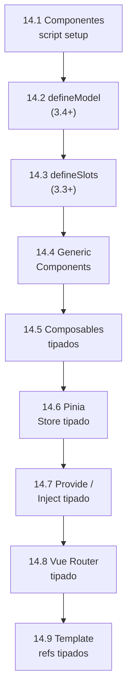
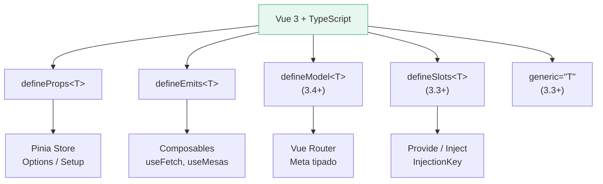

# :large_green_circle: Capítulo 14: TypeScript con Vue 3

<div class="chapter-meta">
  <span class="meta-item">🕐 4-5 horas</span>
  <span class="meta-item">📊 Nivel: Avanzado</span>
  <span class="meta-item">🎯 Semana 7</span>
</div>

<div class="chapter-objective">
  <span class="objective-icon">📌</span>
  <span class="objective-text">Al terminar este capítulo, sabrás integrar TypeScript con Vue 3: Composition API tipada, defineProps/defineEmits, composables tipados, y Pinia con tipos — el frontend de MakeMenu.</span>
</div>

<div class="chapter-map">



</div>

!!! quote "Contexto"
    Este capítulo es especialmente relevante para tu proyecto **MakeMenu**. Vue 3 fue reescrito en TypeScript y tiene soporte de primera clase. Vamos a ver cómo aprovechar TypeScript al máximo con la Composition API, Pinia y componentes.

---

<div class="concept-question">
<strong>🤔 Pregunta para reflexionar:</strong> En Python/Django, los templates HTML no tienen verificación de tipos. ¿Cómo crees que Vue 3 integra TypeScript en los componentes? ¿Los templates también se verifican?
</div>

## 14.1 Componentes con `<script setup lang="ts">`

```vue title="components/MesaCard.vue"
<script setup lang="ts">
import { ref, computed } from 'vue'
import type { Mesa } from '@/types'

// Props tipadas con interface
interface Props {
  mesa: Mesa
  editable?: boolean
}
const props = withDefaults(defineProps<Props>(), {
  editable: false
})

// Emits tipados — cada evento con su firma exacta
const emit = defineEmits<{
  (e: 'actualizar', mesa: Mesa): void
  (e: 'eliminar', id: number): void
  (e: 'cambiarEstado', id: number, estado: string): void
}>()

// Refs tipados automáticamente
const mesaLocal = ref<Mesa>({ ...props.mesa })
const cargando = ref(false) // boolean inferido

// Computed tipado — retorno inferido como boolean
const estaDisponible = computed(() => !mesaLocal.value.ocupada)

function guardar() {
  emit('actualizar', mesaLocal.value)
}
</script>

<template>
  <div :class="{ 'mesa--ocupada': !estaDisponible }">
    <h3>Mesa {{ mesa.número }}</h3>
    <span>{{ mesa.zona }} · {{ mesa.capacidad }} personas</span>
    <button v-if="editable" @click="guardar">Guardar</button>
  </div>
</template>
```

### Sintaxis alternativa de emits (Vue 3.3+)

```vue
<script setup lang="ts">
// Sintaxis más limpia con named tuple (Vue 3.3+)
const emit = defineEmits<{
  actualizar: [mesa: Mesa]
  eliminar: [id: number]
  cambiarEstado: [id: number, estado: string]
}>()

emit('actualizar', mesaLocal.value) // ✅ Tipado completo
// emit('actualizar', 42)           // ❌ Error: number no es Mesa
// emit('noExiste')                  // ❌ Error: evento no definido
</script>
```

<div class="comparison" markdown>
<div class="lang-box python" markdown>

#### :snake: En Django templates

Los datos llegan al template sin tipos. Un typo en `{{ mesa.nmero }}` no da error, solo muestra vacío. No hay autocompletado ni verificación de props.

</div>
<div class="lang-box typescript" markdown>

#### 🔷 En Vue + TypeScript

Props tipadas, emits tipados, refs con tipo. Un typo en `mesa.value.nmero` da error de compilación inmediato. Autocompletado completo en el IDE.

</div>
</div>

<div class="misconception-box">
<h4>⚠️ Errores comunes</h4>
<ul>
<li><span class="wrong">❌ Mito:</span> "Vue 3 no necesita TypeScript" → <span class="right">✅ Realidad:</span> Vue 3 fue REESCRITO en TypeScript. Su soporte es nativo y excelente. <code>defineProps</code> con genéricos es más type-safe que Props de React.</li>
<li><span class="wrong">❌ Mito:</span> "<code>&lt;script setup&gt;</code> pierde las ventajas de TS" → <span class="right">✅ Realidad:</span> Al contrario, <code>&lt;script setup lang="ts"&gt;</code> tiene la MEJOR integración con TS: inferencia automática, defineProps genéricos, y Volar para templates.</li>
<li><span class="wrong">❌ Mito:</span> "Los templates de Vue no se verifican" → <span class="right">✅ Realidad:</span> Con Volar (la extensión oficial), los templates SÍ se verifican contra los tipos de props y datos. Los errores de tipo aparecen en el template.</li>
</ul>
</div>

<div class="concept-question">
<strong>🤔 Pregunta para reflexionar:</strong> Los componentes de Vue reciben 'props' (datos del padre). En JavaScript, defines props como strings. ¿Cómo se tipan en TypeScript? ¿Puedes usar tus interfaces de MakeMenu?
</div>

## 14.2 `defineModel` (Vue 3.4+)

`defineModel` simplifica `v-model` con tipado automático. Antes necesitabas props + emits manuales:

```vue title="components/SearchInput.vue"
<script setup lang="ts">
// ✅ defineModel: crea prop + emit automáticamente
const query = defineModel<string>('query', { required: true })
const filters = defineModel<string[]>('filters', { default: () => [] })

// query es Ref<string> — lectura Y escritura
function limpiar() {
  query.value = ''
  filters.value = []
}
</script>

<template>
  <div class="search">
    <input v-model="query" placeholder="Buscar mesa..." />
    <button @click="limpiar">Limpiar</button>
  </div>
</template>
```

Uso desde el padre:

```vue title="views/MesasView.vue"
<template>
  <!-- v-model:query y v-model:filters se sincronizan automáticamente -->
  <SearchInput v-model:query="busqueda" v-model:filters="filtrosActivos" />
</template>
```

<div class="micro-exercise">
<strong>✏️ Micro-ejercicio:</strong> Crea un componente <code>PlatoCard.vue</code> con <code>&lt;script setup lang="ts"&gt;</code> que reciba props tipadas: <code>{ plato: Plato; destacado?: boolean }</code>. Muestra nombre y precio en el template.
</div>

## 14.3 `defineSlots` (Vue 3.3+)

`defineSlots` permite tipar los slots de un componente:

```vue title="components/DataTable.vue"
<script setup lang="ts" generic="T">
import type { Mesa, Reserva } from '@/types'

defineProps<{
  items: T[]
  columnas: string[]
}>()

// Tipar los slots: el padre recibe { item: T, index: number }
defineSlots<{
  default(props: { item: T; index: number }): any  // (1)!
  header(props: { columnas: string[] }): any
  empty(props: {}): any
}>()
</script>

<template>
  <table>
    <thead>
      <tr><slot name="header" :columnas="columnas" /></tr>
    </thead>
    <tbody>
      <tr v-for="(item, index) in items" :key="index">
        <slot :item="item" :index="index" />
      </tr>
    </tbody>
    <tr v-if="items.length === 0">
      <slot name="empty" />
    </tr>
  </table>
</template>
```

1. El tipo de retorno del slot es `any` por convención. Lo importante es tipar los `props` que recibe el slot.

## 14.4 Generic Components

Vue 3.3+ permite componentes genéricos con el atributo `generic`:

```vue title="components/SelectList.vue"
<script setup lang="ts" generic="T extends { id: number; nombre: string }">
// T está disponible como tipo en todo el componente

const props = defineProps<{
  items: T[]
  selected: T | null
}>()

const emit = defineEmits<{
  seleccionar: [item: T]
}>()

function esSeleccionado(item: T): boolean {
  return props.selected?.id === item.id
}
</script>

<template>
  <ul>
    <li
      v-for="item in items"
      :key="item.id"
      :class="{ active: esSeleccionado(item) }"
      @click="emit('seleccionar', item)"
    >
      {{ item.nombre }}
    </li>
  </ul>
</template>
```

```vue title="views/MesasView.vue"
<template>
  <!-- T se infiere como Mesa automáticamente -->
  <SelectList
    :items="mesas"
    :selected="mesaSeleccionada"
    @seleccionar="handleSelect"
  />
</template>
```

## 14.5 Composables tipados

Los composables son funciones reutilizables que encapsulan lógica reactiva. Con TypeScript, el retorno está completamente tipado:

```typescript title="composables/useMesas.ts"
import { ref, computed } from 'vue'
import type { Mesa, Zona, ApiResponse } from '@/types'

export function useMesas() {
  const mesas = ref<Mesa[]>([])
  const cargando = ref(false)
  const error = ref<string | null>(null)

  const mesasPorZona = computed(() => {
    return mesas.value.reduce<Record<Zona, Mesa[]>>(
      (acc, mesa) => {
        (acc[mesa.zona] ??= []).push(mesa)
        return acc
      },
      {} as Record<Zona, Mesa[]>
    )
  })

  const mesasLibres = computed(() =>
    mesas.value.filter(m => !m.ocupada)
  )

  async function cargar() {
    cargando.value = true
    error.value = null
    try {
      const res = await fetch('/api/mesas')
      const data: ApiResponse<Mesa[]> = await res.json()
      mesas.value = data.data
    } catch (e) {
      error.value = e instanceof Error ? e.message : 'Error desconocido'
    } finally {
      cargando.value = false
    }
  }

  return { mesas, cargando, error, mesasPorZona, mesasLibres, cargar }
}
```

### Composable genérico: useFetch

```typescript title="composables/useFetch.ts"
import { ref, watchEffect, type Ref } from 'vue'

interface UseFetchReturn<T> {
  data: Ref<T | null>
  error: Ref<string | null>
  cargando: Ref<boolean>
  refetch: () => Promise<void>
}

export function useFetch<T>(url: string | Ref<string>): UseFetchReturn<T> {
  const data = ref<T | null>(null) as Ref<T | null>
  const error = ref<string | null>(null)
  const cargando = ref(false)

  async function fetchData() {
    cargando.value = true
    error.value = null
    try {
      const urlStr = typeof url === 'string' ? url : url.value
      const res = await fetch(urlStr)
      if (!res.ok) throw new Error(`HTTP ${res.status}`)
      data.value = await res.json()
    } catch (e) {
      error.value = e instanceof Error ? e.message : 'Error'
    } finally {
      cargando.value = false
    }
  }

  watchEffect(fetchData)

  return { data, error, cargando, refetch: fetchData }
}

// Uso: tipo inferido automáticamente
// const { data: mesas } = useFetch<Mesa[]>('/api/mesas')
// mesas.value es Mesa[] | null ✅
```

<div class="micro-exercise">
<strong>✏️ Micro-ejercicio:</strong> Crea un composable <code>useMenu()</code> que devuelva <code>{ platos: Ref&lt;Plato[]&gt;; loading: Ref&lt;boolean&gt;; fetchPlatos: () =&gt; Promise&lt;void&gt; }</code>. Tipa TODOS los valores de retorno.
</div>

<div class="concept-question">
<strong>🤔 Pregunta para reflexionar:</strong> Si MakeMenu necesita estado global (el menú actual, el usuario, el carrito), ¿cómo se tipa un store de estado en Vue 3?
</div>

## 14.6 Pinia Store tipado

```typescript title="stores/mesas.ts"
import { defineStore } from 'pinia'
import type { Mesa, Zona } from '@/types'

interface MesasState {
  mesas: Mesa[]
  mesaSeleccionada: Mesa | null
  cargando: boolean
  error: string | null
}

export const useMesasStore = defineStore('mesas', {
  state: (): MesasState => ({
    mesas: [],
    mesaSeleccionada: null,
    cargando: false,
    error: null,
  }),
  getters: {
    mesasLibres: (state) => state.mesas.filter(m => !m.ocupada),
    totalMesas: (state) => state.mesas.length,
    porZona: (state) => (zona: Zona) =>
      state.mesas.filter(m => m.zona === zona),
    ocupación: (state) => {
      const ocupadas = state.mesas.filter(m => m.ocupada).length
      return state.mesas.length ? (ocupadas / state.mesas.length) * 100 : 0
    },
  },
  actions: {
    async fetchMesas() {
      this.cargando = true
      this.error = null
      try {
        const res = await fetch('/api/mesas')
        this.mesas = await res.json()
      } catch (e) {
        this.error = e instanceof Error ? e.message : 'Error'
      } finally {
        this.cargando = false
      }
    },
    seleccionar(mesa: Mesa) {
      this.mesaSeleccionada = mesa
    },
    async toggleOcupada(id: number) {
      const mesa = this.mesas.find(m => m.id === id)
      if (mesa) {
        mesa.ocupada = !mesa.ocupada
        await fetch(`/api/mesas/${id}`, {
          method: 'PATCH',
          headers: { 'Content-Type': 'application/json' },
          body: JSON.stringify({ ocupada: mesa.ocupada }),
        })
      }
    },
  },
})
```

### Pinia con Setup Stores (Composition API)

```typescript title="stores/reservas.ts"
import { ref, computed } from 'vue'
import { defineStore } from 'pinia'
import type { Reserva } from '@/types'

// Setup store: misma API que un composable
export const useReservasStore = defineStore('reservas', () => {
  const reservas = ref<Reserva[]>([])
  const cargando = ref(false)

  // Getters = computed
  const reservasHoy = computed(() => {
    const hoy = new Date().toISOString().split('T')[0]
    return reservas.value.filter(r => r.fecha === hoy)
  })

  const totalPersonasHoy = computed(() =>
    reservasHoy.value.reduce((sum, r) => sum + r.personas, 0)
  )

  // Actions = funciones
  async function crear(datos: Omit<Reserva, 'id'>): Promise<Reserva> {
    const res = await fetch('/api/reservas', {
      method: 'POST',
      headers: { 'Content-Type': 'application/json' },
      body: JSON.stringify(datos),
    })
    const nueva: Reserva = await res.json()
    reservas.value.push(nueva)
    return nueva
  }

  return { reservas, cargando, reservasHoy, totalPersonasHoy, crear }
})
```

## 14.7 Provide / Inject tipado

`provide` / `inject` permite pasar datos entre componentes sin prop drilling. Con TypeScript necesitas `InjectionKey`:

```typescript title="types/injection-keys.ts"
import type { InjectionKey, Ref } from 'vue'
import type { Mesa } from '@/types'

// Clave tipada: garantiza tipo correcto en inject
export const MesasKey: InjectionKey<Ref<Mesa[]>> = Symbol('mesas')
export const ThemeKey: InjectionKey<Ref<'light' | 'dark'>> = Symbol('theme')
```

```vue title="App.vue (provider)"
<script setup lang="ts">
import { ref, provide } from 'vue'
import { MesasKey, ThemeKey } from '@/types/injection-keys'

const mesas = ref<Mesa[]>([])
const theme = ref<'light' | 'dark'>('light')

provide(MesasKey, mesas)  // ✅ Tipo verificado
provide(ThemeKey, theme)
// provide(MesasKey, "string") // ❌ Error: string no es Ref<Mesa[]>
</script>
```

```vue title="components/MesaList.vue (consumer)"
<script setup lang="ts">
import { inject } from 'vue'
import { MesasKey } from '@/types/injection-keys'

const mesas = inject(MesasKey)  // Ref<Mesa[]> | undefined
// Siempre verificar que existe:
if (!mesas) throw new Error('MesasKey no proporcionado')

// O con valor por defecto:
const mesas2 = inject(MesasKey, ref([]))  // Ref<Mesa[]> (sin undefined)
</script>
```

## 14.8 Vue Router tipado

```typescript title="router/index.ts"
import { createRouter, createWebHistory, type RouteRecordRaw } from 'vue-router'

// Rutas con meta tipado
declare module 'vue-router' {
  interface RouteMeta {
    requiresAuth: boolean
    title?: string
    roles?: ('admin' | 'camarero' | 'cocina')[]
  }
}

const routes: RouteRecordRaw[] = [
  {
    path: '/',
    name: 'home',
    component: () => import('@/views/HomeView.vue'),
    meta: { requiresAuth: false, title: 'Inicio' },
  },
  {
    path: '/mesas',
    name: 'mesas',
    component: () => import('@/views/MesasView.vue'),
    meta: { requiresAuth: true, roles: ['admin', 'camarero'] },
  },
  {
    path: '/mesas/:id',
    name: 'mesa-detalle',
    component: () => import('@/views/MesaDetalleView.vue'),
    meta: { requiresAuth: true },
  },
]

const router = createRouter({
  history: createWebHistory(),
  routes,
})

// Navigation guard tipado
router.beforeEach((to) => {
  if (to.meta.requiresAuth) {   // ✅ Autocompletado de meta
    const auth = useAuthStore()
    if (!auth.isAuthenticated) return { name: 'login' }
    if (to.meta.roles && !to.meta.roles.includes(auth.userRole)) {
      return { name: 'forbidden' }
    }
  }
})
```

### Params tipados con useRoute

```vue
<script setup lang="ts">
import { useRoute } from 'vue-router'

const route = useRoute()

// route.params.id es string | string[] por defecto
// Para más seguridad, parsea:
const mesaId = computed(() => Number(route.params.id))
</script>
```

## 14.9 Template refs tipados

```vue
<script setup lang="ts">
import { ref, onMounted } from 'vue'

// Tipo explícito para el elemento DOM
const canvas = ref<HTMLCanvasElement | null>(null)
const input = ref<HTMLInputElement | null>(null)

onMounted(() => {
  if (canvas.value) {
    const ctx = canvas.value.getContext('2d') // ✅ Tipado correcto
  }
  input.value?.focus() // ✅ Optional chaining seguro
})

// Tipar eventos del template
function handleInput(event: Event) {
  const target = event.target as HTMLInputElement
  console.log(target.value) // ✅ string
}

function handleSubmit(event: SubmitEvent) {
  event.preventDefault()
  const form = event.target as HTMLFormElement
  const data = new FormData(form)
}
</script>

<template>
  <canvas ref="canvas" />
  <input ref="input" @input="handleInput" />
  <form @submit="handleSubmit">...</form>
</template>
```

### Ref a componente hijo

```vue
<script setup lang="ts">
import { ref } from 'vue'
import MesaForm from './MesaForm.vue'

// Tipo del componente hijo
const formRef = ref<InstanceType<typeof MesaForm> | null>(null)

function resetForm() {
  formRef.value?.reset() // ✅ Acceso a métodos expuestos
}
</script>

<template>
  <MesaForm ref="formRef" />
  <button @click="resetForm">Reset</button>
</template>
```



<div class="comparison" markdown>
<div class="lang-box python" markdown>

#### :snake: En Django / Flask

```python
# Sin sistema de componentes tipados.
# Templates Jinja2 no tienen verificación de tipos.
# Los datos del contexto son dict sin tipo.
# Flask-WTF para forms, pero sin tipos.
```

</div>
<div class="lang-box typescript" markdown>

#### 🔷 En Vue 3 + TypeScript

```typescript
// Sistema de componentes con tipado extremo:
// defineProps<T>(), defineEmits<T>(),
// defineModel<T>(), defineSlots<T>(),
// InjectionKey<T>, RouteRecordRaw con meta tipado.
// Todo verificado en compilación.
```

</div>
</div>

<div class="code-evolution">
<h4>📈 Evolución de código: Componente Vue</h4>

<div class="evolution-step">
<span class="evolution-label">v1 — Novato: Options API sin TypeScript</span>

```vue
<!-- ❌ Options API sin tipos — props como strings, sin verificación -->
<script>
export default {
  props: {
    plato: Object,
    destacado: Boolean,
  },
  data() {
    return { cantidad: 1 }
  },
  computed: {
    precioTotal() {
      // this.plato es any — sin autocompletado, sin errores de tipo
      return this.plato.precio * this.cantidad
    }
  },
  methods: {
    agregar() {
      this.$emit('agregar', this.plato, this.cantidad) // sin verificación
    }
  }
}
</script>

<template>
  <div :class="{ destacado: destacado }">
    <h3>{{ plato.nombre }}</h3>
    <p>{{ precioTotal }}€</p>
    <button @click="agregar">Agregar</button>
  </div>
</template>
```
</div>

<div class="evolution-step">
<span class="evolution-label">v2 — Con tipos: script setup + defineProps</span>

```vue
<!-- ✅ script setup con TypeScript — props y emits tipados -->
<script setup lang="ts">
import { ref, computed } from 'vue'
import type { Plato } from '@/types'

const props = defineProps<{
  plato: Plato
  destacado?: boolean
}>()

const emit = defineEmits<{
  agregar: [plato: Plato, cantidad: number]
}>()

const cantidad = ref(1)

const precioTotal = computed(() => props.plato.precio * cantidad.value)

function agregar() {
  emit('agregar', props.plato, cantidad.value) // ✅ Tipado completo
}
</script>

<template>
  <div :class="{ destacado }">
    <h3>{{ plato.nombre }}</h3>
    <p>{{ precioTotal }}€</p>
    <button @click="agregar">Agregar</button>
  </div>
</template>
```
</div>

<div class="evolution-step">
<span class="evolution-label">v3 — Profesional: props, emits, composable y Pinia</span>

```vue
<!-- 🏆 Componente completo: composable + Pinia + tipos estrictos -->
<script setup lang="ts">
import { computed } from 'vue'
import type { Plato } from '@/types'
import { useCarrito } from '@/composables/useCarrito'
import { useMenuStore } from '@/stores/menu'

const props = defineProps<{
  plato: Plato
  destacado?: boolean
}>()

const emit = defineEmits<{
  agregar: [plato: Plato, cantidad: number]
  verDetalle: [id: number]
}>()

// Composable tipado — lógica de carrito reutilizable
const { agregarItem, itemEnCarrito } = useCarrito()

// Store Pinia — estado global tipado
const menuStore = useMenuStore()

const yaEnCarrito = computed(() => itemEnCarrito(props.plato.id))
const precioConDescuento = computed(() =>
  props.plato.descuento
    ? props.plato.precio * (1 - props.plato.descuento / 100)
    : props.plato.precio
)

function handleAgregar() {
  agregarItem(props.plato, 1)
  emit('agregar', props.plato, 1)
}
</script>

<template>
  <div :class="['plato-card', { destacado, 'en-carrito': yaEnCarrito }]">
    <h3>{{ plato.nombre }}</h3>
    <p class="precio">
      <span v-if="plato.descuento" class="precio-original">{{ plato.precio }}€</span>
      {{ precioConDescuento.toFixed(2) }}€
    </p>
    <button @click="handleAgregar" :disabled="yaEnCarrito">
      {{ yaEnCarrito ? 'Ya en carrito' : 'Agregar' }}
    </button>
    <button @click="emit('verDetalle', plato.id)">Ver detalle</button>
  </div>
</template>
```
</div>
</div>

<div class="pro-tip">
<strong>💡 Pro tip:</strong> En MakeMenu, cada componente Vue usa <code>&lt;script setup lang="ts"&gt;</code>. Las props se definen con la sintaxis genérica: <code>defineProps&lt;{ plato: Plato }&gt;()</code>. Esto da autocompletado perfecto en template y script.
</div>

<div class="pro-tip">
<strong>💡 Pro tip:</strong> Separa la lógica de negocio en composables tipados (<code>useMenu</code>, <code>usePedidos</code>, <code>useAuth</code>). Los componentes solo se encargan de renderizar. Esto hace el código testeable y reutilizable.
</div>

<div class="connection-box">
<strong>🔗 Conexión ←</strong> Todo lo que aprendiste en las Partes I y II se aplica aquí: las interfaces (Cap 3-8) definen tus props, los genéricos tipan tus composables, las uniones modelan estados de componentes.
</div>

<div class="connection-box">
<strong>🔗 Conexión →</strong> En el <a href='../15-node/'>Capítulo 15</a> construirás el backend de MakeMenu con Node.js + TypeScript. Las mismas interfaces que defines aquí se compartirán entre frontend y backend.
</div>

---

<div class="ejercicio-guiado">
<h4>🏋️ Ejercicio guiado</h4>

Vas a construir un componente Vue 3 con TypeScript que muestre una lista de platos del menú de MakeMenu, con props tipadas, emits tipados y un composable para filtrar platos por categoría.

1. Define las interfaces `Plato` (con `id: number`, `nombre: string`, `precio: number`, `categoria: "entrante" | "principal" | "postre"` y `disponible: boolean`) y `FiltroPlatos` (con `categoria: Plato["categoria"] | "todas"` y `busqueda: string`).
2. Crea un composable `useFiltroPlatos` que reciba un `Ref<Plato[]>` y devuelva: `filtro` (reactivo de tipo `FiltroPlatos`), `platosFiltrados` (computed que filtre por categoría y búsqueda en el nombre), y `totalFiltrados` (computed con el conteo).
3. Crea el componente `MenuPlatos.vue` con `<script setup lang="ts">`. Define las props `{ platos: Plato[]; editable?: boolean }` usando `defineProps` con genéricos y `withDefaults`.
4. Define los emits tipados: `agregar: [plato: Plato]`, `eliminar: [id: number]` y `editarPrecio: [id: number, nuevoPrecio: number]`.
5. Usa el composable `useFiltroPlatos` dentro del componente, pasándole las props convertidas a `ref` con `toRef`.
6. Añade en el template un selector de categoría, un input de búsqueda, y la lista de platos filtrados mostrando nombre, precio y categoría.

??? success "Solución completa"
    ```typescript
    // types/plato.ts
    export interface Plato {
      id: number
      nombre: string
      precio: number
      categoria: "entrante" | "principal" | "postre"
      disponible: boolean
    }

    export interface FiltroPlatos {
      categoria: Plato["categoria"] | "todas"
      busqueda: string
    }

    // composables/useFiltroPlatos.ts
    import { ref, computed, type Ref } from "vue"
    import type { Plato, FiltroPlatos } from "@/types/plato"

    export function useFiltroPlatos(platos: Ref<Plato[]>) {
      const filtro = ref<FiltroPlatos>({
        categoria: "todas",
        busqueda: "",
      })

      const platosFiltrados = computed(() => {
        return platos.value.filter((p) => {
          const coincideCategoria =
            filtro.value.categoria === "todas" ||
            p.categoria === filtro.value.categoria
          const coincideBusqueda =
            filtro.value.busqueda === "" ||
            p.nombre.toLowerCase().includes(filtro.value.busqueda.toLowerCase())
          return coincideCategoria && coincideBusqueda && p.disponible
        })
      })

      const totalFiltrados = computed(() => platosFiltrados.value.length)

      return { filtro, platosFiltrados, totalFiltrados }
    }

    // components/MenuPlatos.vue
    // <script setup lang="ts">
    import { toRef } from "vue"
    import type { Plato } from "@/types/plato"
    import { useFiltroPlatos } from "@/composables/useFiltroPlatos"

    interface Props {
      platos: Plato[]
      editable?: boolean
    }

    const props = withDefaults(defineProps<Props>(), {
      editable: false,
    })

    const emit = defineEmits<{
      agregar: [plato: Plato]
      eliminar: [id: number]
      editarPrecio: [id: number, nuevoPrecio: number]
    }>()

    const platosRef = toRef(props, "platos")
    const { filtro, platosFiltrados, totalFiltrados } = useFiltroPlatos(platosRef)

    function handleAgregar(plato: Plato) {
      emit("agregar", plato)
    }

    function handleEliminar(id: number) {
      emit("eliminar", id)
    }
    // </script>
    //
    // <template>
    //   <div class="menu-platos">
    //     <div class="filtros">
    //       <select v-model="filtro.categoria">
    //         <option value="todas">Todas</option>
    //         <option value="entrante">Entrantes</option>
    //         <option value="principal">Principales</option>
    //         <option value="postre">Postres</option>
    //       </select>
    //       <input v-model="filtro.busqueda" placeholder="Buscar plato..." />
    //       <span>{{ totalFiltrados }} platos</span>
    //     </div>
    //     <ul>
    //       <li v-for="plato in platosFiltrados" :key="plato.id">
    //         <strong>{{ plato.nombre }}</strong> — {{ plato.precio }}€
    //         <em>({{ plato.categoria }})</em>
    //         <button @click="handleAgregar(plato)">Agregar</button>
    //         <button v-if="editable" @click="handleEliminar(plato.id)">Eliminar</button>
    //       </li>
    //     </ul>
    //   </div>
    // </template>
    ```

</div>

<div class="real-errors">
<h4>🚨 Errores que vas a encontrar</h4>

**Error 1: Usar `.value` en el template**
```typescript
// ❌ En el template, Vue desenvuelve las refs automáticamente
<template>
  <p>{{ contador.value }}</p>
</template>
```
```
[Vue warn]: Property "value" was accessed during render but is not defined on instance.
```
**¿Por qué?** En `<template>`, Vue desenvuelve las `ref` automáticamente. Escribir `.value` intenta acceder a una propiedad `value` del valor ya desenvuelto, que no existe.
**Solución:**
```typescript
// ✅ En el template NO se usa .value
<template>
  <p>{{ contador }}</p>
</template>
```

**Error 2: Props runtime vs type-only — mezclar ambas sintaxis**
```typescript
// ❌ No puedes combinar la sintaxis genérica con la de runtime
const props = defineProps<{ mesa: Mesa }>({
  mesa: { type: Object, required: true }
})
```
```
[@vue/compiler-sfc] defineProps() cannot accept both type and non-type arguments at the same time.
```
**¿Por qué?** `defineProps` tiene dos modos mutuamente excluyentes: genéricos TypeScript (`<T>`) o validación runtime (objeto). No se pueden mezclar.
**Solución:**
```typescript
// ✅ Usa solo la sintaxis genérica con withDefaults para valores por defecto
const props = withDefaults(defineProps<{ mesa: Mesa; editable?: boolean }>(), {
  editable: false
})
```

**Error 3: Olvidar `.value` dentro de `<script setup>`**
```typescript
// ❌ Acceder a la ref sin .value en el script
const filtro = ref('')
const resultado = mesas.filter(m => m.zona.includes(filtro))
```
```
Argument of type 'Ref<string>' is not assignable to parameter of type 'string'.
```
**¿Por qué?** Dentro de `<script setup>`, las refs son objetos `Ref<T>`. Para obtener el valor necesitas `.value`. El template los desenvuelve, pero el script no.
**Solución:**
```typescript
// ✅ Usar .value dentro del script
const filtro = ref('')
const resultado = mesas.filter(m => m.zona.includes(filtro.value))
```

**Error 4: `emit` con payload incorrecto por no tipar los emits**
```typescript
// ❌ Emits sin tipado — acepta cualquier cosa sin error
const emit = defineEmits(['actualizar', 'eliminar'])
emit('actualizar', 42)       // sin error, pero el padre espera Mesa
emit('actualisar', mesa)     // sin error, pero el evento tiene typo
```
```
// No hay error en compilación, pero en runtime el padre no recibe el evento correcto
```
**¿Por qué?** Sin tipado genérico, `defineEmits` acepta cualquier string como evento y cualquier payload. Los errores pasan desapercibidos hasta runtime.
**Solución:**
```typescript
// ✅ Tipar emits con la sintaxis genérica
const emit = defineEmits<{
  actualizar: [mesa: Mesa]
  eliminar: [id: number]
}>()
emit('actualizar', mesa)     // ✅ Tipado verificado
// emit('actualisar', mesa)  // ❌ Error de compilación: evento no existe
// emit('actualizar', 42)    // ❌ Error: number no es Mesa
```

</div>

<div class="checkpoint">
<h4>🏁 Checkpoint</h4>
<p>Si puedes: (1) crear componentes Vue con props tipadas, (2) escribir composables con tipos de retorno explícitos, y (3) configurar Pinia con tipos — tienes el frontend de MakeMenu listo.</p>
</div>

<div class="mini-project">
<h4>🏗️ Mini-proyecto: Panel de gestión de mesas para MakeMenu</h4>

Vas a construir un panel de mesas completo: tipos compartidos, composable con lógica de negocio, store Pinia para estado global, y un componente Vue que conecte todo. Cada paso construye sobre el anterior.

**Paso 1 — Definir los tipos base del dominio**
```typescript
// Crea el archivo types/mesa.ts con los tipos que usarás en todo el mini-proyecto.
// Define: tipo Zona (union literal), interface Mesa, e interface EstadisticasMesas.
```

??? success "Solución Paso 1"
    ```typescript
    // types/mesa.ts
    export type Zona = 'terraza' | 'interior' | 'barra' | 'privado'

    export interface Mesa {
      id: number
      número: number
      zona: Zona
      capacidad: number
      ocupada: boolean
      camarero?: string
    }

    export interface EstadisticasMesas {
      total: number
      ocupadas: number
      libres: number
      porcentajeOcupación: number
      porZona: Record<Zona, { total: number; ocupadas: number }>
    }
    ```

**Paso 2 — Crear un composable `useMesas` con lógica reactiva**
```typescript
// Crea composables/useMesas.ts.
// Debe exponer: mesas (ref), cargando (ref), error (ref),
// mesasFiltradas (computed que filtre por zona y búsqueda),
// estadisticas (computed que calcule EstadisticasMesas),
// y funciones: cargar(), toggleOcupada(id), agregarMesa(datos).
```

??? success "Solución Paso 2"
    ```typescript
    // composables/useMesas.ts
    import { ref, computed, type Ref } from 'vue'
    import type { Mesa, Zona, EstadisticasMesas } from '@/types/mesa'

    export function useMesas(
      filtroZona: Ref<Zona | 'todas'>,
      filtroBusqueda: Ref<string>
    ) {
      const mesas = ref<Mesa[]>([])
      const cargando = ref(false)
      const error = ref<string | null>(null)

      const mesasFiltradas = computed(() => {
        return mesas.value.filter(m => {
          const coincideZona = filtroZona.value === 'todas' || m.zona === filtroZona.value
          const coincideBusqueda = filtroBusqueda.value === '' ||
            m.número.toString().includes(filtroBusqueda.value) ||
            m.zona.includes(filtroBusqueda.value.toLowerCase())
          return coincideZona && coincideBusqueda
        })
      })

      const estadisticas = computed<EstadisticasMesas>(() => {
        const total = mesas.value.length
        const ocupadas = mesas.value.filter(m => m.ocupada).length
        const zonas: Zona[] = ['terraza', 'interior', 'barra', 'privado']

        const porZona = zonas.reduce((acc, zona) => {
          const deZona = mesas.value.filter(m => m.zona === zona)
          acc[zona] = {
            total: deZona.length,
            ocupadas: deZona.filter(m => m.ocupada).length,
          }
          return acc
        }, {} as EstadisticasMesas['porZona'])

        return {
          total,
          ocupadas,
          libres: total - ocupadas,
          porcentajeOcupación: total > 0 ? (ocupadas / total) * 100 : 0,
          porZona,
        }
      })

      async function cargar(): Promise<void> {
        cargando.value = true
        error.value = null
        try {
          const res = await fetch('/api/mesas')
          if (!res.ok) throw new Error(`HTTP ${res.status}`)
          mesas.value = await res.json()
        } catch (e) {
          error.value = e instanceof Error ? e.message : 'Error desconocido'
        } finally {
          cargando.value = false
        }
      }

      async function toggleOcupada(id: number): Promise<void> {
        const mesa = mesas.value.find(m => m.id === id)
        if (!mesa) return
        mesa.ocupada = !mesa.ocupada
        await fetch(`/api/mesas/${id}`, {
          method: 'PATCH',
          headers: { 'Content-Type': 'application/json' },
          body: JSON.stringify({ ocupada: mesa.ocupada }),
        })
      }

      async function agregarMesa(datos: Omit<Mesa, 'id'>): Promise<Mesa> {
        const res = await fetch('/api/mesas', {
          method: 'POST',
          headers: { 'Content-Type': 'application/json' },
          body: JSON.stringify(datos),
        })
        const nueva: Mesa = await res.json()
        mesas.value.push(nueva)
        return nueva
      }

      return {
        mesas, cargando, error,
        mesasFiltradas, estadisticas,
        cargar, toggleOcupada, agregarMesa,
      }
    }
    ```

**Paso 3 — Crear el componente `PanelMesas.vue` que integre todo**
```typescript
// Crea components/PanelMesas.vue con <script setup lang="ts">.
// Usa el composable useMesas del paso anterior.
// Define props: { titulo: string; modoAdmin?: boolean }.
// Define emits: { seleccionar: [mesa: Mesa]; estadisticasActualizadas: [stats: EstadisticasMesas] }.
// En el template: muestra filtros, lista de mesas filtradas, y estadísticas.
```

??? success "Solución Paso 3"
    ```vue
    <!-- components/PanelMesas.vue -->
    <script setup lang="ts">
    import { ref, watch, onMounted } from 'vue'
    import type { Mesa, Zona, EstadisticasMesas } from '@/types/mesa'
    import { useMesas } from '@/composables/useMesas'

    // Props tipadas
    interface Props {
      titulo: string
      modoAdmin?: boolean
    }
    const props = withDefaults(defineProps<Props>(), {
      modoAdmin: false,
    })

    // Emits tipados
    const emit = defineEmits<{
      seleccionar: [mesa: Mesa]
      estadisticasActualizadas: [stats: EstadisticasMesas]
    }>()

    // Estado de filtros
    const filtroZona = ref<Zona | 'todas'>('todas')
    const filtroBusqueda = ref('')

    // Composable tipado
    const {
      cargando, error,
      mesasFiltradas, estadisticas,
      cargar, toggleOcupada,
    } = useMesas(filtroZona, filtroBusqueda)

    // Emitir estadísticas cuando cambien
    watch(estadisticas, (nuevas) => {
      emit('estadisticasActualizadas', nuevas)
    })

    function handleSeleccionar(mesa: Mesa) {
      emit('seleccionar', mesa)
    }

    async function handleToggle(id: number) {
      if (!props.modoAdmin) return
      await toggleOcupada(id)
    }

    onMounted(cargar)
    </script>

    <template>
      <div class="panel-mesas">
        <h2>{{ titulo }}</h2>

        <!-- Filtros -->
        <div class="filtros">
          <input v-model="filtroBusqueda" placeholder="Buscar mesa..." />
          <select v-model="filtroZona">
            <option value="todas">Todas las zonas</option>
            <option value="terraza">Terraza</option>
            <option value="interior">Interior</option>
            <option value="barra">Barra</option>
            <option value="privado">Privado</option>
          </select>
        </div>

        <!-- Estadísticas -->
        <div class="stats">
          <span>Total: {{ estadisticas.total }}</span>
          <span>Ocupadas: {{ estadisticas.ocupadas }}</span>
          <span>Libres: {{ estadisticas.libres }}</span>
          <span>Ocupación: {{ estadisticas.porcentajeOcupación.toFixed(1) }}%</span>
        </div>

        <!-- Estado -->
        <p v-if="cargando">Cargando mesas...</p>
        <p v-else-if="error" class="error">{{ error }}</p>

        <!-- Lista de mesas -->
        <ul v-else>
          <li
            v-for="mesa in mesasFiltradas"
            :key="mesa.id"
            :class="{ ocupada: mesa.ocupada }"
            @click="handleSeleccionar(mesa)"
          >
            <strong>Mesa {{ mesa.número }}</strong>
            <span>{{ mesa.zona }} · {{ mesa.capacidad }} pers.</span>
            <span>{{ mesa.ocupada ? 'Ocupada' : 'Libre' }}</span>
            <button
              v-if="modoAdmin"
              @click.stop="handleToggle(mesa.id)"
            >
              {{ mesa.ocupada ? 'Liberar' : 'Ocupar' }}
            </button>
          </li>
        </ul>
      </div>
    </template>
    ```

</div>

## :link: Recursos

| Recurso | Enlace |
|---------|--------|
| Vue 3 + TypeScript | [vuejs.org/guide/typescript/overview](https://vuejs.org/guide/typescript/overview.html) |
| Composition API + TS | [vuejs.org/guide/typescript/composition-api](https://vuejs.org/guide/typescript/composition-api.html) |
| Pinia + TypeScript | [pinia.vuejs.org/core-concepts](https://pinia.vuejs.org/core-concepts/state.html) |
| Vue Router TypeScript | [router.vuejs.org/guide/advanced/typed-routes](https://router.vuejs.org/guide/advanced/typed-routes.html) |
| VueUse (composables) | [vueuse.org](https://vueuse.org/) |

---

## 🎯 Ejercicios

??? question "Ejercicio 1: Composable useReservas con CRUD"
    Crea un composable `useReservas` con CRUD completo tipado: `cargar()`, `crear()`, `actualizar()`, `eliminar()`. Incluye estados de carga y error.

    ??? success "Solución"
        ```typescript
        import { ref, computed } from 'vue'
        import type { Reserva } from '@/types'

        export function useReservas() {
          const reservas = ref<Reserva[]>([])
          const cargando = ref(false)
          const error = ref<string | null>(null)

          const reservasHoy = computed(() => {
            const hoy = new Date().toISOString().split('T')[0]
            return reservas.value.filter(r => r.fecha === hoy)
          })

          async function cargar(): Promise<void> {
            cargando.value = true
            error.value = null
            try {
              const res = await fetch('/api/reservas')
              reservas.value = await res.json()
            } catch (e) {
              error.value = e instanceof Error ? e.message : 'Error'
            } finally {
              cargando.value = false
            }
          }

          async function crear(datos: Omit<Reserva, 'id'>): Promise<Reserva> {
            const res = await fetch('/api/reservas', {
              method: 'POST',
              headers: { 'Content-Type': 'application/json' },
              body: JSON.stringify(datos),
            })
            const nueva: Reserva = await res.json()
            reservas.value.push(nueva)
            return nueva
          }

          async function actualizar(id: number, datos: Partial<Reserva>): Promise<void> {
            const res = await fetch(`/api/reservas/${id}`, {
              method: 'PATCH',
              headers: { 'Content-Type': 'application/json' },
              body: JSON.stringify(datos),
            })
            const actualizada: Reserva = await res.json()
            const idx = reservas.value.findIndex(r => r.id === id)
            if (idx !== -1) reservas.value[idx] = actualizada
          }

          async function eliminar(id: number): Promise<void> {
            await fetch(`/api/reservas/${id}`, { method: 'DELETE' })
            reservas.value = reservas.value.filter(r => r.id !== id)
          }

          return { reservas, cargando, error, reservasHoy, cargar, crear, actualizar, eliminar }
        }
        ```

??? question "Ejercicio 2: Componente genérico AutocompleteList"
    Crea un componente genérico `AutocompleteList<T>` que acepte una lista de items con `id` y `nombre`, un `query` string, y filtre los items que contengan el query en el nombre. Usa `generic="T"` y `defineSlots`.

    !!! tip "Pista"
        Usa `generic="T extends { id: number; nombre: string }"` y `computed` para filtrar.

    ??? success "Solución"
        ```vue
        <script setup lang="ts" generic="T extends { id: number; nombre: string }">
        import { computed } from 'vue'

        const props = defineProps<{
          items: T[]
          query: string
        }>()

        const emit = defineEmits<{
          seleccionar: [item: T]
        }>()

        defineSlots<{
          default(props: { item: T; highlighted: boolean }): any
        }>()

        const filtrados = computed(() =>
          props.items.filter(item =>
            item.nombre.toLowerCase().includes(props.query.toLowerCase())
          )
        )
        </script>

        <template>
          <ul v-if="filtrados.length > 0">
            <li
              v-for="item in filtrados"
              :key="item.id"
              @click="emit('seleccionar', item)"
            >
              <slot :item="item" :highlighted="query.length > 0" />
            </li>
          </ul>
          <p v-else>Sin resultados</p>
        </template>
        ```

??? question "Ejercicio 3: Pinia Setup Store con persistencia"
    Crea un Pinia store usando la sintaxis Setup (Composition API) para gestionar preferencias de usuario: tema (`light` | `dark`), idioma (`es` | `en`), y zona favorita. Incluye una action que guarde en `localStorage`.

    ??? success "Solución"
        ```typescript
        import { ref, watch } from 'vue'
        import { defineStore } from 'pinia'
        import type { Zona } from '@/types'

        interface Preferencias {
          tema: 'light' | 'dark'
          idioma: 'es' | 'en'
          zonaFavorita: Zona | null
        }

        export const usePreferenciasStore = defineStore('preferencias', () => {
          // Cargar desde localStorage
          function cargarGuardadas(): Preferencias {
            const saved = localStorage.getItem('preferencias')
            if (saved) return JSON.parse(saved)
            return { tema: 'light', idioma: 'es', zonaFavorita: null }
          }

          const prefs = cargarGuardadas()
          const tema = ref<'light' | 'dark'>(prefs.tema)
          const idioma = ref<'es' | 'en'>(prefs.idioma)
          const zonaFavorita = ref<Zona | null>(prefs.zonaFavorita)

          function guardar() {
            localStorage.setItem('preferencias', JSON.stringify({
              tema: tema.value,
              idioma: idioma.value,
              zonaFavorita: zonaFavorita.value,
            }))
          }

          function toggleTema() {
            tema.value = tema.value === 'light' ? 'dark' : 'light'
            guardar()
          }

          // Auto-guardar en cada cambio
          watch([tema, idioma, zonaFavorita], guardar)

          return { tema, idioma, zonaFavorita, toggleTema, guardar }
        })
        ```

??? question "Ejercicio 4: InjectionKey y provide/inject tipado"
    Crea un sistema de notificaciones usando provide/inject tipado. Define un `NotificacionesKey` con `InjectionKey`, un provider que exponga `agregar()` y `eliminar()`, y un componente consumer que las muestre.

    !!! tip "Pista"
        Define una interface `NotificacionesContext` con los métodos y la lista reactiva, luego crea un `InjectionKey` con ese tipo.

    ??? success "Solución"
        ```typescript
        // types/injection-keys.ts
        import type { InjectionKey, Ref } from 'vue'

        interface Notificación {
          id: number
          mensaje: string
          tipo: 'info' | 'error' | 'success'
        }

        interface NotificacionesContext {
          notificaciones: Ref<Notificación[]>
          agregar: (msg: string, tipo: Notificación['tipo']) => void
          eliminar: (id: number) => void
        }

        export const NotificacionesKey: InjectionKey<NotificacionesContext> =
          Symbol('notificaciones')

        // App.vue — provider
        // setup:
        import { ref, provide } from 'vue'
        import { NotificacionesKey } from '@/types/injection-keys'

        const notificaciones = ref<Notificación[]>([])
        let nextId = 0

        function agregar(mensaje: string, tipo: Notificación['tipo'] = 'info') {
          const id = nextId++
          notificaciones.value.push({ id, mensaje, tipo })
          setTimeout(() => eliminar(id), 5000) // Auto-cerrar
        }

        function eliminar(id: number) {
          notificaciones.value = notificaciones.value.filter(n => n.id !== id)
        }

        provide(NotificacionesKey, { notificaciones, agregar, eliminar })

        // Componente consumer:
        // const ctx = inject(NotificacionesKey)
        // if (!ctx) throw new Error('NotificacionesKey not provided')
        // ctx.agregar('Mesa asignada', 'success')
        ```

??? question "Ejercicio 5: Vue Router con meta tipado y guard"
    Define rutas con meta tipado para un sistema de restaurante (roles: admin, camarero, cocina). Implementa un navigation guard que verifique autenticación y roles.

    !!! tip "Pista"
        Usa `declare module 'vue-router'` para extender `RouteMeta` con tus campos personalizados.

    ??? success "Solución"
        ```typescript
        // router/index.ts
        import { createRouter, createWebHistory, type RouteRecordRaw } from 'vue-router'

        type UserRole = 'admin' | 'camarero' | 'cocina'

        declare module 'vue-router' {
          interface RouteMeta {
            requiresAuth: boolean
            title?: string
            roles?: UserRole[]
          }
        }

        const routes: RouteRecordRaw[] = [
          {
            path: '/login',
            name: 'login',
            component: () => import('@/views/LoginView.vue'),
            meta: { requiresAuth: false, title: 'Iniciar sesión' },
          },
          {
            path: '/mesas',
            name: 'mesas',
            component: () => import('@/views/MesasView.vue'),
            meta: { requiresAuth: true, title: 'Mesas', roles: ['admin', 'camarero'] },
          },
          {
            path: '/cocina',
            name: 'cocina',
            component: () => import('@/views/CocinaView.vue'),
            meta: { requiresAuth: true, title: 'Cocina', roles: ['admin', 'cocina'] },
          },
        ]

        const router = createRouter({
          history: createWebHistory(),
          routes,
        })

        router.beforeEach((to) => {
          const auth = useAuthStore()

          if (to.meta.requiresAuth && !auth.isAuthenticated) {
            return { name: 'login', query: { redirect: to.fullPath } }
          }

          if (to.meta.roles && !to.meta.roles.includes(auth.role as UserRole)) {
            return { name: 'forbidden' }
          }
        })

        export default router
        ```

---

## :brain: Flashcards de repaso

<div class="flashcard">
<div class="front">¿Cómo se tipan las props en Vue 3 con <code>&lt;script setup&gt;</code>?</div>
<div class="back">Con <code>defineProps&lt;Interface&gt;()</code>. Se define una interface y se pasa como genérico. Para valores por defecto: <code>withDefaults(defineProps&lt;Props&gt;(), { ... })</code>.</div>
</div>

<div class="flashcard">
<div class="front">¿Qué es <code>defineModel</code> y desde qué versión existe?</div>
<div class="back"><code>defineModel&lt;T&gt;()</code> (Vue 3.4+) simplifica <code>v-model</code>: crea automáticamente la prop y el emit. Retorna un <code>Ref&lt;T&gt;</code> que se puede leer y escribir, sincronizado con el padre.</div>
</div>

<div class="flashcard">
<div class="front">¿Cómo se hace un componente genérico en Vue 3?</div>
<div class="back">Añadiendo <code>generic="T extends Constraint"</code> al tag <code>&lt;script setup lang="ts"&gt;</code>. Disponible desde Vue 3.3+. <code>T</code> se puede usar en props, emits, slots y dentro del script.</div>
</div>

<div class="flashcard">
<div class="front">¿Cómo se tipa <code>provide</code> / <code>inject</code>?</div>
<div class="back">Con <code>InjectionKey&lt;T&gt;</code> de Vue: <code>const Key: InjectionKey&lt;Ref&lt;Mesa[]&gt;&gt; = Symbol('key')</code>. Luego <code>provide(Key, valor)</code> verifica el tipo, e <code>inject(Key)</code> retorna <code>T | undefined</code>.</div>
</div>

<div class="flashcard">
<div class="front">¿Cuál es la diferencia entre Options Store y Setup Store en Pinia?</div>
<div class="back"><strong>Options</strong>: <code>defineStore('id', { state, getters, actions })</code> — estructura familiar. <strong>Setup</strong>: <code>defineStore('id', () => { ... })</code> — usa <code>ref</code>, <code>computed</code> y funciones directamente, igual que un composable.</div>
</div>

---

## :video_game: Quiz interactivo

<div class="quiz" data-quiz-id="ch14-q1">
<h4>Pregunta 1: ¿Cómo se definen props tipadas en Vue 3 con <code>&lt;script setup lang="ts"&gt;</code>?</h4>
<button class="quiz-option" data-correct="false">Con <code>props: { mesa: Object }</code> en el objeto de opciones</button>
<button class="quiz-option" data-correct="true">Con <code>defineProps&lt;{ mesa: Mesa; editable?: boolean }&gt;()</code> usando genéricos</button>
<button class="quiz-option" data-correct="false">Con <code>@Prop() mesa: Mesa</code> usando decorators</button>
<button class="quiz-option" data-correct="false">No se pueden tipar props en Vue 3</button>
<div class="quiz-feedback" data-correct="¡Correcto! En Vue 3 con `<script setup lang='ts'>`, usas `defineProps<Interface>()` con una interfaz TypeScript. Es type-only — los genéricos se borran en compilación y Vue genera las validaciones." data-incorrect="Incorrecto. Vue 3 + TypeScript usa `defineProps<T>()` con genéricos. Es la forma moderna y type-safe de definir props."></div>
</div>

<div class="quiz" data-quiz-id="ch14-q2">
<h4>Pregunta 2: ¿Qué es un composable en Vue 3?</h4>
<button class="quiz-option" data-correct="false">Un componente reutilizable con template</button>
<button class="quiz-option" data-correct="false">Un mixin mejorado</button>
<button class="quiz-option" data-correct="true">Una función <code>use*()</code> que encapsula lógica reactiva reutilizable usando la Composition API</button>
<button class="quiz-option" data-correct="false">Un plugin de Vue</button>
<div class="quiz-feedback" data-correct="¡Correcto! Los composables son funciones `use*()` que usan `ref`, `computed`, `watch`, etc. Son el equivalente Vue de los custom hooks de React, pero tipados naturalmente." data-incorrect="Incorrecto. Un composable es una función `use*()` que encapsula lógica reactiva. Usa `ref`, `computed` y otros primitivos de la Composition API. Es reutilizable y testeable."></div>
</div>

<div class="quiz" data-quiz-id="ch14-q3">
<h4>Pregunta 3: ¿Qué hace <code>generic="T extends BaseItem"</code> en <code>&lt;script setup&gt;</code>?</h4>
<button class="quiz-option" data-correct="false">Declara un tipo global en la aplicación</button>
<button class="quiz-option" data-correct="false">Es un alias para <code>defineProps</code></button>
<button class="quiz-option" data-correct="true">Crea un componente genérico donde <code>T</code> se puede usar en props, emits, slots y dentro del script</button>
<button class="quiz-option" data-correct="false">Solo funciona con Pinia stores</button>
<div class="quiz-feedback" data-correct="¡Correcto! Desde Vue 3.3+, `generic='T extends ...'` permite crear componentes genéricos. `T` se infiere de las props y se puede usar en todo el componente." data-incorrect="Incorrecto. `generic` en `<script setup>` crea componentes genéricos (Vue 3.3+). El tipo genérico se puede usar en props, emits, slots y lógica del componente."></div>
</div>

---

## :bug: Ejercicio de depuración

Encuentra los **3 errores** en este código Vue + TypeScript:

```vue
<!-- ❌ Este componente tiene 3 errores. ¡Encuéntralos! -->
<script setup lang="ts">
import { ref, computed } from 'vue'

// Props
interface Props {
  mesas: Mesa[]
  editable: boolean
}
const props = defineProps<Props>()

// Emits — ¿está bien tipado?
const emit = defineEmits(['seleccionar', 'eliminar'])  // 🤔

// Ref reactiva
const filtro = ref('')  // 🤔 ¿Necesita tipo explícito?

// Computed
const mesasFiltradas = computed(() => {
  return props.mesas.filter(m =>
    m.zona.includes(filtro)  // 🤔 ¿Algo mal aquí?
  )
})

function onSeleccionar(mesa: Mesa) {
  emit('seleccionar', mesa)
}
</script>
```

??? success "Solución"
    ```vue
    <!-- ✅ Componente corregido -->
    <script setup lang="ts">
    import { ref, computed } from 'vue'
    import type { Mesa } from '@/types'

    // Props
    interface Props {
      mesas: Mesa[]
      editable: boolean
    }
    const props = defineProps<Props>()

    // ✅ Fix 1: tipar emits con interface para type-safety
    const emit = defineEmits<{
      seleccionar: [mesa: Mesa]
      eliminar: [id: number]
    }>()

    // Ref reactiva — string se infiere correctamente
    const filtro = ref('')

    // Computed
    const mesasFiltradas = computed(() => {
      return props.mesas.filter(m =>
        m.zona.includes(filtro.value)  // ✅ Fix 2: acceder .value de la ref
      )
    })

    function onSeleccionar(mesa: Mesa) {
      emit('seleccionar', mesa)  // ✅ Fix 3: ahora TypeScript verifica el payload
    }
    </script>
    ```

---

## ✅ Autoevaluación del capítulo

<div class="self-check" markdown>
<h4>📋 Verifica tu comprensión</h4>
<label><input type="checkbox"> Puedo tipar props con <code>defineProps&lt;T&gt;()</code> y emits con <code>defineEmits&lt;T&gt;()</code></label>
<label><input type="checkbox"> Sé crear composables tipados con <code>use*()</code></label>
<label><input type="checkbox"> Entiendo cómo tipar <code>provide</code>/<code>inject</code> con <code>InjectionKey</code></label>
<label><input type="checkbox"> Puedo crear componentes genéricos con <code>generic="T"</code> (Vue 3.3+)</label>
<label><input type="checkbox"> Sé usar Pinia con TypeScript (Options Store y Setup Store)</label>
<label><input type="checkbox"> He completado todos los ejercicios del capítulo</label>
</div>
