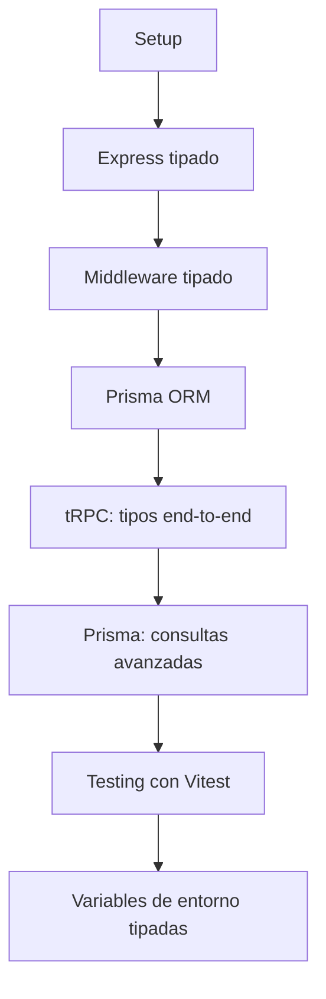
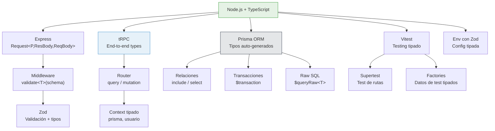

# :green_circle: Capítulo 15: TypeScript con Node.js

<div class="chapter-meta">
  <span class="meta-item">🕐 4-5 horas</span>
  <span class="meta-item">📊 Nivel: Avanzado</span>
  <span class="meta-item">🎯 Semana 8</span>
</div>

<div class="chapter-objective">
  <span class="objective-icon">📌</span>
  <span class="objective-text">Al terminar este capítulo, sabrás crear APIs REST con Node.js + Express + TypeScript: rutas tipadas, middleware, validación con Zod, Prisma ORM, y manejo de errores — el backend de MakeMenu.</span>
</div>

<div class="chapter-map">



</div>

!!! quote "Contexto"
    TypeScript no es solo para frontend. En el backend con Node.js, TypeScript brilla tanto como en Vue. Si conoces Django, verás que Express + TypeScript te da una experiencia similar pero con la flexibilidad de JavaScript.

<div class="connection-box back" markdown>
:link: **Conexión con el Capítulo 14** — En el <a href='../14-vue/'>Capítulo 14</a> creaste el frontend. Ahora construyes el backend. Las MISMAS interfaces (<code>Plato</code>, <code>Pedido</code>) se comparten entre ambos — esa es la magia de TypeScript fullstack.
</div>

---

## 15.1 Setup

```bash
mkdir makemenu-api && cd makemenu-api
npm init -y
npm install express cors
npm install -D typescript @types/express @types/cors @types/node tsx
npx tsc --init
```

<div class="concept-question" markdown>
🤔 **Pregunta para reflexionar** — En Django, las vistas reciben `HttpRequest` y devuelven `HttpResponse` — ambos tipados. ¿Cómo tipa Express sus `req` y `res`? ¿Puedes extender sus tipos para añadir datos personalizados?
</div>

## 15.2 Express tipado

```typescript title="src/routes/mesas.ts"
import express, { Request, Response } from 'express'
import type { Mesa } from '../types'

const router = express.Router()

interface CreateMesaBody {
  número: number;
  zona: string;
  capacidad: number;
}

router.get('/', (req: Request, res: Response<Mesa[]>) => {
  res.json(mesas)
})

router.post('/',
  (req: Request<{}, {}, CreateMesaBody>, res: Response<Mesa>) => {
    const { número, zona, capacidad } = req.body // ✅ Tipado
    const nueva: Mesa = {
      id: nextId(), número, zona, capacidad, ocupada: false
    }
    mesas.push(nueva)
    res.status(201).json(nueva)
  }
)

router.get('/:id',
  (req: Request<{ id: string }>, res: Response<Mesa | { error: string }>) => {
    const mesa = mesas.find(m => m.id === parseInt(req.params.id))
    if (!mesa) return res.status(404).json({ error: 'No encontrada' })
    res.json(mesa)
  }
)

export default router
```

<div class="comparison" markdown>
<div class="lang-box python" markdown>

#### :snake: En Django

```python
class MesaView(APIView):
    def get(self, request):
        serializer = MesaSerializer(mesas, many=True)
        return Response(serializer.data)
```
DRF maneja serialización automática.

</div>
<div class="lang-box typescript" markdown>

#### 🔷 En Express + TS

```typescript
router.get('/', (req: Request, res: Response<Mesa[]>) => {
  res.json(mesas)
})
```
Tipas cada parte manualmente pero con total control.

</div>
</div>

<div class="misconception-box" markdown>
:warning: **Concepto erróneo común**

| Mito | Realidad |
|------|----------|
| "Express tiene buen soporte de tipos" | Express fue diseñado sin TS. Los tipos son de DefinitelyTyped (`@types/express`) y son limitados. Para mejor DX, considera Fastify o tRPC. |
| "Las interfaces validan datos en runtime" | Los tipos de TS DESAPARECEN al compilar. Para validación runtime, necesitas una librería como Zod, Yup, o io-ts. |
| "Prisma es solo un ORM" | Prisma genera tipos TypeScript automáticamente desde tu schema. Es un ORM + type generator + migration tool. |
</div>

<div class="micro-exercise" markdown>
:pencil2: **Micro-ejercicio** — Crea una ruta `GET /api/platos/:id` tipada. El handler debe recibir `req.params.id` como string y devolver un `Plato` o un error 404.

??? example "Solución"
    ```typescript
    import { Request, Response } from 'express'

    interface Plato {
      id: number
      nombre: string
      precio: number
      categoria: 'entrante' | 'principal' | 'postre'
    }

    router.get('/api/platos/:id',
      (req: Request<{ id: string }>, res: Response<Plato | { error: string }>) => {
        const plato = platos.find(p => p.id === parseInt(req.params.id))
        if (!plato) {
          return res.status(404).json({ error: 'Plato no encontrado' })
        }
        res.json(plato)
      }
    )
    ```
</div>

## 15.3 Middleware tipado

<div class="concept-question" markdown>
🤔 **Pregunta para reflexionar** — ¿Cómo válidas que los datos de un POST request cumplan tu interfaz? Los tipos desaparecen en runtime — ¿cómo verificas datos de verdad?
</div>

```typescript title="src/middleware/validate.ts"
import { Request, Response, NextFunction } from 'express'
import { ZodSchema } from 'zod'

// Middleware genérico de validación con Zod
function validate<T>(schema: ZodSchema<T>) {
  return (req: Request, res: Response, next: NextFunction) => {
    const result = schema.safeParse(req.body)
    if (!result.success) {
      return res.status(400).json({
        errors: result.error.flatten()
      })
    }
    req.body = result.data // Ahora tipado como T ✅
    next()
  }
}
```

<div class="pro-tip">
<h4>💡 Consejo Pro</h4>
<p>En MakeMenu, cada endpoint tiene su schema Zod: <code>const crearPlatoSchema = z.object({...})</code>. El tipo se infiere automáticamente: <code>type CrearPlatoInput = z.infer&lt;typeof crearPlatoSchema&gt;</code>. Un solo source of truth para validación y tipos.</p>
</div>

<div class="micro-exercise" markdown>
:pencil2: **Micro-ejercicio** — Crea un schema Zod para `CrearPlatoInput` con nombre (string min 2), precio (number positive), y categoria (enum). Úsalo como middleware de validación.

??? example "Solución"
    ```typescript
    import { z } from 'zod'

    const crearPlatoSchema = z.object({
      nombre: z.string().min(2, 'El nombre debe tener al menos 2 caracteres'),
      precio: z.number().positive('El precio debe ser positivo'),
      categoria: z.enum(['entrante', 'principal', 'postre']),
    })

    // El tipo se infiere del schema — un solo source of truth
    type CrearPlatoInput = z.infer<typeof crearPlatoSchema>
    // { nombre: string; precio: number; categoria: 'entrante' | 'principal' | 'postre' }

    // Uso como middleware
    router.post('/api/platos',
      validate(crearPlatoSchema),
      (req: Request, res: Response) => {
        // req.body ya está validado y tipado como CrearPlatoInput
        const plato = { id: nextId(), ...req.body }
        res.status(201).json(plato)
      }
    )
    ```
</div>

<div class="concept-question" markdown>
🤔 **Pregunta para reflexionar** — Si en Django tienes el ORM que genera tipos automáticamente, ¿existe algo similar en TypeScript? ¿Puede tu ORM generar las interfaces de tu base de datos?
</div>

## 15.4 Prisma ORM

```prisma title="prisma/schema.prisma"
model Mesa {
  id        Int       @id @default(autoincrement())
  número    Int       @unique
  zona      String
  capacidad Int
  ocupada   Boolean   @default(false)
  reservas  Reserva[]
}

model Reserva {
  id       Int      @id @default(autoincrement())
  nombre   String
  personas Int
  hora     DateTime
  mesa     Mesa     @relation(fields: [mesaId], references: [id])
  mesaId   Int
}
```

```typescript title="src/services/mesa.service.ts"
import { PrismaClient } from '@prisma/client'

const prisma = new PrismaClient()

// 100% tipado automáticamente desde el schema
const libres = await prisma.mesa.findMany({
  where: { ocupada: false },
  include: { reservas: true }, // (1)!
  orderBy: { número: 'asc' },
})
```

1. Prisma genera los tipos automáticamente. `libres` incluye `reservas` con tipo correcto.

<div class="pro-tip">
<h4>💡 Consejo Pro</h4>
<p>Usa Prisma en vez de SQL raw. <code>prisma.plato.findMany({ where: { categoria: 'principal' } })</code> es 100% type-safe — el autocompletado te muestra todos los campos y filtros válidos.</p>
</div>

---

## 15.5 tRPC: seguridad de tipos end-to-end

!!! info "Qué es tRPC"
    tRPC permite crear APIs donde los tipos del servidor se comparten automáticamente con el cliente. No necesitas definir tipos REST, ni generar clientes, ni escribir schemas de validación duplicados. El tipo fluye del backend al frontend sin ningún paso intermedio.

### Instalación

```bash
npm install @trpc/server @trpc/client zod
```

### Definir el router

```typescript title="src/trpc/router.ts"
import { initTRPC, TRPCError } from '@trpc/server'
import { z } from 'zod'
import type { Context } from './context'

const t = initTRPC.context<Context>().create() // (1)!

const publicProcedure = t.procedure
const protectedProcedure = t.procedure.use(async ({ ctx, next }) => {
  if (!ctx.usuario) {
    throw new TRPCError({ code: 'UNAUTHORIZED' })
  }
  return next({ ctx: { ...ctx, usuario: ctx.usuario } }) // (2)!
})

export const appRouter = t.router({
  // --- Mesas ---
  mesas: t.router({
    listar: publicProcedure
      .query(async ({ ctx }) => {
        return ctx.prisma.mesa.findMany({
          include: { reservas: true },
          orderBy: { número: 'asc' },
        })
      }),

    porId: publicProcedure
      .input(z.object({ id: z.number() }))
      .query(async ({ ctx, input }) => {
        const mesa = await ctx.prisma.mesa.findUnique({
          where: { id: input.id },
          include: { reservas: true },
        })
        if (!mesa) throw new TRPCError({ code: 'NOT_FOUND' })
        return mesa
      }),

    crear: protectedProcedure
      .input(z.object({
        número: z.number().positive(),
        zona: z.enum(['interior', 'terraza', 'barra']),
        capacidad: z.number().min(1).max(20),
      }))
      .mutation(async ({ ctx, input }) => {
        return ctx.prisma.mesa.create({ data: input })
      }),

    toggleOcupada: protectedProcedure
      .input(z.object({ id: z.number() }))
      .mutation(async ({ ctx, input }) => {
        const mesa = await ctx.prisma.mesa.findUniqueOrThrow({
          where: { id: input.id },
        })
        return ctx.prisma.mesa.update({
          where: { id: input.id },
          data: { ocupada: !mesa.ocupada },
        })
      }),
  }),

  // --- Reservas ---
  reservas: t.router({
    listarHoy: publicProcedure
      .query(async ({ ctx }) => {
        const hoy = new Date()
        hoy.setHours(0, 0, 0, 0)
        return ctx.prisma.reserva.findMany({
          where: { hora: { gte: hoy } },
          include: { mesa: true },
        })
      }),

    crear: protectedProcedure
      .input(z.object({
        nombre: z.string().min(1),
        personas: z.number().min(1).max(20),
        hora: z.string().datetime(),
        mesaId: z.number(),
      }))
      .mutation(async ({ ctx, input }) => {
        return ctx.prisma.reserva.create({
          data: { ...input, hora: new Date(input.hora) },
          include: { mesa: true },
        })
      }),
  }),
})

// Exportar el tipo del router para el cliente
export type AppRouter = typeof appRouter // (3)!
```

1. `initTRPC` recibe el tipo de contexto para que todos los procedures tengan acceso tipado a `ctx.prisma`, `ctx.usuario`, etc.
2. El `protectedProcedure` refina el contexto: después de este middleware, `ctx.usuario` ya no es `undefined`.
3. Este `type` es lo único que importa el cliente. No se importa código del servidor, solo el tipo.

### Contexto tipado

```typescript title="src/trpc/context.ts"
import { PrismaClient } from '@prisma/client'
import type { CreateExpressContextOptions } from '@trpc/server/adapters/express'

const prisma = new PrismaClient()

export interface Context {
  prisma: PrismaClient
  usuario: { id: number; nombre: string; rol: string } | undefined
}

export async function createContext(
  opts: CreateExpressContextOptions
): Promise<Context> {
  const token = opts.req.headers.authorization?.split(' ')[1]
  const usuario = token ? await verificarToken(token) : undefined

  return {
    prisma,
    usuario,
  }
}
```

### Cliente con tipos automáticos

```typescript title="src/client.ts"
import { createTRPCClient, httpBatchLink } from '@trpc/client'
import type { AppRouter } from './trpc/router' // (1)!

const trpc = createTRPCClient<AppRouter>({
  links: [
    httpBatchLink({ url: 'http://localhost:3000/trpc' }),
  ],
})

// ✅ Autocompletado completo, tipos inferidos del servidor
const mesas = await trpc.mesas.listar.query()
// mesas es (Mesa & { reservas: Reserva[] })[] — inferido automáticamente

const nueva = await trpc.mesas.crear.mutate({
  número: 15,
  zona: 'terraza', // ✅ Solo acepta 'interior' | 'terraza' | 'barra'
  capacidad: 4,
})
// nueva es Mesa — inferido del return del mutation

// ❌ Error en compilación:
// trpc.mesas.crear.mutate({ número: "quince" })
// Type 'string' is not assignable to type 'number'
```

1. Solo se importa el **tipo**, no código. El servidor y el cliente pueden estar en paquetes diferentes.

<div class="comparison" markdown>
<div class="lang-box python" markdown>

#### :snake: En Django REST Framework

```python
# Necesitas definir los tipos en 3 lugares:
# 1. Model (models.py)
# 2. Serializer (serializers.py)
# 3. Cliente (manualmente o con openapi-generator)
# Si cambias el modelo, debes actualizar todo.
```

</div>
<div class="lang-box typescript" markdown>

#### 🔷 En tRPC + TypeScript

```typescript
// El tipo se define UNA vez en el servidor.
// El cliente lo hereda automáticamente.
// Si cambias el schema de Prisma, tRPC propaga
// el cambio al cliente sin generar nada.
const mesas = await trpc.mesas.listar.query()
// Tipo correcto sin ningún paso intermedio.
```

</div>
</div>

---

## 15.6 Prisma: consultas avanzadas

### Relaciones e includes

```prisma title="prisma/schema.prisma"
model Mesa {
  id        Int       @id @default(autoincrement())
  número    Int       @unique
  zona      String
  capacidad Int
  ocupada   Boolean   @default(false)
  reservas  Reserva[]
  pedidos   Pedido[]
}

model Reserva {
  id       Int      @id @default(autoincrement())
  nombre   String
  personas Int
  hora     DateTime
  mesa     Mesa     @relation(fields: [mesaId], references: [id])
  mesaId   Int
}

model Pedido {
  id        Int          @id @default(autoincrement())
  mesa      Mesa         @relation(fields: [mesaId], references: [id])
  mesaId    Int
  estado    EstadoPedido @default(PENDIENTE)
  total     Float        @default(0)
  items     ItemPedido[]
  creadoEn  DateTime     @default(now())
}

model ItemPedido {
  id       Int    @id @default(autoincrement())
  pedido   Pedido @relation(fields: [pedidoId], references: [id])
  pedidoId Int
  plato    String
  cantidad Int
  precio   Float
}

enum EstadoPedido {
  PENDIENTE
  PREPARANDO
  LISTO
  ENTREGADO
  CANCELADO
}
```

### Select vs Include

=== "Include (agregar relaciones)"

    ```typescript title="src/services/mesa.service.ts"
    // Include: trae la mesa + sus relaciones
    const mesaConTodo = await prisma.mesa.findUnique({
      where: { id: 1 },
      include: {
        reservas: true,                   // Todas las reservas
        pedidos: {
          where: { estado: 'PENDIENTE' }, // Solo pedidos pendientes
          include: {
            items: true,                  // Con sus items
          },
        },
      },
    })
    // Tipo inferido: Mesa & { reservas: Reserva[], pedidos: (Pedido & { items: ItemPedido[] })[] }
    ```

=== "Select (elegir campos)"

    ```typescript title="src/services/mesa.service.ts"
    // Select: trae solo los campos que necesitas
    const mesaResumen = await prisma.mesa.findUnique({
      where: { id: 1 },
      select: {
        número: true,
        zona: true,
        ocupada: true,
        _count: {               // (1)!
          select: {
            reservas: true,
            pedidos: true,
          },
        },
      },
    })
    // Tipo inferido: { número: number, zona: string, ocupada: boolean,
    //                  _count: { reservas: number, pedidos: number } }
    ```

    1. `_count` es un campo virtual de Prisma que cuenta relaciones sin cargarlas. Ideal para dashboards y listados.

### Transacciones

```typescript title="src/services/pedido.service.ts"
import { PrismaClient, Prisma } from '@prisma/client'

const prisma = new PrismaClient()

interface CrearPedidoInput {
  mesaId: number
  items: { plato: string; cantidad: number; precio: number }[]
}

// Transacción interactiva: múltiples operaciones atómicas
async function crearPedidoCompleto(input: CrearPedidoInput) {
  return prisma.$transaction(async (tx) => { // (1)!
    // 1. Verificar que la mesa existe y está ocupada
    const mesa = await tx.mesa.findUniqueOrThrow({
      where: { id: input.mesaId },
    })

    if (!mesa.ocupada) {
      throw new Error('La mesa debe estar ocupada para crear un pedido')
    }

    // 2. Calcular total
    const total = input.items.reduce(
      (sum, item) => sum + item.precio * item.cantidad,
      0
    )

    // 3. Crear pedido con items en una sola operación
    const pedido = await tx.pedido.create({
      data: {
        mesaId: input.mesaId,
        total,
        items: {
          create: input.items, // (2)!
        },
      },
      include: { items: true, mesa: true },
    })

    return pedido
  })
}
```

1. `$transaction` recibe un callback con `tx` (un PrismaClient transaccional). Si cualquier operación falla, **todas** se revierten automáticamente.
2. `create` dentro de una relación permite crear registros hijos junto con el padre. Prisma genera los IDs y foreign keys automáticamente.

### Transacciones secuenciales

```typescript
// Alternativa: transacción secuencial (más simple, menos flexible)
async function transferirReserva(reservaId: number, nuevaMesaId: number) {
  const [reservaActualizada, mesaLiberada] = await prisma.$transaction([
    prisma.reserva.update({
      where: { id: reservaId },
      data: { mesaId: nuevaMesaId },
    }),
    prisma.mesa.update({
      where: { id: nuevaMesaId },
      data: { ocupada: true },
    }),
  ])
  // Ambas operaciones son atómicas: o las dos se aplican o ninguna
  return { reservaActualizada, mesaLiberada }
}
```

### Agregaciones

```typescript title="src/services/dashboard.service.ts"
async function obtenerEstadísticas() {
  // Agregación: estadísticas del restaurante
  const stats = await prisma.pedido.aggregate({
    _count: { id: true },
    _sum: { total: true },
    _avg: { total: true },
    _max: { total: true },
    where: {
      creadoEn: { gte: new Date(new Date().setHours(0, 0, 0, 0)) },
    },
  })
  // stats._count.id: number | null
  // stats._sum.total: number | null
  // stats._avg.total: number | null

  // Agrupar por zona
  const porZona = await prisma.mesa.groupBy({
    by: ['zona'],
    _count: { id: true },
    _avg: { capacidad: true },
    where: { ocupada: true },
  })
  // porZona: { zona: string, _count: { id: number }, _avg: { capacidad: number | null } }[]

  return { stats, porZona }
}
```

### Raw queries tipadas

```typescript title="src/services/reporte.service.ts"
// Cuando Prisma no cubre tu caso, usa SQL directo con tipos
interface ReporteMesa {
  mesa_numero: number
  zona: string
  total_reservas: number
  total_pedidos: number
  ingreso_total: number
}

async function reporteMensual(mes: number, anio: number) {
  const reporte = await prisma.$queryRaw<ReporteMesa[]>`
    SELECT
      m.número AS mesa_numero,
      m.zona,
      COUNT(DISTINCT r.id) AS total_reservas,
      COUNT(DISTINCT p.id) AS total_pedidos,
      COALESCE(SUM(p.total), 0) AS ingreso_total
    FROM "Mesa" m
    LEFT JOIN "Reserva" r ON r."mesaId" = m.id
      AND EXTRACT(MONTH FROM r.hora) = ${mes}
      AND EXTRACT(YEAR FROM r.hora) = ${anio}
    LEFT JOIN "Pedido" p ON p."mesaId" = m.id
      AND EXTRACT(MONTH FROM p."creadoEn") = ${mes}
      AND EXTRACT(YEAR FROM p."creadoEn") = ${anio}
    GROUP BY m.id, m.número, m.zona
    ORDER BY ingreso_total DESC
  ` // (1)!

  return reporte
}
```

1. `$queryRaw` usa tagged template literals para prevenir SQL injection automáticamente. Los valores `${mes}` y `${anio}` se parametrizan, nunca se concatenan al SQL directamente.

### Middleware de Prisma

```typescript title="src/lib/prisma.ts"
import { PrismaClient } from '@prisma/client'

const prisma = new PrismaClient()

// Middleware: logging de queries lentas
prisma.$use(async (params, next) => { // (1)!
  const inicio = Date.now()
  const result = await next(params)
  const duración = Date.now() - inicio

  if (duración > 200) {
    console.warn(
      `Query lenta: ${params.model}.${params.action} - ${duración}ms`
    )
  }

  return result
})

// Middleware: soft delete automático
prisma.$use(async (params, next) => {
  if (params.action === 'delete') {
    params.action = 'update'
    params.args.data = { eliminado: true, eliminadoEn: new Date() }
  }

  if (params.action === 'findMany' || params.action === 'findFirst') {
    if (!params.args.where) params.args.where = {}
    params.args.where.eliminado = false
  }

  return next(params)
})

export default prisma
```

1. Los middleware de Prisma interceptan cada operación de base de datos. Reciben `params` (modelo, acción, argumentos) y `next` para continuar la cadena.

---

## 15.7 Testing con Vitest

!!! info "Por qué Vitest"
    Vitest es compatible con la API de Jest pero con soporte nativo de TypeScript (sin configuración extra), ESM nativo, y velocidad muy superior gracias a Vite. Es el estándar moderno para testing en proyectos TypeScript.

### Instalación

```bash
npm install -D vitest supertest @types/supertest
```

```typescript title="vitest.config.ts"
import { defineConfig } from 'vitest/config'

export default defineConfig({
  test: {
    globals: true,    // describe, it, expect sin importar
    environment: 'node',
    coverage: {
      provider: 'v8',
      include: ['src/**/*.ts'],
      exclude: ['src/**/*.d.ts', 'src/**/*.test.ts'],
    },
  },
})
```

### Testear servicios

```typescript title="src/services/__tests__/mesa.service.test.ts"
import { describe, it, expect, beforeAll, afterAll, beforeEach } from 'vitest'
import { PrismaClient } from '@prisma/client'

const prisma = new PrismaClient()

describe('MesaService', () => {
  beforeAll(async () => {
    // Conectar a la base de datos de test
    await prisma.$connect()
  })

  afterAll(async () => {
    // Limpiar y desconectar
    await prisma.reserva.deleteMany()
    await prisma.pedido.deleteMany()
    await prisma.mesa.deleteMany()
    await prisma.$disconnect()
  })

  beforeEach(async () => {
    // Limpiar datos antes de cada test
    await prisma.reserva.deleteMany()
    await prisma.mesa.deleteMany()
  })

  it('debe crear una mesa con datos válidos', async () => {
    const mesa = await prisma.mesa.create({
      data: { número: 1, zona: 'terraza', capacidad: 4 },
    })

    expect(mesa).toMatchObject({
      número: 1,
      zona: 'terraza',
      capacidad: 4,
      ocupada: false, // Valor por defecto
    })
    expect(mesa.id).toBeDefined()
  })

  it('debe rechazar mesa con número duplicado', async () => {
    await prisma.mesa.create({
      data: { número: 1, zona: 'interior', capacidad: 2 },
    })

    await expect(
      prisma.mesa.create({
        data: { número: 1, zona: 'terraza', capacidad: 4 },
      })
    ).rejects.toThrow() // (1)!
  })

  it('debe encontrar mesas libres', async () => {
    await prisma.mesa.createMany({
      data: [
        { número: 1, zona: 'interior', capacidad: 2, ocupada: false },
        { número: 2, zona: 'terraza', capacidad: 4, ocupada: true },
        { número: 3, zona: 'barra', capacidad: 1, ocupada: false },
      ],
    })

    const libres = await prisma.mesa.findMany({
      where: { ocupada: false },
    })

    expect(libres).toHaveLength(2)
    expect(libres.every(m => !m.ocupada)).toBe(true)
  })

  it('debe incluir reservas al buscar mesa', async () => {
    const mesa = await prisma.mesa.create({
      data: { número: 5, zona: 'terraza', capacidad: 6 },
    })

    await prisma.reserva.create({
      data: {
        nombre: 'Carlos',
        personas: 3,
        hora: new Date(),
        mesaId: mesa.id,
      },
    })

    const mesaConReservas = await prisma.mesa.findUnique({
      where: { id: mesa.id },
      include: { reservas: true },
    })

    expect(mesaConReservas?.reservas).toHaveLength(1)
    expect(mesaConReservas?.reservas[0].nombre).toBe('Carlos')
  })
})
```

1. Prisma lanza un error de constraint único cuando el `número` ya existe. `rejects.toThrow()` verifica que la Promise se rechaza.

### Testear rutas Express con Supertest

```typescript title="src/routes/__tests__/mesas.routes.test.ts"
import { describe, it, expect, beforeAll, afterAll } from 'vitest'
import request from 'supertest'
import express from 'express'
import mesasRouter from '../mesas'

// Crear app de test
const app = express()
app.use(express.json())
app.use('/api/mesas', mesasRouter)

describe('GET /api/mesas', () => {
  it('debe devolver un array de mesas', async () => {
    const res = await request(app)
      .get('/api/mesas')
      .expect('Content-Type', /json/)
      .expect(200)

    expect(Array.isArray(res.body)).toBe(true)
  })

  it('debe devolver 404 para mesa inexistente', async () => {
    const res = await request(app)
      .get('/api/mesas/99999')
      .expect(404)

    expect(res.body).toHaveProperty('error')
  })
})

describe('POST /api/mesas', () => {
  it('debe crear una mesa con datos válidos', async () => {
    const nuevaMesa = {
      número: 10,
      zona: 'terraza',
      capacidad: 4,
    }

    const res = await request(app)
      .post('/api/mesas')
      .send(nuevaMesa)
      .expect(201)

    expect(res.body).toMatchObject(nuevaMesa)
    expect(res.body.id).toBeDefined()
  })

  it('debe rechazar datos inválidos', async () => {
    const res = await request(app)
      .post('/api/mesas')
      .send({ número: 'abc' }) // número debe ser number
      .expect(400)

    expect(res.body).toHaveProperty('errors')
  })
})
```

### Patrón: test factory

```typescript title="src/tests/factories.ts"
import { PrismaClient } from '@prisma/client'
import type { Mesa, Reserva } from '@prisma/client'

const prisma = new PrismaClient()

let mesaCounter = 100

// Factoría tipada para crear datos de test
export async function crearMesaTest(
  override: Partial<Omit<Mesa, 'id'>> = {}
): Promise<Mesa> {
  return prisma.mesa.create({
    data: {
      número: mesaCounter++,
      zona: 'interior',
      capacidad: 4,
      ocupada: false,
      ...override, // (1)!
    },
  })
}

export async function crearReservaTest(
  mesaId: number,
  override: Partial<Omit<Reserva, 'id' | 'mesaId'>> = {}
): Promise<Reserva> {
  return prisma.reserva.create({
    data: {
      nombre: 'Test User',
      personas: 2,
      hora: new Date(),
      mesaId,
      ...override,
    },
  })
}

// Uso en tests:
// const mesa = await crearMesaTest({ zona: 'terraza', capacidad: 8 })
// const reserva = await crearReservaTest(mesa.id, { nombre: 'Ana' })
```

1. `Partial<Omit<Mesa, 'id'>>` permite sobreescribir cualquier campo excepto `id` (que lo genera la BD). Los valores por defecto hacen que el test sea conciso.

### Ejecutar tests

```bash
# Ejecutar todos los tests
npx vitest

# Ejecutar en modo watch
npx vitest --watch

# Con cobertura
npx vitest --coverage

# Solo un archivo
npx vitest src/services/__tests__/mesa.service.test.ts
```

---

## 15.8 Variables de entorno tipadas

!!! warning "El problema"
    `process.env.DATABASE_URL` siempre es `string | undefined` en TypeScript. Esto significa que cada uso necesita una verificación manual, y un typo en el nombre de la variable no da error hasta runtime.

### Validación con Zod

```typescript title="src/config/env.ts"
import { z } from 'zod'

// 1. Definir el schema de todas las variables de entorno
const envSchema = z.object({
  // Base de datos
  DATABASE_URL: z.string().url(),

  // Servidor
  PORT: z.coerce.number().default(3000), // (1)!
  NODE_ENV: z.enum(['development', 'production', 'test'])
    .default('development'),

  // Autenticación
  JWT_SECRET: z.string().min(32, 'JWT_SECRET debe tener al menos 32 caracteres'),
  JWT_EXPIRES_IN: z.string().default('7d'),

  // CORS
  CORS_ORIGIN: z.string().url().default('http://localhost:5173'),

  // Opcionales
  LOG_LEVEL: z.enum(['debug', 'info', 'warn', 'error']).default('info'),
  REDIS_URL: z.string().url().optional(),
})

// 2. Validar y exportar el objeto tipado
function validateEnv() {
  const result = envSchema.safeParse(process.env)

  if (!result.success) {
    console.error('Variables de entorno inválidas:')
    console.error(result.error.flatten().fieldErrors)
    process.exit(1) // (2)!
  }

  return result.data
}

export const env = validateEnv()

// 3. El tipo se infiere automáticamente del schema
export type Env = z.infer<typeof envSchema>
// Env = {
//   DATABASE_URL: string
//   PORT: number         (ya convertido!)
//   NODE_ENV: 'development' | 'production' | 'test'
//   JWT_SECRET: string
//   JWT_EXPIRES_IN: string
//   CORS_ORIGIN: string
//   LOG_LEVEL: 'debug' | 'info' | 'warn' | 'error'
//   REDIS_URL?: string   (opcional)
// }
```

1. `z.coerce.number()` convierte el string de `process.env` a number automáticamente. `PORT="3000"` se convierte a `3000`.
2. Si alguna variable requerida falta o tiene un formato inválido, la aplicación falla **inmediatamente** al arrancar, no cuando se use la variable.

### Uso en la aplicación

```typescript title="src/server.ts"
import express from 'express'
import cors from 'cors'
import { env } from './config/env'

const app = express()

app.use(cors({ origin: env.CORS_ORIGIN })) // ✅ string, no string | undefined
app.use(express.json())

// env.PORT es number, no necesita parseInt
app.listen(env.PORT, () => {
  console.log(`Servidor en puerto ${env.PORT}`)
  console.log(`Entorno: ${env.NODE_ENV}`) // ✅ Solo 'development' | 'production' | 'test'
})

// ❌ Error de compilación:
// env.DATABSE_URL  // Typo detectado por TypeScript
// env.PORT.split   // Error: number no tiene .split
```

=== "Sin tipado (peligroso)"

    ```typescript
    // ❌ Cada uso necesita verificación
    const port = parseInt(process.env.PORT || '3000')
    const dbUrl = process.env.DATABASE_URL
    if (!dbUrl) throw new Error('DATABASE_URL no definida')
    // Y si hay un typo en "DATABASE_URL"... silencio total
    ```

=== "Con Zod (seguro)"

    ```typescript
    // ✅ Valida TODO al arrancar, tipos correctos
    import { env } from './config/env'

    const port = env.PORT         // number
    const dbUrl = env.DATABASE_URL // string (garantizado)
    // env.DATABSE_URL → Error de compilación
    ```

<div class="comparison" markdown>
<div class="lang-box python" markdown>

#### :snake: En Django

```python
# Django usa django-environ o python-decouple
import environ
env = environ.Env(
    DEBUG=(bool, False),
    PORT=(int, 3000),
)
# Similar en concepto, pero sin verificación
# de tipos estática en el IDE.
```

</div>
<div class="lang-box typescript" markdown>

#### 🔷 En Node + Zod

```typescript
// Zod válida en runtime Y da tipos en compilación.
// Si falta DATABASE_URL, la app no arranca.
// Si escribes env.DATABSE_URL, TypeScript marca
// el error antes de ejecutar nada.
const env = validateEnv()
env.PORT // number, no string | undefined
```

</div>
</div>

---

<div class="code-evolution">
<div class="evolution-header">📈 Evolución del código</div>
<div class="evolution-step">
<span class="step-label novato">v1 — Novato</span>

```javascript
// Express sin tipos — todo es any, sin validación
const express = require('express')
const app = express()
app.use(express.json())

app.post('/api/platos', (req, res) => {
  // req.body es any — ¿tiene nombre? ¿precio? No sabemos
  const plato = req.body
  // Sin validación — datos inválidos pasan directo
  platos.push(plato)
  res.json(plato)
})

app.listen(process.env.PORT) // string | undefined
```

</div>
<div class="evolution-step">
<span class="step-label mejorado">v2 — Con tipos</span>

```typescript
// Express con interfaces — mejor, pero sin validación runtime
import express, { Request, Response } from 'express'

interface CrearPlatoBody {
  nombre: string
  precio: number
  categoria: 'entrante' | 'principal' | 'postre'
}

app.post('/api/platos',
  (req: Request<{}, {}, CrearPlatoBody>, res: Response<Plato>) => {
    // req.body tiene tipo, pero NO se válida en runtime
    // Un cliente puede enviar { nombre: 42 } y TypeScript no lo detecta
    const plato: Plato = { id: nextId(), ...req.body }
    res.status(201).json(plato)
  }
)
```

</div>
<div class="evolution-step">
<span class="step-label profesional">v3 — Profesional</span>

```typescript
// Zod + Prisma + middleware tipado — validación real + type-safety
import { z } from 'zod'
import prisma from '../lib/prisma'

const crearPlatoSchema = z.object({
  nombre: z.string().min(2),
  precio: z.number().positive(),
  categoria: z.enum(['entrante', 'principal', 'postre']),
})
type CrearPlatoInput = z.infer<typeof crearPlatoSchema>

router.post('/api/platos',
  validate(crearPlatoSchema),  // Middleware válida en runtime ✅
  async (req: Request, res: Response) => {
    const plato = await prisma.plato.create({
      data: req.body,  // Datos validados + Prisma type-safe ✅
    })
    res.status(201).json(plato)
  }
)
```

</div>
</div>

---



---

## 🎯 Ejercicios

??? question "Ejercicio 1: Router de reservas"
    Crea un router Express tipado para reservas con GET, POST, PUT y DELETE.

    ??? success "Solución"
        ```typescript
        import { Router, Request, Response } from 'express'
        import type { Reserva } from '../types'
        import { z } from 'zod'

        const router = Router()

        const CreateReservaSchema = z.object({
          nombre: z.string().min(1),
          mesa: z.number().positive(),
          personas: z.number().min(1).max(12),
          hora: z.string(),
        })

        router.get('/', (req, res: Response<Reserva[]>) => {
          res.json(reservas)
        })

        router.post('/', (req, res) => {
          const parsed = CreateReservaSchema.safeParse(req.body)
          if (!parsed.success) return res.status(400).json(parsed.error)
          const nueva = { id: nextId(), ...parsed.data }
          reservas.push(nueva)
          res.status(201).json(nueva)
        })

        export default router
        ```

??? question "Ejercicio 2: Servicio Prisma con transacciones"
    Crea un servicio `PedidoService` que use `prisma.$transaction` para crear un pedido completo: verificar que la mesa existe, crear el pedido con sus items, y actualizar el estado de la mesa a ocupada. Todo atómico.

    !!! tip "Pista"
        Usa `$transaction(async (tx) => { ... })` para la transacción interactiva. `tx` funciona como un `PrismaClient` pero dentro de la transacción.

    ??? success "Solución"
        ```typescript
        import { PrismaClient } from '@prisma/client'

        const prisma = new PrismaClient()

        interface ItemInput {
          plato: string
          cantidad: number
          precio: number
        }

        interface CrearPedidoInput {
          mesaId: number
          items: ItemInput[]
        }

        async function crearPedidoCompleto(input: CrearPedidoInput) {
          return prisma.$transaction(async (tx) => {
            // 1. Verificar mesa
            const mesa = await tx.mesa.findUniqueOrThrow({
              where: { id: input.mesaId },
            })

            // 2. Calcular total
            const total = input.items.reduce(
              (sum, item) => sum + item.precio * item.cantidad,
              0
            )

            // 3. Crear pedido con items
            const pedido = await tx.pedido.create({
              data: {
                mesaId: input.mesaId,
                total,
                items: { create: input.items },
              },
              include: { items: true },
            })

            // 4. Marcar mesa como ocupada
            await tx.mesa.update({
              where: { id: input.mesaId },
              data: { ocupada: true },
            })

            return pedido
          })
        }

        // Uso:
        // const pedido = await crearPedidoCompleto({
        //   mesaId: 1,
        //   items: [
        //     { plato: 'Tortilla', cantidad: 1, precio: 8.50 },
        //     { plato: 'Cerveza', cantidad: 2, precio: 3.00 },
        //   ]
        // })
        ```

??? question "Ejercicio 3: Cadena de middleware tipada"
    Crea tres middlewares Express tipados que funcionen en cadena: (1) `authenticate` que verifique un token y añada `req.user`, (2) `authorize` que verifique roles, y (3) `validate` que valide el body con Zod. Usa `declare module 'express'` para extender `Request`.

    !!! tip "Pista"
        Extiende `Request` con `declare module 'express'` para añadir la propiedad `user`. El middleware `authorize` debe recibir una lista de roles permitidos y devolver un middleware.

    ??? success "Solución"
        ```typescript
        import { Request, Response, NextFunction } from 'express'
        import { ZodSchema } from 'zod'

        // Extender el tipo Request globalmente
        declare module 'express' {
          interface Request {
            user?: {
              id: number
              nombre: string
              rol: 'admin' | 'camarero' | 'cocina'
            }
          }
        }

        // 1. Authenticate: verificar token, añadir user
        function authenticate(req: Request, res: Response, next: NextFunction) {
          const token = req.headers.authorization?.split(' ')[1]
          if (!token) {
            return res.status(401).json({ error: 'Token requerido' })
          }

          try {
            const payload = verificarToken(token) // Tu función de JWT
            req.user = payload
            next()
          } catch {
            return res.status(401).json({ error: 'Token inválido' })
          }
        }

        // 2. Authorize: verificar rol (higher-order middleware)
        function authorize(...roles: ('admin' | 'camarero' | 'cocina')[]) {
          return (req: Request, res: Response, next: NextFunction) => {
            if (!req.user) {
              return res.status(401).json({ error: 'No autenticado' })
            }
            if (!roles.includes(req.user.rol)) {
              return res.status(403).json({ error: 'Sin permisos' })
            }
            next()
          }
        }

        // 3. Validate: validar body con Zod
        function validate<T>(schema: ZodSchema<T>) {
          return (req: Request, res: Response, next: NextFunction) => {
            const result = schema.safeParse(req.body)
            if (!result.success) {
              return res.status(400).json({
                errors: result.error.flatten().fieldErrors,
              })
            }
            req.body = result.data
            next()
          }
        }

        // Uso encadenado:
        // router.post('/pedidos',
        //   authenticate,
        //   authorize('admin', 'camarero'),
        //   validate(CrearPedidoSchema),
        //   (req, res) => {
        //     // req.user existe y tiene el rol correcto
        //     // req.body está validado
        //   }
        // )
        ```

??? question "Ejercicio 4: Tests con Vitest para un servicio"
    Escribe un conjunto completo de tests con Vitest para un `ReservaService` que tenga: `crear()`, `obtenerPorMesa()` y `cancelar()`. Usa `beforeAll`, `afterAll`, `beforeEach`, y al menos 4 tests con `expect`.

    !!! tip "Pista"
        Configura `beforeEach` para limpiar la base de datos entre tests. Usa `toMatchObject` para verificaciones parciales y `rejects.toThrow` para errores esperados.

    ??? success "Solución"
        ```typescript
        import { describe, it, expect, beforeAll, afterAll, beforeEach } from 'vitest'
        import { PrismaClient } from '@prisma/client'

        const prisma = new PrismaClient()

        describe('ReservaService', () => {
          let mesaId: number

          beforeAll(async () => {
            await prisma.$connect()
            // Crear una mesa para los tests
            const mesa = await prisma.mesa.create({
              data: { número: 99, zona: 'test', capacidad: 4 },
            })
            mesaId = mesa.id
          })

          afterAll(async () => {
            await prisma.reserva.deleteMany()
            await prisma.mesa.deleteMany()
            await prisma.$disconnect()
          })

          beforeEach(async () => {
            await prisma.reserva.deleteMany()
          })

          it('debe crear una reserva válida', async () => {
            const reserva = await prisma.reserva.create({
              data: {
                nombre: 'Maria',
                personas: 3,
                hora: new Date('2025-12-25T20:00:00Z'),
                mesaId,
              },
            })

            expect(reserva).toMatchObject({
              nombre: 'Maria',
              personas: 3,
              mesaId,
            })
            expect(reserva.id).toBeDefined()
          })

          it('debe obtener reservas por mesa', async () => {
            await prisma.reserva.createMany({
              data: [
                { nombre: 'Ana', personas: 2, hora: new Date(), mesaId },
                { nombre: 'Pedro', personas: 4, hora: new Date(), mesaId },
              ],
            })

            const reservas = await prisma.reserva.findMany({
              where: { mesaId },
            })

            expect(reservas).toHaveLength(2)
            expect(reservas.map(r => r.nombre)).toContain('Ana')
            expect(reservas.map(r => r.nombre)).toContain('Pedro')
          })

          it('debe eliminar (cancelar) una reserva', async () => {
            const reserva = await prisma.reserva.create({
              data: {
                nombre: 'Luis',
                personas: 5,
                hora: new Date(),
                mesaId,
              },
            })

            await prisma.reserva.delete({
              where: { id: reserva.id },
            })

            const resultado = await prisma.reserva.findUnique({
              where: { id: reserva.id },
            })

            expect(resultado).toBeNull()
          })

          it('debe fallar al crear reserva para mesa inexistente', async () => {
            await expect(
              prisma.reserva.create({
                data: {
                  nombre: 'Error',
                  personas: 2,
                  hora: new Date(),
                  mesaId: 99999,
                },
              })
            ).rejects.toThrow()
          })
        })
        ```

??? question "Ejercicio 5: Router tRPC para mesas"
    Crea un router tRPC completo para el recurso `mesas` con: `listar` (query), `porId` (query con input), `crear` (mutation con validación Zod), y `eliminar` (mutation protegida). Define el contexto con Prisma y un usuario opcional.

    !!! tip "Pista"
        Usa `t.procedure.use()` para crear un `protectedProcedure` que verifique que `ctx.usuario` existe. El input de `crear` debe usar `z.object()` con los campos de mesa.

    ??? success "Solución"
        ```typescript
        import { initTRPC, TRPCError } from '@trpc/server'
        import { z } from 'zod'
        import { PrismaClient } from '@prisma/client'

        const prisma = new PrismaClient()

        interface Context {
          prisma: PrismaClient
          usuario: { id: number; rol: string } | undefined
        }

        const t = initTRPC.context<Context>().create()

        const publicProcedure = t.procedure
        const protectedProcedure = t.procedure.use(async ({ ctx, next }) => {
          if (!ctx.usuario) {
            throw new TRPCError({ code: 'UNAUTHORIZED' })
          }
          return next({ ctx: { ...ctx, usuario: ctx.usuario } })
        })

        export const mesasRouter = t.router({
          listar: publicProcedure
            .query(async ({ ctx }) => {
              return ctx.prisma.mesa.findMany({
                include: { reservas: true },
                orderBy: { número: 'asc' },
              })
            }),

          porId: publicProcedure
            .input(z.object({ id: z.number() }))
            .query(async ({ ctx, input }) => {
              const mesa = await ctx.prisma.mesa.findUnique({
                where: { id: input.id },
                include: { reservas: true, pedidos: true },
              })
              if (!mesa) {
                throw new TRPCError({
                  code: 'NOT_FOUND',
                  message: `Mesa ${input.id} no encontrada`,
                })
              }
              return mesa
            }),

          crear: protectedProcedure
            .input(z.object({
              número: z.number().positive(),
              zona: z.enum(['interior', 'terraza', 'barra']),
              capacidad: z.number().min(1).max(20),
            }))
            .mutation(async ({ ctx, input }) => {
              return ctx.prisma.mesa.create({
                data: input,
              })
            }),

          eliminar: protectedProcedure
            .input(z.object({ id: z.number() }))
            .mutation(async ({ ctx, input }) => {
              // Solo admin puede eliminar
              if (ctx.usuario.rol !== 'admin') {
                throw new TRPCError({ code: 'FORBIDDEN' })
              }
              return ctx.prisma.mesa.delete({
                where: { id: input.id },
              })
            }),
        })

        export type MesasRouter = typeof mesasRouter
        ```

---

## :brain: Flashcards de repaso

<div class="flashcard">
<div class="front">Cuáles son los genéricos de <code>Request</code> en Express?</div>
<div class="back"><code>Request&lt;Params, ResBody, ReqBody, Query&gt;</code>. Ejemplo: <code>Request&lt;{ id: string }, {}, CreateMesaBody&gt;</code> tipa <code>req.params.id</code> como <code>string</code> y <code>req.body</code> como <code>CreateMesaBody</code>. <code>Response&lt;T&gt;</code> tipa lo que devuelve <code>res.json()</code>.</div>
</div>

<div class="flashcard">
<div class="front">Cómo genera Prisma los tipos automáticamente?</div>
<div class="back">Al ejecutar <code>npx prisma generate</code>, Prisma lee <code>schema.prisma</code> y genera tipos TypeScript en <code>node_modules/@prisma/client</code>. Cada modelo se convierte en un tipo (ej: <code>Mesa</code>), y las queries como <code>findMany({ include: { reservas: true } })</code> retornan tipos que incluyen las relaciones automáticamente.</div>
</div>

<div class="flashcard">
<div class="front">Cómo comparte tRPC los tipos entre servidor y cliente?</div>
<div class="back">El servidor exporta <code>type AppRouter = typeof appRouter</code>. El cliente importa solo ese <strong>tipo</strong> (no código). <code>createTRPCClient&lt;AppRouter&gt;</code> usa ese tipo para inferir los inputs y outputs de cada procedure. Si el servidor cambia, el cliente detecta el error en compilación.</div>
</div>

<div class="flashcard">
<div class="front">Cuál es la estructura básica de un test en Vitest?</div>
<div class="back"><code>describe('grupo', () => { it('caso', () => { expect(valor).toBe(esperado) }) })</code>. Hooks: <code>beforeAll</code> (una vez), <code>beforeEach</code> (cada test), <code>afterAll</code> (limpiar). Para async: <code>await expect(promise).rejects.toThrow()</code>. Para HTTP: <code>supertest(app).get('/ruta').expect(200)</code>.</div>
</div>

<div class="flashcard">
<div class="front">Cómo se tipan las variables de entorno con Zod?</div>
<div class="back">Se define un schema Zod con todas las variables: <code>z.object({ PORT: z.coerce.number(), DATABASE_URL: z.string().url() })</code>. Se válida con <code>schema.safeParse(process.env)</code> al arrancar. El resultado es un objeto tipado donde <code>PORT</code> es <code>number</code> (no <code>string | undefined</code>) y los typos dan error de compilación.</div>
</div>

---

<div class="ejercicio-guiado">
<h4>🏋️ Ejercicio guiado</h4>

Vas a construir un endpoint completo para gestionar los pedidos del restaurante MakeMenu: schema Zod de validación, middleware tipado, ruta Express con tipos y manejo de errores.

1. Define un schema Zod `itemPedidoSchema` con los campos `plato` (string, min 1), `cantidad` (number, min 1, max 50) y `precio` (number, positivo). Luego define `crearPedidoSchema` con `mesaId` (number, positivo) e `items` (array de `itemPedidoSchema`, min 1 elemento).
2. Crea el tipo `CrearPedidoInput` usando `z.infer<typeof crearPedidoSchema>` para que los tipos se deriven automáticamente del schema.
3. Crea un middleware genérico `validate<T>(schema: ZodSchema<T>)` que use `safeParse`, devuelva un 400 con errores formateados si falla, y asigne `result.data` a `req.body` si pasa.
4. Define la ruta `POST /api/pedidos` que use el middleware de validación, calcule el total sumando `precio * cantidad` de cada item, y devuelva el pedido creado con status 201.
5. Define la ruta `GET /api/pedidos/:id` tipando `req.params` como `{ id: string }` y `res` como `Response<Pedido | { error: string }>`. Devuelve 404 si no se encuentra.
6. Añade un manejador de errores global tipado con `ErrorRequestHandler` que distinga entre `ZodError` (400) y errores genéricos (500).

??? success "Solución completa"
    ```typescript
    import express, { Request, Response, NextFunction, ErrorRequestHandler } from "express";
    import { z, ZodSchema, ZodError } from "zod";

    const app = express();
    app.use(express.json());

    // Paso 1: Schemas Zod
    const itemPedidoSchema = z.object({
      plato: z.string().min(1, "El nombre del plato es obligatorio"),
      cantidad: z.number().min(1).max(50),
      precio: z.number().positive("El precio debe ser positivo"),
    });

    const crearPedidoSchema = z.object({
      mesaId: z.number().positive("El ID de mesa debe ser positivo"),
      items: z.array(itemPedidoSchema).min(1, "Debe incluir al menos un item"),
    });

    // Paso 2: Tipo derivado del schema
    type CrearPedidoInput = z.infer<typeof crearPedidoSchema>;

    interface Pedido {
      id: number;
      mesaId: number;
      items: { plato: string; cantidad: number; precio: number }[];
      total: number;
      estado: "pendiente" | "preparando" | "listo" | "entregado";
      creadoEn: string;
    }

    // Paso 3: Middleware genérico de validación
    function validate<T>(schema: ZodSchema<T>) {
      return (req: Request, res: Response, next: NextFunction) => {
        const result = schema.safeParse(req.body);
        if (!result.success) {
          return res.status(400).json({
            errors: result.error.flatten().fieldErrors,
          });
        }
        req.body = result.data;
        next();
      };
    }

    // Almacén en memoria (en producción sería Prisma)
    const pedidos: Pedido[] = [];
    let nextId = 1;

    // Paso 4: POST /api/pedidos
    app.post(
      "/api/pedidos",
      validate(crearPedidoSchema),
      (req: Request, res: Response<Pedido>) => {
        const input: CrearPedidoInput = req.body;
        const total = input.items.reduce(
          (sum, item) => sum + item.precio * item.cantidad,
          0
        );

        const pedido: Pedido = {
          id: nextId++,
          mesaId: input.mesaId,
          items: input.items,
          total,
          estado: "pendiente",
          creadoEn: new Date().toISOString(),
        };

        pedidos.push(pedido);
        res.status(201).json(pedido);
      }
    );

    // Paso 5: GET /api/pedidos/:id
    app.get(
      "/api/pedidos/:id",
      (req: Request<{ id: string }>, res: Response<Pedido | { error: string }>) => {
        const pedido = pedidos.find((p) => p.id === parseInt(req.params.id));
        if (!pedido) {
          return res.status(404).json({ error: "Pedido no encontrado" });
        }
        res.json(pedido);
      }
    );

    // Paso 6: Manejador de errores global
    const errorHandler: ErrorRequestHandler = (err, req, res, next) => {
      if (err instanceof ZodError) {
        res.status(400).json({ errors: err.flatten().fieldErrors });
        return;
      }
      console.error(err);
      res.status(500).json({ error: "Error interno del servidor" });
    };

    app.use(errorHandler);

    app.listen(3000, () => {
      console.log("Servidor MakeMenu en puerto 3000");
    });
    ```

</div>

<div class="real-errors">
<h4>🚨 Errores que vas a encontrar</h4>

**Error 1: `Cannot find module '@prisma/client'`**

```
Error: Cannot find module '@prisma/client'
    at Function.Module._resolveFilename (node:internal/modules/cjs/loader:1048:15)
```

**Por qué ocurre:** Instalaste Prisma pero no ejecutaste el generador de tipos. El paquete `@prisma/client` existe en `node_modules`, pero no contiene los tipos generados de tu schema.

**Solución:** Ejecuta `npx prisma generate` cada vez que modifiques `schema.prisma`. Esto lee tu schema y genera los tipos TypeScript correspondientes dentro de `node_modules/@prisma/client`.

---

**Error 2: `Property 'user' does not exist on type 'Request'`**

```
error TS2339: Property 'user' does not exist on type 'Request<ParamsDictionary, any, any, ParsedQs, Record<string, any>>'.
```

**Por qué ocurre:** Intentas acceder a `req.user` en un middleware de autenticación, pero el tipo `Request` de Express no incluye esa propiedad. Los tipos de `@types/express` solo conocen las propiedades estándar de Express.

**Solución:** Extiende la interfaz `Request` con `declare module 'express'` en un archivo `.d.ts` o al inicio de tu módulo:

```typescript
declare module 'express' {
  interface Request {
    user?: { id: number; nombre: string; rol: string }
  }
}
```

---

**Error 3: `schema.parse is not a function` o validación silenciosa**

```
TypeError: schema.parse is not a function
// O peor: ningún error, pero datos inválidos pasan al handler
```

**Por qué ocurre:** Usas `schema.parse()` en lugar de `schema.safeParse()` dentro del middleware. Con `parse()`, Zod lanza una excepción que Express no captura correctamente, resultando en un 500 genérico en vez de un 400 con detalles de validación. Si no hay try/catch, el servidor puede crashear.

**Solución:** Usa siempre `safeParse()` en middleware Express. Devuelve `{ success, data, error }` sin lanzar excepciones:

```typescript
const result = schema.safeParse(req.body)
if (!result.success) {
  return res.status(400).json({ errors: result.error.flatten() })
}
req.body = result.data
```

---

**Error 4: `PrismaClientKnownRequestError: Unique constraint failed on the fields: ('número')`**

```
PrismaClientKnownRequestError:
Invalid `prisma.mesa.create()` invocation:
Unique constraint failed on the fields: (`número`)
```

**Por qué ocurre:** Intentas crear un registro con un valor que ya existe en un campo marcado como `@unique` en tu schema Prisma (por ejemplo, dos mesas con el mismo `número`). Prisma lanza este error específico en lugar de uno genérico de SQL.

**Solución:** Captura el error específico de Prisma y devuelve un 409 (Conflict) al cliente:

```typescript
import { Prisma } from '@prisma/client'

try {
  const mesa = await prisma.mesa.create({ data: input })
  res.status(201).json(mesa)
} catch (error) {
  if (error instanceof Prisma.PrismaClientKnownRequestError
      && error.code === 'P2002') {
    return res.status(409).json({
      error: `Ya existe una mesa con ese número`
    })
  }
  throw error
}
```

</div>

<div class="checkpoint">
<h4>🏁 Checkpoint</h4>
<p>Si puedes: (1) crear rutas Express tipadas, (2) validar input con Zod, y (3) usar Prisma con tipos generados — tienes el backend de MakeMenu listo.</p>
</div>

<div class="mini-project">
<h4>🏗️ Mini-proyecto: API de Carta del Restaurante</h4>

Construye una API REST completa para gestionar la carta de platos del restaurante MakeMenu. Usa Express tipado, Zod para validación y Prisma para persistencia.

**Paso 1: Define el schema Prisma y los schemas Zod para platos**

Crea un modelo `Plato` en Prisma con campos `id`, `nombre`, `precio`, `categoria` (enum), y `disponible`. Luego crea los schemas Zod de validación para crear y actualizar platos.

??? success "Solución"
    ```prisma title="prisma/schema.prisma"
    enum Categoria {
      ENTRANTE
      PRINCIPAL
      POSTRE
      BEBIDA
    }

    model Plato {
      id          Int       @id @default(autoincrement())
      nombre      String    @unique
      precio      Float
      categoria   Categoria
      disponible  Boolean   @default(true)
      creadoEn    DateTime  @default(now())
    }
    ```

    ```typescript title="src/schemas/plato.schema.ts"
    import { z } from 'zod'

    export const crearPlatoSchema = z.object({
      nombre: z.string().min(2, 'El nombre debe tener al menos 2 caracteres'),
      precio: z.number().positive('El precio debe ser positivo'),
      categoria: z.enum(['ENTRANTE', 'PRINCIPAL', 'POSTRE', 'BEBIDA']),
      disponible: z.boolean().optional().default(true),
    })

    export const actualizarPlatoSchema = crearPlatoSchema.partial()

    export type CrearPlatoInput = z.infer<typeof crearPlatoSchema>
    export type ActualizarPlatoInput = z.infer<typeof actualizarPlatoSchema>
    ```

**Paso 2: Crea el router Express con CRUD tipado y middleware de validación**

Implementa las rutas `GET /api/platos` (listar, con filtro opcional por categoría), `POST /api/platos` (crear con validación Zod), `PUT /api/platos/:id` (actualizar parcial), y `DELETE /api/platos/:id`. Cada ruta debe tener tipos correctos en `Request` y `Response`.

??? success "Solución"
    ```typescript title="src/routes/platos.ts"
    import { Router, Request, Response, NextFunction } from 'express'
    import { ZodSchema } from 'zod'
    import { PrismaClient, Plato, Categoria } from '@prisma/client'
    import { crearPlatoSchema, actualizarPlatoSchema } from '../schemas/plato.schema'

    const router = Router()
    const prisma = new PrismaClient()

    function validate<T>(schema: ZodSchema<T>) {
      return (req: Request, res: Response, next: NextFunction) => {
        const result = schema.safeParse(req.body)
        if (!result.success) {
          return res.status(400).json({ errors: result.error.flatten().fieldErrors })
        }
        req.body = result.data
        next()
      }
    }

    // GET /api/platos?categoria=PRINCIPAL
    router.get('/', async (req: Request, res: Response<Plato[]>) => {
      const { categoria } = req.query
      const platos = await prisma.plato.findMany({
        where: categoria
          ? { categoria: categoria as Categoria, disponible: true }
          : { disponible: true },
        orderBy: { nombre: 'asc' },
      })
      res.json(platos)
    })

    // POST /api/platos
    router.post('/',
      validate(crearPlatoSchema),
      async (req: Request, res: Response<Plato | { error: string }>) => {
        try {
          const plato = await prisma.plato.create({ data: req.body })
          res.status(201).json(plato)
        } catch {
          res.status(409).json({ error: 'Ya existe un plato con ese nombre' })
        }
      }
    )

    // PUT /api/platos/:id
    router.put('/:id',
      validate(actualizarPlatoSchema),
      async (req: Request<{ id: string }>, res: Response<Plato | { error: string }>) => {
        try {
          const plato = await prisma.plato.update({
            where: { id: parseInt(req.params.id) },
            data: req.body,
          })
          res.json(plato)
        } catch {
          res.status(404).json({ error: 'Plato no encontrado' })
        }
      }
    )

    // DELETE /api/platos/:id
    router.delete('/:id',
      async (req: Request<{ id: string }>, res: Response<{ mensaje: string } | { error: string }>) => {
        try {
          await prisma.plato.update({
            where: { id: parseInt(req.params.id) },
            data: { disponible: false },
          })
          res.json({ mensaje: 'Plato desactivado correctamente' })
        } catch {
          res.status(404).json({ error: 'Plato no encontrado' })
        }
      }
    )

    export default router
    ```

**Paso 3: Escribe tests con Vitest y Supertest para las rutas**

Crea al menos 4 tests que verifiquen: listar platos vacío, crear un plato válido, rechazar un plato con datos inválidos, y filtrar platos por categoría.

??? success "Solución"
    ```typescript title="src/routes/__tests__/platos.test.ts"
    import { describe, it, expect, beforeAll, beforeEach, afterAll } from 'vitest'
    import request from 'supertest'
    import express from 'express'
    import { PrismaClient } from '@prisma/client'
    import platosRouter from '../platos'

    const prisma = new PrismaClient()
    const app = express()
    app.use(express.json())
    app.use('/api/platos', platosRouter)

    describe('Rutas /api/platos', () => {
      beforeAll(async () => {
        await prisma.$connect()
      })

      beforeEach(async () => {
        await prisma.plato.deleteMany()
      })

      afterAll(async () => {
        await prisma.plato.deleteMany()
        await prisma.$disconnect()
      })

      it('debe devolver un array vacío sin platos', async () => {
        const res = await request(app).get('/api/platos').expect(200)
        expect(res.body).toEqual([])
      })

      it('debe crear un plato con datos válidos', async () => {
        const nuevo = {
          nombre: 'Tortilla española',
          precio: 9.50,
          categoria: 'PRINCIPAL',
        }
        const res = await request(app)
          .post('/api/platos')
          .send(nuevo)
          .expect(201)

        expect(res.body).toMatchObject(nuevo)
        expect(res.body.id).toBeDefined()
        expect(res.body.disponible).toBe(true)
      })

      it('debe rechazar un plato sin nombre', async () => {
        const res = await request(app)
          .post('/api/platos')
          .send({ precio: 5, categoria: 'POSTRE' })
          .expect(400)

        expect(res.body).toHaveProperty('errors')
      })

      it('debe filtrar platos por categoría', async () => {
        await prisma.plato.createMany({
          data: [
            { nombre: 'Gazpacho', precio: 6, categoria: 'ENTRANTE' },
            { nombre: 'Paella', precio: 14, categoria: 'PRINCIPAL' },
            { nombre: 'Flan', precio: 4, categoria: 'POSTRE' },
          ],
        })

        const res = await request(app)
          .get('/api/platos?categoria=ENTRANTE')
          .expect(200)

        expect(res.body).toHaveLength(1)
        expect(res.body[0].nombre).toBe('Gazpacho')
      })
    })
    ```

</div>

<div class="connection-box forward" markdown>
:link: **Hacia el Capítulo 16** — En el <a href='../16-proyecto-final/'>Capítulo 16</a> integrarás frontend y backend en MakeMenu completo: Vue 3 + Express + Prisma + autenticación.
</div>

---

## :link: Recursos

| Recurso | Enlace |
|---------|--------|
| Prisma Documentation | [prisma.io/docs](https://www.prisma.io/docs) |
| Zod | [zod.dev](https://zod.dev) |
| tRPC Documentation | [trpc.io/docs](https://trpc.io/docs) |
| Vitest Documentation | [vitest.dev](https://vitest.dev) |
| tsx (TypeScript Execute) | [github.com/privatenumber/tsx](https://github.com/privatenumber/tsx) |

---

## :video_game: Quiz interactivo

<div class="quiz" data-quiz-id="ch15-q1">
<h4>Pregunta 1: ¿Qué es Prisma y cómo se compara con Django ORM?</h4>
<button class="quiz-option" data-correct="false">Un framework MVC como Express</button>
<button class="quiz-option" data-correct="true">Un ORM tipado que genera tipos TypeScript desde el schema — como Django ORM pero con type-safety total</button>
<button class="quiz-option" data-correct="false">Una librería de validación como Zod</button>
<button class="quiz-option" data-correct="false">Un motor de plantillas como Jinja</button>
<div class="quiz-feedback" data-correct="¡Correcto! Prisma genera tipos TypeScript desde tu schema `.prisma`. Cada modelo se convierte en un tipo, y las queries son completamente tipadas — autocomplete incluido." data-incorrect="Incorrecto. Prisma es un ORM tipado para Node.js. Genera tipos TypeScript automáticamente desde el schema, ofreciendo type-safety completa en todas las queries."></div>
</div>

<div class="quiz" data-quiz-id="ch15-q2">
<h4>Pregunta 2: ¿Cuál es la principal ventaja de tRPC frente a REST?</h4>
<button class="quiz-option" data-correct="false">Es más rápido que HTTP</button>
<button class="quiz-option" data-correct="false">No necesita servidor</button>
<button class="quiz-option" data-correct="true">Tipos end-to-end: el frontend conoce los tipos del backend sin generar código ni mantener schemas OpenAPI</button>
<button class="quiz-option" data-correct="false">Solo funciona con GraphQL</button>
<div class="quiz-feedback" data-correct="¡Correcto! tRPC comparte tipos entre servidor y cliente de forma automática. No necesitas generar SDKs, mantener schemas OpenAPI, ni escribir tipos duplicados." data-incorrect="Incorrecto. tRPC proporciona tipos end-to-end automáticamente — el cliente infiere los tipos del servidor sin generar código ni mantener documentación."></div>
</div>

---

## :bug: Ejercicio de depuración

Encuentra los **3 errores** en este código de Express + TypeScript:

```typescript
// ❌ Este código tiene 3 errores. ¡Encuéntralos!
import express, { Request, Response } from "express";
import { z } from "zod";

const app = express();
app.use(express.json());

// Schema Zod para validar mesa
const MesaSchema = z.object({
  número: z.number(),
  zona: z.enum(["interior", "terraza"]),
  capacidad: z.number().min(1).max(20),
});

// Middleware de validación
function validate(schema: z.ZodSchema) {
  return (req: Request, res: Response, next: Function) => {  // 🤔 ¿Tipo de next?
    const result = schema.parse(req.body);  // 🤔 ¿parse o safeParse?
    req.body = result;
    next();
  };
}

// Ruta
app.post("/mesas", validate(MesaSchema), (req: Request, res: Response) => {
  const mesa = req.body;
  // guardar en DB...
  res.json(mesa);
});

// Variables de entorno
const PORT = process.env.PORT;  // 🤔 ¿Qué tipo tiene?
app.listen(PORT, () => {
  console.log(`Server en puerto ${PORT}`);
});
```

??? success "Solución"
    ```typescript
    // ✅ Código corregido
    import express, { Request, Response, NextFunction } from "express";
    import { z } from "zod";

    const app = express();
    app.use(express.json());

    const MesaSchema = z.object({
      número: z.number(),
      zona: z.enum(["interior", "terraza"]),
      capacidad: z.number().min(1).max(20),
    });

    // Middleware de validación
    function validate(schema: z.ZodSchema) {
      return (req: Request, res: Response, next: NextFunction) => {  // ✅ Fix 1: usar NextFunction, no Function
        const result = schema.safeParse(req.body);  // ✅ Fix 2: safeParse no lanza, parse sí
        if (!result.success) {
          return res.status(400).json({ errors: result.error.flatten() });
        }
        req.body = result.data;
        next();
      };
    }

    // Ruta
    app.post("/mesas", validate(MesaSchema), (req: Request, res: Response) => {
      const mesa = req.body;
      res.json(mesa);
    });

    // Variables de entorno
    const PORT = Number(process.env.PORT) || 3000;  // ✅ Fix 3: process.env.PORT es string | undefined
    app.listen(PORT, () => {
      console.log(`Server en puerto ${PORT}`);
    });
    ```

---

## ✅ Autoevaluación del capítulo

<div class="self-check" markdown>
<h4>📋 Verifica tu comprensión</h4>
<label><input type="checkbox"> Puedo configurar un proyecto Node.js con TypeScript y tsx</label>
<label><input type="checkbox"> Sé tipar rutas Express con <code>Request</code>, <code>Response</code> y <code>NextFunction</code></label>
<label><input type="checkbox"> Puedo usar Prisma como ORM tipado con <code>prisma generate</code></label>
<label><input type="checkbox"> Entiendo cómo validar con Zod en middleware (<code>safeParse</code>)</label>
<label><input type="checkbox"> Sé tipar variables de entorno con Zod</label>
<label><input type="checkbox"> He completado todos los ejercicios del capítulo</label>
</div>
