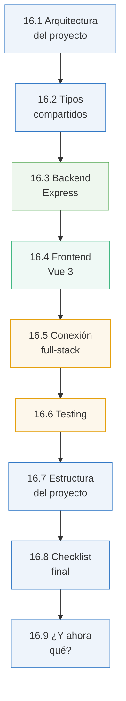
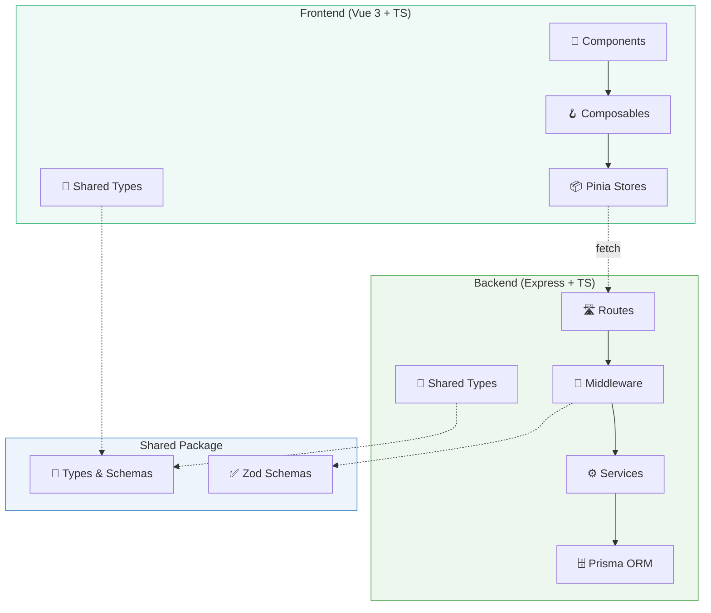
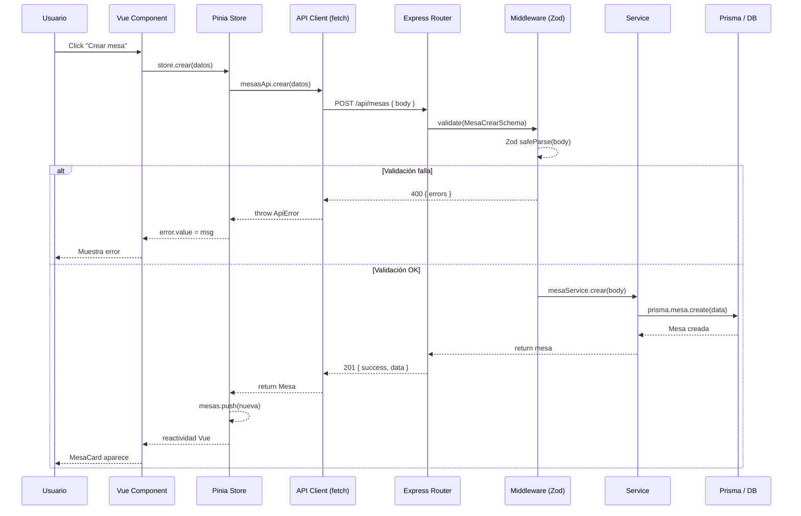

# 🏆 Capítulo 16: Proyecto final — MakeMenu

<div class="chapter-meta">
  <span class="meta-item">🕐 6-8 horas</span>
  <span class="meta-item">📊 Nivel: Avanzado</span>
  <span class="meta-item">🎯 Semana 8</span>
</div>

<div class="chapter-objective">
  <span class="objective-icon">📌</span>
  <span class="objective-text">Al terminar este capítulo, habrás construido MakeMenu completo: un SaaS fullstack con Vue 3 + Express + Prisma + TypeScript end-to-end. Arquitectura, auth, CRUD, testing y deploy.</span>
</div>

<div class="chapter-map">



</div>

!!! quote "Contexto"
    Este capítulo final une todo lo que has aprendido en un proyecto completo: **MakeMenu**, tu sistema de gestión de mesas para restaurantes. Frontend Vue 3, backend Express, tipos compartidos, validación con Zod, y Prisma ORM. TypeScript **end-to-end**.

<div class="connection-box">
<strong>🔗 Conexión ←</strong> Este capítulo integra TODO lo que construiste: el frontend de Vue 3 del <a href='../14-vue/'>Capítulo 14</a> y el backend de Node.js del <a href='../15-node/'>Capítulo 15</a>. Ahora los conectas.
</div>

---

<div class="concept-question">
<strong>🤔 Pregunta para reflexionar:</strong> Si tuvieras que construir una app de gestión de restaurante desde cero, ¿cómo organizarías el código? ¿Monorepo o repos separados? ¿Carpetas por feature o por capa técnica?
</div>

## 16.1 Arquitectura del proyecto



<div class="code-evolution">
<h4>📈 Evolución de código: Arquitectura de proyecto fullstack</h4>

<div class="evolution-step">
<span class="evolution-label">v1 — Novato: todo en un archivo, sin tipos</span>

```typescript
// ❌ Todo en un solo archivo, sin estructura, sin tipos
// server.js (800+ líneas)
const express = require('express')
const app = express()

app.get('/api/mesas', (req, res) => {
  const mesas = db.query('SELECT * FROM mesas') // any
  res.json(mesas) // ¿qué forma tiene esto? Ni idea...
})

app.post('/api/mesas', (req, res) => {
  // Sin validación, sin tipos, sin manejo de errores
  db.query('INSERT INTO mesas ...', req.body) // 💥 SQL injection
  res.json({ ok: true })
})

// ...600 líneas más de rutas, lógica y queries mezcladas 😩
```
</div>

<div class="evolution-step">
<span class="evolution-label">v2 — Con estructura: rutas/servicios/modelos con tipos básicos</span>

```typescript
// ✅ Archivos separados con tipos básicos
// routes/mesas.ts
import { Router } from 'express'
import { MesaService } from '../services/mesa.service'

interface Mesa {
  id: number
  número: number
  zona: string // ← string genérico, no enum tipado
}

const router = Router()
router.get('/', async (req, res) => {
  const mesas: Mesa[] = await MesaService.getAll()
  res.json({ data: mesas })
})
```
</div>

<div class="evolution-step">
<span class="evolution-label">v3 — Profesional: arquitectura por capas, tipos compartidos, DI, error handling</span>

```typescript
// 🏆 Monorepo con paquete compartido, capas tipadas, middleware de validación
// packages/shared/src/types.ts — UNA fuente de verdad
export const MesaSchema = z.object({
  id: z.number(),
  número: z.number().min(1),
  zona: z.enum(["interior", "terraza", "barra", "privado"]),
  capacidad: z.number().min(1).max(20),
})
export type Mesa = z.infer<typeof MesaSchema>

// packages/backend/src/routes/mesas.ts
router.post('/', validate(MesaCrearSchema), async (req, res, next) => {
  // req.body YA está validado y tipado como MesaCrear
  const mesa = await mesaService.crear(req.body)
  res.status(201).json({ success: true, data: mesa })
})

// packages/frontend/src/stores/mesas.ts
const mesas = ref<Mesa[]>([]) // Mismo tipo que el backend
```
</div>
</div>

## 16.2 Tipos compartidos

```typescript title="packages/shared/src/types.ts"
import { z } from 'zod'

// Schemas Zod = validación runtime + tipos TypeScript
export const MesaSchema = z.object({
  id: z.number(),
  número: z.number().min(1),
  zona: z.enum(["interior", "terraza", "barra", "privado"]),
  capacidad: z.number().min(1).max(20),
  ocupada: z.boolean().default(false),
})

export const ReservaSchema = z.object({
  id: z.number(),
  nombre: z.string().min(1).max(100),
  personas: z.number().min(1).max(20),
  hora: z.string().datetime(),
  mesaId: z.number(),
  telefono: z.string().optional(),
  comentarios: z.string().optional(),
})

// Tipos inferidos
export type Mesa = z.infer<typeof MesaSchema>
export type Reserva = z.infer<typeof ReservaSchema>

// Tipos derivados con utility types
export type MesaCrear = Omit<Mesa, "id">
export type MesaActualizar = Partial<Omit<Mesa, "id">>
export type ReservaCrear = Omit<Reserva, "id">

// API Response genérico
export interface ApiResponse<T> {
  success: boolean
  data: T
  message?: string
}

export interface Paginado<T> extends ApiResponse<T[]> {
  total: number
  pagina: number
  porPagina: number
}

export type Zona = Mesa["zona"]  // "interior" | "terraza" | "barra" | "privado"
```

<div class="micro-exercise">
<strong>✏️ Micro-ejercicio:</strong> Define las interfaces completas del dominio de MakeMenu: <code>Plato</code>, <code>Mesa</code>, <code>Pedido</code>, <code>LineaPedido</code>, <code>Usuario</code>. Cada una con sus relaciones tipadas. Por ejemplo, <code>Pedido</code> debe tener <code>lineas: LineaPedido[]</code> y <code>mesa: Mesa</code>.
</div>

## 16.3 Backend Express: implementación completa

El backend sigue una arquitectura en tres capas: **Router** (recibe peticiones), **Service** (lógica de negocio), y **Prisma** (acceso a datos). Cada capa está completamente tipada.

<div class="concept-question">
<strong>🤔 Pregunta para reflexionar:</strong> ¿Cómo autenticarías a los usuarios de MakeMenu? ¿JWT, sesiones, OAuth? ¿Cómo tipar el usuario autenticado para que esté disponible en todas las rutas protegidas?
</div>

### Punto de entrada del servidor

```typescript title="packages/backend/src/index.ts"
import express from 'express'
import cors from 'cors'
import { mesasRouter } from './routes/mesas'
import { reservasRouter } from './routes/reservas'
import { errorHandler } from './middleware/errorHandler'

const app = express()
const PORT = process.env.PORT ?? 3000

// Middleware global
app.use(cors({ origin: 'http://localhost:5173' })) // (1)!
app.use(express.json())

// Rutas
app.use('/api/mesas', mesasRouter)
app.use('/api/reservas', reservasRouter)

// Middleware de errores (siempre al final)
app.use(errorHandler)

app.listen(PORT, () => {
  console.log(`MakeMenu API corriendo en http://localhost:${PORT}`)
})
```

1. CORS configurado para el puerto de Vite en desarrollo. En producción usarías una variable de entorno.

<div class="pro-tip">
<strong>💡 Pro tip:</strong> Siempre implementa rate limiting y helmet desde el día 1. <code>app.use(helmet())</code> y <code>app.use(rateLimit({ windowMs: 15*60*1000, max: 100 }))</code> previenen las vulnerabilidades más comunes.
</div>

<div class="connection-box back" markdown>
:link: **Conexión con el Capítulo 15** — En el <a href='../15-node/'>Capítulo 15</a> viste la versión básica de este middleware. Aquí la evolucionamos para el monorepo de MakeMenu: con `export`, errores formateados con `flatten().fieldErrors`, y tipos compartidos del paquete `@makemenu/shared`.
</div>

### Middleware genérico de validación Zod

```typescript title="packages/backend/src/middleware/validate.ts"
import { Request, Response, NextFunction } from 'express'
import { ZodSchema, ZodError } from 'zod'

// Middleware genérico: válida body contra un schema Zod
export function validate<T>(schema: ZodSchema<T>) { // (1)!
  return (req: Request, res: Response, next: NextFunction) => {
    const result = schema.safeParse(req.body)

    if (!result.success) {
      return res.status(400).json({
        success: false,
        message: 'Error de validación',
        errors: result.error.flatten().fieldErrors, // (2)!
      })
    }

    // Reemplazar body con los datos parseados y tipados
    req.body = result.data
    next()
  }
}
```

1. El genérico `T` se infiere automáticamente del schema. Si pasas `MesaCrearSchema`, `req.body` será `MesaCrear`.
2. `flatten()` transforma los errores de Zod en un formato limpio: `{ campo: ["mensaje de error"] }`.

### Middleware de manejo de errores

```typescript title="packages/backend/src/middleware/errorHandler.ts"
import { Request, Response, NextFunction } from 'express'
import { ZodError } from 'zod'
import { Prisma } from '@prisma/client'
import type { ApiResponse } from '@makemenu/shared'

// Error personalizado para la aplicación
export class AppError extends Error {
  constructor(
    public statusCode: number,
    message: string,
    public code?: string
  ) {
    super(message)
    this.name = 'AppError'
  }
}

// Middleware centralizado de errores
export function errorHandler(
  err: Error,
  _req: Request,
  res: Response<ApiResponse<null>>,
  _next: NextFunction
): void {
  // Errores de validación Zod
  if (err instanceof ZodError) {
    res.status(400).json({
      success: false,
      data: null,
      message: err.errors.map(e => e.message).join(', '),
    })
    return
  }

  // Errores de la aplicación
  if (err instanceof AppError) {
    res.status(err.statusCode).json({
      success: false,
      data: null,
      message: err.message,
    })
    return
  }

  // Errores de Prisma (registro no encontrado)
  if (err instanceof Prisma.PrismaClientKnownRequestError) { // (1)!
    if (err.code === 'P2025') {
      res.status(404).json({
        success: false,
        data: null,
        message: 'Recurso no encontrado',
      })
      return
    }
  }

  // Error genérico (no exponer detalles internos)
  console.error('Error no controlado:', err)
  res.status(500).json({
    success: false,
    data: null,
    message: 'Error interno del servidor',
  })
}
```

1. Prisma tiene códigos de error estandarizados. `P2025` significa "registro no encontrado", `P2002` es "violación de campo único".

### Service layer: Mesa

```typescript title="packages/backend/src/services/mesa.service.ts"
import { PrismaClient } from '@prisma/client'
import type { Mesa, MesaCrear, MesaActualizar } from '@makemenu/shared'
import { AppError } from '../middleware/errorHandler'

const prisma = new PrismaClient()

export const mesaService = {
  async obtenerTodas(): Promise<Mesa[]> {
    return prisma.mesa.findMany({
      orderBy: { número: 'asc' },
    })
  },

  async obtenerPorId(id: number): Promise<Mesa> {
    const mesa = await prisma.mesa.findUnique({
      where: { id },
      include: { reservas: true }, // (1)!
    })

    if (!mesa) {
      throw new AppError(404, `Mesa con id ${id} no encontrada`)
    }

    return mesa
  },

  async crear(datos: MesaCrear): Promise<Mesa> {
    // Verificar que no exista una mesa con el mismo número
    const existente = await prisma.mesa.findUnique({
      where: { número: datos.número },
    })

    if (existente) {
      throw new AppError(409, `Ya existe una mesa con el número ${datos.número}`)
    }

    return prisma.mesa.create({ data: datos })
  },

  async actualizar(id: number, datos: MesaActualizar): Promise<Mesa> {
    await mesaService.obtenerPorId(id) // Lanza 404 si no existe
    return prisma.mesa.update({
      where: { id },
      data: datos,
    })
  },

  async eliminar(id: number): Promise<Mesa> {
    await mesaService.obtenerPorId(id) // (2)!
    return prisma.mesa.delete({ where: { id } })
  },

  async obtenerPorZona(zona: Mesa['zona']): Promise<Mesa[]> {
    return prisma.mesa.findMany({
      where: { zona },
      orderBy: { número: 'asc' },
    })
  },

  async toggleOcupada(id: number): Promise<Mesa> {
    const mesa = await mesaService.obtenerPorId(id)
    return prisma.mesa.update({
      where: { id },
      data: { ocupada: !mesa.ocupada },
    })
  },
}
```

1. `include: { reservas: true }` carga las reservas relacionadas. Prisma genera automáticamente el tipo de retorno que incluye la relación.
2. Validar que exista antes de eliminar: así el error es más claro (`AppError 404`) que el error genérico de Prisma.

### Service layer: Reserva

```typescript title="packages/backend/src/services/reserva.service.ts"
import { PrismaClient } from '@prisma/client'
import type { Reserva, ReservaCrear } from '@makemenu/shared'
import { AppError } from '../middleware/errorHandler'

const prisma = new PrismaClient()

export const reservaService = {
  async obtenerTodas(): Promise<Reserva[]> {
    return prisma.reserva.findMany({
      include: { mesa: true },
      orderBy: { hora: 'asc' },
    })
  },

  async obtenerPorId(id: number): Promise<Reserva> {
    const reserva = await prisma.reserva.findUnique({
      where: { id },
      include: { mesa: true },
    })

    if (!reserva) {
      throw new AppError(404, `Reserva con id ${id} no encontrada`)
    }

    return reserva
  },

  async crear(datos: ReservaCrear): Promise<Reserva> {
    // Verificar que la mesa existe
    const mesa = await prisma.mesa.findUnique({
      where: { id: datos.mesaId },
    })

    if (!mesa) {
      throw new AppError(404, `Mesa con id ${datos.mesaId} no encontrada`)
    }

    if (mesa.ocupada) {
      throw new AppError(409, `La mesa ${mesa.número} ya está ocupada`)
    }

    // Crear reserva y marcar mesa como ocupada en transacción
    const [reserva] = await prisma.$transaction([ // (1)!
      prisma.reserva.create({ data: datos }),
      prisma.mesa.update({
        where: { id: datos.mesaId },
        data: { ocupada: true },
      }),
    ])

    return reserva
  },

  async eliminar(id: number): Promise<Reserva> {
    const reserva = await reservaService.obtenerPorId(id)

    // Eliminar reserva y liberar mesa en transacción
    const [eliminada] = await prisma.$transaction([
      prisma.reserva.delete({ where: { id } }),
      prisma.mesa.update({
        where: { id: reserva.mesaId },
        data: { ocupada: false },
      }),
    ])

    return eliminada
  },

  async obtenerPorMesa(mesaId: number): Promise<Reserva[]> {
    return prisma.reserva.findMany({
      where: { mesaId },
      orderBy: { hora: 'asc' },
    })
  },
}
```

1. `$transaction` garantiza atomicidad: si falla la creación de la reserva, no se marca la mesa como ocupada. Ambas operaciones ocurren o ninguna.

### Router de mesas (CRUD completo)

```typescript title="packages/backend/src/routes/mesas.ts"
import { Router, Request, Response, NextFunction } from 'express'
import { mesaService } from '../services/mesa.service'
import { validate } from '../middleware/validate'
import { MesaSchema } from '@makemenu/shared'
import type { Mesa, ApiResponse } from '@makemenu/shared'

export const mesasRouter = Router()

// Schemas de validación para crear/actualizar
const MesaCrearSchema = MesaSchema.omit({ id: true }) // (1)!
const MesaActualizarSchema = MesaSchema.omit({ id: true }).partial()

// GET /api/mesas
mesasRouter.get(
  '/',
  async (_req: Request, res: Response<ApiResponse<Mesa[]>>, next: NextFunction) => {
    try {
      const mesas = await mesaService.obtenerTodas()
      res.json({ success: true, data: mesas })
    } catch (err) {
      next(err)
    }
  }
)

// GET /api/mesas/:id
mesasRouter.get(
  '/:id',
  async (req: Request<{ id: string }>, res: Response<ApiResponse<Mesa>>, next: NextFunction) => {
    try {
      const mesa = await mesaService.obtenerPorId(Number(req.params.id))
      res.json({ success: true, data: mesa })
    } catch (err) {
      next(err)
    }
  }
)

// POST /api/mesas
mesasRouter.post(
  '/',
  validate(MesaCrearSchema), // (2)!
  async (req: Request, res: Response<ApiResponse<Mesa>>, next: NextFunction) => {
    try {
      const mesa = await mesaService.crear(req.body)
      res.status(201).json({ success: true, data: mesa })
    } catch (err) {
      next(err)
    }
  }
)

// PATCH /api/mesas/:id
mesasRouter.patch(
  '/:id',
  validate(MesaActualizarSchema),
  async (req: Request<{ id: string }>, res: Response<ApiResponse<Mesa>>, next: NextFunction) => {
    try {
      const mesa = await mesaService.actualizar(Number(req.params.id), req.body)
      res.json({ success: true, data: mesa })
    } catch (err) {
      next(err)
    }
  }
)

// DELETE /api/mesas/:id
mesasRouter.delete(
  '/:id',
  async (req: Request<{ id: string }>, res: Response<ApiResponse<Mesa>>, next: NextFunction) => {
    try {
      const mesa = await mesaService.eliminar(Number(req.params.id))
      res.json({ success: true, data: mesa, message: 'Mesa eliminada' })
    } catch (err) {
      next(err)
    }
  }
)

// PATCH /api/mesas/:id/toggle
mesasRouter.patch(
  '/:id/toggle',
  async (req: Request<{ id: string }>, res: Response<ApiResponse<Mesa>>, next: NextFunction) => {
    try {
      const mesa = await mesaService.toggleOcupada(Number(req.params.id))
      res.json({ success: true, data: mesa })
    } catch (err) {
      next(err)
    }
  }
)
```

1. Reutilizamos el `MesaSchema` de `@makemenu/shared` para derivar los schemas de creación y actualización. Un solo schema como fuente de verdad.
2. El middleware `validate` parsea el body antes de que llegue al handler. Si falla, responde 400 automáticamente.

<div class="micro-exercise">
<strong>✏️ Micro-ejercicio:</strong> Implementa el endpoint <code>PATCH /api/platos/:id</code> con validación Zod parcial (<code>crearPlatoSchema.partial()</code>) y actualización Prisma. Sigue el mismo patrón del router de mesas: middleware <code>validate</code>, llamada al service, y respuesta tipada <code>ApiResponse&lt;Plato&gt;</code>.
</div>

### Router de reservas

```typescript title="packages/backend/src/routes/reservas.ts"
import { Router, Request, Response, NextFunction } from 'express'
import { reservaService } from '../services/reserva.service'
import { validate } from '../middleware/validate'
import { ReservaSchema } from '@makemenu/shared'
import type { Reserva, ApiResponse } from '@makemenu/shared'

export const reservasRouter = Router()

const ReservaCrearSchema = ReservaSchema.omit({ id: true })

// GET /api/reservas
reservasRouter.get(
  '/',
  async (_req: Request, res: Response<ApiResponse<Reserva[]>>, next: NextFunction) => {
    try {
      const reservas = await reservaService.obtenerTodas()
      res.json({ success: true, data: reservas })
    } catch (err) {
      next(err)
    }
  }
)

// GET /api/reservas/:id
reservasRouter.get(
  '/:id',
  async (req: Request<{ id: string }>, res: Response<ApiResponse<Reserva>>, next: NextFunction) => {
    try {
      const reserva = await reservaService.obtenerPorId(Number(req.params.id))
      res.json({ success: true, data: reserva })
    } catch (err) {
      next(err)
    }
  }
)

// POST /api/reservas
reservasRouter.post(
  '/',
  validate(ReservaCrearSchema),
  async (req: Request, res: Response<ApiResponse<Reserva>>, next: NextFunction) => {
    try {
      const reserva = await reservaService.crear(req.body)
      res.status(201).json({ success: true, data: reserva })
    } catch (err) {
      next(err)
    }
  }
)

// DELETE /api/reservas/:id
reservasRouter.delete(
  '/:id',
  async (req: Request<{ id: string }>, res: Response<ApiResponse<Reserva>>, next: NextFunction) => {
    try {
      const reserva = await reservaService.eliminar(Number(req.params.id))
      res.json({ success: true, data: reserva, message: 'Reserva eliminada' })
    } catch (err) {
      next(err)
    }
  }
)

// GET /api/reservas/mesa/:mesaId
reservasRouter.get(
  '/mesa/:mesaId',
  async (req: Request<{ mesaId: string }>, res: Response<ApiResponse<Reserva[]>>, next: NextFunction) => {
    try {
      const reservas = await reservaService.obtenerPorMesa(Number(req.params.mesaId))
      res.json({ success: true, data: reservas })
    } catch (err) {
      next(err)
    }
  }
)
```

!!! tip "Patrón async handler"
    Observa que cada handler envuelve su cuerpo en `try/catch` y pasa errores a `next()`. Para evitar esta repetición, puedes crear un wrapper:

    ```typescript
    type AsyncHandler = (req: Request, res: Response, next: NextFunction) => Promise<void>

    function asyncHandler(fn: AsyncHandler) {
      return (req: Request, res: Response, next: NextFunction) => {
        fn(req, res, next).catch(next)
      }
    }

    // Uso: mesasRouter.get('/', asyncHandler(async (req, res) => { ... }))
    ```

---

## 16.4 Frontend Vue 3: implementación completa

El frontend consume la API del backend usando un cliente tipado, gestiona el estado con Pinia, y presenta los datos con componentes Vue tipados.

### Cliente API tipado con fetch

```typescript title="packages/frontend/src/api/client.ts"
import type { ApiResponse } from '@makemenu/shared'

const BASE_URL = import.meta.env.VITE_API_URL ?? 'http://localhost:3000/api' // (1)!

// Errores de la API con información estructurada
export class ApiError extends Error {
  constructor(
    public status: number,
    message: string,
    public errors?: Record<string, string[]>
  ) {
    super(message)
    this.name = 'ApiError'
  }
}

// Cliente genérico para todas las peticiones
async function request<T>(
  endpoint: string,
  options: RequestInit = {}
): Promise<T> {
  const res = await fetch(`${BASE_URL}${endpoint}`, {
    headers: {
      'Content-Type': 'application/json',
      ...options.headers,
    },
    ...options,
  })

  const json: ApiResponse<T> = await res.json()

  if (!res.ok || !json.success) {
    throw new ApiError(
      res.status,
      json.message ?? 'Error desconocido',
    )
  }

  return json.data // (2)!
}

// API tipada — cada método retorna el tipo exacto
export const api = {
  get: <T>(endpoint: string) =>
    request<T>(endpoint),

  post: <T>(endpoint: string, body: unknown) =>
    request<T>(endpoint, {
      method: 'POST',
      body: JSON.stringify(body),
    }),

  patch: <T>(endpoint: string, body: unknown) =>
    request<T>(endpoint, {
      method: 'PATCH',
      body: JSON.stringify(body),
    }),

  delete: <T>(endpoint: string) =>
    request<T>(endpoint, { method: 'DELETE' }),
}
```

1. `import.meta.env.VITE_API_URL` usa variables de entorno de Vite. En desarrollo apunta a `localhost:3000`, en producción a la URL real.
2. Desempaquetamos `data` de `ApiResponse<T>`, así el consumidor recibe directamente el tipo `T` sin tener que navegar la estructura de respuesta.

### API de mesas y reservas

```typescript title="packages/frontend/src/api/mesas.ts"
import { api } from './client'
import type { Mesa, MesaCrear, MesaActualizar } from '@makemenu/shared'

export const mesasApi = {
  obtenerTodas: () =>
    api.get<Mesa[]>('/mesas'),

  obtenerPorId: (id: number) =>
    api.get<Mesa>(`/mesas/${id}`),

  crear: (datos: MesaCrear) =>
    api.post<Mesa>('/mesas', datos),

  actualizar: (id: number, datos: MesaActualizar) =>
    api.patch<Mesa>(`/mesas/${id}`, datos),

  eliminar: (id: number) =>
    api.delete<Mesa>(`/mesas/${id}`),

  toggleOcupada: (id: number) =>
    api.patch<Mesa>(`/mesas/${id}/toggle`, {}),
}
```

```typescript title="packages/frontend/src/api/reservas.ts"
import { api } from './client'
import type { Reserva, ReservaCrear } from '@makemenu/shared'

export const reservasApi = {
  obtenerTodas: () =>
    api.get<Reserva[]>('/reservas'),

  obtenerPorId: (id: number) =>
    api.get<Reserva>(`/reservas/${id}`),

  crear: (datos: ReservaCrear) =>
    api.post<Reserva>('/reservas', datos),

  eliminar: (id: number) =>
    api.delete<Reserva>(`/reservas/${id}`),

  obtenerPorMesa: (mesaId: number) =>
    api.get<Reserva[]>(`/reservas/mesa/${mesaId}`),
}
```

### Pinia Store con API real

```typescript title="packages/frontend/src/stores/mesas.ts"
import { defineStore } from 'pinia'
import { ref, computed } from 'vue'
import type { Mesa, Zona, MesaCrear } from '@makemenu/shared'
import { mesasApi } from '@/api/mesas'

export const useMesasStore = defineStore('mesas', () => {
  // State
  const mesas = ref<Mesa[]>([])
  const mesaSeleccionada = ref<Mesa | null>(null)
  const cargando = ref(false)
  const error = ref<string | null>(null)

  // Getters
  const mesasLibres = computed(() =>
    mesas.value.filter(m => !m.ocupada)
  )

  const porZona = computed(() => // (1)!
    mesas.value.reduce<Record<Zona, Mesa[]>>(
      (acc, mesa) => {
        (acc[mesa.zona] ??= []).push(mesa)
        return acc
      },
      {} as Record<Zona, Mesa[]>
    )
  )

  const ocupación = computed(() => {
    if (mesas.value.length === 0) return 0
    const ocupadas = mesas.value.filter(m => m.ocupada).length
    return Math.round((ocupadas / mesas.value.length) * 100)
  })

  // Actions
  async function cargar() {
    cargando.value = true
    error.value = null
    try {
      mesas.value = await mesasApi.obtenerTodas()
    } catch (e) {
      error.value = e instanceof Error ? e.message : 'Error al cargar mesas'
    } finally {
      cargando.value = false
    }
  }

  async function crear(datos: MesaCrear) {
    const nueva = await mesasApi.crear(datos)
    mesas.value.push(nueva)
    return nueva
  }

  async function toggleOcupada(id: number) {
    const actualizada = await mesasApi.toggleOcupada(id)
    const idx = mesas.value.findIndex(m => m.id === id)
    if (idx !== -1) mesas.value[idx] = actualizada
  }

  async function eliminar(id: number) {
    await mesasApi.eliminar(id)
    mesas.value = mesas.value.filter(m => m.id !== id)
    if (mesaSeleccionada.value?.id === id) {
      mesaSeleccionada.value = null
    }
  }

  function seleccionar(mesa: Mesa | null) {
    mesaSeleccionada.value = mesa
  }

  return {
    // State
    mesas, mesaSeleccionada, cargando, error,
    // Getters
    mesasLibres, porZona, ocupación,
    // Actions
    cargar, crear, toggleOcupada, eliminar, seleccionar,
  }
})
```

1. `porZona` devuelve un `Record<Zona, Mesa[]>` donde las mesas se agrupan por su zona. TypeScript garantiza que las claves solo pueden ser los valores del tipo `Zona`.

<div class="pro-tip">
<strong>💡 Pro tip:</strong> En producción, MakeMenu usa un monorepo con <code>packages/shared</code> que contiene las interfaces compartidas entre frontend y backend. Un solo <code>import { Plato } from '@makemenu/shared'</code> — un solo source of truth.
</div>

### Componente MesaCard

```vue title="packages/frontend/src/components/MesaCard.vue"
<script setup lang="ts">
import { computed } from 'vue'
import type { Mesa } from '@makemenu/shared'

interface Props {
  mesa: Mesa
  seleccionada?: boolean
}

const props = withDefaults(defineProps<Props>(), {
  seleccionada: false,
})

const emit = defineEmits<{
  seleccionar: [mesa: Mesa]
  toggle: [id: number]
  eliminar: [id: number]
}>()

const claseZona = computed(() => `mesa-card--${props.mesa.zona}`) // (1)!

const estadoTexto = computed(() =>
  props.mesa.ocupada ? 'Ocupada' : 'Libre'
)
</script>

<template>
  <div
    class="mesa-card"
    :class="[
      claseZona,
      {
        'mesa-card--ocupada': mesa.ocupada,
        'mesa-card--seleccionada': seleccionada,
      }
    ]"
    @click="emit('seleccionar', mesa)"
  >
    <div class="mesa-card__header">
      <h3>Mesa {{ mesa.número }}</h3>
      <span class="mesa-card__estado">{{ estadoTexto }}</span>
    </div>

    <div class="mesa-card__info">
      <span>{{ mesa.zona }}</span>
      <span>{{ mesa.capacidad }} personas</span>
    </div>

    <div class="mesa-card__actions">
      <button @click.stop="emit('toggle', mesa.id)">
        {{ mesa.ocupada ? 'Liberar' : 'Ocupar' }}
      </button>
      <button @click.stop="emit('eliminar', mesa.id)" class="btn--danger">
        Eliminar
      </button>
    </div>
  </div>
</template>
```

1. Clase CSS dinámica basada en la zona: `mesa-card--terraza`, `mesa-card--barra`, etc. TypeScript sabe que `mesa.zona` solo puede ser uno de los cuatro valores del enum.

### Vista MesasView con composable

```vue title="packages/frontend/src/views/MesasView.vue"
<script setup lang="ts">
import { onMounted, ref } from 'vue'
import { useMesasStore } from '@/stores/mesas'
import { storeToRefs } from 'pinia'
import MesaCard from '@/components/MesaCard.vue'
import MesaForm from '@/components/MesaForm.vue'
import type { Mesa, MesaCrear, Zona } from '@makemenu/shared'

const store = useMesasStore()
const { mesas, cargando, error, mesasLibres, porZona, ocupación } = storeToRefs(store) // (1)!

const mostrarFormulario = ref(false)
const filtroZona = ref<Zona | 'todas'>('todas')

const mesasFiltradas = computed(() => {
  if (filtroZona.value === 'todas') return mesas.value
  return mesas.value.filter(m => m.zona === filtroZona.value)
})

async function handleCrear(datos: MesaCrear) {
  try {
    await store.crear(datos)
    mostrarFormulario.value = false
  } catch (e) {
    // Error manejado por el store
  }
}

async function handleToggle(id: number) {
  await store.toggleOcupada(id)
}

async function handleEliminar(id: number) {
  if (confirm('¿Eliminar esta mesa?')) {
    await store.eliminar(id)
  }
}

onMounted(() => store.cargar())
</script>

<template>
  <div class="mesas-view">
    <header>
      <h1>Mesas del restaurante</h1>
      <p>Ocupación: {{ ocupación }}% ({{ mesasLibres.length }} libres)</p>

      <!-- Filtro por zona -->
      <select v-model="filtroZona">
        <option value="todas">Todas las zonas</option>
        <option value="interior">Interior</option>
        <option value="terraza">Terraza</option>
        <option value="barra">Barra</option>
        <option value="privado">Privado</option>
      </select>

      <button @click="mostrarFormulario = !mostrarFormulario">
        {{ mostrarFormulario ? 'Cancelar' : 'Nueva mesa' }}
      </button>
    </header>

    <!-- Formulario de creación -->
    <MesaForm v-if="mostrarFormulario" @submit="handleCrear" />

    <!-- Estado de carga y error -->
    <p v-if="cargando">Cargando mesas...</p>
    <p v-else-if="error" class="error">{{ error }}</p>

    <!-- Grid de mesas -->
    <div v-else class="mesas-grid">
      <MesaCard
        v-for="mesa in mesasFiltradas"
        :key="mesa.id"
        :mesa="mesa"
        @seleccionar="store.seleccionar"
        @toggle="handleToggle"
        @eliminar="handleEliminar"
      />
    </div>
  </div>
</template>
```

1. `storeToRefs` extrae las propiedades reactivas del store sin perder la reactividad. Sin él, desestructurar `store` rompería la reactividad de `mesas`, `cargando`, etc.

### Formulario con validación Zod en frontend

```vue title="packages/frontend/src/components/MesaForm.vue"
<script setup lang="ts">
import { reactive, ref } from 'vue'
import { MesaSchema } from '@makemenu/shared'
import type { MesaCrear, Zona } from '@makemenu/shared'

const emit = defineEmits<{
  submit: [datos: MesaCrear]
}>()

const zonas: Zona[] = ['interior', 'terraza', 'barra', 'privado']

const form = reactive<MesaCrear>({
  número: 1,
  zona: 'interior',
  capacidad: 4,
  ocupada: false,
})

const errores = ref<Record<string, string[]>>({})

function validar(): boolean {
  const MesaCrearSchema = MesaSchema.omit({ id: true })
  const result = MesaCrearSchema.safeParse(form) // (1)!

  if (!result.success) {
    errores.value = result.error.flatten().fieldErrors as Record<string, string[]>
    return false
  }

  errores.value = {}
  return true
}

function handleSubmit() {
  if (validar()) {
    emit('submit', { ...form })
  }
}
</script>

<template>
  <form @submit.prevent="handleSubmit" class="mesa-form">
    <div class="field">
      <label for="número">Número de mesa</label>
      <input id="número" v-model.number="form.número" type="number" min="1" />
      <span v-if="errores.número" class="error">{{ errores.número[0] }}</span>
    </div>

    <div class="field">
      <label for="zona">Zona</label>
      <select id="zona" v-model="form.zona">
        <option v-for="z in zonas" :key="z" :value="z">{{ z }}</option>
      </select>
      <span v-if="errores.zona" class="error">{{ errores.zona[0] }}</span>
    </div>

    <div class="field">
      <label for="capacidad">Capacidad</label>
      <input id="capacidad" v-model.number="form.capacidad" type="number" min="1" max="20" />
      <span v-if="errores.capacidad" class="error">{{ errores.capacidad[0] }}</span>
    </div>

    <button type="submit">Crear mesa</button>
  </form>
</template>
```

1. El **mismo schema Zod** que usa el backend para validar. Un typo en el nombre de un campo o un tipo incorrecto se detecta en compilación. La validación es idéntica en ambos lados.

!!! info "Validación Zod compartida"
    Este es el beneficio principal del monorepo: el **mismo schema** válida en frontend (antes de enviar) y en backend (antes de procesar). Si cambias una regla en `@makemenu/shared`, ambos lados se actualizan automáticamente.

---

## 16.5 Conexión full-stack

### Flujo de una petición completa



### Configuración CORS

```typescript title="packages/backend/src/index.ts (fragmento)"
import cors from 'cors'

// En desarrollo: permitir el origen de Vite
const corsOptions: cors.CorsOptions = {
  origin: process.env.CORS_ORIGIN ?? 'http://localhost:5173',
  methods: ['GET', 'POST', 'PATCH', 'DELETE'],
  allowedHeaders: ['Content-Type', 'Authorization'],
  credentials: true, // (1)!
}

app.use(cors(corsOptions))
```

1. `credentials: true` permite enviar cookies entre dominios. Necesario si implementas autenticación con sesiones.

### Variables de entorno tipadas

```typescript title="packages/backend/src/config.ts"
import { z } from 'zod'

// Validar variables de entorno al arrancar
const EnvSchema = z.object({
  PORT: z.string().transform(Number).default('3000'),
  DATABASE_URL: z.string().url(),
  CORS_ORIGIN: z.string().url().default('http://localhost:5173'),
  NODE_ENV: z.enum(['development', 'production', 'test']).default('development'),
})

// Si falta alguna variable, la app no arranca
export const env = EnvSchema.parse(process.env) // (1)!
```

1. `EnvSchema.parse` lanza un error detallado si alguna variable falta o tiene formato incorrecto. Esto previene errores silenciosos en producción.

```typescript title="packages/frontend/src/env.d.ts"
/// <reference types="vite/client" />

// Tipar import.meta.env para autocompletado
interface ImportMetaEnv {
  readonly VITE_API_URL: string
}

interface ImportMeta {
  readonly env: ImportMetaEnv
}
```

!!! warning "Variables de entorno en Vite"
    En Vite, solo las variables con prefijo `VITE_` se exponen al frontend. Nunca pongas secretos (claves de API, URLs de base de datos) en variables `VITE_` porque se incluyen en el bundle de producción.

### Patrones de manejo de errores

```typescript title="packages/frontend/src/composables/useApiError.ts"
import { ref } from 'vue'
import { ApiError } from '@/api/client'

export function useApiError() {
  const error = ref<string | null>(null)
  const erroresCampo = ref<Record<string, string[]>>({})

  function manejar(err: unknown) {
    if (err instanceof ApiError) {
      error.value = err.message

      if (err.status === 400 && err.errors) {
        erroresCampo.value = err.errors // (1)!
      }
    } else if (err instanceof Error) {
      error.value = err.message
    } else {
      error.value = 'Ha ocurrido un error inesperado'
    }
  }

  function limpiar() {
    error.value = null
    erroresCampo.value = {}
  }

  return { error, erroresCampo, manejar, limpiar }
}
```

1. Los errores de validación del backend (generados por Zod) llegan como `{ campo: ["mensaje"] }`. Este composable los separa para mostrarlos junto a cada campo del formulario.

---

<div class="concept-question">
<strong>🤔 Pregunta para reflexionar:</strong> ¿Cómo testeas una API fullstack? ¿Tests unitarios de servicios, tests de integración de endpoints, o tests e2e con el frontend? ¿Cuál es la proporción ideal?
</div>

## 16.6 Testing

<div class="misconception-box">
<h4>⚠️ Errores comunes</h4>
<ul>
<li><span class="wrong">❌ Mito:</span> "Un proyecto real necesita muchas dependencias" → <span class="right">✅ Realidad:</span> MakeMenu usa solo lo esencial: Express, Prisma, Zod, Vue 3, Pinia. Menos dependencias = menos bugs, menos vulnerabilidades.</li>
<li><span class="wrong">❌ Mito:</span> "Primero construyo todo, luego añado tipos" → <span class="right">✅ Realidad:</span> En TS, los tipos van PRIMERO. Define tus interfaces de dominio antes de escribir implementación. Los tipos son tu diseño.</li>
<li><span class="wrong">❌ Mito:</span> "Los tests fullstack son muy difíciles" → <span class="right">✅ Realidad:</span> Con Prisma test client y supertest, testear endpoints es tan fácil como <code>await request(app).get('/api/platos').expect(200)</code>.</li>
</ul>
</div>

### Tests del backend con Vitest

```typescript title="packages/backend/tests/services/mesa.service.test.ts"
import { describe, it, expect, beforeEach, vi } from 'vitest'
import { mesaService } from '../../src/services/mesa.service'
import { AppError } from '../../src/middleware/errorHandler'
import type { Mesa, MesaCrear } from '@makemenu/shared'

// Mock de Prisma
vi.mock('@prisma/client', () => {
  const mesas: Mesa[] = [
    { id: 1, número: 1, zona: 'interior', capacidad: 4, ocupada: false },
    { id: 2, número: 2, zona: 'terraza', capacidad: 6, ocupada: true },
    { id: 3, número: 3, zona: 'barra', capacidad: 2, ocupada: false },
  ]

  return {
    PrismaClient: vi.fn().mockImplementation(() => ({ // (1)!
      mesa: {
        findMany: vi.fn().mockResolvedValue(mesas),
        findUnique: vi.fn().mockImplementation(({ where }) => {
          const mesa = mesas.find(m => m.id === where.id || m.número === where.número)
          return Promise.resolve(mesa ?? null)
        }),
        create: vi.fn().mockImplementation(({ data }) =>
          Promise.resolve({ id: 4, ...data })
        ),
        update: vi.fn().mockImplementation(({ where, data }) => {
          const mesa = mesas.find(m => m.id === where.id)
          return Promise.resolve(mesa ? { ...mesa, ...data } : null)
        }),
        delete: vi.fn().mockImplementation(({ where }) => {
          const mesa = mesas.find(m => m.id === where.id)
          return Promise.resolve(mesa)
        }),
      },
    })),
  }
})

describe('mesaService', () => {
  describe('obtenerTodas', () => {
    it('devuelve todas las mesas ordenadas', async () => {
      const mesas = await mesaService.obtenerTodas()

      expect(mesas).toHaveLength(3)
      expect(mesas[0]).toMatchObject({
        id: 1,
        número: 1,
        zona: 'interior',
      })
    })
  })

  describe('obtenerPorId', () => {
    it('devuelve la mesa si existe', async () => {
      const mesa = await mesaService.obtenerPorId(1)

      expect(mesa).toBeDefined()
      expect(mesa.número).toBe(1)
      expect(mesa.zona).toBe('interior')
    })

    it('lanza AppError 404 si no existe', async () => {
      await expect(mesaService.obtenerPorId(999))
        .rejects
        .toThrow(AppError) // (2)!

      await expect(mesaService.obtenerPorId(999))
        .rejects
        .toMatchObject({ statusCode: 404 })
    })
  })

  describe('crear', () => {
    it('crea una mesa con datos válidos', async () => {
      const datos: MesaCrear = {
        número: 10,
        zona: 'privado',
        capacidad: 8,
        ocupada: false,
      }

      const mesa = await mesaService.crear(datos)

      expect(mesa.id).toBe(4)
      expect(mesa.número).toBe(10)
      expect(mesa.zona).toBe('privado')
    })

    it('lanza error si el número de mesa ya existe', async () => {
      const datos: MesaCrear = {
        número: 1, // Ya existe
        zona: 'terraza',
        capacidad: 4,
        ocupada: false,
      }

      await expect(mesaService.crear(datos))
        .rejects
        .toMatchObject({ statusCode: 409 })
    })
  })

  describe('toggleOcupada', () => {
    it('cambia el estado de ocupada', async () => {
      const mesa = await mesaService.toggleOcupada(1)

      expect(mesa.ocupada).toBe(true) // Era false, ahora true
    })
  })
})
```

1. Mockeamos `PrismaClient` completo. En un proyecto real, considera usar un contenedor Docker con una base de datos de prueba.
2. `rejects.toThrow(AppError)` verifica que la promesa se rechaza con una instancia de `AppError`, no con un error genérico.

### Tests de componentes Vue con Vue Test Utils

```typescript title="packages/frontend/tests/components/MesaCard.test.ts"
import { describe, it, expect } from 'vitest'
import { mount } from '@vue/test-utils'
import MesaCard from '../../src/components/MesaCard.vue'
import type { Mesa } from '@makemenu/shared'

const mesaMock: Mesa = {
  id: 1,
  número: 5,
  zona: 'terraza',
  capacidad: 4,
  ocupada: false,
}

describe('MesaCard', () => {
  it('muestra el número de mesa y la zona', () => {
    const wrapper = mount(MesaCard, {
      props: { mesa: mesaMock },
    })

    expect(wrapper.text()).toContain('Mesa 5')
    expect(wrapper.text()).toContain('terraza')
    expect(wrapper.text()).toContain('4 personas')
  })

  it('muestra "Libre" cuando no está ocupada', () => {
    const wrapper = mount(MesaCard, {
      props: { mesa: mesaMock },
    })

    expect(wrapper.text()).toContain('Libre')
    expect(wrapper.find('.mesa-card--ocupada').exists()).toBe(false)
  })

  it('muestra "Ocupada" cuando está ocupada', () => {
    const mesaOcupada: Mesa = { ...mesaMock, ocupada: true }
    const wrapper = mount(MesaCard, {
      props: { mesa: mesaOcupada },
    })

    expect(wrapper.text()).toContain('Ocupada')
    expect(wrapper.find('.mesa-card--ocupada').exists()).toBe(true)
  })

  it('emite "seleccionar" al hacer click', async () => {
    const wrapper = mount(MesaCard, {
      props: { mesa: mesaMock },
    })

    await wrapper.trigger('click')

    expect(wrapper.emitted('seleccionar')).toBeTruthy()
    expect(wrapper.emitted('seleccionar')![0]).toEqual([mesaMock]) // (1)!
  })

  it('emite "toggle" al clickear el botón de estado', async () => {
    const wrapper = mount(MesaCard, {
      props: { mesa: mesaMock },
    })

    const botonToggle = wrapper.findAll('button')[0]
    await botonToggle.trigger('click')

    expect(wrapper.emitted('toggle')).toBeTruthy()
    expect(wrapper.emitted('toggle')![0]).toEqual([mesaMock.id])
  })

  it('aplica clase CSS de zona correcta', () => {
    const wrapper = mount(MesaCard, {
      props: { mesa: mesaMock },
    })

    expect(wrapper.find('.mesa-card--terraza').exists()).toBe(true)
  })
})
```

1. `wrapper.emitted('seleccionar')![0]` accede al primer evento emitido. El `!` es seguro aquí porque acabamos de verificar con `toBeTruthy()` que el evento fue emitido.

!!! tip "Ejecutar los tests"
    ```bash
    # Tests del backend
    cd packages/backend && npx vitest run

    # Tests del frontend
    cd packages/frontend && npx vitest run

    # Todos los tests desde la raíz (workspace)
    npx vitest run --workspace
    ```

---

## 16.7 Estructura del proyecto

```text
makemenu/
├── package.json                          # Workspace raíz (npm workspaces)
├── tsconfig.base.json                    # Config TS compartida
├── vitest.workspace.ts                   # Configuración Vitest workspace
│
├── packages/
│   ├── shared/                           # Paquete de tipos compartidos
│   │   ├── package.json                  # nombre: @makemenu/shared
│   │   ├── tsconfig.json
│   │   └── src/
│   │       ├── index.ts                  # Re-exporta todo
│   │       ├── types.ts                  # Mesa, Reserva, ApiResponse
│   │       └── schemas.ts               # Schemas Zod
│   │
│   ├── backend/                          # API Express
│   │   ├── package.json
│   │   ├── tsconfig.json
│   │   ├── vitest.config.ts
│   │   ├── prisma/
│   │   │   └── schema.prisma            # Modelos de base de datos
│   │   ├── src/
│   │   │   ├── index.ts                 # Punto de entrada
│   │   │   ├── config.ts               # Variables de entorno (Zod)
│   │   │   ├── routes/
│   │   │   │   ├── mesas.ts            # CRUD mesas
│   │   │   │   └── reservas.ts         # CRUD reservas
│   │   │   ├── services/
│   │   │   │   ├── mesa.service.ts     # Lógica de negocio mesas
│   │   │   │   └── reserva.service.ts  # Lógica de negocio reservas
│   │   │   └── middleware/
│   │   │       ├── validate.ts         # Validación Zod genérica
│   │   │       └── errorHandler.ts     # Manejo centralizado de errores
│   │   └── tests/
│   │       └── services/
│   │           ├── mesa.service.test.ts
│   │           └── reserva.service.test.ts
│   │
│   └── frontend/                         # App Vue 3
│       ├── package.json
│       ├── tsconfig.json
│       ├── vite.config.ts
│       ├── vitest.config.ts
│       ├── env.d.ts                     # Tipos para import.meta.env
│       ├── index.html
│       └── src/
│           ├── main.ts                  # Bootstrap Vue + Pinia + Router
│           ├── App.vue
│           ├── api/
│           │   ├── client.ts            # Fetch wrapper tipado
│           │   ├── mesas.ts             # API mesas
│           │   └── reservas.ts          # API reservas
│           ├── components/
│           │   ├── MesaCard.vue         # Tarjeta de mesa
│           │   ├── MesaForm.vue         # Formulario creación
│           │   └── ReservaForm.vue      # Formulario reserva
│           ├── composables/
│           │   ├── useMesas.ts          # Lógica reactiva mesas
│           │   └── useApiError.ts       # Manejo de errores API
│           ├── stores/
│           │   ├── mesas.ts             # Estado global mesas
│           │   └── reservas.ts          # Estado global reservas
│           ├── views/
│           │   ├── MesasView.vue        # Página principal
│           │   └── ReservasView.vue     # Página reservas
│           └── router/
│               └── index.ts             # Vue Router configuración
│           tests/
│               └── components/
│                   └── MesaCard.test.ts
```

!!! info "npm workspaces"
    La raíz del proyecto usa npm workspaces para gestionar los tres paquetes. En `package.json`:

    ```json
    {
      "name": "makemenu",
      "private": true,
      "workspaces": ["packages/*"]
    }
    ```

    Esto permite que `@makemenu/shared` se resuelva automáticamente en `backend` y `frontend` con un simple `import { Mesa } from '@makemenu/shared'`.

---

## 16.8 Checklist final

- [x] **Tipos compartidos** entre frontend y backend
- [x] **Validación Zod** en API y formularios
- [x] **Generics** en servicios y composables
- [x] **Discriminated unions** para eventos y notificaciones
- [x] **Type guards** para datos externos
- [x] **Utility types** para CRUD (Partial, Omit, Pick)
- [x] **Pinia store** completamente tipado
- [x] **Composables** reutilizables con tipos genéricos
- [x] **Express middleware** genérico de validación
- [x] **Prisma** con tipos auto-generados
- [x] **`strict: true`** en todo el proyecto
- [x] **API client** tipado con fetch wrapper
- [x] **Manejo de errores** centralizado en backend y frontend
- [x] **Tests** unitarios para servicios y componentes
- [x] **Variables de entorno** validadas con Zod
- [x] **CORS** configurado correctamente

## 16.9 ¿Y ahora qué?

!!! success "Has completado la Parte IV :tada:"
    Si has seguido los 16 capítulos, ahora tienes un nivel avanzado de TypeScript. En la **Parte V** (capítulos 17-20) explorarás varianza, patrones para librerías, rendimiento y testing de tipos. Pero antes, algunas recomendaciones:

1. **Sigue haciendo [Type Challenges](https://github.com/type-challenges/type-challenges)** — intenta resolver 2-3 por semana
2. **Lee código fuente** de librerías como Vue, Pinia, tRPC, Zod
3. **Contribuye a proyectos open source** en TypeScript
4. **Sigue a [Matt Pocock](https://www.totaltypescript.com)** — el mejor contenido de TS avanzado
5. **Aplica todo a MakeMenu** — tu proyecto es tu mejor portafolio

---

!!! quote "Recuerda"
    *"El mejor código TypeScript es el que no necesitas leer dos veces para entender."*

    Los tipos no son burocracia: son **documentación viva**, **seguridad automática** y **confianza** para refactorizar sin miedo. Cada tipo que escribes es una inversión que paga dividendos durante toda la vida del proyecto.

---

<div class="ejercicio-guiado">
<h4>🏋️ Ejercicio guiado</h4>

Vas a construir el módulo de pedidos completo de MakeMenu: tipos compartidos entre frontend y backend, schema Zod de validación, servicio backend y composable Vue que consume la API, todo con TypeScript end-to-end.

1. Define en un paquete compartido las interfaces `ItemPedido` (con `platoId: number`, `nombre: string`, `cantidad: number` y `precio: number`), `Pedido` (con `id: number`, `mesaId: number`, `items: ItemPedido[]`, `total: number`, `estado: EstadoPedido` y `creadoEn: string`) y el tipo `EstadoPedido` como union literal `"pendiente" | "preparando" | "listo" | "entregado"`.
2. Crea el schema Zod `crearPedidoSchema` que valide `mesaId` (positivo) e `items` (array de objetos con `platoId`, `nombre`, `cantidad` y `precio`). Deriva el tipo `CrearPedidoInput` con `z.infer`.
3. Implementa la función de servicio `crearPedido(input: CrearPedidoInput): Pedido` que calcule el total automáticamente sumando `precio * cantidad` de cada item y asigne el estado inicial `"pendiente"`.
4. Implementa la función `cambiarEstado(pedidoId: number, nuevoEstado: EstadoPedido): Pedido` que verifique que la transición de estado sea válida (pendiente -> preparando -> listo -> entregado) y lance un error si no lo es.
5. Crea un composable Vue `usePedidos()` que exponga `pedidos: Ref<Pedido[]>`, `pedidosPendientes: ComputedRef<Pedido[]>`, `totalVentas: ComputedRef<number>` y las funciones `crear` y `cambiarEstado`.
6. Conecta todo: el composable llama al servicio, el servicio valida con Zod, y los tipos compartidos garantizan consistencia entre frontend y backend.
7. Añade una función `resumenMesa(mesaId: number): { mesa: number; pedidos: number; total: number }` que calcule un resumen de todos los pedidos de una mesa.

??? success "Solución completa"
    ```typescript
    // === shared/types.ts ===
    export type EstadoPedido = "pendiente" | "preparando" | "listo" | "entregado";

    export interface ItemPedido {
      platoId: number;
      nombre: string;
      cantidad: number;
      precio: number;
    }

    export interface Pedido {
      id: number;
      mesaId: number;
      items: ItemPedido[];
      total: number;
      estado: EstadoPedido;
      creadoEn: string;
    }

    // === shared/schemas.ts ===
    import { z } from "zod";

    export const crearPedidoSchema = z.object({
      mesaId: z.number().positive(),
      items: z
        .array(
          z.object({
            platoId: z.number().positive(),
            nombre: z.string().min(1),
            cantidad: z.number().min(1).max(50),
            precio: z.number().positive(),
          })
        )
        .min(1, "El pedido debe tener al menos un item"),
    });

    export type CrearPedidoInput = z.infer<typeof crearPedidoSchema>;

    // === backend/services/pedido.service.ts ===
    import type { Pedido, EstadoPedido, CrearPedidoInput } from "@makemenu/shared";

    const pedidos: Pedido[] = [];
    let nextId = 1;

    const transicionesValidas: Record<EstadoPedido, EstadoPedido | null> = {
      pendiente: "preparando",
      preparando: "listo",
      listo: "entregado",
      entregado: null,
    };

    export function crearPedido(input: CrearPedidoInput): Pedido {
      const total = input.items.reduce(
        (sum, item) => sum + item.precio * item.cantidad,
        0
      );

      const pedido: Pedido = {
        id: nextId++,
        mesaId: input.mesaId,
        items: input.items,
        total: Math.round(total * 100) / 100,
        estado: "pendiente",
        creadoEn: new Date().toISOString(),
      };

      pedidos.push(pedido);
      return pedido;
    }

    export function cambiarEstado(
      pedidoId: number,
      nuevoEstado: EstadoPedido
    ): Pedido {
      const pedido = pedidos.find((p) => p.id === pedidoId);
      if (!pedido) throw new Error(`Pedido ${pedidoId} no encontrado`);

      const estadoEsperado = transicionesValidas[pedido.estado];
      if (estadoEsperado !== nuevoEstado) {
        throw new Error(
          `Transición inválida: ${pedido.estado} -> ${nuevoEstado}. ` +
            `Se esperaba: ${estadoEsperado ?? "ninguna (pedido ya entregado)"}`
        );
      }

      pedido.estado = nuevoEstado;
      return pedido;
    }

    export function resumenMesa(
      mesaId: number
    ): { mesa: number; pedidos: number; total: number } {
      const pedidosMesa = pedidos.filter((p) => p.mesaId === mesaId);
      return {
        mesa: mesaId,
        pedidos: pedidosMesa.length,
        total: pedidosMesa.reduce((sum, p) => sum + p.total, 0),
      };
    }

    // === frontend/composables/usePedidos.ts ===
    import { ref, computed } from "vue";
    import type { Pedido, EstadoPedido, CrearPedidoInput } from "@makemenu/shared";

    export function usePedidos() {
      const pedidos = ref<Pedido[]>([]);

      const pedidosPendientes = computed(() =>
        pedidos.value.filter((p) => p.estado === "pendiente")
      );

      const totalVentas = computed(() =>
        pedidos.value
          .filter((p) => p.estado === "entregado")
          .reduce((sum, p) => sum + p.total, 0)
      );

      async function crear(input: CrearPedidoInput): Promise<Pedido> {
        const res = await fetch("/api/pedidos", {
          method: "POST",
          headers: { "Content-Type": "application/json" },
          body: JSON.stringify(input),
        });
        if (!res.ok) throw new Error(`Error ${res.status}`);
        const nuevo: Pedido = await res.json();
        pedidos.value.push(nuevo);
        return nuevo;
      }

      async function cambiarEstado(
        pedidoId: number,
        nuevoEstado: EstadoPedido
      ): Promise<Pedido> {
        const res = await fetch(`/api/pedidos/${pedidoId}/estado`, {
          method: "PATCH",
          headers: { "Content-Type": "application/json" },
          body: JSON.stringify({ estado: nuevoEstado }),
        });
        if (!res.ok) throw new Error(`Error ${res.status}`);
        const actualizado: Pedido = await res.json();
        const idx = pedidos.value.findIndex((p) => p.id === pedidoId);
        if (idx !== -1) pedidos.value[idx] = actualizado;
        return actualizado;
      }

      return { pedidos, pedidosPendientes, totalVentas, crear, cambiarEstado };
    }
    ```

</div>

<div class="real-errors">
<h4>🐞 Errores reales de TypeScript en proyectos fullstack</h4>

**Error 1: Tipos incompatibles entre Prisma y tus interfaces compartidas**

```
Type '{ id: number; número: number; zona: string; capacidad: number; ocupada: boolean; }'
is not assignable to type 'Mesa'.
  Types of property 'zona' are incompatible.
    Type 'string' is not assignable to type '"interior" | "terraza" | "barra" | "privado"'.
```

**Por que ocurre:** Prisma genera tipos donde los campos `enum` del schema de base de datos se infieren como `string` genérico en lugar del union literal que definiste en `@makemenu/shared`. Esto sucede cuando el modelo Prisma usa `String` en vez de un `enum` real, o cuando no sincronizas los tipos de Prisma con tus schemas Zod.

**Solución:** Define un `enum` real en tu `schema.prisma` para que Prisma genere el union type correcto, o usa un type assertion controlado con validación Zod al salir de la capa de datos:

```typescript
// En schema.prisma — usa enum real
enum Zona {
  interior
  terraza
  barra
  privado
}

model Mesa {
  zona Zona  // Ahora Prisma genera: zona: "interior" | "terraza" | "barra" | "privado"
}

// Alternativa: parsea el resultado de Prisma con Zod
const mesa = MesaSchema.parse(await prisma.mesa.findUnique({ where: { id } }))
```

---

**Error 2: El genérico de `Response` no coincide con lo que envias**

```
Argument of type '{ success: true; data: Mesa[]; total: number; }' is not assignable
to parameter of type 'ApiResponse<Mesa[]>'.
  Object literal may only specify known properties, and 'total' does not exist
  in type 'ApiResponse<Mesa[]>'.
```

**Por que ocurre:** Tipaste la respuesta del handler como `Response<ApiResponse<Mesa[]>>`, pero estas enviando campos adicionales (como `total` y `pagina` de paginación) que no existen en `ApiResponse<T>`. TypeScript aplica la comprobación de propiedades excedentes en literales de objeto.

**Solución:** Usa el tipo correcto que incluya los campos extra, como `Paginado<Mesa>`:

```typescript
// ❌ Tipo incorrecto para respuesta paginada
mesasRouter.get('/', async (_req, res: Response<ApiResponse<Mesa[]>>, next) => {
  res.json({ success: true, data: mesas, total: 50 }) // Error: 'total' no existe
})

// ✅ Usa el tipo que incluye los campos de paginación
mesasRouter.get('/', async (_req, res: Response<Paginado<Mesa>>, next) => {
  res.json({ success: true, data: mesas, total: 50, pagina: 1, porPagina: 10 })
})
```

---

**Error 3: `req.params` no tiene tipo y se infiere como `string`**

```
Argument of type 'string' is not assignable to parameter of type 'number'.
  const id: string = req.params.id
                     ~~~~~~~~~~~~
  mesaService.obtenerPorId(req.params.id)  // Error: espera number, recibe string
```

**Por que ocurre:** Express tipa `req.params` como `Record<string, string>` por defecto. Todos los parámetros de ruta llegan como `string`, pero tus servicios esperan `number` para los IDs. Es uno de los errores más frecuentes en proyectos Express + TypeScript.

**Solución:** Convierte explicitamente con `Number()` y tipa el genérico de `Request`:

```typescript
// ❌ Sin tipar params — req.params.id es string
mesasRouter.get('/:id', async (req, res, next) => {
  const mesa = await mesaService.obtenerPorId(req.params.id) // Error
})

// ✅ Tipar params y convertir a number
mesasRouter.get('/:id', async (req: Request<{ id: string }>, res, next) => {
  const mesa = await mesaService.obtenerPorId(Number(req.params.id)) // OK
})
```

---

**Error 4: Props de Vue no son reactivas al desestructurar sin `toRefs`**

```
// No es un error de compilación, pero TypeScript no te advierte:
// el valor se "congela" y pierde reactividad
const { mesa } = defineProps<{ mesa: Mesa }>()
watch(mesa, () => { /* nunca se ejecuta cuando mesa cambia */ })
```

**Por que ocurre:** En Vue 3 con `<script setup>`, desestructurar `defineProps` directamente rompe la reactividad. TypeScript no genera un error porque el tipo es correcto, pero en runtime los valores pierden su vinculo reactivo con el componente padre. Es un bug silencioso que solo notas cuando la UI no se actualiza.

**Solución:** Usa `toRefs` para mantener la reactividad, o accede a las props sin desestructurar:

```typescript
// ❌ Pierde reactividad al desestructurar
const { mesa } = defineProps<{ mesa: Mesa }>()

// ✅ Opción 1: sin desestructurar
const props = defineProps<{ mesa: Mesa }>()
watch(() => props.mesa, (nueva) => { /* reactivo */ })

// ✅ Opción 2: con toRefs (Vue 3.3+)
const props = defineProps<{ mesa: Mesa }>()
const { mesa } = toRefs(props)
watch(mesa, (nueva) => { /* reactivo */ })
```

</div>

<div class="checkpoint">
<h4>🏁 Checkpoint</h4>
<p>Si puedes: (1) diseñar una arquitectura fullstack tipada, (2) implementar auth con JWT tipado, y (3) testear endpoints con supertest — has completado la <strong>Parte IV</strong> y tienes un proyecto real en tu portfolio.</p>
</div>

<div class="mini-project">
<h4>🛠️ Mini-proyecto: Sistema de platos para MakeMenu</h4>

Construye el modulo de **Platos** completo para MakeMenu en 3 pasos. Cada plato tiene: `id`, `nombre`, `descripción`, `precio`, `categoria` (`"entrante" | "principal" | "postre" | "bebida"`), y `disponible` (boolean). Debes crear el schema compartido, el backend CRUD, y el store del frontend.

---

**Paso 1: Schema Zod compartido y tipos derivados**

Define el schema `PlatoSchema` en el paquete compartido con validación Zod. Deriva los tipos `Plato`, `PlatoCrear` y `PlatoActualizar` usando utility types. El nombre debe tener entre 1 y 100 caracteres, el precio debe ser positivo, y la categoria debe ser un enum con los cuatro valores.

??? success "Solución Paso 1"

    ```typescript title="packages/shared/src/schemas.ts (anadir)"
    import { z } from 'zod'

    export const PlatoSchema = z.object({
      id: z.number(),
      nombre: z.string().min(1, "El nombre es obligatorio").max(100),
      descripción: z.string().max(500).optional(),
      precio: z.number().positive("El precio debe ser mayor que 0"),
      categoria: z.enum(["entrante", "principal", "postre", "bebida"]),
      disponible: z.boolean().default(true),
    })

    // Tipos derivados del schema
    export type Plato = z.infer<typeof PlatoSchema>
    export type PlatoCrear = Omit<Plato, "id">
    export type PlatoActualizar = Partial<Omit<Plato, "id">>
    export type Categoria = Plato["categoria"]
    // "entrante" | "principal" | "postre" | "bebida"
    ```

    **Puntos clave:**

    - Un solo schema es la fuente de verdad para validación y tipos.
    - `Omit<Plato, "id">` elimina el `id` para la creación (lo genera la BD).
    - `Partial<...>` hace todos los campos opcionales para la actualización parcial (PATCH).
    - `Plato["categoria"]` extrae el union type literal sin duplicar la definición.

---

**Paso 2: Service y Router en el backend**

Implementa `platoService` con las operaciones CRUD (`obtenerTodos`, `obtenerPorId`, `crear`, `actualizar`, `eliminar`) y un método extra `obtenerPorCategoria`. Despues crea el router Express con middleware de validación Zod en los endpoints POST y PATCH. Usa el patrón de tres capas: Router -> Service -> Prisma.

??? success "Solución Paso 2"

    ```typescript title="packages/backend/src/services/plato.service.ts"
    import { PrismaClient } from '@prisma/client'
    import type { Plato, PlatoCrear, PlatoActualizar, Categoria } from '@makemenu/shared'
    import { AppError } from '../middleware/errorHandler'

    const prisma = new PrismaClient()

    export const platoService = {
      async obtenerTodos(): Promise<Plato[]> {
        return prisma.plato.findMany({
          orderBy: { nombre: 'asc' },
        })
      },

      async obtenerPorId(id: number): Promise<Plato> {
        const plato = await prisma.plato.findUnique({ where: { id } })
        if (!plato) {
          throw new AppError(404, `Plato con id ${id} no encontrado`)
        }
        return plato
      },

      async crear(datos: PlatoCrear): Promise<Plato> {
        return prisma.plato.create({ data: datos })
      },

      async actualizar(id: number, datos: PlatoActualizar): Promise<Plato> {
        await platoService.obtenerPorId(id) // Lanza 404 si no existe
        return prisma.plato.update({
          where: { id },
          data: datos,
        })
      },

      async eliminar(id: number): Promise<Plato> {
        await platoService.obtenerPorId(id)
        return prisma.plato.delete({ where: { id } })
      },

      async obtenerPorCategoria(categoria: Categoria): Promise<Plato[]> {
        return prisma.plato.findMany({
          where: { categoria, disponible: true },
          orderBy: { nombre: 'asc' },
        })
      },
    }
    ```

    ```typescript title="packages/backend/src/routes/platos.ts"
    import { Router, Request, Response, NextFunction } from 'express'
    import { platoService } from '../services/plato.service'
    import { validate } from '../middleware/validate'
    import { PlatoSchema } from '@makemenu/shared'
    import type { Plato, ApiResponse, Categoria } from '@makemenu/shared'

    export const platosRouter = Router()

    const PlatoCrearSchema = PlatoSchema.omit({ id: true })
    const PlatoActualizarSchema = PlatoSchema.omit({ id: true }).partial()

    // GET /api/platos
    platosRouter.get(
      '/',
      async (_req: Request, res: Response<ApiResponse<Plato[]>>, next: NextFunction) => {
        try {
          const platos = await platoService.obtenerTodos()
          res.json({ success: true, data: platos })
        } catch (err) { next(err) }
      }
    )

    // GET /api/platos/categoria/:categoria
    platosRouter.get(
      '/categoria/:categoria',
      async (req: Request<{ categoria: string }>, res: Response<ApiResponse<Plato[]>>, next: NextFunction) => {
        try {
          const platos = await platoService.obtenerPorCategoria(req.params.categoria as Categoria)
          res.json({ success: true, data: platos })
        } catch (err) { next(err) }
      }
    )

    // POST /api/platos
    platosRouter.post(
      '/',
      validate(PlatoCrearSchema),
      async (req: Request, res: Response<ApiResponse<Plato>>, next: NextFunction) => {
        try {
          const plato = await platoService.crear(req.body)
          res.status(201).json({ success: true, data: plato })
        } catch (err) { next(err) }
      }
    )

    // PATCH /api/platos/:id
    platosRouter.patch(
      '/:id',
      validate(PlatoActualizarSchema),
      async (req: Request<{ id: string }>, res: Response<ApiResponse<Plato>>, next: NextFunction) => {
        try {
          const plato = await platoService.actualizar(Number(req.params.id), req.body)
          res.json({ success: true, data: plato })
        } catch (err) { next(err) }
      }
    )

    // DELETE /api/platos/:id
    platosRouter.delete(
      '/:id',
      async (req: Request<{ id: string }>, res: Response<ApiResponse<Plato>>, next: NextFunction) => {
        try {
          const plato = await platoService.eliminar(Number(req.params.id))
          res.json({ success: true, data: plato, message: 'Plato eliminado' })
        } catch (err) { next(err) }
      }
    )
    ```

    **Puntos clave:**

    - `PlatoCrearSchema` y `PlatoActualizarSchema` se derivan del schema base con `.omit()` y `.partial()`.
    - El middleware `validate()` parsea el body antes de llegar al handler. Si falla, devuelve 400.
    - Cada handler pasa errores a `next(err)` para que el `errorHandler` centralizado los gestione.

---

**Paso 3: Store Pinia y API client en el frontend**

Crea el API client tipado `platosApi` y un store Pinia `usePlatosStore` con estado reactivo, getters computados (platos por categoria, platos disponibles, precio medio) y actions asincronas para el CRUD. El store debe manejar estados de carga y error.

??? success "Solución Paso 3"

    ```typescript title="packages/frontend/src/api/platos.ts"
    import { api } from './client'
    import type { Plato, PlatoCrear, PlatoActualizar, Categoria } from '@makemenu/shared'

    export const platosApi = {
      obtenerTodos: () =>
        api.get<Plato[]>('/platos'),

      obtenerPorId: (id: number) =>
        api.get<Plato>(`/platos/${id}`),

      obtenerPorCategoria: (categoria: Categoria) =>
        api.get<Plato[]>(`/platos/categoria/${categoria}`),

      crear: (datos: PlatoCrear) =>
        api.post<Plato>('/platos', datos),

      actualizar: (id: number, datos: PlatoActualizar) =>
        api.patch<Plato>(`/platos/${id}`, datos),

      eliminar: (id: number) =>
        api.delete<Plato>(`/platos/${id}`),
    }
    ```

    ```typescript title="packages/frontend/src/stores/platos.ts"
    import { defineStore } from 'pinia'
    import { ref, computed } from 'vue'
    import type { Plato, PlatoCrear, PlatoActualizar, Categoria } from '@makemenu/shared'
    import { platosApi } from '@/api/platos'

    export const usePlatosStore = defineStore('platos', () => {
      // State
      const platos = ref<Plato[]>([])
      const cargando = ref(false)
      const error = ref<string | null>(null)

      // Getters
      const disponibles = computed(() =>
        platos.value.filter(p => p.disponible)
      )

      const porCategoria = computed(() =>
        platos.value.reduce<Record<Categoria, Plato[]>>(
          (acc, plato) => {
            (acc[plato.categoria] ??= []).push(plato)
            return acc
          },
          {} as Record<Categoria, Plato[]>
        )
      )

      const precioMedio = computed(() => {
        if (platos.value.length === 0) return 0
        const total = platos.value.reduce((sum, p) => sum + p.precio, 0)
        return Math.round((total / platos.value.length) * 100) / 100
      })

      // Actions
      async function cargar() {
        cargando.value = true
        error.value = null
        try {
          platos.value = await platosApi.obtenerTodos()
        } catch (e) {
          error.value = e instanceof Error ? e.message : 'Error al cargar platos'
        } finally {
          cargando.value = false
        }
      }

      async function crear(datos: PlatoCrear) {
        const nuevo = await platosApi.crear(datos)
        platos.value.push(nuevo)
        return nuevo
      }

      async function actualizar(id: number, datos: PlatoActualizar) {
        const actualizado = await platosApi.actualizar(id, datos)
        const idx = platos.value.findIndex(p => p.id === id)
        if (idx !== -1) platos.value[idx] = actualizado
        return actualizado
      }

      async function eliminar(id: number) {
        await platosApi.eliminar(id)
        platos.value = platos.value.filter(p => p.id !== id)
      }

      return {
        // State
        platos, cargando, error,
        // Getters
        disponibles, porCategoria, precioMedio,
        // Actions
        cargar, crear, actualizar, eliminar,
      }
    })
    ```

    **Puntos clave:**

    - El API client usa los mismos tipos de `@makemenu/shared` que el backend: un cambio en el schema se propaga a ambos lados.
    - `porCategoria` devuelve `Record<Categoria, Plato[]>` — TypeScript garantiza que las claves solo son los cuatro valores del union.
    - El store maneja `cargando` y `error` para que los componentes puedan mostrar estados de carga y mensajes de error.
    - Cada action muta el estado local despues de la respuesta exitosa de la API, evitando recargas innecesarias.

</div>

<div class="connection-box">
<strong>🔗 Conexión →</strong> En la <strong>Parte V</strong> (Capítulos 17-20) llevarás MakeMenu al nivel experto: varianza, patrones de librerías, rendimiento a escala, y testing avanzado. Lo que construiste aquí es la base sobre la que se apoya todo lo que viene.
</div>

---

## 🎯 Ejercicios

??? question "Ejercicio 1: Módulo de pedidos (CRUD completo)"
    Implementa un módulo completo de **pedidos** para MakeMenu. Un pedido tiene: `id`, `mesaId`, `items` (array de `{ nombre: string, cantidad: number, precio: number }`), `estado` (`"pendiente" | "preparando" | "listo" | "entregado"`), y `total` calculado. Crea:

    1. Schema Zod en `@makemenu/shared`
    2. Service con Prisma en el backend
    3. Router Express con validación
    4. API client en el frontend

    ??? success "Solución"
        ```typescript title="packages/shared/src/schemas.ts (añadir)"
        export const PedidoItemSchema = z.object({
          nombre: z.string().min(1),
          cantidad: z.number().min(1),
          precio: z.number().positive(),
        })

        export const PedidoSchema = z.object({
          id: z.number(),
          mesaId: z.number(),
          items: z.array(PedidoItemSchema).min(1),
          estado: z.enum(['pendiente', 'preparando', 'listo', 'entregado']),
          total: z.number(),
          creadoEn: z.string().datetime(),
        })

        export type PedidoItem = z.infer<typeof PedidoItemSchema>
        export type Pedido = z.infer<typeof PedidoSchema>
        export type PedidoCrear = Omit<Pedido, 'id' | 'total' | 'creadoEn'>
        export type EstadoPedido = Pedido['estado']
        ```

        ```typescript title="packages/backend/src/services/pedido.service.ts"
        import { PrismaClient } from '@prisma/client'
        import type { Pedido, PedidoCrear } from '@makemenu/shared'
        import { AppError } from '../middleware/errorHandler'

        const prisma = new PrismaClient()

        export const pedidoService = {
          async obtenerTodos(): Promise<Pedido[]> {
            return prisma.pedido.findMany({
              include: { mesa: true },
              orderBy: { creadoEn: 'desc' },
            })
          },

          async obtenerPorId(id: number): Promise<Pedido> {
            const pedido = await prisma.pedido.findUnique({
              where: { id },
              include: { mesa: true },
            })
            if (!pedido) throw new AppError(404, `Pedido ${id} no encontrado`)
            return pedido
          },

          async crear(datos: PedidoCrear): Promise<Pedido> {
            const total = datos.items.reduce(
              (sum, item) => sum + item.precio * item.cantidad, 0
            )

            return prisma.pedido.create({
              data: {
                ...datos,
                total,
                creadoEn: new Date().toISOString(),
              },
            })
          },

          async cambiarEstado(id: number, estado: Pedido['estado']): Promise<Pedido> {
            await pedidoService.obtenerPorId(id)
            return prisma.pedido.update({
              where: { id },
              data: { estado },
            })
          },

          async eliminar(id: number): Promise<Pedido> {
            await pedidoService.obtenerPorId(id)
            return prisma.pedido.delete({ where: { id } })
          },

          async obtenerPorMesa(mesaId: number): Promise<Pedido[]> {
            return prisma.pedido.findMany({
              where: { mesaId },
              orderBy: { creadoEn: 'desc' },
            })
          },
        }
        ```

        ```typescript title="packages/backend/src/routes/pedidos.ts"
        import { Router, Request, Response, NextFunction } from 'express'
        import { pedidoService } from '../services/pedido.service'
        import { validate } from '../middleware/validate'
        import { PedidoSchema } from '@makemenu/shared'
        import type { Pedido, ApiResponse } from '@makemenu/shared'

        export const pedidosRouter = Router()
        const PedidoCrearSchema = PedidoSchema.omit({ id: true, total: true, creadoEn: true })

        pedidosRouter.get('/', async (_req, res: Response<ApiResponse<Pedido[]>>, next) => {
          try {
            const pedidos = await pedidoService.obtenerTodos()
            res.json({ success: true, data: pedidos })
          } catch (err) { next(err) }
        })

        pedidosRouter.post('/', validate(PedidoCrearSchema), async (req, res: Response<ApiResponse<Pedido>>, next) => {
          try {
            const pedido = await pedidoService.crear(req.body)
            res.status(201).json({ success: true, data: pedido })
          } catch (err) { next(err) }
        })

        pedidosRouter.patch('/:id/estado', async (req: Request<{ id: string }>, res: Response<ApiResponse<Pedido>>, next) => {
          try {
            const pedido = await pedidoService.cambiarEstado(Number(req.params.id), req.body.estado)
            res.json({ success: true, data: pedido })
          } catch (err) { next(err) }
        })

        pedidosRouter.delete('/:id', async (req: Request<{ id: string }>, res: Response<ApiResponse<Pedido>>, next) => {
          try {
            const pedido = await pedidoService.eliminar(Number(req.params.id))
            res.json({ success: true, data: pedido, message: 'Pedido eliminado' })
          } catch (err) { next(err) }
        })
        ```

        ```typescript title="packages/frontend/src/api/pedidos.ts"
        import { api } from './client'
        import type { Pedido, PedidoCrear, EstadoPedido } from '@makemenu/shared'

        export const pedidosApi = {
          obtenerTodos: () => api.get<Pedido[]>('/pedidos'),
          obtenerPorId: (id: number) => api.get<Pedido>(`/pedidos/${id}`),
          crear: (datos: PedidoCrear) => api.post<Pedido>('/pedidos', datos),
          cambiarEstado: (id: number, estado: EstadoPedido) =>
            api.patch<Pedido>(`/pedidos/${id}/estado`, { estado }),
          eliminar: (id: number) => api.delete<Pedido>(`/pedidos/${id}`),
          obtenerPorMesa: (mesaId: number) => api.get<Pedido[]>(`/pedidos/mesa/${mesaId}`),
        }
        ```

??? question "Ejercicio 2: Paginación en la API"
    Implementa paginación en el endpoint `GET /api/mesas`. Debe aceptar query params `pagina` y `porPagina`, y devolver la respuesta con el tipo `Paginado<Mesa>` definido en `@makemenu/shared`.

    !!! tip "Pista"
        Usa `req.query` con valores por defecto, y `prisma.mesa.count()` para obtener el total.

    ??? success "Solución"
        ```typescript title="packages/backend/src/routes/mesas.ts (GET / con paginación)"
        import type { Paginado, Mesa } from '@makemenu/shared'

        mesasRouter.get(
          '/',
          async (req: Request, res: Response<Paginado<Mesa>>, next: NextFunction) => {
            try {
              const pagina = Math.max(1, Number(req.query.pagina) || 1)
              const porPagina = Math.min(50, Math.max(1, Number(req.query.porPagina) || 10))
              const skip = (pagina - 1) * porPagina

              const [mesas, total] = await Promise.all([
                prisma.mesa.findMany({
                  skip,
                  take: porPagina,
                  orderBy: { número: 'asc' },
                }),
                prisma.mesa.count(),
              ])

              res.json({
                success: true,
                data: mesas,
                total,
                pagina,
                porPagina,
              })
            } catch (err) {
              next(err)
            }
          }
        )
        ```

        ```typescript title="packages/frontend/src/api/mesas.ts (con paginación)"
        import type { Paginado, Mesa } from '@makemenu/shared'

        interface PaginacionParams {
          pagina?: number
          porPagina?: number
        }

        export const mesasApi = {
          obtenerPaginadas: (params: PaginacionParams = {}) => {
            const query = new URLSearchParams()
            if (params.pagina) query.set('pagina', String(params.pagina))
            if (params.porPagina) query.set('porPagina', String(params.porPagina))
            const qs = query.toString()
            return api.get<Paginado<Mesa>>(`/mesas${qs ? `?${qs}` : ''}`)
          },
          // ...resto de métodos
        }
        ```

??? question "Ejercicio 3: Composable de búsqueda y filtro"
    Crea un composable `useSearch<T>` que acepte un array reactivo de items y permita filtrar por texto en un campo específico, filtrar por un campo enum, y ordenar ascendente/descendente. Todo debe ser genérico y reutilizable.

    !!! tip "Pista"
        Usa `keyof T` para tipar los campos de búsqueda y ordenamiento.

    ??? success "Solución"
        ```typescript title="packages/frontend/src/composables/useSearch.ts"
        import { ref, computed, type Ref } from 'vue'

        interface UseSearchOptions<T> {
          items: Ref<T[]>
          campoTexto: keyof T        // Campo para búsqueda por texto
          campoFiltro?: keyof T      // Campo para filtro por valor exacto
          campoOrden?: keyof T       // Campo para ordenar
        }

        export function useSearch<T extends Record<string, unknown>>(
          options: UseSearchOptions<T>
        ) {
          const query = ref('')
          const filtroValor = ref<string | null>(null)
          const ordenAsc = ref(true)

          const resultados = computed(() => {
            let items = [...options.items.value]

            // Búsqueda por texto
            if (query.value) {
              const q = query.value.toLowerCase()
              items = items.filter(item => {
                const valor = item[options.campoTexto]
                return String(valor).toLowerCase().includes(q)
              })
            }

            // Filtro por valor exacto
            if (filtroValor.value && options.campoFiltro) {
              items = items.filter(item =>
                item[options.campoFiltro!] === filtroValor.value
              )
            }

            // Ordenar
            if (options.campoOrden) {
              const campo = options.campoOrden
              items.sort((a, b) => {
                const va = a[campo]
                const vb = b[campo]
                if (va < vb) return ordenAsc.value ? -1 : 1
                if (va > vb) return ordenAsc.value ? 1 : -1
                return 0
              })
            }

            return items
          })

          const totalResultados = computed(() => resultados.value.length)

          function limpiar() {
            query.value = ''
            filtroValor.value = null
          }

          function toggleOrden() {
            ordenAsc.value = !ordenAsc.value
          }

          return {
            query, filtroValor, ordenAsc,
            resultados, totalResultados,
            limpiar, toggleOrden,
          }
        }

        // Uso:
        // const { query, resultados, filtroValor } = useSearch({
        //   items: mesas,
        //   campoTexto: 'zona',        // Buscar por zona
        //   campoFiltro: 'zona',       // Filtrar por zona exacta
        //   campoOrden: 'número',      // Ordenar por número
        // })
        ```

??? question "Ejercicio 4: Tests Vitest para el servicio de Mesa"
    Escribe tests adicionales para `mesaService`: un test para `actualizar` que verifique que se actualizan solo los campos enviados (Partial), y un test para `obtenerPorZona` que filtre correctamente.

    ??? success "Solución"
        ```typescript title="packages/backend/tests/services/mesa.service.test.ts (añadir)"
        describe('actualizar', () => {
          it('actualiza solo los campos proporcionados (Partial)', async () => {
            const actualizada = await mesaService.actualizar(1, {
              capacidad: 8,
            })

            // Solo se cambió capacidad, el resto permanece
            expect(actualizada.capacidad).toBe(8)
            expect(actualizada.número).toBe(1)       // Sin cambio
            expect(actualizada.zona).toBe('interior') // Sin cambio
            expect(actualizada.ocupada).toBe(false)   // Sin cambio
          })

          it('lanza 404 si la mesa no existe', async () => {
            await expect(
              mesaService.actualizar(999, { capacidad: 10 })
            ).rejects.toMatchObject({
              statusCode: 404,
              message: expect.stringContaining('999'),
            })
          })

          it('permite actualizar múltiples campos', async () => {
            const actualizada = await mesaService.actualizar(2, {
              zona: 'privado',
              capacidad: 12,
              ocupada: false,
            })

            expect(actualizada.zona).toBe('privado')
            expect(actualizada.capacidad).toBe(12)
            expect(actualizada.ocupada).toBe(false)
          })
        })

        describe('obtenerPorZona', () => {
          it('filtra mesas por zona', async () => {
            const interiores = await mesaService.obtenerPorZona('interior')

            expect(interiores.length).toBeGreaterThan(0)
            interiores.forEach(mesa => {
              expect(mesa.zona).toBe('interior')
            })
          })

          it('devuelve array vacío si no hay mesas en la zona', async () => {
            const privadas = await mesaService.obtenerPorZona('privado')

            expect(Array.isArray(privadas)).toBe(true)
            // Puede estar vacío si no hay datos mock con zona 'privado'
          })
        })
        ```

??? question "Ejercicio 5: Notificaciones WebSocket para nuevos pedidos"
    Implementa un sistema de notificaciones en tiempo real usando WebSocket. Cuando se crea un nuevo pedido en el backend, todos los clientes conectados deben recibir una notificación. Crea:

    1. Servidor WebSocket en Express con tipos
    2. Composable `useWebSocket` en Vue
    3. Tipos compartidos para los mensajes

    !!! tip "Pista"
        Usa la librería `ws` en el backend y `WebSocket` nativo en el frontend. Define un discriminated union para los tipos de mensaje.

    ??? success "Solución"
        ```typescript title="packages/shared/src/types.ts (añadir)"
        // Discriminated union para mensajes WebSocket
        export type WsMessage =
          | { type: 'pedido:nuevo'; data: Pedido }
          | { type: 'pedido:estado'; data: { id: number; estado: EstadoPedido } }
          | { type: 'mesa:toggle'; data: { id: number; ocupada: boolean } }
          | { type: 'conexion'; data: { clientesConectados: number } }
        ```

        ```typescript title="packages/backend/src/ws.ts"
        import { WebSocketServer, WebSocket } from 'ws'
        import { Server } from 'http'
        import type { WsMessage } from '@makemenu/shared'

        let wss: WebSocketServer

        export function initWebSocket(server: Server) {
          wss = new WebSocketServer({ server })

          wss.on('connection', (ws: WebSocket) => {
            console.log('Cliente WS conectado')

            // Notificar cuántos clientes hay
            broadcast({
              type: 'conexion',
              data: { clientesConectados: wss.clients.size },
            })

            ws.on('close', () => {
              broadcast({
                type: 'conexion',
                data: { clientesConectados: wss.clients.size },
              })
            })
          })
        }

        // Enviar mensaje a todos los clientes
        export function broadcast(message: WsMessage) {
          const data = JSON.stringify(message)
          wss.clients.forEach((client) => {
            if (client.readyState === WebSocket.OPEN) {
              client.send(data)
            }
          })
        }
        ```

        ```typescript title="packages/frontend/src/composables/useWebSocket.ts"
        import { ref, onMounted, onUnmounted } from 'vue'
        import type { WsMessage } from '@makemenu/shared'

        type MessageHandler = (message: WsMessage) => void

        export function useWebSocket(url: string) {
          const conectado = ref(false)
          const ultimoMensaje = ref<WsMessage | null>(null)
          let ws: WebSocket | null = null
          const handlers = new Map<WsMessage['type'], MessageHandler[]>()

          function conectar() {
            ws = new WebSocket(url)

            ws.onopen = () => {
              conectado.value = true
            }

            ws.onclose = () => {
              conectado.value = false
              // Reconectar después de 3 segundos
              setTimeout(conectar, 3000)
            }

            ws.onmessage = (event: MessageEvent) => {
              const message: WsMessage = JSON.parse(event.data)
              ultimoMensaje.value = message

              // Llamar handlers registrados para este tipo
              const typeHandlers = handlers.get(message.type)
              typeHandlers?.forEach(handler => handler(message))
            }
          }

          // Registrar handler por tipo de mensaje
          function on<T extends WsMessage['type']>(
            tipo: T,
            handler: (msg: Extract<WsMessage, { type: T }>) => void
          ) {
            const list = handlers.get(tipo) ?? []
            list.push(handler as MessageHandler)
            handlers.set(tipo, list)
          }

          onMounted(conectar)
          onUnmounted(() => ws?.close())

          return { conectado, ultimoMensaje, on }
        }

        // Uso en un componente:
        // const { on, conectado } = useWebSocket('ws://localhost:3000')
        // on('pedido:nuevo', (msg) => {
        //   // msg.data es Pedido (inferido del discriminated union)
        //   notificar(`Nuevo pedido en mesa ${msg.data.mesaId}`)
        // })
        ```

---

## :brain: Flashcards de repaso

<div class="flashcard">
<div class="front">¿Qué ventaja tiene un monorepo con npm workspaces para un proyecto fullstack TypeScript?</div>
<div class="back">Un monorepo con workspaces permite compartir tipos y schemas entre frontend y backend mediante un paquete compartido (<code>@makemenu/shared</code>). Los tipos se importan directamente sin publicar en npm, y un cambio en el schema se refleja en ambos lados automáticamente. Todo el proyecto comparte la misma versión de TypeScript y las mismas reglas de <code>tsconfig</code>.</div>
</div>

<div class="flashcard">
<div class="front">¿Cómo funciona el patrón de tipos compartidos con Zod en un proyecto fullstack?</div>
<div class="back">Se define un schema Zod una sola vez (ej: <code>MesaSchema</code>) en el paquete compartido. De él se infieren los tipos con <code>z.infer&lt;typeof MesaSchema&gt;</code>. El backend usa el schema para validar requests (<code>validate(MesaCrearSchema)</code>), el frontend lo usa para validar formularios (<code>safeParse(form)</code>), y ambos usan los mismos tipos TypeScript derivados. Un solo punto de verdad para validación y tipado.</div>
</div>

<div class="flashcard">
<div class="front">¿Cómo funciona el middleware genérico de validación Zod en Express?</div>
<div class="back"><code>validate&lt;T&gt;(schema: ZodSchema&lt;T&gt;)</code> retorna un middleware que ejecuta <code>schema.safeParse(req.body)</code>. Si falla, responde 400 con los errores formateados por <code>error.flatten()</code>. Si pasa, reemplaza <code>req.body</code> con los datos parseados y tipados, y llama a <code>next()</code>. El genérico <code>T</code> se infiere del schema, así que en el handler siguiente <code>req.body</code> tiene el tipo correcto.</div>
</div>

<div class="flashcard">
<div class="front">¿Cómo se integra Pinia con un API client tipado en un proyecto fullstack?</div>
<div class="back">El Pinia store (setup style) define state con <code>ref&lt;Mesa[]&gt;([])</code> y actions que llaman al API client: <code>mesas.value = await mesasApi.obtenerTodas()</code>. El API client es un wrapper de <code>fetch</code> que desempaqueta <code>ApiResponse&lt;T&gt;</code> y retorna directamente <code>T</code>. Los componentes acceden al store con <code>storeToRefs()</code> para mantener reactividad. El flujo es: componente -> store action -> API client -> Express -> Service -> Prisma.</div>
</div>

<div class="flashcard">
<div class="front">¿Qué significa "type safety end-to-end" en un proyecto TypeScript fullstack?</div>
<div class="back">Significa que los tipos fluyen desde la base de datos hasta la UI sin interrupciones: Prisma genera tipos desde el schema de BD, los schemas Zod validan en runtime y generan tipos en compilación, los services y routers usan esos tipos, el API client los recibe en <code>ApiResponse&lt;T&gt;</code>, Pinia los almacena tipados, y los componentes Vue los renderizan con autocompletado. Un cambio en un campo (ej: renombrar <code>zona</code> a <code>area</code>) produce errores de compilación en cada capa que lo usa.</div>
</div>

---

<div class="comparison" markdown>
<div class="lang-box python" markdown>

#### :snake: Fullstack en Django

```python
# models.py define la BD
class Mesa(models.Model):
    número = models.IntegerField(unique=True)
    zona = models.CharField(max_length=20)

# serializers.py define validación
class MesaSerializer(serializers.ModelSerializer):
    class Meta:
        model = Mesa
        fields = '__all__'

# views.py usa ModelViewSet (CRUD automático)
class MesaViewSet(viewsets.ModelViewSet):
    queryset = Mesa.objects.all()
    serializer_class = MesaSerializer

# Frontend: fetch sin tipos, o TypeScript
# generando tipos desde OpenAPI schema.
```

Django ofrece CRUD automático con `ModelViewSet`, admin panel gratuito, y ORM integrado. La validación vive en serializers, separada de los modelos. El frontend no comparte tipos con el backend nativamente: necesitas generar tipos desde OpenAPI o mantenerlos manualmente.

</div>
<div class="lang-box typescript" markdown>

#### 🔷 Fullstack en TypeScript

```typescript
// shared/types.ts — UNA fuente de verdad
export const MesaSchema = z.object({
  número: z.number().min(1),
  zona: z.enum(["interior", "terraza"]),
})
export type Mesa = z.infer<typeof MesaSchema>

// Backend: Express + Prisma + Zod
router.post('/', validate(MesaCrearSchema),
  async (req, res) => { ... })

// Frontend: Vue + Pinia + mismo tipo
const mesas = ref<Mesa[]>([])
```

TypeScript fullstack comparte los mismos tipos entre frontend y backend sin generación de código. Zod unifica validación y tipado. Requiere más configuración inicial que Django, pero la seguridad de tipos es total y los errores se detectan en compilación, no en producción.

</div>
</div>

---

## :video_game: Quiz interactivo

<div class="quiz" data-quiz-id="ch16-q1">
<h4>Pregunta 1: ¿Cuál es la mayor ventaja de compartir tipos entre frontend y backend en un monorepo?</h4>
<button class="quiz-option" data-correct="false">Reduce el tamaño del bundle</button>
<button class="quiz-option" data-correct="true">Cualquier cambio en un tipo se detecta en compilación en ambos lados — zero runtime type errors</button>
<button class="quiz-option" data-correct="false">Permite usar el mismo framework en ambos lados</button>
<button class="quiz-option" data-correct="false">Elimina la necesidad de tests</button>
<div class="quiz-feedback" data-correct="¡Correcto! Al compartir tipos, si cambias un campo en el backend, TypeScript te marca los errores en el frontend inmediatamente. Los errores de tipo se eliminan antes de ejecutar el código." data-incorrect="Incorrecto. La ventaja principal es la seguridad de tipos end-to-end: cualquier cambio de tipo se detecta en compilación en ambos lados del stack."></div>
</div>

<div class="quiz" data-quiz-id="ch16-q2">
<h4>Pregunta 2: ¿Qué patrón arquitectónico se recomienda para organizar tipos compartidos?</h4>
<button class="quiz-option" data-correct="false">Duplicar los tipos en frontend y backend</button>
<button class="quiz-option" data-correct="false">Generar tipos con un script de CI/CD</button>
<button class="quiz-option" data-correct="true">Un paquete <code>shared/</code> o <code>packages/types/</code> con los schemas Zod que exporta tanto tipos como validadores</button>
<button class="quiz-option" data-correct="false">Usar <code>any</code> para evitar conflictos</button>
<div class="quiz-feedback" data-correct="¡Correcto! Un paquete compartido con schemas Zod es la solución ideal: exporta los tipos (`z.infer`) y los validadores (`schema.safeParse`) desde un solo lugar." data-incorrect="Incorrecto. El patrón recomendado es un paquete `shared/` con schemas Zod: una única fuente de verdad para tipos y validación."></div>
</div>

---

## :bug: Ejercicio de depuración

Encuentra los **3 errores** en este código fullstack:

```typescript
// ❌ Este código tiene 3 errores. ¡Encuéntralos!

// shared/schemas/mesa.ts
import { z } from "zod";

export const MesaSchema = z.object({
  id: z.number(),
  número: z.number().min(1),
  zona: z.enum(["interior", "terraza"]),
  capacidad: z.number().min(1).max(20),
});

export const MesaCrearSchema = MesaSchema;  // 🤔 ¿Debería incluir id?

export type Mesa = z.infer<typeof MesaSchema>;
export type MesaCrear = z.infer<typeof MesaCrearSchema>;

// backend/routes/mesa.ts
import { MesaCrearSchema } from "shared/schemas/mesa";

router.post("/", async (req, res) => {
  const result = MesaCrearSchema.parse(req.body);  // 🤔 ¿parse o safeParse?
  const mesa = await prisma.mesa.create({ data: result });
  res.json(mesa);
});

// frontend/stores/mesa.ts
import type { Mesa } from "shared/schemas/mesa";
import { ref } from "vue";

const mesas = ref<Mesa[]>([]);

async function crearMesa(datos: Mesa) {  // 🤔 ¿Tipo correcto para crear?
  const res = await fetch("/api/mesas", {
    method: "POST",
    body: JSON.stringify(datos),
    headers: { "Content-Type": "application/json" },
  });
  const nueva = await res.json();
  mesas.value.push(nueva);
}
```

??? success "Solución"
    ```typescript
    // ✅ Código corregido

    // shared/schemas/mesa.ts
    import { z } from "zod";

    export const MesaSchema = z.object({
      id: z.number(),
      número: z.number().min(1),
      zona: z.enum(["interior", "terraza"]),
      capacidad: z.number().min(1).max(20),
    });

    export const MesaCrearSchema = MesaSchema.omit({ id: true });  // ✅ Fix 1: omitir id al crear

    export type Mesa = z.infer<typeof MesaSchema>;
    export type MesaCrear = z.infer<typeof MesaCrearSchema>;

    // backend/routes/mesa.ts
    import { MesaCrearSchema } from "shared/schemas/mesa";

    router.post("/", async (req, res) => {
      const result = MesaCrearSchema.safeParse(req.body);  // ✅ Fix 2: safeParse para manejar errores
      if (!result.success) {
        return res.status(400).json({ errors: result.error.flatten() });
      }
      const mesa = await prisma.mesa.create({ data: result.data });
      res.json(mesa);
    });

    // frontend/stores/mesa.ts
    import type { Mesa, MesaCrear } from "shared/schemas/mesa";
    import { ref } from "vue";

    const mesas = ref<Mesa[]>([]);

    async function crearMesa(datos: MesaCrear) {  // ✅ Fix 3: usar MesaCrear (sin id), no Mesa
      const res = await fetch("/api/mesas", {
        method: "POST",
        body: JSON.stringify(datos),
        headers: { "Content-Type": "application/json" },
      });
      const nueva: Mesa = await res.json();
      mesas.value.push(nueva);
    }
    ```

---

## ✅ Autoevaluación del capítulo

<div class="self-check" markdown>
<h4>📋 Verifica tu comprensión</h4>
<label><input type="checkbox"> Puedo estructurar un proyecto fullstack con tipos compartidos</label>
<label><input type="checkbox"> Sé usar Zod para derivar schemas Create/Update con <code>.omit()</code> y <code>.partial()</code></label>
<label><input type="checkbox"> Entiendo el flujo completo: schema Zod → tipo TypeScript → validación → Prisma</label>
<label><input type="checkbox"> Puedo conectar Vue 3 (Pinia) con un backend Express tipado</label>
<label><input type="checkbox"> He completado el proyecto MakeMenu con TypeScript end-to-end</label>
<label><input type="checkbox"> Puedo explicar las ventajas de TypeScript fullstack frente a Django</label>
</div>
