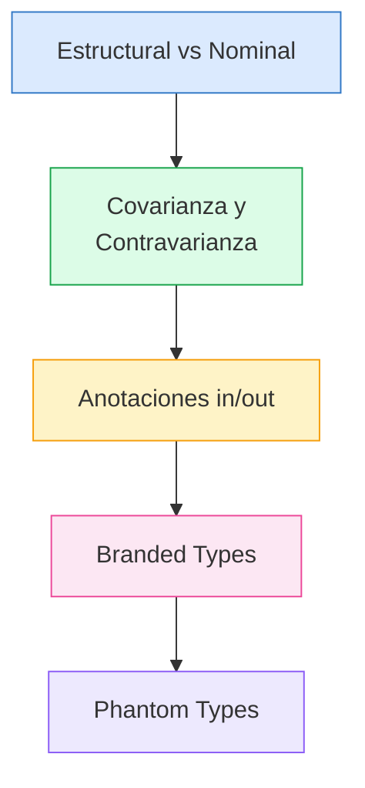
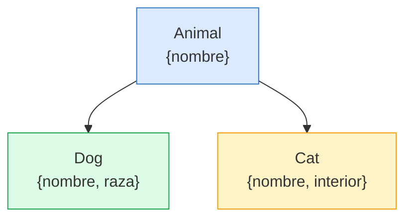
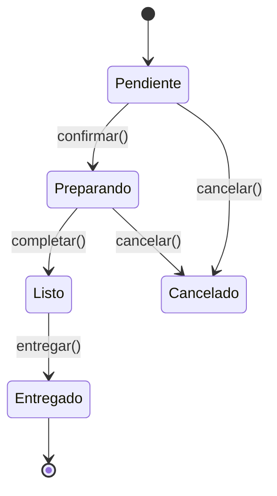

# :shield: Capítulo 17: Varianza, Tipos Nominales y Seguridad Estructural

<div class="chapter-meta">
  <span class="meta-item">🕐 4-5 horas</span>
  <span class="meta-item">📊 Nivel: Experto</span>
  <span class="meta-item">🎯 Semana 9</span>
</div>

<div class="chapter-objective">
  <span class="objective-icon">📌</span>
  <span class="objective-text">Al terminar este capítulo, entenderás varianza (covarianza, contravarianza, invarianza), tipos nominales vs estructurales, y branded types — conceptos de nivel experto para sistemas de tipos robustos.</span>
</div>

<div class="chapter-map" markdown>
<h4>🗺️ Mapa del capítulo</h4>



</div>

!!! quote "Contexto"
    Este capítulo aborda los conceptos más profundos del sistema de tipos de TypeScript: la **varianza** (por qué algunos tipos son sustituibles y otros no), el **tipado nominal** (cómo evitar que IDs de distintas entidades se mezclen) y los **phantom types** (tipos que codifican estado sin existir en runtime). Son conceptos que el 99% de los desarrolladores TypeScript no entienden, pero que todo **autor de librerías** y **senior engineer** necesita dominar.

---

<div class="concept-question">
<h4>🔍 Pregunta conceptual</h4>
<p>TypeScript usa tipado ESTRUCTURAL: dos tipos con las mismas propiedades son compatibles. Pero ¿qué pasa si quieres distinguir <code>UserId</code> de <code>ProductId</code> aunque ambos sean <code>string</code>?</p>
</div>

## 17.1 Tipado estructural vs. nominal: el problema real

TypeScript usa **tipado estructural**: dos tipos son compatibles si tienen la misma estructura, sin importar su nombre.

```typescript
interface MesaId { value: number }
interface PedidoId { value: number }

// 😱 TypeScript los considera IGUALES
const mesa: MesaId = { value: 1 };
const pedido: PedidoId = mesa;  // ✅ Compila — ¡PELIGROSO!

function obtenerMesa(id: MesaId): Mesa { /* ... */ }
obtenerMesa(pedido);  // ✅ Compila — pero es un BUG
```

En Python, esto no pasa porque las clases son **nominales** por defecto:

<div class="comparison" markdown>
<div class="lang-box python" markdown>

#### :snake: Python — Nominal por defecto

```python
from typing import NewType

MesaId = NewType("MesaId", int)
PedidoId = NewType("PedidoId", int)

mesa_id = MesaId(1)
pedido_id = PedidoId(2)

def obtener_mesa(id: MesaId) -> Mesa:
    ...

# mypy error: MesaId ≠ PedidoId
obtener_mesa(pedido_id)  # ❌ Error
```

</div>
<div class="lang-box typescript" markdown>

#### 🔷 TypeScript — Estructural (peligroso sin branded)

```typescript
// Sin branded types, cualquier number vale
type MesaId = number;
type PedidoId = number;

function obtenerMesa(id: MesaId): Mesa { ... }

const pedidoId: PedidoId = 42;
obtenerMesa(pedidoId); // ✅ Compila — BUG silencioso

// Con branded types (solución)
type MesaId = number & { readonly __brand: unique symbol };
```

</div>
</div>

!!! danger "El bug real en MakeMenu"
    Imagina que en el frontend alguien escribe `obtenerMesa(pedido.id)` en vez de `obtenerMesa(mesa.id)`. Sin branded types, TypeScript no dice nada. La app hace una query con el ID equivocado, el usuario ve datos incorrectos. El bug solo se descubre en producción.

---

<div class="concept-question">
<h4>🔍 Pregunta conceptual</h4>
<p>Si <code>Gato</code> extiende <code>Animal</code>, ¿un <code>Array&lt;Gato&gt;</code> es asignable a <code>Array&lt;Animal&gt;</code>? Piensa: ¿qué pasaría si alguien hace <code>push(perro)</code> en ese array?</p>
</div>

## 17.2 Covarianza y contravarianza en la práctica

La **varianza** responde a una pregunta fundamental: si `Dog extends Animal`, ¿dónde puedo usar uno en lugar del otro?

```typescript
interface Animal { nombre: string }
interface Dog extends Animal { raza: string }
interface Cat extends Animal { interior: boolean }
```



### Covarianza (posición de retorno) — `out`

Un tipo es **covariante** cuando sigue la dirección de la herencia: `Producer<Dog>` → `Producer<Animal>` ✅

```typescript
// Covariante: el productor de Dog puede usarse donde se espera productor de Animal
interface Producer<T> {
  produce(): T;  // T en posición de RETORNO → covariante
}

const dogProducer: Producer<Dog> = { produce: () => ({ nombre: "Rex", raza: "Pastor" }) };
const animalProducer: Producer<Animal> = dogProducer;  // ✅ Un productor de Dog ES productor de Animal
```

### Contravarianza (posición de parámetro) — `in`

Un tipo es **contravariante** cuando va en dirección OPUESTA: `Consumer<Animal>` → `Consumer<Dog>` ✅

```typescript
// Contravariante: el consumidor de Animal puede usarse donde se espera consumidor de Dog
interface Consumer<T> {
  consume(item: T): void;  // T en posición de PARÁMETRO → contravariante
}

const animalConsumer: Consumer<Animal> = { consume: (a) => console.log(a.nombre) };
const dogConsumer: Consumer<Dog> = animalConsumer;  // ✅ Si sabe consumir Animal, sabe consumir Dog
```

### Invarianza (ambas posiciones)

Cuando `T` aparece en ambas posiciones, el tipo es **invariante**: ni `Processor<Dog>` ni `Processor<Animal>` son sustituibles.

```typescript
interface Processor<T> {
  process(item: T): T;  // T en AMBAS posiciones → invariante
}

const dogProcessor: Processor<Dog> = {
  process: (d) => ({ ...d, raza: d.raza.toUpperCase() })
};

// ❌ Ni uno ni otro
const animalProcessor: Processor<Animal> = dogProcessor;  // Error
const dogProcessor2: Processor<Dog> = animalProcessor;     // Error
```

!!! warning "Los arrays de TypeScript son covariantes (inseguros)"
    ```typescript
    const dogs: Dog[] = [{ nombre: "Rex", raza: "Pastor" }];
    const animals: Animal[] = dogs;  // ✅ TypeScript lo permite (covariante)

    animals.push({ nombre: "Mishi" });  // ✅ Compila — pero hemos metido un Cat en Dog[]!
    dogs[1].raza;  // 💥 Runtime error: .raza no existe en Cat
    ```
    Esto es un agujero conocido en TypeScript por compatibilidad con JavaScript. Las `ReadonlyArray` son seguras porque solo son covariantes (sin `.push()`).

<div class="micro-exercise">
<h4>🧪 Micro-ejercicio (2 min)</h4>
<p>Crea una función <code>procesarAnimales(animales: Animal[])</code> y otra <code>procesarGatos(gatos: Gato[])</code>. ¿Puedes pasar un <code>Gato[]</code> a <code>procesarAnimales</code>? ¿Y un <code>Animal[]</code> a <code>procesarGatos</code>? ¿Por qué?</p>
</div>

<div class="pro-tip">
<h4>💡 Consejo Pro</h4>
<p>Usa <code>strictFunctionTypes: true</code> (viene con strict) para que TypeScript verifique varianza en parámetros de función. Sin ella, los parámetros son bivariantes — un agujero de seguridad en el sistema de tipos.</p>
</div>

---

## 17.3 Las anotaciones `in`/`out` de TypeScript 4.7+

Desde TypeScript 4.7, puedes **declarar explícitamente** la varianza con `in` y `out`:

```typescript
// out = covariante (solo puede aparecer en posición de retorno)
interface Producer<out T> {
  produce(): T;
  // consume(item: T): void;  // ❌ Error: T es 'out', no puede ser parámetro
}

// in = contravariante (solo puede aparecer en posición de parámetro)
interface Consumer<in T> {
  consume(item: T): void;
  // produce(): T;  // ❌ Error: T es 'in', no puede ser retorno
}

// in out = invariante
interface Processor<in out T> {
  process(item: T): T;  // ✅ Ambas posiciones permitidas
}
```

### Event Bus tipado para MakeMenu

```typescript
// Eventos del sistema
interface MesaEvent { tipo: "mesa"; mesaId: number }
interface PedidoEvent { tipo: "pedido"; pedidoId: number }
type AppEvent = MesaEvent | PedidoEvent;

// Event Bus con varianza correcta
interface EventBus<in out T> {
  publish(event: T): void;     // in: consume eventos
  subscribe(handler: (event: T) => void): void;  // out (en el callback)
}

// Bus general de la app
const appBus: EventBus<AppEvent> = createEventBus();

// ❌ No se puede asignar un bus general a uno específico (ni viceversa)
// porque EventBus es invariante
const mesaBus: EventBus<MesaEvent> = appBus;  // Error — correcto
```

!!! tip "¿Por qué usar `in`/`out`?"
    1. **Documentación**: Deja claro la intención del diseño
    2. **Seguridad**: El compilador impide usar `T` en la posición incorrecta
    3. **Rendimiento**: El compilador puede verificar varianza sin analizar toda la estructura (más rápido en codebases grandes)

<div class="misconception-box">
<h4>⚠️ Errores comunes</h4>
<ul>
<li><span class="wrong">❌ Mito:</span> "La varianza no importa en la práctica" → <span class="right">✅ Realidad:</span> Si usas callbacks o funciones genéricas, la varianza determina qué asignaciones son seguras. Bugs sutiles de varianza causan crashes en producción.</li>
<li><span class="wrong">❌ Mito:</span> "TypeScript tiene tipado nominal" → <span class="right">✅ Realidad:</span> TypeScript es ESTRUCTURAL. Dos interfaces con las mismas propiedades son intercambiables. Para nominal, necesitas branded types.</li>
<li><span class="wrong">❌ Mito:</span> "Los branded types son un hack" → <span class="right">✅ Realidad:</span> Son un patrón reconocido y recomendado. Librerías como Zod y Effect los usan extensivamente para tipos como <code>Email</code>, <code>PositiveNumber</code>, <code>NonEmptyString</code>.</li>
</ul>
</div>

<div class="connection-box">
<span class="connection-icon">🔗</span>
<span>Recuerda del <a href='../13-type-level/'>Capítulo 13</a> el type-level programming. Los branded types combinan intersección (<code>&</code>) con un tipo phantom para crear tipos nominales — es type-level programming aplicado.</span>
</div>

---

<div class="concept-question">
<h4>🔍 Pregunta conceptual</h4>
<p>¿Puedes crear un tipo que sea un <code>string</code> pero que TypeScript trate como diferente a otros <code>string</code>? ¿Un <code>Email</code> que no se pueda mezclar con un <code>Username</code>?</p>
</div>

## 17.4 Branded Types a escala: patrones de producción

El capítulo 7 introdujo branded types básicos. Aquí los llevamos a nivel de producción.

### Patrón 1: `unique symbol` (más seguro)

```typescript
// Cada tipo tiene un símbolo único — imposible de confundir
declare const MesaIdBrand: unique symbol;
declare const PedidoIdBrand: unique symbol;
declare const ReservaIdBrand: unique symbol;

type MesaId = number & { readonly [MesaIdBrand]: typeof MesaIdBrand };
type PedidoId = number & { readonly [PedidoIdBrand]: typeof PedidoIdBrand };
type ReservaId = number & { readonly [ReservaIdBrand]: typeof ReservaIdBrand };

// Constructores validados
function MesaId(value: number): MesaId {
  if (value <= 0 || !Number.isInteger(value)) {
    throw new Error(`MesaId inválido: ${value}`);
  }
  return value as MesaId;
}

// Uso
const mesa = MesaId(1);         // ✅
const pedido = PedidoId(42);    // ✅
obtenerMesa(pedido);            // ❌ Error de tipo — ¡exactamente lo que queremos!
```

### Patrón 2: Genérico `EntityId<Tag>`

```typescript
// Un solo tipo genérico para todos los IDs
type EntityId<Tag extends string> = number & { readonly __entity: Tag };

// Declarar IDs específicos
type MesaId = EntityId<"Mesa">;
type PedidoId = EntityId<"Pedido">;
type ReservaId = EntityId<"Reserva">;

// Factory genérica
function createId<Tag extends string>(tag: Tag, value: number): EntityId<Tag> {
  if (value <= 0 || !Number.isInteger(value)) {
    throw new Error(`${tag}Id inválido: ${value}`);
  }
  return value as EntityId<Tag>;
}

const mesaId = createId("Mesa", 1);       // MesaId
const pedidoId = createId("Pedido", 42);  // PedidoId
```

### Patrón 3: Integración con Zod `.brand()`

```typescript
import { z } from "zod";

const MesaIdSchema = z.number().int().positive().brand<"MesaId">();
const PedidoIdSchema = z.number().int().positive().brand<"PedidoId">();

type MesaId = z.infer<typeof MesaIdSchema>;     // number & { __brand: "MesaId" }
type PedidoId = z.infer<typeof PedidoIdSchema>; // number & { __brand: "PedidoId" }

// Validación + branding en un solo paso
const result = MesaIdSchema.safeParse(req.params.id);
if (result.success) {
  obtenerMesa(result.data);  // ✅ Tipo MesaId garantizado
}
```

<div class="micro-exercise">
<h4>🧪 Micro-ejercicio (2 min)</h4>
<p>Crea branded types <code>UserId</code> y <code>PlatoId</code> (ambos <code>string</code> internamente). Verifica que no puedas pasar un <code>UserId</code> donde se espera un <code>PlatoId</code>.</p>
</div>

<div class="pro-tip">
<h4>💡 Consejo Pro</h4>
<p>En MakeMenu, usamos branded types para IDs: <code>type UserId = string & { readonly __brand: 'UserId' }</code>. Esto previene bugs como <code>getPedido(userId)</code> donde deberías haber pasado <code>pedidoId</code>.</p>
</div>

---

## 17.5 Phantom Types para máquinas de estado

Los **phantom types** son parámetros genéricos que **no se usan en el valor** — solo existen a nivel de tipos para codificar estado.

### Máquina de estados de un Pedido en MakeMenu



```typescript
// Estados como tipos (no existen en runtime)
type Pendiente = "pendiente";
type Preparando = "preparando";
type Listo = "listo";
type Entregado = "entregado";
type Cancelado = "cancelado";

// El phantom type `Estado` NO aparece en los datos — solo en el tipo
interface Pedido<Estado extends string> {
  id: PedidoId;
  items: ItemPedido[];
  mesa: MesaId;
  // Estado NO está aquí — es phantom
}

// Funciones de transición: solo aceptan el estado correcto
function crearPedido(mesa: MesaId, items: ItemPedido[]): Pedido<Pendiente> {
  return { id: PedidoId(Date.now()), items, mesa };
}

function confirmar(pedido: Pedido<Pendiente>): Pedido<Preparando> {
  return pedido as unknown as Pedido<Preparando>;
}

function completar(pedido: Pedido<Preparando>): Pedido<Listo> {
  return pedido as unknown as Pedido<Listo>;
}

function entregar(pedido: Pedido<Listo>): Pedido<Entregado> {
  return pedido as unknown as Pedido<Entregado>;
}

function cancelar(pedido: Pedido<Pendiente> | Pedido<Preparando>): Pedido<Cancelado> {
  return pedido as unknown as Pedido<Cancelado>;
}
```

### Uso — las transiciones inválidas NO compilan

```typescript
const pedido = crearPedido(MesaId(1), [/*...*/]);  // Pedido<"pendiente">

// ✅ Transiciones válidas
const enCocina = confirmar(pedido);          // Pedido<"preparando">
const listo = completar(enCocina);           // Pedido<"listo">
const entregado = entregar(listo);           // Pedido<"entregado">

// ❌ Transiciones INVÁLIDAS — error de compilación
entregar(pedido);      // Error: Pedido<"pendiente"> ≠ Pedido<"listo">
completar(pedido);     // Error: Pedido<"pendiente"> ≠ Pedido<"preparando">
confirmar(entregado);  // Error: Pedido<"entregado"> ≠ Pedido<"pendiente">
cancelar(listo);       // Error: Pedido<"listo"> no es Pendiente ni Preparando
```

### Patrón avanzado: transiciones como mapa de tipos

```typescript
// Definir transiciones válidas como un type map
type TransicionesValidas = {
  pendiente: "preparando" | "cancelado";
  preparando: "listo" | "cancelado";
  listo: "entregado";
  entregado: never;  // Estado final
  cancelado: never;  // Estado final
};

// Función de transición genérica
function transicionar<
  Desde extends keyof TransicionesValidas,
  Hacia extends TransicionesValidas[Desde]
>(
  pedido: Pedido<Desde>,
  nuevoEstado: Hacia
): Pedido<Hacia & string> {
  console.log(`Transición: ${pedido.id} → ${nuevoEstado}`);
  return pedido as unknown as Pedido<Hacia & string>;
}

// Uso
const p1 = crearPedido(MesaId(1), []);
const p2 = transicionar(p1, "preparando");  // ✅ pendiente → preparando
const p3 = transicionar(p2, "listo");        // ✅ preparando → listo

transicionar(p1, "entregado");  // ❌ "entregado" no es TransicionesValidas["pendiente"]
transicionar(p3, "cancelado");  // ❌ "cancelado" no es TransicionesValidas["listo"]
```

---

<div class="code-evolution">
<h4>📈 Evolución de código: IDs type-safe en MakeMenu</h4>

<div class="evolution-step" markdown>
<span class="step-label">v1 Novato — todos los IDs como <code>string</code> plano</span>

```typescript
// ❌ Todos los IDs son string — fácil confundirlos
function getPedido(pedidoId: string): Pedido { /* ... */ }
function getUsuario(userId: string): Usuario { /* ... */ }
function getMesa(mesaId: string): Mesa { /* ... */ }

// 😱 Bug silencioso: pasamos userId donde va pedidoId
const userId = "user-123";
const pedido = getPedido(userId);  // ✅ Compila — pero es un BUG
```

</div>

<div class="evolution-step" markdown>
<span class="step-label">v2 Con alias — <code>type UserId = string</code> (aún intercambiables)</span>

```typescript
// ⚠️ Alias no protegen — son solo documentación
type UserId = string;
type PedidoId = string;
type MesaId = string;

function getPedido(pedidoId: PedidoId): Pedido { /* ... */ }

const userId: UserId = "user-123";
getPedido(userId);  // ✅ Compila — sigue siendo un BUG
// TypeScript trata UserId y PedidoId como el mismo tipo (string)
```

</div>

<div class="evolution-step" markdown>
<span class="step-label">v3 Profesional — branded types con factory y validación</span>

```typescript
// ✅✅ Branded types: cada ID es incompatible con los demás
type UserId = string & { readonly __brand: "UserId" };
type PedidoId = string & { readonly __brand: "PedidoId" };
type MesaId = string & { readonly __brand: "MesaId" };

// Factory functions con validación runtime
function UserId(value: string): UserId {
  if (!value.startsWith("user-")) throw new Error(`UserId inválido: ${value}`);
  return value as UserId;
}

function PedidoId(value: string): PedidoId {
  if (!value.startsWith("ped-")) throw new Error(`PedidoId inválido: ${value}`);
  return value as PedidoId;
}

function getPedido(pedidoId: PedidoId): Pedido { /* ... */ }

const userId = UserId("user-123");
// getPedido(userId);  // ❌ Error: UserId no es PedidoId

const pedidoId = PedidoId("ped-456");
getPedido(pedidoId);  // ✅ Tipo correcto Y validado en runtime
```

</div>
</div>

---

## :pencil: Ejercicios

### Ejercicio 17.1 — Branded IDs para MakeMenu

<span class="bloom-badge apply">Aplicar</span>

Crea un sistema de branded IDs para todas las entidades de MakeMenu:

```typescript
// Implementa:
// 1. EntityId<Tag> genérico con unique symbol
// 2. MesaId, PedidoId, ReservaId, UsuarioId
// 3. Funciones factory con validación
// 4. Integración con Zod schemas

type EntityId<Tag extends string> = /* tu implementación */;

// Tests que deben compilar:
const mesa = createId<"Mesa">(1);
const pedido = createId<"Pedido">(42);
obtenerMesa(mesa);     // ✅
obtenerMesa(pedido);   // ❌ Error de tipo
```

??? success "Solución"
    ```typescript
    // Branded ID genérico
    declare const EntityBrand: unique symbol;
    type EntityId<Tag extends string> = number & {
      readonly [EntityBrand]: Tag;
    };

    // IDs específicos
    type MesaId = EntityId<"Mesa">;
    type PedidoId = EntityId<"Pedido">;
    type ReservaId = EntityId<"Reserva">;
    type UsuarioId = EntityId<"Usuario">;

    // Factory genérica con validación
    function createId<Tag extends string>(value: number): EntityId<Tag> {
      if (!Number.isInteger(value) || value <= 0) {
        throw new Error(`ID inválido: ${value}`);
      }
      return value as EntityId<Tag>;
    }

    // Funciones tipadas
    function obtenerMesa(id: MesaId): void { /* ... */ }

    // Uso
    const mesa = createId<"Mesa">(1);
    const pedido = createId<"Pedido">(42);
    obtenerMesa(mesa);     // ✅
    // obtenerMesa(pedido); // ❌ EntityId<"Pedido"> ≠ EntityId<"Mesa">
    ```

### Ejercicio 17.2 — Máquina de estados tipada

<span class="bloom-badge create">Crear</span>

Implementa una máquina de estados para el ciclo de vida de una `Reserva` en MakeMenu:

- Estados: `solicitada` → `confirmada` → `completada`
- Desde `solicitada` o `confirmada` se puede `cancelar`
- `completada` y `cancelada` son estados finales

??? success "Solución"
    ```typescript
    type TransicionesReserva = {
      solicitada: "confirmada" | "cancelada";
      confirmada: "completada" | "cancelada";
      completada: never;
      cancelada: never;
    };

    interface Reserva<E extends keyof TransicionesReserva> {
      id: ReservaId;
      mesa: MesaId;
      fecha: Date;
      personas: number;
    }

    function crearReserva(mesa: MesaId, fecha: Date, personas: number): Reserva<"solicitada"> {
      return { id: createId<"Reserva">(Date.now()), mesa, fecha, personas };
    }

    function transicionarReserva<
      D extends keyof TransicionesReserva,
      H extends TransicionesReserva[D]
    >(reserva: Reserva<D>, estado: H): Reserva<H & string> {
      return reserva as unknown as Reserva<H & string>;
    }

    // Uso
    const r = crearReserva(createId<"Mesa">(5), new Date(), 4);
    const confirmada = transicionarReserva(r, "confirmada");    // ✅
    const completada = transicionarReserva(confirmada, "completada"); // ✅
    // transicionarReserva(r, "completada");  // ❌ solicitada → completada no válida
    ```

---

## :zap: Flashcards

<div class="flashcard">
<div class="front">¿Qué es la covarianza y dónde aparece en TypeScript?</div>
<div class="back">Un tipo es <strong>covariante</strong> cuando sigue la dirección de la herencia: si <code>Dog extends Animal</code>, entonces <code>Producer&lt;Dog&gt;</code> es asignable a <code>Producer&lt;Animal&gt;</code>. Aparece en <strong>posiciones de retorno</strong>. Se marca con <code>out T</code>.</div>
</div>

<div class="flashcard">
<div class="front">¿Qué es la contravarianza y dónde aparece?</div>
<div class="back">Un tipo es <strong>contravariante</strong> cuando va en dirección opuesta: si <code>Dog extends Animal</code>, entonces <code>Consumer&lt;Animal&gt;</code> es asignable a <code>Consumer&lt;Dog&gt;</code>. Aparece en <strong>posiciones de parámetro</strong>. Se marca con <code>in T</code>.</div>
</div>

<div class="flashcard">
<div class="front">¿Por qué los arrays de TypeScript son inseguros respecto a la varianza?</div>
<div class="back">Los arrays son <strong>covariantes</strong> pero <strong>mutables</strong>. Puedes asignar <code>Dog[]</code> a <code>Animal[]</code>, pero luego <code>.push()</code> permite meter un <code>Cat</code> en el array de <code>Dog</code>. <code>ReadonlyArray</code> es seguro porque solo es covariante (sin mutación).</div>
</div>

<div class="flashcard">
<div class="front">¿Qué hacen las anotaciones <code>in</code>/<code>out</code> de TypeScript 4.7+?</div>
<div class="back"><code>out T</code> = covariante (solo retorno). <code>in T</code> = contravariante (solo parámetro). <code>in out T</code> = invariante (ambos). El compilador verifica que <code>T</code> solo se use en la posición correcta. Mejora seguridad y rendimiento del checker.</div>
</div>

<div class="flashcard">
<div class="front">¿Cuál es la diferencia entre branded types con <code>__brand: string</code> y con <code>unique symbol</code>?</div>
<div class="back">Con <code>__brand: "MesaId"</code> es posible (aunque improbable) crear colisiones. Con <code>unique symbol</code> es <strong>imposible</strong> confundir tipos porque cada símbolo es globalmente único. El patrón <code>unique symbol</code> es más seguro para producción.</div>
</div>

<div class="flashcard">
<div class="front">¿Qué son los phantom types?</div>
<div class="back">Parámetros genéricos que <strong>no se usan en el valor</strong> — solo existen a nivel de tipos. Sirven para codificar estado en el tipo: <code>Pedido&lt;"pendiente"&gt;</code> vs <code>Pedido&lt;"entregado"&gt;</code>. Las funciones de transición solo aceptan el estado correcto, impidiendo transiciones inválidas en compilación.</div>
</div>

---

## :video_game: Quiz interactivo

<div class="quiz" data-quiz-id="ch17-q1">
<h4>Pregunta 1: Si <code>Dog extends Animal</code>, ¿cuál es correcto?</h4>
<button class="quiz-option" data-correct="false"><code>Consumer&lt;Dog&gt;</code> es asignable a <code>Consumer&lt;Animal&gt;</code></button>
<button class="quiz-option" data-correct="true"><code>Consumer&lt;Animal&gt;</code> es asignable a <code>Consumer&lt;Dog&gt;</code> (contravarianza)</button>
<button class="quiz-option" data-correct="false">Los consumidores son covariantes</button>
<button class="quiz-option" data-correct="false">Ninguno es asignable al otro</button>
<div class="quiz-feedback" data-correct="¡Correcto! Los consumidores son contravariantes: si sabe consumir Animal, sabe consumir Dog (que es un Animal). La dirección es OPUESTA a la herencia." data-incorrect="Incorrecto. Los consumidores (parámetros) son contravariantes: `Consumer<Animal>` → `Consumer<Dog>`. Si consume cualquier Animal, puede consumir un Dog."></div>
</div>

<div class="quiz" data-quiz-id="ch17-q2">
<h4>Pregunta 2: ¿Cuál es la ventaja principal de los phantom types para máquinas de estado?</h4>
<button class="quiz-option" data-correct="false">Son más rápidos en runtime</button>
<button class="quiz-option" data-correct="false">Generan código JavaScript más pequeño</button>
<button class="quiz-option" data-correct="true">Las transiciones inválidas causan errores de compilación — se detectan antes de ejecutar</button>
<button class="quiz-option" data-correct="false">Reemplazan los enums</button>
<div class="quiz-feedback" data-correct="¡Correcto! Los phantom types codifican el estado en el sistema de tipos. Una función `confirmar(p: Pedido<'pendiente'>)` solo acepta pedidos pendientes — si intentas confirmar uno ya entregado, TypeScript te lo impide en compilación." data-incorrect="Incorrecto. La ventaja principal es que las transiciones inválidas se detectan en compilación, no en runtime. El estado se codifica en el tipo, no en el valor."></div>
</div>

<div class="quiz" data-quiz-id="ch17-q3">
<h4>Pregunta 3: ¿Por qué <code>Array&lt;Dog&gt;</code> asignable a <code>Array&lt;Animal&gt;</code> es inseguro?</h4>
<button class="quiz-option" data-correct="false">Porque los arrays son inmutables</button>
<button class="quiz-option" data-correct="true">Porque al ser mutable, puedes hacer <code>.push(cat)</code> al array tipado como <code>Animal[]</code>, insertando un <code>Cat</code> en lo que realmente es un <code>Dog[]</code></button>
<button class="quiz-option" data-correct="false">Porque TypeScript no soporta herencia</button>
<button class="quiz-option" data-correct="false">No es inseguro — es el comportamiento correcto</button>
<div class="quiz-feedback" data-correct="¡Correcto! La covarianza es segura para tipos readonly. Pero los arrays mutables permiten `.push()`, que puede insertar un tipo incompatible. `ReadonlyArray<Dog>` sí es seguramente asignable a `ReadonlyArray<Animal>`." data-incorrect="Incorrecto. El problema es la mutabilidad: `animals.push({nombre: 'Mishi'})` mete un Cat en lo que es realmente un Dog[]. Esto causa runtime errors al acceder a `.raza`."></div>
</div>

---

## :bug: Ejercicio de depuración

Encuentra los **3 errores** en este código:

```typescript
// ❌ Este código tiene 3 errores. ¡Encuéntralos!

// 1. Event handler con varianza incorrecta
interface EventHandler<T> {
  handle(event: T): void;
}

interface AppEvent { timestamp: number }
interface MesaEvent extends AppEvent { mesaId: number }

// ¿Es seguro este cast?
const appHandler: EventHandler<AppEvent> = {
  handle: (e) => console.log(e.timestamp)
};
const mesaHandler: EventHandler<MesaEvent> = appHandler;  // 🤔

// 2. Branded type bypass
type UserId = number & { __brand: "UserId" };
const rawId: number = 42;
const userId: UserId = rawId;  // 🤔

// 3. Estado phantom incorrecto
interface Pedido<E extends string> { id: number }

function entregar(p: Pedido<"listo">): Pedido<"entregado"> {
  return p;  // 🤔 ¿Compila directamente?
}
```

??? success "Solución"
    ```typescript
    // ✅ Código corregido

    // 1. EventHandler es contravariante en T (T en posición de parámetro)
    // AppHandler → MesaHandler es CORRECTO (contravarianza)
    // ✅ Fix 1: Esto es realmente correcto — si quisiéramos lo contrario sería el error.
    // El error real: si MesaHandler se usara como AppHandler, sería incorrecto
    // porque un handler de MesaEvent espera mesaId que AppEvent no tiene.
    const mesaSpecificHandler: EventHandler<MesaEvent> = {
      handle: (e) => console.log(e.mesaId)  // Necesita mesaId
    };
    // const appH: EventHandler<AppEvent> = mesaSpecificHandler;
    // ✅ Fix 1: ^^^ ESTO sería el error — asignar handler específico a genérico

    // 2. Branded type: un number plano NO es UserId
    type UserId = number & { __brand: "UserId" };
    const rawId: number = 42;
    const userId = rawId as UserId;  // ✅ Fix 2: necesita assertion explícita (o función factory)

    // 3. Pedido<"listo"> no es asignable a Pedido<"entregado">
    interface Pedido<E extends string> { id: number }
    function entregar(p: Pedido<"listo">): Pedido<"entregado"> {
      return p as unknown as Pedido<"entregado">;  // ✅ Fix 3: doble assertion necesaria
    }
    ```

---

<div class="connection-box">
<span class="connection-icon">🔗</span>
<span>En el <a href='../18-patrones-librerias/'>Capítulo 18</a> verás cómo los autores de librerías usan varianza y branded types para crear APIs type-safe e imposibles de usar incorrectamente.</span>
</div>

---

<div class="ejercicio-guiado">
<h4>🏋️ Ejercicio guiado</h4>

Construye un sistema de pedidos para MakeMenu donde los branded types impiden mezclar IDs de distintas entidades y los phantom types modelan el ciclo de vida de un pedido:

1. Define branded types `PlatoId`, `PedidoId` y `ClienteId` usando una propiedad `__brand` única para cada uno — asegúrate de que asignar un `PlatoId` donde se espera un `PedidoId` sea un error de compilación
2. Crea funciones constructoras `crearPlatoId(n: number): PlatoId`, `crearPedidoId(n: number): PedidoId` y `crearClienteId(n: number): ClienteId` que realicen el cast
3. Define phantom types para el estado de un pedido: `type EstadoPedido = "borrador" | "confirmado" | "enCocina" | "entregado"` y un tipo `Pedido<E extends EstadoPedido>` con campos `id`, `clienteId`, `platos` y `total`
4. Implementa funciones de transición con firmas estrictas: `confirmar(p: Pedido<"borrador">): Pedido<"confirmado">`, `enviarACocina(p: Pedido<"confirmado">): Pedido<"enCocina">` y `entregar(p: Pedido<"enCocina">): Pedido<"entregado">`
5. Escribe una función `buscarPlato(id: PlatoId): string` y demuestra que llamarla con un `PedidoId` da error de tipos
6. Crea un pedido desde cero y pásalo por todo el flujo `borrador → confirmado → enCocina → entregado` — intenta saltarte un paso (p.ej. `entregar` un pedido en `"borrador"`) y verifica que TypeScript lo rechaza

??? success "Solución completa"
    ```typescript
    // --- Branded types para IDs ---
    type PlatoId = number & { __brand: "PlatoId" };
    type PedidoId = number & { __brand: "PedidoId" };
    type ClienteId = number & { __brand: "ClienteId" };

    function crearPlatoId(n: number): PlatoId {
      return n as PlatoId;
    }
    function crearPedidoId(n: number): PedidoId {
      return n as PedidoId;
    }
    function crearClienteId(n: number): ClienteId {
      return n as ClienteId;
    }

    // --- Phantom types para estados ---
    type EstadoPedido = "borrador" | "confirmado" | "enCocina" | "entregado";

    interface Pedido<E extends EstadoPedido> {
      readonly id: PedidoId;
      readonly clienteId: ClienteId;
      readonly platos: PlatoId[];
      readonly total: number;
      readonly _estado: E;   // phantom — solo existe en el tipo
    }

    function crearPedido(
      clienteId: ClienteId,
      platos: PlatoId[],
      total: number
    ): Pedido<"borrador"> {
      return {
        id: crearPedidoId(Date.now()),
        clienteId,
        platos,
        total,
        _estado: "borrador" as const,
      };
    }

    // --- Transiciones estrictas ---
    function confirmar(p: Pedido<"borrador">): Pedido<"confirmado"> {
      console.log(`Pedido ${p.id} confirmado`);
      return { ...p, _estado: "confirmado" as const };
    }

    function enviarACocina(p: Pedido<"confirmado">): Pedido<"enCocina"> {
      console.log(`Pedido ${p.id} enviado a cocina`);
      return { ...p, _estado: "enCocina" as const };
    }

    function entregar(p: Pedido<"enCocina">): Pedido<"entregado"> {
      console.log(`Pedido ${p.id} entregado`);
      return { ...p, _estado: "entregado" as const };
    }

    // --- Función que exige PlatoId ---
    function buscarPlato(id: PlatoId): string {
      const catalogo: Record<number, string> = {
        1: "Paella Valenciana",
        2: "Tortilla Española",
      };
      return catalogo[id] ?? "Plato no encontrado";
    }

    // --- Uso correcto ---
    const cliente = crearClienteId(42);
    const plato1 = crearPlatoId(1);
    const plato2 = crearPlatoId(2);

    const borrador = crearPedido(cliente, [plato1, plato2], 24.5);
    const confirmado = confirmar(borrador);
    const enCocina = enviarACocina(confirmado);
    const entregado = entregar(enCocina);

    console.log(buscarPlato(plato1));  // ✅ "Paella Valenciana"

    // --- Errores que TypeScript detecta ---
    // buscarPlato(crearPedidoId(1));    // ❌ PedidoId no es PlatoId
    // entregar(borrador);               // ❌ No puedes entregar un "borrador"
    // enviarACocina(borrador);           // ❌ No puedes enviar a cocina un "borrador"
    ```

</div>

---

<div class="real-errors" markdown>
<h4>🚨 Errores reales que verás en producción</h4>

**Error 1: Asignación incompatible por varianza en callbacks**

```
Type '(animal: Animal) => void' is not assignable to type '(dog: Dog) => void'.
  Types of parameters 'animal' and 'dog' are incompatible.
    Property 'raza' is missing in type 'Animal' but required in type 'Dog'.
```

🤔 **Por qué ocurre:** Estás intentando asignar un callback que recibe `Animal` a una posición que espera un callback que recibe `Dog`. Aunque `Animal` es padre de `Dog`, los parámetros de funciones son **contravariantes** con `strictFunctionTypes` activado. El callback necesita acceder a `.raza`, que `Animal` no tiene.

✅ **Solución:** Asegura que el callback reciba el tipo correcto, o usa un tipo más amplio en la firma:

```typescript
// Antes (error):
const handler: (dog: Dog) => void = (animal: Animal) => console.log(animal.nombre);

// Después (correcto):
const handler: (animal: Animal) => void = (animal) => console.log(animal.nombre);
// O bien, haz que el handler acepte Dog explícitamente:
const handler: (dog: Dog) => void = (dog) => console.log(dog.raza);
```

---

**Error 2: Branded type no asignable desde un tipo primitivo**

```
Type 'number' is not assignable to type 'number & { readonly __brand: "MesaId" }'.
  Type 'number' is not assignable to type '{ readonly __brand: "MesaId" }'.
```

🤔 **Por qué ocurre:** Intentas asignar un `number` plano a un branded type `MesaId`. TypeScript exige que el valor pase por una función factory o una aserción de tipo (`as MesaId`), porque el branded type tiene una propiedad phantom que `number` no satisface.

✅ **Solución:** Usa siempre la función factory para crear valores branded:

```typescript
// Antes (error):
const mesaId: MesaId = 42;

// Después (correcto):
const mesaId: MesaId = MesaId(42);  // Pasa por la factory con validación
// O como aserción si ya validaste:
const mesaId = 42 as MesaId;
```

---

**Error 3: Phantom type incompatible en transición de estado**

```
Argument of type 'Pedido<"pendiente">' is not assignable to parameter of type 'Pedido<"listo">'.
  Type '"pendiente"' is not assignable to type '"listo"'.
```

🤔 **Por qué ocurre:** Estás intentando usar una función de transición con un pedido en un estado incorrecto. Por ejemplo, llamar a `entregar()` (que espera `Pedido<"listo">`) con un pedido que aún está en estado `"pendiente"`. Los phantom types impiden exactamente este error.

✅ **Solución:** Respeta la secuencia de estados. El pedido debe pasar por todas las transiciones intermedias:

```typescript
// Antes (error):
const pedido = crearPedido(mesa, items);   // Pedido<"pendiente">
entregar(pedido);                           // Error: necesita Pedido<"listo">

// Después (correcto):
const pedido = crearPedido(mesa, items);          // Pedido<"pendiente">
const enCocina = confirmar(pedido);               // Pedido<"preparando">
const listo = completar(enCocina);                // Pedido<"listo">
entregar(listo);                                  // Pedido<"entregado"> ✅
```

---

**Error 4: Varianza incorrecta con anotaciones `in`/`out`**

```
Type 'T' is not assignable to type 'T' (as a return type).
  Type parameter 'T' is declared as 'in' (contravariant), but must be 'out' (covariant) for this usage.
```

🤔 **Por qué ocurre:** Declaraste un parámetro genérico como `in T` (contravariante), pero lo estás usando en posición de retorno, que requiere covarianza (`out`). TypeScript 4.7+ verifica que `T` solo aparezca en las posiciones compatibles con su anotación de varianza.

✅ **Solución:** Ajusta la anotación de varianza o la posición del tipo:

```typescript
// Antes (error):
interface MiTipo<in T> {
  obtener(): T;   // Error: T es 'in' pero se usa como retorno
}

// Después (opción 1): cambiar la anotación a 'out'
interface MiTipo<out T> {
  obtener(): T;   // ✅ T en posición de retorno = covariante
}

// Después (opción 2): si necesitas ambas posiciones, usar 'in out'
interface MiTipo<in out T> {
  obtener(): T;
  establecer(valor: T): void;
}
```

</div>

<div class="checkpoint">
<h4>🏁 Checkpoint</h4>
<p>Si puedes: (1) explicar covarianza vs contravarianza, (2) crear branded types para IDs, y (3) saber cuándo la estructura sola no es suficiente — estás en nivel experto.</p>
</div>

<div class="mini-project" markdown>
<h4>🚀 Mini-proyecto: Sistema de permisos type-safe para MakeMenu</h4>

<p>Construye un sistema de permisos donde los roles (<code>Mesero</code>, <code>Cocinero</code>, <code>Admin</code>) tengan acciones permitidas codificadas en el sistema de tipos. Usarás branded types para los IDs de usuario, phantom types para los niveles de acceso, y varianza correcta en los handlers de acciones.</p>

**Paso 1: Branded types para usuarios y roles**

Crea branded types `UsuarioId` y `RolId` que no sean intercambiables. Implementa una factory genérica `crearId<Tag>()` con validación. Define los tipos de rol como uniones literales.

??? success "Solución Paso 1"
    ```typescript
    // Branded ID genérico
    declare const IdBrand: unique symbol;
    type BrandedId<Tag extends string> = string & { readonly [IdBrand]: Tag };

    // IDs específicos
    type UsuarioId = BrandedId<"Usuario">;
    type RolId = BrandedId<"Rol">;

    // Factory con validación
    function crearId<Tag extends string>(prefijo: string, valor: string): BrandedId<Tag> {
      if (!valor.startsWith(prefijo)) {
        throw new Error(`ID inválido para ${prefijo}: ${valor}`);
      }
      return valor as BrandedId<Tag>;
    }

    // Constructores específicos
    const UsuarioId = (v: string) => crearId<"Usuario">("usr-", v);
    const RolId = (v: string) => crearId<"Rol">("rol-", v);

    // Roles del sistema
    type Rol = "mesero" | "cocinero" | "admin";

    // Verificación
    const uid = UsuarioId("usr-001");   // ✅ BrandedId<"Usuario">
    const rid = RolId("rol-admin");     // ✅ BrandedId<"Rol">
    // const error: RolId = uid;         // ❌ Error: tipos incompatibles
    ```

**Paso 2: Phantom types para niveles de acceso**

Define una interfaz `Permiso<Nivel>` con phantom types donde `Nivel` sea `"lectura"`, `"escritura"` o `"admin"`. Crea funciones de transición que solo permitan escalar permisos en el orden correcto: lectura -> escritura -> admin. Un `Permiso<"lectura">` no puede ejecutar acciones de escritura.

??? success "Solución Paso 2"
    ```typescript
    // Niveles de acceso como phantom types
    type NivelAcceso = "lectura" | "escritura" | "admin";

    interface Permiso<Nivel extends NivelAcceso> {
      usuario: UsuarioId;
      rol: Rol;
      // Nivel NO aparece en los datos — es phantom
    }

    // Mapa de transiciones válidas
    type EscaladaValida = {
      lectura: "escritura";
      escritura: "admin";
      admin: never;  // No se puede escalar más
    };

    // Crear permiso base (siempre empieza en lectura)
    function crearPermiso(usuario: UsuarioId, rol: Rol): Permiso<"lectura"> {
      return { usuario, rol };
    }

    // Escalar nivel
    function escalar<
      Desde extends NivelAcceso,
      Hacia extends EscaladaValida[Desde]
    >(permiso: Permiso<Desde>, _nivel: Hacia): Permiso<Hacia & NivelAcceso> {
      return permiso as unknown as Permiso<Hacia & NivelAcceso>;
    }

    // Uso correcto
    const base = crearPermiso(UsuarioId("usr-001"), "admin");     // Permiso<"lectura">
    const conEscritura = escalar(base, "escritura");               // Permiso<"escritura">
    const conAdmin = escalar(conEscritura, "admin");               // Permiso<"admin">

    // ❌ Transiciones inválidas
    // escalar(base, "admin");           // Error: "admin" no es EscaladaValida["lectura"]
    // escalar(conAdmin, "escritura");   // Error: never no acepta nada
    ```

**Paso 3: Handlers de acciones con varianza correcta**

Crea una interfaz `AccionHandler<in T>` contravariante que consume acciones. Define acciones jerárquicas (`AccionBase` -> `AccionMesa` -> `AccionPedido`) y verifica que un handler de `AccionBase` pueda usarse donde se espera un handler de `AccionMesa` (contravarianza), pero no al revés. Conecta los permisos: las funciones de ejecución deben exigir el nivel de acceso correcto.

??? success "Solución Paso 3"
    ```typescript
    // Jerarquía de acciones
    interface AccionBase {
      tipo: string;
      timestamp: number;
    }

    interface AccionMesa extends AccionBase {
      tipo: "mesa";
      mesaId: BrandedId<"Mesa">;
    }

    interface AccionPedido extends AccionBase {
      tipo: "pedido";
      pedidoId: BrandedId<"Pedido">;
      mesaId: BrandedId<"Mesa">;
    }

    // Handler contravariante
    interface AccionHandler<in T extends AccionBase> {
      ejecutar(acción: T): void;
    }

    // Handler genérico para cualquier acción
    const handlerGeneral: AccionHandler<AccionBase> = {
      ejecutar: (a) => console.log(`Acción: ${a.tipo} a las ${a.timestamp}`)
    };

    // ✅ Contravarianza: handler de AccionBase sirve para AccionMesa
    const handlerMesa: AccionHandler<AccionMesa> = handlerGeneral;

    // ❌ Al revés no funciona
    const handlerEspecifico: AccionHandler<AccionMesa> = {
      ejecutar: (a) => console.log(`Mesa: ${a.mesaId}`)
    };
    // const noCompila: AccionHandler<AccionBase> = handlerEspecifico; // Error

    // Funciones de ejecución que exigen nivel de acceso
    function ejecutarLectura<T extends AccionBase>(
      permiso: Permiso<"lectura"> | Permiso<"escritura"> | Permiso<"admin">,
      handler: AccionHandler<T>,
      acción: T
    ): void {
      handler.ejecutar(acción);
    }

    function ejecutarEscritura<T extends AccionBase>(
      permiso: Permiso<"escritura"> | Permiso<"admin">,
      handler: AccionHandler<T>,
      acción: T
    ): void {
      handler.ejecutar(acción);
    }

    function ejecutarAdmin<T extends AccionBase>(
      permiso: Permiso<"admin">,
      handler: AccionHandler<T>,
      acción: T
    ): void {
      handler.ejecutar(acción);
    }

    // Uso
    const permisoBase = crearPermiso(UsuarioId("usr-001"), "mesero");
    const permisoEscritura = escalar(permisoBase, "escritura");

    ejecutarLectura(permisoBase, handlerMesa, {
      tipo: "mesa", mesaId: crearId<"Mesa">("mesa-", "mesa-5"), timestamp: Date.now()
    }); // ✅

    ejecutarEscritura(permisoEscritura, handlerMesa, {
      tipo: "mesa", mesaId: crearId<"Mesa">("mesa-", "mesa-5"), timestamp: Date.now()
    }); // ✅

    // ejecutarAdmin(permisoEscritura, handlerMesa, ...);  // ❌ Necesita Permiso<"admin">
    ```

</div>

## ✅ Autoevaluación del capítulo

<div class="self-check" markdown>
<h4>📋 Verifica tu comprensión</h4>
<label><input type="checkbox"> Puedo explicar la diferencia entre tipado estructural y nominal</label>
<label><input type="checkbox"> Entiendo covarianza, contravarianza e invarianza con ejemplos prácticos</label>
<label><input type="checkbox"> Sé usar las anotaciones <code>in</code>/<code>out</code> de TypeScript 4.7+</label>
<label><input type="checkbox"> Puedo implementar branded types con <code>unique symbol</code> y con <code>Zod.brand()</code></label>
<label><input type="checkbox"> Sé crear máquinas de estado con phantom types que impidan transiciones inválidas</label>
<label><input type="checkbox"> He completado todos los ejercicios del capítulo</label>
</div>
