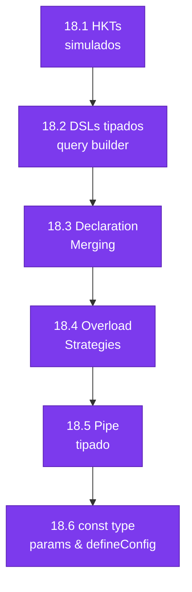

# :gear: Capítulo 18: Patrones de Diseño para Autores de Librerías

<div class="chapter-meta">
  <span class="meta-item">🕐 5-6 horas</span>
  <span class="meta-item">📊 Nivel: Experto</span>
  <span class="meta-item">🎯 Semana 9</span>
</div>

<div class="chapter-objective">
  <span class="objective-icon">📌</span>
  <span class="objective-text">Al terminar este capítulo, conocerás los patrones que usan los autores de librerías: builder pattern tipado, fluent APIs, overloads avanzados, y declaration files — cómo crear DX de primer nivel.</span>
</div>

<div class="chapter-map">



</div>

!!! quote "Contexto"
    Este capítulo cubre los patrones que usan los **autores de librerías** como Zod, tRPC, Prisma y Vue para crear APIs con una experiencia de desarrollo excepcional. La diferencia entre **usar** estas herramientas y **construirlas** es lo que separa a un desarrollador TypeScript de un experto.

<div class="connection-box">
<strong>🔗 Conexión ←</strong> Los mapped types del <a href='../11-tipos-avanzados/'>Capítulo 11</a> y el type-level programming del <a href='../13-type-level/'>Capítulo 13</a> son los building blocks de estos patrones de librerías. Si dominas esas herramientas, este capítulo es su aplicación práctica.
</div>

---

## 18.1 Simulación de Higher-Kinded Types (HKT)

Los **Higher-Kinded Types** son "tipos que aceptan tipos como parámetros" — como una función genérica, pero a un nivel más alto. TypeScript no los soporta nativamente, pero podemos simularlos.

### El problema: abstraer sobre contenedores

```typescript
// Queremos una función `map` que funcione para Array, Promise, Option...
// Pero TypeScript no permite esto:
// type Functor<F<_>> = { map: <A, B>(fa: F<A>, f: (a: A) => B) => F<B> }
//                  ^^^^ Sintaxis inválida — TypeScript no tiene HKTs
```

### La solución: el patrón "TypeLambda"

```typescript
// 1. Definimos un "registro" de tipos — cada contenedor se registra aquí
interface TypeRegistry {
  // Se extiende via declaration merging
}

// 2. Una "lambda de tipo" que aplica el registro
type Apply<F extends keyof TypeRegistry, A> = (TypeRegistry & {
  readonly type: A;
})[F];

// 3. Registrar Array
interface TypeRegistry {
  Array: Array<this["type"]>;
}

// 4. Registrar Promise
interface TypeRegistry {
  Promise: Promise<this["type"]>;
}

// 5. Ahora podemos abstraer sobre contenedores
interface Mappable<F extends keyof TypeRegistry> {
  map<A, B>(fa: Apply<F, A>, f: (a: A) => B): Apply<F, B>;
}

// Implementación para Array
const arrayMappable: Mappable<"Array"> = {
  map: (fa, f) => fa.map(f),  // Array.map nativo
};

// Implementación para Promise
const promiseMappable: Mappable<"Promise"> = {
  map: (fa, f) => fa.then(f),  // Promise.then
};
```

### Aplicación: procesamiento genérico en MakeMenu

```typescript
// Función que funciona con CUALQUIER contenedor registrado
function doubleAll<F extends keyof TypeRegistry>(
  mappable: Mappable<F>,
  container: Apply<F, number>
): Apply<F, number> {
  return mappable.map(container, (n) => n * 2);
}

// Uso con arrays
doubleAll(arrayMappable, [1, 2, 3]);           // [2, 4, 6]
// Uso con promises
doubleAll(promiseMappable, Promise.resolve(5)); // Promise<10>
```

!!! info "¿Dónde se usa este patrón?"
    - **effect-ts**: El framework de efectos más potente para TypeScript
    - **fp-ts**: La librería de programación funcional tipada
    - **Estos proyectos** llevan TypeScript al límite de sus capacidades

<div class="comparison" markdown>
<div class="lang-box python" markdown>

#### :snake: Equivalente en Python

```python
# Python usa ABCs + protocolos para abstraer:
from typing import Protocol, TypeVar, Generic

T = TypeVar("T")
U = TypeVar("U")

class Mappable(Protocol[T]):
    def map(self, f) -> "Mappable[U]": ...

# Pero no puede expresar "Mappable genérico
# sobre el CONTENEDOR" — solo sobre el valor.
# No hay equivalente real de HKTs en Python.
```
Python puede abstraer sobre el **valor** (`T`), pero no sobre el **contenedor** (`Array`, `Promise`). Los HKTs resuelven exactamente ese gap.

</div>
<div class="lang-box typescript" markdown>

#### 🔷 TypeScript: por qué vale la pena

```typescript
// TypeScript simula HKTs con declaration merging
// + "this" polymorphism en interfaces.
// Resultado: una sola función `map` que opera
// sobre Array, Promise, Option, Either...
// con tipos exactos en cada caso.

// Python necesitaría una implementación de map
// por cada contenedor. TypeScript la escribe UNA vez.
```
El pattern es avanzado, pero el resultado es DRY real a nivel de tipos.

</div>
</div>

---

<div class="concept-question">
<strong>🤔 Pregunta para reflexionar:</strong> ¿Cómo hace Prisma para que <code>prisma.plato.findMany().where()</code> tenga autocompletado perfecto en cada paso de la cadena? ¿Puede TypeScript 'recordar' qué métodos ya llamaste?
</div>

## 18.2 DSLs tipados: construyendo un query builder

Un **DSL** (Domain-Specific Language) es una API diseñada para un dominio concreto. Los query builders de Prisma y Drizzle son DSLs.

### Query builder tipado para MakeMenu

```typescript
// El tipo que acumula la query
interface QueryBuilder<
  Table extends string,
  Selected extends string = never,
  Filtered extends boolean = false
> {
  where<Col extends keyof TableSchema[Table]>(
    col: Col,
    op: "=" | ">" | "<" | "!=",
    value: TableSchema[Table][Col]
  ): QueryBuilder<Table, Selected, true>;

  select<Cols extends (keyof TableSchema[Table])[]>(
    ...cols: Cols
  ): QueryBuilder<Table, Cols[number] & string, Filtered>;

  execute(): Selected extends never
    ? TableSchema[Table][]           // Sin select → todas las columnas
    : Pick<TableSchema[Table], Selected>[];  // Con select → solo las seleccionadas
}

// Schema de la base de datos
interface TableSchema {
  mesas: { id: number; número: number; zona: string; capacidad: number };
  pedidos: { id: number; mesaId: number; total: number; estado: string };
}

// Factory
function query<T extends keyof TableSchema>(table: T): QueryBuilder<T> {
  // Implementación interna (builder pattern)
  const state = { table, wheres: [], selects: [] } as any;

  return {
    where(col, op, value) {
      state.wheres.push({ col, op, value });
      return this as any;
    },
    select(...cols) {
      state.selects = cols;
      return this as any;
    },
    execute() {
      // Aquí iría la ejecución real de la query
      return [] as any;
    },
  };
}
```

### Uso con inferencia completa

```typescript
// Sin select → retorna todas las columnas
const todasMesas = query("mesas")
  .where("zona", "=", "terraza")
  .execute();
// Tipo: { id: number; número: number; zona: string; capacidad: number }[]

// Con select → solo las columnas seleccionadas
const resumen = query("mesas")
  .where("capacidad", ">", 4)
  .select("número", "zona")
  .execute();
// Tipo: Pick<{ id: number; número: number; zona: string; capacidad: number }, "número" | "zona">[]
// = { número: number; zona: string }[]

// Errores de tipo en queries incorrectas
query("mesas").where("zona", "=", 42);         // ❌ zona es string, no number
query("mesas").select("columnaFalsa");          // ❌ No existe en el schema
query("pedidos").where("capacidad", "=", 10);   // ❌ capacidad no existe en pedidos
```

<div class="micro-exercise">
<strong>✏️ Micro-ejercicio:</strong> Crea un builder <code>QueryBuilder&lt;T&gt;</code> con métodos <code>.where()</code>, <code>.orderBy()</code>, <code>.limit()</code> que retornen <code>this</code> (para encadenar). Verifica que TypeScript permite encadenar: <code>query("mesas").where("zona", "=", "terraza").orderBy("capacidad").limit(5).execute()</code>.
</div>

---

<div class="concept-question">
<strong>🤔 Pregunta para reflexionar:</strong> Si usas una librería JavaScript sin tipos, ¿cómo le dices a TypeScript qué tipos tiene? ¿Puedes escribir los tipos tú mismo?
</div>

## 18.3 Declaration Merging y Module Augmentation

**Declaration Merging** es la capacidad de TypeScript de **combinar múltiples declaraciones** del mismo nombre. Es la base de los sistemas de plugins.

```typescript
// Archivo 1: definición base
interface Express {
  Request: {
    body: unknown;
    params: Record<string, string>;
  };
}

// Archivo 2: plugin de autenticación (declaration merging)
interface Express {
  Request: {
    user?: { id: number; rol: string };  // ✅ Se FUSIONA con la definición anterior
  };
}
// Resultado: Express.Request tiene body, params Y user
```

### Module Augmentation para MakeMenu

```typescript
// Extender Express Request después del middleware de auth
// archivo: src/types/express.d.ts
import { UsuarioId } from "@makemenu/shared";

declare module "express-serve-static-core" {
  interface Request {
    user?: {
      id: UsuarioId;
      rol: "admin" | "camarero" | "cocina";
      restauranteId: number;
    };
  }
}
export {};  // Convertir en módulo ES
```

```typescript
// Ahora en cualquier handler:
app.get("/mesas", authMiddleware, (req, res) => {
  // ✅ TypeScript sabe que req.user existe (después de authMiddleware)
  if (req.user?.rol === "admin") {
    // ...
  }
});
```

<div class="comparison" markdown>
<div class="lang-box python" markdown>

#### :snake: En Python: monkey-patching

```python
# Python "extiende" tipos en runtime:
from flask import Request

# Monkey-patching — funciona, pero sin tipos:
Request.user = None  # type: ignore

@app.before_request
def auth():
    request.user = get_user()  # Sin autocompletado
```
Funciona, pero el editor no sabe que `request.user` existe.

</div>
<div class="lang-box typescript" markdown>

#### 🔷 TypeScript: declaration merging

```typescript
// Extiende tipos en COMPILACIÓN:
declare module "express-serve-static-core" {
  interface Request {
    user?: { id: number; rol: string };
  }
}
// Ahora req.user tiene autocompletado perfecto
// en TODOS los handlers, sin runtime overhead.
```
Mismo resultado que monkey-patching, pero con tipos.

</div>
</div>

### Plugin system para Pinia

```typescript
// Extender Pinia stores con un plugin de logging
import "pinia";

declare module "pinia" {
  interface PiniaCustomProperties {
    $log: (message: string) => void;
  }
}

// Plugin implementation
const logPlugin: PiniaPlugin = ({ store }) => {
  store.$log = (msg) => console.log(`[${store.$id}] ${msg}`);
};
```

!!! warning "Solo `interface` permite declaration merging"
    ```typescript
    interface User { name: string }
    interface User { age: number }   // ✅ Merge → { name: string; age: number }

    type User = { name: string }
    type User = { age: number }      // ❌ Error: Duplicate identifier
    ```
    Esta es una diferencia fundamental entre `interface` y `type alias`.

<div class="misconception-box">
<h4>⚠️ Errores comunes</h4>
<ul>
<li><span class="wrong">❌ Mito:</span> "Los <code>.d.ts</code> son generados automáticamente siempre" → <span class="right">✅ Realidad:</span> Solo si tu librería está en TypeScript y usas <code>declaration: true</code>. Para librerías JavaScript puras, los <code>.d.ts</code> son escritos manualmente o vienen de DefinitelyTyped (<code>@types/xxx</code>).</li>
<li><span class="wrong">❌ Mito:</span> "El builder pattern es solo un patrón de diseño" → <span class="right">✅ Realidad:</span> En TypeScript, el builder pattern puede ACUMULAR tipos: cada <code>.method()</code> cambia el tipo de retorno. Así Prisma sabe qué campos has seleccionado.</li>
<li><span class="wrong">❌ Mito:</span> "No necesito saber esto si no creo librerías" → <span class="right">✅ Realidad:</span> Estos patrones se usan en código interno de empresas. Crear una API tipada para tu equipo mejora la productividad de todos.</li>
</ul>
</div>

<div class="micro-exercise">
<strong>✏️ Micro-ejercicio:</strong> Escribe un archivo <code>.d.ts</code> para una librería JS imaginaria <code>mini-router</code> que tiene funciones <code>get(path, handler)</code> y <code>post(path, handler)</code>. El handler recibe <code>(req: Request, res: Response) => void</code>.
</div>

---

## 18.4 Overload Strategies: cuándo y cómo

Tres estrategias para "una función, múltiples firmas":

### Estrategia 1: Function Overloads

```typescript
// Mejor cuando: las firmas son pocas y muy diferentes
function buscar(id: MesaId): Promise<Mesa>;
function buscar(filtro: FiltroMesa): Promise<Mesa[]>;
function buscar(param: MesaId | FiltroMesa): Promise<Mesa | Mesa[]> {
  if (typeof param === "number") return db.findById(param);
  return db.findMany(param);
}
```

### Estrategia 2: Conditional Return Types

```typescript
// Mejor cuando: el retorno depende del tipo del input de forma predecible
function buscar<T extends MesaId | FiltroMesa>(
  param: T
): Promise<T extends MesaId ? Mesa : Mesa[]> {
  // ...
}
```

### Estrategia 3: Generic Discrimination

```typescript
// Mejor cuando: quieres máxima flexibilidad con type narrowing
type BuscarConfig =
  | { modo: "uno"; id: MesaId }
  | { modo: "muchos"; filtro: FiltroMesa };

function buscar<T extends BuscarConfig>(
  config: T
): Promise<T extends { modo: "uno" } ? Mesa : Mesa[]> {
  // ...
}
```

| Estrategia | Pros | Contras |
|------------|------|---------|
| Overloads | Firmas claras, buen autocompletado | Verbose, implementation signature separada |
| Conditional Return | Una sola firma, conciso | Puede ser difícil de leer |
| Generic Discrimination | Extensible, type-safe | Más complejo de implementar |

---

<div class="concept-question">
<strong>🤔 Pregunta para reflexionar:</strong> ¿Qué hace que la DX de Zod sea tan buena? Defines un schema y obtienes validación runtime + tipos estáticos gratis. ¿Cómo logran esa magia?
</div>

## 18.5 El patrón "Pipe" tipado

El `pipe()` encadena funciones donde el output de una es el input de la siguiente. Requiere **variadic tuple types**.

```typescript
// Tipo para una función de transformación
type Fn<In, Out> = (input: In) => Out;

// Pipe con hasta 5 funciones (tipado exacto)
function pipe<A>(value: A): A;
function pipe<A, B>(value: A, f1: Fn<A, B>): B;
function pipe<A, B, C>(value: A, f1: Fn<A, B>, f2: Fn<B, C>): C;
function pipe<A, B, C, D>(value: A, f1: Fn<A, B>, f2: Fn<B, C>, f3: Fn<C, D>): D;
function pipe<A, B, C, D, E>(
  value: A, f1: Fn<A, B>, f2: Fn<B, C>, f3: Fn<C, D>, f4: Fn<D, E>
): E;
function pipe(value: unknown, ...fns: Function[]): unknown {
  return fns.reduce((acc, fn) => fn(acc), value);
}
```

### Uso en MakeMenu

```typescript
// Funciones puras para transformar datos
const filterByZona = (zona: string) => (mesas: Mesa[]) =>
  mesas.filter(m => m.zona === zona);

const sortByCapacidad = (mesas: Mesa[]) =>
  [...mesas].sort((a, b) => a.capacidad - b.capacidad);

const take = (n: number) => <T>(items: T[]) =>
  items.slice(0, n);

const toResumen = (mesas: Mesa[]) =>
  mesas.map(m => ({ número: m.número, zona: m.zona }));

// Pipeline tipado — cada paso verifica el tipo
const resultado = pipe(
  todasLasMesas,                    // Mesa[]
  filterByZona("terraza"),          // Mesa[] → Mesa[]
  sortByCapacidad,                  // Mesa[] → Mesa[]
  take(5),                          // Mesa[] → Mesa[]
  toResumen                         // Mesa[] → { número: number; zona: string }[]
);
// Tipo inferido: { número: number; zona: string }[]
```

---

## 18.6 Inferencia profunda: `const` type parameters y `defineConfig`

### Const Type Parameters (TypeScript 5.0+)

Antes de TS 5.0, necesitabas `as const` en cada llamada. Ahora el genérico puede ser `const`:

```typescript
// Sin const type parameter — pierde literales
function createRoutes<T extends Record<string, string>>(routes: T): T {
  return routes;
}
const r1 = createRoutes({ home: "/", about: "/about" });
// Tipo: { home: string; about: string } — ¡perdimos los literales!

// Con const type parameter — preserva literales
function createRoutes<const T extends Record<string, string>>(routes: T): T {
  return routes;
}
const r2 = createRoutes({ home: "/", about: "/about" });
// Tipo: { readonly home: "/"; readonly about: "/about" } — ¡literales preservados!
```

### El patrón `defineConfig` (usado por Vite, Nuxt, Vitest)

```typescript
// Definir rutas de la API de MakeMenu con type-safety completa
interface RouteConfig<Path extends string, Response> {
  path: Path;
  handler: () => Promise<Response>;
}

function defineRoutes<
  const T extends Record<string, RouteConfig<string, unknown>>
>(routes: T): T {
  return routes;
}

const api = defineRoutes({
  getMesas: {
    path: "/api/mesas",
    handler: async () => [] as Mesa[],
  },
  getMesa: {
    path: "/api/mesas/:id",
    handler: async () => ({} as Mesa),
  },
  createMesa: {
    path: "/api/mesas",
    handler: async () => ({} as Mesa),
  },
});

// TypeScript infiere los tipos exactos:
// typeof api.getMesas.path = "/api/mesas" (literal, no string)
// ReturnType<typeof api.getMesas.handler> = Promise<Mesa[]>
```

<div class="pro-tip">
<strong>💡 Pro tip:</strong> Estudia el código fuente de Zod, tRPC y Prisma. Son masterclasses de TypeScript avanzado. Entender sus tipos te hace mejor desarrollador, incluso si nunca creas una librería pública.
</div>

<div class="pro-tip">
<strong>💡 Pro tip:</strong> Si publicas una librería, SIEMPRE incluye tipos. Usa <code>declaration: true</code> en tsconfig y asegúrate de que <code>types</code> apunte al <code>.d.ts</code> en tu <code>package.json</code>.
</div>

---

<div class="code-evolution">
<h4>📈 Evolución de código: DX de una librería</h4>

<div class="evolution-step">
<span class="evolution-label">v1 — Tipos manuales: el usuario escribe todo</span>

```typescript
// ❌ El usuario tiene que anotar todos los tipos manualmente
interface MesaFiltro {
  zona?: string;
  capacidadMin?: number;
}

function buscarMesas(filtro: MesaFiltro): Promise<Mesa[]> {
  return fetch(`/api/mesas?zona=${filtro.zona}&cap=${filtro.capacidadMin}`)
    .then(r => r.json());
}

// El usuario debe recordar qué campos existen
const mesas = await buscarMesas({ zona: "terraza", capacidadMin: 4 });
// Sin autocompletado en los resultados, sin validación de campos
```
</div>

<div class="evolution-step">
<span class="evolution-label">v2 — Helper functions: algo de inferencia</span>

```typescript
// 🔄 Helpers tipados que reducen la carga del usuario
function createFilter<T>(schema: Record<keyof T, "string" | "number">) {
  return (values: Partial<T>): string => {
    return Object.entries(values)
      .map(([k, v]) => `${k}=${v}`)
      .join("&");
  };
}

const mesaFilter = createFilter<MesaFiltro>({
  zona: "string",
  capacidadMin: "number",
});

// Algo de autocompletado, pero los resultados siguen sin tipar
```
</div>

<div class="evolution-step">
<span class="evolution-label">v3 — Builder pattern con tipos inferidos: DX de primer nivel</span>

```typescript
// 🏆 Builder que acumula tipos — cada método cambia el tipo de retorno
const resultado = query("mesas")          // QueryBuilder<"mesas">
  .where("zona", "=", "terraza")          // QueryBuilder<"mesas", never, true>
  .select("número", "zona")              // QueryBuilder<"mesas", "número" | "zona", true>
  .orderBy("número", "asc")              // Encadenamiento fluido
  .limit(10)                              // Encadenamiento fluido
  .execute();                             // Pick<Mesa, "número" | "zona">[]

// ✅ Autocompletado en CADA paso
// ✅ Error de tipo si usas un campo que no existe
// ✅ El resultado tiene SOLO los campos seleccionados
// ✅ Cero anotaciones manuales del usuario
```
</div>
</div>

---

## :pencil: Ejercicios

### Ejercicio 18.1 — Query Builder para pedidos

<span class="bloom-badge create">Crear</span>

Extiende el query builder de la sección 18.2 para soportar `orderBy` y `limit`:

```typescript
// Debe funcionar así:
const topPedidos = query("pedidos")
  .where("estado", "=", "entregado")
  .select("id", "total")
  .orderBy("total", "desc")
  .limit(10)
  .execute();
// Tipo: Pick<Pedido, "id" | "total">[]
```

### Ejercicio 18.2 — Module Augmentation

<span class="bloom-badge apply">Aplicar</span>

Extiende el tipo `Router` de Vue Router para que las rutas de MakeMenu tengan autocompletado:

??? success "Pista"
    ```typescript
    // Usa declaration merging con el módulo 'vue-router'
    declare module "vue-router" {
      interface RouteNamedMap {
        mesas: { path: "/mesas" };
        "mesa-detalle": { path: "/mesas/:id" };
        pedidos: { path: "/pedidos" };
      }
    }
    ```

---

## :zap: Flashcards

<div class="flashcard">
<div class="front">¿Qué son los Higher-Kinded Types y por qué TypeScript no los soporta nativamente?</div>
<div class="back">HKTs son "tipos que aceptan tipos" — como <code>Functor&lt;F&gt;</code> donde <code>F</code> es un contenedor genérico (Array, Promise, etc.). TypeScript no tiene la sintaxis <code>F&lt;_&gt;</code> para tipar un genérico de genéricos. Se simulan con declaration merging y un registro de tipos.</div>
</div>

<div class="flashcard">
<div class="front">¿Qué es Declaration Merging y cuándo se usa?</div>
<div class="back">La capacidad de TypeScript de <strong>fusionar múltiples declaraciones</strong> del mismo nombre de <code>interface</code>. Se usa para sistemas de plugins (extender Express.Request, Pinia stores, Vue componentes). Solo funciona con <code>interface</code>, NO con <code>type alias</code>.</div>
</div>

<div class="flashcard">
<div class="front">¿Qué son los <code>const</code> type parameters (TypeScript 5.0+)?</div>
<div class="back">Un modificador en genéricos: <code>&lt;const T&gt;</code> que preserva los tipos literales de los argumentos automáticamente, como si el usuario escribiera <code>as const</code>. Usado en el patrón <code>defineConfig()</code> de Vite, Nuxt, Vitest.</div>
</div>

<div class="flashcard">
<div class="front">¿Cuáles son las 3 estrategias para funciones con múltiples firmas?</div>
<div class="back"><strong>1) Overloads</strong>: múltiples firmas + implementación. <strong>2) Conditional Return</strong>: <code>T extends X ? A : B</code> como retorno. <strong>3) Generic Discrimination</strong>: discriminated union como config. Overloads para APIs simples, conditional para predecibles, discrimination para extensibles.</div>
</div>

<div class="flashcard">
<div class="front">¿Qué son los variadic tuple types y para qué sirven?</div>
<div class="back">Permiten tipar tuplas de longitud variable: <code>[...T, string]</code> o <code>[first: string, ...rest: number[]]</code>. Se usan para tipar funciones como <code>pipe()</code> donde cada argumento depende del anterior, y para concatenar tuplas a nivel de tipos.</div>
</div>

<div class="flashcard">
<div class="front">¿Qué es Module Augmentation y cómo se diferencia de Declaration Merging?</div>
<div class="back"><strong>Declaration Merging</strong> fusiona interfaces del mismo módulo. <strong>Module Augmentation</strong> extiende tipos de <strong>otro módulo</strong> con <code>declare module "nombre" { ... }</code>. Requiere <code>export {}</code> para que el archivo sea un módulo ES. Se usa para extender librerías de terceros.</div>
</div>

<div class="flashcard">
<div class="front">¿Cómo funciona el patrón <code>defineConfig</code>?</div>
<div class="back">Una función genérica con <code>const</code> type parameter que: 1) acepta un objeto de configuración, 2) preserva todos los tipos literales, 3) retorna el mismo tipo exacto. Permite autocompletado perfecto y type-safety sin escribir tipos manualmente. Patrón de Vite, Nuxt, Vitest.</div>
</div>

---

## :video_game: Quiz interactivo

<div class="quiz" data-quiz-id="ch18-q1">
<h4>Pregunta 1: ¿Por qué <code>interface</code> permite declaration merging pero <code>type</code> no?</h4>
<button class="quiz-option" data-correct="false">Es un bug de TypeScript</button>
<button class="quiz-option" data-correct="true">Por diseño: las interfaces son <em>abiertas</em> (extensibles) y los type aliases son <em>cerrados</em> (fijos una vez declarados)</button>
<button class="quiz-option" data-correct="false"><code>type</code> es más nuevo y no tiene esta feature</button>
<button class="quiz-option" data-correct="false">Solo funciona en archivos <code>.d.ts</code></button>
<div class="quiz-feedback" data-correct="¡Correcto! Las interfaces son 'open-ended' por diseño — se pueden extender desde cualquier lugar. Los type aliases se resuelven una vez y no se pueden reabrir. Esto hace a las interfaces ideales para plugin systems." data-incorrect="Incorrecto. Las interfaces son intencionalmente 'abiertas' — pueden fusionarse desde múltiples declaraciones. Los type aliases se resuelven una vez y son inmutables."></div>
</div>

<div class="quiz" data-quiz-id="ch18-q2">
<h4>Pregunta 2: ¿Qué hace <code>&lt;const T&gt;</code> en un generic?</h4>
<button class="quiz-option" data-correct="false">Hace el parámetro inmutable en runtime</button>
<button class="quiz-option" data-correct="true">Preserva los tipos literales de los argumentos (como si el caller usara <code>as const</code>)</button>
<button class="quiz-option" data-correct="false">Convierte el tipo en un enum</button>
<button class="quiz-option" data-correct="false">Es equivalente a <code>readonly</code></button>
<div class="quiz-feedback" data-correct="¡Correcto! `<const T>` (TS 5.0+) hace que TypeScript infiera tipos literales exactos en vez de ampliarlos. `createRoutes({ home: '/' })` infiere `{ home: '/' }` en vez de `{ home: string }`." data-incorrect="Incorrecto. `<const T>` preserva literales en la inferencia. Sin él, `'/'` se amplía a `string`. Con él, se mantiene como el literal `'/'`."></div>
</div>

<div class="quiz" data-quiz-id="ch18-q3">
<h4>Pregunta 3: ¿Cuándo elegir overloads sobre conditional return types?</h4>
<button class="quiz-option" data-correct="true">Cuando las firmas son pocas, muy diferentes entre sí, y quieres autocompletado claro para cada variante</button>
<button class="quiz-option" data-correct="false">Siempre — son superiores en todo</button>
<button class="quiz-option" data-correct="false">Solo cuando la función es async</button>
<button class="quiz-option" data-correct="false">Nunca — conditional types son siempre mejores</button>
<div class="quiz-feedback" data-correct="¡Correcto! Overloads brillan cuando hay pocas variantes claras (2-3 firmas). Conditional types son mejores cuando el retorno sigue un patrón predecible del input. Generic discrimination es mejor para APIs extensibles." data-incorrect="Incorrecto. Overloads son ideales para pocas variantes claras con firmas muy diferentes. Para retornos que dependen del tipo de input de forma predecible, conditional types son más concisos."></div>
</div>

---

## :bug: Ejercicio de depuración

Encuentra los **3 errores** en este código:

```typescript
// ❌ Este código tiene 3 errores. ¡Encuéntralos!

// 1. Declaration merging con type alias
type PluginOptions = { debug: boolean };
type PluginOptions = { verbose: boolean };  // 🤔

// 2. Pipe con tipos incorrectos
function pipe<A, B, C>(
  value: A,
  f1: (a: A) => B,
  f2: (b: A) => C  // 🤔 ¿Tipo del parámetro correcto?
): C {
  return f2(f1(value));  // 🤔
}

// 3. Module augmentation sin export
// archivo: types/express.d.ts
declare module "express-serve-static-core" {
  interface Request {
    user?: { id: number };
  }
}
// 🤔 ¿Falta algo?
```

??? success "Solución"
    ```typescript
    // ✅ Código corregido

    // 1. Declaration merging NO funciona con type — usar interface
    interface PluginOptions { debug: boolean }
    interface PluginOptions { verbose: boolean }  // ✅ Fix 1: interface permite merge

    // 2. f2 debe recibir B (el output de f1), no A
    function pipe<A, B, C>(
      value: A,
      f1: (a: A) => B,
      f2: (b: B) => C  // ✅ Fix 2: recibe B, no A
    ): C {
      return f2(f1(value));  // ✅ Ahora los tipos encajan
    }

    // 3. Module augmentation necesita export {} para ser módulo ES
    declare module "express-serve-static-core" {
      interface Request {
        user?: { id: number };
      }
    }
    export {};  // ✅ Fix 3: sin esto, declare module no funciona correctamente
    ```

---

<div class="ejercicio-guiado">
<h4>🏋️ Ejercicio guiado</h4>

Construye un query builder fluent y tipado para consultar el menú de MakeMenu, con encadenamiento de métodos que validan en tiempo de compilación qué operaciones se han aplicado:

1. Define las interfaces del dominio: `Plato` con campos `nombre`, `precio`, `categoria` (tipo unión `"entrante" | "principal" | "postre"`) y `disponible: boolean`
2. Crea un tipo `QueryState` con flags booleanos `hasSelect`, `hasWhere` y `hasOrderBy` para rastrear qué cláusulas se han añadido
3. Implementa una clase `MenuQuery<S extends QueryState>` con un método `select()` que solo esté disponible cuando `hasSelect` es `false` — al llamarlo devuelve un nuevo `MenuQuery` con `hasSelect: true`
4. Añade un método `where(condición: (p: Plato) => boolean)` que solo funcione después de `select()` (requiere `hasSelect: true`) y devuelva el builder con `hasWhere: true`
5. Añade `orderBy(campo: keyof Plato)` disponible solo si `hasWhere` es `true`, y un método `execute(platos: Plato[])` disponible solo cuando las tres flags son `true`
6. Crea una función `menuQuery()` que devuelva un `MenuQuery` inicial y demuestra el encadenamiento: `menuQuery().select().where(p => p.precio < 15).orderBy("precio").execute(platos)`
7. Verifica que llamar `.execute()` sin haber completado la cadena o llamar `.select()` dos veces produce error de compilación

??? success "Solución completa"
    ```typescript
    // --- Dominio ---
    interface Plato {
      nombre: string;
      precio: number;
      categoria: "entrante" | "principal" | "postre";
      disponible: boolean;
    }

    // --- Estado del query ---
    interface QueryState {
      hasSelect: boolean;
      hasWhere: boolean;
      hasOrderBy: boolean;
    }

    // --- Query Builder tipado ---
    class MenuQuery<S extends QueryState> {
      private condiciones: Array<(p: Plato) => boolean> = [];
      private campoOrden?: keyof Plato;

      // select() solo si aún no se ha llamado
      select(
        this: MenuQuery<S & { hasSelect: false }>
      ): MenuQuery<S & { hasSelect: true }> {
        return this as unknown as MenuQuery<S & { hasSelect: true }>;
      }

      // where() solo después de select()
      where(
        this: MenuQuery<S & { hasSelect: true }>,
        condicion: (p: Plato) => boolean
      ): MenuQuery<S & { hasWhere: true }> {
        this.condiciones.push(condicion);
        return this as unknown as MenuQuery<S & { hasWhere: true }>;
      }

      // orderBy() solo después de where()
      orderBy(
        this: MenuQuery<S & { hasWhere: true }>,
        campo: keyof Plato
      ): MenuQuery<S & { hasOrderBy: true }> {
        this.campoOrden = campo;
        return this as unknown as MenuQuery<S & { hasOrderBy: true }>;
      }

      // execute() solo cuando todo está completo
      execute(
        this: MenuQuery<{ hasSelect: true; hasWhere: true; hasOrderBy: true }>,
        platos: Plato[]
      ): Plato[] {
        let resultado = platos.filter((p) =>
          this.condiciones.every((cond) => cond(p))
        );

        if (this.campoOrden) {
          const campo = this.campoOrden;
          resultado.sort((a, b) => {
            const va = a[campo];
            const vb = b[campo];
            if (typeof va === "number" && typeof vb === "number") return va - vb;
            return String(va).localeCompare(String(vb));
          });
        }

        return resultado;
      }
    }

    // --- Factory ---
    function menuQuery(): MenuQuery<{
      hasSelect: false;
      hasWhere: false;
      hasOrderBy: false;
    }> {
      return new MenuQuery();
    }

    // --- Datos de ejemplo ---
    const carta: Plato[] = [
      { nombre: "Bruschetta", precio: 8, categoria: "entrante", disponible: true },
      { nombre: "Paella", precio: 18, categoria: "principal", disponible: true },
      { nombre: "Tiramisú", precio: 7, categoria: "postre", disponible: true },
      { nombre: "Risotto", precio: 14, categoria: "principal", disponible: false },
      { nombre: "Gazpacho", precio: 6, categoria: "entrante", disponible: true },
    ];

    // ✅ Cadena completa — funciona
    const resultado = menuQuery()
      .select()
      .where((p) => p.disponible && p.precio < 15)
      .orderBy("precio")
      .execute(carta);

    console.log(resultado);
    // [{ nombre: "Gazpacho", ... }, { nombre: "Bruschetta", ... }, ...]

    // ❌ Errores de compilación:
    // menuQuery().execute(carta);                    // falta select, where, orderBy
    // menuQuery().select().execute(carta);            // falta where y orderBy
    // menuQuery().select().select();                  // select() duplicado
    ```

</div>

---

<div class="real-errors">
<h4>🚨 Errores reales que encontrarás</h4>

**Error 1: Duplicate identifier con `type alias`**

```
error TS2300: Duplicate identifier 'PluginOptions'.
```

```typescript
// ❌ Código que causa el error
type PluginOptions = { debug: boolean };
type PluginOptions = { verbose: boolean };
```

**Explicación:** Los `type alias` son cerrados — se resuelven una sola vez y no se pueden redeclarar. Declaration merging solo funciona con `interface`.

**Solución:**

```typescript
// ✅ Usar interface para permitir fusión de declaraciones
interface PluginOptions { debug: boolean }
interface PluginOptions { verbose: boolean }
// Resultado: { debug: boolean; verbose: boolean }
```

---

**Error 2: Argumentos de tipo incompatibles en pipe encadenado**

```
error TS2345: Argument of type '(b: string) => number' is not assignable
to parameter of type '(b: Mesa[]) => number'.
  Types of parameters 'b' and 'b' are incompatible.
```

```typescript
// ❌ Código que causa el error
const resultado = pipe(
  todasLasMesas,         // Mesa[]
  filterByZona("patio"), // (Mesa[]) => Mesa[]
  (s: string) => s.length // ❌ Espera string pero recibe Mesa[]
);
```

**Explicación:** En `pipe`, la salida de cada función debe coincidir con la entrada de la siguiente. La segunda función devuelve `Mesa[]`, pero la tercera espera `string`.

**Solución:**

```typescript
// ✅ Asegurar que cada eslabón del pipe encaje con el anterior
const resultado = pipe(
  todasLasMesas,
  filterByZona("patio"),     // Mesa[] → Mesa[]
  (mesas: Mesa[]) => mesas.length  // Mesa[] → number ✅
);
```

---

**Error 3: Module augmentation sin `export {}` no surte efecto**

```
error TS2339: Property 'user' does not exist on type 'Request'.
```

```typescript
// ❌ Archivo types/express.d.ts — parece correcto pero no funciona
declare module "express-serve-static-core" {
  interface Request {
    user?: { id: number; rol: string };
  }
}
// Falta export {} → el archivo se trata como script global, no como módulo
```

**Explicación:** Sin al menos un `import` o `export` de nivel superior, TypeScript trata el archivo como un script global y el `declare module` no aumenta el módulo externo correctamente.

**Solución:**

```typescript
// ✅ Añadir export {} para que sea un módulo ES
declare module "express-serve-static-core" {
  interface Request {
    user?: { id: number; rol: string };
  }
}
export {};  // Convierte el archivo en un módulo ES
```

---

**Error 4: `const` type parameter con tipo mutable**

```
error TS2353: Object literal may only specify known properties,
and 'extra' does not exist in type '{ readonly home: "/"; readonly about: "/about" }'.
```

```typescript
// ❌ Código que causa el error
function defineRoutes<const T extends Record<string, string>>(routes: T): T {
  return routes;
}

const rutas = defineRoutes({ home: "/", about: "/about" });

// Intentar mutar o añadir propiedades falla porque const infiere readonly
rutas.home = "/inicio"; // ❌ Cannot assign to 'home' because it is a read-only property
```

**Explicación:** `<const T>` infiere todos los valores como literales `readonly`. Esto significa que el objeto retornado es inmutable a nivel de tipos. Es el comportamiento deseado, pero puede sorprender si esperas poder mutar el resultado.

**Solución:**

```typescript
// ✅ Opción A: aceptar la inmutabilidad (recomendado para configuraciones)
const rutas = defineRoutes({ home: "/", about: "/about" });
// Usa rutas.home como "/", no intentes mutarlo

// ✅ Opción B: si necesitas mutabilidad, no uses const type parameter
function defineRoutesMutable<T extends Record<string, string>>(routes: T): T {
  return routes;
}
```

</div>

<div class="checkpoint">
<h4>🏁 Checkpoint</h4>
<p>Si puedes: (1) construir un query builder tipado que acumule tipos con cada llamada encadenada, (2) usar declaration merging y module augmentation para extender librerías de terceros, (3) elegir entre overloads, conditional types y generic discrimination para tus APIs, y (4) usar <code>const</code> type parameters para preservar tipos literales — dominas los patrones de autores de librerías.</p>
</div>

<div class="mini-project">
<h4>🛠️ Mini-proyecto: SDK tipado para la API de MakeMenu</h4>
<p>Construye un SDK cliente con builder pattern, declaration merging y <code>const</code> type parameters que ofrezca autocompletado completo al consumidor. El SDK envuelve la API REST de MakeMenu.</p>

**Paso 1 — Define el schema de la API con `defineConfig` y `const` type parameters**

Crea una función `defineAPI` que acepte un objeto de rutas y preserve los tipos literales de cada path y método HTTP. El resultado debe permitir acceder a `api.getMesas.path` con el tipo literal `"/api/mesas"`.

```typescript
// Tu objetivo: que este código compile y preserve literales
const api = defineAPI({
  getMesas: { method: "GET", path: "/api/mesas" },
  createMesa: { method: "POST", path: "/api/mesas" },
  getMesa: { method: "GET", path: "/api/mesas/:id" },
});

// api.getMesas.path debe ser de tipo "/api/mesas" (literal, no string)
// api.createMesa.method debe ser de tipo "POST" (literal, no string)
```

??? success "Solución Paso 1"
    ```typescript
    interface RouteDefinition<
      M extends string = string,
      P extends string = string
    > {
      method: M;
      path: P;
    }

    function defineAPI<
      const T extends Record<string, RouteDefinition>
    >(routes: T): T {
      return routes;
    }

    const api = defineAPI({
      getMesas: { method: "GET", path: "/api/mesas" },
      createMesa: { method: "POST", path: "/api/mesas" },
      getMesa: { method: "GET", path: "/api/mesas/:id" },
    });

    // ✅ api.getMesas.path → tipo "/api/mesas"
    // ✅ api.createMesa.method → tipo "POST"
    // ✅ api.getMesa.path → tipo "/api/mesas/:id"
    ```

**Paso 2 — Crea un request builder con fluent API tipada**

Construye una clase `RequestBuilder` que permita encadenar `.header()`, `.body()` y `.query()` de forma tipada. Cada método debe retornar `this` para encadenamiento, y `.send()` debe retornar un tipo que refleje la configuración acumulada.

```typescript
// Tu objetivo: que este código compile con inferencia completa
const response = new RequestBuilder("/api/mesas")
  .header("Authorization", "Bearer token123")
  .query({ zona: "terraza", capacidadMin: 4 })
  .send();
// response debe reflejar los tipos configurados
```

??? success "Solución Paso 2"
    ```typescript
    interface RequestConfig {
      url: string;
      headers: Record<string, string>;
      queryParams: Record<string, unknown>;
      bodyData: unknown;
    }

    class RequestBuilder<Config extends RequestConfig = {
      url: string;
      headers: Record<string, string>;
      queryParams: Record<string, unknown>;
      bodyData: never;
    }> {
      private config: RequestConfig;

      constructor(url: string) {
        this.config = { url, headers: {}, queryParams: {}, bodyData: undefined };
      }

      header<K extends string, V extends string>(
        key: K,
        value: V
      ): RequestBuilder<Config & { headers: Record<K, V> }> {
        this.config.headers[key] = value;
        return this as any;
      }

      query<Q extends Record<string, unknown>>(
        params: Q
      ): RequestBuilder<Config & { queryParams: Q }> {
        Object.assign(this.config.queryParams, params);
        return this as any;
      }

      body<B>(data: B): RequestBuilder<Config & { bodyData: B }> {
        this.config.bodyData = data;
        return this as any;
      }

      async send(): Promise<{ ok: boolean; config: Config }> {
        // Aquí iría la llamada real con fetch
        return { ok: true, config: this.config as any };
      }
    }

    // ✅ Encadenamiento fluido con tipos acumulados
    const response = new RequestBuilder("/api/mesas")
      .header("Authorization", "Bearer token123")
      .query({ zona: "terraza", capacidadMin: 4 })
      .send();
    ```

**Paso 3 — Extiende el SDK con module augmentation para plugins**

Usa declaration merging para crear un sistema de plugins. Define una interfaz `SDKPlugins` que pueda ser extendida por terceros. Crea un plugin de caché y otro de logging que se registren automáticamente.

```typescript
// Tu objetivo: que los plugins se registren via declaration merging
// y el SDK exponga sus métodos con tipos correctos

const sdk = createSDK({ baseUrl: "https://api.makemenu.dev" });

// Después de registrar plugins:
sdk.plugins.cache.get("mesas");    // ✅ Autocompletado
sdk.plugins.logger.setLevel("debug"); // ✅ Autocompletado
```

??? success "Solución Paso 3"
    ```typescript
    // 1. Interfaz base extensible via declaration merging
    interface SDKPlugins {
      // Los plugins se registran aquí
    }

    interface SDK {
      baseUrl: string;
      plugins: SDKPlugins;
      fetch<T>(path: string): Promise<T>;
    }

    // 2. Plugin de caché — extiende SDKPlugins
    interface SDKPlugins {
      cache: {
        get(key: string): unknown | undefined;
        set(key: string, value: unknown, ttl?: number): void;
        clear(): void;
      };
    }

    // 3. Plugin de logging — extiende SDKPlugins
    interface SDKPlugins {
      logger: {
        setLevel(level: "debug" | "info" | "warn" | "error"): void;
        log(message: string, data?: unknown): void;
      };
    }

    // 4. Factory del SDK con todos los plugins registrados
    function createSDK(config: { baseUrl: string }): SDK {
      return {
        baseUrl: config.baseUrl,
        plugins: {
          cache: {
            get: (key) => { /* implementación */ return undefined; },
            set: (key, value, ttl) => { /* implementación */ },
            clear: () => { /* implementación */ },
          },
          logger: {
            setLevel: (level) => { /* implementación */ },
            log: (msg, data) => console.log(`[SDK] ${msg}`, data),
          },
        },
        fetch: async <T>(path: string) => {
          const res = await globalThis.fetch(`${config.baseUrl}${path}`);
          return res.json() as T;
        },
      };
    }

    const sdk = createSDK({ baseUrl: "https://api.makemenu.dev" });

    // ✅ Autocompletado completo gracias a declaration merging
    sdk.plugins.cache.get("mesas");
    sdk.plugins.cache.set("mesas", [], 60);
    sdk.plugins.logger.setLevel("debug");
    sdk.plugins.logger.log("Fetching mesas", { zona: "terraza" });
    ```

</div>

<div class="connection-box">
<strong>🔗 Conexión →</strong> En el <a href='../19-rendimiento-escala/'>Capítulo 19</a> verás cómo manejar la COMPLEJIDAD de tipos: cuándo simplificar, cómo mejorar el rendimiento del compilador, y cómo escalar estos patrones en proyectos grandes.
</div>

---

## ✅ Autoevaluación del capítulo

<div class="self-check" markdown>
<h4>📋 Verifica tu comprensión</h4>
<label><input type="checkbox"> Entiendo cómo simular HKTs con declaration merging y registro de tipos</label>
<label><input type="checkbox"> Puedo construir un query builder con inferencia de tipos completa</label>
<label><input type="checkbox"> Sé usar declaration merging y module augmentation para extender librerías</label>
<label><input type="checkbox"> Puedo elegir entre overloads, conditional types y generic discrimination</label>
<label><input type="checkbox"> Entiendo el patrón pipe con variadic tuples</label>
<label><input type="checkbox"> Sé usar <code>const</code> type parameters y el patrón <code>defineConfig</code></label>
<label><input type="checkbox"> He completado todos los ejercicios del capítulo</label>
</div>
