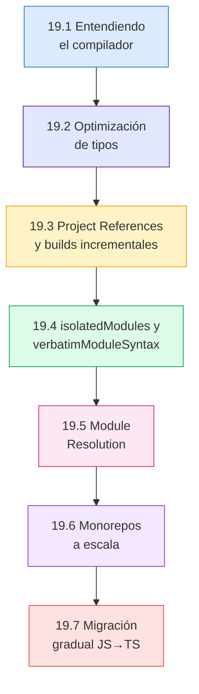
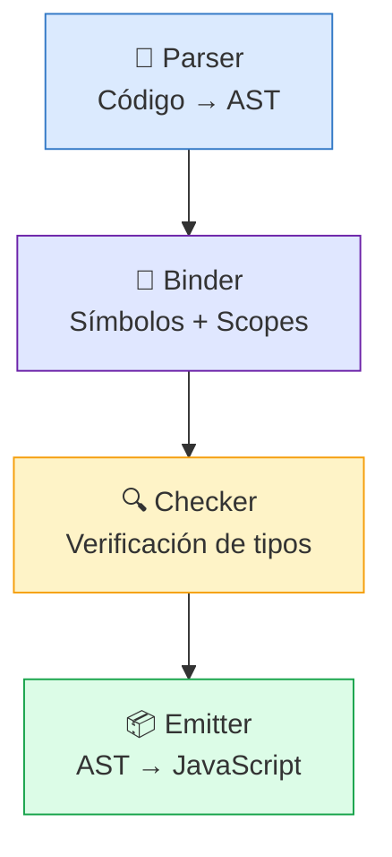
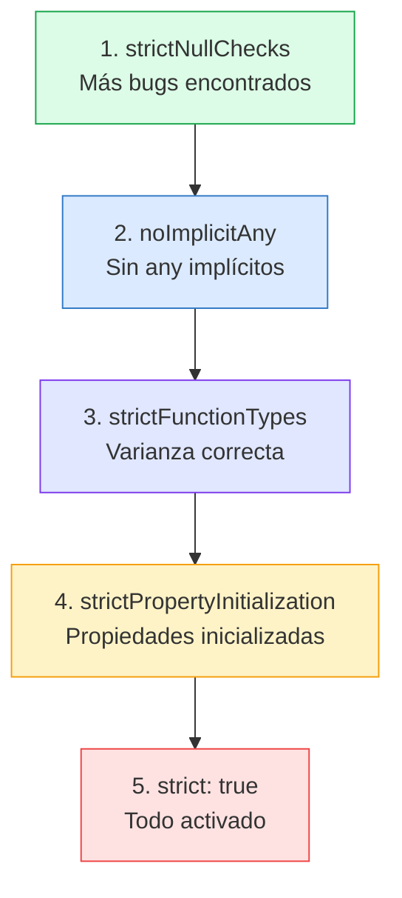

# :rocket: Capítulo 19: Rendimiento, Monorepos y TypeScript a Escala

<div class="chapter-meta">
  <span class="meta-item">🕐 4-5 horas</span>
  <span class="meta-item">📊 Nivel: Experto</span>
  <span class="meta-item">🎯 Semana 10</span>
</div>

<div class="chapter-objective">
  <span class="objective-icon">📌</span>
  <span class="objective-text">Al terminar este capítulo, sabrás optimizar el rendimiento del compilador TypeScript, organizar proyectos a escala con project references, y aplicar estrategias de migración JS→TS.</span>
</div>

<div class="chapter-map">



</div>

!!! quote "Contexto"
    Todo funciona bien con 10 archivos. Pero cuando tu proyecto crece a **cientos de archivos y miles de tipos**, aparecen problemas que nunca habías visto: el compilador tarda 30 segundos, los barrel exports matan el rendimiento, y la resolución de módulos se vuelve un caos. Este capítulo enseña los patrones que usan equipos con codebases TypeScript masivas.

---

<div class="concept-question">
<strong>🤔 Pregunta para reflexionar:</strong> ¿Has notado que <code>tsc</code> se vuelve lento en proyectos grandes? ¿Qué crees que causa la lentitud — el número de archivos, la complejidad de tipos, o ambos?
</div>

## 19.1 Entendiendo el compilador de TypeScript

El compilador `tsc` ejecuta 4 fases:



El **Checker** es donde se gasta el 80%+ del tiempo. Cada tipo que instancias, cada conditional type que evalúas, cada generic que resuelves — todo ocurre aquí.

### Diagnóstico con `--generateTrace`

```bash
# Generar trace del compilador
npx tsc --generateTrace trace-output

# Analizar con @typescript/analyze-trace
npx @typescript/analyze-trace trace-output
```

El trace muestra:
- Qué tipos son más costosos de evaluar
- Dónde se producen instanciaciones excesivas
- Qué archivos tardan más en procesarse

!!! tip "Regla del pulgar"
    Si `tsc` tarda más de **10 segundos** en un proyecto de menos de 500 archivos, tienes un problema de tipos que deberías diagnosticar con `--generateTrace`.

---

## 19.2 Optimización de tipos: patrones rápidos vs. lentos

### Interface vs. Type Alias — rendimiento

```typescript
// ✅ RÁPIDO: Las interfaces se cachean por nombre
interface Mesa {
  id: number;
  número: number;
  zona: string;
}

// 🐌 MÁS LENTO: Los type alias se expanden en cada uso
type Mesa = {
  id: number;
  número: number;
  zona: string;
};
```

Para tipos de objetos simples, las `interface` son más rápidas porque TypeScript las **cachea por nombre**. Los `type alias` se **expanden** en cada punto de uso.

### Tail-Call Optimization en tipos recursivos (TS 4.5+)

```typescript
// 🐌 SIN tail-call: cada paso crea una nueva instancia
type Reverse_Slow<T extends any[], Acc extends any[] = []> =
  T extends [infer Head, ...infer Tail]
    ? Reverse_Slow<Tail, [Head, ...Acc]>
    : Acc;

// ✅ CON tail-call: TypeScript optimiza la recursión
// (Misma sintaxis, pero TS 4.5+ lo detecta automáticamente
// cuando la llamada recursiva es la expresión final del branch true)
type Reverse<T extends any[], Acc extends any[] = []> =
  T extends [infer Head, ...infer Tail]
    ? Reverse<Tail, [Head, ...Acc]>  // Tail position → optimizado
    : Acc;

// Funciona con arrays grandes sin "Type instantiation is excessively deep"
type Test = Reverse<[1, 2, 3, 4, 5, 6, 7, 8, 9, 10]>;
// [10, 9, 8, 7, 6, 5, 4, 3, 2, 1]
```

### Distributive conditional types y rendimiento

```typescript
// 🐌 O(2^n) — cada union se distribuye, creando una explosión combinatoria
type CrossProduct<A, B> = A extends any
  ? B extends any
    ? [A, B]
    : never
  : never;

// Con unions grandes esto explota:
type Big = CrossProduct<"a" | "b" | "c" | "d", 1 | 2 | 3 | 4>;
// 4 × 4 = 16 variantes — OK
// Pero con 20 × 20 = 400 variantes → muy lento

// ✅ Evitar distribución innecesaria con [T] wrapping
type NonDistributive<T> = [T] extends [string] ? "yes" : "no";
```

### Tabla de rendimiento

| Patrón | Rendimiento | Alternativa |
|--------|-------------|-------------|
| `type` para objetos | 🐌 Se expande | `interface` (cacheada) |
| `Omit<T, K>` | 🐌 Mapped type | `Pick` cuando hay pocas claves |
| Barrel exports (`index.ts`) | 🐌🐌 Importa todo | Imports directos al archivo |
| Recursive type sin tail-call | 🐌🐌 Límite ~45 | Con acumulador (tail-call) |
| Union > 25 miembros | 🐌 Distribución costosa | Enum o branded types |

<div class="micro-exercise">
<strong>✏️ Micro-ejercicio:</strong> Ejecuta <code>tsc --diagnostics</code> en tu proyecto. ¿Cuántos archivos compila? ¿Cuánto tiempo tarda? Ahora añade <code>skipLibCheck: true</code> — ¿cuánto mejora?
</div>

<div class="pro-tip">
<strong>💡 Pro tip:</strong> En MakeMenu, el build pasó de 12s a 3s con estas optimizaciones: <code>skipLibCheck: true</code>, project references para shared/frontend/backend, y reemplazando <code>type</code> por <code>interface</code> en los modelos del dominio.
</div>

<div class="misconception-box">
<h4>⚠️ Errores comunes</h4>
<ul>
<li><span class="wrong">❌ Mito:</span> "TypeScript siempre es lento" → <span class="right">✅ Realidad:</span> TS es lento si usas tipos complejos innecesariamente. <code>interface</code> es más rápido que <code>type</code> para objetos. Tipos simples = compilación rápida.</li>
<li><span class="wrong">❌ Mito:</span> "Hay que migrar todo a TS de golpe" → <span class="right">✅ Realidad:</span> Usa <code>allowJs: true</code> y migra archivo por archivo. Empieza por los tipos del dominio, luego los servicios, luego las utilidades.</li>
<li><span class="wrong">❌ Mito:</span> "Project references son solo para monorepos" → <span class="right">✅ Realidad:</span> También son útiles en proyectos grandes con frontend/backend en el mismo repo. Reducen drásticamente el tiempo de compilación.</li>
</ul>
</div>

---

<div class="concept-question">
<strong>🤔 Pregunta para reflexionar:</strong> Si tu monorepo tiene 3 packages (shared, frontend, backend), ¿compila TS todo junto o hay forma de compilar incrementalmente solo lo que cambió?
</div>

## 19.3 Project References y compilación incremental

Los **Project References** dividen tu proyecto en sub-proyectos que se compilan **independientemente**.

### Configuración para MakeMenu

```
makemenu/
├── packages/
│   ├── shared/            ← Tipos y schemas compartidos
│   │   ├── src/
│   │   └── tsconfig.json  ← composite: true
│   ├── backend/
│   │   ├── src/
│   │   └── tsconfig.json  ← references: [shared]
│   └── frontend/
│       ├── src/
│       └── tsconfig.json  ← references: [shared]
└── tsconfig.json          ← references: [shared, backend, frontend]
```

```typescript
// packages/shared/tsconfig.json
{
  "compilerOptions": {
    "composite": true,         // ← Habilita project references
    "declaration": true,       // ← Genera .d.ts (requerido con composite)
    "declarationMap": true,    // ← Permite "Go to Definition" al source
    "outDir": "./dist",
    "rootDir": "./src"
  },
  "include": ["src/**/*"]
}
```

```typescript
// packages/backend/tsconfig.json
{
  "compilerOptions": {
    "outDir": "./dist",
    "rootDir": "./src"
  },
  "references": [
    { "path": "../shared" }   // ← Depende de shared
  ],
  "include": ["src/**/*"]
}
```

```bash
# Compilar todo con build incremental
npx tsc --build              # Solo recompila lo que cambió

# Primera vez: compila todo (lento)
# Siguientes: solo recompila los paquetes que cambiaron (rápido)

# El archivo .tsbuildinfo cachea el estado de compilación
ls packages/shared/.tsbuildinfo
```

!!! tip "Cuándo usar Project References"
    - Proyectos con **3+ paquetes** en un monorepo
    - Cuando `tsc` tarda **>15 segundos** y quieres builds incrementales
    - Cuando quieres **paralelizar** la compilación de paquetes independientes

<div class="connection-box">
<strong>🔗 Conexión ←</strong> Recuerda del <a href='../10-modulos/'>Capítulo 10</a> la organización en módulos. Project references son la evolución: cada módulo es un subproyecto con su propio tsconfig.
</div>

<div class="micro-exercise">
<strong>✏️ Micro-ejercicio:</strong> Configura un mini-monorepo con 2 tsconfigs: <code>tsconfig.shared.json</code> y <code>tsconfig.app.json</code> que referencia al shared. Verifica que <code>tsc --build tsconfig.app.json</code> compila ambos en orden.
</div>

---

## 19.4 `isolatedModules` y `verbatimModuleSyntax`

### `isolatedModules`

Cuando usas un bundler (Vite, esbuild, swc), cada archivo se transpila **individualmente**, sin acceso a otros archivos. Esto rompe ciertos patrones de TypeScript:

```typescript
// ❌ ROMPE con isolatedModules (y con bundlers)
// Porque el bundler no sabe si `EstadoMesa` es un tipo o un valor
export { EstadoMesa } from "./tipos";

// ✅ FUNCIONA: import type es borrado por el bundler
export type { EstadoMesa } from "./tipos";

// ❌ ROMPE: const enum se expande cross-file (el bundler no puede)
export const enum Dirección { Norte, Sur, Este, Oeste }

// ✅ FUNCIONA: enum normal genera un objeto runtime
export enum Dirección { Norte, Sur, Este, Oeste }
```

```json
// tsconfig.json — ACTÍVALO si usas Vite, esbuild, swc
{
  "compilerOptions": {
    "isolatedModules": true
  }
}
```

### `verbatimModuleSyntax` (TypeScript 5.0+)

El reemplazo moderno de `isolatedModules`. Más estricto y más claro:

```typescript
// Con verbatimModuleSyntax, TypeScript EXIGE:
// - import type para tipos
// - import para valores
// No hay ambigüedad

import type { Mesa } from "./types";     // ✅ Tipo — se borra en compilación
import { MesaService } from "./service"; // ✅ Valor — se mantiene

// ❌ Error: Mesa es un tipo, debe usar 'import type'
import { Mesa } from "./types";
```

```json
{
  "compilerOptions": {
    "verbatimModuleSyntax": true  // Reemplaza isolatedModules
  }
}
```

<div class="pro-tip">
<strong>💡 Pro tip:</strong> Para proyectos grandes, usa <code>isolatedModules: true</code> + esbuild/swc para compilación. Reserva <code>tsc --noEmit</code> solo para type-checking en CI. Esto reduce el tiempo de desarrollo de minutos a segundos.
</div>

---

## 19.5 Module Resolution: Node16, Bundler y el futuro

### Las 3 opciones modernas

| Opción | Cuándo usar | Extensiones en import |
|--------|-------------|----------------------|
| `"Bundler"` | Vite, webpack, esbuild | Opcionales |
| `"Node16"` | Node.js puro (sin bundler) | `.js` obligatorio |
| `"NodeNext"` | Node.js (sigue versión actual) | `.js` obligatorio |

```typescript
// Con moduleResolution: "Node16" — REQUIERE extensión .js
import { Mesa } from "./types.js";  // ✅ (archivo real: types.ts)
import { Mesa } from "./types";     // ❌ Error

// Con moduleResolution: "Bundler" — extensión opcional
import { Mesa } from "./types";     // ✅ El bundler lo resuelve
```

### `exports` en package.json

```json
// packages/shared/package.json
{
  "name": "@makemenu/shared",
  "type": "module",
  "exports": {
    ".": {
      "types": "./dist/index.d.ts",
      "import": "./dist/index.js",
      "require": "./dist/index.cjs"
    },
    "./schemas": {
      "types": "./dist/schemas/index.d.ts",
      "import": "./dist/schemas/index.js"
    }
  }
}
```

!!! warning "El orden de `exports` importa"
    La condición `"types"` debe ir **SIEMPRE PRIMERA**. TypeScript la necesita para encontrar los `.d.ts` antes de resolver el módulo.

---

## 19.6 Estrategias de monorepo a escala

### El patrón "Internal Packages" (sin build step)

```json
// packages/shared/package.json — SIN "main" ni "exports" compilados
{
  "name": "@makemenu/shared",
  "main": "./src/index.ts",    // ← Apunta al SOURCE, no al build
  "types": "./src/index.ts"
}
```

```json
// packages/backend/tsconfig.json
{
  "compilerOptions": {
    "paths": {
      "@makemenu/shared": ["../shared/src"]
    }
  }
}
```

**Ventaja**: No necesitas compilar `shared` antes de usar `backend`. El bundler (Vite) resuelve directamente el TypeScript.

### Turborepo pipeline

```json
// turbo.json
{
  "pipeline": {
    "build": {
      "dependsOn": ["^build"],     // Primero los deps, luego este
      "outputs": ["dist/**"]
    },
    "typecheck": {
      "dependsOn": ["^typecheck"]
    },
    "test": {
      "dependsOn": ["build"]
    }
  }
}
```

```bash
# Turborepo cachea resultados — si shared no cambió, no se recompila
npx turbo build     # Solo compila lo que cambió
npx turbo typecheck # Solo verifica tipos de lo que cambió
```

---

<div class="concept-question">
<strong>🤔 Pregunta para reflexionar:</strong> Si tienes un proyecto JavaScript con 10,000 líneas, ¿lo migras TODO a TS de golpe o hay una estrategia gradual?
</div>

## 19.7 Migración gradual: estrategias para codebases existentes

<div class="comparison" markdown>
<div class="lang-box python" markdown>

#### :snake: Python: migración gradual con mypy

```python
# pyproject.toml — mypy gradual
[tool.mypy]
python_version = "3.11"
warn_return_any = true
# Solo verificar archivos específicos
files = ["src/core/**/*.py"]
```

</div>
<div class="lang-box typescript" markdown>

#### 🔷 TypeScript: migración gradual

```json
// tsconfig.json — TypeScript gradual
{
  "compilerOptions": {
    "allowJs": true,      // Permite .js junto a .ts
    "checkJs": true,      // Verifica JS con JSDoc
    "strict": false,      // Activar flags una por una
    "strictNullChecks": true  // Primera flag a activar
  }
}
```

</div>
</div>

### Escalado de flags de strictness (orden recomendado)



### Pragmas de transición

```typescript
// Archivo JavaScript existente — empezar con @ts-check
// @ts-check

/** @type {import("./types").Mesa} */
const mesa = { id: 1, número: 5, zona: "terraza" };

/** @param {number} id */
function obtenerMesa(id) {
  // @ts-expect-error — sé que esto falla, lo arreglaré después
  return db.find(id);
}

// @ts-ignore — silenciar un error (menos estricto que @ts-expect-error)
const resultado = funcionLegacy();
```

!!! warning "`@ts-expect-error` > `@ts-ignore`"
    Usa `@ts-expect-error` en vez de `@ts-ignore`. Si el error desaparece (porque arreglaste el código), `@ts-expect-error` te avisa con un error — `@ts-ignore` silencia para siempre.

---

<div class="code-evolution">
<h4>📈 Evolución de código: Optimización de tsconfig.json</h4>

<div class="evolution-step">
<span class="evolution-label">v1 — Básico: configuración mínima sin optimizaciones</span>

```json
// tsconfig.json — funcional pero lento en proyectos grandes
{
  "compilerOptions": {
    "target": "ES2020",
    "module": "ESNext",
    "moduleResolution": "node",
    "strict": true,
    "outDir": "./dist",
    "rootDir": "./src"
  },
  "include": ["src/**/*"]
}
// ⏱️ Tiempo de build: ~12 segundos en proyecto mediano
// Compila TODO cada vez, verifica TODAS las librerías
```
</div>

<div class="evolution-step">
<span class="evolution-label">v2 — Optimizado: skipLibCheck + isolatedModules</span>

```json
// tsconfig.json — con optimizaciones de rendimiento
{
  "compilerOptions": {
    "target": "ES2020",
    "module": "ESNext",
    "moduleResolution": "Bundler",
    "strict": true,
    "outDir": "./dist",
    "rootDir": "./src",
    "skipLibCheck": true,
    "isolatedModules": true,
    "incremental": true
  },
  "include": ["src/**/*"]
}
// ⏱️ Tiempo de build: ~6 segundos
// skipLibCheck evita re-verificar node_modules
// incremental cachea el estado entre compilaciones
```
</div>

<div class="evolution-step">
<span class="evolution-label">v3 — Profesional: project references con composite builds</span>

```json
// tsconfig.json (raíz del monorepo)
{
  "files": [],
  "references": [
    { "path": "./packages/shared" },
    { "path": "./packages/backend" },
    { "path": "./packages/frontend" }
  ]
}

// packages/shared/tsconfig.json
{
  "compilerOptions": {
    "composite": true,
    "declaration": true,
    "declarationMap": true,
    "skipLibCheck": true,
    "isolatedModules": true,
    "outDir": "./dist",
    "rootDir": "./src"
  },
  "include": ["src/**/*"]
}

// packages/backend/tsconfig.json
{
  "compilerOptions": {
    "composite": true,
    "declaration": true,
    "skipLibCheck": true,
    "isolatedModules": true,
    "outDir": "./dist",
    "rootDir": "./src"
  },
  "references": [{ "path": "../shared" }],
  "include": ["src/**/*"]
}
// ⏱️ Tiempo de build incremental: ~3 segundos
// Solo recompila los paquetes que cambiaron
// tsc --build paraleliza paquetes independientes
```
</div>
</div>

---

<div class="connection-box">
<strong>🔗 Conexión →</strong> En el <a href='../20-testing-libreria/'>Capítulo 20</a> aplicarás testing de tipos y publicarás tu propia librería — el cierre perfecto para tu viaje TypeScript.
</div>

<div class="ejercicio-guiado">
<h4>🏋️ Ejercicio guiado</h4>

Configura un monorepo de MakeMenu con project references, builds incrementales y `isolatedModules` para simular un proyecto a escala:

1. Crea la estructura de carpetas: `makemenu-mono/packages/shared`, `makemenu-mono/packages/api` y `makemenu-mono/packages/web` — cada uno con su propio `tsconfig.json` y `src/index.ts`
2. En `packages/shared/tsconfig.json` configura `composite: true`, `declaration: true` y `outDir: "./dist"` — define una interfaz `Plato` y una función `formatearPrecio` en `src/index.ts`
3. En `packages/api/tsconfig.json` añade `references: [{ path: "../shared" }]` y `isolatedModules: true` — importa `Plato` desde `shared` y crea una función `obtenerMenu(): Plato[]`
4. En `packages/web/tsconfig.json` haz lo mismo que en `api` (referencia a `shared`) — importa y usa `formatearPrecio` para mostrar el menú
5. Crea un `tsconfig.json` raíz con `references` a los tres paquetes y `files: []` (no compila nada directamente)
6. Compila con `npx tsc --build` desde la raíz y verifica que se generan los `.d.ts` y `.js` en cada `dist/` — modifica solo `shared` y re-compila para ver que el build incremental solo recompila lo necesario

??? success "Solución completa"
    ```bash
    # Estructura de carpetas
    mkdir -p makemenu-mono/packages/{shared,api,web}/src
    cd makemenu-mono
    npm init -y
    npm install -D typescript
    ```

    ```json title="tsconfig.json (raíz)"
    {
      "files": [],
      "references": [
        { "path": "packages/shared" },
        { "path": "packages/api" },
        { "path": "packages/web" }
      ]
    }
    ```

    ```json title="packages/shared/tsconfig.json"
    {
      "compilerOptions": {
        "target": "ES2022",
        "module": "ESNext",
        "moduleResolution": "bundler",
        "strict": true,
        "composite": true,
        "declaration": true,
        "declarationMap": true,
        "outDir": "./dist",
        "rootDir": "./src"
      },
      "include": ["src/**/*"]
    }
    ```

    ```typescript title="packages/shared/src/index.ts"
    export interface Plato {
      id: number;
      nombre: string;
      precio: number;
      categoria: "entrante" | "principal" | "postre";
    }

    export function formatearPrecio(precio: number): string {
      return `${precio.toFixed(2)} €`;
    }
    ```

    ```json title="packages/api/tsconfig.json"
    {
      "compilerOptions": {
        "target": "ES2022",
        "module": "ESNext",
        "moduleResolution": "bundler",
        "strict": true,
        "composite": true,
        "declaration": true,
        "outDir": "./dist",
        "rootDir": "./src",
        "isolatedModules": true
      },
      "include": ["src/**/*"],
      "references": [{ "path": "../shared" }]
    }
    ```

    ```typescript title="packages/api/src/index.ts"
    import { Plato } from "../../shared/src/index.js";

    export function obtenerMenu(): Plato[] {
      return [
        { id: 1, nombre: "Bruschetta", precio: 8.5, categoria: "entrante" },
        { id: 2, nombre: "Paella Mixta", precio: 16.0, categoria: "principal" },
        { id: 3, nombre: "Tiramisú", precio: 7.0, categoria: "postre" },
      ];
    }

    console.log("Menú:", obtenerMenu());
    ```

    ```json title="packages/web/tsconfig.json"
    {
      "compilerOptions": {
        "target": "ES2022",
        "module": "ESNext",
        "moduleResolution": "bundler",
        "strict": true,
        "composite": true,
        "declaration": true,
        "outDir": "./dist",
        "rootDir": "./src",
        "isolatedModules": true
      },
      "include": ["src/**/*"],
      "references": [{ "path": "../shared" }]
    }
    ```

    ```typescript title="packages/web/src/index.ts"
    import { Plato, formatearPrecio } from "../../shared/src/index.js";

    function mostrarMenu(platos: Plato[]): void {
      for (const plato of platos) {
        console.log(`${plato.nombre} — ${formatearPrecio(plato.precio)}`);
      }
    }

    const menuEjemplo: Plato[] = [
      { id: 1, nombre: "Gazpacho", precio: 6.5, categoria: "entrante" },
      { id: 2, nombre: "Risotto", precio: 14.0, categoria: "principal" },
    ];
    mostrarMenu(menuEjemplo);
    ```

    ```bash
    # Compilar todo desde la raíz
    npx tsc --build

    # Verificar outputs
    ls packages/shared/dist/  # index.js, index.d.ts, index.d.ts.map
    ls packages/api/dist/
    ls packages/web/dist/

    # Build incremental: modifica shared y recompila
    # Solo shared (y sus dependientes) se recompilan
    npx tsc --build --verbose
    ```

</div>

<div class="real-errors">
<h4>🐞 Errores reales que encontrarás</h4>

<div class="error-entry">
<strong>Error 1:</strong>
<code>error TS2742: The inferred type of 'X' cannot be named without a reference to '../shared/node_modules/...'</code>

**Por qué ocurre:** Cuando usas project references o monorepos, TypeScript intenta generar la declaración de un tipo pero no puede resolverlo porque el `.d.ts` depende de un paquete que no está accesible desde el proyecto que lo consume. Ocurre mucho con `composite: true` cuando faltan `declaration` o `declarationMap`.

**Solución:** Asegúrate de que todos los paquetes referenciados tengan `declaration: true` y `declarationMap: true` en su `tsconfig.json`. Verifica también que los `paths` y `references` apuntan correctamente al paquete compartido.

```json
// packages/shared/tsconfig.json
{
  "compilerOptions": {
    "composite": true,
    "declaration": true,
    "declarationMap": true
  }
}
```
</div>

<div class="error-entry">
<strong>Error 2:</strong>
<code>error TS5095: Option 'bundler' can only be used when 'module' is set to 'es2015' or later.</code>

**Por qué ocurre:** Configuraste `moduleResolution: "Bundler"` pero dejaste `module` en `"CommonJS"` o en un valor incompatible. El modo `Bundler` exige que el sistema de módulos sea ESM (`ES2015`, `ES2020`, `ESNext`, etc.).

**Solución:** Cambia `module` a un formato ESM compatible:

```json
{
  "compilerOptions": {
    "module": "ESNext",
    "moduleResolution": "Bundler"
  }
}
```
</div>

<div class="error-entry">
<strong>Error 3:</strong>
<code>error TS1286: ESM syntax is not allowed in a CommonJS module when 'verbatimModuleSyntax' is enabled.</code>

**Por qué ocurre:** Activaste `verbatimModuleSyntax` pero tu archivo se trata como CommonJS (el `package.json` no tiene `"type": "module"` o el archivo es `.cts`). Con esta flag, TypeScript exige coherencia total entre la sintaxis de import/export y el formato real del módulo.

**Solución:** Añade `"type": "module"` en tu `package.json`, o cambia las extensiones a `.mts` si necesitas ESM explícito. Alternativamente, usa `require()` y `module.exports` si el archivo debe ser CJS.

```json
// package.json
{
  "type": "module"
}
```
</div>

<div class="error-entry">
<strong>Error 4:</strong>
<code>error TS2859: Type instantiation is excessively deep and possibly infinite. (depth limit: 500)</code>

**Por qué ocurre:** Tienes un tipo recursivo (como `DeepReadonly`, `DeepPartial` o un path builder) que genera demasiadas instanciaciones. TypeScript tiene un límite interno de profundidad (~500 niveles) para evitar que el compilador se cuelgue.

**Solución:** Refactoriza el tipo recursivo para usar un acumulador en posición tail-call, o limita la profundidad con un contador:

```typescript
// ✅ Limitar la profundidad con un contador de recursión
type MaxDepth = [never, 0, 1, 2, 3, 4, 5, 6, 7, 8, 9, 10];

type DeepReadonly<T, Depth extends number = 10> =
  Depth extends 0
    ? T
    : T extends object
      ? { readonly [K in keyof T]: DeepReadonly<T[K], MaxDepth[Depth]> }
      : T;
```
</div>
</div>

<div class="checkpoint">
<h4>🏁 Checkpoint</h4>
<p>Si puedes: (1) diagnosticar rendimiento con <code>tsc --generateTrace</code> y <code>--diagnostics</code>, (2) configurar project references con <code>composite: true</code> y <code>tsc --build</code>, y (3) planificar una migración gradual JS→TS con <code>allowJs</code> y escalado de flags de strictness — dominas TypeScript a escala.</p>
</div>

<div class="mini-project">
<h4>🛠️ Mini-proyecto: Monorepo optimizado para MakeMenu</h4>
<p>Configura un monorepo con 3 paquetes (<code>shared</code>, <code>backend</code>, <code>frontend</code>) usando project references, compilación incremental y resolución de módulos moderna. Al final tendrás una estructura profesional lista para escalar.</p>

**Paso 1 — Crear la estructura del monorepo y el paquete `shared`**

Crea la estructura de carpetas y configura el paquete `shared` con `composite: true`, tipos del dominio y un `package.json` con `exports` correctamente ordenados.

??? success "Solución Paso 1"

    ```
    makemenu-monorepo/
    ├── packages/
    │   ├── shared/
    │   │   ├── src/
    │   │   │   ├── index.ts
    │   │   │   └── types.ts
    │   │   ├── tsconfig.json
    │   │   └── package.json
    │   ├── backend/
    │   │   └── src/
    │   │       └── index.ts
    │   └── frontend/
    │       └── src/
    │           └── index.ts
    └── tsconfig.json
    ```

    ```typescript
    // packages/shared/src/types.ts
    export interface Mesa {
      id: number;
      número: number;
      zona: "interior" | "terraza" | "barra";
      capacidad: number;
    }

    export interface Pedido {
      id: number;
      mesaId: number;
      items: ItemPedido[];
      estado: "pendiente" | "preparando" | "servido" | "cobrado";
      creadoEn: Date;
    }

    export interface ItemPedido {
      productoId: number;
      nombre: string;
      cantidad: number;
      precio: number;
    }
    ```

    ```typescript
    // packages/shared/src/index.ts
    export type { Mesa, Pedido, ItemPedido } from "./types";
    ```

    ```json
    // packages/shared/tsconfig.json
    {
      "compilerOptions": {
        "composite": true,
        "declaration": true,
        "declarationMap": true,
        "target": "ES2020",
        "module": "ESNext",
        "moduleResolution": "Bundler",
        "outDir": "./dist",
        "rootDir": "./src",
        "strict": true,
        "skipLibCheck": true,
        "isolatedModules": true
      },
      "include": ["src/**/*"]
    }
    ```

    ```json
    // packages/shared/package.json
    {
      "name": "@makemenu/shared",
      "version": "1.0.0",
      "type": "module",
      "exports": {
        ".": {
          "types": "./dist/index.d.ts",
          "import": "./dist/index.js"
        }
      }
    }
    ```

**Paso 2 — Configurar `backend` y `frontend` con references al `shared`**

Crea los `tsconfig.json` de `backend` y `frontend`, cada uno referenciando a `shared`. Importa los tipos compartidos y úsalos para crear funciones con tipado fuerte. Usa `verbatimModuleSyntax` para asegurar imports explícitos.

??? success "Solución Paso 2"

    ```json
    // packages/backend/tsconfig.json
    {
      "compilerOptions": {
        "composite": true,
        "declaration": true,
        "target": "ES2020",
        "module": "ESNext",
        "moduleResolution": "Bundler",
        "outDir": "./dist",
        "rootDir": "./src",
        "strict": true,
        "skipLibCheck": true,
        "verbatimModuleSyntax": true
      },
      "references": [
        { "path": "../shared" }
      ],
      "include": ["src/**/*"]
    }
    ```

    ```typescript
    // packages/backend/src/index.ts
    import type { Mesa, Pedido } from "@makemenu/shared";

    // Servicio de mesas con tipos del paquete shared
    const mesas: Mesa[] = [];

    function crearMesa(número: number, zona: Mesa["zona"]): Mesa {
      const mesa: Mesa = {
        id: mesas.length + 1,
        número,
        zona,
        capacidad: zona === "barra" ? 2 : 4,
      };
      mesas.push(mesa);
      return mesa;
    }

    function obtenerPedidosPorMesa(
      mesaId: number,
      pedidos: Pedido[]
    ): Pedido[] {
      return pedidos.filter((p) => p.mesaId === mesaId);
    }

    export { crearMesa, obtenerPedidosPorMesa };
    ```

    ```json
    // packages/frontend/tsconfig.json
    {
      "compilerOptions": {
        "composite": true,
        "declaration": true,
        "target": "ES2020",
        "module": "ESNext",
        "moduleResolution": "Bundler",
        "outDir": "./dist",
        "rootDir": "./src",
        "strict": true,
        "skipLibCheck": true,
        "verbatimModuleSyntax": true,
        "jsx": "react-jsx"
      },
      "references": [
        { "path": "../shared" }
      ],
      "include": ["src/**/*"]
    }
    ```

    ```typescript
    // packages/frontend/src/index.ts
    import type { Mesa } from "@makemenu/shared";

    function renderizarMesa(mesa: Mesa): string {
      return `Mesa ${mesa.número} (${mesa.zona}) - ${mesa.capacidad} personas`;
    }

    function renderizarListaMesas(mesas: Mesa[]): string[] {
      return mesas.map(renderizarMesa);
    }

    export { renderizarMesa, renderizarListaMesas };
    ```

**Paso 3 — Configurar el `tsconfig.json` raíz y verificar el build incremental**

Crea el `tsconfig.json` en la raíz del monorepo que referencia los 3 paquetes. Ejecuta `tsc --build` y comprueba que genera los archivos `.tsbuildinfo` para compilación incremental. Mide el tiempo de la primera compilación vs. la segunda (sin cambios).

??? success "Solución Paso 3"

    ```json
    // tsconfig.json (raíz del monorepo)
    {
      "files": [],
      "references": [
        { "path": "./packages/shared" },
        { "path": "./packages/backend" },
        { "path": "./packages/frontend" }
      ]
    }
    ```

    ```bash
    # Primera compilación: compila todo
    time npx tsc --build
    # Resultado esperado: ~2-4 segundos (dependiendo de la máquina)

    # Verificar que se generaron los .tsbuildinfo
    ls packages/shared/.tsbuildinfo
    ls packages/backend/.tsbuildinfo
    ls packages/frontend/.tsbuildinfo

    # Segunda compilación: sin cambios → casi instantánea
    time npx tsc --build
    # Resultado esperado: ~0.2-0.5 segundos

    # Ahora modifica un tipo en shared/src/types.ts
    # y compila de nuevo — solo recompila shared + dependientes
    time npx tsc --build --verbose
    # Verás: "Project 'packages/shared' is out of date"
    # Verás: "Project 'packages/backend' is out of date" (depende de shared)
    # Verás: "Project 'packages/frontend' is out of date" (depende de shared)

    # Para limpiar y recompilar todo desde cero:
    npx tsc --build --clean
    npx tsc --build
    ```

    Al ejecutar `tsc --build --verbose` después de modificar solo `shared`, verás que TypeScript detecta la cadena de dependencias y recompila en el orden correcto: primero `shared`, luego `backend` y `frontend` en paralelo (si no dependen entre sí). Los archivos `.tsbuildinfo` almacenan el hash de cada archivo para saber exactamente qué cambió.

</div>

## :pencil: Ejercicios

### Ejercicio 19.1 — Configurar Project References

<span class="bloom-badge apply">Aplicar</span>

Configura project references para un monorepo MakeMenu con 3 paquetes (`shared`, `backend`, `frontend`). Cada `tsconfig.json` debe tener las referencias correctas.

### Ejercicio 19.2 — Optimizar un tipo lento

<span class="bloom-badge analyze">Analizar</span>

El siguiente tipo es O(2^n). Reescríbelo para que sea O(n):

```typescript
// 🐌 Lento: se distribuye en cada nivel
type DeepReadonly_Slow<T> = T extends object
  ? { readonly [K in keyof T]: DeepReadonly_Slow<T[K]> }
  : T;
```

??? success "Pista"
    Usa un acumulador y evita distribución con `[T] extends [object]`.

---

## :zap: Flashcards

<div class="flashcard">
<div class="front">¿Qué hace <code>--generateTrace</code> y cuándo usarlo?</div>
<div class="back">Genera un trace de rendimiento del compilador. Muestra qué tipos son más costosos, dónde hay instanciaciones excesivas y qué archivos tardan más. Usar cuando <code>tsc</code> tarda <strong>&gt;10 segundos</strong> en proyectos medianos.</div>
</div>

<div class="flashcard">
<div class="front">¿Por qué las <code>interface</code> son más rápidas que los <code>type alias</code> para objetos?</div>
<div class="back">Las interfaces se <strong>cachean por nombre</strong> en el checker. Los type aliases se <strong>expanden</strong> (inlined) en cada punto de uso, re-evaluándose cada vez. Para objetos simples, <code>interface</code> es más eficiente.</div>
</div>

<div class="flashcard">
<div class="front">¿Qué es <code>composite: true</code> en tsconfig.json?</div>
<div class="back">Habilita Project References. Requiere <code>declaration: true</code>. Genera un <code>.tsbuildinfo</code> para compilación incremental. Cada sub-proyecto se compila independientemente con <code>tsc --build</code>.</div>
</div>

<div class="flashcard">
<div class="front">¿Qué diferencia hay entre <code>isolatedModules</code> y <code>verbatimModuleSyntax</code>?</div>
<div class="back"><code>isolatedModules</code> prohíbe patrones que no funcionan con transpiladores de archivo-único (esbuild, swc). <code>verbatimModuleSyntax</code> (TS 5.0+) es más estricto: exige <code>import type</code> para tipos, eliminando toda ambigüedad. Es el reemplazo recomendado.</div>
</div>

<div class="flashcard">
<div class="front">¿Cuál es el orden correcto de las condiciones en <code>exports</code> de package.json?</div>
<div class="back"><code>"types"</code> debe ir <strong>PRIMERO</strong>, seguido de <code>"import"</code> y <code>"require"</code>. TypeScript necesita encontrar los <code>.d.ts</code> antes de resolver el módulo. Un orden incorrecto causa errores de tipos en los consumidores.</div>
</div>

<div class="flashcard">
<div class="front">¿Qué es el patrón "Internal Packages"?</div>
<div class="back">Apuntar <code>"main"</code> y <code>"types"</code> al <strong>source TypeScript</strong> directamente, sin compilar. El bundler (Vite) transpila el TS en el proceso de build del consumidor. Elimina el paso de build para paquetes internos, acelerando el desarrollo.</div>
</div>

<div class="flashcard">
<div class="front">¿Cuál es la primera flag de strictness que se debe activar al migrar?</div>
<div class="back"><code>strictNullChecks</code>. Es la que encuentra más bugs reales (null/undefined no controlados) y tiene el mejor ratio esfuerzo/beneficio. Después: <code>noImplicitAny</code> → <code>strictFunctionTypes</code> → <code>strict: true</code>.</div>
</div>

---

## :video_game: Quiz interactivo

<div class="quiz" data-quiz-id="ch19-q1">
<h4>Pregunta 1: ¿Por qué los barrel exports (<code>index.ts</code>) pueden ser problemáticos?</h4>
<button class="quiz-option" data-correct="false">Generan archivos JavaScript más grandes</button>
<button class="quiz-option" data-correct="true">Fuerzan al compilador a procesar TODOS los archivos re-exportados, incluso si solo importas un tipo</button>
<button class="quiz-option" data-correct="false">No funcionan con ESM</button>
<button class="quiz-option" data-correct="false">Son incompatibles con Project References</button>
<div class="quiz-feedback" data-correct="¡Correcto! Un `export * from './mesa'` en un index.ts obliga a TypeScript a cargar y verificar todos los módulos exportados, aunque solo importes una interfaz. Los imports directos al archivo específico son más rápidos." data-incorrect="Incorrecto. El problema es que el compilador debe procesar todos los módulos re-exportados, no solo el que necesitas. Esto aumenta significativamente el tiempo de type-checking."></div>
</div>

<div class="quiz" data-quiz-id="ch19-q2">
<h4>Pregunta 2: ¿Qué requiere <code>moduleResolution: "Node16"</code> que <code>"Bundler"</code> no?</h4>
<button class="quiz-option" data-correct="true">Extensiones <code>.js</code> explícitas en los imports (aunque el archivo sea <code>.ts</code>)</button>
<button class="quiz-option" data-correct="false">Usar CommonJS exclusivamente</button>
<button class="quiz-option" data-correct="false">Tener un archivo <code>package.json</code></button>
<button class="quiz-option" data-correct="false">Instalar <code>@types/node</code></button>
<div class="quiz-feedback" data-correct="¡Correcto! Node.js nativo requiere extensiones explícitas en ESM: `import { Mesa } from './types.js'`. Con 'Bundler', las extensiones son opcionales porque el bundler las resuelve." data-incorrect="Incorrecto. 'Node16' requiere extensiones `.js` en imports ESM (Node.js nativo las necesita). 'Bundler' no las exige porque el bundler resuelve las rutas."></div>
</div>

<div class="quiz" data-quiz-id="ch19-q3">
<h4>Pregunta 3: ¿Cuál es la ventaja de <code>@ts-expect-error</code> sobre <code>@ts-ignore</code>?</h4>
<button class="quiz-option" data-correct="false">Es más rápido de compilar</button>
<button class="quiz-option" data-correct="false">Funciona en archivos JavaScript</button>
<button class="quiz-option" data-correct="true">Si el error desaparece (porque arreglaste el código), te avisa con un error — <code>@ts-ignore</code> silencia para siempre</button>
<button class="quiz-option" data-correct="false">Permite especificar el código de error</button>
<div class="quiz-feedback" data-correct="¡Correcto! `@ts-expect-error` es 'self-cleaning': cuando el error que esperaba ya no existe, TypeScript te avisa. Así no te olvidas pragmas obsoletos. `@ts-ignore` silencia indefinidamente." data-incorrect="Incorrecto. `@ts-expect-error` reporta un error si la línea siguiente YA NO tiene error — te avisa que el pragma es obsoleto. `@ts-ignore` silencia para siempre sin avisar."></div>
</div>

---

## :bug: Ejercicio de depuración

Encuentra los **3 errores** en este código:

```typescript
// ❌ Este código tiene 3 errores. ¡Encuéntralos!

// 1. Re-exportar const enum (isolatedModules)
export const enum Dirección {  // 🤔
  Norte = "N",
  Sur = "S",
}

// 2. Package.json exports — orden incorrecto
// {
//   "exports": {
//     ".": {
//       "import": "./dist/index.js",
//       "types": "./dist/index.d.ts",    // 🤔
//       "require": "./dist/index.cjs"
//     }
//   }
// }

// 3. Project reference circular
// packages/a/tsconfig.json: references: [{ path: "../b" }]
// packages/b/tsconfig.json: references: [{ path: "../a" }]  // 🤔
```

??? success "Solución"
    ```typescript
    // ✅ Código corregido

    // 1. const enum NO funciona con isolatedModules/bundlers
    export enum Dirección {    // ✅ Fix 1: enum normal (no const)
      Norte = "N",
      Sur = "S",
    }

    // 2. "types" DEBE ir PRIMERO en exports
    // ✅ Fix 2:
    // {
    //   "exports": {
    //     ".": {
    //       "types": "./dist/index.d.ts",    // ← PRIMERO
    //       "import": "./dist/index.js",
    //       "require": "./dist/index.cjs"
    //     }
    //   }
    // }

    // 3. Las references NO pueden ser circulares
    // ✅ Fix 3: Extraer los tipos compartidos a un tercer paquete
    // packages/shared/tsconfig.json: sin references
    // packages/a/tsconfig.json: references: [{ path: "../shared" }]
    // packages/b/tsconfig.json: references: [{ path: "../shared" }]
    ```

---

## ✅ Autoevaluación del capítulo

<div class="self-check" markdown>
<h4>📋 Verifica tu comprensión</h4>
<label><input type="checkbox"> Sé usar <code>--generateTrace</code> para diagnosticar problemas de rendimiento</label>
<label><input type="checkbox"> Entiendo por qué <code>interface</code> es más rápida que <code>type</code> para objetos</label>
<label><input type="checkbox"> Puedo configurar project references con <code>composite: true</code> y <code>tsc --build</code></label>
<label><input type="checkbox"> Sé la diferencia entre <code>isolatedModules</code> y <code>verbatimModuleSyntax</code></label>
<label><input type="checkbox"> Puedo elegir entre <code>moduleResolution: "Bundler"</code> y <code>"Node16"</code></label>
<label><input type="checkbox"> Conozco el patrón "Internal Packages" para monorepos</label>
<label><input type="checkbox"> He completado todos los ejercicios del capítulo</label>
</div>
