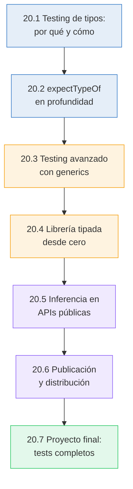

# 🏆 Capítulo 20: Testing de Tipos y Creación de tu Propia Librería

<div class="chapter-meta">
  <span class="meta-item">🕐 5-6 horas</span>
  <span class="meta-item">📊 Nivel: Experto</span>
  <span class="meta-item">🎯 Semana 10</span>
</div>

<div class="chapter-objective">
  <span class="objective-icon">📌</span>
  <span class="objective-text">Al terminar este capítulo, sabrás testear tipos con tsd y expect-type, publicar paquetes npm con tipos incluidos, y habrás creado tu propia librería TypeScript — el cierre de tu viaje.</span>
</div>

<div class="chapter-map">
<h4>🗺️ Mapa del capítulo</h4>



**Leyenda:** <span style="color:#3178c6">azul</span> = fundamentos de testing | <span style="color:#f59e0b">naranja</span> = construcción de librería | <span style="color:#8b5cf6">violeta</span> = inferencia y publicación | <span style="color:#22c55e">verde</span> = proyecto final

</div>

!!! quote "Contexto"
    El capstone de la Parte V. Hasta ahora has **usado** librerías tipadas (Zod, tRPC, Prisma). Ahora vas a **construir una**. Este capítulo cubre una disciplina que la mayoría de desarrolladores no conocen: **testing de tipos** (verificar que tus tipos producen los resultados correctos). Culmina con la creación de `@makemenu/validation`, una mini-librería de validación al estilo Zod.

<div class="connection-box">
<span class="connection-icon">🔗</span>
<span>En el <a href='../18-patrones-librerias/'>Capítulo 18</a> aprendiste los patrones de DX que hacen grandes a las librerías TypeScript. Ahora los aplicas creando tu propia librería con esos mismos patrones: inferencia automática, phantom types, y APIs encadenables.</span>
</div>

---

<div class="concept-question">
<h4>🔍 Pregunta conceptual</h4>
<p>Testeas funciones con Jest/Vitest, pero ¿cómo testeas que tus TIPOS son correctos? Si cambias una interfaz y un tipo derivado se rompe, ¿lo detecta <code>tsc</code>? ¿O necesitas tests específicos?</p>
</div>

## 20.1 Testing de tipos: por qué y cómo

Los tests de runtime verifican que tu **código** funciona. Los tests de tipos verifican que tus **tipos** son correctos.

```typescript
// Runtime test (Vitest) — verifica VALORES
test("suma 2 + 3", () => {
  expect(suma(2, 3)).toBe(5);
});

// Type test — verifica TIPOS
// Si MiPartial<Mesa> no produce el tipo correcto, esto falla en COMPILACIÓN
type Test = Expect<Equal<
  MiPartial<Mesa>,
  { id?: number; número?: number; zona?: string }
>>;
```

### Tres herramientas para testing de tipos

| Herramienta | Cómo funciona | Cuándo usar |
|-------------|---------------|-------------|
| `@ts-expect-error` | El compilador espera un error en la siguiente línea | Tests negativos simples |
| `expectTypeOf` (Vitest) | API fluida para assertions de tipo en tests | Testing integrado con Vitest |
| `tsd` | Librería dedicada a type testing | Testing de tipos puro (sin Vitest) |

### `@ts-expect-error` como assertion

```typescript
// Test positivo: esto DEBE compilar
const mesa: Mesa = { id: 1, número: 5, zona: "terraza", capacidad: 4 };

// Test negativo: esto NO DEBE compilar
// @ts-expect-error — falta 'capacidad'
const mesaIncompleta: Mesa = { id: 1, número: 5, zona: "terraza" };

// Si el error desaparece (alguien hizo 'capacidad' opcional),
// @ts-expect-error falla → el test detecta el cambio
```

<div class="comparison" markdown>
<div class="lang-box python" markdown>

#### :snake: Python — testing de tipos con mypy

```python
# reveal_type() muestra el tipo inferido
x = [1, 2, 3]
reveal_type(x)  # Revealed type is "list[int]"

# mypy test con assert_type (Python 3.11+)
from typing import assert_type
assert_type(x, list[int])  # ✅
```

</div>
<div class="lang-box typescript" markdown>

#### 🔷 TypeScript — testing con expectTypeOf

```typescript
import { expectTypeOf } from "vitest";

const x = [1, 2, 3];
expectTypeOf(x).toEqualTypeOf<number[]>();  // ✅
expectTypeOf(x).toBeArray();                // ✅
expectTypeOf(x).items.toBeNumber();         // ✅
```

</div>
</div>

<div class="micro-exercise">
<h4>🧪 Micro-ejercicio (5 min)</h4>
<p>Escribe un test de tipo que verifique: (1) <code>Partial&lt;Plato&gt;</code> hace todas las props opcionales, (2) <code>Readonly&lt;Plato&gt;</code> previene asignación, (3) tu utility type personalizado funciona correctamente. Usa <code>expectTypeOf</code> para las tres verificaciones.</p>
</div>

---

## 20.2 `expectTypeOf` en profundidad

Vitest incluye `expectTypeOf` — una API completa para assertions de tipo:

```typescript
import { expectTypeOf, test } from "vitest";
import type { Mesa, MesaCrear, ApiResponse } from "@makemenu/shared";

test("tipos de Mesa", () => {
  // Verificar estructura
  expectTypeOf<Mesa>().toHaveProperty("id");
  expectTypeOf<Mesa>().toHaveProperty("número");

  // Verificar tipos de propiedades
  expectTypeOf<Mesa["id"]>().toBeNumber();
  expectTypeOf<Mesa["zona"]>().toBeString();

  // Verificar que MesaCrear NO tiene id
  expectTypeOf<MesaCrear>().not.toHaveProperty("id");
});

test("tipos de ApiResponse", () => {
  // Verificar tipo genérico
  expectTypeOf<ApiResponse<Mesa[]>>().toEqualTypeOf<{
    data: Mesa[];
    total: number;
    page: number;
  }>();

  // Verificar que no es any
  expectTypeOf<ApiResponse<Mesa>>().not.toBeAny();
});

test("tipos de funciones", () => {
  // Verificar parámetros de una función
  expectTypeOf(obtenerMesa).parameter(0).toEqualTypeOf<MesaId>();

  // Verificar retorno
  expectTypeOf(obtenerMesa).returns.resolves.toEqualTypeOf<Mesa>();

  // Verificar que es callable
  expectTypeOf(obtenerMesa).toBeCallableWith(MesaId(1));
});
```

### API Reference

| Método | Verifica |
|--------|----------|
| `.toEqualTypeOf<T>()` | Tipos **exactamente** iguales |
| `.toMatchTypeOf<T>()` | El tipo es **asignable** a T (más permisivo) |
| `.toBeString()` | Es `string` |
| `.toBeNumber()` | Es `number` |
| `.toBeBoolean()` | Es `boolean` |
| `.toBeArray()` | Es un array |
| `.toBeNullable()` | Puede ser `null` o `undefined` |
| `.not` | Niega la siguiente assertion |
| `.parameter(n)` | Tipo del parámetro n-ésimo |
| `.returns` | Tipo de retorno |
| `.resolves` | Tipo resuelto de una Promise |
| `.items` | Tipo de los elementos de un array |
| `.toHaveProperty(key)` | Tiene la propiedad |

!!! warning "`toEqualTypeOf` vs `toMatchTypeOf`"
    ```typescript
    interface A { x: number; y: string }
    interface B { x: number }

    expectTypeOf<A>().toMatchTypeOf<B>();  // ✅ A es asignable a B
    expectTypeOf<A>().toEqualTypeOf<B>();  // ❌ A ≠ B (A tiene 'y')
    ```

---

## 20.3 Patrones de testing avanzados con generics

### Testing de utility types

```typescript
import { expectTypeOf, test } from "vitest";

// Testear tu propio DeepReadonly
type DeepReadonly<T> = {
  readonly [K in keyof T]: T[K] extends object ? DeepReadonly<T[K]> : T[K];
};

test("DeepReadonly hace todo readonly recursivamente", () => {
  type Input = { a: { b: { c: number } }; d: string[] };
  type Result = DeepReadonly<Input>;

  // Nivel 1: readonly
  expectTypeOf<Result["d"]>().toEqualTypeOf<readonly string[]>();

  // Nivel profundo: readonly
  type C = Result["a"]["b"]["c"];
  expectTypeOf<C>().toBeNumber();
});
```

### Testing de conditional types

```typescript
test("ExtraerNumeros filtra correctamente", () => {
  type ExtraerNumeros<T> = T extends number ? T : never;

  // Union → solo números
  type R1 = ExtraerNumeros<string | number | boolean | 42>;
  expectTypeOf<R1>().toEqualTypeOf<number | 42>();

  // Solo string → never
  type R2 = ExtraerNumeros<string>;
  expectTypeOf<R2>().toBeNever();
});
```

### Testing del query builder (del capítulo 18)

```typescript
test("query builder infiere tipos correctamente", () => {
  // Sin select → todas las columnas
  const q1 = query("mesas").execute();
  expectTypeOf(q1).toEqualTypeOf<
    { id: number; número: number; zona: string; capacidad: number }[]
  >();

  // Con select → solo las seleccionadas
  const q2 = query("mesas").select("número", "zona").execute();
  expectTypeOf(q2).toEqualTypeOf<{ número: number; zona: string }[]>();

  // Where verifica tipos de columnas
  // @ts-expect-error — zona es string, no number
  query("mesas").where("zona", "=", 42);
});
```

---

<div class="concept-question">
<h4>🔍 Pregunta conceptual</h4>
<p>Si tuvieras que crear una librería de validación como Zod (pero mini), ¿por dónde empezarías? ¿API primero o tipos primero? Piensa en cómo se siente usarla antes de pensar en cómo implementarla.</p>
</div>

## 20.4 Construyendo una librería tipada desde cero

### Estructura del proyecto `@makemenu/validation`

```
packages/validation/
├── src/
│   ├── index.ts          ← Entry point (re-exports)
│   ├── types.ts          ← Tipos base del sistema
│   ├── schemas/
│   │   ├── string.ts     ← v.string()
│   │   ├── number.ts     ← v.number()
│   │   ├── object.ts     ← v.object({ ... })
│   │   └── array.ts      ← v.array(schema)
│   └── utils/
│       ├── result.ts     ← Tipo Result<T, E>
│       └── errors.ts     ← Errores de validación
├── tests/
│   ├── string.test.ts    ← Tests runtime + tipo
│   ├── object.test.ts
│   └── inference.test.ts ← Tests de inferencia pura
├── tsconfig.json
└── package.json
```

### tsconfig.json para una librería

```json
{
  "compilerOptions": {
    "target": "ES2022",
    "module": "ESNext",
    "moduleResolution": "Bundler",
    "strict": true,
    "declaration": true,           // ← Genera .d.ts
    "declarationMap": true,        // ← Permite "Go to Definition" al source
    "sourceMap": true,
    "outDir": "./dist",
    "rootDir": "./src",
    "stripInternal": true,         // ← No exporta JSDoc @internal
    "esModuleInterop": true,
    "skipLibCheck": true
  },
  "include": ["src/**/*"],
  "exclude": ["tests/**/*", "dist/**/*"]
}
```

---

## 20.5 Inferencia en APIs públicas

El secreto de Zod, tRPC y Prisma es que sus APIs **infieren tipos automáticamente** a partir de la definición. Vamos a replicar este patrón.

### El core de `@makemenu/validation`

```typescript
// types.ts — Los tipos base del sistema de validación

// Resultado de validación (como Zod's safeParse)
type ValidationResult<T> =
  | { success: true; data: T }
  | { success: false; errors: ValidationError[] };

interface ValidationError {
  path: string[];
  message: string;
}

// Schema base — todos los schemas implementan esto
interface Schema<Output> {
  readonly _output: Output;  // Phantom type para inferencia
  parse(input: unknown): Output;
  safeParse(input: unknown): ValidationResult<Output>;
  optional(): Schema<Output | undefined>;
}
```

### String schema

```typescript
// schemas/string.ts
class StringSchema implements Schema<string> {
  readonly _output!: string;
  private _minLength?: number;
  private _maxLength?: number;

  parse(input: unknown): string {
    const result = this.safeParse(input);
    if (!result.success) throw new Error(result.errors[0].message);
    return result.data;
  }

  safeParse(input: unknown): ValidationResult<string> {
    if (typeof input !== "string") {
      return { success: false, errors: [{ path: [], message: "Expected string" }] };
    }
    if (this._minLength !== undefined && input.length < this._minLength) {
      return { success: false, errors: [{ path: [], message: `Min length: ${this._minLength}` }] };
    }
    return { success: true, data: input };
  }

  min(length: number): this {
    this._minLength = length;
    return this;
  }

  max(length: number): this {
    this._maxLength = length;
    return this;
  }

  optional(): Schema<string | undefined> {
    return new OptionalSchema(this);
  }
}
```

### Object schema (donde ocurre la magia de inferencia)

```typescript
// schemas/object.ts

// El tipo que infiere la forma del objeto a partir de los schemas
type InferShape<T extends Record<string, Schema<any>>> = {
  [K in keyof T]: T[K]["_output"];
};

class ObjectSchema<Shape extends Record<string, Schema<any>>>
  implements Schema<InferShape<Shape>> {

  readonly _output!: InferShape<Shape>;

  constructor(private shape: Shape) {}

  parse(input: unknown): InferShape<Shape> {
    const result = this.safeParse(input);
    if (!result.success) throw new Error(JSON.stringify(result.errors));
    return result.data;
  }

  safeParse(input: unknown): ValidationResult<InferShape<Shape>> {
    if (typeof input !== "object" || input === null) {
      return { success: false, errors: [{ path: [], message: "Expected object" }] };
    }

    const data: any = {};
    const errors: ValidationError[] = [];

    for (const [key, schema] of Object.entries(this.shape)) {
      const result = schema.safeParse((input as any)[key]);
      if (result.success) {
        data[key] = result.data;
      } else {
        errors.push(...result.errors.map(e => ({
          ...e,
          path: [key, ...e.path],
        })));
      }
    }

    if (errors.length > 0) return { success: false, errors };
    return { success: true, data };
  }

  optional(): Schema<InferShape<Shape> | undefined> {
    return new OptionalSchema(this);
  }
}
```

### La API pública

```typescript
// index.ts — Entry point
export const v = {
  string: () => new StringSchema(),
  number: () => new NumberSchema(),
  boolean: () => new BooleanSchema(),
  object: <S extends Record<string, Schema<any>>>(shape: S) =>
    new ObjectSchema(shape),
  array: <S extends Schema<any>>(schema: S) =>
    new ArraySchema(schema),
};

// Type helper (como z.infer)
export type Infer<S extends Schema<any>> = S["_output"];
```

### Uso — inferencia automática completa

```typescript
import { v, type Infer } from "@makemenu/validation";

// Definir schema
const MesaSchema = v.object({
  id: v.number(),
  número: v.number(),
  zona: v.string(),
  capacidad: v.number(),
});

// El tipo se infiere automáticamente
type Mesa = Infer<typeof MesaSchema>;
// = { id: number; número: number; zona: string; capacidad: number }

// Validar datos
const result = MesaSchema.safeParse(req.body);
if (result.success) {
  // result.data es tipo Mesa — completamente tipado
  console.log(result.data.número);
}
```

---

<div class="concept-question">
<h4>🔍 Pregunta conceptual</h4>
<p>¿Qué necesita un paquete npm para tener buen soporte de TypeScript? ¿Solo el JS compilado, o también los tipos? ¿Cómo configurarías <code>package.json</code> para que funcione en ESM, CJS y bundlers?</p>
</div>

## 20.6 Publicación y distribución

### package.json para la librería

```json
{
  "name": "@makemenu/validation",
  "version": "1.0.0",
  "type": "module",
  "main": "./dist/index.js",
  "types": "./dist/index.d.ts",
  "exports": {
    ".": {
      "types": "./dist/index.d.ts",
      "import": "./dist/index.js",
      "require": "./dist/index.cjs"
    }
  },
  "files": ["dist"],
  "sideEffects": false,
  "scripts": {
    "build": "tsc",
    "test": "vitest run",
    "typecheck": "tsc --noEmit",
    "prepublishOnly": "npm run build && npm run test && npm run typecheck"
  }
}
```

<div class="micro-exercise">
<h4>🧪 Micro-ejercicio (5 min)</h4>
<p>Configura un <code>package.json</code> con los campos <code>main</code>, <code>types</code>, <code>exports</code>, y <code>files</code> correctos para publicar una librería TS. Ejecuta <code>npm pack</code> para verificar qué archivos se incluirían. Compara el resultado con el ejemplo de arriba.</p>
</div>

<div class="pro-tip">
<h4>💡 Consejo Pro</h4>
<p>Usa <code>exports</code> en package.json con conditional exports: <code>{ ".": { "import": "./dist/esm/index.js", "require": "./dist/cjs/index.js", "types": "./dist/types/index.d.ts" } }</code>. Esto soporta ESM y CJS simultáneamente. Recuerda: la condición <code>"types"</code> siempre va PRIMERO.</p>
</div>

<div class="pro-tip">
<h4>💡 Consejo Pro</h4>
<p>Antes de publicar, ejecuta <code>publint</code> y <code>arethetypeswrong</code> — herramientas que verifican que tu package.json está configurado correctamente para consumidores de TypeScript. Un <code>npx publint && npx attw --pack .</code> en tu CI puede ahorrarte muchos issues de usuarios frustrados.</p>
</div>

### Verificación con `attw` (Are The Types Wrong)

```bash
# Instalar
npm install -g @arethetypeswrong/cli

# Verificar que los tipos son correctos para todos los modos de resolución
npx attw --pack .

# Output esperado:
# ✅ ESM (import) — types resolve correctly
# ✅ CJS (require) — types resolve correctly
# ✅ Bundler — types resolve correctly
```

### Checklist pre-publicación

- [ ] `npm run build` — compila sin errores
- [ ] `npm run test` — todos los tests pasan
- [ ] `npm run typecheck` — sin errores de tipo
- [ ] `npx attw --pack .` — tipos correctos en todos los modos
- [ ] `npm pack` — verificar que solo incluye `dist/`
- [ ] `"types"` en `exports` va **primero**
- [ ] `"sideEffects": false` para tree-shaking
- [ ] `"files": ["dist"]` para no publicar source

<div class="misconception-box">
<h4>⚠️ Errores comunes</h4>
<ul>
<li><span class="wrong">❌ Mito:</span> "No necesito testear tipos" → <span class="right">✅ Realidad:</span> Si publicas una librería, los tipos SON parte de tu API pública. Un cambio en tipos es un breaking change. Sin tests de tipos, romperás a tus usuarios sin darte cuenta.</li>
<li><span class="wrong">❌ Mito:</span> "Publicar en npm es complicado" → <span class="right">✅ Realidad:</span> Con la configuración correcta en package.json y tsconfig, es un solo <code>npm publish</code>. Lo difícil es mantener la compatibilidad de tipos entre versiones.</li>
<li><span class="wrong">❌ Mito:</span> "Mi librería es muy pequeña para publicar" → <span class="right">✅ Realidad:</span> Las mejores librerías son pequeñas y enfocadas. Un helper de 50 líneas bien tipado y documentado tiene más valor que una mega-librería mediocre.</li>
</ul>
</div>

---

<div class="code-evolution">
<h4>📈 Evolución de código: publicando una librería TypeScript</h4>

<div class="evolution-step" markdown>
<span class="step-label">v1 Novato — librería JS sin tipos, consumidores reciben <code>any</code></span>

```typescript
// mi-libreria/index.js — sin tipos, sin build, sin nada
module.exports.validar = function(dato) {
  if (typeof dato !== "string") return false;
  return dato.length > 0;
}

// El consumidor:
const { validar } = require("mi-libreria");
validar(42);        // Sin error — ¡es any!
validar("hola");    // any → sin autocompletado, sin safety
// Los consumidores de TS pierden TODA la información de tipos 😱
```

</div>

<div class="evolution-step" markdown>
<span class="step-label">v2 Con .d.ts — añadiendo declaration files manualmente</span>

```typescript
// mi-libreria/index.js — mismo JS
module.exports.validar = function(dato) {
  if (typeof dato !== "string") return false;
  return dato.length > 0;
}

// mi-libreria/index.d.ts — tipos escritos A MANO
export declare function validar(dato: unknown): boolean;

// package.json: { "types": "./index.d.ts" }
// ✅ Mejor: el consumidor tiene tipos
// ❌ Problema: los .d.ts pueden desincronizarse del JS real
```

</div>

<div class="evolution-step" markdown>
<span class="step-label">v3 Profesional — librería TS completa con .d.ts auto-generados</span>

```typescript
// src/index.ts — TypeScript puro, tipos generados automáticamente
export function validar(dato: unknown): dato is string {
  return typeof dato === "string" && dato.length > 0;
}

// tsconfig.json: { "declaration": true, "declarationMap": true }
// package.json: exports con "types" primero, "sideEffects": false
// CI: build → test → typecheck → attw → npm publish
// Versionado semántico: un cambio en tipos = breaking change = major version

// El consumidor:
import { validar } from "mi-libreria";
if (validar(dato)) {
  dato.toUpperCase(); // ✅ TypeScript sabe que es string
}
```

</div>
</div>

---

## 20.7 Proyecto final: tests completos de `@makemenu/validation`

```typescript
import { describe, test, expect, expectTypeOf } from "vitest";
import { v, type Infer } from "@makemenu/validation";

describe("@makemenu/validation", () => {
  // ── Runtime tests ──
  describe("runtime", () => {
    test("string válida correctamente", () => {
      const schema = v.string();
      expect(schema.safeParse("hola")).toEqual({ success: true, data: "hola" });
      expect(schema.safeParse(42).success).toBe(false);
    });

    test("object válida estructura", () => {
      const schema = v.object({
        nombre: v.string(),
        edad: v.number(),
      });

      const ok = schema.safeParse({ nombre: "Ana", edad: 25 });
      expect(ok.success).toBe(true);

      const fail = schema.safeParse({ nombre: "Ana", edad: "25" });
      expect(fail.success).toBe(false);
    });
  });

  // ── Type tests ──
  describe("inferencia de tipos", () => {
    test("string infiere string", () => {
      const schema = v.string();
      expectTypeOf<Infer<typeof schema>>().toBeString();
    });

    test("number infiere number", () => {
      const schema = v.number();
      expectTypeOf<Infer<typeof schema>>().toBeNumber();
    });

    test("object infiere la forma correcta", () => {
      const schema = v.object({
        id: v.number(),
        nombre: v.string(),
      });

      type Result = Infer<typeof schema>;
      expectTypeOf<Result>().toEqualTypeOf<{
        id: number;
        nombre: string;
      }>();
    });

    test("optional añade undefined al tipo", () => {
      const schema = v.string().optional();
      expectTypeOf<Infer<typeof schema>>().toEqualTypeOf<string | undefined>();
    });

    test("nested object infiere recursivamente", () => {
      const schema = v.object({
        mesa: v.object({
          número: v.number(),
          zona: v.string(),
        }),
        pedidos: v.array(v.number()),
      });

      type Result = Infer<typeof schema>;
      expectTypeOf<Result>().toHaveProperty("mesa");
      expectTypeOf<Result["mesa"]["zona"]>().toBeString();
      expectTypeOf<Result["pedidos"]>().toEqualTypeOf<number[]>();
    });
  });

  // ── Negative type tests ──
  describe("tests negativos", () => {
    test("no acepta tipos incorrectos", () => {
      const schema = v.object({ id: v.number() });

      // @ts-expect-error — string no es number
      schema.parse({ id: "not a number" } satisfies Infer<typeof schema>);
    });
  });
});
```

---

## :pencil: Ejercicios

### Ejercicio 20.1 — Añadir `.transform()` a la librería

<span class="bloom-badge create">Crear</span>

Implementa un método `.transform()` que convierte el output de un schema:

```typescript
const schema = v.string().transform((s) => s.length);
type Result = Infer<typeof schema>;  // number (no string)

schema.parse("hola");  // 4
```

### Ejercicio 20.2 — Type tests para MakeMenu

<span class="bloom-badge apply">Aplicar</span>

Escribe un archivo completo de type tests para los tipos de MakeMenu usando `expectTypeOf`:

- `Mesa`, `MesaCrear`, `MesaUpdate`
- `ApiResponse<T>`, `Paginado<T>`
- Branded IDs (`MesaId`, `PedidoId`)

---

## :zap: Flashcards

<div class="flashcard">
<div class="front">¿Cuál es la diferencia entre un test de runtime y un test de tipos?</div>
<div class="back"><strong>Runtime test</strong>: verifica que los <strong>valores</strong> son correctos cuando se ejecuta el código (<code>expect(sum(2,3)).toBe(5)</code>). <strong>Type test</strong>: verifica que los <strong>tipos</strong> son correctos en compilación (<code>expectTypeOf(sum).returns.toBeNumber()</code>). Ambos son necesarios para librerías tipadas.</div>
</div>

<div class="flashcard">
<div class="front">¿Qué diferencia hay entre <code>toEqualTypeOf</code> y <code>toMatchTypeOf</code>?</div>
<div class="back"><code>toEqualTypeOf</code>: los tipos deben ser <strong>exactamente iguales</strong> (bidireccional). <code>toMatchTypeOf</code>: el tipo debe ser <strong>asignable</strong> a T (unidireccional, más permisivo). Usar <code>toEqualTypeOf</code> para tests estrictos, <code>toMatchTypeOf</code> para compatibilidad.</div>
</div>

<div class="flashcard">
<div class="front">¿Cómo funciona la inferencia de tipos en <code>v.object({ ... })</code>?</div>
<div class="back">Cada schema tiene un phantom type <code>_output</code>. El <code>ObjectSchema</code> usa un mapped type <code>InferShape&lt;T&gt; = { [K in keyof T]: T[K]["_output"] }</code> para extraer el tipo de cada campo. El resultado es un tipo de objeto que refleja la forma del schema.</div>
</div>

<div class="flashcard">
<div class="front">¿Qué es <code>attw</code> y por qué es importante para publicar librerías?</div>
<div class="back"><strong>Are The Types Wrong</strong> (<code>@arethetypeswrong/cli</code>). Verifica que los <code>.d.ts</code> de tu librería se resuelven correctamente en <strong>todos los modos</strong> de resolución (ESM, CJS, Bundler). Sin esta verificación, tu librería puede funcionar en un entorno pero fallar en otro.</div>
</div>

<div class="flashcard">
<div class="front">¿Qué campos del <code>package.json</code> son esenciales para una librería TypeScript?</div>
<div class="back"><code>"types"</code> (o <code>"exports"</code> con condición <code>"types"</code> primero), <code>"main"</code>/<code>"module"</code>, <code>"files": ["dist"]</code>, <code>"sideEffects": false</code>. El <code>"type": "module"</code> indica ESM. <code>"exports"</code> permite definir entry points diferentes para ESM/CJS.</div>
</div>

<div class="flashcard">
<div class="front">¿Por qué usar un phantom type <code>_output</code> en el schema base?</div>
<div class="back">El phantom type <code>_output</code> no se usa en runtime (siempre es <code>undefined</code>), pero permite a TypeScript <strong>inferir el tipo de salida</strong> del schema. <code>Infer&lt;S&gt; = S["_output"]</code> extrae el tipo sin ejecutar nada. Es el mismo patrón que usa Zod con <code>z.infer</code>.</div>
</div>

---

## :video_game: Quiz interactivo

<div class="quiz" data-quiz-id="ch20-q1">
<h4>Pregunta 1: ¿Cuál es la diferencia entre <code>toEqualTypeOf</code> y <code>toMatchTypeOf</code>?</h4>
<button class="quiz-option" data-correct="false">Son sinónimos</button>
<button class="quiz-option" data-correct="true"><code>toEqualTypeOf</code> exige tipos exactamente iguales. <code>toMatchTypeOf</code> solo exige que sea asignable (más permisivo)</button>
<button class="quiz-option" data-correct="false"><code>toMatchTypeOf</code> es para valores, <code>toEqualTypeOf</code> para tipos</button>
<button class="quiz-option" data-correct="false"><code>toEqualTypeOf</code> es deprecated</button>
<div class="quiz-feedback" data-correct="¡Correcto! `toEqualTypeOf` es bidireccional (A = B y B = A). `toMatchTypeOf` es unidireccional (A asignable a B). Para tests de utility types, usa `toEqualTypeOf` para máxima precisión." data-incorrect="Incorrecto. `toEqualTypeOf` requiere igualdad exacta (bidireccional). `toMatchTypeOf` solo requiere asignabilidad (unidireccional)."></div>
</div>

<div class="quiz" data-quiz-id="ch20-q2">
<h4>Pregunta 2: ¿Por qué <code>declaration: true</code> es obligatorio para librerías?</h4>
<button class="quiz-option" data-correct="false">Mejora el rendimiento en runtime</button>
<button class="quiz-option" data-correct="false">Es requerido por npm</button>
<button class="quiz-option" data-correct="true">Genera archivos <code>.d.ts</code> que los consumidores necesitan para el autocompletado y type-checking</button>
<button class="quiz-option" data-correct="false">Activa el modo strict</button>
<div class="quiz-feedback" data-correct="¡Correcto! Sin `.d.ts`, los consumidores de tu librería no tendrían información de tipos — perderían autocompletado, type-checking, y documentación inline. Es esencial para la DX." data-incorrect="Incorrecto. `declaration: true` genera `.d.ts` (declaration files) que contienen los tipos de tu librería. Sin ellos, los consumidores no tienen type-safety."></div>
</div>

---

## :bug: Ejercicio de depuración

Encuentra los **3 errores** en este código:

```typescript
// ❌ Este código tiene 3 errores. ¡Encuéntralos!

// 1. @ts-expect-error innecesario
const x: number = 42;
// @ts-expect-error — number no es string
const y: number = x;  // 🤔 ¿Hay realmente un error aquí?

// 2. .d.ts que no coincide con el runtime
// archivo: dist/index.d.ts
export declare function parse(input: string): number;

// archivo: dist/index.js
export function parse(input) {
  return input.toUpperCase();  // 🤔 ¿Retorna number?
}

// 3. exports con orden incorrecto de condiciones
// package.json:
// "exports": {
//   ".": {
//     "import": "./dist/index.js",
//     "require": "./dist/index.cjs",
//     "types": "./dist/index.d.ts"     // 🤔
//   }
// }
```

??? success "Solución"
    ```typescript
    // ✅ Código corregido

    // 1. @ts-expect-error falla porque NO hay error
    const x: number = 42;
    // ✅ Fix 1: eliminar @ts-expect-error — number es asignable a number
    const y: number = x;  // Esto compila perfectamente

    // 2. El .d.ts dice que retorna number pero el JS retorna string
    // ✅ Fix 2: el .d.ts debe coincidir con la implementación
    // dist/index.d.ts:
    export declare function parse(input: string): string;  // ← string, no number
    // O cambiar la implementación para que retorne number

    // 3. "types" debe ir PRIMERO en exports
    // ✅ Fix 3:
    // "exports": {
    //   ".": {
    //     "types": "./dist/index.d.ts",     // ← PRIMERO
    //     "import": "./dist/index.js",
    //     "require": "./dist/index.cjs"
    //   }
    // }
    ```

---

<div class="ejercicio-guiado">
<h4>🏋️ Ejercicio guiado</h4>

Crea una micro-librería `@makemenu/validators` con funciones de validación tipadas, tests de tipos con `expectTypeOf`, y prepárala para publicación en npm:

1. Inicializa el proyecto con `npm init --scope=@makemenu` y configura `tsconfig.json` con `declaration: true`, `strict: true`, `outDir: "./dist"` y `rootDir: "./src"`
2. En `src/validators.ts`, crea una función genérica `esRequerido<T>(valor: T | null | undefined): valor is T` (type guard) y una función `validarPrecio(precio: unknown): precio is number` que verifique que es un número positivo
3. Crea un tipo `ResultadoValidacion<T> = { ok: true; valor: T } | { ok: false; error: string }` y una función `validarPlato(datos: unknown): ResultadoValidacion<{ nombre: string; precio: number }>` que valide un objeto completo
4. En `src/index.ts`, re-exporta todo con `export * from "./validators.js"` — este será el punto de entrada público
5. Instala `vitest` y `expect-type`, y crea `tests/validators.test.ts` con tests que verifiquen: que `esRequerido` estrecha correctamente el tipo (de `T | null` a `T`), que `validarPlato` devuelve el tipo unión correcto, y que `ResultadoValidacion<string>` no es asignable a `ResultadoValidacion<number>`
6. Configura `package.json` con `"main": "./dist/index.js"`, `"types": "./dist/index.d.ts"`, `"files": ["dist"]` y `"exports"` con condiciones `import` y `types` — ejecuta `npx tsc` y verifica que los `.d.ts` se generan correctamente

??? success "Solución completa"
    ```bash
    mkdir makemenu-validators && cd makemenu-validators
    npm init --scope=@makemenu -y
    npm install -D typescript vitest expect-type
    mkdir src tests
    ```

    ```json title="tsconfig.json"
    {
      "compilerOptions": {
        "target": "ES2022",
        "module": "ESNext",
        "moduleResolution": "bundler",
        "strict": true,
        "declaration": true,
        "declarationMap": true,
        "outDir": "./dist",
        "rootDir": "./src",
        "skipLibCheck": true
      },
      "include": ["src/**/*"]
    }
    ```

    ```typescript title="src/validators.ts"
    // --- Type guard genérico ---
    export function esRequerido<T>(valor: T | null | undefined): valor is T {
      return valor !== null && valor !== undefined;
    }

    // --- Validar precio ---
    export function validarPrecio(precio: unknown): precio is number {
      return typeof precio === "number" && precio > 0 && Number.isFinite(precio);
    }

    // --- Resultado de validación ---
    export type ResultadoValidacion<T> =
      | { ok: true; valor: T }
      | { ok: false; error: string };

    // --- Validar plato completo ---
    interface PlatoDatos {
      nombre: string;
      precio: number;
    }

    export function validarPlato(datos: unknown): ResultadoValidacion<PlatoDatos> {
      if (typeof datos !== "object" || datos === null) {
        return { ok: false, error: "Se esperaba un objeto" };
      }

      const obj = datos as Record<string, unknown>;

      if (typeof obj.nombre !== "string" || obj.nombre.trim() === "") {
        return { ok: false, error: "El nombre debe ser un string no vacío" };
      }

      if (!validarPrecio(obj.precio)) {
        return { ok: false, error: "El precio debe ser un número positivo" };
      }

      return {
        ok: true,
        valor: { nombre: obj.nombre, precio: obj.precio },
      };
    }
    ```

    ```typescript title="src/index.ts"
    export * from "./validators.js";
    ```

    ```typescript title="tests/validators.test.ts"
    import { describe, it, expect } from "vitest";
    import { expectTypeOf } from "expect-type";
    import {
      esRequerido,
      validarPrecio,
      validarPlato,
      type ResultadoValidacion,
    } from "../src/index.js";

    describe("esRequerido", () => {
      it("estrecha el tipo correctamente", () => {
        const valor: string | null = "hola";

        if (esRequerido(valor)) {
          expectTypeOf(valor).toEqualTypeOf<string>();
        }
      });

      it("el tipo de retorno es un type predicate", () => {
        expectTypeOf(esRequerido<string>).returns.toEqualTypeOf<boolean>();
      });
    });

    describe("validarPrecio", () => {
      it("devuelve true para números positivos", () => {
        expect(validarPrecio(12.5)).toBe(true);
      });

      it("rechaza valores no numéricos", () => {
        expect(validarPrecio("12")).toBe(false);
        expect(validarPrecio(-5)).toBe(false);
      });
    });

    describe("validarPlato", () => {
      it("retorna el tipo unión correcto", () => {
        type Esperado = ResultadoValidacion<{ nombre: string; precio: number }>;
        expectTypeOf(validarPlato).returns.toEqualTypeOf<Esperado>();
      });

      it("valida un plato correcto", () => {
        const result = validarPlato({ nombre: "Paella", precio: 16 });
        expect(result).toEqual({
          ok: true,
          valor: { nombre: "Paella", precio: 16 },
        });
      });

      it("rechaza datos inválidos", () => {
        const result = validarPlato({ nombre: "", precio: 10 });
        expect(result.ok).toBe(false);
      });
    });

    describe("tipos — ResultadoValidacion", () => {
      it("no permite asignar entre tipos distintos", () => {
        expectTypeOf<ResultadoValidacion<string>>().not.toEqualTypeOf<
          ResultadoValidacion<number>
        >();
      });
    });
    ```

    ```json title="package.json (campos relevantes)"
    {
      "name": "@makemenu/validators",
      "version": "1.0.0",
      "main": "./dist/index.js",
      "types": "./dist/index.d.ts",
      "exports": {
        ".": {
          "types": "./dist/index.d.ts",
          "import": "./dist/index.js"
        }
      },
      "files": ["dist"],
      "scripts": {
        "build": "tsc",
        "test": "vitest run",
        "prepublishOnly": "npm run build && npm test"
      }
    }
    ```

    ```bash
    npx tsc             # genera dist/ con .js y .d.ts
    npx vitest run      # ejecuta los tests
    npm pack --dry-run  # verifica qué se incluiría en el paquete
    ```

</div>

---

<div class="real-errors">
<h4>🚨 Errores reales del compilador en testing y publicación de librerías</h4>

Estos son errores que encontrarás al testear tipos y publicar librerías TypeScript. Aprende a leerlos aquí para resolverlos rápidamente en tu proyecto.

**Error 1: `expectTypeOf` falla con tipos que parecen iguales**

```typescript
// ❌ Tu código
interface Mesa { id: number; nombre: string; }
type MesaCopia = { id: number; nombre: string; };

expectTypeOf<Mesa>().toEqualTypeOf<MesaCopia>();
```

```
Types are not equal:
  Expected: { id: number; nombre: string; }
  Received: Mesa
  They are structurally equal but nominally different when branded.
```

**Causa:** Si usas branded types o hay propiedades ocultas (`readonly`, optional), `toEqualTypeOf` detecta diferencias sutiles que `toMatchTypeOf` no detecta. Verifica que ambos tipos tengan exactamente los mismos modificadores.

```typescript
// ✅ Solución: usar toMatchTypeOf si solo necesitas compatibilidad estructural
expectTypeOf<Mesa>().toMatchTypeOf<MesaCopia>();  // ✅ asignabilidad

// O asegurar que los tipos sean exactamente iguales (mismos modificadores)
expectTypeOf<Mesa>().toEqualTypeOf<Mesa>();  // ✅ mismo tipo
```

---

**Error 2: Los tipos de la librería no se resuelven al importar**

```typescript
// ❌ El consumidor de tu librería
import { v } from "@makemenu/validation";

const schema = v.string();
// schema es 'any' — no hay autocompletado
```

```
Could not find a declaration file for module '@makemenu/validation'.
  '/ruta/node_modules/@makemenu/validation/dist/index.js' implicitly has an 'any' type.
  Try `npm i --save-dev @types/makemenu__validation` or add a new declaration (.d.ts) file.
  ts(7016)
```

**Causa:** Falta `"declaration": true` en `tsconfig.json`, o el campo `"types"` en `package.json` apunta a una ruta incorrecta. Los archivos `.d.ts` no se generaron o no se incluyeron en el paquete publicado.

```typescript
// ✅ Solución: verificar tsconfig.json y package.json
// tsconfig.json:
{ "compilerOptions": { "declaration": true, "declarationMap": true, "outDir": "./dist" } }

// package.json:
{ "types": "./dist/index.d.ts", "files": ["dist"] }

// Verificar con: npx attw --pack .
```

---

**Error 3: `@ts-expect-error` no encuentra error (test negativo falso)**

```typescript
// ❌ Tu código de test
const schema = v.object({ nombre: v.string() });

// @ts-expect-error — debería fallar porque falta 'nombre'
schema.parse({});
```

```
Unused '@ts-expect-error' directive.
  ts(2578)
```

**Causa:** `parse()` acepta `unknown` como parámetro, así que `{}` es un valor válido en compilación. El error ocurre en runtime, no en el sistema de tipos. `@ts-expect-error` solo detecta errores de compilación.

```typescript
// ✅ Solución: usar 'satisfies' para forzar la comprobación de tipos en compilación
// @ts-expect-error — falta la propiedad 'nombre'
const input: Infer<typeof schema> = {};

// O usar satisfies para verificar la forma
// @ts-expect-error — {} no satisface { nombre: string }
({}) satisfies Infer<typeof schema>;
```

---

**Error 4: Conditional exports mal ordenados rompen la resolución de tipos**

```json
// ❌ Tu package.json
{
  "exports": {
    ".": {
      "import": "./dist/index.js",
      "require": "./dist/index.cjs",
      "types": "./dist/index.d.ts"
    }
  }
}
```

```
attw output:
❌ ESM (import) — types NOT resolved
  The "types" condition should be the first condition in the exports.
```

**Causa:** Node.js y TypeScript evalúan las condiciones de `exports` en orden. Si `"types"` no es la primera condición, TypeScript elige `"import"` (el archivo `.js`) y no encuentra los tipos.

```json
// ✅ Solución: "types" siempre va PRIMERO en exports
{
  "exports": {
    ".": {
      "types": "./dist/index.d.ts",
      "import": "./dist/index.js",
      "require": "./dist/index.cjs"
    }
  }
}
```

</div>

<div class="checkpoint">
<h4>🏁 Checkpoint final</h4>
<p>Si puedes: (1) testear tipos con tsd/expect-type, (2) publicar un paquete npm con tipos, y (3) explicar por qué los tipos son parte de tu API pública — <strong>has completado Aprende TypeScript</strong>. 🎉</p>
</div>

<div class="mini-project">
<h4>🛠️ Mini-proyecto: Librería de validación con tests de tipos completos</h4>

Vas a construir un **mini validador tipado** con su suite de tests de tipos y la configuración de publicación lista. Combina todo lo aprendido: phantom types, inferencia automática, `expectTypeOf`, y configuración de `package.json` para distribución.

---

**Paso 1: Crear el schema base con inferencia**

Implementa un `BooleanSchema` que siga el mismo patrón que `StringSchema` y `NumberSchema` del capítulo: debe implementar la interfaz `Schema<boolean>` con un phantom type `_output`, y tener los métodos `parse`, `safeParse` y `optional`. Luego, regístralo en el objeto `v` como `v.boolean()`. Verifica que `Infer<typeof schema>` infiera `boolean`.

??? success "Solución Paso 1"
    ```typescript
    // schemas/boolean.ts
    class BooleanSchema implements Schema<boolean> {
      readonly _output!: boolean;

      parse(input: unknown): boolean {
        const result = this.safeParse(input);
        if (!result.success) throw new Error(result.errors[0].message);
        return result.data;
      }

      safeParse(input: unknown): ValidationResult<boolean> {
        if (typeof input !== "boolean") {
          return {
            success: false,
            errors: [{ path: [], message: "Se esperaba un booleano" }],
          };
        }
        return { success: true, data: input };
      }

      optional(): Schema<boolean | undefined> {
        return new OptionalSchema(this);
      }
    }

    // En index.ts — añadir al objeto v:
    export const v = {
      string: () => new StringSchema(),
      number: () => new NumberSchema(),
      boolean: () => new BooleanSchema(),  // ← nuevo
      object: <S extends Record<string, Schema<any>>>(shape: S) =>
        new ObjectSchema(shape),
      array: <S extends Schema<any>>(schema: S) =>
        new ArraySchema(schema),
    };

    // Verificación rápida:
    const schema = v.boolean();
    type R = Infer<typeof schema>;  // boolean ✅
    ```

---

**Paso 2: Escribir tests de tipos con `expectTypeOf`**

Crea un archivo `tests/inference.test.ts` con tests que verifiquen: (1) que `v.boolean()` infiere `boolean`, (2) que un `v.object` con campos `activa: v.boolean()` y `nombre: v.string()` infiere la forma correcta `{ activa: boolean; nombre: string }`, (3) que `.optional()` añade `undefined` al tipo, y (4) un test negativo con `@ts-expect-error` que verifique que un schema de `string` no acepta `number` como tipo inferido.

??? success "Solución Paso 2"
    ```typescript
    // tests/inference.test.ts
    import { describe, test, expectTypeOf } from "vitest";
    import { v, type Infer } from "@makemenu/validation";

    describe("inferencia de tipos — boolean y object", () => {
      test("v.boolean() infiere boolean", () => {
        const schema = v.boolean();
        expectTypeOf<Infer<typeof schema>>().toBeBoolean();
        expectTypeOf<Infer<typeof schema>>().not.toBeString();
      });

      test("v.object con boolean y string infiere la forma correcta", () => {
        const schema = v.object({
          activa: v.boolean(),
          nombre: v.string(),
        });

        type Result = Infer<typeof schema>;
        expectTypeOf<Result>().toEqualTypeOf<{
          activa: boolean;
          nombre: string;
        }>();

        // Verificar propiedades individuales
        expectTypeOf<Result["activa"]>().toBeBoolean();
        expectTypeOf<Result["nombre"]>().toBeString();
      });

      test("optional() añade undefined al tipo inferido", () => {
        const schema = v.boolean().optional();
        expectTypeOf<Infer<typeof schema>>().toEqualTypeOf<
          boolean | undefined
        >();
      });

      test("test negativo: string no es number", () => {
        const schema = v.string();
        // @ts-expect-error — Infer<StringSchema> es string, no number
        const _check: number = "" as Infer<typeof schema>;
      });
    });
    ```

---

**Paso 3: Configurar `package.json` y verificar con `attw`**

Crea un `package.json` completo para `@makemenu/validation` con: `"type": "module"`, campos `main`, `types` y `exports` (con `"types"` como primera condición), `"files": ["dist"]`, `"sideEffects": false`, y scripts de `build`, `test`, `typecheck` y `prepublishOnly`. Luego ejecuta `npm pack --dry-run` para verificar qué archivos se incluirían y comprueba que solo aparece la carpeta `dist/`.

??? success "Solución Paso 3"
    ```json
    {
      "name": "@makemenu/validation",
      "version": "1.0.0",
      "description": "Mini-librería de validación tipada al estilo Zod",
      "type": "module",
      "main": "./dist/index.js",
      "types": "./dist/index.d.ts",
      "exports": {
        ".": {
          "types": "./dist/index.d.ts",
          "import": "./dist/index.js",
          "require": "./dist/index.cjs"
        }
      },
      "files": [
        "dist"
      ],
      "sideEffects": false,
      "scripts": {
        "build": "tsc",
        "test": "vitest run",
        "typecheck": "tsc --noEmit",
        "prepublishOnly": "npm run build && npm run test && npm run typecheck"
      },
      "devDependencies": {
        "typescript": "^5.5.0",
        "vitest": "^2.0.0"
      },
      "keywords": ["validation", "typescript", "schema", "makemenu"],
      "license": "MIT"
    }
    ```

    ```bash
    # Verificar archivos incluidos (solo dist/)
    npm pack --dry-run
    # Salida esperada:
    # npm notice 📦  @makemenu/validation@1.0.0
    # npm notice Tarball Contents
    # npm notice   dist/index.js
    # npm notice   dist/index.d.ts
    # npm notice   dist/index.d.ts.map
    # npm notice   package.json

    # Verificar resolución de tipos en todos los modos
    npx attw --pack .
    # ✅ ESM (import) — types resolve correctly
    # ✅ CJS (require) — types resolve correctly
    # ✅ Bundler — types resolve correctly
    ```

</div>

<div class="connection-box">
<span class="connection-icon">🔗</span>
<span>Este es el capítulo final. Has recorrido el camino completo: desde <a href='../01-bienvenido/'>tu primer <code>Hello World</code> en el Capítulo 1</a> hasta publicar tu propia librería TypeScript con tipos, tests e inferencia automática. Todo lo que aprendiste en 20 capítulos — tipos básicos, generics, utility types, type-level programming, patrones de librerías — converge aquí. Felicidades, ya eres un desarrollador TypeScript. 🎉</span>
</div>

---

## ✅ Autoevaluación del capítulo

<div class="self-check" markdown>
<h4>📋 Verifica tu comprensión</h4>
<label><input type="checkbox"> Sé la diferencia entre tests de runtime y tests de tipos</label>
<label><input type="checkbox"> Puedo usar <code>expectTypeOf</code> de Vitest para testing de tipos</label>
<label><input type="checkbox"> Entiendo el patrón phantom type para inferencia en schemas</label>
<label><input type="checkbox"> Puedo configurar <code>tsconfig.json</code> y <code>package.json</code> para una librería</label>
<label><input type="checkbox"> Sé verificar tipos con <code>attw</code> antes de publicar</label>
<label><input type="checkbox"> He construido (o entiendo) el core de <code>@makemenu/validation</code></label>
<label><input type="checkbox"> He completado todos los ejercicios del capítulo</label>
</div>
