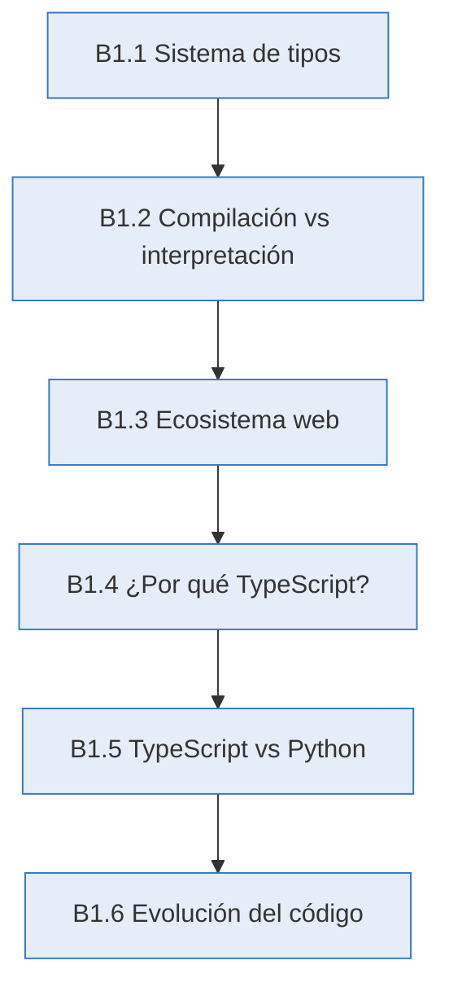
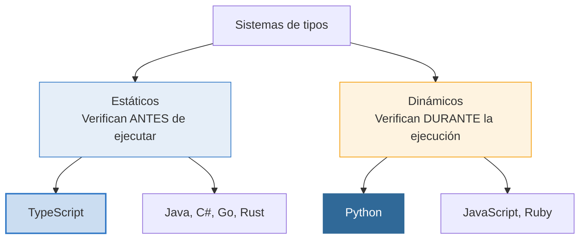
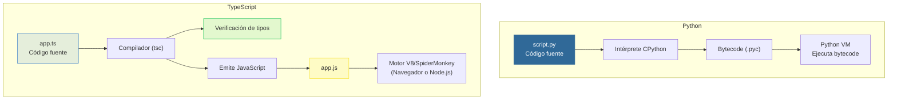
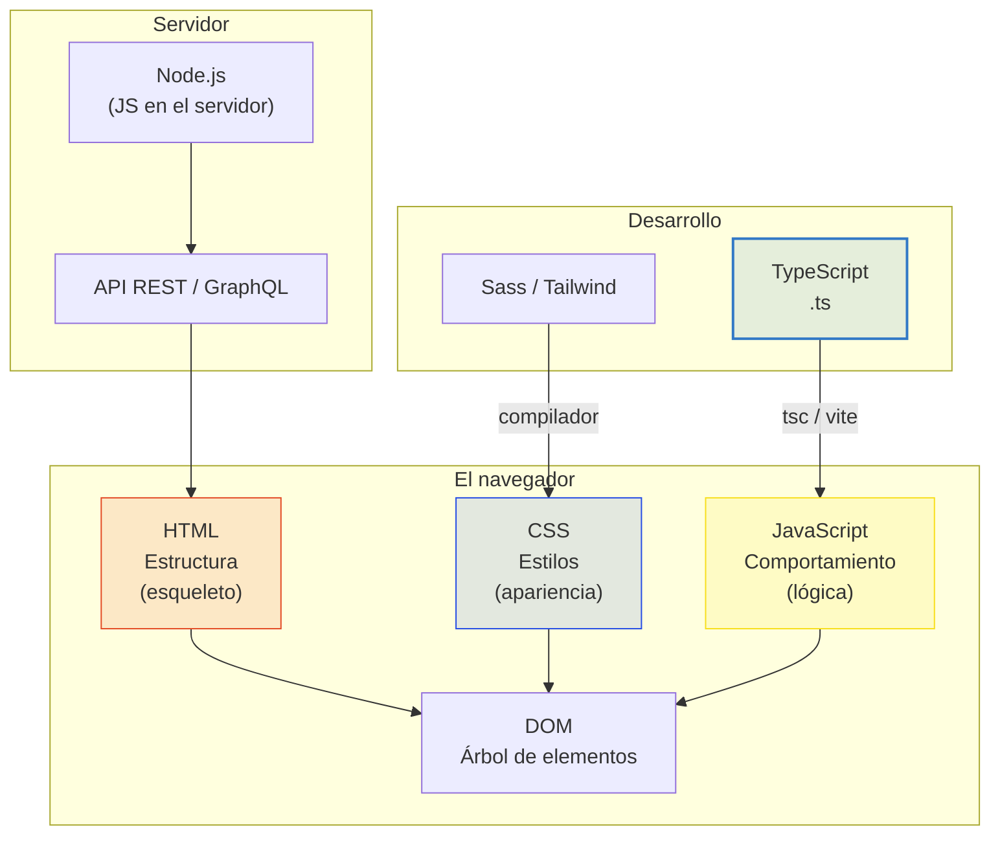
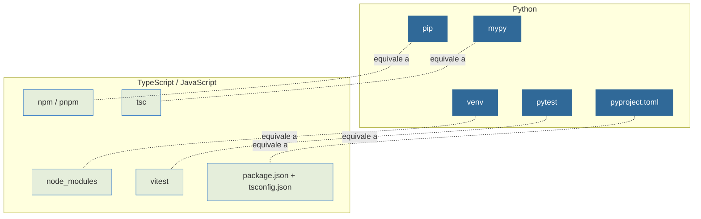

# 🔷 Conceptos fundamentales

<div class="chapter-meta">
  <span class="meta-item">🕐 2-3 horas</span>
  <span class="meta-item">📊 Nivel: Principiante</span>
  <span class="meta-item">🎯 Semana 0</span>
</div>

<div class="chapter-objective">
  <span class="objective-icon">📌</span>
  <span class="objective-text">Al terminar este capítulo, entenderás qué es un sistema de tipos, la diferencia entre compilación e interpretación, y por qué TypeScript existe como puente entre la flexibilidad de Python y la seguridad de tipos estáticos.</span>
</div>

<div class="chapter-map">



</div>

!!! quote "Contexto"
    Antes de escribir una sola línea de TypeScript, necesitas entender **por qué existe**. Si vienes de Python, ya conoces la libertad de un lenguaje dinámico — y también el dolor de un `AttributeError` en producción a las 3 de la madrugada. Este capítulo te da el mapa mental: qué es un sistema de tipos, cómo funciona la compilación, dónde encaja TypeScript en el ecosistema web, y por qué millones de desarrolladores lo eligieron.

---

## B1.1 ¿Qué es un sistema de tipos?

<div class="concept-question">
<h4>🔍 Pregunta conceptual</h4>
<p>Cuando escribes <code>x = 5</code> en Python y luego <code>x = "hola"</code>, Python no se queja. ¿Es eso bueno o malo? ¿Qué pasaría si un compañero de equipo cambiara el tipo de una variable sin avisarte?</p>
</div>

Un **sistema de tipos** es un conjunto de reglas que un lenguaje usa para clasificar valores y expresiones en categorías llamadas **tipos**. Su objetivo es prevenir operaciones sin sentido: no puedes sumar un número y una lista, ni llamar a un método que no existe.

Hay dos grandes familias:



### Tipado estático vs dinámico

| Característica | Tipado estático (TypeScript) | Tipado dinámico (Python) |
|----------------|:----------------------------:|:------------------------:|
| Cuándo se verifican los tipos | En compilación (antes de ejecutar) | En runtime (al ejecutar) |
| Necesitas declarar tipos | Sí (o se infieren) | No (opcionales con type hints) |
| Errores de tipo | Se detectan antes del deploy | Se detectan cuando el código falla |
| Flexibilidad | Menor — el compilador es estricto | Mayor — todo vale hasta que falla |
| Seguridad en proyectos grandes | Alta — refactoring con confianza | Depende de disciplina y herramientas |

### Duck typing vs tipado estructural

Python usa **duck typing**: si camina como pato y hace cuac como pato, es un pato. TypeScript usa **tipado estructural**: si un objeto tiene las propiedades que el tipo exige, es compatible — sin importar su nombre de clase.

<div class="comparison" markdown>
<div class="lang-box python" markdown>

#### :snake: En Python

```python
# Duck typing: Python no verifica estructura,
# solo que el método exista al llamarlo
class Pato:
    def hablar(self):
        return "Cuac"

class Persona:
    def hablar(self):
        return "Hola"

def hacer_hablar(cosa):  # Sin tipo declarado
    print(cosa.hablar())  # Funciona si tiene .hablar()

hacer_hablar(Pato())     # "Cuac"
hacer_hablar(Persona())  # "Hola"
hacer_hablar(42)         # 💥 AttributeError en RUNTIME
```

</div>
<div class="lang-box typescript" markdown>

#### 🔷 En TypeScript

```typescript
// Tipado estructural: TS verifica la FORMA
// del objeto en tiempo de compilación
interface Hablante {
  hablar(): string;
}

function hacerHablar(cosa: Hablante): void {
  console.log(cosa.hablar());
}

hacerHablar({ hablar: () => "Cuac" });    // ✅ OK
hacerHablar({ hablar: () => "Hola" });    // ✅ OK
hacerHablar(42);  // ❌ ERROR en COMPILACIÓN
// Argument of type 'number' is not assignable
// to parameter of type 'Hablante'
```

</div>
</div>

!!! info "Dato clave"
    TypeScript y Python comparten la filosofía de fijarse en la **forma** del dato (structural / duck typing), no en su **clase**. La diferencia es **cuándo** lo verifican: Python en runtime, TypeScript en compilación.

<div class="misconception-box" markdown>
<h4>❌ Error común</h4>
<p><strong>Mito:</strong> "TypeScript es un lenguaje completamente diferente a JavaScript"</p>
<p><strong>Realidad:</strong> TypeScript es un superset — todo código JavaScript válido es automáticamente código TypeScript válido. TypeScript no reemplaza JavaScript, lo extiende añadiendo tipos estáticos que desaparecen tras la compilación. Si ya sabes JavaScript, ya sabes el 90% de TypeScript.</p>
</div>

<div class="micro-exercise">
<h4>🧪 Micro-ejercicio (2 min)</h4>
<p>Abre un intérprete de Python y ejecuta: <code>x: int = "hola"</code> seguido de <code>print(x)</code>. ¿Da error? Ahora imagina que TypeScript hiciera lo mismo con <code>let x: number = "hola"</code>. ¿Qué crees que pasaría? (Spoiler: no compila.)</p>
</div>

---

## B1.2 Compilación vs interpretación

<div class="concept-question">
<h4>🔍 Pregunta conceptual</h4>
<p>Cuando ejecutas <code>python script.py</code>, ¿tu código se "traduce" de alguna forma antes de ejecutarse? ¿Qué significa que un lenguaje sea "compilado"?</p>
</div>

Hay una diferencia fundamental entre cómo Python y TypeScript llegan a ejecutar tu código:



### Conceptos clave

| Concepto | Qué significa | Ejemplo |
|----------|---------------|---------|
| **Interpretación** | El código se lee y ejecuta línea por línea | Python, JavaScript en V8 |
| **Compilación AOT** | Se traduce TODO el código antes de ejecutar | C, Rust, Go |
| **Transpilación** | Se traduce de un lenguaje a otro del mismo nivel | TypeScript → JavaScript |
| **JIT (Just-In-Time)** | Se compila durante la ejecución para optimizar | V8 (JS), PyPy (Python) |

TypeScript hace **transpilación**: convierte `.ts` a `.js` eliminando las anotaciones de tipo. El JavaScript resultante es lo que realmente se ejecuta. Los tipos **no existen en runtime** — son una herramienta de desarrollo que desaparece tras la compilación.

```bash
# El flujo completo de TypeScript
echo 'let x: number = 5;' > demo.ts   # 1. Escribes TypeScript
npx tsc demo.ts                         # 2. Compilas con tsc
cat demo.js                             # 3. Resultado: "let x = 5;"
#                                       #    ¡Los tipos desaparecieron!
node demo.js                             # 4. Node.js ejecuta el JavaScript
```

<div class="pro-tip">
<h4>💡 Consejo Pro</h4>
<p>Que los tipos desaparezcan tras compilar es una <strong>ventaja</strong>, no un defecto. Significa cero overhead en runtime: el JavaScript que genera TypeScript es tan rápido como JavaScript escrito a mano. Los tipos son un andamio de construcción que se retira cuando el edificio está terminado.</p>
</div>

---

## B1.3 El ecosistema web

Para entender dónde encaja TypeScript, necesitas ver el panorama completo del desarrollo web:



### ¿Qué es el DOM?

El **DOM** (Document Object Model) es la representación en memoria de una página web. Cuando el navegador carga HTML, construye un **árbol de objetos** que JavaScript puede manipular:

```html
<!-- HTML que escribes -->
<body>
  <h1 id="titulo">Mi app</h1>
  <button onclick="saludar()">Click</button>
</body>
```

```javascript
// JavaScript que manipula el DOM
const titulo = document.getElementById("titulo");
titulo.textContent = "¡Hola!";  // Cambia el texto visible
```

### ¿Dónde encaja TypeScript?

TypeScript **no se ejecuta directamente** ni en el navegador ni en Node.js. Siempre se transpila a JavaScript primero:

| Entorno | Ejecuta JavaScript | Usa TypeScript |
|---------|:------------------:|:--------------:|
| Chrome, Firefox, Safari | Directamente | Tras compilar a JS |
| Node.js (servidor) | Directamente | Tras compilar a JS (o via `tsx`) |
| Deno, Bun | Directamente | Soporte nativo |

!!! tip "Analogía para pythonistas"
    Piensa en TypeScript como **Cython** para JavaScript: escribes en un lenguaje extendido, se compila al lenguaje base (JS), y eso es lo que se ejecuta. La diferencia es que TypeScript no añade rendimiento — añade **seguridad de tipos**.

---

## B1.4 ¿Por qué TypeScript?

<div class="concept-question">
<h4>🔍 Pregunta conceptual</h4>
<p>JavaScript se creó en 10 días en 1995 para validar formularios. Hoy se usa para construir aplicaciones con millones de líneas de código. ¿Qué problemas crees que surgen al escalar un lenguaje dinámico a esa magnitud?</p>
</div>

### Historia rápida

- **1995** — Brendan Eich crea JavaScript en 10 días en Netscape
- **2009** — Node.js permite ejecutar JS en el servidor
- **2012** — Anders Hejlsberg (creador de C#) lanza **TypeScript** en Microsoft
- **2015** — Angular 2 adopta TypeScript como lenguaje oficial
- **2020** — Vue 3 se reescribe completamente en TypeScript
- **2023** — TypeScript supera a Java en satisfacción de desarrolladores (Stack Overflow Survey)
- **2024** — Svelte 5, Nuxt 3, Next.js, Astro — todo el ecosistema frontend es TypeScript-first

### ¿Qué problemas resuelve?

JavaScript tiene problemas estructurales que TypeScript corrige:

```javascript
// JavaScript: esto es "válido" y peligroso
function calcularTotal(items) {
  let total = 0;
  for (const item of items) {
    total += item.precio;  // ¿Y si item no tiene .precio?
  }
  return total;
}

// Estos errores NO se detectan hasta runtime:
calcularTotal(null);                    // 💥 TypeError
calcularTotal([{ price: 10 }]);         // NaN silencioso (precio vs price)
calcularTotal("no soy un array");       // 💥 TypeError
```

```typescript
// TypeScript: todos esos errores se detectan en compilación
interface Item {
  precio: number;
}

function calcularTotal(items: Item[]): number {
  let total = 0;
  for (const item of items) {
    total += item.precio;  // ✅ TS garantiza que .precio existe y es number
  }
  return total;
}

calcularTotal(null);                    // ❌ Error de compilación
calcularTotal([{ price: 10 }]);         // ❌ Error: 'price' no existe en Item
calcularTotal("no soy un array");       // ❌ Error de compilación
```

### Beneficios concretos

- **:zap: Autocompletado inteligente** — tu editor sabe exactamente qué propiedades tiene cada objeto
- **:shield: Errores en compilación** — encuentra bugs antes de que lleguen a producción
- **:book: Documentación viva** — los tipos están siempre actualizados (a diferencia de los comentarios)
- **:arrows_counterclockwise: Refactoring seguro** — renombra una propiedad y el compilador te dice todos los archivos afectados
- **:rocket: Escalabilidad** — imprescindible en proyectos con equipos grandes

<div class="misconception-box">
<h4>⚠️ Errores comunes</h4>
<ul>
<li><span class="wrong">❌ Mito:</span> "TypeScript es un lenguaje completamente diferente a JavaScript" → <span class="right">✅ Realidad:</span> TypeScript es un <strong>superset</strong> de JavaScript. Todo código JS válido es automáticamente código TS válido. Solo añade tipos encima.</li>
<li><span class="wrong">❌ Mito:</span> "Los tipos hacen que el código sea más lento en runtime" → <span class="right">✅ Realidad:</span> Los tipos se <strong>eliminan</strong> al compilar. El JavaScript resultante es idéntico en rendimiento al escrito a mano. Cero overhead.</li>
<li><span class="wrong">❌ Mito:</span> "TypeScript reemplaza a JavaScript" → <span class="right">✅ Realidad:</span> TypeScript <strong>transpila</strong> a JavaScript. Los navegadores y Node.js solo ejecutan JS. TypeScript es una herramienta de desarrollo, no un runtime.</li>
</ul>
</div>

---

## B1.5 TypeScript vs Python: modelo mental

Esta sección te da un mapa de equivalencias para que traduzcas conceptos que ya dominas en Python al mundo TypeScript.

### Filosofía de diseño

| Aspecto | Python | TypeScript |
|---------|--------|------------|
| Lema | "Explícito es mejor que implícito" | "JavaScript que escala" |
| Tipado | Dinámico (hints opcionales) | Estático (verificado en compilación) |
| Ejecución | Intérprete CPython | Transpila a JS → motor V8 |
| Paradigma | Multi-paradigma (OOP + funcional) | Multi-paradigma (OOP + funcional) |
| Gestión de paquetes | pip + pyproject.toml | npm + package.json |
| Entorno virtual | venv / conda | node_modules (por proyecto) |
| Linter de tipos | mypy (opcional) | tsc (integrado, obligatorio con strict) |

### Equivalencias de código

<div class="comparison" markdown>
<div class="lang-box python" markdown>

#### :snake: En Python

```python
# Variables con type hints (opcionales)
nombre: str = "Daniele"
edad: int = 22
activo: bool = True

# Función tipada
def saludar(nombre: str, edad: int) -> str:
    return f"Hola {nombre}, tienes {edad} años"

# Python NO impone los tipos:
edad = "veintidós"  # ⚠️ mypy se queja, Python NO
```

</div>
<div class="lang-box typescript" markdown>

#### 🔷 En TypeScript

```typescript
// Variables con tipos (verificados)
let nombre: string = "Daniele";
let edad: number = 22;
let activo: boolean = true;

// Función tipada
function saludar(nombre: string, edad: number): string {
  return `Hola ${nombre}, tienes ${edad} años`;
}

// TypeScript SÍ impone los tipos:
edad = "veintidós"; // ❌ NO COMPILA
// Type 'string' is not assignable to type 'number'
```

</div>
</div>

### Mapa de herramientas



<div class="micro-exercise">
<h4>🧪 Micro-ejercicio (2 min)</h4>
<p>En Python, abre un archivo y escribe <code>x: int = "hola"</code>, luego ejecuta <code>mypy archivo.py</code> y después <code>python archivo.py</code>. Observa que mypy da error pero Python ejecuta sin problemas. En TypeScript, esa desconexión no existe: si <code>tsc</code> da error, el código no compila.</p>
</div>

---

## B1.6 Evolución: de código sin tipos a TypeScript

<div class="code-evolution" markdown>
<div class="evolution-header">📈 Evolución del código</div>
<div class="evolution-step">
<span class="step-label novato">v1 — Sin tipos</span>

```javascript
// JavaScript puro: ¿qué tipo tiene cada parámetro?
function crearUsuario(nombre, email, edad) {
  return {
    id: Math.random().toString(36).slice(2),
    nombre: nombre,
    email: email,
    edad: edad,
    activo: true
  };
}

// Todo "funciona"... hasta que falla en producción
crearUsuario("Ana", 25, "ana@mail.com"); // 🐛 email y edad invertidos
```

</div>
<div class="evolution-step">
<span class="step-label mejorado">v2 — Con type hints</span>

```python
# Python con type hints: mypy puede detectar errores
# pero Python los ignora al ejecutar
def crear_usuario(nombre: str, email: str, edad: int) -> dict:
    return {
        "id": str(uuid4()),
        "nombre": nombre,
        "email": email,
        "edad": edad,
        "activo": True
    }

# mypy detecta el error, pero Python lo ejecuta igual
crear_usuario("Ana", 25, "ana@mail.com")  # mypy: ❌, Python: ✅
```

</div>
<div class="evolution-step">
<span class="step-label profesional">v3 — TypeScript</span>

```typescript
// TypeScript: el compilador IMPIDE el error
interface Usuario {
  readonly id: string;
  nombre: string;
  email: string;
  edad: number;
  activo: boolean;
}

function crearUsuario(
  nombre: string,
  email: string,
  edad: number
): Usuario {
  return {
    id: Math.random().toString(36).slice(2),
    nombre,
    email,
    edad,
    activo: true,
  };
}

// ❌ NO COMPILA: edad (number) y email (string) invertidos
crearUsuario("Ana", 25, "ana@mail.com");
// Argument of type 'number' is not assignable
// to parameter of type 'string'
```

</div>
</div>

<div class="pro-tip">
<h4>💡 Consejo Pro</h4>
<p>La evolución v1 → v2 → v3 refleja lo que vive la industria. Los proyectos JavaScript grandes migran a TypeScript gradualmente porque el coste de los bugs en producción supera con creces el coste de añadir tipos. Si ya usas <code>mypy</code> en Python, la transición mental a TypeScript es natural: misma idea, pero el compilador la impone en vez de sugerirla.</p>
</div>

---

<div class="connection-box">
<span class="connection-icon">🔗</span>
<span>En el siguiente capítulo de bases (<strong>bases-2: JavaScript esencial</strong>) aprenderás la sintaxis fundamental de JavaScript que necesitas dominar antes de añadir tipos. Variables, funciones, arrays, objetos — todo lo que TypeScript extiende.</span>
</div>

<div class="connection-box">
<span class="connection-icon">🔗</span>
<span>En el <a href="../01-bienvenido/">Capítulo 1: Bienvenido a TypeScript</a> pondrás todo esto en práctica: instalarás TypeScript, configurarás <code>tsconfig.json</code> con <code>strict: true</code>, y ejecutarás tu primer programa. Los conceptos de este capítulo son los cimientos sobre los que se construye todo lo demás.</span>
</div>

<div class="ejercicio-guiado">
<h4>🏋️ Ejercicio guiado</h4>

Compara en la práctica cómo se comportan los sistemas de tipos de Python (dinámico) y TypeScript (estático) ante los mismos errores, para entender por qué los tipos estáticos previenen bugs antes de ejecutar:

1. Abre la consola de Python y crea una función `calcular_total(precio, cantidad)` que devuelva `precio * cantidad` — llámala con `calcular_total("12", 3)` y observa que Python devuelve `"121212"` sin avisar del error lógico
2. Ahora escribe el equivalente en TypeScript: `function calcularTotal(precio: number, cantidad: number): number` — intenta llamarla con `calcularTotal("12", 3)` y observa que el compilador rechaza la llamada antes de ejecutar
3. En Python, crea un diccionario `plato = {"nombre": "Paella", "precio": 16}` y accede a `plato["calorias"]` — observa que obtienes un `KeyError` en tiempo de ejecución
4. En TypeScript, define una interfaz `Plato` con campos `nombre: string` y `precio: number`, crea un objeto, e intenta acceder a `.calorias` — el editor te marca el error inmediatamente
5. Reflexiona: en Python los bugs se descubren al ejecutar (o peor, en producción); en TypeScript se descubren al escribir. Escribe un comentario en tu archivo resumiendo esta diferencia clave

??? success "Solución completa"
    ```python title="comparacion.py — Lado Python"
    # Python: tipo dinámico — los errores se descubren al EJECUTAR
    def calcular_total(precio, cantidad):
        return precio * cantidad

    print(calcular_total("12", 3))  # "121212" — ¡bug silencioso!
    print(calcular_total(12, 3))    # 36 — correcto

    plato = {"nombre": "Paella", "precio": 16}
    # print(plato["calorias"])  # KeyError en tiempo de ejecución
    ```

    ```typescript title="comparacion.ts — Lado TypeScript"
    // TypeScript: tipo estático — los errores se descubren al ESCRIBIR

    function calcularTotal(precio: number, cantidad: number): number {
      return precio * cantidad;
    }

    // calcularTotal("12", 3);  // ❌ Error de compilación:
    // Argument of type 'string' is not assignable to parameter of type 'number'
    console.log(calcularTotal(12, 3));  // ✅ 36

    interface Plato {
      nombre: string;
      precio: number;
    }

    const plato: Plato = { nombre: "Paella", precio: 16 };
    // console.log(plato.calorias);  // ❌ Error de compilación:
    // Property 'calorias' does not exist on type 'Plato'
    console.log(plato.nombre);  // ✅ "Paella"

    // CONCLUSIÓN:
    // En Python, puedes tener bugs silenciosos que solo se descubren
    // al ejecutar (o en producción con datos reales).
    // En TypeScript, el compilador te avisa ANTES de ejecutar.
    // Eso es la diferencia entre un sistema de tipos dinámico y uno estático.
    ```

</div>

<div class="real-errors">
<h4>🚨 Errores que vas a encontrar</h4>

**Error 1: Asignar un tipo incorrecto a una variable**

```typescript
let edad: number = "veinticinco";
```

```
Type 'string' is not assignable to type 'number'. (2322)
```

**¿Por qué?** Declaraste `edad` como `number` pero le asignaste un `string`. TypeScript detecta la incompatibilidad en tiempo de compilación, a diferencia de Python donde `edad: int = "veinticinco"` ejecuta sin problemas.

**Solución:**

```typescript
let edad: number = 25;
// O si realmente necesitas texto:
let edadTexto: string = "veinticinco";
```

---

**Error 2: Pasar argumentos en orden incorrecto a una función**

```typescript
function crearPerfil(nombre: string, edad: number): void {
  console.log(`${nombre} tiene ${edad} años`);
}

crearPerfil(30, "Ana");
```

```
Argument of type 'number' is not assignable to parameter of type 'string'. (2345)
```

**¿Por qué?** Invertiste los argumentos: pasaste `30` (number) donde se esperaba `string`, y `"Ana"` (string) donde se esperaba `number`. En JavaScript puro esto no da error, simplemente imprime `"30 tiene Ana años"`, un bug silencioso.

**Solución:**

```typescript
crearPerfil("Ana", 30); // ✅ Argumentos en el orden correcto
```

---

**Error 3: Acceder a una propiedad que no existe en el tipo**

```typescript
interface Producto {
  nombre: string;
  precio: number;
}

const item: Producto = { nombre: "Laptop", precio: 999 };
console.log(item.descuento);
```

```
Property 'descuento' does not exist on type 'Producto'. (2339)
```

**¿Por qué?** La interface `Producto` solo define `nombre` y `precio`. Al intentar acceder a `descuento`, TypeScript te avisa que esa propiedad no existe. Esto previene los clásicos errores de `undefined` que en JavaScript pasan desapercibidos hasta runtime.

**Solución:**

```typescript
interface Producto {
  nombre: string;
  precio: number;
  descuento?: number; // Propiedad opcional con ?
}

const item: Producto = { nombre: "Laptop", precio: 999 };
console.log(item.descuento); // ✅ Ahora es válido (valor: undefined)
```

---

**Error 4: No reconocer que tsc no genera el archivo .js si hay errores**

```typescript
// archivo: app.ts
let mensaje: string = 42;
console.log(mensaje);
```

```bash
$ npx tsc app.ts
app.ts:1:5 - error TS2322: Type 'number' is not assignable to type 'string'.
```

**¿Por qué?** Si ejecutas `tsc` y hay errores de tipos, por defecto el compilador igualmente emite el JavaScript (pero con advertencias). Muchos principiantes no leen la salida de `tsc` y creen que todo va bien. Con la opción `noEmitOnError: true` en `tsconfig.json`, el compilador no genera el `.js` si hay errores, forzándote a corregirlos.

**Solución:**

```typescript
// Corregir el tipo:
let mensaje: string = "hola mundo";
console.log(mensaje);

// Y en tsconfig.json, activar:
// "noEmitOnError": true
```

---

**Error 5: Confundir `number` con `Number` (tipo primitivo vs objeto wrapper)**

```typescript
let precio: Number = 100;
let total: number = precio;
```

```
Type 'Number' is not assignable to type 'number'.
  'number' is a primitive, but 'Number' is a wrapper object.
  Prefer using 'number' when possible. (2322)
```

**¿Por qué?** En TypeScript, `number` (minúscula) es el tipo primitivo y `Number` (mayúscula) es el objeto wrapper de JavaScript. Son tipos diferentes. Esto es similar a la confusión en Python entre `int` y el rara vez usado `numbers.Number`. Siempre usa los tipos en minúscula en TypeScript.

**Solución:**

```typescript
let precio: number = 100;  // ✅ Tipo primitivo, siempre en minúscula
let total: number = precio; // ✅ Compatible
```

</div>

<div class="checkpoint">
<h4>🏁 Checkpoint</h4>
<p>Si puedes: (1) explicar la diferencia entre tipado estático y dinámico con un ejemplo, (2) describir qué pasa cuando TypeScript compila (transpila a JS, los tipos desaparecen), y (3) justificar por qué TypeScript existe aunque JavaScript ya funciona — estás listo para el siguiente capítulo.</p>
</div>

<div class="mini-project">
<h4>🏗️ Mini-proyecto: Validador conceptual de tipos</h4>

En este mini-proyecto vas a crear un pequeño sistema que modela los conceptos de este capítulo: definir interfaces, usar tipos correctamente, y experimentar con la transpilación. No necesitas tener TypeScript instalado todavía (eso viene en el Capítulo 1), pero puedes usar el [TypeScript Playground](https://www.typescriptlang.org/play) para probarlo.

**Paso 1 — Define las interfaces base**

Crea las interfaces que representan los conceptos de sistemas de tipos vistos en el capítulo. Necesitas modelar un `Lenguaje` con sus características de tipado y un `Comparación` que contraste dos lenguajes.

```typescript
// Define una interface "Lenguaje" con las propiedades:
// - nombre (string)
// - anioCreación (number)
// - tipado: "estático" o "dinámico"
// - compilado (boolean)
// - descripción (string)

// Define una interface "Comparación" con:
// - lenguajeA (Lenguaje)
// - lenguajeB (Lenguaje)
// - ventajaA (string)
// - ventajaB (string)
```

??? success "Solución Paso 1"
    ```typescript
    interface Lenguaje {
      nombre: string;
      anioCreación: number;
      tipado: "estático" | "dinámico";
      compilado: boolean;
      descripción: string;
    }

    interface Comparación {
      lenguajeA: Lenguaje;
      lenguajeB: Lenguaje;
      ventajaA: string;
      ventajaB: string;
    }
    ```

    Fíjate que `tipado` usa un **union type** (`"estático" | "dinámico"`) en vez de un simple `string`. Esto limita los valores posibles, algo que verás en profundidad más adelante.

**Paso 2 — Crea datos que usen las interfaces**

Ahora crea objetos concretos para TypeScript, Python y JavaScript usando la interface `Lenguaje`, y una comparación entre TypeScript y Python.

```typescript
// Crea tres constantes de tipo Lenguaje:
// - typescript (estático, compilado, 2012)
// - python (dinámico, no compilado, 1991)
// - javascript (dinámico, no compilado, 1995)

// Crea una constante de tipo Comparación
// que compare TypeScript con Python
```

??? success "Solución Paso 2"
    ```typescript
    const typescript: Lenguaje = {
      nombre: "TypeScript",
      anioCreación: 2012,
      tipado: "estático",
      compilado: true,
      descripción: "Superset de JavaScript con tipos estáticos"
    };

    const python: Lenguaje = {
      nombre: "Python",
      anioCreación: 1991,
      tipado: "dinámico",
      compilado: false,
      descripción: "Lenguaje dinámico multiparadigma"
    };

    const javascript: Lenguaje = {
      nombre: "JavaScript",
      anioCreación: 1995,
      tipado: "dinámico",
      compilado: false,
      descripción: "El lenguaje de la web"
    };

    const tsVsPython: Comparación = {
      lenguajeA: typescript,
      lenguajeB: python,
      ventajaA: "Errores detectados en compilación antes de ejecutar",
      ventajaB: "Mayor flexibilidad y prototipado rápido sin compilación"
    };
    ```

**Paso 3 — Escribe funciones con tipos seguros**

Crea funciones que operen sobre estos datos y demuestren la seguridad de tipos. Una función debe determinar si un lenguaje detecta errores antes de ejecutar, y otra debe generar un resumen de comparación.

```typescript
// Función "detectaErroresAntes" que recibe un Lenguaje
// y retorna boolean (true si es estático Y compilado)

// Función "generarResumen" que recibe una Comparación
// y retorna un string con el formato:
// "[NombreA] vs [NombreB]: ..."

// Prueba ambas funciones con los datos del paso anterior
// e intenta pasar datos inválidos para ver los errores
```

??? success "Solución Paso 3"
    ```typescript
    function detectaErroresAntes(lang: Lenguaje): boolean {
      return lang.tipado === "estático" && lang.compilado;
    }

    function generarResumen(comp: Comparación): string {
      const a = comp.lenguajeA;
      const b = comp.lenguajeB;
      return `${a.nombre} (${a.anioCreación}) vs ${b.nombre} (${b.anioCreación}):
  - ${a.nombre}: ${comp.ventajaA}
  - ${b.nombre}: ${comp.ventajaB}`;
    }

    // Uso correcto:
    console.log(detectaErroresAntes(typescript)); // true
    console.log(detectaErroresAntes(python));     // false
    console.log(generarResumen(tsVsPython));

    // Intento incorrecto — esto NO compila:
    // detectaErroresAntes("TypeScript");
    // Error: Argument of type 'string' is not assignable
    //        to parameter of type 'Lenguaje'

    // generarResumen({ lenguajeA: "TS", lenguajeB: "PY" });
    // Error: Type 'string' is not assignable to type 'Lenguaje'
    ```

**Paso 4 — Predice la transpilación**

Sin ejecutar `tsc`, escribe a mano el JavaScript que generaría el compilador a partir de tu código TypeScript completo. Luego verifica en el [TypeScript Playground](https://www.typescriptlang.org/play) si acertaste.

```typescript
// Toma todo el código de los pasos 1-3 y escribe
// cómo se vería el JavaScript resultante.
//
// Pistas:
// - Las interfaces desaparecen completamente
// - Las anotaciones de tipo se eliminan
// - La lógica y estructura se mantienen idénticas
```

??? success "Solución Paso 4"
    ```javascript
    // Las interfaces Lenguaje y Comparación DESAPARECEN
    // completamente. No generan ningún código JavaScript.

    const typescript = {
      nombre: "TypeScript",
      anioCreación: 2012,
      tipado: "estático",
      compilado: true,
      descripción: "Superset de JavaScript con tipos estáticos"
    };

    const python = {
      nombre: "Python",
      anioCreación: 1991,
      tipado: "dinámico",
      compilado: false,
      descripción: "Lenguaje dinámico multiparadigma"
    };

    const javascript = {
      nombre: "JavaScript",
      anioCreación: 1995,
      tipado: "dinámico",
      compilado: false,
      descripción: "El lenguaje de la web"
    };

    const tsVsPython = {
      lenguajeA: typescript,
      lenguajeB: python,
      ventajaA: "Errores detectados en compilación antes de ejecutar",
      ventajaB: "Mayor flexibilidad y prototipado rápido sin compilación"
    };

    function detectaErroresAntes(lang) {
      return lang.tipado === "estático" && lang.compilado;
    }

    function generarResumen(comp) {
      const a = comp.lenguajeA;
      const b = comp.lenguajeB;
      return `${a.nombre} (${a.anioCreación}) vs ${b.nombre} (${b.anioCreación}):
  - ${a.nombre}: ${comp.ventajaA}
  - ${b.nombre}: ${comp.ventajaB}`;
    }

    console.log(detectaErroresAntes(typescript));
    console.log(detectaErroresAntes(python));
    console.log(generarResumen(tsVsPython));
    ```

    Observa: las interfaces desaparecieron, las anotaciones de tipo (`: Lenguaje`, `: boolean`, `: string`) se eliminaron, pero toda la lógica es idéntica. Esto confirma el concepto central del capítulo: los tipos son una herramienta de desarrollo que no existe en runtime.

</div>

---

## :link: Recursos

| Recurso | Enlace |
|---------|--------|
| TypeScript oficial — ¿Por qué TypeScript? | [typescriptlang.org/why-create-typescript](https://www.typescriptlang.org/why-create-typescript) |
| MDN — Introducción al DOM | [developer.mozilla.org/es/docs/Web/API/Document_Object_Model](https://developer.mozilla.org/es/docs/Web/API/Document_Object_Model/Introduction) |
| Python Type Hints (PEP 484) | [peps.python.org/pep-0484](https://peps.python.org/pep-0484/) |
| TypeScript Playground | [typescriptlang.org/play](https://www.typescriptlang.org/play) |

---

## :brain: Flashcards de repaso

<div class="flashcard">
<div class="front">¿Qué es un sistema de tipos?</div>
<div class="back">Un conjunto de reglas que clasifica valores en categorías (tipos) para prevenir operaciones inválidas, como sumar un número y una lista.</div>
</div>

<div class="flashcard">
<div class="front">¿Cuál es la diferencia entre tipado estático y dinámico?</div>
<div class="back">Estático: los tipos se verifican antes de ejecutar (compilación). Dinámico: los tipos se verifican durante la ejecución (runtime). TypeScript es estático, Python es dinámico.</div>
</div>

<div class="flashcard">
<div class="front">¿Qué es la transpilación?</div>
<div class="back">Convertir código de un lenguaje a otro del mismo nivel de abstracción. TypeScript transpila a JavaScript: elimina los tipos y genera JS estándar que navegadores y Node.js pueden ejecutar.</div>
</div>

<div class="flashcard">
<div class="front">¿Los tipos de TypeScript existen en runtime?</div>
<div class="back">No. Los tipos se eliminan completamente al compilar. El JavaScript resultante no contiene ninguna anotación de tipo. Cero overhead en rendimiento.</div>
</div>

<div class="flashcard">
<div class="front">¿Qué comparten Python (duck typing) y TypeScript (structural typing)?</div>
<div class="back">Ambos se fijan en la forma (estructura) del dato, no en el nombre de la clase. La diferencia es cuándo lo verifican: Python en runtime, TypeScript en compilación.</div>
</div>

<div class="flashcard">
<div class="front">¿Qué es el DOM?</div>
<div class="back">Document Object Model: la representación en memoria (árbol de objetos) de una página HTML. JavaScript lo manipula para hacer páginas interactivas.</div>
</div>

<div class="flashcard">
<div class="front">¿Quién creó TypeScript y cuándo?</div>
<div class="back">Anders Hejlsberg (también creador de C#) en Microsoft, lanzado en 2012. Su objetivo: hacer JavaScript escalable con tipos estáticos.</div>
</div>

---

## :video_game: Quiz interactivo

<div class="quiz" data-quiz-id="bases1-q1">
<h4>¿Cuál es la principal diferencia entre el tipado de Python y el de TypeScript?</h4>
<button class="quiz-option" data-correct="false">Python no tiene tipos y TypeScript sí</button>
<button class="quiz-option" data-correct="true">Python verifica tipos en runtime (dinámico), TypeScript en compilación (estático)</button>
<button class="quiz-option" data-correct="false">TypeScript es más lento porque tiene tipos</button>
<div class="quiz-feedback" data-correct="¡Correcto! Python es dinámico (verifica en runtime), TypeScript es estático (verifica en compilación). Ambos tienen tipos, pero los verifican en momentos diferentes." data-incorrect="Incorrecto. Tanto Python como TypeScript tienen tipos. La diferencia clave es cuándo se verifican: Python en runtime (dinámico), TypeScript en compilación (estático)."></div>
</div>

<div class="quiz" data-quiz-id="bases1-q2">
<h4>¿Qué pasa con los tipos de TypeScript cuando compilas a JavaScript?</h4>
<button class="quiz-option" data-correct="true">Se eliminan completamente — el JS resultante no tiene tipos</button>
<button class="quiz-option" data-correct="false">Se convierten en validaciones de runtime</button>
<button class="quiz-option" data-correct="false">Se mantienen como comentarios en el código JS</button>
<div class="quiz-feedback" data-correct="¡Correcto! Los tipos de TypeScript se borran completamente durante la compilación. El JavaScript resultante es idéntico a haberlo escrito a mano, sin ningún overhead." data-incorrect="Incorrecto. Los tipos se eliminan por completo al compilar. El JS final no contiene ninguna traza de las anotaciones de tipo — cero overhead en runtime."></div>
</div>

<div class="quiz" data-quiz-id="bases1-q3">
<h4>¿Qué significa que TypeScript sea un 'superset' de JavaScript?</h4>
<button class="quiz-option" data-correct="false">TypeScript reemplaza completamente a JavaScript</button>
<button class="quiz-option" data-correct="false">TypeScript es más rápido que JavaScript</button>
<button class="quiz-option" data-correct="true">Todo código JavaScript válido es automáticamente código TypeScript válido</button>
<div class="quiz-feedback" data-correct="¡Correcto! TypeScript extiende JavaScript — cualquier archivo .js válido es también un .ts válido. TypeScript añade tipos sobre la base de JS, no lo reemplaza." data-incorrect="Incorrecto. 'Superset' significa que TypeScript contiene todo JavaScript más funcionalidades adicionales (tipos). Todo .js válido es automáticamente .ts válido."></div>
</div>

---

## 🎯 Ejercicios

??? question "Ejercicio 1: Clasifica los lenguajes <span class='bloom-badge remember'>Recordar</span>"
    Clasifica los siguientes lenguajes en **estáticos** o **dinámicos**: Python, TypeScript, Java, Ruby, Go, JavaScript, C#, PHP.

    ??? success "Solución"
        | Estáticos | Dinámicos |
        |-----------|-----------|
        | TypeScript | Python |
        | Java | Ruby |
        | Go | JavaScript |
        | C# | PHP |

        Nota: Python con `mypy` añade verificación estática opcional, pero el intérprete sigue siendo dinámico.

??? question "Ejercicio 2: Traza la compilación <span class='bloom-badge understand'>Comprender</span>"
    Dado el siguiente código TypeScript, escribe **exactamente** qué JavaScript generaría `tsc`:

    ```typescript
    let nombre: string = "Ana";
    let edad: number = 30;

    function saludar(persona: string, anos: number): string {
      return `Hola ${persona}, tienes ${anos} años`;
    }

    const resultado: string = saludar(nombre, edad);
    ```

    ??? success "Solución"
        ```javascript
        let nombre = "Ana";
        let edad = 30;

        function saludar(persona, anos) {
          return `Hola ${persona}, tienes ${anos} años`;
        }

        const resultado = saludar(nombre, edad);
        ```

        Los tipos (`: string`, `: number`) desaparecen completamente. La lógica y la estructura del código son idénticas. Esto demuestra que TypeScript es JavaScript + tipos, nada más.

??? question "Ejercicio 3: Argumenta la elección <span class='bloom-badge evaluate'>Evaluar</span>"
    Tu equipo tiene un proyecto Python de 50,000 líneas con type hints parciales y `mypy` configurado. El frontend es JavaScript puro (sin tipos). ¿Recomendarías migrar el frontend a TypeScript? Argumenta con al menos 3 razones a favor y 1 posible contra.

    ??? success "Solución"
        **A favor:**

        1. **Consistencia con la filosofía del equipo** — Si ya usan `mypy` en Python, valoran la seguridad de tipos. TypeScript extiende esa filosofía al frontend con verificación obligatoria (no opcional como mypy).
        2. **Refactoring seguro** — En un proyecto grande, renombrar una propiedad de API afecta frontend y backend. TypeScript detecta todos los usos rotos en compilación.
        3. **Autocompletado y documentación** — Los tipos sirven como documentación siempre actualizada. Nuevos miembros del equipo entienden las interfaces sin leer documentación externa.

        **En contra:**

        1. **Coste de migración** — Migrar 50k+ líneas de JS a TS requiere tiempo. Estrategia recomendada: activar `allowJs: true` y migrar archivo por archivo, empezando por los más críticos.

---

<div class="self-check" markdown>
<h4>¿Has comprendido todo? Marca lo que puedes hacer:</h4>
<label><input type="checkbox"> Puedo explicar qué es un programa y cómo se ejecuta en un ordenador</label>
<label><input type="checkbox"> Distingo los paradigmas imperativo, declarativo, funcional y orientado a objetos</label>
<label><input type="checkbox"> Sé la diferencia entre un lenguaje compilado y uno interpretado</label>
<label><input type="checkbox"> Entiendo la diferencia entre tipado fuerte y tipado débil</label>
<label><input type="checkbox"> Puedo explicar la diferencia entre tipado estático y tipado dinámico</label>
<label><input type="checkbox"> Sé dónde encaja TypeScript en el espectro de sistemas de tipos</label>
<label><input type="checkbox"> Puedo argumentar por qué TypeScript existe y qué problema resuelve respecto a JavaScript</label>
</div>
