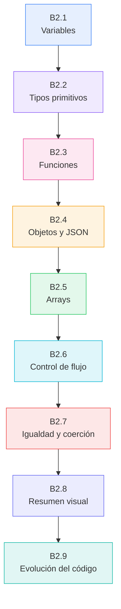
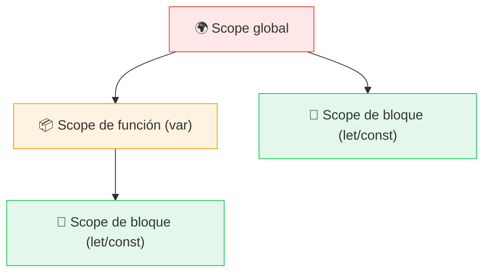
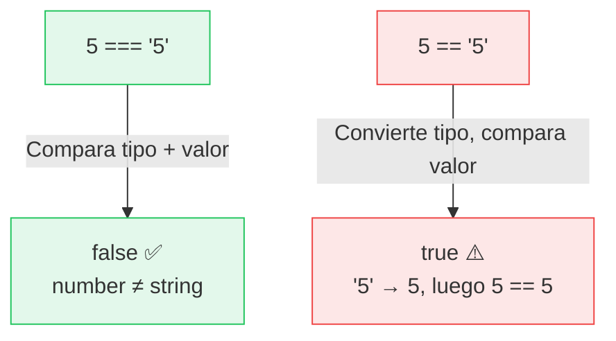
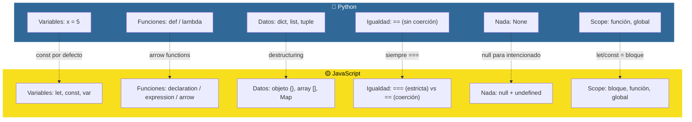

# :yellow_circle: JavaScript esencial para pythonistas

<div class="chapter-meta">
  <span class="meta-item">🕐 3-4 horas</span>
  <span class="meta-item">📊 Nivel: Principiante</span>
  <span class="meta-item">🎯 Semana 0</span>
</div>

<div class="chapter-objective">
  <span class="objective-icon">📌</span>
  <span class="objective-text">Al terminar este capítulo, dominarás la sintaxis esencial de JavaScript que necesitas antes de TypeScript: variables, funciones, objetos, arrays y las diferencias clave con Python.</span>
</div>

<div class="chapter-map">



</div>

!!! quote "Contexto"
    TypeScript es un superset de JavaScript. Eso significa que **todo** lo que aprendas en este capítulo sigue siendo válido en TypeScript. Si vienes de Python, hay diferencias sutiles pero importantes: la igualdad funciona diferente, las funciones tienen tres formas de escribirse, y los objetos no son exactamente diccionarios. Este capítulo es tu mapa de traducción Python → JavaScript.

---

## B2.1 Variables: `let`, `const`, `var`

<div class="concept-question">
<h4>🔍 Pregunta conceptual</h4>
<p>En Python, puedes reasignar cualquier variable en cualquier momento: <code>x = 1</code> y luego <code>x = "hola"</code>. ¿Crees que JavaScript permite lo mismo? ¿Debería existir una forma de declarar variables que no puedan cambiar?</p>
</div>

En Python, declarar una variable es tan simple como `x = 5`. No existe una palabra clave especial. En JavaScript, existen **tres** formas de declarar variables, cada una con reglas de alcance diferentes:

```javascript
// const: no se puede reasignar (preferida)
const nombre = "Daniele";
// nombre = "Otro";  // ❌ TypeError: Assignment to constant variable

// let: se puede reasignar (cuando necesitas mutar)
let contador = 0;
contador = 1;  // ✅ OK

// var: la forma antigua (EVITAR)
var legacy = "no uses esto";
```

### Scope: alcance de las variables



```javascript
// let y const tienen scope de bloque (como Python)
if (true) {
  let dentroBloque = "solo aquí";
  const otraDentro = "también solo aquí";
}
// console.log(dentroBloque);  // ❌ ReferenceError

// var tiene scope de función (gotcha!)
if (true) {
  var escapaDelBloque = "¡sorpresa!";
}
console.log(escapaDelBloque);  // ✅ "¡sorpresa!" — var ignora los bloques
```

### Hoisting: elevación de declaraciones

JavaScript "eleva" las declaraciones de variables al inicio de su scope, pero de forma diferente según la palabra clave:

```javascript
// var se eleva con valor undefined
console.log(x);  // undefined (no da error, pero tampoco tiene valor)
var x = 5;

// let/const se elevan pero NO se inicializan (Temporal Dead Zone)
// console.log(y);  // ❌ ReferenceError: Cannot access 'y' before initialization
let y = 10;
```

<div class="comparison" markdown>
<div class="lang-box python" markdown>

#### :snake: En Python

```python
# Python no tiene hoisting ni palabras clave de declaración
x = 10          # Variable mutable
PI = 3.14159    # "Constante" por convención (MAYÚSCULAS)
# Pero nada impide: PI = 0  ← Python no lo prohíbe

# Scope: función y global (no hay scope de bloque)
if True:
    dentro = "visible fuera del if"
print(dentro)  # ✅ Funciona en Python
```

</div>
<div class="lang-box typescript" markdown>

#### :yellow_circle: En JavaScript

```javascript
// JavaScript usa let/const/var explícitamente
let x = 10;           // Mutable, scope de bloque
const PI = 3.14159;   // Inmutable, scope de bloque
// PI = 0;  ← ❌ TypeError en runtime

// Scope: bloque con let/const
if (true) {
    let dentro = "NO visible fuera del if";
}
// console.log(dentro);  // ❌ ReferenceError
```

</div>
</div>

<div class="misconception-box" markdown>
<h4>❌ Error común</h4>
<p><strong>Mito:</strong> "let y const funcionan igual que las variables en Python"</p>
<p><strong>Realidad:</strong> En JavaScript hay hoisting, temporal dead zone, y let/const tienen scope de bloque (no de función como var). En Python, las variables tienen scope de función o global, y no existe el concepto de hoisting ni de temporal dead zone. Estas diferencias causan bugs sutiles si asumes que JS se comporta como Python.</p>
</div>

!!! warning "Cuidado con `const` y objetos"
    `const` impide la **reasignación**, pero NO la **mutación** del contenido. Un objeto `const` puede cambiar sus propiedades:

    ```javascript
    const persona = { nombre: "Daniele", edad: 22 };
    persona.edad = 23;          // ✅ OK: mutamos una propiedad
    // persona = { otro: "obj" };  // ❌ Error: reasignación
    ```

<div class="pro-tip">
<h4>💡 Consejo Pro</h4>
<p>Usa <code>const</code> por defecto para todo. Solo usa <code>let</code> cuando realmente necesites reasignar (contadores, acumuladores). Nunca uses <code>var</code>. Esta regla sencilla previene el 90% de los bugs de scope en JavaScript.</p>
</div>

---

## B2.2 Tipos primitivos en JavaScript

JavaScript tiene **7 tipos primitivos**. A diferencia de Python, no distingue entre `int` y `float`: todo es `number`.

| JavaScript | Python equivalente | Ejemplo |
|:-----------|:-------------------|:--------|
| `string` | `str` | `"hola"`, `'mundo'`, `` `template` `` |
| `number` | `int` / `float` | `42`, `3.14`, `NaN`, `Infinity` |
| `boolean` | `bool` | `true`, `false` |
| `null` | `None` | `null` |
| `undefined` | *(no existe)* | `undefined` |
| `symbol` | *(no existe)* | `Symbol("id")` |
| `bigint` | `int` (sin limite) | `9007199254740991n` |

```javascript
// Verificar tipos con typeof
typeof "hola"       // "string"
typeof 42           // "number"
typeof true         // "boolean"
typeof undefined    // "undefined"
typeof null         // "object"   ← ¡Bug histórico de JS! Nunca se corrigió
typeof Symbol("x")  // "symbol"
typeof 100n         // "bigint"
```

### `null` vs `undefined`: la confusión que Python no tiene

Python tiene **un solo** valor para "nada": `None`. JavaScript tiene **dos**, y cada uno significa algo diferente:

```javascript
// undefined: "no se ha asignado un valor"
let sinValor;
console.log(sinValor);          // undefined

function noRetorna() {}
console.log(noRetorna());       // undefined

// null: "intencionalmente vacío"
let vacio = null;               // Decidimos que no tiene valor

// Comparación
console.log(undefined == null);  // true  (coerción)
console.log(undefined === null); // false (tipos diferentes)
```

!!! info "Convención moderna"
    En código moderno, usa `null` cuando quieras indicar "sin valor intencionalmente" y deja `undefined` para lo que JS maneja automáticamente (variables sin inicializar, propiedades inexistentes, funciones sin return).

### Template literals (equivalente a f-strings)

```javascript
const nombre = "Daniele";
const edad = 22;

// Template literal con backticks (como f-string de Python)
const saludo = `Hola ${nombre}, tienes ${edad} años`;

// Multilínea (sin necesidad de triple comillas)
const html = `
  <div>
    <h1>${nombre}</h1>
    <p>Edad: ${edad}</p>
  </div>
`;
```

---

## B2.3 Funciones

<div class="concept-question">
<h4>🔍 Pregunta conceptual</h4>
<p>Python tiene <code>def</code> para funciones normales y <code>lambda</code> para funciones anónimas de una línea. ¿Por qué crees que JavaScript necesita tres formas diferentes de definir funciones?</p>
</div>

JavaScript ofrece **tres formas** de definir funciones, cada una con diferencias sutiles:

### Function declaration

```javascript
// Se eleva (hoisting): puedes llamarla antes de declararla
console.log(sumar(2, 3));  // ✅ 5

function sumar(a, b) {
  return a + b;
}
```

### Function expression

```javascript
// NO se eleva: debes declararla antes de usarla
// console.log(restar(5, 3));  // ❌ ReferenceError

const restar = function(a, b) {
  return a - b;
};
```

### Arrow function (ES6+)

```javascript
// Sintaxis corta, ideal para callbacks y funciones simples
const multiplicar = (a, b) => a * b;

// Con cuerpo de bloque (necesita return explícito)
const dividir = (a, b) => {
  if (b === 0) throw new Error("División por cero");
  return a / b;
};

// Un solo parámetro: paréntesis opcionales
const doble = x => x * 2;

// Sin parámetros: paréntesis obligatorios
const saludar = () => "Hola!";
```

<div class="comparison" markdown>
<div class="lang-box python" markdown>

#### :snake: En Python

```python
# Función normal
def sumar(a, b):
    return a + b

# Lambda (limitada a una expresión)
multiplicar = lambda a, b: a * b

# Parámetros por defecto
def saludar(nombre, saludo="Hola"):
    return f"{saludo}, {nombre}"

# *args (argumentos variables)
def sumar_todos(*números):
    return sum(números)
```

</div>
<div class="lang-box typescript" markdown>

#### :yellow_circle: En JavaScript

```javascript
// Función normal
function sumar(a, b) {
  return a + b;
}

// Arrow function (más potente que lambda)
const multiplicar = (a, b) => a * b;

// Parámetros por defecto
function saludar(nombre, saludo = "Hola") {
  return `${saludo}, ${nombre}`;
}

// ...rest (argumentos variables)
function sumarTodos(...números) {
  return números.reduce((sum, n) => sum + n, 0);
}
```

</div>
</div>

### Parámetros por defecto y rest

```javascript
// Parámetros por defecto (como Python)
function crearUsuario(nombre, rol = "viewer", activo = true) {
  return { nombre, rol, activo };
}

crearUsuario("Daniele");                    // { nombre: "Daniele", rol: "viewer", activo: true }
crearUsuario("Admin", "admin");             // { nombre: "Admin", rol: "admin", activo: true }

// Rest parameters (equivalente a *args)
function log(nivel, ...mensajes) {
  console.log(`[${nivel}]`, ...mensajes);
}

log("INFO", "Servidor", "iniciado", "en puerto 3000");
// [INFO] Servidor iniciado en puerto 3000
```

!!! tip "Arrow functions y `this`"
    Las arrow functions NO tienen su propio `this`. Heredan el `this` del contexto donde fueron creadas. Esta diferencia es importante cuando trabajas con métodos de objetos y clases, y la veremos en detalle en los capítulos de TypeScript.

---

## B2.4 Objetos y JSON

En Python usas diccionarios (`dict`). En JavaScript, el equivalente es el **objeto literal**. Aunque se parecen, hay diferencias importantes.

```javascript
// Objeto literal (parece un dict de Python, pero NO es un dict)
const plato = {
  nombre: "Paella",
  precio: 14.50,
  disponible: true,
  ingredientes: ["arroz", "marisco", "azafrán"]
};

// Acceso a propiedades (dos formas)
console.log(plato.nombre);          // "Paella"        — notación de punto
console.log(plato["precio"]);       // 14.50           — notación de corchetes

// Propiedades dinámicas (como dict)
const campo = "disponible";
console.log(plato[campo]);          // true

// Añadir propiedades (JS es más flexible que Python con esto)
plato.categoria = "Principal";      // ✅ Se añade dinámicamente

// Verificar si existe una propiedad
console.log("nombre" in plato);     // true
console.log("calorias" in plato);   // false
```

### Shorthand y computed properties

```javascript
// Property shorthand: si variable y propiedad se llaman igual
const nombre = "Risotto";
const precio = 16.00;

const plato = { nombre, precio };  // Equivale a { nombre: nombre, precio: precio }

// Computed property names
const campo = "categoria";
const plato2 = {
  nombre: "Tiramisú",
  [campo]: "Postre"         // La clave se calcula dinámicamente
};
```

### Destructuring de objetos

```javascript
// Extraer propiedades en variables (como tuple unpacking en Python, pero para objetos)
const menu = { nombre: "Pasta", precio: 12, zona: "interior" };

const { nombre, precio } = menu;
console.log(nombre);    // "Pasta"
console.log(precio);    // 12

// Renombrar al desestructurar
const { nombre: nombrePlato, precio: precioPlato } = menu;

// Valores por defecto
const { categoria = "General" } = menu;  // "General" (no existe en menu)

// Desestructurar en parámetros de función
function mostrarPlato({ nombre, precio, disponible = true }) {
  console.log(`${nombre}: ${precio}€ (${disponible ? "disponible" : "agotado"})`);
}
```

### JSON: JavaScript Object Notation

```javascript
// Convertir objeto → JSON string
const plato = { nombre: "Paella", precio: 14.50 };
const json = JSON.stringify(plato);
console.log(json);  // '{"nombre":"Paella","precio":14.5}'

// Convertir JSON string → objeto
const obj = JSON.parse('{"nombre":"Paella","precio":14.5}');
console.log(obj.nombre);  // "Paella"

// JSON con formato legible
console.log(JSON.stringify(plato, null, 2));
// {
//   "nombre": "Paella",
//   "precio": 14.5
// }
```

!!! warning "Diferencias clave con Python dicts"
    - Las claves de objetos JS son siempre strings o symbols (nunca números como clave real, se convierten a string).
    - No hay método `.get(key, default)` como en Python. Usa `obj.key ?? valorDefault`.
    - Para un equivalente a dict con claves de cualquier tipo, usa `Map`.

---

## B2.5 Arrays

Los arrays de JavaScript son el equivalente a las listas de Python. Son dinámicos, indexados desde 0, y tienen una colección poderosa de métodos funcionales.

```javascript
// Crear arrays
const platos = ["Paella", "Pasta", "Pizza"];
const precios = [14.50, 12.00, 10.00];
const vacio = [];
const mixto = [1, "dos", true, null];  // JS permite mezclar tipos (TS no)

// Acceso por índice
console.log(platos[0]);     // "Paella"
console.log(platos.at(-1)); // "Pizza" (ES2022, como Python platos[-1])
```

### Métodos mutables (modifican el array original)

```javascript
const frutas = ["manzana", "pera"];

frutas.push("naranja");         // Añadir al final → ["manzana", "pera", "naranja"]
frutas.pop();                   // Eliminar del final → ["manzana", "pera"]
frutas.unshift("uva");          // Añadir al inicio → ["uva", "manzana", "pera"]
frutas.shift();                 // Eliminar del inicio → ["manzana", "pera"]
frutas.splice(1, 0, "kiwi");   // Insertar en posición 1 → ["manzana", "kiwi", "pera"]
```

### Métodos funcionales (retornan un nuevo array, NO mutan)

Estos son los que usarás constantemente en TypeScript y en frameworks como Vue y React:

```javascript
const números = [1, 2, 3, 4, 5, 6, 7, 8, 9, 10];

// map: transformar cada elemento (como [f(x) for x in lista] en Python)
const dobles = números.map(n => n * 2);
// [2, 4, 6, 8, 10, 12, 14, 16, 18, 20]

// filter: quedarse con los que cumplen condición (como [x for x in lista if cond])
const pares = números.filter(n => n % 2 === 0);
// [2, 4, 6, 8, 10]

// find: encontrar el primero que cumple (como next(x for x in lista if cond))
const primerMayor5 = números.find(n => n > 5);
// 6

// reduce: acumular en un solo valor (como functools.reduce)
const suma = números.reduce((acum, n) => acum + n, 0);
// 55

// forEach: ejecutar side-effect por elemento (como for x in lista: ...)
números.forEach(n => console.log(n));

// some / every (como any() / all() en Python)
números.some(n => n > 5);   // true  (al menos uno)
números.every(n => n > 0);  // true  (todos)

// includes (como "in" en Python)
números.includes(3);  // true
```

<div class="micro-exercise">
<h4>🧪 Micro-ejercicio (2 min)</h4>
<p>Dado el array <code>const precios = [14.50, 8.00, 22.00, 5.50, 18.00]</code>, usa <code>filter</code> para obtener los precios mayores a 10, luego <code>map</code> para aplicar un 21% de IVA, y finalmente <code>reduce</code> para sumar el total. Encadena los tres métodos en una sola expresión.</p>
</div>

### Spread operator con arrays

```javascript
// Spread: "expandir" un array
const básicos = ["agua", "pan"];
const extras = ["vino", "postre"];
const completo = [...básicos, ...extras];
// ["agua", "pan", "vino", "postre"]

// Clonar un array (copia superficial)
const copia = [...básicos];

// Combinar con nuevos elementos
const menu = ["entrante", ...básicos, "principal"];
```

| Python | JavaScript | Operación |
|:-------|:-----------|:----------|
| `lista.append(x)` | `array.push(x)` | Añadir al final |
| `lista.pop()` | `array.pop()` | Eliminar del final |
| `lista.insert(i, x)` | `array.splice(i, 0, x)` | Insertar en posición |
| `[f(x) for x in lista]` | `array.map(x => f(x))` | Transformar |
| `[x for x in lista if c]` | `array.filter(x => c)` | Filtrar |
| `any(...)` / `all(...)` | `.some(...)` / `.every(...)` | Verificar condición |
| `x in lista` | `array.includes(x)` | Pertenencia |
| `sum(lista)` | `array.reduce((a, b) => a + b, 0)` | Sumar |

---

## B2.6 Control de flujo

<div class="concept-question">
<h4>🔍 Pregunta conceptual</h4>
<p>Python usa indentación para delimitar bloques de código. JavaScript usa llaves <code>{}</code>. ¿Que ventajas y desventajas tiene cada enfoque? ¿Que pasa si mezclas tabs y espacios en Python vs olvidar una llave en JS?</p>
</div>

### if / else

```javascript
// JavaScript usa llaves {} en vez de indentación
const edad = 22;

if (edad >= 18) {
  console.log("Mayor de edad");
} else if (edad >= 16) {
  console.log("Casi mayor");
} else {
  console.log("Menor de edad");
}

// Operador ternario (como Python: x if cond else y)
const estado = edad >= 18 ? "adulto" : "menor";

// Nullish coalescing (no existe en Python, equivale a: x if x is not None else default)
const nombre = null;
const display = nombre ?? "Anónimo";   // "Anónimo" (solo si null/undefined)

// Optional chaining (como getattr en Python, pero mejor)
const usuario = { perfil: { nombre: "Daniele" } };
console.log(usuario.perfil?.nombre);    // "Daniele"
console.log(usuario.dirección?.calle);  // undefined (no lanza error)
```

### Bucles

```javascript
// for clásico (no existe en Python)
for (let i = 0; i < 5; i++) {
  console.log(i);  // 0, 1, 2, 3, 4
}

// for...of: iterar sobre valores (como "for x in lista" en Python)
const platos = ["Paella", "Pasta", "Pizza"];
for (const plato of platos) {
  console.log(plato);  // "Paella", "Pasta", "Pizza"
}

// for...in: iterar sobre claves/índices (como "for k in dict" en Python)
const menu = { paella: 14.50, pasta: 12.00 };
for (const plato in menu) {
  console.log(`${plato}: ${menu[plato]}€`);
}

// while / do...while
let intentos = 0;
while (intentos < 3) {
  intentos++;
}

// do...while ejecuta al menos una vez (no existe en Python)
do {
  console.log("Se ejecuta al menos una vez");
} while (false);
```

!!! warning "`for...in` vs `for...of`"
    Esta distinción confunde a muchos pythonistas:

    - `for...of` itera sobre **valores** de iterables (arrays, strings, Maps). Equivale a `for x in lista` de Python.
    - `for...in` itera sobre **claves/propiedades** de objetos. Equivale a `for k in dict` de Python.

    Regla: usa `for...of` para arrays, `for...in` para objetos.

### switch

JavaScript tiene `switch`, que Python no tiene (Python 3.10 introdujo `match`, pero es diferente):

```javascript
const zona = "terraza";

switch (zona) {
  case "interior":
    console.log("Mesa dentro");
    break;                         // ¡IMPORTANTE! Sin break, cae al siguiente case
  case "terraza":
    console.log("Mesa fuera");
    break;
  case "barra":
    console.log("En la barra");
    break;
  default:
    console.log("Zona desconocida");
}
```

---

## B2.7 Igualdad y coerción de tipos

Esta es la sección que más sorpresas da a los desarrolladores de Python. JavaScript tiene **dos** operadores de igualdad, y uno de ellos hace cosas inesperadas.

### `==` vs `===`: igualdad laxa vs estricta

```javascript
// === (igualdad estricta): compara valor Y tipo (SIEMPRE usa este)
5 === 5          // true
5 === "5"        // false (number vs string)
null === undefined // false

// == (igualdad laxa): convierte tipos antes de comparar (EVITAR)
5 == "5"         // true  ← ¡JS convierte "5" a número!
0 == false       // true  ← ¡0 se considera falsy!
"" == false      // true  ← ¡string vacío es falsy!
null == undefined // true ← caso especial
```



### Valores truthy y falsy

En Python, tienes un conjunto claro de valores falsy (`False`, `0`, `""`, `[]`, `{}`, `None`). JavaScript tiene su propia lista, y algunas sorpresas:

```javascript
// Valores FALSY en JavaScript (se evalúan como false)
Boolean(false)      // false
Boolean(0)          // false
Boolean(-0)         // false
Boolean("")         // false (string vacío)
Boolean(null)       // false
Boolean(undefined)  // false
Boolean(NaN)        // false

// TODO lo demás es TRUTHY, incluyendo...
Boolean("0")        // true  ← ¡Sorpresa! En Python bool("0") también es True
Boolean([])         // true  ← ¡En Python bool([]) es False!
Boolean({})         // true  ← ¡En Python bool({}) es False!
Boolean("false")    // true  ← El string "false" es truthy
```

!!! danger "La trampa de los arrays y objetos vacíos"
    La mayor diferencia con Python: **arrays vacíos `[]` y objetos vacíos `{}` son truthy en JavaScript**. En Python son falsy. Si vienes de Python, esto causara bugs si haces `if (miArray)` esperando que sea falso para arrays vacíos.

    ```javascript
    // ❌ MAL: esto siempre es true, incluso con array vacío
    if (miArray) { ... }

    // ✅ BIEN: verifica la longitud
    if (miArray.length > 0) { ... }
    ```

### Coerción de tipos: las conversiones implicitas

JavaScript convierte tipos automaticamente en ciertas operaciones. Esto causa comportamientos inesperados:

```javascript
// Suma con strings: concatenación (como Python)
"5" + 3       // "53"  ← Convierte 3 a string y concatena
3 + "5"       // "35"

// Otras operaciones: convierte a número
"5" - 3       // 2     ← Convierte "5" a número
"5" * 2       // 10
"5" / 2       // 2.5

// Comparaciones absurdas (todas reales)
[] + []        // ""              ← Dos arrays vacíos = string vacío
[] + {}        // "[object Object]"
{} + []        // 0               ← Depende del contexto
true + true    // 2               ← true se convierte a 1
"b" + "a" + + "a" + "a"  // "baNaNa" ← el + delante de "a" intenta convertir a número
```

<div class="pro-tip">
<h4>💡 Consejo Pro</h4>
<p>Estas rarezas desaparecen cuando usas TypeScript con <code>strict: true</code>. El compilador no te dejará sumar un <code>string</code> con un <code>number</code> sin conversion explícita. Es una de las razones principales para usar TypeScript.</p>
</div>

<div class="misconception-box">
<h4>⚠️ Errores comunes</h4>
<ul>
<li><span class="wrong">❌ Mito:</span> "JavaScript es como Python pero con llaves" → <span class="right">✅ Realidad:</span> La coerción de tipos, el hoisting, las tres formas de funciones y la diferencia null/undefined hacen que JS sea fundamentalmente diferente en muchos aspectos.</li>
<li><span class="wrong">❌ Mito:</span> "Un array vacío <code>[]</code> es falsy como en Python" → <span class="right">✅ Realidad:</span> En JavaScript, <code>[]</code> y <code>{}</code> son <strong>truthy</strong>. Para verificar si un array está vacío, usa <code>array.length === 0</code>.</li>
<li><span class="wrong">❌ Mito:</span> "<code>==</code> funciona igual que en Python" → <span class="right">✅ Realidad:</span> En Python, <code>==</code> compara valor sin coerción de tipos. En JavaScript, <code>==</code> convierte tipos. Usa <strong>siempre</strong> <code>===</code> en JavaScript.</li>
</ul>
</div>

<div class="micro-exercise">
<h4>🧪 Micro-ejercicio (2 min)</h4>
<p>Sin ejecutar el código, predice el resultado de cada expresión. Luego verifica en la consola del navegador (F12):</p>
<ul>
<li><code>typeof null</code></li>
<li><code>"5" + 3</code></li>
<li><code>"5" - 3</code></li>
<li><code>[] == false</code></li>
<li><code>Boolean([])</code></li>
</ul>
</div>

---

## B2.8 Resumen visual: Python vs JavaScript



---

## B2.9 Evolución del código: de Python a JavaScript moderno

<div class="code-evolution" markdown>
<div class="evolution-header">📈 Evolución del código</div>
<div class="evolution-step">
<span class="step-label novato">v1 — Python</span>

```python
# Filtrar platos disponibles y calcular total con descuento
platos = [
    {"nombre": "Paella", "precio": 14.50, "disponible": True},
    {"nombre": "Ensalada", "precio": 8.00, "disponible": False},
    {"nombre": "Pasta", "precio": 12.00, "disponible": True},
]

disponibles = [p for p in platos if p["disponible"]]
total = sum(p["precio"] for p in disponibles)
descuento = 0.10
total_final = total * (1 - descuento)
print(f"Total: {total_final:.2f}€")
```

</div>
<div class="evolution-step">
<span class="step-label mejorado">v2 — JavaScript básico</span>

```javascript
// Equivalente directo (estilo imperativo)
var platos = [
  { nombre: "Paella", precio: 14.50, disponible: true },
  { nombre: "Ensalada", precio: 8.00, disponible: false },
  { nombre: "Pasta", precio: 12.00, disponible: true },
];

var disponibles = [];
for (var i = 0; i < platos.length; i++) {
  if (platos[i].disponible) {
    disponibles.push(platos[i]);
  }
}
var total = 0;
for (var j = 0; j < disponibles.length; j++) {
  total += disponibles[j].precio;
}
var descuento = 0.10;
var totalFinal = total * (1 - descuento);
console.log("Total: " + totalFinal.toFixed(2) + "€");
```

</div>
<div class="evolution-step">
<span class="step-label profesional">v3 — JavaScript moderno</span>

```javascript
// Funcional, conciso, con const y arrow functions
const platos = [
  { nombre: "Paella", precio: 14.50, disponible: true },
  { nombre: "Ensalada", precio: 8.00, disponible: false },
  { nombre: "Pasta", precio: 12.00, disponible: true },
];

const descuento = 0.10;

const totalFinal = platos
  .filter(p => p.disponible)
  .reduce((sum, p) => sum + p.precio, 0)
  * (1 - descuento);

console.log(`Total: ${totalFinal.toFixed(2)}€`);
```

</div>
</div>

---

<div class="connection-box">
<span class="connection-icon">🔗</span>
<span>En el capítulo <strong>Bases 1 — Conceptos de programación</strong> cubrimos los fundamentos generales (paradigmas, compilación, tipos estáticos vs dinámicos) que son prerrequisito para entender por qué JavaScript funciona como funciona.</span>
</div>

<div class="connection-box">
<span class="connection-icon">🔗</span>
<span>En el capítulo <strong>Bases 3 — ES6+ y JavaScript moderno</strong> profundizaremos en features avanzadas: <code>async/await</code>, módulos, clases, <code>Map</code>/<code>Set</code>, y patrones modernos que TypeScript aprovecha directamente.</span>
</div>

---

<div class="ejercicio-guiado">
<h4>🏋️ Ejercicio guiado</h4>

Construye un sistema de gestión de menú para MakeMenu usando solo JavaScript básico (variables, funciones, objetos, arrays y control de flujo):

1. Declara un array `menu` con 5 objetos, cada uno con propiedades `nombre` (string), `precio` (number), `categoria` (string: `"entrante"`, `"principal"` o `"postre"`) y `disponible` (boolean)
2. Escribe una función `filtrarPorCategoria(menu, categoria)` que devuelva solo los platos de la categoría indicada — usa el método `.filter()`
3. Escribe una función `calcularTotal(platos)` que reciba un array de platos y devuelva la suma de sus precios — usa `.reduce()`
4. Escribe una función `aplicarDescuento(plato, porcentaje)` que devuelva un nuevo objeto (no modifiques el original) con el precio reducido — usa spread para copiar
5. Crea una función `resumenPedido(nombresPlatos, menu)` que reciba un array de nombres, busque cada plato en el menú con `.find()`, filtre los no disponibles, y devuelva un objeto `{ platos, total, platosNoDisponibles }`
6. Prueba todo en la consola: filtra entrantes, calcula el total de principales, aplica un 10% de descuento a un plato, y genera un resumen de pedido

??? success "Solución completa"
    ```javascript
    // --- 1. Datos del menú ---
    const menu = [
      { nombre: "Bruschetta", precio: 8.5, categoria: "entrante", disponible: true },
      { nombre: "Gazpacho", precio: 6.0, categoria: "entrante", disponible: true },
      { nombre: "Paella Mixta", precio: 16.0, categoria: "principal", disponible: true },
      { nombre: "Risotto", precio: 14.5, categoria: "principal", disponible: false },
      { nombre: "Tiramisú", precio: 7.0, categoria: "postre", disponible: true },
    ];

    // --- 2. Filtrar por categoría ---
    function filtrarPorCategoria(menu, categoria) {
      return menu.filter(function (plato) {
        return plato.categoria === categoria;
      });
    }

    console.log("Entrantes:", filtrarPorCategoria(menu, "entrante"));
    // [{ nombre: "Bruschetta", ... }, { nombre: "Gazpacho", ... }]

    // --- 3. Calcular total ---
    function calcularTotal(platos) {
      return platos.reduce(function (suma, plato) {
        return suma + plato.precio;
      }, 0);
    }

    const principales = filtrarPorCategoria(menu, "principal");
    console.log("Total principales:", calcularTotal(principales));  // 30.5

    // --- 4. Aplicar descuento (sin mutar el original) ---
    function aplicarDescuento(plato, porcentaje) {
      const descuento = plato.precio * (porcentaje / 100);
      return {
        nombre: plato.nombre,
        precio: plato.precio - descuento,
        categoria: plato.categoria,
        disponible: plato.disponible,
      };
    }

    const bruschettaConDescuento = aplicarDescuento(menu[0], 10);
    console.log("Con descuento:", bruschettaConDescuento.precio);  // 7.65
    console.log("Original:", menu[0].precio);                       // 8.5 (sin cambiar)

    // --- 5. Resumen de pedido ---
    function resumenPedido(nombresPlatos, menu) {
      const platos = [];
      const platosNoDisponibles = [];

      for (let i = 0; i < nombresPlatos.length; i++) {
        const nombre = nombresPlatos[i];
        const encontrado = menu.find(function (p) {
          return p.nombre === nombre;
        });

        if (!encontrado) {
          platosNoDisponibles.push(nombre + " (no existe)");
        } else if (!encontrado.disponible) {
          platosNoDisponibles.push(nombre + " (no disponible)");
        } else {
          platos.push(encontrado);
        }
      }

      return {
        platos: platos,
        total: calcularTotal(platos),
        platosNoDisponibles: platosNoDisponibles,
      };
    }

    // --- 6. Probar todo ---
    const pedido = resumenPedido(
      ["Bruschetta", "Risotto", "Tiramisú", "Sushi"],
      menu
    );
    console.log("Pedido:", pedido);
    // {
    //   platos: [{ nombre: "Bruschetta", ... }, { nombre: "Tiramisú", ... }],
    //   total: 15.5,
    //   platosNoDisponibles: ["Risotto (no disponible)", "Sushi (no existe)"]
    // }
    ```

</div>

---

<div class="real-errors">
<h4>🚨 Errores que vas a encontrar</h4>

**Error 1: `TypeError: Assignment to constant variable`**

```javascript
const nombre = "Daniele";
nombre = "Otro";  // ❌ TypeError: Assignment to constant variable.
```

> **Por que ocurre:** Declaraste la variable con `const`, que impide la reasignación. JavaScript no te deja cambiar a que apunta una constante.
>
> **Solución:** Si necesitas reasignar el valor, usa `let` en lugar de `const`. Pero recuerda: si es un objeto o array, puedes mutar su contenido sin reasignar.

```javascript
let nombre = "Daniele";  // ✅ Ahora si puedes reasignar
nombre = "Otro";
```

---

**Error 2: `ReferenceError: Cannot access 'x' before initialization`**

```javascript
console.log(miVariable);  // ❌ ReferenceError: Cannot access 'miVariable' before initialization
let miVariable = 10;
```

> **Por que ocurre:** Estas intentando usar una variable declarada con `let` o `const` antes de la linea donde se declara. Esto se llama la Temporal Dead Zone (TDZ). A diferencia de `var` (que se eleva como `undefined`), `let` y `const` existen en el scope pero no se pueden usar hasta su declaración.
>
> **Solución:** Mueve la declaración antes del primer uso de la variable.

```javascript
let miVariable = 10;      // ✅ Declarar primero
console.log(miVariable);  // 10
```

---

**Error 3: `TypeError: x is not a function`**

```javascript
const resultado = miFunción(5);  // ❌ TypeError: miFunción is not a function

const miFunción = function(n) {
  return n * 2;
};
```

> **Por que ocurre:** Las function expressions y arrow functions asignadas a variables con `const`/`let` NO se elevan (hoisting). Solo las function declarations (`function nombre() {}`) se elevan. Aqui, `miFunción` esta en la TDZ cuando intentas llamarla.
>
> **Solución:** Usa una function declaration (que si se eleva) o mueve la llamada despues de la definición.

```javascript
// Opción A: function declaration (se eleva)
const resultado = miFunción(5);  // ✅ Funciona
function miFunción(n) { return n * 2; }

// Opción B: llamar despues de definir
const miFunción = (n) => n * 2;
const resultado = miFunción(5);  // ✅ Funciona
```

---

**Error 4: `undefined` inesperado al acceder a propiedades**

```javascript
const usuario = { nombre: "Daniele", perfil: { edad: 22 } };
console.log(usuario.dirección.calle);  // ❌ TypeError: Cannot read properties of undefined (reading 'calle')
```

> **Por que ocurre:** `usuario.dirección` es `undefined` porque esa propiedad no existe. Luego intentas acceder a `.calle` sobre `undefined`, y JavaScript lanza un `TypeError`. En Python obtendrias un `KeyError` o `AttributeError`, pero el concepto es similar.
>
> **Solución:** Usa optional chaining (`?.`) para acceder de forma segura a propiedades anidadas, o verifica que el valor intermedio exista.

```javascript
// Con optional chaining (recomendado)
console.log(usuario.dirección?.calle);  // ✅ undefined (sin error)

// Con nullish coalescing para un valor por defecto
console.log(usuario.dirección?.calle ?? "Sin dirección");  // ✅ "Sin dirección"
```

---

**Error 5: Resultado inesperado con `==` en lugar de `===`**

```javascript
const entrada = "0";

if (entrada == false) {
  console.log("Es falsy");   // ✅ Se ejecuta... ¡pero "0" es un string con contenido!
}

if (entrada === false) {
  console.log("Es falsy");   // No se ejecuta (correcto)
}
```

> **Por que ocurre:** El operador `==` aplica coerción de tipos. JavaScript convierte `"0"` a número `0`, y `false` a número `0`, y luego compara `0 == 0` que es `true`. Esto produce resultados que no esperas si vienes de Python, donde `==` no hace conversion de tipos.
>
> **Solución:** Usa **siempre** `===` (igualdad estricta) que compara valor Y tipo sin conversion. Esto es la regla número uno de JavaScript.

```javascript
const entrada = "0";
if (entrada === false) { ... }    // ✅ false (string !== boolean)
if (entrada === "0") { ... }      // ✅ true (comparación exacta)
```

</div>

---

<div class="checkpoint">
<h4>🏁 Checkpoint</h4>
<p>Si puedes: (1) explicar la diferencia entre <code>let</code>, <code>const</code> y <code>var</code>, (2) usar <code>map</code>, <code>filter</code> y <code>reduce</code> en arrays, y (3) explicar por qué <code>===</code> es preferible a <code>==</code> en JavaScript — estás listo para el siguiente capítulo.</p>
</div>

---

<div class="mini-project">
<h4>🏗️ Mini-proyecto: Gestor de menu de restaurante</h4>

Vas a construir un pequeno sistema que gestiona el menu de un restaurante usando todos los conceptos de este capítulo: variables, objetos, arrays, destructuring, métodos funcionales y template literals.

---

**Paso 1 — Definir la estructura de datos del menu**

Crea un array de objetos donde cada plato tenga: `nombre` (string), `precio` (number), `categoria` (string: `"entrante"`, `"principal"` o `"postre"`), y `disponible` (boolean). Incluye al menos 6 platos con mezcla de categorias y disponibilidades.

??? success "Solución Paso 1"
    ```javascript
    const menu = [
      { nombre: "Bruschetta",    precio: 6.50,  categoria: "entrante",   disponible: true },
      { nombre: "Ensalada Cesar",precio: 8.00,  categoria: "entrante",   disponible: false },
      { nombre: "Paella",        precio: 14.50, categoria: "principal",  disponible: true },
      { nombre: "Risotto",       precio: 13.00, categoria: "principal",  disponible: true },
      { nombre: "Filete",        precio: 22.00, categoria: "principal",  disponible: false },
      { nombre: "Tiramisu",      precio: 7.00,  categoria: "postre",     disponible: true },
      { nombre: "Panna Cotta",   precio: 6.00,  categoria: "postre",     disponible: true },
    ];
    ```

---

**Paso 2 — Crear funciones de consulta**

Escribe tres funciones usando arrow functions y métodos funcionales de arrays:

1. `platosDisponibles(menu)` — devuelve solo los platos disponibles.
2. `platosPorCategoria(menu, categoria)` — filtra por categoria y devuelve los nombres.
3. `precioMedio(menu)` — calcula el precio medio de los platos disponibles (redondeado a 2 decimales).

??? success "Solución Paso 2"
    ```javascript
    const platosDisponibles = (menu) =>
      menu.filter(plato => plato.disponible);

    const platosPorCategoria = (menu, categoria) =>
      menu
        .filter(p => p.categoria === categoria && p.disponible)
        .map(p => p.nombre);

    const precioMedio = (menu) => {
      const disponibles = platosDisponibles(menu);
      const total = disponibles.reduce((sum, p) => sum + p.precio, 0);
      return Number((total / disponibles.length).toFixed(2));
    };

    // Pruebas
    console.log(platosDisponibles(menu).length);         // 5
    console.log(platosPorCategoria(menu, "principal"));   // ["Paella", "Risotto"]
    console.log(precioMedio(menu));                       // 9.40
    ```

---

**Paso 3 — Generar el resumen del menu**

Escribe una función `resumenMenu(menu)` que use destructuring y template literals para devolver un string con el formato:

```
=== MENU DEL DIA ===
ENTRANTES: Bruschetta (6.50€)
PRINCIPALES: Paella (14.50€), Risotto (13.00€)
POSTRES: Tiramisu (7.00€), Panna Cotta (6.00€)
---
Total platos disponibles: 5
Precio medio: 9.40€
```

Pista: agrupa los platos por categoria, luego construye cada linea con `map` y `join`.

??? success "Solución Paso 3"
    ```javascript
    function resumenMenu(menu) {
      const disponibles = platosDisponibles(menu);
      const categorias = ["entrante", "principal", "postre"];
      const etiquetas = {
        entrante: "ENTRANTES",
        principal: "PRINCIPALES",
        postre: "POSTRES"
      };

      const lineas = categorias.map(cat => {
        const platos = disponibles
          .filter(p => p.categoria === cat)
          .map(({ nombre, precio }) => `${nombre} (${precio.toFixed(2)}€)`)
          .join(", ");
        return `${etiquetas[cat]}: ${platos}`;
      });

      const media = precioMedio(menu);

      return `=== MENU DEL DIA ===
    ${lineas.join("\n")}
    ---
    Total platos disponibles: ${disponibles.length}
    Precio medio: ${media.toFixed(2)}€`;
    }

    console.log(resumenMenu(menu));
    ```

---

**Paso 4 — Aplicar descuento por categoria**

Escribe una función `aplicarDescuento(menu, categoria, porcentaje)` que devuelva un **nuevo** array (sin mutar el original) donde los platos de la categoria indicada tengan el precio reducido. Usa spread operator para crear copias de los objetos.

Verifica que el menu original NO se modifica despues de aplicar el descuento.

??? success "Solución Paso 4"
    ```javascript
    function aplicarDescuento(menu, categoria, porcentaje) {
      return menu.map(plato => {
        if (plato.categoria === categoria && plato.disponible) {
          return {
            ...plato,
            precio: Number((plato.precio * (1 - porcentaje / 100)).toFixed(2))
          };
        }
        return { ...plato };  // Copia sin modificar
      });
    }

    // Aplicar 15% de descuento a principales
    const menuConDescuento = aplicarDescuento(menu, "principal", 15);

    // Verificar que NO muta el original
    console.log(menu[2].precio);               // 14.50 (sin cambio)
    console.log(menuConDescuento[2].precio);   // 12.33 (con descuento)

    // Ver el resumen con descuento
    console.log(resumenMenu(menuConDescuento));
    ```

</div>

---

## :link: Recursos

| Recurso | Enlace |
|---------|--------|
| MDN: JavaScript Guide | [developer.mozilla.org/es/docs/Web/JavaScript/Guide](https://developer.mozilla.org/es/docs/Web/JavaScript/Guide) |
| JavaScript.info | [javascript.info](https://javascript.info/) |
| MDN: Equality comparisons | [developer.mozilla.org/.../Equality_comparisons](https://developer.mozilla.org/en-US/docs/Web/JavaScript/Equality_comparisons_and_sameness) |
| ES6 Features | [es6-features.org](http://es6-features.org/) |

---

## 🎯 Ejercicios

??? question "Ejercicio 1: Variables y scope"
    Predice la salida de este código sin ejecutarlo. Luego verifica en la consola del navegador:

    ```javascript
    var a = 1;
    let b = 2;
    const c = 3;

    if (true) {
      var a = 10;
      let b = 20;
      const c = 30;
      console.log("Dentro:", a, b, c);
    }

    console.log("Fuera:", a, b, c);
    ```

    ??? success "Solución"
        ```
        Dentro: 10 20 30
        Fuera: 10 2 3
        ```
        - `var a` se reasigna globalmente (scope de función, no de bloque), por eso fuera vale 10.
        - `let b` y `const c` dentro del `if` son variables nuevas con scope de bloque, no afectan a las externas.

??? question "Ejercicio 2: Transformar datos con métodos funcionales"
    Dado el siguiente array de platos, escribe una sola cadena de métodos que: (1) filtre solo los disponibles, (2) aplique un 10% de descuento al precio, (3) ordene por precio ascendente, y (4) devuelva solo los nombres.

    ```javascript
    const menu = [
      { nombre: "Paella", precio: 14.50, disponible: true },
      { nombre: "Ensalada", precio: 8.00, disponible: false },
      { nombre: "Pasta", precio: 12.00, disponible: true },
      { nombre: "Sopa", precio: 6.50, disponible: true },
      { nombre: "Filete", precio: 22.00, disponible: true },
    ];
    ```

    ??? success "Solución"
        ```javascript
        const resultado = menu
          .filter(p => p.disponible)
          .map(p => ({ ...p, precio: p.precio * 0.90 }))
          .sort((a, b) => a.precio - b.precio)
          .map(p => p.nombre);

        console.log(resultado);
        // ["Sopa", "Pasta", "Paella", "Filete"]
        ```
        Nota: usamos spread `...p` para crear un nuevo objeto sin mutar el original, y encadenamos `.sort()` antes del `.map()` final.

??? question "Ejercicio 3: Destructuring y funciones"
    Escribe una función `resumenPedido` que reciba un objeto con `{ cliente, platos, propina }` (donde `propina` es opcional, default 0) y devuelva un string con el formato: `"Pedido de [cliente]: [n] platos, total [X]€ (propina: [Y]€)"`. Usa destructuring en los parámetros y template literals.

    ```javascript
    // Ejemplo de uso:
    resumenPedido({
      cliente: "García",
      platos: [
        { nombre: "Paella", precio: 14.50 },
        { nombre: "Vino", precio: 8.00 }
      ],
      propina: 3.00
    });
    // → "Pedido de García: 2 platos, total 25.50€ (propina: 3.00€)"
    ```

    ??? success "Solución"
        ```javascript
        function resumenPedido({ cliente, platos, propina = 0 }) {
          const total = platos.reduce((sum, p) => sum + p.precio, 0) + propina;
          return `Pedido de ${cliente}: ${platos.length} platos, total ${total.toFixed(2)}€ (propina: ${propina.toFixed(2)}€)`;
        }

        console.log(resumenPedido({
          cliente: "García",
          platos: [
            { nombre: "Paella", precio: 14.50 },
            { nombre: "Vino", precio: 8.00 }
          ],
          propina: 3.00
        }));
        // "Pedido de García: 2 platos, total 25.50€ (propina: 3.00€)"

        // Sin propina:
        console.log(resumenPedido({
          cliente: "López",
          platos: [{ nombre: "Pasta", precio: 12.00 }]
        }));
        // "Pedido de López: 1 platos, total 12.00€ (propina: 0.00€)"
        ```

---

## :brain: Flashcards de repaso

<div class="flashcard">
<div class="front">¿Cuál es la diferencia entre <code>let</code>, <code>const</code> y <code>var</code>?</div>
<div class="back"><code>const</code>: no reasignable, scope de bloque. <code>let</code>: reasignable, scope de bloque. <code>var</code>: reasignable, scope de función (evitar).</div>
</div>

<div class="flashcard">
<div class="front">¿Cuál es la diferencia entre <code>null</code> y <code>undefined</code> en JavaScript?</div>
<div class="back"><code>undefined</code>: no se ha asignado un valor (automático). <code>null</code>: vacío intencionalmente (el programador lo pone). Python solo tiene <code>None</code>.</div>
</div>

<div class="flashcard">
<div class="front">¿Por qué usar <code>===</code> en vez de <code>==</code>?</div>
<div class="back"><code>===</code> compara valor Y tipo (estricto). <code>==</code> convierte tipos antes de comparar (coerción), causando resultados inesperados como <code>"5" == 5 → true</code>.</div>
</div>

<div class="flashcard">
<div class="front">¿Cuáles son los valores falsy en JavaScript?</div>
<div class="back"><code>false</code>, <code>0</code>, <code>-0</code>, <code>""</code>, <code>null</code>, <code>undefined</code>, <code>NaN</code>. Atención: <code>[]</code> y <code>{}</code> son truthy (a diferencia de Python).</div>
</div>

<div class="flashcard">
<div class="front">¿Qué diferencia hay entre <code>for...of</code> y <code>for...in</code>?</div>
<div class="back"><code>for...of</code>: itera sobre <strong>valores</strong> de iterables (arrays, strings). <code>for...in</code>: itera sobre <strong>claves/propiedades</strong> de objetos. Usa <code>for...of</code> para arrays.</div>
</div>

<div class="flashcard">
<div class="front">¿Qué hacen <code>map</code>, <code>filter</code> y <code>reduce</code>?</div>
<div class="back"><code>map</code>: transforma cada elemento. <code>filter</code>: filtra por condición. <code>reduce</code>: acumula en un valor. Ninguno muta el array original.</div>
</div>

<div class="flashcard">
<div class="front">¿Cómo se hace destructuring de un objeto en JavaScript?</div>
<div class="back"><code>const { nombre, precio } = plato;</code> — Extrae propiedades en variables. Se puede renombrar: <code>const { nombre: n } = plato;</code> y dar defaults: <code>const { iva = 0.21 } = config;</code></div>
</div>

---

## :video_game: Quiz interactivo

<div class="quiz" data-quiz-id="bases2-q1">
<h4>Pregunta 1: ¿Qué imprime este código?</h4>
<pre><code>const x = [1, 2, 3];
x.push(4);
console.log(x);</code></pre>
<button class="quiz-option" data-correct="false">Error: no se puede modificar una constante</button>
<button class="quiz-option" data-correct="true"><code>[1, 2, 3, 4]</code></button>
<button class="quiz-option" data-correct="false"><code>[1, 2, 3]</code></button>
<button class="quiz-option" data-correct="false"><code>undefined</code></button>
<div class="quiz-feedback" data-correct="¡Correcto! `const` impide la reasignación (`x = [...]`), pero NO impide la mutación del contenido. `push` muta el array sin reasignar la variable." data-incorrect="Incorrecto. `const` impide reasignar la variable, pero el contenido del array SÍ puede cambiar con métodos como `push`."></div>
</div>

<div class="quiz" data-quiz-id="bases2-q2">
<h4>Pregunta 2: ¿Cuál es el resultado de <code>[] == false</code>?</h4>
<button class="quiz-option" data-correct="true"><code>true</code></button>
<button class="quiz-option" data-correct="false"><code>false</code></button>
<button class="quiz-option" data-correct="false">Error de sintaxis</button>
<button class="quiz-option" data-correct="false"><code>undefined</code></button>
<div class="quiz-feedback" data-correct="¡Correcto! Con `==` (igualdad laxa), JavaScript convierte ambos a número: `[]` → `0`, `false` → `0`, y `0 == 0` es `true`. Sin embargo, `Boolean([])` es `true`. Sí, es confuso. Usa siempre `===`." data-incorrect="Incorrecto. Con `==`, JavaScript aplica coerción: `[]` se convierte a `0` y `false` se convierte a `0`, por lo que `0 == 0` es `true`. Es una de las razones para usar siempre `===`."></div>
</div>

<div class="quiz" data-quiz-id="bases2-q3">
<h4>Pregunta 3: ¿Qué hace <code>const { nombre, ...resto } = plato</code>?</h4>
<button class="quiz-option" data-correct="false">Da error porque <code>const</code> no permite destructuring</button>
<button class="quiz-option" data-correct="false">Crea una copia completa del objeto</button>
<button class="quiz-option" data-correct="true">Extrae <code>nombre</code> en una variable y el resto de propiedades en un objeto <code>resto</code></button>
<button class="quiz-option" data-correct="false">Elimina la propiedad <code>nombre</code> del objeto original</button>
<div class="quiz-feedback" data-correct="¡Correcto! Es destructuring con rest. `nombre` recibe el valor de `plato.nombre`, y `resto` es un nuevo objeto con todas las demás propiedades." data-incorrect="Incorrecto. El operador `...resto` en destructuring captura todas las propiedades no mencionadas explícitamente en un nuevo objeto. No modifica el original."></div>
</div>

---

## ✅ Autoevaluación del capítulo

<div class="self-check" markdown>
<h4>¿Has comprendido todo? Marca lo que puedes hacer:</h4>
<label><input type="checkbox"> Sé cuándo usar <code>const</code> vs <code>let</code> y por qué no usar <code>var</code></label>
<label><input type="checkbox"> Conozco los 7 tipos primitivos de JavaScript y sus equivalentes en Python</label>
<label><input type="checkbox"> Puedo escribir funciones con las tres sintaxis (declaration, expression, arrow)</label>
<label><input type="checkbox"> Sé usar destructuring en objetos y arrays</label>
<label><input type="checkbox"> Domino <code>map</code>, <code>filter</code> y <code>reduce</code> en arrays</label>
<label><input type="checkbox"> Entiendo por qué usar <code>===</code> siempre y conozco los valores falsy</label>
<label><input type="checkbox"> Puedo explicar la diferencia entre <code>null</code> y <code>undefined</code></label>
</div>
