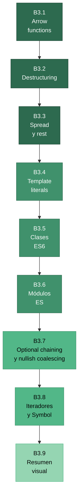

# :zap: JavaScript moderno (ES6+)

<div class="chapter-meta">
  <span class="meta-item">🕐 3-4 horas</span>
  <span class="meta-item">📊 Nivel: Principiante</span>
  <span class="meta-item">🎯 Semana 0</span>
</div>

<div class="chapter-objective">
  <span class="objective-icon">📌</span>
  <span class="objective-text">Al terminar este capítulo, dominarás las features de ES6+ que aparecen en todo código TypeScript moderno: arrow functions, destructuring, spread/rest, clases, módulos y optional chaining.</span>
</div>

<div class="chapter-map">



**Flujo del capítulo:** Empezamos con las bases sintácticas del JS moderno (arrow functions, destructuring, spread/rest, template literals), luego subimos a estructuras más complejas (clases, módulos), y terminamos con operadores de seguridad (optional chaining, nullish coalescing) e iteradores. Cada sección construye sobre la anterior.

</div>

!!! quote "Contexto"
    Si en el capítulo anterior aprendiste las bases de JavaScript (variables, funciones, control de flujo), ahora toca el **JavaScript moderno** — la versión del lenguaje que realmente se escribe hoy. TypeScript no solo usa ES6+: lo **extiende**. Si no dominas estas features, el código TypeScript te parecerá alienígena. Cada sección de este capítulo es algo que verás *todos los días* en cualquier proyecto TypeScript real.

<div class="connection-box">
<span class="connection-icon">🔗</span>
<span>Este capítulo asume que ya leíste <a href="../bases-2-javascript/">Bases 2 — JavaScript esencial</a>, donde cubrimos variables (<code>let</code>/<code>const</code>), funciones con <code>function</code>, objetos, arrays y control de flujo. Aquí construimos sobre eso.</span>
</div>

---

## B3.1 Arrow functions

Las **arrow functions** (`=>`) son la forma moderna de escribir funciones en JavaScript. Las verás en absolutamente todo código TypeScript.

### Sintaxis básica

```javascript
// Función clásica (ES5)
function sumar(a, b) {
  return a + b;
}

// Arrow function (ES6+)
const sumar = (a, b) => {
  return a + b;
};

// Arrow function con retorno implícito (sin llaves)
const sumar = (a, b) => a + b;

// Un solo parámetro: paréntesis opcionales
const doble = x => x * 2;

// Sin parámetros: paréntesis obligatorios
const saludo = () => "¡Hola!";
```

### Retorno implícito de objetos

Un caso especial: si quieres retornar un objeto literalmente, necesitas paréntesis extra para que JS no confunda las llaves con un bloque de código:

```javascript
// ❌ Mal: JS interpreta {} como bloque de código, no como objeto
const crearPlato = (nombre, precio) => { nombre, precio };
// Retorna undefined!

// ✅ Bien: envuelve el objeto en paréntesis
const crearPlato = (nombre, precio) => ({ nombre, precio });
// Retorna { nombre: "Pasta", precio: 12 }
```

<div class="comparison" markdown>
<div class="lang-box python" markdown>

#### :snake: En Python

Python tiene `lambda` para funciones anónimas de una línea: `doble = lambda x: x * 2`. Las lambdas son limitadas: solo una expresión, no pueden tener sentencias.

</div>
<div class="lang-box typescript" markdown>

#### 🔷 En JavaScript (ES6+)

Las arrow functions son funciones **completas**: pueden tener múltiples líneas, sentencias, etc. Son mucho más potentes que `lambda` de Python. Además, no crean su propio `this`.

</div>
</div>

### El `this` en arrow functions

La diferencia más importante con `function` es que las arrow functions **no crean su propio `this`**. Heredan el `this` del contexto donde se definen:

```javascript
const restaurante = {
  nombre: "MakeMenu",
  platos: ["Pasta", "Pizza", "Risotto"],

  // ❌ function clásica: this se pierde dentro del callback
  mostrarConFunction: function () {
    this.platos.forEach(function (plato) {
      console.log(`${this.nombre}: ${plato}`); // this.nombre es undefined!
    });
  },

  // ✅ Arrow function: this se hereda del contexto exterior
  mostrarConArrow: function () {
    this.platos.forEach(plato => {
      console.log(`${this.nombre}: ${plato}`); // "MakeMenu: Pasta" ✅
    });
  },
};
```

!!! tip "Regla de oro para `this`"
    Usa **arrow functions** para callbacks (`.map()`, `.filter()`, `.forEach()`, event handlers). Usa `function` cuando necesites un `this` propio (métodos de objeto definidos explícitamente, constructores ES5 antiguos).

<div class="misconception-box" markdown>
<h4>❌ Error común</h4>
<p><strong>Mito:</strong> "Las arrow functions son solo sintaxis más corta"</p>
<p><strong>Realidad:</strong> Arrow functions NO tienen su propio <code>this</code>, <code>arguments</code>, ni <code>super</code> — heredan todos del scope padre. Esta diferencia es fundamental: elegir entre arrow function y <code>function</code> no es solo cuestión de estilo, afecta al comportamiento de tu código, especialmente en callbacks y métodos de objetos.</p>
</div>

<div class="concept-question">
<h4>🔍 Pregunta conceptual</h4>
<p>Si las arrow functions no tienen su propio <code>this</code>, ¿qué pasaría si usas una arrow function como método de un objeto? ¿A qué apuntaría <code>this</code>?</p>
</div>

---

## B3.2 Destructuring

El **destructuring** permite extraer valores de objetos y arrays en variables individuales de forma concisa. En TypeScript, lo verás constantemente en parámetros de funciones, imports, y asignaciones.

### Destructuring de objetos

```javascript
const plato = {
  nombre: "Risotto",
  precio: 18.5,
  categoria: "principal",
  disponible: true,
};

// Sin destructuring (ES5)
const nombre = plato.nombre;
const precio = plato.precio;

// Con destructuring (ES6+)
const { nombre, precio, categoria } = plato;
console.log(nombre);    // "Risotto"
console.log(precio);    // 18.5

// Renombrar variables
const { nombre: nombrePlato, precio: precioPlato } = plato;
console.log(nombrePlato); // "Risotto"

// Valores por defecto
const { nombre, alergenos = [] } = plato;
// alergenos será [] porque plato.alergenos no existe
```

### Destructuring de arrays

```javascript
const coordenadas = [50.0755, 14.4378, 200];

// Sin destructuring
const lat = coordenadas[0];
const lng = coordenadas[1];

// Con destructuring
const [lat, lng, alt] = coordenadas;
console.log(lat); // 50.0755

// Saltar elementos
const [, , altitud] = coordenadas;
console.log(altitud); // 200

// Intercambiar variables (truco clásico)
let a = 1, b = 2;
[a, b] = [b, a]; // a = 2, b = 1
```

### Destructuring anidado y en parámetros

```javascript
const pedido = {
  mesa: 5,
  items: [
    { nombre: "Pasta", precio: 12 },
    { nombre: "Vino", precio: 8 },
  ],
  cliente: {
    nombre: "García",
    telefono: "612345678",
  },
};

// Destructuring anidado
const {
  mesa,
  cliente: { nombre: nombreCliente },
} = pedido;
console.log(mesa);           // 5
console.log(nombreCliente);  // "García"

// En parámetros de función (MUY común en TypeScript)
function procesarPedido({ mesa, items, cliente: { nombre } }) {
  console.log(`Mesa ${mesa}: pedido de ${nombre} con ${items.length} items`);
}
procesarPedido(pedido);
```

<div class="comparison" markdown>
<div class="lang-box python" markdown>

#### :snake: En Python

Python tiene unpacking de tuplas/listas: `a, b, c = [1, 2, 3]` y unpacking extendido: `first, *rest = [1, 2, 3, 4]`. No existe destructuring de diccionarios nativo, aunque puedes hacer `nombre = d["nombre"]`.

</div>
<div class="lang-box typescript" markdown>

#### 🔷 En JavaScript (ES6+)

JS puede destructurar tanto arrays como objetos, con renombrado, valores por defecto y anidamiento. Es más potente que el unpacking de Python, especialmente para objetos.

</div>
</div>

<div class="micro-exercise">
<h4>🧪 Micro-ejercicio (2 min)</h4>
<p>Dado el objeto <code>const usuario = { nombre: "Ana", edad: 28, ciudad: "Madrid", idiomas: ["es", "en"] }</code>, usa destructuring para extraer <code>nombre</code>, <code>idiomas</code> y un <code>pais</code> con valor por defecto <code>"España"</code> (la propiedad no existe en el objeto).</p>
</div>

---

## B3.3 Spread y rest

Los operadores **spread** (`...`) y **rest** (`...`) usan la misma sintaxis pero hacen cosas opuestas: spread **expande** y rest **agrupa**.

### Spread en arrays

```javascript
const entrantes = ["Bruschetta", "Sopa"];
const principales = ["Pasta", "Risotto"];
const postres = ["Tiramisú"];

// Combinar arrays
const menu = [...entrantes, ...principales, ...postres];
// ["Bruschetta", "Sopa", "Pasta", "Risotto", "Tiramisú"]

// Clonar un array (shallow copy)
const menuCopia = [...menu];
menuCopia.push("Gelato");
// menu NO se modifica — son arrays distintos

// Insertar en posiciones específicas
const conEspecial = [...entrantes, "Carpaccio", ...principales];
```

### Spread en objetos

```javascript
const platoBase = { nombre: "Pasta", precio: 12, disponible: true };

// Clonar un objeto
const copia = { ...platoBase };

// Merge de objetos (el último gana si hay colisión)
const platoActualizado = { ...platoBase, precio: 14, alergenos: ["gluten"] };
// { nombre: "Pasta", precio: 14, disponible: true, alergenos: ["gluten"] }

// Patrón "overrides" (MUY común en TypeScript)
const configDefecto = { tema: "claro", idioma: "es", debug: false };
const configUsuario = { tema: "oscuro" };
const configFinal = { ...configDefecto, ...configUsuario };
// { tema: "oscuro", idioma: "es", debug: false }
```

### Rest en parámetros y destructuring

```javascript
// Rest en parámetros de función: agrupa el "resto" de argumentos
function crearPedido(mesa, ...items) {
  console.log(`Mesa ${mesa}: ${items.length} items`);
  return { mesa, items };
}
crearPedido(5, "Pasta", "Vino", "Tiramisú");
// Mesa 5: 3 items

// Rest en destructuring de objetos
const { nombre, precio, ...resto } = platoBase;
console.log(resto); // { disponible: true }

// Rest en destructuring de arrays
const [primero, segundo, ...demas] = menu;
console.log(demas); // ["Pasta", "Risotto", "Tiramisú"]
```

!!! warning "Shallow copy"
    Tanto `[...array]` como `{...obj}` hacen una copia **superficial** (shallow). Si el objeto contiene otros objetos, las referencias internas se comparten. Para deep copy usa `structuredClone(obj)` (disponible en navegadores modernos y Node 17+).

<div class="comparison" markdown>
<div class="lang-box python" markdown>

#### :snake: En Python

Python usa `*args` y `**kwargs` para parámetros variables, y `*` para unpacking: `[*lista1, *lista2]` o `{**dict1, **dict2}`. El operador `|` merges dicts desde Python 3.9: `config = defaults | overrides`.

</div>
<div class="lang-box typescript" markdown>

#### 🔷 En JavaScript (ES6+)

JS usa `...` tanto para spread (expandir) como para rest (agrupar). Es más uniforme que Python: un solo operador para arrays, objetos y parámetros. TypeScript añade tipos: `...items: string[]`.

</div>
</div>

---

## B3.4 Template literals

Los **template literals** (backtick strings) son strings delimitados por acentos graves (`` ` ``) que permiten interpolación y multilínea.

```javascript
const nombre = "Daniele";
const edad = 22;

// Concatenación clásica (ES5) — incómoda
const msg1 = "Hola " + nombre + ", tienes " + edad + " años.";

// Template literal (ES6+) — limpia y legible
const msg2 = `Hola ${nombre}, tienes ${edad} años.`;

// Expresiones dentro de ${}
const precio = 12.5;
const cantidad = 3;
const total = `Total: ${(precio * cantidad).toFixed(2)}€`;
// "Total: 37.50€"

// Strings multilínea
const html = `
  <div class="plato">
    <h2>${nombre}</h2>
    <p>Precio: ${precio}€</p>
  </div>
`;

// Llamadas a funciones dentro de ${}
const mayusculas = `Nombre: ${nombre.toUpperCase()}`;
// "Nombre: DANIELE"
```

### Tagged templates (avanzado)

Los tagged templates permiten procesar un template literal con una función. Es un patrón usado en librerías como `styled-components`, `lit-html` y GraphQL:

```javascript
// Función tag: recibe los trozos estáticos y los valores dinámicos
function highlight(strings, ...values) {
  return strings.reduce((result, str, i) => {
    const value = values[i] !== undefined ? `**${values[i]}**` : "";
    return result + str + value;
  }, "");
}

const plato = "Risotto";
const precio = 18;
const msg = highlight`El ${plato} cuesta ${precio}€`;
// "El **Risotto** cuesta **18**€"
```

<div class="pro-tip">
<h4>💡 Consejo Pro</h4>
<p>TypeScript lleva los template literals a otro nivel con los <strong>template literal types</strong>: <code>type Evento = `on${string}`</code> restringe a strings que empiecen con "on". Esto es type-level programming que verás en capítulos avanzados, pero la base es el template literal de ES6.</p>
</div>

<div class="concept-question">
<h4>🔍 Pregunta conceptual</h4>
<p>Python tiene f-strings (<code>f"Hola {nombre}"</code>) y JavaScript tiene template literals (<code>`Hola ${nombre}`</code>). ¿En qué se diferencian más allá de la sintaxis? Pista: piensa en qué puedes poner dentro de <code>${}</code> vs <code>{}</code>.</p>
</div>

---

## B3.5 Clases ES6

Las clases de ES6 son la base sobre la que TypeScript construye su sistema de clases con tipos, modificadores de acceso (`public`, `private`, `protected`) e interfaces.

### Sintaxis básica

```javascript
class Plato {
  // Constructor: se ejecuta al crear una instancia con new
  constructor(nombre, precio, categoria) {
    this.nombre = nombre;
    this.precio = precio;
    this.categoria = categoria;
    this.disponible = true; // valor por defecto
  }

  // Método
  mostrar() {
    return `${this.nombre} — ${this.precio}€ (${this.categoria})`;
  }

  // Getter: accedes como propiedad, no como función
  get precioConIVA() {
    return +(this.precio * 1.21).toFixed(2);
  }

  // Setter
  set nuevoPrecio(precio) {
    if (precio < 0) throw new Error("Precio no puede ser negativo");
    this.precio = precio;
  }

  // Método estático: se llama en la clase, no en instancias
  static crearEspecial(nombre) {
    return new Plato(nombre, 0, "especial");
  }
}

const pasta = new Plato("Pasta Carbonara", 12.5, "principal");
console.log(pasta.mostrar());       // "Pasta Carbonara — 12.5€ (principal)"
console.log(pasta.precioConIVA);    // 15.13
pasta.nuevoPrecio = 14;

const especial = Plato.crearEspecial("Plato del día");
```

### Herencia con `extends` y `super`

```javascript
class PlatoVegano extends Plato {
  constructor(nombre, precio) {
    super(nombre, precio, "vegano"); // llama al constructor padre
    this.esVegano = true;
  }

  // Override: sobrescribe el método del padre
  mostrar() {
    return `🌱 ${super.mostrar()}`; // llama al método padre
  }
}

const tofu = new PlatoVegano("Tofu Teriyaki", 14);
console.log(tofu.mostrar());    // "🌱 Tofu Teriyaki — 14€ (vegano)"
console.log(tofu.esVegano);     // true
console.log(tofu instanceof PlatoVegano); // true
console.log(tofu instanceof Plato);       // true (herencia)
```

### Campos privados con `#` (ES2022)

```javascript
class Cuenta {
  #saldo = 0; // campo verdaderamente privado

  depositar(cantidad) {
    if (cantidad <= 0) throw new Error("Cantidad debe ser positiva");
    this.#saldo += cantidad;
  }

  get saldo() {
    return this.#saldo;
  }
}

const cuenta = new Cuenta();
cuenta.depositar(100);
console.log(cuenta.saldo);   // 100
// console.log(cuenta.#saldo); // ❌ SyntaxError: propiedad privada
```

<div class="comparison" markdown>
<div class="lang-box python" markdown>

#### :snake: En Python

```python
class Plato:
    def __init__(self, nombre, precio, categoria):
        self.nombre = nombre
        self.precio = precio
        self.categoria = categoria

    def mostrar(self):
        return f"{self.nombre} — {self.precio}€"

class PlatoVegano(Plato):
    def __init__(self, nombre, precio):
        super().__init__(nombre, precio, "vegano")
```

Python usa `self` explícito, `__init__`, y `_privado` (convención, no enforcement). Herencia múltiple con MRO.

</div>
<div class="lang-box typescript" markdown>

#### 🔷 En JavaScript (ES6+)

JS usa `this` implícito, `constructor`, y `#privado` (enforcement real). Solo herencia simple, pero TypeScript añade `implements` para interfaces (similar a ABCs de Python).

</div>
</div>

---

## B3.6 Módulos ES

Los **ES Modules** (`import`/`export`) son el sistema de módulos estándar de JavaScript y el que usa TypeScript. Reemplazan al antiguo `require()` de CommonJS.

### Named exports

```javascript
// ---------- utils.js ----------
// Exportar al declarar
export function formatearPrecio(precio) {
  return `${precio.toFixed(2)}€`;
}

export const IVA = 0.21;

// O exportar al final
function calcularTotal(items) {
  return items.reduce((sum, item) => sum + item.precio, 0);
}
export { calcularTotal };

// ---------- app.js ----------
// Importar named exports (llaves obligatorias)
import { formatearPrecio, IVA, calcularTotal } from "./utils.js";

// Renombrar al importar
import { formatearPrecio as formatPrecio } from "./utils.js";

// Importar todo como namespace
import * as Utils from "./utils.js";
Utils.formatearPrecio(12.5);
```

### Default export

```javascript
// ---------- Plato.js ----------
// Un módulo puede tener UN default export
export default class Plato {
  constructor(nombre, precio) {
    this.nombre = nombre;
    this.precio = precio;
  }
}

// ---------- app.js ----------
// Importar default: sin llaves, nombre libre
import Plato from "./Plato.js";
import MiPlato from "./Plato.js"; // también válido — el nombre es libre

// Combinar default + named
import Plato, { formatearPrecio } from "./Plato.js";
```

### Re-exports y barrel files

```javascript
// ---------- models/index.js ---------- (barrel file)
export { Plato } from "./Plato.js";
export { Mesa } from "./Mesa.js";
export { Pedido } from "./Pedido.js";

// ---------- app.js ----------
// Importar desde el barrel — limpio y organizado
import { Plato, Mesa, Pedido } from "./models/index.js";
```

### Dynamic import (ES2020)

```javascript
// Importar módulos de forma dinámica (lazy loading)
async function cargarAdmin() {
  const { AdminPanel } = await import("./admin/AdminPanel.js");
  return new AdminPanel();
}

// Útil para code-splitting en aplicaciones web
button.addEventListener("click", async () => {
  const modulo = await import("./modulo-pesado.js");
  modulo.iniciar();
});
```

<div class="pro-tip">
<h4>💡 Consejo Pro</h4>
<p>En TypeScript, <strong>named exports son preferibles a default exports</strong>. Los named exports dan mejor autocompletado (tu editor sabe qué nombres exporta el módulo), mejor refactoring (renombrar afecta todos los imports), y evitan inconsistencias de nombres. Muchos style guides (incluyendo el de Google) prohíben default exports.</p>
</div>

<div class="concept-question">
<h4>🔍 Pregunta conceptual</h4>
<p>Python usa <code>import math</code>, <code>from math import sqrt</code> y <code>from math import *</code>. ¿Cuál es el equivalente JS de cada una? ¿Por qué <code>import *</code> se considera mala práctica en ambos lenguajes?</p>
</div>

---

## B3.7 Optional chaining y nullish coalescing

Estos dos operadores, introducidos en ES2020, son **fundamentales** en TypeScript. TypeScript ama la seguridad de null/undefined, y estos operadores son la forma idiomática de manejarlos.

### Optional chaining (`?.`)

Accede a propiedades de forma segura: si algún eslabón de la cadena es `null` o `undefined`, retorna `undefined` en lugar de lanzar un error.

```javascript
const pedido = {
  mesa: 5,
  cliente: {
    nombre: "García",
    dirección: null, // sin dirección
  },
};

// ❌ Sin optional chaining: crashea
// pedido.cliente.dirección.calle → TypeError!

// ✅ Con optional chaining: retorna undefined
const calle = pedido.cliente.dirección?.calle;
console.log(calle); // undefined (sin crash)

// Funciona con métodos
const longitud = pedido.cliente.nombre?.toUpperCase();
// "GARCÍA"

// Con arrays
const primerItem = pedido.items?.[0];
// undefined (items no existe)

// Con llamadas a funciones
const resultado = pedido.callback?.();
// undefined si callback no existe, o lo ejecuta si existe
```

### Nullish coalescing (`??`)

Proporciona un valor por defecto cuando algo es `null` o `undefined` (y **solo** null/undefined, no `0`, `""`, ni `false`).

```javascript
const config = {
  tema: "",       // string vacío: intencional
  debug: false,   // false: intencional
  maxItems: 0,    // cero: intencional
  idioma: null,   // null: no configurado
};

// ❌ El operador || considera falsy a "", false, 0
config.tema || "claro";      // "claro" — MAL: "" es un valor válido
config.debug || true;        // true — MAL: false es un valor válido
config.maxItems || 50;       // 50 — MAL: 0 es un valor válido

// ✅ El operador ?? solo actúa con null/undefined
config.tema ?? "claro";      // "" — BIEN: respeta el string vacío
config.debug ?? true;        // false — BIEN: respeta el false
config.maxItems ?? 50;       // 0 — BIEN: respeta el cero
config.idioma ?? "es";       // "es" — BIEN: null sí necesita default
```

### Combinando `?.` y `??`

```javascript
// Patrón MUY común en TypeScript:
// "Accede de forma segura, y si no existe, usa un default"
const ciudad = usuario?.dirección?.ciudad ?? "Sin ciudad";
const items = pedido?.items?.length ?? 0;
const nombre = respuesta?.data?.usuario?.nombre ?? "Anónimo";
```

!!! info "¿Por qué TypeScript ama estos operadores?"
    Con `strictNullChecks: true` (que siempre debes tener activado), TypeScript te **obliga** a manejar `null` y `undefined`. Los operadores `?.` y `??` son la forma idiomática y concisa de hacerlo. Sin ellos, necesitarías `if (x !== null && x !== undefined)` por todas partes.

<div class="micro-exercise">
<h4>🧪 Micro-ejercicio (2 min)</h4>
<p>Dado <code>const respuesta = { data: { usuarios: [{ nombre: "Ana" }] } }</code>, usa optional chaining y nullish coalescing para acceder al nombre del primer usuario con un fallback de <code>"Desconocido"</code>. Luego haz lo mismo para un segundo usuario que no existe.</p>
</div>

---

## B3.8 Iteradores y Symbol

### `for...of` — El bucle moderno

El bucle `for...of` itera sobre valores de cualquier **iterable** (arrays, strings, Map, Set, generators). Es el equivalente directo del `for x in iterable` de Python.

```javascript
const platos = ["Pasta", "Pizza", "Risotto"];

// ❌ for clásico: verbose
for (let i = 0; i < platos.length; i++) {
  console.log(platos[i]);
}

// ❌ for...in: itera sobre ÍNDICES (strings), no valores
for (const i in platos) {
  console.log(i); // "0", "1", "2" — strings, no números
}

// ✅ for...of: itera sobre VALORES
for (const plato of platos) {
  console.log(plato); // "Pasta", "Pizza", "Risotto"
}

// Funciona con strings
for (const char of "Hola") {
  console.log(char); // "H", "o", "l", "a"
}

// Funciona con Map
const precios = new Map([["Pasta", 12], ["Pizza", 10]]);
for (const [nombre, precio] of precios) {
  console.log(`${nombre}: ${precio}€`);
}

// Funciona con Set
const categorias = new Set(["entrante", "principal", "postre"]);
for (const cat of categorias) {
  console.log(cat);
}
```

!!! warning "No confundas `for...in` con `for...of`"
    `for...in` itera sobre las **keys** (propiedades enumerables) de un objeto. `for...of` itera sobre los **valores** de un iterable. Para arrays, casi siempre quieres `for...of`.

### `Symbol` — Identificadores únicos

Los `Symbol` son valores primitivos **únicos e irrepetibles**. Su uso más importante es definir comportamientos personalizados como el protocolo de iteración.

```javascript
// Cada Symbol es único
const id1 = Symbol("id");
const id2 = Symbol("id");
console.log(id1 === id2); // false — siempre únicos

// Uso como claves de objeto (no colisionan con otras propiedades)
const META = Symbol("meta");
const plato = {
  nombre: "Pasta",
  [META]: { creadoPor: "sistema", version: 2 },
};
console.log(plato[META]); // { creadoPor: "sistema", version: 2 }
// Object.keys(plato) → ["nombre"] — los Symbols no aparecen
```

### Protocolo de iteración: `Symbol.iterator`

Cualquier objeto puede ser iterable si implementa `Symbol.iterator`. Esto es lo que hace que `for...of` funcione:

```javascript
// Crear un iterable personalizado
const menuIterable = {
  platos: ["Pasta", "Pizza", "Risotto"],
  [Symbol.iterator]() {
    let index = 0;
    const platos = this.platos;
    return {
      next() {
        if (index < platos.length) {
          return { value: platos[index++], done: false };
        }
        return { value: undefined, done: true };
      },
    };
  },
};

// Ahora funciona con for...of
for (const plato of menuIterable) {
  console.log(plato); // "Pasta", "Pizza", "Risotto"
}

// Y con spread
const todos = [...menuIterable]; // ["Pasta", "Pizza", "Risotto"]
```

### Generators — Iteradores simplificados

Las **generator functions** (`function*`) son una forma mucho más sencilla de crear iteradores. Usan `yield` para producir valores bajo demanda:

```javascript
// Generator function
function* generadorMenu() {
  yield "Bruschetta";
  yield "Pasta Carbonara";
  yield "Tiramisú";
}

const menu = generadorMenu();
console.log(menu.next()); // { value: "Bruschetta", done: false }
console.log(menu.next()); // { value: "Pasta Carbonara", done: false }
console.log(menu.next()); // { value: "Tiramisú", done: false }
console.log(menu.next()); // { value: undefined, done: true }

// Los generators son iterables
for (const plato of generadorMenu()) {
  console.log(plato);
}

// Generator infinito (lazy evaluation)
function* idGenerator() {
  let id = 1;
  while (true) {
    yield id++;
  }
}

const ids = idGenerator();
console.log(ids.next().value); // 1
console.log(ids.next().value); // 2
console.log(ids.next().value); // 3
// Se detiene cuando tú quieres — evaluación lazy
```

!!! tip "Generators en Python"
    Si conoces los generators de Python (`yield`), los de JavaScript funcionan casi igual. La sintaxis es `function*` en vez de simplemente `yield` dentro de una función normal. TypeScript los soporta con tipos: `function* gen(): Generator<number>`.

---

## B3.9 Resumen visual: ES5 vs ES6+ vs ES2020+

<div class="code-evolution" markdown>
<div class="evolution-header">📈 Evolución del código</div>
<div class="evolution-step">
<span class="step-label novato">v1 — ES5 antiguo</span>

```javascript
// ES5: concatenación, var, function, prototype
var restaurante = {
  nombre: "MakeMenu",
  platos: ["Pasta", "Pizza"],
  mostrarMenu: function () {
    var self = this; // hack para preservar this
    this.platos.forEach(function (plato) {
      console.log(self.nombre + ": " + plato);
    });
  },
};

function crearPlato(nombre, precio, disponible) {
  if (disponible === undefined) disponible = true;
  return {
    nombre: nombre,
    precio: precio,
    disponible: disponible,
  };
}

var copia = JSON.parse(JSON.stringify(restaurante)); // deep clone
```

</div>
<div class="evolution-step">
<span class="step-label mejorado">v2 — ES6 básico</span>

```javascript
// ES6: arrow, destructuring, template literals, class
const restaurante = {
  nombre: "MakeMenu",
  platos: ["Pasta", "Pizza"],
  mostrarMenu() {
    this.platos.forEach(plato => {
      console.log(`${this.nombre}: ${plato}`);
    });
  },
};

const crearPlato = (nombre, precio, disponible = true) => ({
  nombre,
  precio,
  disponible,
});

const copia = { ...restaurante, platos: [...restaurante.platos] };
```

</div>
<div class="evolution-step">
<span class="step-label profesional">v3 — ES2020+ moderno</span>

```javascript
// ES2020+: optional chaining, nullish coalescing, private fields
class Restaurante {
  #config;
  constructor(nombre, platos, config) {
    this.nombre = nombre;
    this.platos = platos;
    this.#config = config;
  }

  mostrarMenu() {
    const titulo = this.#config?.titulo ?? this.nombre;
    this.platos.forEach(plato => console.log(`${titulo}: ${plato}`));
  }
}

const restaurante = new Restaurante("MakeMenu", ["Pasta", "Pizza"], null);
const copia = structuredClone(restaurante.platos);
```

</div>
</div>

---

<div class="misconception-box">
<h4>⚠️ Errores comunes</h4>
<ul>
<li><span class="wrong">❌ Mito:</span> "Las arrow functions son simplemente una forma corta de escribir funciones" → <span class="right">✅ Realidad:</span> Tienen una diferencia fundamental: no crean su propio <code>this</code>. Elegir entre arrow y <code>function</code> no es solo estética, afecta al comportamiento.</li>
<li><span class="wrong">❌ Mito:</span> "<code>||</code> y <code>??</code> son lo mismo" → <span class="right">✅ Realidad:</span> <code>||</code> actúa con cualquier valor falsy (<code>0</code>, <code>""</code>, <code>false</code>, <code>null</code>, <code>undefined</code>). <code>??</code> solo actúa con <code>null</code> y <code>undefined</code>. En TypeScript, usar <code>??</code> evita bugs sutiles.</li>
<li><span class="wrong">❌ Mito:</span> "<code>{...obj}</code> hace una copia completa del objeto" → <span class="right">✅ Realidad:</span> Spread hace una copia <strong>superficial</strong> (shallow). Los objetos anidados siguen siendo referencias compartidas. Para deep copy, usa <code>structuredClone()</code>.</li>
</ul>
</div>

---

<div class="connection-box">
<span class="connection-icon">🔗</span>
<span>En <a href="../bases-4-asincronia/">Bases 4 — Asincronía y herramientas</a> aprenderás <code>async/await</code>, Promises, y las herramientas del ecosistema JS. Estas features se combinan con todo lo que has visto aquí: arrow functions con async, destructuring de respuestas de API, y módulos para organizar tu código.</span>
</div>

<div class="ejercicio-guiado">
<h4>🏋️ Ejercicio guiado</h4>

Refactoriza un sistema de pedidos de MakeMenu para usar todas las features de ES6+ que has aprendido: arrow functions, destructuring, spread/rest, clases, módulos y optional chaining:

1. Crea una clase `Plato` con un constructor que use destructuring de un objeto `{ nombre, precio, categoria = "principal" }` y un método `descripcion()` que devuelva un template literal con el nombre y precio formateado
2. Crea una clase `Pedido` que acepte un `...platos` (rest parameter) en su constructor, los guarde en un array, y tenga un método `total()` que use `.reduce()` con arrow function para sumar precios
3. Añade a `Pedido` un método `resumen()` que use destructuring en el `.map()` para extraer `nombre` y `precio` de cada plato y devuelva un array de strings formateadas
4. Crea una función `crearPedidoDesdeAPI(datos)` que reciba un objeto que puede ser `null` o incompleto y use optional chaining (`?.`) y nullish coalescing (`??`) para acceder de forma segura a `datos?.cliente?.nombre ?? "Anónimo"` y `datos?.platos ?? []`
5. Usa spread para combinar dos pedidos: crea `pedido1` y `pedido2` con platos diferentes, y genera un `pedidoCombinado` con `[...pedido1.platos, ...pedido2.platos]`
6. Usa `export` para exponer las clases y `import` para usarlas — demuestra la sintaxis de módulos ES6 con `export default` y named exports

??? success "Solución completa"
    ```javascript title="plato.js"
    // Named export
    export class Plato {
      constructor({ nombre, precio, categoria = "principal" }) {
        this.nombre = nombre;
        this.precio = precio;
        this.categoria = categoria;
      }

      descripcion() {
        return `${this.nombre} (${this.categoria}) — ${this.precio.toFixed(2)} €`;
      }
    }
    ```

    ```javascript title="pedido.js"
    // Default export
    export default class Pedido {
      constructor(...platos) {
        this.platos = platos;
        this.fecha = new Date();
      }

      total() {
        return this.platos.reduce((suma, plato) => suma + plato.precio, 0);
      }

      resumen() {
        return this.platos.map(({ nombre, precio }) =>
          `  - ${nombre}: ${precio.toFixed(2)} €`
        );
      }

      toString() {
        const lineas = this.resumen().join("\n");
        return `Pedido (${this.platos.length} platos):\n${lineas}\n  Total: ${this.total().toFixed(2)} €`;
      }
    }
    ```

    ```javascript title="app.js"
    import Pedido from "./pedido.js";          // default import
    import { Plato } from "./plato.js";        // named import

    // --- 1. Crear platos con destructuring en constructor ---
    const bruschetta = new Plato({ nombre: "Bruschetta", precio: 8.5, categoria: "entrante" });
    const paella = new Plato({ nombre: "Paella", precio: 16 });  // categoria default: "principal"
    const tiramisu = new Plato({ nombre: "Tiramisú", precio: 7, categoria: "postre" });
    const gazpacho = new Plato({ nombre: "Gazpacho", precio: 6, categoria: "entrante" });

    console.log(bruschetta.descripcion());
    // "Bruschetta (entrante) — 8.50 €"

    // --- 2 y 3. Pedido con rest params y resumen con destructuring ---
    const pedido1 = new Pedido(bruschetta, paella);
    const pedido2 = new Pedido(tiramisu, gazpacho);

    console.log(pedido1.toString());
    // Pedido (2 platos):
    //   - Bruschetta: 8.50 €
    //   - Paella: 16.00 €
    //   Total: 24.50 €

    // --- 4. Optional chaining y nullish coalescing ---
    function crearPedidoDesdeAPI(datos) {
      const cliente = datos?.cliente?.nombre ?? "Anónimo";
      const platos = datos?.platos ?? [];
      const mesa = datos?.mesa?.numero ?? "sin asignar";

      console.log(`Cliente: ${cliente}, Mesa: ${mesa}`);
      return { cliente, platos, mesa };
    }

    crearPedidoDesdeAPI(null);
    // "Cliente: Anónimo, Mesa: sin asignar"

    crearPedidoDesdeAPI({ cliente: { nombre: "María" }, mesa: { numero: 5 } });
    // "Cliente: María, Mesa: 5"

    // --- 5. Spread para combinar pedidos ---
    const pedidoCombinado = new Pedido(...pedido1.platos, ...pedido2.platos);
    console.log(pedidoCombinado.toString());
    // Pedido (4 platos):
    //   - Bruschetta: 8.50 €
    //   - Paella: 16.00 €
    //   - Tiramisú: 7.00 €
    //   - Gazpacho: 6.00 €
    //   Total: 37.50 €
    ```

</div>

<div class="real-errors">
<h4>🐛 Errores reales de ES6+ en JavaScript</h4>
<p>Estos son errores que encontrarás (o ya has encontrado) en proyectos reales. Aprende a reconocerlos antes de que te hagan perder horas.</p>

**Error 1: Destructuring de `undefined` o `null`**

```javascript
// ❌ Código que crashea
function procesarRespuesta(respuesta) {
  const { data, status } = respuesta; // TypeError si respuesta es undefined
}
procesarRespuesta(); // ¡Olvidaste pasar el argumento!
// TypeError: Cannot destructure property 'data' of undefined

// ✅ Corrección: valor por defecto en el parámetro
function procesarRespuesta(respuesta = {}) {
  const { data = null, status = 500 } = respuesta;
  // Ahora nunca crashea, incluso sin argumento
}
```

**Error 2: Usar `||` en vez de `??` con valores falsy legítimos**

```javascript
// ❌ Bug sutil que pasa todos los tests... excepto los edge cases
function crearConfig(opciones) {
  return {
    puerto: opciones.puerto || 3000,     // Si puerto es 0, usa 3000 (MAL)
    verbose: opciones.verbose || true,    // Si verbose es false, usa true (MAL)
    prefijo: opciones.prefijo || "/api",  // Si prefijo es "", usa "/api" (MAL)
  };
}
crearConfig({ puerto: 0, verbose: false, prefijo: "" });
// Resultado: { puerto: 3000, verbose: true, prefijo: "/api" } — todo INCORRECTO

// ✅ Corrección: usar ?? para respetar valores falsy intencionales
function crearConfig(opciones) {
  return {
    puerto: opciones.puerto ?? 3000,
    verbose: opciones.verbose ?? true,
    prefijo: opciones.prefijo ?? "/api",
  };
}
crearConfig({ puerto: 0, verbose: false, prefijo: "" });
// Resultado: { puerto: 0, verbose: false, prefijo: "" } — CORRECTO
```

**Error 3: Spread sobrescribe propiedades en el orden equivocado**

```javascript
// ❌ Los defaults del usuario se pierden porque se aplican ANTES
function crearUsuario(datosUsuario) {
  return {
    ...datosUsuario,           // Primero los datos del usuario
    rol: "visitante",          // Luego el default → ¡SOBRESCRIBE el rol del usuario!
    activo: true,
  };
}
crearUsuario({ nombre: "Ana", rol: "admin" });
// { nombre: "Ana", rol: "visitante", activo: true } — el rol "admin" se perdió

// ✅ Corrección: defaults PRIMERO, datos del usuario DESPUÉS
function crearUsuario(datosUsuario) {
  return {
    rol: "visitante",          // Defaults primero
    activo: true,
    ...datosUsuario,           // Datos del usuario sobrescriben los defaults
  };
}
crearUsuario({ nombre: "Ana", rol: "admin" });
// { rol: "admin", activo: true, nombre: "Ana" } — CORRECTO
```

**Error 4: Olvidar `super()` en el constructor de una clase hija**

```javascript
// ❌ Crashea antes de poder usar this
class MenuItem extends Plato {
  constructor(nombre, precio, sección) {
    this.sección = sección; // ReferenceError: Must call super constructor first
    super(nombre, precio, "menu");
  }
}

// ✅ Corrección: super() SIEMPRE va primero
class MenuItem extends Plato {
  constructor(nombre, precio, sección) {
    super(nombre, precio, "menu"); // Primero super()
    this.sección = sección;         // Luego puedes usar this
  }
}
```

**Error 5: Importar named export sin llaves (o default con llaves)**

```javascript
// ---------- utils.js ----------
export function formatearPrecio(precio) {
  return `${precio.toFixed(2)}€`;
}

// ❌ Error: importar named export sin llaves
import formatearPrecio from "./utils.js";
// formatearPrecio es undefined — estás importando el default (que no existe)

// ❌ Error inverso: importar default export con llaves
import { Plato } from "./Plato.js"; // Si Plato es un default export, esto falla
// SyntaxError o undefined

// ✅ Corrección: llaves para named, sin llaves para default
import { formatearPrecio } from "./utils.js";  // Named export → con llaves
import Plato from "./Plato.js";                 // Default export → sin llaves
```

</div>

<div class="checkpoint">
<h4>🏁 Checkpoint</h4>
<p>Si puedes: (1) escribir arrow functions con retorno implícito y destructuring en parámetros, (2) usar spread/rest para clonar y combinar objetos, y (3) encadenar <code>?.</code> y <code>??</code> para acceder a datos anidados de forma segura — estás listo para el siguiente capítulo.</p>
</div>

<div class="mini-project">
<h4>🔨 Mini-proyecto: Sistema de gestión de menú con ES6+</h4>
<p>Aplica todo lo aprendido en este capítulo para construir un pequeño sistema de gestión de menú de restaurante. Cada paso combina varias features de ES6+.</p>

??? question "Paso 1: Clase base y módulo de utilidades"
    Crea una clase `MenuItem` con constructor, getter `precioConIVA`, método `toString()`, y un método estático `fromJSON()` que cree una instancia desde un objeto plano. Además, crea funciones de utilidad `formatearPrecio` y `calcularTotal` como named exports.

    ```javascript
    // Crea la clase MenuItem y las funciones de utilidad.
    // MenuItem debe tener: nombre, precio, categoria, disponible (default true)
    // formatearPrecio(n) → "12.50€"
    // calcularTotal(items) → suma de todos los precios
    ```

    ??? success "Solución"
        ```javascript
        // ---------- menuItem.js ----------
        export class MenuItem {
          #disponible;

          constructor(nombre, precio, categoria, disponible = true) {
            this.nombre = nombre;
            this.precio = precio;
            this.categoria = categoria;
            this.#disponible = disponible;
          }

          get precioConIVA() {
            return +(this.precio * 1.21).toFixed(2);
          }

          get estaDisponible() {
            return this.#disponible;
          }

          set estaDisponible(valor) {
            this.#disponible = valor;
          }

          toString() {
            const estado = this.#disponible ? "disponible" : "agotado";
            return `${this.nombre} — ${formatearPrecio(this.precio)} (${this.categoria}) [${estado}]`;
          }

          static fromJSON({ nombre, precio, categoria, disponible }) {
            return new MenuItem(nombre, precio, categoria, disponible);
          }
        }

        // ---------- utils.js ----------
        export const formatearPrecio = (precio) => `${precio.toFixed(2)}€`;

        export const calcularTotal = (items) =>
          items.reduce((sum, { precio }) => sum + precio, 0);
        ```

??? question "Paso 2: Gestión del menú con spread, rest y destructuring"
    Crea una función `crearMenu` que reciba un nombre y un número variable de items (rest). Luego crea funciones para: (a) añadir items al menú sin mutar el original (spread), (b) filtrar por categoría usando destructuring en el callback, y (c) generar un resumen usando template literals.

    ```javascript
    // crearMenu("Menú Principal", item1, item2, item3) → objeto menú
    // agregarItems(menu, ...nuevosItems) → nuevo menú (sin mutar)
    // filtrarPorCategoria(menu, categoria) → items filtrados
    // resumenMenu(menu) → string con template literal multilínea
    ```

    ??? success "Solución"
        ```javascript
        import { MenuItem, formatearPrecio, calcularTotal } from "./menuItem.js";

        const crearMenu = (nombre, ...items) => ({
          nombre,
          items: [...items],
          creadoEn: new Date().toISOString(),
        });

        // Añadir items SIN mutar el original (spread)
        const agregarItems = (menu, ...nuevosItems) => ({
          ...menu,
          items: [...menu.items, ...nuevosItems],
        });

        // Filtrar usando destructuring en el callback
        const filtrarPorCategoria = ({ items }, categoria) =>
          items.filter(({ categoria: cat }) => cat === categoria);

        // Resumen con template literals
        const resumenMenu = ({ nombre, items }) => {
          const disponibles = items.filter(({ estaDisponible }) => estaDisponible);
          const total = calcularTotal(disponibles);
          return `
        === ${nombre} ===
        Total items: ${items.length} (${disponibles.length} disponibles)
        Categorías: ${[...new Set(items.map(({ categoria }) => categoria))].join(", ")}
        Precio total: ${formatearPrecio(total)}
          `.trim();
        };

        // --- Prueba ---
        const pasta = new MenuItem("Pasta Carbonara", 12.5, "principal");
        const pizza = new MenuItem("Pizza Margherita", 10, "principal");
        const bruschetta = new MenuItem("Bruschetta", 7, "entrante");
        const tiramisu = new MenuItem("Tiramisú", 6.5, "postre");

        let menu = crearMenu("Menú Diario", pasta, pizza);
        menu = agregarItems(menu, bruschetta, tiramisu);

        console.log(resumenMenu(menu));
        console.log(filtrarPorCategoria(menu, "principal"));
        ```

??? question "Paso 3: Datos de API con optional chaining y nullish coalescing"
    Simula recibir datos de una API que pueden venir incompletos o con campos nulos. Crea una función `procesarPedidoAPI` que extraiga datos de forma segura usando `?.` y `??`, y una función `enriquecerConDefaults` que merge los datos recibidos con valores por defecto usando spread.

    ```javascript
    // Datos simulados de API (algunos campos pueden faltar o ser null)
    const pedidosAPI = [
      {
        id: 1,
        mesa: 5,
        cliente: { nombre: "García", preferencias: { alergias: ["gluten"] } },
        items: [{ nombre: "Pasta", precio: 12, notas: "sin sal" }],
      },
      {
        id: 2,
        mesa: null,
        cliente: null,
        items: null,
        descuento: 0,
      },
      {
        id: 3,
        descuento: 0.15,
      },
    ];

    // procesarPedidoAPI(pedido) → objeto normalizado y seguro
    // enriquecerConDefaults(pedido) → pedido con todos los campos garantizados
    ```

    ??? success "Solución"
        ```javascript
        import { formatearPrecio, calcularTotal } from "./utils.js";

        const DEFAULTS_PEDIDO = {
          mesa: "Sin asignar",
          cliente: { nombre: "Anónimo", preferencias: {} },
          items: [],
          descuento: 0,
          estado: "pendiente",
        };

        const procesarPedidoAPI = (pedido) => ({
          id: pedido?.id ?? "SIN-ID",
          mesa: pedido?.mesa ?? "Sin asignar",
          cliente: pedido?.cliente?.nombre ?? "Anónimo",
          alergias: pedido?.cliente?.preferencias?.alergias ?? [],
          totalItems: pedido?.items?.length ?? 0,
          primerItem: pedido?.items?.[0]?.nombre ?? "Sin items",
          notasPrimerItem: pedido?.items?.[0]?.notas ?? "Sin notas",
          descuento: pedido?.descuento ?? 0,
          subtotal: calcularTotal(pedido?.items ?? []),
        });

        const enriquecerConDefaults = (pedido) => ({
          ...DEFAULTS_PEDIDO,
          ...pedido,
          cliente: {
            ...DEFAULTS_PEDIDO.cliente,
            ...(pedido?.cliente ?? {}),
            preferencias: {
              ...DEFAULTS_PEDIDO.cliente.preferencias,
              ...(pedido?.cliente?.preferencias ?? {}),
            },
          },
          items: pedido?.items ?? DEFAULTS_PEDIDO.items,
        });

        // --- Prueba ---
        for (const pedido of pedidosAPI) {
          const procesado = procesarPedidoAPI(pedido);
          const { cliente, mesa, subtotal, descuento } = procesado;
          const total = subtotal * (1 - descuento);
          console.log(
            `Pedido ${procesado.id}: ${cliente} | Mesa: ${mesa} | ` +
            `Total: ${formatearPrecio(total)} (descuento: ${descuento * 100}%)`
          );
        }

        // Pedido 1: García | Mesa: 5 | Total: 12.00€ (descuento: 0%)
        // Pedido 2: Anónimo | Mesa: Sin asignar | Total: 0.00€ (descuento: 0%)
        // Pedido 3: Anónimo | Mesa: Sin asignar | Total: 0.00€ (descuento: 15%)

        console.log(enriquecerConDefaults(pedidosAPI[2]));
        // Objeto completo con todos los campos garantizados
        ```

??? question "Paso 4: Unir todo con módulos y clases extendidas"
    Organiza todo el código anterior en un sistema de módulos ES. Crea una clase `MenuDigital` que extienda la funcionalidad, use un generador para iterar sobre los items del menú, e implemente un barrel file para exportar todo limpiamente.

    ```javascript
    // Estructura de archivos:
    // models/MenuItem.js  → clase MenuItem (default export)
    // utils/precios.js    → formatearPrecio, calcularTotal (named exports)
    // models/MenuDigital.js → clase MenuDigital que extiende funcionalidad
    // models/index.js     → barrel file
    // app.js              → importa desde el barrel y usa todo
    ```

    ??? success "Solución"
        ```javascript
        // ---------- models/MenuItem.js ----------
        export default class MenuItem {
          #disponible;
          constructor(nombre, precio, categoria, disponible = true) {
            this.nombre = nombre;
            this.precio = precio;
            this.categoria = categoria;
            this.#disponible = disponible;
          }
          get estaDisponible() { return this.#disponible; }
          set estaDisponible(v) { this.#disponible = v; }
          get precioConIVA() { return +(this.precio * 1.21).toFixed(2); }
        }

        // ---------- utils/precios.js ----------
        export const formatearPrecio = (p) => `${p.toFixed(2)}€`;
        export const calcularTotal = (items) =>
          items.reduce((s, { precio }) => s + precio, 0);

        // ---------- models/MenuDigital.js ----------
        import { formatearPrecio, calcularTotal } from "../utils/precios.js";

        export class MenuDigital {
          #items;
          #nombre;

          constructor(nombre, ...items) {
            this.#nombre = nombre;
            this.#items = [...items];
          }

          // Getter con optional chaining por seguridad
          get resumen() {
            const disponibles = this.#items.filter(i => i.estaDisponible);
            return {
              nombre: this.#nombre,
              total: disponibles.length,
              precio: formatearPrecio(calcularTotal(disponibles)),
              categorias: [...new Set(this.#items.map(({ categoria }) => categoria))],
            };
          }

          // Método inmutable: retorna nuevo MenuDigital
          agregar(...nuevos) {
            return new MenuDigital(this.#nombre, ...this.#items, ...nuevos);
          }

          // Filtrar con destructuring
          porCategoria(cat) {
            return this.#items.filter(({ categoria }) => categoria === cat);
          }

          // Generator: itera sobre items disponibles
          *disponibles() {
            for (const item of this.#items) {
              if (item.estaDisponible) {
                yield item;
              }
            }
          }

          // Hacer la clase iterable
          [Symbol.iterator]() {
            return this.disponibles();
          }
        }

        // ---------- models/index.js ---------- (barrel file)
        export { default as MenuItem } from "./MenuItem.js";
        export { MenuDigital } from "./MenuDigital.js";

        // ---------- app.js ----------
        import { MenuItem, MenuDigital } from "./models/index.js";
        import { formatearPrecio } from "./utils/precios.js";

        // Crear items con la clase
        const items = [
          new MenuItem("Bruschetta", 7, "entrante"),
          new MenuItem("Pasta Carbonara", 12.5, "principal"),
          new MenuItem("Pizza Margherita", 10, "principal"),
          new MenuItem("Tiramisú", 6.5, "postre"),
        ];

        // Crear menú con rest
        let menu = new MenuDigital("Menú del Día", ...items);

        // Agregar items (inmutable con spread interno)
        menu = menu.agregar(
          new MenuItem("Risotto", 14, "principal"),
          new MenuItem("Gelato", 5, "postre"),
        );

        // Usar el generator con for...of
        console.log("--- Items disponibles ---");
        for (const item of menu) {
          const { nombre, precio, categoria } = item;
          console.log(`${nombre} (${categoria}): ${formatearPrecio(precio)}`);
        }

        // Spread funciona porque implementamos Symbol.iterator
        const todosLosNombres = [...menu].map(({ nombre }) => nombre);
        console.log(`\nPlatos: ${todosLosNombres.join(", ")}`);

        // Destructuring del resumen
        const { nombre, total, precio, categorias } = menu.resumen;
        console.log(`\n${nombre}: ${total} items, ${precio}`);
        console.log(`Categorías: ${categorias.join(", ")}`);
        ```
        Este mini-proyecto integra: clases con campos privados, herencia conceptual, generators, `Symbol.iterator`, módulos ES con barrel files, spread/rest, destructuring, template literals, arrow functions y optional chaining. Es un patrón que verás repetido en proyectos TypeScript reales.

</div>

---

## :link: Recursos

| Recurso | Enlace |
|---------|--------|
| MDN: Arrow functions | [developer.mozilla.org/.../Arrow_functions](https://developer.mozilla.org/es/docs/Web/JavaScript/Reference/Functions/Arrow_functions) |
| MDN: Destructuring | [developer.mozilla.org/.../Destructuring_assignment](https://developer.mozilla.org/es/docs/Web/JavaScript/Reference/Operators/Destructuring_assignment) |
| MDN: Spread syntax | [developer.mozilla.org/.../Spread_syntax](https://developer.mozilla.org/es/docs/Web/JavaScript/Reference/Operators/Spread_syntax) |
| MDN: Optional chaining | [developer.mozilla.org/.../Optional_chaining](https://developer.mozilla.org/es/docs/Web/JavaScript/Reference/Operators/Optional_chaining) |
| ES6 Features overview | [es6-features.org](http://es6-features.org/) |
| JavaScript.info — Clases | [javascript.info/class](https://javascript.info/class) |

---

## 🎯 Ejercicios

??? question "Ejercicio 1: Refactorizar a ES6+"
    Convierte este código ES5 a JavaScript moderno usando arrow functions, destructuring, template literals y spread:

    ```javascript
    function crearPedido(mesa, items, descuento) {
      if (descuento === undefined) descuento = 0;
      var total = 0;
      for (var i = 0; i < items.length; i++) {
        total = total + items[i].precio;
      }
      total = total * (1 - descuento);
      return {
        mesa: mesa,
        items: items,
        total: total,
        fecha: new Date().toISOString()
      };
    }
    ```

    ??? success "Solución"
        ```javascript
        const crearPedido = (mesa, items, descuento = 0) => {
          const total = items.reduce((sum, { precio }) => sum + precio, 0) * (1 - descuento);
          return { mesa, items: [...items], total, fecha: new Date().toISOString() };
        };
        ```
        Cambios: arrow function, parámetro por defecto, `reduce` con destructuring, shorthand properties, spread para clonar items.

??? question "Ejercicio 2: Módulos ES"
    Organiza este código en módulos. Crea un módulo `menu.js` que exporte la clase `Plato` (default) y la función `formatearPrecio` (named). Luego escribe un `app.js` que los importe y use.

    ```javascript
    class Plato {
      constructor(nombre, precio) {
        this.nombre = nombre;
        this.precio = precio;
      }
      mostrar() {
        return `${this.nombre}: ${formatearPrecio(this.precio)}`;
      }
    }

    function formatearPrecio(precio) {
      return `${precio.toFixed(2)}€`;
    }
    ```

    ??? success "Solución"
        ```javascript
        // ---------- menu.js ----------
        export function formatearPrecio(precio) {
          return `${precio.toFixed(2)}€`;
        }

        export default class Plato {
          constructor(nombre, precio) {
            this.nombre = nombre;
            this.precio = precio;
          }
          mostrar() {
            return `${this.nombre}: ${formatearPrecio(this.precio)}`;
          }
        }

        // ---------- app.js ----------
        import Plato, { formatearPrecio } from "./menu.js";

        const pasta = new Plato("Pasta", 12.5);
        console.log(pasta.mostrar());          // "Pasta: 12.50€"
        console.log(formatearPrecio(99.9));    // "99.90€"
        ```

??? question "Ejercicio 3: Optional chaining y nullish coalescing"
    Dada esta estructura de datos con campos potencialmente nulos, escribe una función `resumenPedido` que extraiga información de forma segura:

    ```javascript
    const pedidos = [
      {
        id: 1,
        mesa: 5,
        cliente: { nombre: "García", telefono: "612345678" },
        items: [{ nombre: "Pasta", precio: 12 }],
      },
      {
        id: 2,
        mesa: null,
        cliente: null,
        items: null,
      },
    ];
    ```

    La función debe retornar: `{ cliente, mesa, totalItems, primerItem }` con valores por defecto seguros.

    ??? success "Solución"
        ```javascript
        const resumenPedido = (pedido) => ({
          cliente: pedido?.cliente?.nombre ?? "Anónimo",
          mesa: pedido?.mesa ?? "Sin asignar",
          totalItems: pedido?.items?.length ?? 0,
          primerItem: pedido?.items?.[0]?.nombre ?? "Sin items",
        });

        console.log(resumenPedido(pedidos[0]));
        // { cliente: "García", mesa: 5, totalItems: 1, primerItem: "Pasta" }

        console.log(resumenPedido(pedidos[1]));
        // { cliente: "Anónimo", mesa: "Sin asignar", totalItems: 0, primerItem: "Sin items" }

        console.log(resumenPedido(undefined));
        // { cliente: "Anónimo", mesa: "Sin asignar", totalItems: 0, primerItem: "Sin items" }
        ```

---

## :brain: Flashcards de repaso

<div class="flashcard">
<div class="front">¿Cuál es la diferencia clave entre arrow functions y <code>function</code>?</div>
<div class="back">Las arrow functions no crean su propio <code>this</code> — heredan el <code>this</code> del contexto donde se definen. Las funciones clásicas crean su propio <code>this</code>.</div>
</div>

<div class="flashcard">
<div class="front">¿Cómo retornas un objeto literal desde una arrow function con retorno implícito?</div>
<div class="back">Envolviendo el objeto en paréntesis: <code>const fn = () => ({ key: value })</code>. Sin paréntesis, JS interpreta <code>{}</code> como bloque de código.</div>
</div>

<div class="flashcard">
<div class="front">¿Cuál es la diferencia entre <code>||</code> y <code>??</code>?</div>
<div class="back"><code>||</code> retorna el lado derecho si el izquierdo es falsy (<code>0</code>, <code>""</code>, <code>false</code>, <code>null</code>, <code>undefined</code>). <code>??</code> solo retorna el lado derecho si el izquierdo es <code>null</code> o <code>undefined</code>.</div>
</div>

<div class="flashcard">
<div class="front">¿Qué hace <code>...items</code> en <code>function fn(...items)</code> vs en <code>[...array]</code>?</div>
<div class="back">En parámetros de función (<strong>rest</strong>): agrupa los argumentos restantes en un array. En expresiones (<strong>spread</strong>): expande un iterable en elementos individuales.</div>
</div>

<div class="flashcard">
<div class="front">¿Qué diferencia hay entre <code>for...in</code> y <code>for...of</code>?</div>
<div class="back"><code>for...in</code> itera sobre las <strong>keys/índices</strong> (como strings) de un objeto. <code>for...of</code> itera sobre los <strong>valores</strong> de un iterable (array, string, Map, Set).</div>
</div>

<div class="flashcard">
<div class="front">¿Por qué se prefieren named exports sobre default exports en TypeScript?</div>
<div class="back">Named exports dan mejor autocompletado, refactoring automático y consistencia de nombres. Los default exports permiten nombres arbitrarios al importar, lo que genera inconsistencias.</div>
</div>

<div class="flashcard">
<div class="front">¿Qué retorna <code>pedido?.items?.[0]?.nombre</code> si <code>items</code> es <code>null</code>?</div>
<div class="back"><code>undefined</code>. El optional chaining (<code>?.</code>) cortocircuita y retorna <code>undefined</code> en cuanto encuentra <code>null</code> o <code>undefined</code> en la cadena, sin lanzar error.</div>
</div>

---

## :video_game: Quiz interactivo

<div class="quiz" data-quiz-id="bases3-q1">
<h4>Pregunta 1: ¿Qué retorna <code>(() => ({ a: 1 }))()</code>?</h4>
<button class="quiz-option" data-correct="false"><code>undefined</code></button>
<button class="quiz-option" data-correct="true"><code>{ a: 1 }</code></button>
<button class="quiz-option" data-correct="false">Un error de sintaxis</button>
<button class="quiz-option" data-correct="false"><code>1</code></button>
<div class="quiz-feedback" data-correct="¡Correcto! Los paréntesis alrededor del objeto permiten retorno implícito del objeto literal." data-incorrect="Incorrecto. Gracias a los paréntesis que envuelven `{ a: 1 }`, la arrow function retorna el objeto. Sin paréntesis, `{}` se interpretaría como bloque de código y retornaría `undefined`."></div>
</div>

<div class="quiz" data-quiz-id="bases3-q2">
<h4>Pregunta 2: ¿Cuál es el resultado de <code>0 ?? 42</code> vs <code>0 || 42</code>?</h4>
<button class="quiz-option" data-correct="false">Ambos retornan <code>42</code></button>
<button class="quiz-option" data-correct="false">Ambos retornan <code>0</code></button>
<button class="quiz-option" data-correct="true"><code>??</code> retorna <code>0</code>, <code>||</code> retorna <code>42</code></button>
<button class="quiz-option" data-correct="false"><code>??</code> retorna <code>42</code>, <code>||</code> retorna <code>0</code></button>
<div class="quiz-feedback" data-correct="¡Correcto! `??` solo actúa con null/undefined, y `0` no es ninguno. `||` actúa con cualquier falsy, y `0` es falsy." data-incorrect="Incorrecto. `??` (nullish coalescing) solo reemplaza `null` o `undefined`, así que `0 ?? 42` retorna `0`. Pero `||` reemplaza cualquier valor falsy, y `0` es falsy, así que `0 || 42` retorna `42`."></div>
</div>

<div class="quiz" data-quiz-id="bases3-q3">
<h4>Pregunta 3: ¿Qué hace <code>const { a, ...rest } = { a: 1, b: 2, c: 3 }</code>?</h4>
<button class="quiz-option" data-correct="false"><code>a = 1</code>, <code>rest = [2, 3]</code></button>
<button class="quiz-option" data-correct="true"><code>a = 1</code>, <code>rest = { b: 2, c: 3 }</code></button>
<button class="quiz-option" data-correct="false"><code>a = { a: 1 }</code>, <code>rest = { b: 2, c: 3 }</code></button>
<button class="quiz-option" data-correct="false">Un error: rest solo funciona con arrays</button>
<div class="quiz-feedback" data-correct="¡Correcto! El operador rest en destructuring de objetos recoge las propiedades restantes en un nuevo objeto." data-incorrect="Incorrecto. El operador rest (`...`) en destructuring de objetos recoge las propiedades NO extraídas en un nuevo objeto. `a` obtiene el valor `1`, y `rest` obtiene `{ b: 2, c: 3 }`."></div>
</div>

---

## ✅ Autoevaluación del capítulo

<div class="self-check" markdown>
<h4>¿Has comprendido todo? Marca lo que puedes hacer:</h4>
<label><input type="checkbox"> Puedo escribir arrow functions con retorno implícito</label>
<label><input type="checkbox"> Sé usar destructuring en objetos, arrays y parámetros de funciones</label>
<label><input type="checkbox"> Entiendo la diferencia entre spread (expandir) y rest (agrupar)</label>
<label><input type="checkbox"> Puedo usar template literals con expresiones interpoladas</label>
<label><input type="checkbox"> Sé crear clases con constructor, métodos, herencia y campos privados</label>
<label><input type="checkbox"> Puedo organizar código en módulos con import/export</label>
<label><input type="checkbox"> Domino optional chaining y nullish coalescing para manejar null/undefined</label>
<label><input type="checkbox"> Entiendo for...of, generators y el protocolo de iteración</label>
</div>
