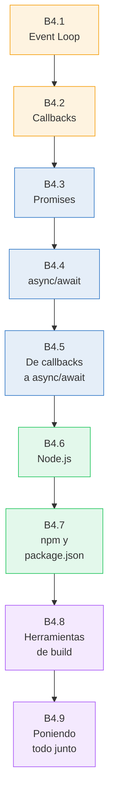
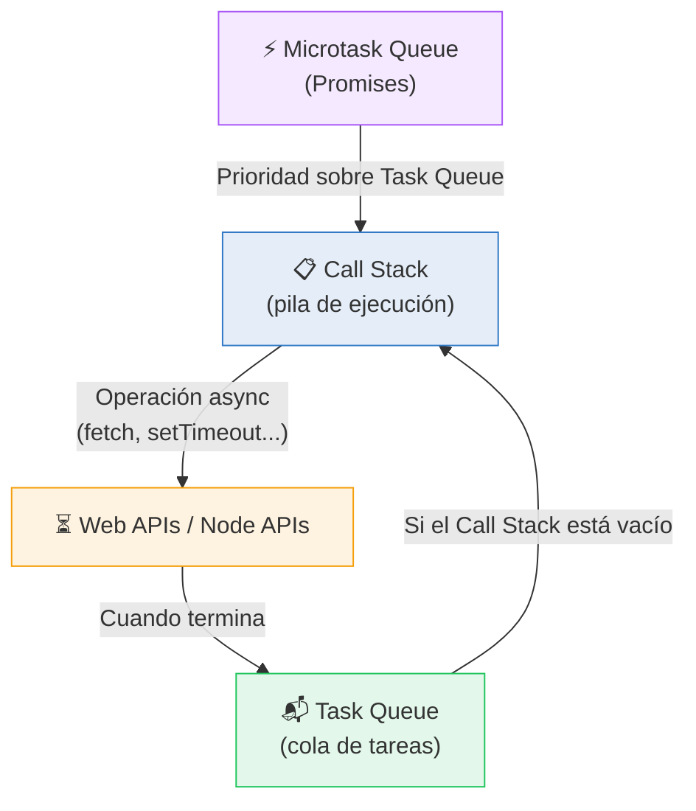
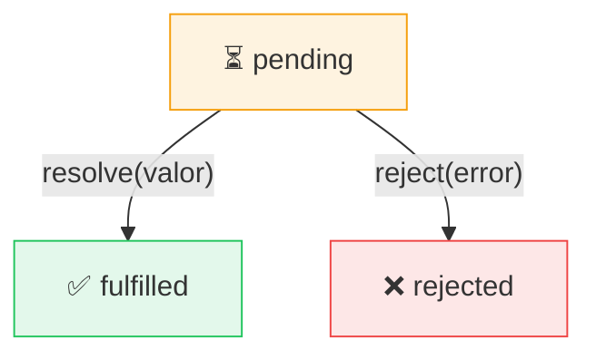
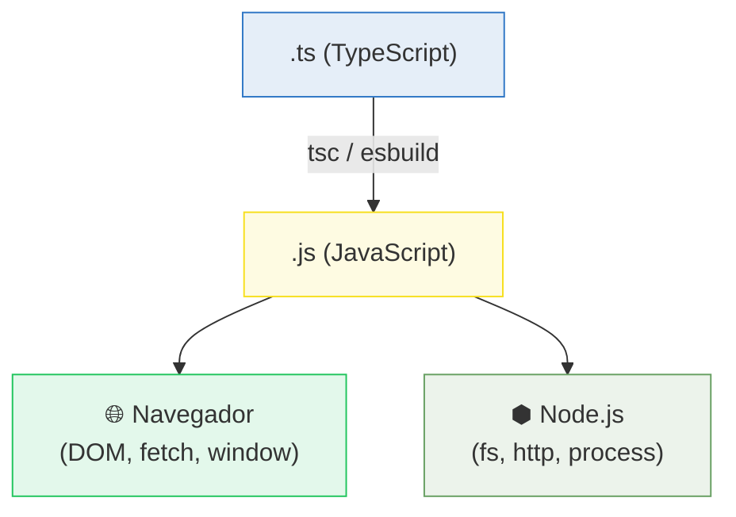
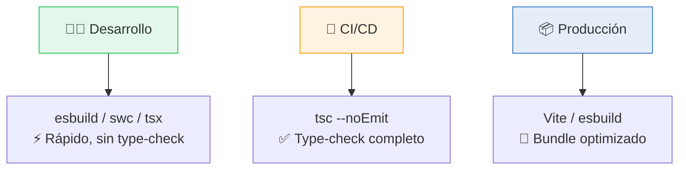

# :gear: Asincronía y herramientas

<div class="chapter-meta">
  <span class="meta-item">🕐 3-4 horas</span>
  <span class="meta-item">📊 Nivel: Principiante</span>
  <span class="meta-item">🎯 Semana 0</span>
</div>

<div class="chapter-objective">
  <span class="objective-icon">📌</span>
  <span class="objective-text">Al terminar este capítulo, entenderás el modelo asíncrono de JavaScript (event loop, Promises, async/await), sabrás usar npm y package.json, y conocerás las herramientas básicas para un proyecto TypeScript.</span>
</div>

<div class="chapter-map">



**Leyenda:** :orange_circle: Modelo asíncrono --- :blue_circle: Promises y async/await --- :green_circle: Node.js y npm --- :purple_circle: Herramientas de build

</div>

!!! quote "Contexto"
    Si ya programas en Python, sabes que `asyncio` es una elección: puedes escribir código síncrono toda tu vida. En JavaScript **no tienes esa opción**. Toda operación de red, lectura de archivos o temporizador es asíncrona por diseño. Entender este modelo es requisito previo para escribir TypeScript real.

<div class="connection-box">
<span class="connection-icon">🔗</span>
<span>Este capítulo asume que ya manejas las bases de JavaScript moderno del <a href="../bases-3-es6/">capítulo anterior: ES6+</a>. En particular, necesitarás arrow functions, destructuring y módulos ES para seguir los ejemplos de async/await.</span>
</div>

---

## B4.1 El event loop

JavaScript es **single-threaded**: solo tiene un hilo de ejecución. Pero logra ser no-bloqueante gracias al **event loop**, un mecanismo que delega operaciones lentas (red, disco, temporizadores) al entorno de ejecución (navegador o Node.js) y las recoge cuando terminan.



**Flujo simplificado:**

1. El código se ejecuta línea a línea en el **Call Stack**
2. Cuando encuentra una operación async (`fetch`, `setTimeout`, lectura de archivo), la **delega** al entorno
3. El Call Stack sigue ejecutando el código restante (no se bloquea)
4. Cuando la operación termina, su callback se coloca en la **Task Queue** (o **Microtask Queue** si es una Promise)
5. El event loop mueve callbacks al Call Stack **solo cuando este está vacío**
6. Las microtasks (Promises) tienen **prioridad** sobre las tasks (setTimeout, I/O)

```javascript
console.log("1. Inicio");

setTimeout(() => {
  console.log("4. setTimeout (task queue)");
}, 0);

Promise.resolve().then(() => {
  console.log("3. Promise (microtask queue)");
});

console.log("2. Fin del código síncrono");

// Salida:
// 1. Inicio
// 2. Fin del código síncrono
// 3. Promise (microtask queue)
// 4. setTimeout (task queue)
```

<div class="comparison" markdown>
<div class="lang-box python" markdown>

#### :snake: En Python

Python tiene el **GIL** (Global Interpreter Lock) y usa **threads reales** o `asyncio` con un event loop explícito. El modelo async es **opt-in**: debes importar `asyncio` y usar `asyncio.run()`.

```python
import asyncio

async def main():
    print("Inicio")
    await asyncio.sleep(1)
    print("Fin")

asyncio.run(main())  # Arrancas el event loop manualmente
```

</div>
<div class="lang-box typescript" markdown>

#### 🔷 En JavaScript

El event loop **siempre está corriendo**. No necesitas importar nada ni arrancarlo. Toda operación de I/O es async por defecto.

```javascript
console.log("Inicio");

setTimeout(() => {
  console.log("Fin");
}, 1000);

// El event loop ya está corriendo,
// no hay asyncio.run()
```

</div>
</div>

<div class="concept-question">
<h4>🔍 Pregunta conceptual</h4>
<p>Si JavaScript es single-threaded, ¿cómo es posible que pueda manejar miles de peticiones HTTP a la vez en un servidor Node.js? ¿Dónde se ejecutan realmente las operaciones de I/O?</p>
</div>

---

## B4.2 Callbacks

El patrón original de asincronía en JavaScript: pasas una **función** que se ejecutará cuando la operación termine.

```javascript
// Leer un archivo en Node.js (estilo callback)
const fs = require("fs");

fs.readFile("menu.json", "utf-8", (error, datos) => {
  if (error) {
    console.error("Error leyendo archivo:", error);
    return;
  }
  console.log("Contenido:", datos);
});

console.log("Esto se imprime ANTES que el contenido del archivo");
```

### Callback hell

Cuando necesitas encadenar operaciones asíncronas, los callbacks se anidan y el código se convierte en una pirámide ilegible:

```javascript
// ❌ Callback hell — "The Pyramid of Doom"
obtenerUsuario(id, (error, usuario) => {
  if (error) return manejarError(error);
  obtenerPedidos(usuario.id, (error, pedidos) => {
    if (error) return manejarError(error);
    obtenerDetalle(pedidos[0].id, (error, detalle) => {
      if (error) return manejarError(error);
      obtenerFactura(detalle.facturaId, (error, factura) => {
        if (error) return manejarError(error);
        console.log("Factura:", factura);
        // 🤯 Cuatro niveles de anidación para 4 operaciones secuenciales
      });
    });
  });
});
```

**Problemas de los callbacks:**

- **Anidación excesiva** — cada operación secuencial añade un nivel de indentación
- **Manejo de errores repetitivo** — hay que verificar `error` en cada callback
- **Inversión de control** — le entregas el control de ejecución a la función que llamas
- **Difícil de componer** — no puedes hacer fácilmente "ejecuta A y B en paralelo, luego C"

---

## B4.3 Promises

Una **Promise** (promesa) es un objeto que representa el resultado futuro de una operación asíncrona. Puede estar en uno de tres estados:

- **pending** — operación en curso
- **fulfilled** — terminó con éxito (tiene un valor)
- **rejected** — terminó con error (tiene un motivo)



### Crear una Promise

```javascript
const miPromesa = new Promise((resolve, reject) => {
  const exito = true;

  if (exito) {
    resolve("Operación completada"); // fulfilled
  } else {
    reject(new Error("Algo salió mal")); // rejected
  }
});
```

### Consumir con `.then()`, `.catch()`, `.finally()`

```javascript
fetch("https://api.example.com/menu")
  .then((response) => response.json())       // Si OK, parsea JSON
  .then((datos) => {
    console.log("Platos:", datos.platos);     // Usa los datos
  })
  .catch((error) => {
    console.error("Error:", error.message);   // Si falla cualquier paso
  })
  .finally(() => {
    console.log("Petición terminada");        // Siempre se ejecuta
  });
```

### Combinadores de Promises

```javascript
const p1 = fetch("/api/platos");
const p2 = fetch("/api/categorias");
const p3 = fetch("/api/alergenicos");

// Promise.all — espera a que TODAS terminen (falla si alguna falla)
const [platos, categorias, alergenos] = await Promise.all([p1, p2, p3]);

// Promise.race — devuelve la primera que termine (éxito O error)
const primera = await Promise.race([p1, p2]);

// Promise.allSettled — espera a todas, nunca falla
const resultados = await Promise.allSettled([p1, p2, p3]);
// [{ status: "fulfilled", value: ... }, { status: "rejected", reason: ... }, ...]

// Promise.any — devuelve la primera que tenga ÉXITO (ignora rechazos)
const primeraExitosa = await Promise.any([p1, p2, p3]);
```

<div class="comparison" markdown>
<div class="lang-box python" markdown>

#### :snake: En Python

Python tiene `concurrent.futures.Future` y `asyncio.Future`. Los combinadores son funciones de `asyncio`:

```python
import asyncio

# Equivalente a Promise.all
resultados = await asyncio.gather(
    obtener_platos(),
    obtener_categorias(),
    obtener_alergenos()
)

# Equivalente a Promise.race
hecho, pendientes = await asyncio.wait(
    [tarea1, tarea2],
    return_when=asyncio.FIRST_COMPLETED
)
```

</div>
<div class="lang-box typescript" markdown>

#### 🔷 En JavaScript

Las Promises son nativas del lenguaje. Los combinadores son **métodos estáticos** de `Promise`:

```javascript
// Esperar varias en paralelo
const [a, b, c] = await Promise.all([
  fetchPlatos(),
  fetchCategorias(),
  fetchAlergenos()
]);

// Primera que responda
const rápida = await Promise.race([api1(), api2()]);
```

</div>
</div>

<div class="concept-question">
<h4>🔍 Pregunta conceptual</h4>
<p>¿Cuál es la diferencia entre <code>Promise.all</code> y <code>Promise.allSettled</code>? ¿En qué situación usarías cada uno en una app de restaurante que consulta varios endpoints a la vez?</p>
</div>

---

## B4.4 async/await

`async/await` es azúcar sintáctico sobre Promises. Una función `async` siempre devuelve una Promise, y `await` pausa la ejecución **dentro de esa función** hasta que la Promise se resuelva.

```javascript
// Con .then() — legible pero verboso
function obtenerMenu() {
  return fetch("/api/menu")
    .then((res) => res.json())
    .then((data) => data.platos)
    .catch((err) => {
      console.error(err);
      return [];
    });
}

// Con async/await — lectura lineal, como código síncrono
async function obtenerMenu() {
  try {
    const res = await fetch("/api/menu");
    const data = await res.json();
    return data.platos;
  } catch (err) {
    console.error(err);
    return [];
  }
}
```

### Secuencial vs paralelo

```javascript
// ❌ SECUENCIAL — cada await espera al anterior (lento)
async function cargarDatos() {
  const platos = await fetch("/api/platos");        // 500ms
  const categorias = await fetch("/api/categorias"); // 500ms
  const alergenos = await fetch("/api/alergenos");   // 500ms
  // Total: ~1500ms 🐌
}

// ✅ PARALELO — lanza todas las peticiones a la vez
async function cargarDatos() {
  const [platos, categorias, alergenos] = await Promise.all([
    fetch("/api/platos"),        // ┐
    fetch("/api/categorias"),    // ├─ 500ms (las tres en paralelo)
    fetch("/api/alergenos"),     // ┘
  ]);
  // Total: ~500ms 🚀
}
```

!!! danger "Error frecuente"
    El error n.1 de principiantes: poner `await` dentro de un bucle `for` cuando las operaciones son independientes. Esto las ejecuta en serie. Usa `Promise.all(array.map(...))` para paralelizar.

    ```javascript
    // ❌ Secuencial (10 peticiones x 200ms = 2 segundos)
    for (const id of ids) {
      const plato = await fetch(`/api/platos/${id}`);
    }

    // ✅ Paralelo (10 peticiones en ~200ms)
    const platos = await Promise.all(
      ids.map((id) => fetch(`/api/platos/${id}`))
    );
    ```

### Manejo de errores con try/catch

```javascript
async function crearPedido(mesa, items) {
  try {
    const res = await fetch("/api/pedidos", {
      method: "POST",
      headers: { "Content-Type": "application/json" },
      body: JSON.stringify({ mesa, items }),
    });

    if (!res.ok) {
      throw new Error(`HTTP ${res.status}: ${res.statusText}`);
    }

    const pedido = await res.json();
    return pedido;
  } catch (error) {
    // Captura tanto errores de red como errores HTTP
    console.error("Error creando pedido:", error.message);
    throw error; // Re-lanza para que el caller decida qué hacer
  }
}
```

<div class="pro-tip">
<h4>💡 Consejo Pro</h4>
<p>En TypeScript, el tipo de retorno de una función <code>async</code> es siempre <code>Promise&lt;T&gt;</code>. Si escribes <code>async function getPlatos(): Promise&lt;Plato[]&gt;</code>, TypeScript verifica que tu <code>return</code> sea un <code>Plato[]</code> (o que la Promise se resuelva con uno). Esto añade seguridad que JavaScript puro no tiene.</p>
</div>

<div class="misconception-box" markdown>
<h4>❌ Error común</h4>
<p><strong>Mito:</strong> "async/await hace que el código sea síncrono"</p>
<p><strong>Realidad:</strong> async/await es azúcar sintáctico sobre Promises — el código sigue siendo asíncrono. <code>await</code> pausa solo la ejecución de esa función async, pero el event loop sigue procesando otros callbacks y eventos. Parece síncrono al leerlo, pero por debajo sigue siendo no-bloqueante.</p>
</div>

<div class="micro-exercise">
<h4>🧪 Micro-ejercicio (2 min)</h4>
<p>Abre la consola del navegador (F12) y ejecuta este código. Antes de ejecutarlo, predice el orden de los <code>console.log</code>:</p>

```javascript
console.log("A");
setTimeout(() => console.log("B"), 0);
Promise.resolve().then(() => console.log("C"));
console.log("D");
```

<p>Respuesta esperada: A, D, C, B. ¿Puedes explicar por qué C aparece antes que B?</p>
</div>

---

## B4.5 De callback hell a async/await

<div class="code-evolution" markdown>
<div class="evolution-header">📈 Evolución del código</div>
<div class="evolution-step">
<span class="step-label novato">v1 — Callbacks</span>

```javascript
// Callback hell: obtener datos de un pedido completo
function obtenerPedidoCompleto(pedidoId, callback) {
  obtenerPedido(pedidoId, (err, pedido) => {
    if (err) return callback(err);
    obtenerMesa(pedido.mesaId, (err, mesa) => {
      if (err) return callback(err);
      obtenerItems(pedido.id, (err, items) => {
        if (err) return callback(err);
        callback(null, { pedido, mesa, items });
      });
    });
  });
}

obtenerPedidoCompleto("p-123", (err, resultado) => {
  if (err) console.error(err);
  else console.log(resultado);
});
```

</div>
<div class="evolution-step">
<span class="step-label mejorado">v2 — Promises</span>

```javascript
// Cadena de Promises: plano, pero todavía verboso
function obtenerPedidoCompleto(pedidoId) {
  let pedidoData;
  return obtenerPedido(pedidoId)
    .then((pedido) => {
      pedidoData = pedido;
      return obtenerMesa(pedido.mesaId);
    })
    .then((mesa) => {
      return obtenerItems(pedidoData.id)
        .then((items) => ({ pedido: pedidoData, mesa, items }));
    })
    .catch((err) => {
      console.error("Error:", err);
      throw err;
    });
}

obtenerPedidoCompleto("p-123").then(console.log);
```

</div>
<div class="evolution-step">
<span class="step-label profesional">v3 — async/await</span>

```javascript
// async/await: limpio, lineal, fácil de leer
async function obtenerPedidoCompleto(pedidoId) {
  try {
    const pedido = await obtenerPedido(pedidoId);
    const mesa = await obtenerMesa(pedido.mesaId);
    const items = await obtenerItems(pedido.id);
    return { pedido, mesa, items };
  } catch (err) {
    console.error("Error:", err);
    throw err;
  }
}

const resultado = await obtenerPedidoCompleto("p-123");
console.log(resultado);
```

</div>
</div>

---

## B4.6 Node.js como runtime

**Node.js** es un runtime que permite ejecutar JavaScript **fuera del navegador**. Fue creado en 2009 por Ryan Dahl y usa el motor V8 de Chrome.

### ¿Por qué importa para TypeScript?

TypeScript se **compila** a JavaScript, y ese JavaScript se ejecuta en algún sitio. Los dos entornos principales son:

| Entorno | Uso | Ejemplo |
|---------|-----|---------|
| **Navegador** | Frontend, aplicaciones web | Chrome, Firefox, Safari |
| **Node.js** | Backend, scripts, herramientas CLI | Servidores, `tsc`, `npm` |



### Objetos globales en Node.js

```javascript
// Disponibles en Node.js (NO en el navegador)
console.log(process.env.NODE_ENV); // Variables de entorno
console.log(__dirname);             // Ruta del directorio actual (CommonJS)
console.log(__filename);            // Ruta del archivo actual (CommonJS)

// En ESM (import/export), usa import.meta
import { fileURLToPath } from "url";
import { dirname } from "path";

const __filename = fileURLToPath(import.meta.url);
const __dirname = dirname(__filename);
```

### CommonJS vs ES Modules

JavaScript tiene **dos sistemas de módulos** que coexisten, y entender la diferencia es fundamental:

```javascript
// ===== CommonJS (CJS) — el sistema original de Node.js =====
const fs = require("fs");              // Importar
module.exports = { miFunción };        // Exportar
module.exports = miClase;              // Exportar por defecto

// ===== ES Modules (ESM) — el estándar actual =====
import fs from "fs";                   // Importar por defecto
import { readFile } from "fs/promises"; // Importar nombrado
export function miFunción() { }        // Exportar nombrado
export default miClase;                // Exportar por defecto
```

| Característica | CommonJS | ES Modules |
|---------------|----------|------------|
| Sintaxis | `require()` / `module.exports` | `import` / `export` |
| Carga | **Síncrona** | **Asíncrona** |
| Extensión | `.js` (o `.cjs`) | `.mjs` (o `.js` con `"type": "module"`) |
| Uso en TS | Legacy, evitar | **Siempre usar ESM** |
| Top-level await | No | Sí |
| Tree shaking | No | Sí |

!!! tip "Regla para TypeScript"
    En proyectos TypeScript nuevos, **siempre usa ES Modules** (`import`/`export`). En `tsconfig.json` usa `"module": "ESNext"` o `"module": "Node16"` y en `package.json` añade `"type": "module"`.

---

## B4.7 npm y package.json

**npm** (Node Package Manager) es el gestor de paquetes de JavaScript. Es como pip para Python, pero con un ecosistema de **2 millones+ de paquetes**.

### package.json — el corazón del proyecto

```json title="package.json"
{
  "name": "makemenu",
  "version": "1.0.0",
  "description": "App de gestión de menús para restaurantes",
  "type": "module",                        // (1)!
  "main": "dist/index.js",
  "scripts": {                             // (2)!
    "dev": "vite",
    "build": "tsc && vite build",
    "preview": "vite preview",
    "typecheck": "tsc --noEmit",
    "lint": "eslint src/"
  },
  "dependencies": {                        // (3)!
    "vue": "^3.4.0",
    "vue-router": "^4.3.0",
    "pinia": "^2.1.0"
  },
  "devDependencies": {                     // (4)!
    "typescript": "^5.5.0",
    "vite": "^5.4.0",
    "@types/node": "^22.0.0",
    "eslint": "^9.0.0"
  }
}
```

1. `"type": "module"` activa ES Modules en Node.js. Sin esto, Node usa CommonJS.
2. Los `scripts` son comandos que ejecutas con `npm run <nombre>`. Es como el `Makefile` de un proyecto Python o la sección `[tool.taskipy]` de `pyproject.toml`.
3. `dependencies` — paquetes necesarios en producción (se instalan al hacer deploy).
4. `devDependencies` — solo para desarrollo (TypeScript, linters, test runners). No se incluyen en producción.

<div class="comparison" markdown>
<div class="lang-box python" markdown>

#### :snake: En Python

```toml title="pyproject.toml"
[project]
name = "makemenu"
version = "1.0.0"
dependencies = [
    "flask>=3.0",
    "sqlalchemy>=2.0",
]

[project.optional-dependencies]
dev = [
    "mypy>=1.10",
    "pytest>=8.0",
]

[project.scripts]
dev = "flask run --debug"
```

```bash
pip install -r requirements.txt
pip install -e ".[dev]"
```

</div>
<div class="lang-box typescript" markdown>

#### 🔷 En JavaScript/Node.js

```json title="package.json (resumen)"
{
  "dependencies": {
    "express": "^4.18.0"
  },
  "devDependencies": {
    "typescript": "^5.5.0"
  },
  "scripts": {
    "dev": "tsx watch src/index.ts"
  }
}
```

```bash
npm install            # Instala todo
npm install express    # Añade una dependencia
npm install -D tsx     # Añade una devDependency
npm run dev            # Ejecuta un script
```

</div>
</div>

### Comandos esenciales de npm

```bash
# Inicializar un proyecto nuevo
npm init -y                       # Crea package.json con defaults

# Instalar dependencias
npm install                       # Instala todo lo de package.json
npm install vue                   # Añade a dependencies
npm install -D typescript         # Añade a devDependencies (solo desarrollo)
npm install -g tsx                # Instala globalmente (no recomendado)

# Ejecutar scripts
npm run dev                       # Ejecuta el script "dev"
npm run build                     # Ejecuta el script "build"
npx tsc --init                    # Ejecuta un binario sin instalarlo globalmente

# Gestión
npm update                        # Actualiza paquetes según rangos de versión
npm audit                         # Verifica vulnerabilidades de seguridad
npm ls                            # Muestra árbol de dependencias
```

### Lock files

El fichero `package-lock.json` (o `pnpm-lock.yaml`, `yarn.lock`) fija las versiones **exactas** de todas las dependencias y sus subdependencias. Esto garantiza que todos los desarrolladores y el servidor de CI/CD instalen exactamente las mismas versiones.

| Python | JavaScript |
|--------|-----------|
| `requirements.txt` (con `pip freeze`) | `package-lock.json` |
| `poetry.lock` | `pnpm-lock.yaml` |
| `pyproject.toml` (rangos) | `package.json` (rangos) |

!!! warning "Siempre commitea el lock file"
    Añade `package-lock.json` a git. Si no lo haces, cada desarrollador puede acabar con versiones diferentes de las dependencias, causando bugs imposibles de reproducir.

<div class="micro-exercise">
<h4>🧪 Micro-ejercicio (2 min)</h4>
<p>Crea un directorio vacío, ejecuta <code>npm init -y</code>, y luego <code>npm install -D typescript</code>. Abre el <code>package.json</code> resultante. ¿En qué sección aparece TypeScript? ¿Por qué tiene el prefijo <code>^</code> en la versión? Pista: <code>^5.5.0</code> significa "compatible con 5.5.0" (acepta parches y minors, no majors).</p>
</div>

---

## B4.8 Herramientas de build

El ecosistema TypeScript tiene múltiples herramientas. Cada una cubre una necesidad diferente:

### tsc — el compilador de TypeScript

`tsc` es la herramienta oficial. Hace **dos cosas**:

1. **Verifica tipos** — encuentra errores antes de ejecutar
2. **Transpila** — convierte `.ts` a `.js`

```bash
# Verificar tipos sin generar archivos (ideal para CI)
npx tsc --noEmit

# Compilar todo el proyecto
npx tsc

# Watch mode: recompila al guardar
npx tsc --watch
```

### Vite — servidor de desarrollo y bundler

**Vite** (pronunciado "vit", del francés "rápido") es la herramienta moderna para desarrollo frontend. Usa **esbuild** internamente para transpilar y **Rollup** para el build de producción.

```bash
# Crear un proyecto con Vite
npm create vite@latest mi-app -- --template vue-ts

# Estructura generada
mi-app/
├── index.html          # Punto de entrada
├── package.json
├── tsconfig.json
├── vite.config.ts      # Configuración de Vite
└── src/
    ├── main.ts         # Entry point de la app
    ├── App.vue
    └── components/
```

```bash
# Desarrollo (servidor con hot reload)
npm run dev       # Abre http://localhost:5173

# Build de producción
npm run build     # Genera dist/ con archivos optimizados

# Preview del build
npm run preview   # Sirve dist/ localmente para verificar
```

### esbuild y swc — transpiladores ultra-rápidos

Son alternativas escritas en **Go** (esbuild) y **Rust** (swc) que transpilan TypeScript a JavaScript **10-100x más rápido** que `tsc`. El truco: **no verifican tipos**, solo eliminan las anotaciones de tipo.



### Resumen de herramientas

| Herramienta | Escrita en | Verifica tipos | Velocidad | Uso ideal |
|-------------|-----------|---------------|-----------|-----------|
| `tsc` | TypeScript | **Sí** | Lenta | CI/CD, generar `.d.ts` |
| `tsx` | — (usa esbuild) | No | Rápida | Ejecutar scripts en desarrollo |
| `esbuild` | Go | No | Muy rápida | Bundling, transpilación |
| `swc` | Rust | No | Muy rápida | Alternativa a esbuild |
| `Vite` | JS (usa esbuild) | No | Rápida | Desarrollo frontend + build |

<div class="pro-tip">
<h4>💡 Consejo Pro</h4>
<p>La estrategia profesional estándar es: <strong>esbuild/tsx para desarrollo</strong> (velocidad), <strong>tsc --noEmit en pre-commit hooks</strong> (seguridad), y <strong>tsc + bundler en CI/CD</strong> (build final). Nunca hagas deploy sin verificar tipos con <code>tsc</code>.</p>
</div>

<div class="concept-question">
<h4>🔍 Pregunta conceptual</h4>
<p>Si <code>esbuild</code> y <code>swc</code> no verifican tipos, ¿por qué alguien los usaría en vez de <code>tsc</code>? ¿Qué ventajas ofrece separar la verificación de tipos de la transpilación?</p>
</div>

---

## B4.9 Poniendo todo junto

Así se ve un flujo completo de proyecto TypeScript moderno:

```bash
# 1. Crear proyecto
mkdir makemenu && cd makemenu
npm init -y

# 2. Instalar dependencias
npm install -D typescript @types/node tsx

# 3. Configurar TypeScript
npx tsc --init
# Editar tsconfig.json: strict: true, module: "ESNext", etc.

# 4. Crear estructura
mkdir src
```

```typescript title="src/index.ts"
interface Plato {
  nombre: string;
  precio: number;
  disponible: boolean;
}

// Función async que simula obtener platos de una API
async function obtenerPlatos(): Promise<Plato[]> {
  // Simula una petición de red con un delay
  const datos = await new Promise<Plato[]>((resolve) => {
    setTimeout(() => {
      resolve([
        { nombre: "Paella", precio: 14.5, disponible: true },
        { nombre: "Gazpacho", precio: 8.0, disponible: true },
        { nombre: "Cochinillo", precio: 22.0, disponible: false },
      ]);
    }, 500);
  });

  return datos;
}

// Top-level await (requiere ESM + ES2022+)
const platos = await obtenerPlatos();
const disponibles = platos.filter((p) => p.disponible);
console.log("Platos disponibles:", disponibles);
```

```bash
# 5. Ejecutar en desarrollo
npx tsx src/index.ts

# 6. Verificar tipos
npx tsc --noEmit

# 7. Scripts en package.json
# "dev": "tsx watch src/index.ts"
# "typecheck": "tsc --noEmit"
# "build": "tsc"
```

---

## Errores comunes

<div class="misconception-box">
<h4>⚠️ Errores comunes</h4>
<ul>
<li><span class="wrong">❌ Mito:</span> "JavaScript es single-threaded, así que no puede hacer cosas en paralelo" → <span class="right">✅ Realidad:</span> El código JS corre en un hilo, pero las operaciones de I/O (red, disco) las ejecuta el sistema operativo en paralelo. El event loop coordina los resultados.</li>
<li><span class="wrong">❌ Mito:</span> "<code>async/await</code> bloquea el hilo hasta que la Promise se resuelva" → <span class="right">✅ Realidad:</span> <code>await</code> pausa solo la ejecución de esa función async. El event loop sigue procesando otros callbacks y eventos mientras espera.</li>
<li><span class="wrong">❌ Mito:</span> "<code>npm install</code> y <code>pip install</code> funcionan igual" → <span class="right">✅ Realidad:</span> npm instala en <code>node_modules/</code> local al proyecto (por defecto). pip instala globalmente o en el virtualenv activo. npm crea un árbol de dependencias anidado; pip usa un espacio plano.</li>
</ul>
</div>

---

## :link: Recursos

| Recurso | Enlace |
|---------|--------|
| MDN — Event loop | [developer.mozilla.org/en-US/docs/Web/JavaScript/Event_loop](https://developer.mozilla.org/en-US/docs/Web/JavaScript/Event_loop) |
| MDN — Promises | [developer.mozilla.org/en-US/docs/Web/JavaScript/Reference/Global_Objects/Promise](https://developer.mozilla.org/en-US/docs/Web/JavaScript/Reference/Global_Objects/Promise) |
| MDN — async/await | [developer.mozilla.org/en-US/docs/Learn/JavaScript/Asynchronous](https://developer.mozilla.org/en-US/docs/Learn/JavaScript/Asynchronous) |
| Node.js docs | [nodejs.org/docs/latest/api/](https://nodejs.org/docs/latest/api/) |
| npm docs | [docs.npmjs.com](https://docs.npmjs.com/) |
| Vite docs | [vite.dev/guide/](https://vite.dev/guide/) |

---

## 🎯 Ejercicios

??? question "Ejercicio 1: Secuencial vs paralelo"
    Tienes tres funciones que simulan peticiones a una API. Cada una tarda 1 segundo:

    ```javascript
    function fetchPlatos() {
      return new Promise((resolve) =>
        setTimeout(() => resolve(["Paella", "Tortilla"]), 1000)
      );
    }
    function fetchBebidas() {
      return new Promise((resolve) =>
        setTimeout(() => resolve(["Agua", "Vino"]), 1000)
      );
    }
    function fetchPostres() {
      return new Promise((resolve) =>
        setTimeout(() => resolve(["Flan", "Tarta"]), 1000)
      );
    }
    ```

    **Tarea:** Escribe una función `async` que obtenga los tres resultados. Primero hazlo de forma **secuencial** (debería tardar ~3s), luego de forma **paralela** (debería tardar ~1s). Mide el tiempo con `console.time` / `console.timeEnd`.

    ??? success "Solución"
        ```javascript
        // Secuencial (~3 segundos)
        async function menuSecuencial() {
          console.time("secuencial");
          const platos = await fetchPlatos();
          const bebidas = await fetchBebidas();
          const postres = await fetchPostres();
          console.timeEnd("secuencial"); // ~3000ms
          return { platos, bebidas, postres };
        }

        // Paralelo (~1 segundo)
        async function menuParalelo() {
          console.time("paralelo");
          const [platos, bebidas, postres] = await Promise.all([
            fetchPlatos(),
            fetchBebidas(),
            fetchPostres(),
          ]);
          console.timeEnd("paralelo"); // ~1000ms
          return { platos, bebidas, postres };
        }

        await menuSecuencial();
        await menuParalelo();
        ```

??? question "Ejercicio 2: Manejo de errores con allSettled"
    Una de tus APIs puede fallar aleatoriamente. Escribe una función que use `Promise.allSettled` para intentar obtener datos de tres endpoints. Debe devolver un objeto con los datos disponibles y un array de errores.

    ```javascript
    function fetchConFallo(url) {
      return new Promise((resolve, reject) => {
        setTimeout(() => {
          if (Math.random() > 0.5) {
            resolve({ url, data: "OK" });
          } else {
            reject(new Error(`Fallo en ${url}`));
          }
        }, 500);
      });
    }
    ```

    ??? success "Solución"
        ```javascript
        async function obtenerDatosResilientmente() {
          const urls = ["/api/platos", "/api/bebidas", "/api/postres"];

          const resultados = await Promise.allSettled(
            urls.map((url) => fetchConFallo(url))
          );

          const datos = [];
          const errores = [];

          for (const resultado of resultados) {
            if (resultado.status === "fulfilled") {
              datos.push(resultado.value);
            } else {
              errores.push(resultado.reason.message);
            }
          }

          return { datos, errores };
        }

        const { datos, errores } = await obtenerDatosResilientmente();
        console.log("Datos obtenidos:", datos);
        console.log("Errores:", errores);
        ```

??? question "Ejercicio 3: Configurar un proyecto desde cero"
    Configura un proyecto TypeScript completo desde la terminal:

    1. Crea un directorio `async-demo`
    2. Inicializa `package.json` con `"type": "module"`
    3. Instala TypeScript y tsx como devDependencies
    4. Crea un `tsconfig.json` con `strict: true`, target `ES2022`, module `ESNext`
    5. Escribe un `src/index.ts` que use `async/await` para simular obtener un menú
    6. Añade scripts `dev` y `typecheck` a `package.json`
    7. Ejecuta con `npx tsx src/index.ts` y verifica tipos con `npx tsc --noEmit`

    ??? success "Solución"
        ```bash
        mkdir async-demo && cd async-demo
        npm init -y
        # Editar package.json: añadir "type": "module"
        npm install -D typescript tsx
        npx tsc --init
        # Editar tsconfig.json según indicado
        mkdir src
        ```

        ```typescript title="src/index.ts"
        interface MenuItem {
          nombre: string;
          precio: number;
        }

        async function getMenu(): Promise<MenuItem[]> {
          return new Promise((resolve) => {
            setTimeout(() => {
              resolve([
                { nombre: "Paella Valenciana", precio: 14.5 },
                { nombre: "Gazpacho Andaluz", precio: 8.0 },
              ]);
            }, 300);
          });
        }

        const menu = await getMenu();
        for (const item of menu) {
          console.log(`${item.nombre}: ${item.precio}€`);
        }
        ```

        ```json title="package.json — scripts"
        {
          "scripts": {
            "dev": "tsx watch src/index.ts",
            "typecheck": "tsc --noEmit"
          }
        }
        ```

        ```bash
        npx tsx src/index.ts      # Ejecuta directamente
        npx tsc --noEmit          # Verifica tipos sin generar JS
        ```

---

## :brain: Flashcards de repaso

<div class="flashcard">
<div class="front">¿Qué es el event loop?</div>
<div class="back">Un mecanismo que permite a JavaScript (single-threaded) manejar operaciones asíncronas. Delega I/O al sistema operativo y recoge resultados cuando el Call Stack está vacío.</div>
</div>

<div class="flashcard">
<div class="front">¿Cuáles son los tres estados de una Promise?</div>
<div class="back"><strong>pending</strong> (en curso), <strong>fulfilled</strong> (éxito con valor) y <strong>rejected</strong> (error con motivo). Una vez resuelta, no puede cambiar de estado.</div>
</div>

<div class="flashcard">
<div class="front">¿Cuál es la diferencia entre <code>Promise.all</code> y <code>Promise.allSettled</code>?</div>
<div class="back"><code>Promise.all</code> falla si cualquier Promise falla. <code>Promise.allSettled</code> espera a todas y devuelve el resultado de cada una (éxito o fallo), nunca rechaza.</div>
</div>

<div class="flashcard">
<div class="front">¿Qué diferencia hay entre <code>dependencies</code> y <code>devDependencies</code>?</div>
<div class="back"><code>dependencies</code> se necesitan en producción (express, vue). <code>devDependencies</code> solo para desarrollo (typescript, eslint). En producción se instalan solo las <code>dependencies</code>.</div>
</div>

<div class="flashcard">
<div class="front">¿Qué hace <code>tsc --noEmit</code>?</div>
<div class="back">Verifica los tipos de todo el proyecto sin generar archivos <code>.js</code>. Es el comando ideal para CI/CD y pre-commit hooks.</div>
</div>

<div class="flashcard">
<div class="front">¿Por qué <code>esbuild</code> y <code>swc</code> son más rápidos que <code>tsc</code>?</div>
<div class="back">Están escritos en Go y Rust respectivamente, y no verifican tipos: solo eliminan las anotaciones de tipo. La verificación de tipos es la parte lenta de <code>tsc</code>.</div>
</div>

<div class="flashcard">
<div class="front">CommonJS vs ES Modules: ¿cuál usar en TypeScript?</div>
<div class="back">Siempre ES Modules (<code>import</code>/<code>export</code>). CommonJS (<code>require</code>/<code>module.exports</code>) es legacy. En <code>package.json</code> añade <code>"type": "module"</code>.</div>
</div>

---

## :video_game: Quiz interactivo

<div class="quiz" data-quiz-id="bases4-q1">
<h4>Pregunta 1: ¿Qué se imprime primero?</h4>

```javascript
console.log("A");
setTimeout(() => console.log("B"), 0);
Promise.resolve().then(() => console.log("C"));
console.log("D");
```

<button class="quiz-option" data-correct="false">A, B, C, D</button>
<button class="quiz-option" data-correct="false">A, C, B, D</button>
<button class="quiz-option" data-correct="true">A, D, C, B</button>
<button class="quiz-option" data-correct="false">A, D, B, C</button>
<div class="quiz-feedback" data-correct="¡Correcto! El código síncrono va primero (A, D), luego las microtasks (Promises → C), y finalmente las tasks (setTimeout → B)." data-incorrect="Incorrecto. Recuerda: código síncrono primero, microtasks (Promises) segundo, tasks (setTimeout) al final."></div>
</div>

<div class="quiz" data-quiz-id="bases4-q2">
<h4>Pregunta 2: ¿Cuál es la forma correcta de ejecutar tres peticiones independientes en paralelo?</h4>
<button class="quiz-option" data-correct="false"><code>const a = await f1(); const b = await f2(); const c = await f3();</code></button>
<button class="quiz-option" data-correct="true"><code>const [a, b, c] = await Promise.all([f1(), f2(), f3()]);</code></button>
<button class="quiz-option" data-correct="false"><code>await f1(); await f2(); await f3();</code></button>
<button class="quiz-option" data-correct="false"><code>Promise.all(await f1(), await f2(), await f3());</code></button>
<div class="quiz-feedback" data-correct="¡Correcto! Promise.all recibe un array de Promises ya iniciadas y espera a que todas terminen." data-incorrect="Incorrecto. Usar await secuencialmente ejecuta cada petición una tras otra. Promise.all([f1(), f2(), f3()]) lanza las tres a la vez."></div>
</div>

<div class="quiz" data-quiz-id="bases4-q3">
<h4>Pregunta 3: ¿Dónde se instalan los paquetes con <code>npm install</code>?</h4>
<button class="quiz-option" data-correct="false">Globalmente en el sistema</button>
<button class="quiz-option" data-correct="true">En la carpeta <code>node_modules/</code> local del proyecto</button>
<button class="quiz-option" data-correct="false">En el virtualenv activo</button>
<button class="quiz-option" data-correct="false">En <code>~/.npm/packages/</code></button>
<div class="quiz-feedback" data-correct="¡Correcto! npm instala por defecto en node_modules/ dentro del directorio del proyecto. Es local, no global." data-incorrect="Incorrecto. A diferencia de pip, npm instala localmente en node_modules/ del proyecto. Solo con -g instala globalmente."></div>
</div>

---

<div class="connection-box">
<span class="connection-icon">🔗</span>
<span>Con este capítulo completas la <strong>Parte 0 — Bases</strong>. Todo lo que has aprendido aquí (async/await, npm, herramientas de build) lo usarás desde el primer día en la <a href="../01-bienvenido/">Parte I, Capítulo 1: Bienvenido a TypeScript</a>, donde configurarás tu primer proyecto TypeScript real.</span>
</div>

<div class="ejercicio-guiado">
<h4>🏋️ Ejercicio guiado</h4>

Construye un simulador de cocina asíncrona para MakeMenu donde cada plato tarda un tiempo distinto en prepararse, los pedidos se procesan en paralelo, y los errores se manejan correctamente:

1. Crea una función `prepararPlato(nombre, tiempoMs)` que devuelva una `Promise` que se resuelva después de `tiempoMs` milisegundos con el mensaje `"✅ [nombre] listo"` — usa `setTimeout` dentro de `new Promise()`
2. Crea una función `platoQueFalla(nombre)` que devuelva una `Promise` que se rechace con `"❌ Sin ingredientes para [nombre]"` después de 500ms — esto simula un error en cocina
3. Escribe una función `async` llamada `procesarPedido(platos)` que use `Promise.all()` para preparar todos los platos en paralelo y devuelva un array con los resultados — mide el tiempo total con `Date.now()`
4. Escribe una función `procesarPedidoSeguro(platos)` que use `Promise.allSettled()` para que un plato que falle no cancele los demás — filtra los resultados en `fulfilled` y `rejected` y muestra un resumen
5. Implementa un flujo secuencial con `async/await` y un bucle `for...of`: prepara 3 platos uno tras otro (no en paralelo) y compara el tiempo total con la versión paralela
6. Envuelve todo en un `try/catch` y demuestra qué pasa cuando usas `Promise.all()` con un plato que falla vs cuando usas `Promise.allSettled()`

??? success "Solución completa"
    ```javascript
    // --- 1. Preparar plato (Promise con setTimeout) ---
    function prepararPlato(nombre, tiempoMs) {
      return new Promise((resolve) => {
        console.log(`🍳 Preparando ${nombre}...`);
        setTimeout(() => {
          resolve(`✅ ${nombre} listo`);
        }, tiempoMs);
      });
    }

    // --- 2. Plato que falla ---
    function platoQueFalla(nombre) {
      return new Promise((_, reject) => {
        console.log(`🍳 Preparando ${nombre}...`);
        setTimeout(() => {
          reject(`❌ Sin ingredientes para ${nombre}`);
        }, 500);
      });
    }

    // --- 3. Pedido en paralelo con Promise.all ---
    async function procesarPedido(platos) {
      const inicio = Date.now();
      console.log("\n📋 Procesando pedido en paralelo...");

      try {
        const resultados = await Promise.all(platos);
        const tiempo = Date.now() - inicio;
        console.log("Resultados:", resultados);
        console.log(`⏱️  Tiempo total (paralelo): ${tiempo}ms`);
        return resultados;
      } catch (error) {
        console.log(`💥 Pedido cancelado: ${error}`);
        throw error;
      }
    }

    // --- 4. Pedido seguro con Promise.allSettled ---
    async function procesarPedidoSeguro(platos) {
      const inicio = Date.now();
      console.log("\n📋 Procesando pedido seguro...");

      const resultados = await Promise.allSettled(platos);
      const tiempo = Date.now() - inicio;

      const exitosos = resultados
        .filter((r) => r.status === "fulfilled")
        .map((r) => r.value);

      const fallidos = resultados
        .filter((r) => r.status === "rejected")
        .map((r) => r.reason);

      console.log(`✅ Listos (${exitosos.length}):`, exitosos);
      console.log(`❌ Fallaron (${fallidos.length}):`, fallidos);
      console.log(`⏱️  Tiempo total: ${tiempo}ms`);

      return { exitosos, fallidos };
    }

    // --- 5. Flujo secuencial ---
    async function procesarSecuencial() {
      const inicio = Date.now();
      console.log("\n📋 Procesando pedido secuencial...");

      const platosEnOrden = [
        { nombre: "Bruschetta", tiempo: 1000 },
        { nombre: "Paella", tiempo: 2000 },
        { nombre: "Tiramisú", tiempo: 800 },
      ];

      const resultados = [];
      for (const plato of platosEnOrden) {
        const resultado = await prepararPlato(plato.nombre, plato.tiempo);
        resultados.push(resultado);
        console.log(resultado);
      }

      const tiempo = Date.now() - inicio;
      console.log(`⏱️  Tiempo total (secuencial): ${tiempo}ms`);
      // ~3800ms secuencial vs ~2000ms paralelo
      return resultados;
    }

    // --- 6. Ejecutar todo ---
    async function main() {
      // Paralelo — todos exitosos
      await procesarPedido([
        prepararPlato("Bruschetta", 1000),
        prepararPlato("Paella", 2000),
        prepararPlato("Tiramisú", 800),
      ]);

      // Paralelo — uno falla → Promise.all cancela todo
      try {
        await procesarPedido([
          prepararPlato("Gazpacho", 1000),
          platoQueFalla("Risotto"),   // falla a los 500ms
          prepararPlato("Ensalada", 1500),
        ]);
      } catch {
        console.log("(Promise.all falla si cualquier plato falla)");
      }

      // Seguro — allSettled no cancela los demás
      await procesarPedidoSeguro([
        prepararPlato("Gazpacho", 1000),
        platoQueFalla("Risotto"),
        prepararPlato("Ensalada", 1500),
      ]);
      // ✅ Listos: ["✅ Gazpacho listo", "✅ Ensalada listo"]
      // ❌ Fallaron: ["❌ Sin ingredientes para Risotto"]

      // Secuencial vs paralelo
      await procesarSecuencial();
    }

    main();
    ```

</div>

<div class="real-errors">
<h4>🐛 Errores reales de asincronía en JavaScript</h4>

Estos son errores que verás en la consola del navegador o en Node.js cuando trabajes con código asíncrono. Aprende a reconocerlos y solucionarlos:

**1. `Uncaught (in promise) TypeError: Cannot read properties of undefined (reading 'json')`**

```javascript
// ❌ Código que causa el error
async function obtenerPlatos() {
  const datos = await fetch("/api/platos");
  const platos = await datos.json();  // Si la URL es incorrecta,
  return platos.items;                // datos puede no tener .json()
}
```

```javascript
// ✅ Solución: verificar la respuesta antes de parsear
async function obtenerPlatos() {
  const res = await fetch("/api/platos");
  if (!res.ok) {
    throw new Error(`HTTP ${res.status}: ${res.statusText}`);
  }
  const datos = await res.json();
  return datos.items;
}
```

**Causa:** `fetch` no lanza un error cuando el servidor devuelve 404 o 500. Solo rechaza si hay un fallo de red. Debes verificar `res.ok` manualmente.

---

**2. `TypeError: fetch is not a function`**

```javascript
// ❌ Ejecutar en Node.js < 18 sin polyfill
const res = await fetch("https://api.example.com/menu");
```

```javascript
// ✅ Solución A: usar Node.js 18+ (fetch es global)
// ✅ Solución B: instalar node-fetch para versiones anteriores
import fetch from "node-fetch";
const res = await fetch("https://api.example.com/menu");
```

**Causa:** `fetch` es una API del navegador. En Node.js solo es nativo a partir de la version 18. En versiones anteriores necesitas un paquete como `node-fetch`.

---

**3. `Uncaught (in promise) Error: ...` (Promise sin .catch ni try/catch)**

```javascript
// ❌ Promise rechazada sin manejo de errores
async function cargarMenu() {
  const res = await fetch("/api/menu-inexistente");
  const data = await res.json(); // Falla si la respuesta no es JSON
  return data;
}
cargarMenu(); // ← Sin .catch() ni try/catch: el error se "traga"
```

```javascript
// ✅ Solución: siempre manejar el rechazo
cargarMenu()
  .then((data) => console.log(data))
  .catch((err) => console.error("Error cargando menú:", err));

// O con try/catch dentro de la función
async function cargarMenuSeguro() {
  try {
    const res = await fetch("/api/menu");
    if (!res.ok) throw new Error(`HTTP ${res.status}`);
    return await res.json();
  } catch (err) {
    console.error("Error:", err.message);
    return null;
  }
}
```

**Causa:** Toda Promise rechazada debe tener un handler de error. Sin `.catch()` o `try/catch`, Node.js termina el proceso con `UnhandledPromiseRejection` y el navegador muestra una advertencia en consola.

---

**4. `await is only valid in async functions and the top level bodies of modules`**

```javascript
// ❌ Usar await fuera de una función async
function obtenerDatos() {
  const res = await fetch("/api/datos"); // SyntaxError
  return res.json();
}
```

```javascript
// ✅ Solución: marcar la función como async
async function obtenerDatos() {
  const res = await fetch("/api/datos");
  return res.json();
}

// ✅ O usar top-level await en un módulo ES
// (requiere "type": "module" en package.json)
const res = await fetch("/api/datos");
```

**Causa:** `await` solo puede usarse dentro de funciones marcadas con `async` o en el nivel superior de un modulo ES. Si estás en un script CommonJS o en una función normal, necesitas `async`.

---

**5. `TypeError: Cannot use 'in' operator to search for 'default' in ...` (mezclar CJS y ESM)**

```javascript
// ❌ Mezclar import con un paquete que solo exporta CommonJS
import miPaquete from "paquete-legacy";
// A veces devuelve { default: { default: ... } } en lugar del valor esperado
```

```javascript
// ✅ Solución: usar import con destructuring o verificar la estructura
import miPaquete from "paquete-legacy";
const valor = miPaquete.default ?? miPaquete;

// ✅ O usar createRequire para paquetes CJS en un contexto ESM
import { createRequire } from "module";
const require = createRequire(import.meta.url);
const miPaquete = require("paquete-legacy");
```

**Causa:** Algunos paquetes npm antiguos solo exportan CommonJS. Cuando los importas con `import` en un proyecto ESM, la interoperabilidad entre sistemas de modulos puede producir resultados inesperados.

</div>

<div class="checkpoint">
<h4>🏁 Checkpoint</h4>
<p>Si puedes: (1) explicar qué hace el event loop y por qué las Promises tienen prioridad sobre setTimeout, (2) escribir una función <code>async</code> que use <code>Promise.all</code> para ejecutar peticiones en paralelo, y (3) inicializar un proyecto con <code>npm</code>, instalar dependencias y ejecutar scripts — estás listo para la Parte I.</p>
</div>

<div class="mini-project">
<h4>🛠️ Mini-proyecto: Monitor de estado de APIs de restaurante</h4>

<p>Construye un monitor que consulte varios endpoints de la API de un restaurante, mida tiempos de respuesta y genere un reporte de estado. Este proyecto integra <strong>async/await</strong>, <strong>Promise.all</strong>, <strong>Promise.allSettled</strong>, manejo de errores y medición de rendimiento.</p>

---

??? question "Paso 1: Crear las funciones simuladoras de API"
    Crea funciones que simulen endpoints de una API de restaurante con tiempos de respuesta variables y posibilidad de fallo. Cada función debe devolver una Promise que se resuelva (o rechace) tras un `setTimeout`.

    - `fetchMenu()` — responde en 200ms, siempre exitosa
    - `fetchReservas()` — responde en 500ms, falla el 30% de las veces
    - `fetchInventario()` — responde en 800ms, siempre exitosa
    - `fetchResenas()` — responde en 1200ms, falla el 50% de las veces

    ??? success "Solución"
        ```javascript
        function fetchMenu() {
          return new Promise((resolve) => {
            setTimeout(() => {
              resolve({
                endpoint: "/api/menu",
                datos: ["Paella", "Gazpacho", "Tortilla", "Croquetas"],
                items: 4,
              });
            }, 200);
          });
        }

        function fetchReservas() {
          return new Promise((resolve, reject) => {
            setTimeout(() => {
              if (Math.random() > 0.3) {
                resolve({
                  endpoint: "/api/reservas",
                  datos: [
                    { mesa: 1, hora: "20:00" },
                    { mesa: 5, hora: "21:30" },
                  ],
                  items: 2,
                });
              } else {
                reject(new Error("Servicio de reservas no disponible"));
              }
            }, 500);
          });
        }

        function fetchInventario() {
          return new Promise((resolve) => {
            setTimeout(() => {
              resolve({
                endpoint: "/api/inventario",
                datos: { tomates: 50, aceite: 20, arroz: 30 },
                items: 3,
              });
            }, 800);
          });
        }

        function fetchResenas() {
          return new Promise((resolve, reject) => {
            setTimeout(() => {
              if (Math.random() > 0.5) {
                resolve({
                  endpoint: "/api/resenas",
                  datos: [
                    { puntuación: 5, texto: "Excelente" },
                    { puntuación: 4, texto: "Muy bueno" },
                  ],
                  items: 2,
                });
              } else {
                reject(new Error("Servicio de reseñas en mantenimiento"));
              }
            }, 1200);
          });
        }
        ```

??? question "Paso 2: Crear la función de medición de tiempo"
    Escribe una función `medirTiempo(nombre, promesa)` que reciba un nombre descriptivo y una Promise, y devuelva un objeto con el nombre, el resultado (o el error), y el tiempo que tardo en milisegundos. Usa `performance.now()` o `Date.now()` para medir.

    ??? success "Solución"
        ```javascript
        async function medirTiempo(nombre, promesa) {
          const inicio = Date.now();
          try {
            const resultado = await promesa;
            const duración = Date.now() - inicio;
            return {
              nombre,
              estado: "ok",
              duración,
              datos: resultado,
            };
          } catch (error) {
            const duración = Date.now() - inicio;
            return {
              nombre,
              estado: "error",
              duración,
              error: error.message,
            };
          }
        }
        ```

??? question "Paso 3: Consultar todos los endpoints en paralelo y generar el reporte"
    Usa `Promise.allSettled` junto con tu función `medirTiempo` para lanzar las cuatro peticiones en paralelo. Luego genera un reporte en consola que muestre:

    - El estado de cada endpoint (OK o ERROR)
    - El tiempo de respuesta de cada uno
    - El tiempo total de la operación (deberia ser ~1200ms, no la suma)
    - Un resumen: cuantos endpoints respondieron y cuantos fallaron

    ??? success "Solución"
        ```javascript
        async function monitorearAPIs() {
          console.log("=== Monitor de APIs del Restaurante ===\n");
          console.log("Consultando endpoints...\n");

          const inicioTotal = Date.now();

          // Lanzar todas las peticiones en paralelo con medición
          const resultados = await Promise.all([
            medirTiempo("Menu", fetchMenu()),
            medirTiempo("Reservas", fetchReservas()),
            medirTiempo("Inventario", fetchInventario()),
            medirTiempo("Reseñas", fetchResenas()),
          ]);

          const duracionTotal = Date.now() - inicioTotal;

          // Generar reporte
          console.log("--- Reporte de Estado ---\n");

          let exitosos = 0;
          let fallidos = 0;

          for (const r of resultados) {
            const icono = r.estado === "ok" ? "✅" : "❌";
            const detalle =
              r.estado === "ok"
                ? `${r.datos.items} items obtenidos`
                : r.error;

            console.log(
              `${icono} ${r.nombre.padEnd(12)} | ${r.duración}ms | ${detalle}`
            );

            if (r.estado === "ok") exitosos++;
            else fallidos++;
          }

          console.log(`\n--- Resumen ---`);
          console.log(`Tiempo total:    ${duracionTotal}ms`);
          console.log(`Exitosos:        ${exitosos}/4`);
          console.log(`Fallidos:        ${fallidos}/4`);
          console.log(
            `Disponibilidad:  ${((exitosos / 4) * 100).toFixed(0)}%`
          );
        }

        await monitorearAPIs();
        ```

??? question "Paso 4 (Bonus): Reintentar los endpoints que fallaron"
    Escribe una función `conReintentos(fn, intentos)` que ejecute una función async y, si falla, la reintente hasta N veces con un delay creciente (100ms, 200ms, 400ms...). Integra esta función en el monitor para que los endpoints inestables se reintenten automaticamente antes de reportar un fallo.

    ??? success "Solución"
        ```javascript
        async function conReintentos(fn, intentos = 3) {
          for (let i = 0; i < intentos; i++) {
            try {
              return await fn();
            } catch (error) {
              const esUltimoIntento = i === intentos - 1;
              if (esUltimoIntento) {
                throw error;  // Ya no hay más reintentos
              }
              const delay = 100 * Math.pow(2, i); // 100, 200, 400...
              console.log(
                `  ⟳ Reintentando en ${delay}ms (intento ${i + 2}/${intentos})...`
              );
              await new Promise((r) => setTimeout(r, delay));
            }
          }
        }

        // Uso integrado en el monitor
        async function monitorearConReintentos() {
          console.log("=== Monitor con Reintentos ===\n");

          const inicioTotal = Date.now();

          const resultados = await Promise.all([
            medirTiempo("Menu", fetchMenu()),
            medirTiempo("Reservas", conReintentos(fetchReservas, 3)),
            medirTiempo("Inventario", fetchInventario()),
            medirTiempo("Reseñas", conReintentos(fetchResenas, 3)),
          ]);

          const duracionTotal = Date.now() - inicioTotal;

          console.log("\n--- Reporte con Reintentos ---\n");

          let exitosos = 0;
          for (const r of resultados) {
            const icono = r.estado === "ok" ? "✅" : "❌";
            const detalle =
              r.estado === "ok"
                ? `${r.datos.items} items`
                : `FALLO tras reintentos: ${r.error}`;

            console.log(
              `${icono} ${r.nombre.padEnd(12)} | ${r.duración}ms | ${detalle}`
            );
            if (r.estado === "ok") exitosos++;
          }

          console.log(`\nTiempo total: ${duracionTotal}ms`);
          console.log(
            `Disponibilidad final: ${((exitosos / 4) * 100).toFixed(0)}%`
          );
        }

        await monitorearConReintentos();
        ```

</div>

---

## ✅ Autoevaluación del capítulo

<div class="self-check" markdown>
<h4>¿Has comprendido todo? Marca lo que puedes hacer:</h4>
<label><input type="checkbox"> Puedo explicar cómo funciona el event loop y las colas de tareas</label>
<label><input type="checkbox"> Sé crear y consumir Promises con .then/.catch/.finally</label>
<label><input type="checkbox"> Uso async/await y sé la diferencia entre ejecución secuencial y paralela</label>
<label><input type="checkbox"> Entiendo la diferencia entre CommonJS y ES Modules</label>
<label><input type="checkbox"> Puedo crear un proyecto con npm, instalar dependencias y ejecutar scripts</label>
<label><input type="checkbox"> Conozco las herramientas principales (tsc, tsx, esbuild, Vite) y cuándo usar cada una</label>
</div>
