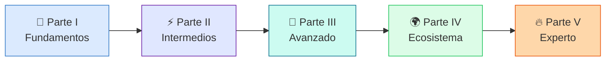

<div class="hero" markdown>

# :material-language-typescript:{ .lg } Aprende TypeScript

<p class="subtitle">De Python a TypeScript — Guía completa para desarrolladores web</p>

<div class="badges">
  <span class="badge ts">TypeScript 5.x</span>
  <span class="badge vue">Vue 3</span>
  <span class="badge node">Node.js</span>
  <span class="badge py">Desde Python</span>
</div>

</div>

<div class="stats-grid" markdown>

<div class="stat-card" markdown>
<div class="number">24</div>
<div class="label">Capítulos</div>
</div>

<div class="stat-card" markdown>
<div class="number">10</div>
<div class="label">Semanas</div>
</div>

<div class="stat-card" markdown>
<div class="number">160+</div>
<div class="label">Ejercicios</div>
</div>

<div class="stat-card" markdown>
<div class="number">130+</div>
<div class="label">Flashcards</div>
</div>

<div class="stat-card" markdown>
<div class="number">60+</div>
<div class="label">Quizzes</div>
</div>

<div class="stat-card" markdown>
<div class="number">1</div>
<div class="label">Proyecto real</div>
</div>

<div class="stat-card" markdown>
<div class="number">70+</div>
<div class="label">Preguntas conceptuales</div>
</div>

<div class="stat-card" markdown>
<div class="number">48</div>
<div class="label">Micro-ejercicios</div>
</div>

<div class="stat-card" markdown>
<div class="number">24</div>
<div class="label">Code Evolutions</div>
</div>

<div class="stat-card" markdown>
<div class="number">24</div>
<div class="label">Misconception Boxes</div>
</div>

</div>

---

## 🎯 ¿Para quién es este libro?

Este libro está diseñado para **desarrolladores que ya saben programar** (especialmente en Python/Django) y quieren dominar TypeScript a nivel profesional. No es un libro de programación básica: asume que entiendes variables, funciones, bucles, clases y conceptos de web.

!!! tip "Tu perfil ideal"
    - :mortar_board: Estudiante de DAW o ingeniero junior
    - :snake: Conocimiento medio-avanzado en Python/Django
    - 🌐 Quieres hacer frontend profesional (Vue 3) y/o backend (Node.js)
    - :rocket: Necesitas TypeScript para un proyecto real (como MakeMenu)

---

## :world_map: Ruta de aprendizaje

<div class="roadmap-path" markdown>

<div class="roadmap-step" markdown>
<div class="roadmap-dot part-i">I</div>
<div class="roadmap-content" markdown>

#### :blue_book: Parte I — Fundamentos (Semanas 1-2)

Capítulos 1-4 · Tipos básicos, interfaces, funciones tipadas

</div>
</div>

<div class="roadmap-step" markdown>
<div class="roadmap-dot part-ii">II</div>
<div class="roadmap-content" markdown>

#### :purple_circle: Parte II — Tipos intermedios (Semanas 3-4)

Capítulos 5-8 · Uniones, generics, enums, utility types

</div>
</div>

<div class="roadmap-step" markdown>
<div class="roadmap-dot part-iii">III</div>
<div class="roadmap-content" markdown>

#### :large_blue_diamond: Parte III — Avanzado (Semanas 5-7)

Capítulos 9-13 · Clases, módulos, mapped/conditional types, type-level programming

</div>
</div>

<div class="roadmap-step" markdown>
<div class="roadmap-dot part-iv">IV</div>
<div class="roadmap-content" markdown>

#### :green_book: Parte IV — Ecosistema (Semana 8)

Capítulos 14-16 · Vue 3 + TS, Node.js + TS, proyecto final MakeMenu fullstack

</div>
</div>

<div class="roadmap-step" markdown>
<div class="roadmap-dot part-v">V</div>
<div class="roadmap-content" markdown>

#### :fire: Parte V — Nivel Experto (Semanas 9-10)

Capítulos 17-20 · Varianza, patrones de librerías, rendimiento a escala, testing de tipos, crea tu propia librería

</div>
</div>

</div>



---

## :mortar_board: Lo que aprenderás

<div class="chapter-objective" markdown>

#### :blue_book: Parte I — Fundamentos (Caps. 1-4)

Al completar esta parte serás capaz de:

- Configurar un proyecto TypeScript profesional con `tsconfig.json` optimizado
- Tipar variables, funciones y objetos con confianza usando `string`, `number`, `boolean`, arrays y tuplas
- Diseñar contratos de datos con `interface` y `type` para modelar entidades como `Mesa`, `Plato` y `Pedido`
- Escribir funciones con tipado completo: parámetros opcionales, por defecto, rest params y overloads

</div>

<div class="chapter-objective" markdown>

#### :purple_circle: Parte II — Tipos intermedios (Caps. 5-8)

Al completar esta parte serás capaz de:

- Manejar uniones discriminadas y narrowing para modelar estados complejos de la aplicación
- Crear funciones y estructuras genéricas reutilizables con constraints
- Usar enums y literal types para representar valores finitos del dominio
- Dominar utility types (`Partial`, `Pick`, `Omit`, `Record`) para transformar tipos existentes

</div>

<div class="chapter-objective" markdown>

#### :large_blue_diamond: Parte III — Avanzado (Caps. 9-13)

Al completar esta parte serás capaz de:

- Implementar clases con visibilidad, herencia y patrones como Singleton y Strategy en TypeScript
- Organizar código con módulos ES, namespaces y barrel exports
- Construir mapped types y conditional types para generar tipos derivados automáticamente
- Aplicar type-level programming: template literal types, recursive types e inferencia avanzada con `infer`

</div>

<div class="chapter-objective" markdown>

#### :green_book: Parte IV — Ecosistema (Caps. 14-16)

Al completar esta parte serás capaz de:

- Desarrollar componentes Vue 3 con Composition API y tipado completo (`defineProps`, `defineEmits`, composables)
- Crear APIs REST con Node.js/Express totalmente tipadas, desde rutas hasta middleware
- Construir MakeMenu fullstack: un proyecto SaaS real integrando Vue 3 + Node.js + TypeScript

</div>

<div class="chapter-objective" markdown>

#### :fire: Parte V — Nivel Experto (Caps. 17-20)

Al completar esta parte serás capaz de:

- Entender varianza (covarianza, contravarianza) y su impacto en la seguridad de tipos
- Aplicar patrones avanzados de librerías: builder pattern, branded types, type-safe event emitters
- Optimizar rendimiento del compilador en proyectos a gran escala con project references
- Diseñar, publicar y testear tu propia librería TypeScript con una API pública type-safe

</div>

---

!!! success "Nuevo en esta edición"

    Esta guía ha sido reforzada con **elementos pedagógicos de vanguardia** basados en investigación educativa de las mejores universidades:

    - :brain: **Preguntas conceptuales** (estilo MIT OpenCourseWare) — Antes de cada sección clave, activan el pensamiento crítico. No son sobre sintaxis, sino sobre *por qué* TypeScript funciona así.

    - :warning: **Misconception Boxes** (Harvard Peer Instruction) — Cajas que anticipan los errores más comunes de desarrolladores que vienen de Python. Cada una explica *por qué* piensas X, *por qué* es incorrecto y *cuál* es el modelo mental correcto.

    - :pencil: **Micro-ejercicios inline** — Ejercicios breves de 2-3 minutos integrados en el flujo de lectura. Practicas cada concepto *justo cuando lo aprendes*, sin esperar al final del capítulo.

    - :chart_with_upwards_trend: **Code Evolution** (v1 novato, v2 mejorado, v3 profesional) — Cada capítulo muestra la evolución de código real: desde la solución ingenua hasta la profesional, explicando *qué* mejora y *por qué* en cada paso.

    - :bulb: **Consejos Pro de producción** — Consejos directos de proyectos reales que marcan la diferencia entre código que funciona y código que escala.

    - :link: **Connection Boxes entre capítulos** — Cajas que conectan el concepto actual con lo que viste antes y lo que verás después, construyendo un mapa mental coherente.

---

## :sparkles: ¿Qué hace diferente a este libro?

### :brain: Sistema de aprendizaje basado en evidencia

Este libro integra técnicas de aprendizaje probadas por la investigación en ciencias cognitivas:

| Técnica | Implementación | Base científica |
|---------|---------------|-----------------|
| **Spaced Repetition** | 130+ flashcards interactivas repartidas en 24 capítulos | Ebbinghaus, Leitner System |
| **Active Recall** | Ejercicios que te obligan a escribir antes de ver la solución | Roediger & Karpicke (2006) |
| **Elaborative Interrogation** | Comparaciones Python ↔ TypeScript que te hacen preguntar "¿por qué?" | Pressley et al. (1987) |
| **Interleaving** | Ejercicios que mezclan conceptos de capítulos anteriores | Rohrer & Taylor (2007) |
| **Concrete Examples** | Todo se aplica a MakeMenu, un proyecto SaaS real | Chi et al. (1989) |
| **Dual Coding** | Diagramas Mermaid + código + texto explicativo | Paivio (1971) |

### 📊 Taxonomía de Bloom — Niveles de aprendizaje

Cada ejercicio está etiquetado con su nivel cognitivo:

<div class="stats-grid" markdown>

<div class="stat-card" markdown>
<span class="bloom-badge remember">Recordar</span>
<div class="label" style="margin-top: 0.5rem;">Definir, identificar, nombrar</div>
</div>

<div class="stat-card" markdown>
<span class="bloom-badge understand">Comprender</span>
<div class="label" style="margin-top: 0.5rem;">Explicar, comparar, interpretar</div>
</div>

<div class="stat-card" markdown>
<span class="bloom-badge apply">Aplicar</span>
<div class="label" style="margin-top: 0.5rem;">Implementar, usar, resolver</div>
</div>

<div class="stat-card" markdown>
<span class="bloom-badge analyze">Analizar</span>
<div class="label" style="margin-top: 0.5rem;">Depurar, refactorizar, optimizar</div>
</div>

<div class="stat-card" markdown>
<span class="bloom-badge evaluate">Evaluar</span>
<div class="label" style="margin-top: 0.5rem;">Criticar, comparar enfoques, elegir</div>
</div>

<div class="stat-card" markdown>
<span class="bloom-badge create">Crear</span>
<div class="label" style="margin-top: 0.5rem;">Diseñar, construir, inventar</div>
</div>

</div>

### :snake: Comparaciones Python ↔ TypeScript

Cada concepto nuevo incluye su equivalente en Python/Django para que ancles el conocimiento:

<div class="comparison" markdown>
<div class="lang-box python" markdown>

#### :snake: En Python/Django

```python
class Mesa(models.Model):
    numero = models.IntegerField()
    zona = models.CharField(max_length=50)
    capacidad = models.IntegerField()
```

</div>
<div class="lang-box typescript" markdown>

#### 🔷 En TypeScript

```typescript
interface Mesa {
  numero: number;
  zona: string;
  capacidad: number;
}
```

</div>
</div>

### :video_game: Ejercicios variados

No solo "escribe una función". Este libro incluye:

- :pencil: **Implementación** — Escribe código desde cero
- :bug: **Depuración** — Encuentra y corrige errores de tipo
- :recycle: **Refactoring** — Convierte JavaScript a TypeScript tipado
- :jigsaw: **Type Challenges** — Puzzles de tipos a nivel avanzado
- :building_construction: **Mini-proyectos** — Construye features completas para MakeMenu
- :brain: **Quizzes interactivos** — Autoevaluación con feedback inmediato

---

## :link: Recursos curados

Links reales y verificados a:

- [TypeScript Handbook](https://www.typescriptlang.org/docs/handbook/) — La guía oficial
- [Total TypeScript (Matt Pocock)](https://www.totaltypescript.com) — El mejor recurso moderno
- [Type Challenges](https://github.com/type-challenges/type-challenges) — LeetCode para tipos
- [Vue 3 TypeScript Guide](https://vuejs.org/guide/typescript/overview.html) — Guía oficial Vue + TS

---

## :compass: Cómo usar este libro

!!! info "Ruta recomendada"
    1. **Lee el [plan de estudio](plan.md)** para tener una visión global
    2. **Sigue los capítulos en orden** — cada uno construye sobre el anterior
    3. **Haz los ejercicios** — no los saltes, el aprendizaje activo es clave
    4. **Usa las flashcards** — revisa a los 1, 3, 7 y 14 días (spaced repetition)
    5. **Responde los quizzes** — son tu termómetro de comprensión
    6. **Aplica a MakeMenu** — cada concepto debería acabar en código real
    7. **Consulta la [referencia rápida](referencia-rapida.md)** — tu cheat sheet siempre a mano

!!! warning "No hagas esto"
    - No saltes a Vue/Node sin dominar las Partes I y II
    - No copies y pegues los ejercicios — escríbelos tú
    - No uses `any` para silenciar errores — es como quitarte el cinturón de seguridad

!!! info "Atajos de teclado"
    - ++alt+f++ — Siguiente flashcard
    - ++alt+r++ — Revelar/ocultar todas las flashcards

---

<div class="site-footer" markdown>

*Creado con :blue_heart: para desarrolladores que vienen de Python.*

*Inspirado en [aprendepython.es](https://aprendepython.es/) · 2026*

</div>
