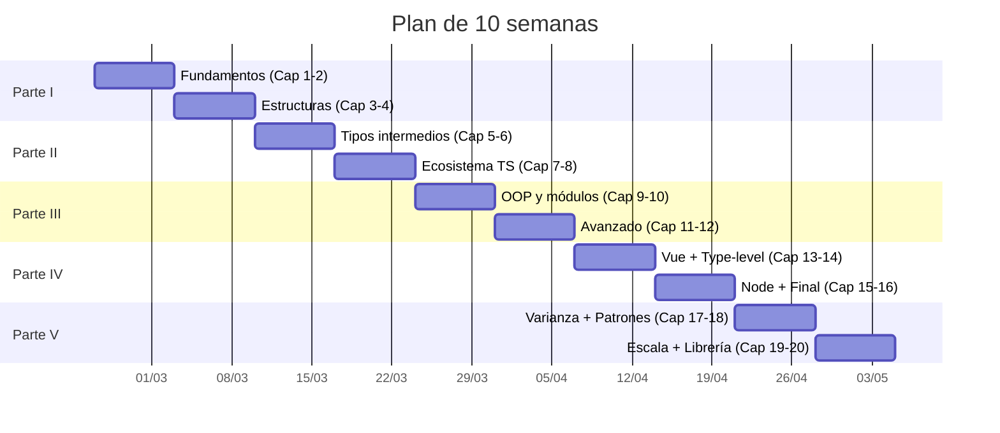
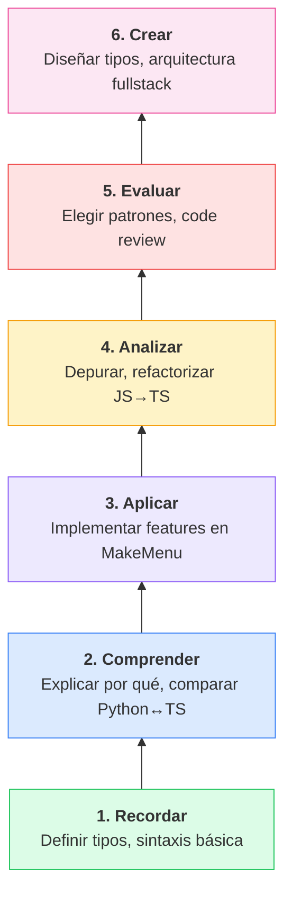
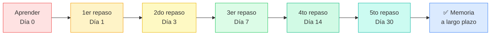

# :calendar: Plan de estudio: 10 semanas

!!! abstract "Objetivo"
    Llevar tu TypeScript de **cero a nivel experto** en 10 semanas, dedicando **1-2 horas diarias**. Cada semana tiene objetivos claros, capítulos asociados, un **reto de mitad de semana** y un checkpoint de verificación.

#### 🎯 Lo que conseguirás al completar este plan

- Dominar el sistema de tipos de TypeScript a nivel profesional
- Construir un proyecto fullstack (MakeMenu) con tipado end-to-end
- Resolver Type Challenges de nivel Medium/Hard
- Configurar y mantener proyectos Vue 3 + Node.js con TypeScript
- Aplicar patrones de diseño avanzados (generics, discriminated unions, branded types)
- Diseñar APIs de librerías con inferencia profunda (nivel autor de Zod/tRPC)
- Optimizar TypeScript a escala: monorepos, project references, rendimiento del compilador
- Crear y publicar tu propia librería tipada con testing de tipos

---

## :brain: Taxonomía de Bloom — Tu progresión cognitiva

Cada semana te lleva a un nivel más alto de pensamiento. Los ejercicios están clasificados según la [Taxonomía de Bloom](https://es.wikipedia.org/wiki/Taxonom%C3%ADa_de_Bloom):

| Semana | Nivel Bloom dominante | Tipo de ejercicios |
|--------|:---------------------:|---------------------|
| 1-2 | Recordar Comprender | Definir tipos, explicar diferencias |
| 3-4 | Comprender Aplicar | Implementar generics, usar utility types |
| 5-6 | Aplicar Analizar | Refactorizar código, depurar errores de tipo |
| 7 | Analizar Evaluar | Elegir patrones, comparar enfoques |
| 8 | Evaluar Crear | Diseñar arquitectura, crear proyecto fullstack |
| 9 | Crear Evaluar | Diseñar APIs de librerías, patrones expertos |
| 10 | Crear Evaluar | Crear librería tipada, testing de tipos, publicar |

---

## Semana 1: Fundamentos — Capítulos 1-2

### :blue_book: Parte I — Semana 1 de 2

| Día | Contenido | Nivel Bloom | Tiempo |
|-----|-----------|:-----------:|--------|
| **Lun** | Instalar TS, configurar `tsconfig.json` | Recordar | 1.5h |
| **Mar** | Tipos primitivos: `string`, `number`, `boolean` | Recordar | 1.5h |
| **Mié** | Arrays, tuplas, objetos tipados | Comprender | 1.5h |
| **Jue** | `any` vs `unknown` vs `never`, type assertions | Comprender | 1.5h |
| **Vie** | :zap: **RETO MITAD DE SEMANA**: TypeScript Playground — tipar un carrito de compras sin mirar docs | Aplicar | 1h |
| **Sáb** | 5 ejercicios de los capítulos 1-2 | Aplicar | 2h |
| **Dom** | Revisar flashcards + explicar 3 conceptos en voz alta (Feynman) | Comprender | 1h |

!!! success "Checkpoint semanal"
    Has completado la semana. Verifica tu progreso:

<h4>✅ Autoevaluación</h4>
<label><input type="checkbox"> Puedo escribir funciones básicas tipadas sin consultar documentación</label>
<label><input type="checkbox"> Sé la diferencia entre `any`, `unknown` y `never`</label>
<label><input type="checkbox"> He configurado `tsconfig.json` con opciones strict</label>
<label><input type="checkbox"> Puedo explicar qué es type inference a un compañero</label>

## Semana 2: Estructuras de datos — Capítulos 3-4

### :blue_book: Parte I — Semana 2 de 2

| Día | Contenido | Nivel Bloom | Tiempo |
|-----|-----------|:-----------:|--------|
| **Lun** | Interfaces: propiedades, opcionales, readonly | Recordar | 1.5h |
| **Mar** | Type aliases, herencia de interfaces, intersecciones | Comprender | 1.5h |
| **Mié** | Funciones tipadas, parámetros opcionales y default | Aplicar | 1.5h |
| **Jue** | Sobrecarga de funciones, HOF tipadas | Aplicar | 1.5h |
| **Vie** | :zap: **RETO**: Modelar TODAS las entidades de MakeMenu con interfaces (Mesa, Reserva, Pedido, Plato, Usuario) | Crear | 1.5h |
| **Sáb** | [Total TypeScript Beginners Tutorial](https://www.totaltypescript.com/tutorials/beginners-typescript) | Comprender | 3h |
| **Dom** | Revisar flashcards semanas 1-2 + quiz de autoevaluación | Evaluar | 1h |

!!! success "Checkpoint semanal"
    Has completado la semana. Verifica tu progreso:

<h4>✅ Autoevaluación</h4>
<label><input type="checkbox"> He definido todas las interfaces del proyecto MakeMenu</label>
<label><input type="checkbox"> Sé cuándo usar `interface` vs `type`</label>
<label><input type="checkbox"> Puedo tipar funciones con sobrecargas</label>
<label><input type="checkbox"> He completado el tutorial de Total TypeScript</label>

## Semana 3: Tipos intermedios — Capítulos 5-6

### :purple_circle: Parte II — Semana 1 de 2

| Día | Contenido | Nivel Bloom | Tiempo |
|-----|-----------|:-----------:|--------|
| **Lun** | Uniones, intersecciones, literal types | Comprender | 1.5h |
| **Mar** | Discriminated unions, pattern `Result<T,E>` | Aplicar | 1.5h |
| **Mié** | Generics básicos: `<T>`, restricciones `extends` | Comprender | 1.5h |
| **Jue** | Generics avanzados: defaults, múltiples params | Aplicar | 1.5h |
| **Vie** | :zap: **RETO**: Implementar `ApiResponse<T>` y `CrudService<T>` para MakeMenu | Crear | 1.5h |
| **Sáb** | 3 [Type Challenges](https://github.com/type-challenges/type-challenges) nivel Easy | Analizar | 2h |
| **Dom** | Revisar flashcards semanas 1-3 (spaced repetition día 7) | Recordar | 1h |

!!! success "Checkpoint semanal"
    Has completado la semana. Verifica tu progreso:

<h4>✅ Autoevaluación</h4>
<label><input type="checkbox"> He implementado `ApiResponse<T>` y `CrudService<T>`</label>
<label><input type="checkbox"> Sé hacer narrowing con discriminated unions</label>
<label><input type="checkbox"> Puedo escribir generics con constraints</label>
<label><input type="checkbox"> He resuelto 3 Type Challenges Easy</label>

## Semana 4: Ecosistema TS — Capítulos 7-8

### :purple_circle: Parte II — Semana 2 de 2

| Día | Contenido | Nivel Bloom | Tiempo |
|-----|-----------|:-----------:|--------|
| **Lun** | Enums, `as const`, literal types | Comprender | 1.5h |
| **Mar** | Template literal types, branded types | Aplicar | 1.5h |
| **Mié** | Utility types: `Partial`, `Pick`, `Omit`, `Record` | Aplicar | 1.5h |
| **Jue** | Utility types avanzados: `Exclude`, `Extract`, `ReturnType`, `Parameters` | Analizar | 1.5h |
| **Vie** | :zap: **RETO**: Refactorizar MakeMenu — reemplazar todos los tipos manuales por utility types | Analizar | 1.5h |
| **Sáb** | 3 Type Challenges nivel Medium | Analizar | 2.5h |
| **Dom** | Revisar flashcards semanas 1-4 (día 14 para sem 1) + quiz Parte II | Evaluar | 1h |

!!! success "Checkpoint semanal"
    Has completado la semana. Verifica tu progreso:

<h4>✅ Autoevaluación</h4>
<label><input type="checkbox"> Todo el código de MakeMenu usa utility types donde corresponde</label>
<label><input type="checkbox"> Sé la diferencia entre enum y `as const`</label>
<label><input type="checkbox"> Puedo crear branded types para IDs</label>
<label><input type="checkbox"> He resuelto 3 Type Challenges Medium</label>

---

!!! example "Punto de control: Mitad del camino"
    Si has llegado aquí, ya tienes un nivel **intermedio sólido** de TypeScript. Tómate un día para:

    1. :recycle: Revisar todo el código de MakeMenu escrito hasta ahora
    2. :brain: Hacer una sesión de flashcards completa (semanas 1-4)
    3. :writing_hand: Escribir un resumen de 1 página de todo lo aprendido (Teach-Back)

---

## Semana 5: OOP y módulos — Capítulos 9-10

### :large_blue_diamond: Parte III — Semana 1 de 3

| Día | Contenido | Nivel Bloom | Tiempo |
|-----|-----------|:-----------:|--------|
| **Lun** | Clases: propiedades, constructores, modificadores | Comprender | 1.5h |
| **Mar** | Abstract, implements, herencia vs composición | Analizar | 1.5h |
| **Mié** | ES Modules, import/export, type-only imports | Aplicar | 1.5h |
| **Jue** | Barrel exports, declaration files, ambient modules | Aplicar | 1.5h |
| **Vie** | :zap: **RETO**: Reorganizar MakeMenu con estructura de carpetas profesional + barrel exports | Crear | 1.5h |
| **Sáb** | Leer código fuente de una librería Vue tipada (e.g., VueUse) | Analizar | 2h |
| **Dom** | Flashcards semanas 3-5 + explicar decorators a un compañero | Evaluar | 1h |

!!! success "Checkpoint semanal"
    Has completado la semana. Verifica tu progreso:

<h4>✅ Autoevaluación</h4>
<label><input type="checkbox"> MakeMenu tiene estructura de carpetas profesional con barrel exports</label>
<label><input type="checkbox"> Sé la diferencia entre herencia y composición en TS</label>
<label><input type="checkbox"> Puedo crear declaration files (.d.ts)</label>
<label><input type="checkbox"> He leído y entendido código de una librería tipada</label>

## Semana 6: Tipos avanzados — Capítulos 11-12

### :large_blue_diamond: Parte III — Semana 2 de 3

| Día | Contenido | Nivel Bloom | Tiempo |
|-----|-----------|:-----------:|--------|
| **Lun** | Mapped types: `{ [K in keyof T]: ... }` | Comprender | 1.5h |
| **Mar** | Conditional types, `infer`, distributive behavior | Analizar | 1.5h |
| **Mié** | Type guards: `typeof`, `instanceof`, custom predicates | Aplicar | 1.5h |
| **Jue** | Zod: validación runtime + inferencia de tipos | Aplicar | 1.5h |
| **Vie** | :zap: **RETO**: Implementar validación Zod completa en todas las rutas API de MakeMenu | Crear | 1.5h |
| **Sáb** | 5 Type Challenges nivel Medium | Analizar | 3h |
| **Dom** | Flashcards + quiz de autoevaluación Parte III | Evaluar | 1h |

!!! success "Checkpoint semanal"
    Has completado la semana. Verifica tu progreso:

<h4>✅ Autoevaluación</h4>
<label><input type="checkbox"> Puedo implementar mapped types como `MyPartial<T>`</label>
<label><input type="checkbox"> Entiendo conditional types con `infer`</label>
<label><input type="checkbox"> Validación Zod implementada en todas las rutas API</label>
<label><input type="checkbox"> He resuelto 5 Type Challenges Medium</label>

## Semana 7: Vue + Type-level — Capítulos 13-14

### :green_book: Parte IV — Semana 1 de 2

| Día | Contenido | Nivel Bloom | Tiempo |
|-----|-----------|:-----------:|--------|
| **Lun** | Type-level programming: recursive types, pattern matching | Analizar | 1.5h |
| **Mar** | `satisfies`, string manipulation types, type arithmetic | Aplicar | 1.5h |
| **Mié** | Vue 3 + TS: `defineProps`, `defineEmits`, `defineModel` | Aplicar | 1.5h |
| **Jue** | Composables tipados, Pinia stores, Vue Router tipado | Aplicar | 1.5h |
| **Vie** | :zap: **RETO**: Tipar completamente TODOS los componentes Vue de MakeMenu | Crear | 2h |
| **Sáb** | Pinia stores tipados + 2 Type Challenges Hard | Evaluar | 3h |
| **Dom** | Flashcards completas (todas las semanas) | Recordar | 1h |

!!! success "Checkpoint semanal"
    Has completado la semana. Verifica tu progreso:

<h4>✅ Autoevaluación</h4>
<label><input type="checkbox"> Todos los componentes Vue con tipado completo</label>
<label><input type="checkbox"> Puedo escribir tipos recursivos</label>
<label><input type="checkbox"> Al menos 1 Type Challenge Hard resuelto</label>
<label><input type="checkbox"> Pinia stores tipados correctamente</label>

## Semana 8: Backend + proyecto final — Capítulos 15-16

### :green_book: Parte IV — Semana 2 de 2

| Día | Contenido | Nivel Bloom | Tiempo |
|-----|-----------|:-----------:|--------|
| **Lun** | Node.js + Express tipado, middleware con generics | Aplicar | 1.5h |
| **Mar** | Prisma ORM: modelos, relaciones, transacciones | Aplicar | 1.5h |
| **Mié** | Conectar frontend Vue + backend Express de MakeMenu | Crear | 2h |
| **Jue** | Testing con Vitest: servicios, rutas, componentes | Evaluar | 1.5h |
| **Vie** | :zap: **RETO FINAL**: Deploy completo + documentar arquitectura | Crear | 2h |
| **Sáb** | Revisión final de todo el proyecto + code review personal | Evaluar | 3h |
| **Dom** | 🏆 Retrospectiva: escribir qué aprendiste y qué repetirías diferente | Evaluar | 1h |

!!! success "Checkpoint semanal"
    Has completado la semana. Verifica tu progreso:

<h4>✅ Autoevaluación</h4>
<label><input type="checkbox"> MakeMenu fullstack con TypeScript end-to-end</label>
<label><input type="checkbox"> Tests pasando con Vitest</label>
<label><input type="checkbox"> Proyecto deployado y documentado</label>
<label><input type="checkbox"> He resuelto 15+ Type Challenges (Easy+Medium+Hard)</label>
<label><input type="checkbox"> Puedo explicar TypeScript avanzado a un compañero</label>

---

!!! example "Punto de control: Proyecto completo"
    Si has llegado aquí, tu proyecto **MakeMenu** está funcionando end-to-end. Ahora vamos a llevarte al **nivel experto**:

    1. :brain: Revisa todo el código que has escrito — ¿dónde podrías mejorar el tipado?
    2. :fire: Prepárate para pensar como un **autor de librerías**, no solo un consumidor
    3. 🏆 Las próximas 2 semanas te separan de un nivel junior/mid a un nivel **senior/staff**

---

## Semana 9: Varianza y patrones de librerías — Capítulos 17-18

### :fire: Parte V — Semana 1 de 2

| Día | Contenido | Nivel Bloom | Tiempo |
|-----|-----------|:-----------:|--------|
| **Lun** | Tipado estructural vs nominal, branded types con `unique symbol` | Analizar | 1.5h |
| **Mar** | Covarianza y contravarianza: `in`/`out` annotations (TS 4.7+) | Analizar | 1.5h |
| **Mié** | Phantom types para máquinas de estado (`Pedido<"pendiente">`) | Crear | 1.5h |
| **Jue** | HKT simulation, type-safe DSL: query builder tipado | Crear | 2h |
| **Vie** | :zap: **RETO**: Implementar `EntityId<Tag>` genérico + query builder para MakeMenu | Crear | 2h |
| **Sáb** | Declaration merging, module augmentation, pipe pattern con variadic tuples | Evaluar | 3h |
| **Dom** | Flashcards semanas 7-9 + 3 Type Challenges Hard | Evaluar | 1.5h |

!!! success "Checkpoint semanal"
    Has completado la semana. Verifica tu progreso:

<h4>✅ Autoevaluación</h4>
<label><input type="checkbox"> Puedo explicar covarianza vs contravarianza con un ejemplo real</label>
<label><input type="checkbox"> He implementado branded types con `unique symbol` en MakeMenu</label>
<label><input type="checkbox"> Sé construir un DSL tipado con inferencia (query builder)</label>
<label><input type="checkbox"> Puedo usar declaration merging para extender tipos de librerías</label>

## Semana 10: Rendimiento a escala y tu propia librería — Capítulos 19-20

### :fire: Parte V — Semana 2 de 2

| Día | Contenido | Nivel Bloom | Tiempo |
|-----|-----------|:-----------:|--------|
| **Lun** | Internals del compilador: `--generateTrace`, optimización de tipos | Analizar | 1.5h |
| **Mar** | Project references, `tsc --build`, monorepo con internal packages | Aplicar | 1.5h |
| **Mié** | `isolatedModules`, `verbatimModuleSyntax`, module resolution Node16 vs Bundler | Analizar | 1.5h |
| **Jue** | Testing de tipos: `expectTypeOf`, `@ts-expect-error`, `tsd` | Evaluar | 2h |
| **Vie** | :zap: **RETO FINAL**: Crear `@makemenu/validation` — mini-Zod tipado con testing | Crear | 2.5h |
| **Sáb** | Publicación: `exports` map, `attw`, dual CJS/ESM, checklist de librería | Crear | 3h |
| **Dom** | 🏆 Retrospectiva final: portfolio, logros, plan de crecimiento continuo | Evaluar | 1h |

!!! success "Checkpoint final"
    Has completado el plan. Verifica tu progreso final:

<h4>🏆 Autoevaluación final</h4>
<label><input type="checkbox"> He creado `@makemenu/validation` con inferencia de tipos completa</label>
<label><input type="checkbox"> Los tests de tipos pasan con `expectTypeOf`</label>
<label><input type="checkbox"> Sé optimizar TypeScript a escala con project references</label>
<label><input type="checkbox"> Puedo publicar una librería con `exports` map correcto</label>
<label><input type="checkbox"> He resuelto Type Challenges Hard y puedo diseñar mis propios tipos</label>
<label><input type="checkbox"> Me siento preparado para un rol senior en TypeScript</label>

---

## 🎯 Dificultad por capítulo

| Capítulo | Dificultad | Ejercicios | Flashcards | Bloom máximo | Concepto clave |
|----------|:----------:|:----------:|:----------:|:------------:|----------------|
| 01 Bienvenido | Fácil | 5 | 5 | Comprender | Setup y tsconfig.json |
| 02 Tipos básicos | Fácil | 5 | 5 | Aplicar | Primitivos, as const, satisfies |
| 03 Interfaces | Fácil | 5 | 5 | Aplicar | Interfaces vs type aliases |
| 04 Funciones | Medio | 5 | 5 | Aplicar | Overloads, HOF, generics |
| 05 Uniones | Medio | 5 | 5 | Analizar | Discriminated unions, Result |
| 06 Generics | Medio | 5 | 5 | Analizar | Constraints, defaults, patterns |
| 07 Enums y literales | Medio | 5 | 5 | Analizar | as const, branded types |
| 08 Utility Types | Medio | 5 | 5 | Analizar | Partial, Pick, Omit, Record |
| 09 Clases | Avanzado | 5 | 5 | Evaluar | Decorators, patterns |
| 10 Módulos | Avanzado | 5 | 5 | Evaluar | Module resolution, .d.ts |
| 11 Tipos avanzados | Avanzado | 5 | 5 | Evaluar | Mapped, conditional, infer |
| 12 Type Guards | Avanzado | 5 | 5 | Evaluar | Zod, branded validation |
| 13 Type-Level | Experto | 5 | 5 | Crear | Recursión, pattern matching |
| 14 Vue 3 | Avanzado | 5 | 5 | Crear | defineProps, Pinia, Router |
| 15 Node.js | Avanzado | 5 | 5 | Crear | Express, Prisma, tRPC |
| 16 Proyecto final | Experto | 5 | 5 | Crear | Full-stack end-to-end |
| 17 Varianza y nominales | Experto | 5 | 6 | Crear | Covarianza, branded, phantom |
| 18 Patrones de librerías | Experto | 5 | 7 | Crear | HKT, DSL, pipe, declaration merging |
| 19 Rendimiento a escala | Experto | 5 | 7 | Crear | Compiler, project refs, monorepo |
| 20 Testing y librería | Experto | 5 | 6 | Crear | expectTypeOf, publicación, mini-Zod |
| **TOTAL** | | **100** | **106** | | |

---

## :brain: Técnicas de aprendizaje basadas en evidencia

### 1. Spaced Repetition (Repetición espaciada)

!!! info "La ciencia"
    La curva del olvido de Ebbinghaus muestra que olvidamos ~70% en 24h sin repaso. La repetición espaciada combate esto revisando en intervalos crecientes.

**Cómo implementarlo con este libro:**

1. Cada capítulo tiene **5-7 flashcards interactivas** al final
2. Usa las flashcards del libro (haz click para revelar la respuesta)
3. También puedes exportarlas a [Anki](https://apps.ankiweb.net/) con este formato:

| Frente | Reverso |
|--------|---------|
| ¿Qué hace `Partial<T>`? | Hace todas las propiedades de `T` opcionales |
| ¿Diferencia entre `interface` y `type`? | Interface: objetos, merging. Type: uniones, intersecciones, alias |
| ¿Qué es narrowing? | Proceso por el que TS reduce un tipo union a uno más específico |

### 2. Active Recall (Recuerdo activo)

!!! info "La ciencia"
    Roediger & Karpicke (2006) demostraron que el esfuerzo de *recordar* fortalece la memoria mucho más que *releer*. Por eso los ejercicios te piden escribir antes de ver la solución.

**Protocolo de cada sesión de estudio:**

1. :clock1: **5 min** — Escribe de memoria los conceptos clave de la sesión anterior
2. :book: **40 min** — Lee el contenido nuevo del capítulo
3. :pencil: **30 min** — Haz los ejercicios SIN mirar el capítulo
4. :mag: **10 min** — Compara tus respuestas con las soluciones
5. :brain: **5 min** — Flashcards de repaso

### 3. Elaborative Interrogation (Interrogación elaborativa)

!!! info "La ciencia"
    Pressley et al. (1987) demostraron que preguntarse *"¿por qué funciona así?"* mejora la comprensión profunda.

**Cómo usar las comparaciones Python ↔ TypeScript:**

Cada vez que veas una comparación Python ↔ TypeScript en el libro, hazte estas preguntas:

- ¿Por qué TypeScript necesita esta sintaxis y Python no?
- ¿Qué ventaja da esto en un proyecto grande?
- ¿Qué errores previene que Python no prevendría?

### 4. Interleaving (Entrelazado)

!!! info "La ciencia"
    Rohrer & Taylor (2007) demostraron que mezclar tipos de problemas mejora la transferencia de conocimiento.

Los ejercicios de cada capítulo incluyen deliberadamente problemas que requieren conceptos de capítulos anteriores. Esto no es un error — es diseño intencional.

### 5. Proyecto-Driven Learning

**No aprendas en abstracto.** Cada capítulo debe resultar en código real para MakeMenu. La regla es:

> Si aprendes un concepto, lo aplicas al proyecto **ese mismo día**.

### 6. Teach-Back Method (Método Feynman)

Explica cada concepto en voz alta como si enseñaras a alguien. Si no puedes explicarlo de forma sencilla, no lo has entendido.

!!! quote "Richard Feynman"
    *"Si no puedes explicarlo de forma sencilla, no lo entiendes lo suficiente."*

**Ejercicio semanal**: Cada domingo, elige 3 conceptos de la semana y explícalos en voz alta durante 2 minutos cada uno, sin mirar notas.

---

## ⌨️ Atajos de teclado

| Atajo | Acción |
|-------|--------|
| ++alt+f++ | Saltar a la siguiente flashcard |
| ++alt+r++ | Revelar/ocultar todas las flashcards |

---

## 🏆 Sistema de logros

Marca tus logros a medida que avanzas:

<h4>🏅 Logros desbloqueados</h4>
<label><input type="checkbox"> **Primer tipo** — Has escrito tu primera anotación de tipo</label>
<label><input type="checkbox"> **Interface master** — Has modelado todas las entidades de MakeMenu</label>
<label><input type="checkbox"> **Generic guru** — Has implementado `ApiResponse<T>` y `CrudService<T>`</label>
<label><input type="checkbox"> **Type Challenger** — Has resuelto 10+ Type Challenges</label>
<label><input type="checkbox"> **Zod validator** — Validación Zod en todas las rutas API</label>
<label><input type="checkbox"> **Vue wizard** — Todos los componentes Vue con tipado completo</label>
<label><input type="checkbox"> **Fullstack hero** — MakeMenu end-to-end con TypeScript</label>
<label><input type="checkbox"> **Type-level ninja** — Has resuelto 1+ Type Challenge Hard</label>
<label><input type="checkbox"> **Variance whisperer** — Sabes cuándo usar `in`/`out` y por qué</label>
<label><input type="checkbox"> **DSL architect** — Has construido un query builder con inferencia completa</label>
<label><input type="checkbox"> **Performance guru** — Has optimizado el compilador con `--generateTrace`</label>
<label><input type="checkbox"> **Library author** — Has creado y publicado `@makemenu/validation`</label>
<label><input type="checkbox"> **Type tester** — Tus tipos tienen tests con `expectTypeOf`</label>

